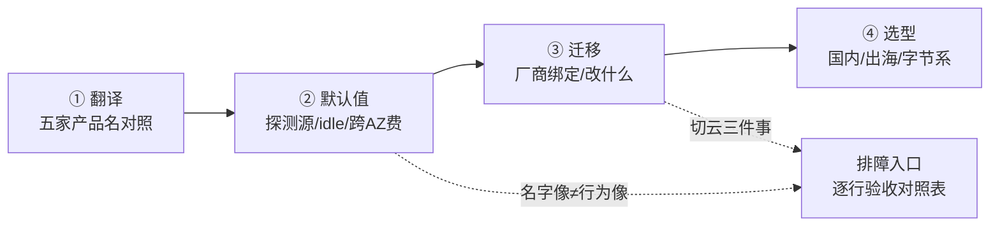
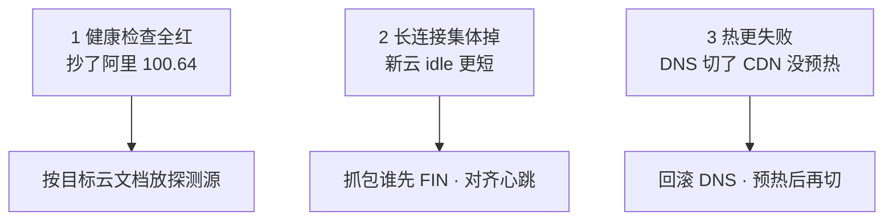
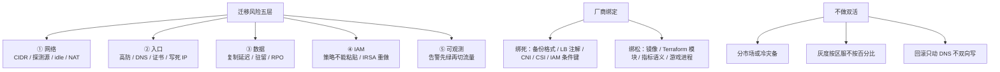
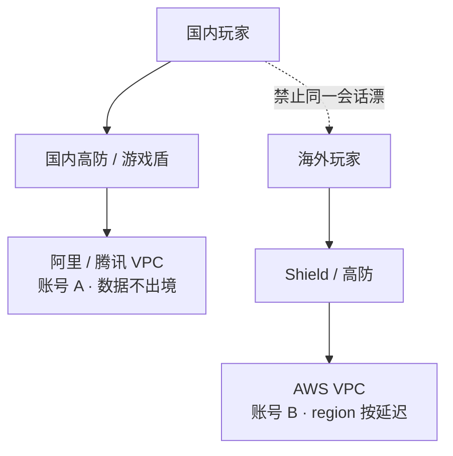
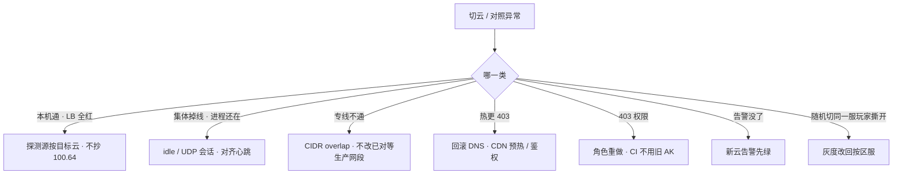

# 多云对照

> 国内阿里迁出海 AWS，机器一天迁完。切换窗口健康检查全红、长连接集体掉、热更 403——三件事都不是机型没选对。
> **本章回答**：同一个能力在五家云里叫什么、默认值差在哪、换云要改什么、各场景选谁。
> **不讲**：VPC / SG / NAT 通用排障 → [01](../01-云网络与安全/)；阿里组合、`100.64`、Terway → [06](../06-阿里云生产/)；AWS NLB / IRSA / IAM 求值 → [07](../07-AWS生产/)；火山 TOS / VKE / 沐瞳现场 → [08](../08-火山引擎生产/)；RDS / 对象存储 / Redis → [03](../03-云上存储与数据库/)；跨 AZ / NAT / CDN 账单 → [05](../05-成本治理/)；跨账号 IAM → [04](../04-IAM与多账号/)；出海区服、数据驻留 → [07-15](../../07-游戏运维专题/15-出海与多区域/)。

**标记**：🎯重点 · 🔥难点 · ⭐常考 · 🔧实操

---

## 一、一张图：一个能力的五张面孔

> 🎯 **一句话**：多云对照就四步——翻译（叫什么）→ 验默认值（差在哪）→ 迁移（改什么）→ 选型（选谁），前 06-01~08 串成一张表。



**读图**：

- 主线是四步串成一条线：翻译 → 默认值 → 迁移 → 选型。每节讲一段，切云排障时按这四步逐段问「卡在哪」。
- `TRAP` 是排障入口——切云窗口的故障永远是「名字对上了但默认值没验」或「绑死了改不动」，不是机型没选对。
- 本章是 06 模块收口章，01~08 的通用概念在这里收成一张对照表，不再重复讲机制。

---

## 二、翻译：五朵云产品名对照 🎯⭐

> 🎯 **一句话**：按能力翻译不按产品名 1:1——都叫 NLB，健康检查源和跨 AZ 计费默认值完全不同。

多云**对照**不是为了背五朵云的产品全家桶，是为了迁移和避坑。面试官问「阿里的 X 到 AWS 叫什么」，要的是能力对齐加上一句「名字像不等于默认值像」。产品对照不是 1:1 翻译表，是按能力对齐后加一句「默认值差在哪」。

### 能力对照表

| 能力 | 阿里云 | AWS | 腾讯云 | 火山引擎 | GCP |
|------|--------|-----|--------|----------|-----|
| VPC / 子网 | VPC + 交换机（绑 AZ） | VPC + Subnet（绑 AZ） | VPC + 子网 | VPC + 子网 | **全球 VPC** + 区域子网 |
| 公网出口 | NAT 网关 | NAT Gateway | NAT 网关 | NAT 网关 | Cloud NAT |
| 实例防火墙 | 安全组（有状态） | Security Group | 安全组 | 安全组 | VPC firewall（层级不同） |
| 子网 ACL | 网络 ACL | NACL | ACL | 网络 ACL | 少用，防火墙为主 |
| 计算 | ECS（禁 t 突发） | EC2（禁 T burstable） | CVM | ECS | GCE |
| L4 负载 | CLB / NLB | **NLB** | CLB | CLB | Passthrough NL |
| L7 负载 | ALB | ALB | 应用型 CLB | ALB | URL map / GCLB |
| 对象存储 | OSS | S3 | COS | TOS | GCS |
| 托管 K8s | ACK + Terway | EKS + VPC CNI | TKE | VKE | GKE（Autopilot 另说） |
| IAM | RAM + STS | IAM + STS | CAM | IAM | IAM 绑资源 |
| 日志 | SLS | CloudWatch Logs | CLS | TLS | Cloud Logging |
| 国内高防 | 高防 IP / 游戏盾 | Shield（国内区弱） | 高防 / 游戏盾 | 高防 | Cloud Armor（偏 L7） |
| 专线 | 高速通道 | Direct Connect | 专线接入 | 专线 | Interconnect |

> ⚠️ **别混**：**名字像 ≠ 默认值像**。阿里 NLB 和 AWS NLB 都是 L4，但 client IP 保留、健康检查源、跨 AZ 计费默认值不同。抄名字只说明产品能买到，不说明行为一致。**用了 K8s 就可搬**也是错的——Service `LoadBalancer` 注解和 CNI 都是**云绑定**，改注解可能重建 LB、地址会变，客户端写死 IP 全军覆没。

### GCP 的全球 VPC 差在哪

GCP 的 VPC 是**全球 VPC + 区域子网**，和国内云的「地域 VPC」不是同一张图——跨 region 内网是**默认能力**，不需要对等。但游戏区服仍要按延迟和数据驻留切区域，不要被「全球 VPC」带去画一张 Anycast。GKE Autopilot 对有状态战斗服不友好（Pod 不能绑固定 IP、弹性策略受限），标准 GKE 才适合战斗服。Cloud Armor 偏 L7 防护，L3/L4 仍需第三方高防。国内游戏岗极少 GCP 主场，点到差异即可——面试时说出「GCP 全球 VPC 跨 region 内网默认通，但区服仍按延迟和驻留切」就够。

### 腾讯云和火山怎么对照

腾讯云和阿里云对游戏团队来说**模型接近**：CVM 同样有突发性能型要禁；CLB 长连接、COS + CDN 热更、TKE 网络插件同样吃 VPC IP。差异在 **CAM**（条件键和角色扮演流程不同，策略不能粘贴）、高防 / 游戏盾产品形态、地域覆盖、商务。技术用「模型相同、操作面不同」就够，选哪家看团队熟练度、高防和商务、已有专线，技术模型不是决定项。不要编「腾讯更懂游戏」。

**腾讯不单开课**的原因：模型和阿里太接近，单独开课会变成产品名列表。对照层用本节的一张表即可——面试时说出「腾讯模型接近阿里，差异在 CAM、高防形态、商务」就够。真要在腾讯跑生产，操作细节和阿里 06 章可迁移，高防 / 游戏盾的 CNAME 和回源网段必须当新系统验收，不能「和阿里一样勾一下」。CAM 和 RAM 都是身份 + 策略，但条件键和角色扮演流程不同，策略不能粘贴。

火山引擎与阿里**同构**：VPC / 安全组 / CLB / TOS / VKE 排障思路可迁移。但**禁止照抄阿里 `100.64.0.0/10`**——健康检查源每家不同。没用过火山的标准说法：「我没在火山上跑过生产，但 NAT SNAT、SG 探测源、对象存储公共读这三件事我按同一套 SOP 验收；健康检查源我会先查文档和流日志，不搬阿里的网段。」目标是字节或简历写了火山，再看 [08](../08-火山引擎生产/)。

### 跨云同坑：换了云也不会消失的三件事

有些坑不是因为选错了云，是所有云都有。换云不能消灭它们，只能逐行验收：

- **突发性能实例**：ECS `t` / EC2 `T` / CVM 突发型，CPU 信用耗尽后卡帧——游戏一律禁，跨云都禁。
- **对象存储公共读**：OSS / COS / S3 / TOS 设了公共读都会变成下载费炸弹——跨云同坑。
- **源站裸 EIP**：ECS 绑 EIP + SG `0.0.0.0/0` 在所有云都危险，源站 IP 泄漏后被 DDoS 直打——跨云同坑。

这三条不是某家云的特产，是「云的通用属性」。切云时要在验收清单里单独打勾，不能因为换了云就跳过。

> 📝 **面试**：「多云按能力翻译：CLB ≈ NLB、OSS ≈ S3、RAM ≈ IAM；切云必须单独验探测源和 idle。腾讯模型接近阿里，火山同构但不抄 `100.64`。突发规格、公共读、裸 EIP 是跨云同坑，换了云也不消失。」

---

## 三、默认值差异：名字像不等于行为像 🎯⭐🔥

> 🎯 **一句话**：健康检查源、LB idle、跨 AZ 计费每家默认值不同，切云必须逐行验收，不能照搬旧云配置。

> 💡 **打个比方**：像跨国搬家——都叫「负载均衡」，但健康检查源、idle 超时、跨 AZ 计费默认值各不同，不能照搬国内的配置就开门营业。

### 默认值差异对照表

| 项 | 阿里云 | AWS | 腾讯 / 火山 | 切换必测 |
|----|--------|-----|-------------|----------|
| VPC 模型 | 地域 VPC + 交换机绑 AZ | 地域 VPC + Subnet 绑 AZ | 同国内云；火山同构 | CIDR 无重叠，否则专线 / 对等做不了 |
| **探测源** | CLB：`100.64.0.0/10` | NLB 节点 IP / LB SG | **禁止抄 `100.64`**；查文档和流日志 | 本机通、LB 全红 |
| L4 vs L7 | 长连接 CLB/NLB；HTTP ALB | 长连接 **NLB**；HTTP ALB | CLB 长连接；应用型走 HTTP | 自定义 TCP 接到 ALB = 随机断线 |
| client IP 保留 | 产品默认不同 | NLB preserve：后端见玩家 IP | 以文档为准 | SG 两套：业务端口 + 检查源 |
| **LB idle** / UDP 会话 | TCP 可调，默认常短于心跳 | ALB 默认 60s；NLB TCP ~350s | 各家不同 | 心跳更长的一侧切换窗口集中断线 |
| **NAT** | 端口水位 / 并发 | `ErrorPortAllocation`；**处理费贵** | 同 SNAT 模型 | 每 AZ 一个；大流量走内网 endpoint |
| **跨 AZ 流量** | 延迟 0.5–2ms | **明确计费** | 以账单为准 | AWS 多 AZ 计算面账单先炸 |
| 内网拉镜像 / 对象 | OSS 内网域名 | S3 / ECR VPC Endpoint | TOS 内网域名 | 开服前夜穿 NAT = 带宽 + 钱一起爆 |
| SG vs NACL | SG 主控，有状态 | 同左 | 同左 | 改 SG 旧长连接可能还活（conntrack） |
| 专线 | 高速通道 | Direct Connect | 专线接入 | 玩家不走专线；UDP 先测 MTU |

安全组源写 `0.0.0.0/0` 在所有云都危险，但「LB 探测网段」每家不一样，照抄必出健康检查事故。**对象存储公共读**在 OSS / COS / S3 / TOS 都会变成下载费炸弹。突发性能实例各家都有便宜规格，游戏一律禁。这三条是跨云同坑。

### 探测源：最容易抄错的一行 🔧🔥

> 🔍 **现场**：切云当天最经典的事故——本机 `curl` 200，LB 后端全红。

```bash
curl -v 127.0.0.1:$port
# * Connected to 127.0.0.1 ... 200 OK   # ← 本机通，但 LB 控制台仍 Unhealthy
# ← 探测源被 SG 拦了，不是进程没起
```

阿里 CLB 探测源是 `100.64.0.0/10`（链路本地段），AWS 是 LB 自己的 ENI / 节点网段，火山引擎**禁止照抄 `100.64`**。止血：按目标云文档放行探测源，观察 Unhealthy 变 Healthy 再收紧。根因是变更只测了「我从堡垒 ssh 再 curl」，没测 LB 真实探测源。

**为什么探测源不能照抄**：每家云的 LB 健康检查源由该云的 LB 服务决定，不是通用标准。阿里 CLB 用 `100.64.0.0/10` 是因为阿里 SLB 的探测架构走的链路本地段；AWS NLB 用自己的 ENI / 节点 IP；火山引擎有自己的一套。后端 SG 没放目标云的探测源，LB 探测全失败 → 后端全红，跟你能不能 curl 通无关。治理：backend SG 强制写探测源规则，上线 checklist 必含「LB 控制台健康检查变绿」。

### LB idle：心跳和 idle 谁先到 🎯🔥

LB 有个空闲超时（**idle timeout**），连接静默超过这个时间 LB 主动 FIN/RST。游戏心跳 5 分钟一次，新云 idle 默认 60 秒——LB 静默拆连接，客户端以为还在线，发数据才发现。

```text
14:30:00 ... idle 到期, LB → 后端 FIN/RST   # ← LB 静默拆
14:30:00 ... 后端进程仍在, 无异常退出       # ← 进程没挂
14:35:00 ... 客户端发心跳, 才发现连接已断   # ← 玩家以为还在线 5 分钟
```

止血：心跳间隔 < idle timeout 的 **1/3**，或调大 idle（有上限）。UDP 无连接，LB 用会话超时，超时后五元组漂移到别的后端——跨云切换后集体掉线，优先怀疑新云 idle / UDP 会话超时默认值更短。

**为什么是 1/3 不是 1/2**：心跳 < idle 的 1/2 理论上够，但实际中网络抖动、重传、GC 停顿会让心跳发晚。1/3 给两倍余量，确保 idle 到期前至少有一个心跳把连接刷活。UDP 会话超时更短（常 10–60s），跨云切换后 UDP 玩家集体掉线优先查这个，不要只查 TCP idle。

抓包看谁先 FIN / RST 是定位 idle 断连的关键一步——如果 LB 先发 FIN，是 idle 到期；如果后端先发 RST，是进程主动断。两种病处理方式完全不同。

### 跨 AZ 计费：AWS 明确计费 🔥

AWS 跨 AZ 流量**明确计费**——逻辑服互相打的 East-West 流量会把账单打穿。国内云跨 AZ 通常延迟 0.5–2ms 但不计费或计费方式不同。跨云切换时，从国内云搬到 AWS 多 AZ 部署，账单会先炸。这也是为什么国内云多 AZ 部署更随意（逻辑服可以跨 AZ 互打 RPC），而 AWS 上要刻意把同区服进程放同 AZ 以省跨 AZ 流量费。

NAT 处理费也差：AWS NAT Gateway 按处理字节计费，大流量穿 NAT 的处理费可能比带宽本身还贵。国内云 NAT 端口水位和并发是主要瓶颈。所有云的解药一样：镜像和对象存储改 VPC 内网 endpoint（OSS 内网域名 / S3 Gateway Endpoint / TOS 内网域名），大流量不要穿 NAT。开服前夜拉镜像穿 NAT 是经典事故——带宽和处理费一起爆。

### CNI 与 IP 分配：跨云都按 Pod 占 IP 🔧

> 🎯 **一句话**：所有云的托管 K8s 网络插件都按 **Pod** 占 IP——Terway（阿里）/ VPC CNI（AWS）/ TKE / VKE 插件都一样，给节点池划 `/24` 会耗尽。

```text
kubectl describe po <pending-pod>
#   Warning  FailedScheduling  ... insufficient IP      # ← 子网 IP 耗尽
# ← 止血：加 secondary CIDR 或新子网，不缩节点、不改已对等生产网段
```

64 台 × 30 Pod 要 1920 个 IP，`/24` 只有 254 个——跨云同坑。止血都是加网段，不缩节点。GKE Autopilot 对有状态战斗服不友好（Pod 不能绑固定 IP、弹性策略受限）。**战斗服不用 ECI / Fargate / Spot**——有状态 + 突发回收 = 翻车。节点角色要瘦（EKS node role 不给 `s3:*`），PDB 挡着不要 `--force` 驱逐。这些规则在 ACK / EKS / TKE / VKE / GKE 通用，不是某一家的事。

> ⚠️ **别混**：CNI 是**云绑定**的——Terway 和 VPC CNI 不能互换，跨云切 K8s 要重装 CNI。但 IP 耗尽的解法跨云一样：加网段。
> 📝 **面试**：「所有云的托管 K8s 都按 Pod 占 IP，`/24` 是经典事故；战斗服不用 ECI / Fargate / Spot；CNI 是云绑定的，Terway 和 VPC CNI 不能互换。」

> ⚠️ **别混**：各家健康检查源、LB 超时、跨 AZ 计费都要**单独验收**。名字都叫 NLB 不等于超时一样。突发规格、公共读、源站裸 EIP 是跨云同坑——不因换了云就消失。

> 📝 **面试**：「切云 / 开新 region 用对照表当验收：探测源不抄 `100.64`、idle 和心跳对齐、AWS 跨 AZ 计费、NAT 大流量走内网 endpoint、CNI 跨云不通用。」

---

## 四、迁移：厂商绑定与换云要改什么 🎯⭐🔥

> 🎯 **一句话**：迁云难在网络 / 入口 / 数据 / IAM / 观测，不是改 ECS 机型——计算面一天迁完，真正炸的是入口默认值和厂商绑定。

> 💡 **打个比方**：像搬写字楼——桌椅（服务器）一天搬完，但门牌号（DNS）、门禁卡（IAM）、档案柜（数据库备份格式）、前台电话（告警）每一样都要重新配，照搬只会全卡住。

### 迁移风险排序

| 风险序 | 什么 | 为什么炸 |
|--------|------|----------|
| 1 网络 | CIDR 重叠；探测源、NAT、LB idle 默认值不同 | 专线做不了；切换窗口集中断线 |
| 2 入口 | 高防 / DNS / 证书 / 客户端写死 IP | TTL、双入口并行、源站 SG 只放新高防回源 |
| 3 数据 | 跨云复制延迟、驻留合规 | RPO 以校验过的备份为准 |
| 4 IAM | RAM 策略不能粘贴成 IAM JSON | IRSA / RRSA 要重做；CI 用旧 AK 是切日第二常见事故 |
| 5 可观测 | SLS 查询和告警不会跟着 VM 走 | 切日不搬告警 = 裸奔 |

机器改名是最简单的一步。真正难的是这五层，按风险从高到低排序。

### 厂商绑定：绑得死的 vs 绑得松的 🔥

| 对比 | 绑得死（不可移植） | 绑得松（可迁移） |
|------|-------------------|------------------|
| 什么 | 托管库备份格式、日志查询语言、IAM 条件键、LB 注解、HPA 用的云指标名 | 自己的 AMI / 镜像、Terraform 模块（per-cloud provider）、Prometheus 业务指标、游戏进程本身 |
| 迁移时 | 重做或重写，不能粘贴 | 模板同源、运行时分叉 |

有人说「我们用了 K8s 所以可搬」——**K8s 消灭不了 `LoadBalancer` 注解和 CNI 的云绑定**。改注解可能重建 LB、地址会变，客户端写死 IP 会全军覆没。CSI（云盘）也是云绑定——跨云 restore 托管库备份格式不兼容。HPA 用的云指标名也跨云不通用——各家指标名不同，HPA 引用要在目标云重做。

**Terraform** 让「在同一朵云重建」可重复，per-cloud provider 仍然绑产品 API，不能 `apply` 换 provider。真正可迁移的是：CIDR 规划文档、镜像构建、应用配置、监控指标语义。Terraform 不能消灭锁定，只能让「重建」可重复。

日志查询语言也是绑定——SLS 查询语法和 CloudWatch Logs Insights 不能粘贴，告警规则要在目标云重写。这些「绑死」的东西在迁移时要逐项重做，不能靠「粘贴 + apply」一步到位。

> ⚠️ **别混**：**厂商绑定（lock-in）最怕的不是 ECS 主机名**，而是托管库备份格式（restore 不到另一家）+ 游戏客户端写死的入口 IP（切不了高防 / LB）。IAM 策略不能粘贴：RAM JSON 粘到 IAM 会字段名、条件键全错，CI 用旧 AK 打新云是切日第二常见事故。

### 游戏不做流量双活 🎯🔥

> 💡 **打个比方**：双活像两家分店共用一个厨房——菜要从 A 店送到 B 店，跨城送菜（跨云 RTT）和两人同时炒同一锅（一致性）会把整个流程拖死。合理做法是分市场各开各的店，或冷灾备——B 店备好灶但平时不开火。

游戏不做跨云流量双活。有状态、长连接、匹配和区服数据跨云 RTT 和一致性扛不住，还要两套 IAM / 网络 / 告警。合理策略：

- **分市场**：国内一朵（阿里 / 腾讯）、海外一朵（AWS），账号 / 数据隔离，同一战斗会话不跨云漂。
- **冷灾备**：RTO 小时 / 天级，至少真 restore 过一次到目标云隔离环境测 RTO。
- **入口高防可以和计算不同家**：DNS + 高防供应商可以不和计算同一家，降低单一清洗商绑定。

**冷灾备验收**：只把快照复制过去、从未拉起，地域故障那天才会发现 IAM、网络、DNS 都没备好。跟着走：在目标云隔离 VPC 里拉起一份库，校验行数 / 账本，再测从 DNS 切到这份环境要多久。GSLB / DNS 权重切流前确认两边健康检查都绿。

**只复制快照不算冷灾备**的原因：快照复制只保证了数据层有备份，但 IAM 角色、网络 CIDR、DNS 记录、证书、高防回源、告警通道都没在目标云上验证过。地域故障那天才发现这些都没备好，RTO 不是「快照复制完成时间」，而是「从故障到完全恢复服务的时间」。真 restore 测过才知道这个数字。冷灾备的验收标准是：在目标云隔离 VPC 里拉起一份库 → 校验行数 / 账本 → 测从 DNS 切到这份环境要多久 → 两边健康检查都绿。

### 灰度按区服，不按随机百分比 ⭐

游戏灰度按**区服**切，不按「10% 玩家」随机切——会话和区服绑定，随机切会把同一服玩家撕开：匹配失败、好友不在、充值账本对不上。先小服进真实玩家，对账 CCU / 登录 / 充值，再大服。

### 迁移 runbook 与验收清单 🔧

> 🎯 **一句话**：迁移按网络 → 数据 → 演练 → 小服 → 大服五步走，每步可回滚；验收清单逐行打勾才算过。

迁移不是「apply 换 provider」，是按风险从高到低五步：

1. **网络连通**：CIDR 无重叠、专线 / 对等打通、NAT 和 IGW 路由表正确
2. **数据校验**：快照 restore 后校验行数 / 账本，RPO 以校验过的为准
3. **无流量演练**：不进玩家，把入口从 DNS 到 LB 到后端跑一遍
4. **小服进真实玩家**：对账 CCU / 登录 / 充值，灰度按区服
5. **大服**：任一步失败只回滚 DNS，数据以源云为主

跨云验收清单（名字对上了也不算过）：

```text
# 逐行打勾
[ ] CIDR 无重叠，专线 / 对等能通
[ ] 探测源按目标云文档放行（不抄 100.64）
[ ] LB idle / UDP 会话超时与心跳对齐
[ ] 对象存储公共读 + 内网回源（OSS / S3 / TOS endpoint）
[ ] IAM 角色重做（IRSA / RRSA Trust sub 重做，CI 不用旧 AK）
[ ] 告警在新云先绿（SLS / CloudWatch 通道跑通）
[ ] 证书和 GM 白名单在新入口生效
[ ] 突发规格黑名单、无 EIP 裸奔
[ ] CDN 预热完成、命中率抽检
[ ] K8s 注解换了 LB 地址变了 → 客户端走域名
```

> 💡 **打个比方**：像搬写字楼——桌椅（服务器）一天搬完，但门牌号（DNS）、门禁卡（IAM）、档案柜（数据库备份格式）、前台电话（告警）每一样都要重新配，照搬只会全卡住。迁移 runbook 就是搬家公司的 checklist：先把水电（网络）通好，再搬档案（数据），空跑一遍（演练），小部门先进（小服），再全公司搬（大服）。

### 切云当天三件事 🔧🔥

> 🔍 **现场**：机器已经迁完，DNS 准备切。三件事都不是「ECS 没迁完」。



1. **本机 curl 200、LB Unhealthy** — 探测源抄了 `100.64.0.0/10`。按目标云文档放行，对流日志看真实源。
2. **进程还在、玩家集体掉线** — 抓包看谁先 FIN / RST。新云 idle 更短（心跳 5 分钟、idle 60 秒是经典组合）。对齐心跳到 idle 的 1/3。UDP 会话超时单独测。
3. **登录通、热更 403 / 超时** — DNS 切了 CDN 还指着空桶或鉴权失败。回滚 DNS，预热完成、命中率抽检后再切。

K8s 注解换了重建 LB，地址变了——客户端必须走域名。告警通道也要在新云先绿：切日不搬 SLS / CloudWatch 告警 = 裸奔。证书和 GM 白名单必须在新入口先生效，否则 443 失败或发奖被拒，看起来像「云挂了」。

> ⚠️ **别混**：K8s 注解换了 LB 重建后**地址会变**——客户端写死 IP 会全军覆没。必须用域名。LB 注解是**云绑定**的，改注解可能触发重建，不是「改个配置那么简单」。HPA 用的云指标名也跨云不通用——各家指标名不同，HPA 引用要在目标云重做。

回滚只动 DNS 和入口，**不动双向写**——数据以源云为主。切换日最小闭环：DNS 双入口 → 源站 SG 只放新高防回源 → 小服进真实玩家 → 对账 CCU / 登录 / 充值 → 大服。任一步失败只回滚 DNS。

### DNS 回滚策略：只动入口不双向写 🔧

> 🎯 **一句话**：切云失败回滚只动 DNS 和入口——数据以源云为主，禁止双向写。

切云不是「双写双读」，是「切入口」。DNS 是唯一的切换开关：

1. **切前**：DNS 双入口（新旧 LB 都有记录），TTL 提前调短（60–120s）
2. **切中**：DNS 权重从 100:0 → 90:10 → 50:50 → 0:100
3. **切后**：观察 CCU / 登录 / 充值 / 延迟，任一异常只回滚 DNS
4. **回滚**：DNS 权重打回 100:0，数据仍以源云为主

**禁止双向写**的原因：跨云复制延迟 > 玩家预期，双写会导致充值到账延迟、道具不一致。数据以源云为主，回滚时源云数据完好无损。小服已经进玩家发现只读延迟导致「刚买的道具没有」——先把写路径打回源云主库，不要双向写，再查是复制延迟还是切到了只读。DNS 可以一起切回。

### 收束：迁移凭什么难在入口不在机型



**读图（分组）**：①~⑤ 是迁移风险五层，按风险从高到低排序——网络和入口在前，计算面改名在最后；厂商绑定分死 / 松两档；不做双活有三条纪律——分市场 / 区服灰度 / DNS 回滚。

**记住这套清单的三不保证**：

- **不保证**「用了 K8s / Terraform 就可搬」（LB 注解、CNI、CSI 仍绑云）
- **不保证**「冷灾备只复制快照就算有」（要真 restore 测 RTO）
- **不保证**「名字对上了就行为一致」（默认值要逐行验收）
- **不保证**「托管了 Master 就不管节点」（节点池 / CNI / 身份 / RPO / 探测源仍是你的）
- **不保证**「Terraform 模块可以跨云 apply」（per-cloud provider 绑产品 API）
- **不保证**「灰度按百分比切安全」（会话和区服绑定，随机切撕开同一服玩家）

这套清单是切云 / 对照的**验收框架**，不是「照着做就一定能搬」。每条都要在目标云上单独打勾。

**记忆口诀**：迁移五层风险从高到低——**网络（CIDR / 探测源 / idle）→ 入口（高防 / DNS / 证书）→ 数据（RPO / 驻留）→ IAM（策略不粘贴 / IRSA 重做）→ 观测（告警先绿）**。锁定两档——**绑死（备份格式 / LB 注解 / CNI / CSI / IAM 条件键）vs 绑松（镜像 / Terraform / 指标语义 / 游戏进程）**。不做双活三条——**分市场 / 区服灰度 / DNS 回滚**。出海隔离五层——**账号 / CIDR / 密钥 CI / 数据驻留 / 模板分叉**。切云三件事——**探测源全红 / idle 断连 / 热更 403**。

> ⚠️ **别混**：这套清单**不保证**「用了 K8s / Terraform 就可搬」（LB 注解、CNI、CSI 仍绑云）、**不保证**「冷灾备只复制快照就算有」（要真 restore 测 RTO）、**不保证**「名字对上了就行为一致」（默认值要逐行验收）。

> 📝 **面试**（记忆分组法）：迁移风险分五层——**网络（CIDR / 探测源 / idle）→ 入口（高防 / DNS / 证书）→ 数据（RPO / 驻留）→ IAM（策略不粘贴 / IRSA 重做）→ 观测（告警先绿）**；锁定最怕托管库备份格式 + 客户端写死 IP，不是 ECS 主机名；游戏不做双活——分市场或冷灾备，灰度按区服，回滚只动 DNS。

---

## 五、选型：国内主场、出海、字节系各选谁 🎯⭐

> 🎯 **一句话**：国内主场阿里 / 腾讯，出海 AWS，字节系（含沐瞳）火山必读——选型看团队熟练度、高防和商务、已有专线，技术模型不是决定项。

### 分市场落地



**读图**：国内和海外是两张独立的 VPC、两套账号、两套高防——**不是一张全球 Anycast**。没有箭头把同一战斗会话从国内 VPC 漂到 AWS。分市场不是双活。

### 出海账号与网络隔离

出海不是「同一个账号开一个海外 region」。要切开的是**账号、网络、密钥、CI、数据驻留**五层：

1. **账号**：国内阿里 / 腾讯一套（账号 A），出海 AWS Global 一套（账号 B）。中国区 AWS（北京 / 宁夏）和 Global 又是两套 IAM，不要假设同一把 AK 能打通。
2. **网络**：两套 CIDR 提前避开重叠——混合云和多账号互联是迟早的事。独立 VPC，不要把测试接到生产 CEN / TGW「方便调试」。
3. **密钥与 CI**：海外 CI 禁止拿国内生产角色。密钥、高防回源、告警通道必须分叉。RAM 策略不能粘成 IAM JSON。
4. **数据驻留**：国内身份证 / 支付数据不要复制到 Global「做灾备方便」。技术上能同步不等于能同步。账号服若全球一份：单独评估驻留和合规，不要默认一个 Redis 打全球。
5. **模板可以同源，运行时必须分叉**：Terraform 模块 per-cloud；CDN 域名、热更检查地址、高防证书、GM 白名单两边各做一遍。合服、热更、GM 发奖禁止共用角色。

### 数据驻留与账号服

> 🎯 **一句话**：账号服若全球一份要单独评估驻留——不要默认一个 Redis 打全球，技术上能同步不等于合规上能同步。

账号服（登录 / 充值 / 身份证）全球一份是常见架构，但数据驻留要求国内身份证 / 支付数据不出境。解法不是「把库复制到 Global 做灾备方便」，而是：

- 国内 / 海外账号服分开部署，按市场分 region
- 账号 ID 全局唯一但数据本地存储
- 跨市场查询走 API 而非数据库复制
- GM 发奖、合服、热更禁止共用角色——各市场 CI 独立

版本包构建可以一份，发布通道必须两套：CDN 域名、热更检查地址、高防证书、GM 白名单两边各做一遍。混用国内 OSS 给海外客户端回源会产生延迟、流量费和内容审核问题——不要图方便省这一步。

> ⚠️ **别混**：**中国区 AWS ≠ 阿里云 ≠ AWS Global**。账号、备案、高防能力、产品完整度都不同。出海写 AWS Global。入口高防可以和计算不同家——DNS + 高防供应商可以不和计算同一家，这是合理的「防锁定」，比双云双活现实。

> 💡 **打个比方**：出海像开分店——不是把总店（国内 VPC）复制过去，是新开一家。门牌号（CIDR）不能和总店撞、营业执照（账号）要新办、收银台（数据驻留）要按当地法规、员工权限（CI 角色）不能拿总店的。模板可以从总店抄，但运行时（CDN 域名 / 高防证书 / GM 白名单）必须各做一遍。

> 📝 **面试**：「分市场 = 账号隔离 + CIDR 不重叠 + CI 角色分叉 + 数据驻留评估。不是画一张全球 Anycast。中国区 AWS 和 Global 是两套 IAM。账号服全球一份要单独评估驻留。」

---

## 六、作战：选型决策与切云定责 🎯⭐🔧

> 🎯 **一句话**：切云窗口不要从改机型或重启逻辑服开始——先问名字对上了没有、默认值验收了没有。

### 选型决策树

```mermaid
flowchart TB
    A["选哪个云"] --> B{"目标市场"}
    B -->|国内主场| C["阿里 / 腾讯<br/>看高防 / 商务 / 已有专线"]
    B -->|出海| D["AWS Global<br/>region 按延迟"]
    B -->|字节系| E["火山引擎<br/>08 必读"]
    C --> F{"团队更熟哪家}
    F -->|阿里| G["阿里生产 06"]
    F -->|腾讯| H["对照表即可 · 不单开课"]
    D --> I["IRSA / NLB / Shield · 07"]
    E --> J["VKE / TOS / 沐瞳 · 08"]
```

**读图**：第一刀按目标市场分——国内、出海、字节系三条路。国内二选一看团队熟练度和高防商务，技术模型不是决定项。腾讯不单开课，对照表即可。出海走 AWS Global，region 按玩家延迟选（东南亚 / 日韩 / 北美 / 欧洲）。字节系（含沐瞳）火山必读，细节在 [08](../08-火山引擎生产/)。

**选型不是技术模型比拼**——阿里和腾讯对游戏团队来说模型接近，AWS 和国内云的产品名能对上。真正决定选哪家的三因素：团队对哪家更熟（排障速度）、高防 / 游戏盾产品形态和商务、已有专线和账号体系。技术模型是门槛但不是决定项——「模型相同、操作面不同」就够，不要编「某家更懂游戏」。

### 切云定责决策树



**读图**：第一刀先分「哪一类故障」——网络 / 入口 / 数据 / 身份 / 观测。每条写真实现象不写抽象类别。

切云定责和单云排障的区别：单云排障问「哪个组件坏了」，切云排障问「哪个默认值没验」。因为切云时组件都在跑，坏的是「旧云的配置直接粘贴到了新云，但默认值不一样」。所以切云排障的第一刀不是「本机通不通」，而是「对照表哪行没打勾」。

### 现象 · 先做 · 别做

| 现象 | 先做 | 别做 |
|------|------|------|
| 本机通、LB Unhealthy | 目标云探测源文档 + 流日志 | 抄 `100.64`；先改业务端口 |
| 进程还在、集体掉线 | 对齐心跳与 idle；UDP 单独测 | 重启逻辑服 |
| 登录通、热更失败 | 回滚 DNS；预热后再切 | 双向写；先开会怪 CDN 厂商 |
| 专线 / 对等失败 | 查 CIDR overlap | 现场改已对等生产网段 |
| RAM 策略粘过去 403 | 目标云重做角色 | CI 继续用旧 AK |
| 随机 10% 玩家进不同世界 | 灰度改回按区服 | 按 Web 百分比切 |
| GSLB 一半玩家进死入口 | 两边健康检查都绿再切权重 | 先切再看 |

### 60 秒剧本 🔧

> 🔍 **现场**：接到「切云后异常」报障，60 秒走完这条线再下结论。

```text
① 0–10s  哪一类？    本机 curl 通吗？LB 后端全红？
② 10–30s 网络层？   探测源按目标云文档放了吗？CIDR 有没有 overlap？
③ 30–45s 入口层？   idle 和心跳对齐了吗？CDN 预热了吗？证书 / GM 白名单生效了吗？
④ 45–60s 身份层？   IAM 角色重做了吗？CI 还在用旧 AK 吗？告警在新云先绿了吗？
# ← 60 秒内不动业务进程、不双向写、不重启逻辑服
```

**60 秒内不碰的三件事**：

1. **不重启逻辑服**——长连接可能还活着，重启会主动踢在线玩家放大事故面
2. **不双向写**——数据以源云为主，双向写会导致充值到账延迟、道具不一致
3. **不改 `0.0.0.0/0`**——看到超时就开全量放行是典型误操作，引入新的暴露面
4. **不先猜先改**——先画路径、先查对照表哪行没打勾，不要凭经验直接改配置
5. **不缩节点假装资源够**——`insufficient IP` 加网段，不缩节点不改已对等生产网段

60 秒走完后定位是哪段病：探测源没放（网络层）、idle 没对齐（入口层）、IAM 没重做（身份层）、告警没搬（观测层）。按定位再动手，不要先猜先改。

> 📝 **面试**（60 秒剧本）：「接到切云异常报障，60 秒走四步：① 本机 curl 通吗、LB 后端全红吗（0–10s）；② 探测源放了没、CIDR 有 overlap 吗（10–30s）；③ idle 对齐了没、CDN 预热了没、证书 / GM 白名单生效了没（30–45s）；④ IAM 重做了没、CI 用旧 AK 吗、告警先绿了没（45–60s）。60 秒内不重启逻辑服、不双向写、不改 `0.0.0.0/0`。」

---

## 七、收口

### 命令速查 🔧

```bash
# 切日前逐行打勾（对照表验收，不是一条 CLI 打五朵云）
curl -v 127.0.0.1:$port         # ← 只证明本机，不证明探测路径
# LB 控制台看 HealthyHostCount    # ← 本机通但 LB 红 = 探测源没放
# 目标云文档查健康检查源 CIDR      # ← 禁止抄 100.64
# 路由表看 CIDR overlap           # ← 专线 / 对等做不了的第一原因
# LB idle / UDP 会话超时          # ← 心跳 5min + idle 60s = 经典断线组合
# 新云告警是否先绿                 # ← 切日不搬告警 = 裸奔
# 证书 / GM 白名单在新入口生效     # ← 443 失败或发奖被拒看起来像「云挂了」
# CDN 预热完成、命中率抽检        # ← DNS 切了 CDN 指着空桶 = 热更 403
# K8s LB 注解换了 → 地址变了      # ← 客户端必须走域名，不能写死 IP
# HPA 云指标名跨云不通用           # ← 各家指标名不同，HPA 引用要重做
# 日志查询语言不兼容               # ← SLS 和 CloudWatch Logs Insights 语法不同
```

### 面试锚点表

| 问 | 30 秒答 |
|----|---------|
| 五朵云产品怎么对照？ | 按能力翻译：CLB≈NLB、OSS≈S3、RAM≈IAM；名字像不等于默认值像。 |
| 切云最难的是什么？ | 不是改机型；难在 CIDR / 探测源 / idle / 数据 RPO / IAM 重做 / 告警先绿。 |
| 为什么不做流量双活？ | 有状态 + 长连接跨云 RTT 和一致性扛不住；分市场或冷灾备。 |
| 用了 K8s / Terraform 就可搬？ | 不。LB 注解、CNI、CSI、IAM 条件键仍绑云；Terraform 让重建可重复，不消灭锁定。 |
| 健康检查源抄过去行吗？ | 不行。阿里 `100.64.0.0/10`，AWS 是 NLB 节点，火山查文档。照抄必 Unhealthy。 |
| LB idle 和心跳？ | 心跳 < idle 的 1/3；心跳 5min + idle 60s 是经典断线组合。 |
| 跨 AZ 计费？ | AWS 明确计费，国内云通常不计费或方式不同；多 AZ 计算面账单会先炸。 |
| NAT 处理费？ | AWS NAT 按处理字节计费，大流量穿 NAT 处理费比带宽贵；走内网 endpoint。 |
| K8s 节点池 IP 耗尽？ | 所有云都按 Pod 占 IP；`/24` 是经典事故；加网段不缩节点。 |
| CNI 能跨云粘贴？ | 不能。Terway 和 VPC CNI 不能互换；但 IP 耗尽解法跨云一样：加网段。 |
| 灰度怎么切？ | 按区服，不按随机百分比——会话和区服绑定，随机切会撕开同一服玩家。 |
| 冷灾备怎么验收？ | 真 restore 到目标云隔离环境测 RTO，不只复制快照。 |
| 中国区 AWS 当阿里云？ | 不。账号、备案、高防、产品完整度都不同；出海写 Global。 |
| 腾讯和阿里差在哪？ | 模型接近，差异在 CAM、高防形态、商务；不编「腾讯更懂游戏」。 |
| 火山要学到多深？ | 同构可迁移，但探测源 / 内网域名 / IAM 单独验收；目标是字节再看 08。 |
| ACK 和 EKS 谁管什么？ | 厂商管 Master / etcd，你管节点池 / CNI / 身份 / RPO / 探测源。 |
| IRSA / RRSA 能粘贴吗？ | 不能。Trust `sub=ns:sa` 要重做，RAM JSON 粘到 IAM 字段全错。 |
| 迁移 runbook 怎么走？ | 网络→数据→演练→小服→大服，每步可回滚；不按「apply 换 provider」。 |
| 入口高防必须和计算同家？ | 不必。DNS + 高防可以不同家，降低单一清洗商绑定。 |
| 厂商绑定最怕什么？ | 托管库备份格式（restore 不到另一家）+ 客户端写死 IP（切不了高防 / LB）。 |

### 易错一句话对照

- 按产品名 1:1 翻译就能切云 → 按能力；默认值单独验收
- 用了 K8s / Terraform 所以可搬 → LB 注解、CNI、CSI、IAM 条件键仍绑云
- 游戏做多云流量双活防锁定 → 分市场或冷灾备；同一会话不漂
- 灰度按 10% 玩家切 → 按区服；会话和区服绑定
- 火山健康检查抄 `100.64` → 先查文档和流日志
- 中国区 AWS 当阿里云，同一把 AK → 两套账号两套 IAM
- ACK 托管了和 EKS 托管了就不管节点 → 节点池 / CNI / 身份 / RPO 仍是你的
- 迁移最难的是改 ECS 机型 → 难在 CIDR / 入口 / RPO / IAM / 告警
- 冷灾备只复制快照就算有 → 要真 restore 到隔离环境测 RTO
- 切云失败改双向写尽快追上 → 只回滚 DNS，数据以源云为主
- 混用国内 OSS 给海外客户端回源 → 延迟、流量费、内容审核
- 入口高防必须和计算同一家 → DNS + 高防可以不同家
- 突发规格、公共读、裸 EIP 只是阿里坑 → 跨云同坑
- GCP 全球 VPC 所以画一张 Anycast → 区服仍按延迟和驻留切
- 腾讯更懂游戏所以国内必选 → 模型接近，看熟练度 / 高防 / 商务
- IRSA / RRSA 的 Trust `sub` 能粘贴 → 要在目标云重做
- 对象存储公共读只在 OSS 会炸 → OSS / COS / S3 / TOS 都会变下载费炸弹
- 托管了 Master 就不管节点 → 节点池 / CNI / 身份 / RPO / 探测源仍是你的
- CNI 可以跨云粘贴 → Terway 和 VPC CNI 不能互换；但 IP 耗尽解法跨云一样
- 战斗服用 ECI / Fargate / Spot 省钱 → 有状态 + 突发回收 = 翻车
- 迁移 runbook 按 apply 换 provider → 网络→数据→演练→小服→大服
- 混用国内 OSS 给海外客户端回源 → 延迟、流量费、内容审核
- 模板同源就是运行时也同源 → 模板同源、运行时必须分叉（CDN 域名 / 高防证书 / GM 白名单）
- 账号服全球一份一个 Redis 打全球 → 单独评估驻留和合规
- HPA 用的云指标名能粘贴 → 各家不同，HPA 引用要重做
- 托管库备份格式跨云 restore → 不兼容，是厂商绑定最怕的一项
- CDN 切了就热更 → CDN 指着空桶 = 403；预热完成再切
- 日志查询语言能粘贴 → SLS 和 CloudWatch Logs Insights 语法不同，告警规则要重写
- 冷灾备 RTO 按快照复制完成时间算 → 按校验过的 restore 时间算

### 数字墙

```text
心跳 5min vs idle 60s        经典断线组合        心跳 < idle × 1/3
跨 AZ RTT 0.5–2ms            同城                AWS 跨 AZ 明确计费
阿里探测源 100.64.0.0/10      CLB 链路本地段      火山禁抄，查文档
一个 NAT IP ≈ 6 万源端口      SNAT 端口耗尽       热点目标改连接池
/24 = 254 个 IP              64 台 × 30 Pod      = 1920 个 IP → 耗尽
迁移风险 5 层                 网络→入口→数据→IAM→观测
厂商绑定 2 档                 绑死：备份格式/LB注解/CNI/CSI    绑松：镜像/Terraform/指标
不做双活 3 条纪律             分市场 / 区服灰度 / DNS 回滚
出海隔离 5 层                 账号/CIDR/密钥CI/数据驻留/模板分叉
切云三件事                    探测源全红 / idle 断连 / 热更 403
迁移 runbook 5 步             网络→数据→演练→小服→大服
```

---

## 合上书

- [ ] **默画**一张图：翻译 → 默认值 → 迁移 → 选型，标出排障入口和切云三件事各对应哪步。
- [ ] **口述**能力对照：LB / 对象存储 / 托管 K8s / IAM / 专线在五朵云分别叫什么？GCP 全球 VPC 差在哪？腾讯和火山怎么对照？
- [ ] **口述**默认值差异：探测源、idle、跨 AZ 计费、NAT 处理费、内网 endpoint 各要测什么？为什么名字像不等于行为像？
- [ ] **默画**迁移风险五层（网络 → 入口 → 数据 → IAM → 观测），标出每层为什么炸、灰度为什么按区服不按百分比。
- [ ] **口述**厂商绑定：绑得死的有哪些？绑得松的有哪些？为什么 K8s / Terraform 消灭不了锁定？锁定最怕哪两样？
- [ ] **口述**不做双活：为什么不做？分市场和冷灾备怎么落？冷灾备怎么验收？回滚只动什么、不动什么？
- [ ] **口述**选型：国内主场选谁、出海选谁、字节系选谁？分市场落地怎么画？出海五层隔离是什么？中国区 AWS 和 Global 什么关系？
- [ ] **默画**作战决策树（切云异常 → 七条分叉），口述 60 秒剧本各敲什么、什么绝不碰。
- [ ] **口述**切云三件事：探测源全红、idle 断连、热更失败各怎么处理？回滚动什么、不动什么？
- [ ] **口述**跨云同坑：突发规格、公共读、源站裸 EIP；IRSA / RRSA 不能粘贴；ACK vs EKS 责任切分。
- [ ] **口述**迁移 runbook：网络→数据→演练→小服→大服五步怎么走？验收清单逐行打勾哪些项？CNI 为什么不能跨云粘贴？
- [ ] **口述**出海数据驻留：账号服全球一份怎么处理？版本包一份还是两份？为什么模板同源但运行时必须分叉？
