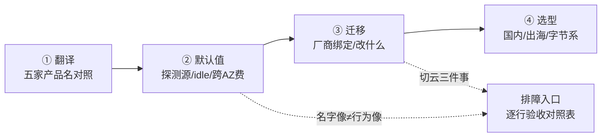
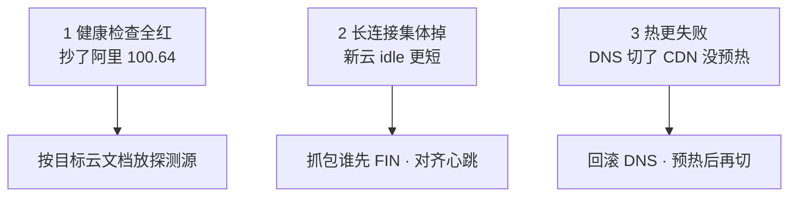
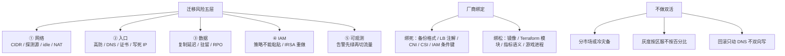
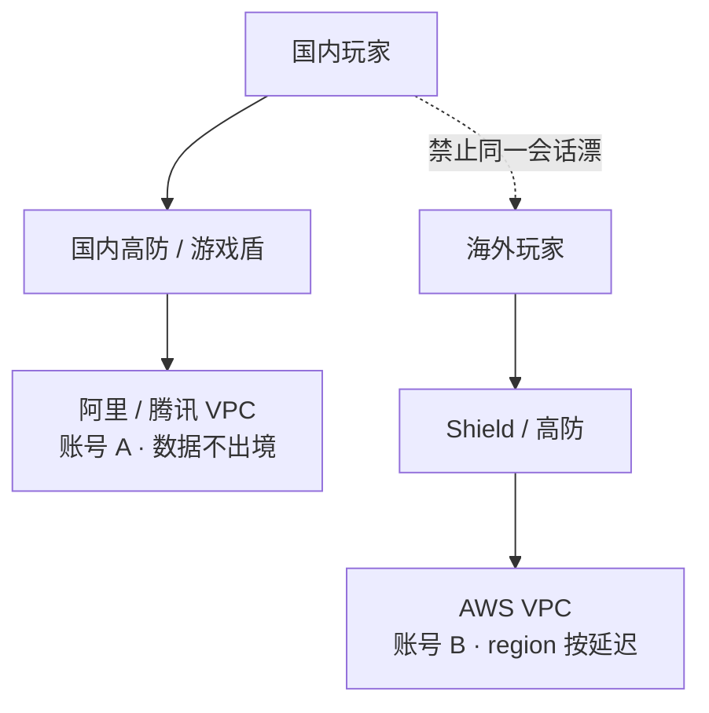
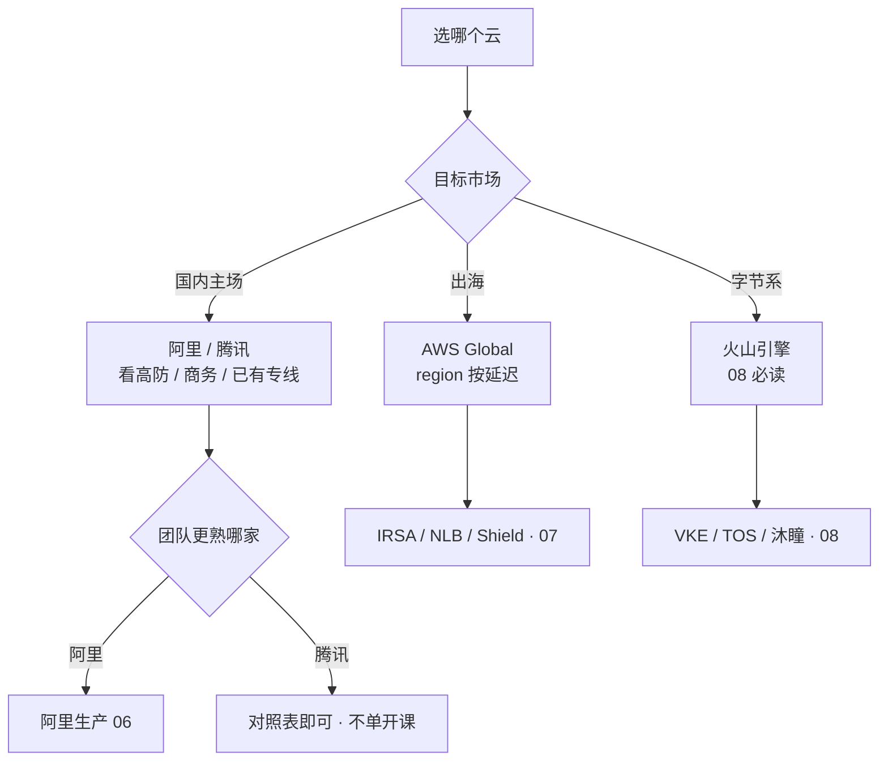
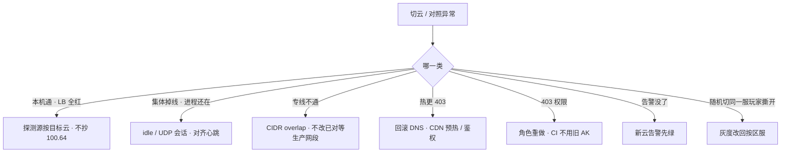

# 多云对照

> 国内阿里迁出海 AWS，机器一天迁完。切换窗口健康检查全红、长连接集体掉、热更 403——三件事都不是机型没选对。
> **本章回答**：同一个能力在五家云里叫什么、默认值差在哪、换云要改什么、各场景选谁。
> **不讲**：VPC / SG / NAT 通用排障 → [01](../01-云网络与安全/)；阿里组合、`100.64`、Terway → [06](../06-阿里云生产/)；AWS NLB / IRSA / IAM 求值 → [07](../07-AWS生产/)；火山 TOS / VKE / 沐瞳现场 → [08](../08-火山引擎生产/)；RDS / 对象存储 / Redis → [03](../03-云上存储与数据库/)；跨 AZ / NAT / CDN 账单 → [05](../05-成本治理/)；跨账号 IAM → [04](../04-IAM与多账号/)；出海区服、数据驻留深讲 → [07-15](../../07-游戏运维专题/15-出海与多区域/)。

**标记**：🎯重点 · 🔥难点 · ⭐常考 · 🔧实操
---

## 一、一张图：一个能力的五张面孔

> 🎯 **一句话**：多云对照就四步——翻译（叫什么）→ 验默认值（差在哪）→ 迁移（改什么）→ 选型（选谁）。



- 📖 **读图**
  - 🛤️ 主线四步串成一条线；切云排障按这四步问「卡在哪」
  - 🪤 `TRAP` 永远是「名字对上了但默认值没验」或「绑死了改不动」，不是机型没选对

本节对应练习题 Q1。

---

## 二、翻译：五朵云产品名对照 🎯⭐

> 🎯 **一句话**：按能力翻译，不按产品名 1:1——都叫 NLB，健康检查源和跨 AZ 计费默认值可以完全不同。

### 🗺️ 能力对照表

| 能力 | 阿里云 | AWS | 腾讯云 | 火山引擎 | GCP |
|------|--------|-----|--------|----------|-----|
| VPC / 子网 | VPC + 交换机（绑 AZ） | VPC + Subnet（绑 AZ） | VPC + 子网 | VPC + 子网 | **全球 VPC** + 区域子网 |
| 公网出口 | NAT 网关 | NAT Gateway | NAT 网关 | NAT 网关 | Cloud NAT |
| 实例防火墙 | 安全组（有状态） | Security Group | 安全组 | 安全组 | VPC firewall（层级不同） |
| 计算 | ECS（禁 t 突发） | EC2（禁 T burstable） | CVM | ECS | GCE |
| L4 / L7 负载 | CLB·NLB / ALB | **NLB** / ALB | CLB / 应用型 CLB | CLB / ALB | Passthrough NL / GCLB |
| 对象存储 | OSS | S3 | COS | TOS | GCS |
| 托管 K8s | ACK + Terway | EKS + VPC CNI | TKE | VKE | GKE（Autopilot 另说） |
| IAM / 日志 / 高防 / 专线 | RAM+STS / SLS / 高防·游戏盾 / 高速通道 | IAM+STS / CloudWatch Logs / Shield（国内区弱） / Direct Connect | CAM / CLS / 高防·游戏盾 / 专线 | IAM / TLS / 高防 / 专线 | IAM / Cloud Logging / Cloud Armor（偏 L7） / Interconnect |

#### ❓ 为什么不能按产品名 1:1 翻译？

- ❌ **抄名字**：只说明产品能买到，不说明行为一致
- ✅ **按能力对齐**后再问一句「默认值差在哪」——面试要的是这句，不是背全家桶
- ⚠️ **「用了 K8s 就可搬」也错**：Service `LoadBalancer` 注解和 CNI 都是**云绑定**；改注解可能重建 LB、地址变了，客户端写死 IP 全军覆没（四节）

### 🌐 GCP / 腾讯 / 火山怎么对照

- 🌍 **GCP**：全球 VPC + 区域子网，跨 region 内网默认通、不需要对等——但游戏区服仍按延迟和数据驻留切，别被「全球 VPC」带去画一张 Anycast；GKE Autopilot 对有状态战斗服不友好；Cloud Armor 偏 L7，L3/L4 仍需第三方高防
- 🎮 **腾讯**：模型和阿里接近（CVM 禁突发、CLB 长连接、COS+CDN、TKE 吃 VPC IP）；差异在 **CAM**（条件键/角色扮演不能粘贴）、高防形态、商务——**不单开课**，对照表够用；高防 / 游戏盾 CNAME 与回源网段必须当新系统验收
- 🌋 **火山**：与阿里**同构**，排障思路可迁移；**禁止照抄阿里 `100.64.0.0/10`**——探测源每家不同。标准说法：「同构 SOP 验收；探测源先查文档和流日志」；目标是字节再看 [08](../08-火山引擎生产/)

### 🪤 跨云同坑：换了云也不会消失

- ⚡ **突发性能实例**：ECS `t` / EC2 `T` / CVM 突发型——游戏一律禁
- 📦 **对象存储公共读**：OSS / COS / S3 / TOS 都会变下载费炸弹
- 🔓 **源站裸 EIP**：绑 EIP + SG `0.0.0.0/0` 被 DDoS 直打——跨云同坑

> 📝 **面试**：「多云按能力翻译：CLB≈NLB、OSS≈S3、RAM≈IAM；切云必须单独验探测源和 idle。腾讯模型接近阿里，火山同构但不抄 `100.64`。突发规格、公共读、裸 EIP 是跨云同坑。」⭐（练习题 Q1、Q5）

---

## 三、默认值差异：名字像不等于行为像 🎯⭐🔥

> 🎯 **一句话**：健康检查源、LB idle、跨 AZ 计费每家默认值不同——切云必须逐行验收，不能照搬旧云配置。

> 💡 **打个比方**：跨国搬家——都叫「负载均衡」，但探测源、idle、跨 AZ 计费各不同，不能照搬国内配置就开门。

### 📋 默认值差异对照表

| 项 | 阿里云 | AWS | 腾讯 / 火山 | 切换必测 |
|----|--------|-----|-------------|----------|
| VPC 模型 | 地域 VPC + 交换机绑 AZ | 地域 VPC + Subnet 绑 AZ | 同国内云；火山同构 | CIDR 无重叠，否则专线/对等做不了 |
| **探测源** | CLB：`100.64.0.0/10` | NLB 节点 IP / LB SG | **禁止抄 `100.64`** | 本机通、LB 全红 |
| L4 vs L7 | 长连接 CLB/NLB；HTTP ALB | 长连接 **NLB**；HTTP ALB | CLB 长连接 | 自定义 TCP 接到 ALB = 随机断线 |
| **LB idle** / UDP 会话 | TCP 可调，默认常短于心跳 | ALB 默认 60s；NLB TCP ~350s | 各家不同 | 心跳更长的一侧切换窗口集中断线 |
| **NAT** / **跨 AZ** | 端口水位；跨 AZ 延迟 0.5–2ms | `ErrorPortAllocation`；**处理费贵**；跨 AZ **明确计费** | 同 SNAT；账单为准 | 每 AZ 一个 NAT；大流量走内网 endpoint；AWS 多 AZ 账单先炸 |
| 内网拉镜像 | OSS 内网域名 | S3 / ECR VPC Endpoint | TOS 内网域名 | 开服前夜穿 NAT = 带宽+钱一起爆 |

### 🩺 探测源：最容易抄错的一行 🔧🔥

> 🔍 **现场**：本机 `curl` 200，LB 后端全红。

```bash
curl -v 127.0.0.1:$port
# * Connected to 127.0.0.1 ... 200 OK   # ← 本机通，但 LB 控制台仍 Unhealthy
# ← 探测源被 SG 拦了，不是进程没起
```

#### ❓ 为什么探测源不能照抄 `100.64`？

- 🏗️ 每家 LB 健康检查源由**该云 LB 架构**决定，不是通用标准
- 阿里 CLB 走链路本地段 `100.64.0.0/10`；AWS NLB 用自己的 ENI / 节点 IP；火山另有一套
- ✅ 止血：按目标云文档放行探测源 → Unhealthy 变 Healthy 再收紧；backend SG 强制写探测源规则，checklist 必含「LB 健康检查变绿」

### ⏱️ LB idle：心跳和 idle 谁先到 🎯🔥

```text
14:30:00 ... idle 到期, LB → 后端 FIN/RST   # ← LB 静默拆
14:30:00 ... 后端进程仍在, 无异常退出       # ← 进程没挂
14:35:00 ... 客户端发心跳, 才发现连接已断   # ← 玩家以为还在线 5 分钟
```

#### ❓ 为什么心跳要 < idle 的 1/3，不是 1/2？

- ½ 理论上够，但抖动、重传、GC 会让心跳发晚——**1/3 给两倍余量**
- 止血：心跳间隔 < idle 的 **1/3**，或调大 idle（有上限）
- UDP 无连接，LB 用**会话超时**（常 10–60s）；跨云后 UDP 集体掉线优先查这个，别只查 TCP idle
- 🔍 抓包看谁先 FIN/RST：LB 先 FIN = idle；后端先 RST = 进程主动断——两病治法不同

### 💸 跨 AZ · NAT · CNI：跨云同模型不同账单 🔧

- 💵 **AWS 跨 AZ 明确计费** → 同区服进程尽量同 AZ；国内云多 AZ 更「随意」是因为通常不计费或计费方式不同
- 🚪 **NAT**：AWS 按处理字节计费，大流量穿 NAT 可能比带宽还贵；解药跨云一样——镜像/对象走 VPC 内网 endpoint
- 🕸️ **CNI 按 Pod 占 IP**（Terway / VPC CNI / TKE / VKE 同坑）：

```text
kubectl describe po <pending-pod>
#   Warning  FailedScheduling  ... insufficient IP      # ← 子网 IP 耗尽
# ← 止血：加 secondary CIDR 或新子网，不缩节点、不改已对等生产网段
```

- 64 台 × 30 Pod = 1920 IP，`/24` 只有 254——跨云同坑
- ⚠️ CNI **云绑定**（Terway ≠ VPC CNI），跨云要重装；但 IP 耗尽解法跨云一样：加网段
- 战斗服不用 ECI / Fargate / Spot；节点角色要瘦；PDB 挡着不要 `--force`

> ⚠️ **别混**：名字都叫 NLB ≠ 超时一样；探测源 / idle / 跨 AZ 费要**单独验收**。突发规格、公共读、裸 EIP 不因换云消失。
> 📝 **面试**：「切云验收：探测源不抄 `100.64`、idle 与心跳对齐、AWS 跨 AZ 计费、NAT 走内网 endpoint、CNI 跨云不通用。」⭐（练习题 Q6、Q11、Q14）

---

## 四、迁移：厂商绑定与换云要改什么 🎯⭐🔥

> 🎯 **一句话**：迁云难在网络 / 入口 / 数据 / IAM / 观测，不是改 ECS 机型——计算面一天迁完，真正炸的是入口默认值和厂商绑定。

> 💡 **打个比方**：搬写字楼——桌椅（服务器）一天搬完，门牌号（DNS）、门禁卡（IAM）、档案柜（库备份格式）、前台电话（告警）每一样都要重配。

### 📊 迁移风险五层（高→低）

| 风险序 | 什么 | 为什么炸 |
|--------|------|----------|
| 1 网络 | CIDR 重叠；探测源、NAT、LB idle 默认值不同 | 专线做不了；切换窗口集中断线 |
| 2 入口 | 高防 / DNS / 证书 / 客户端写死 IP | TTL、双入口并行、源站 SG 只放新高防回源 |
| 3 数据 | 跨云复制延迟、驻留合规 | RPO 以校验过的备份为准 |
| 4 IAM | RAM 策略不能粘贴成 IAM JSON | IRSA / RRSA 要重做；CI 用旧 AK 是切日第二常见事故 |
| 5 可观测 | SLS 查询和告警不会跟着 VM 走 | 切日不搬告警 = 裸奔 |

### 🔒 厂商绑定：绑得死 vs 绑得松 🔥

| 对比 | 绑得死（不可移植） | 绑得松（可迁移） |
|------|-------------------|------------------|
| 什么 | 托管库备份格式、日志查询语言、IAM 条件键、LB 注解、HPA 云指标名、CNI/CSI | 自己的镜像、Terraform 模块（per-cloud provider）、Prometheus 业务指标、游戏进程本身 |
| 迁移时 | 重做或重写，不能粘贴 | 模板同源、运行时分叉 |

#### ❓ 为什么用了 K8s / Terraform 仍搬不走？

- ☸️ K8s **消灭不了** `LoadBalancer` 注解和 CNI 的云绑定——改注解可能重建 LB、地址变了
- 🧱 Terraform 让「同一朵云重建」可重复，**per-cloud provider 仍绑产品 API**，不能 `apply` 换 provider
- 真正可迁的是：CIDR 规划、镜像构建、应用配置、监控指标**语义**——不是「粘贴 + apply」

> ⚠️ **别混**：锁定最怕的不是 ECS 主机名，而是**托管库备份格式**（restore 不到另一家）+ **客户端写死入口 IP**（切不了高防/LB）。RAM JSON 粘到 IAM 字段名/条件键全错。

### 🚫 游戏不做流量双活 🎯🔥

> 💡 **打个比方**：双活像两家分店共用一个厨房——跨城送菜（跨云 RTT）和两人同时炒一锅（一致性）会把流程拖死。合理做法是分市场各开各的店，或冷灾备——B 店备好灶平时不开火。

#### ❓ 为什么游戏不做跨云流量双活？

- 有状态、长连接、匹配和区服数据——跨云 RTT + 一致性扛不住，还要两套 IAM / 网络 / 告警
- ✅ **分市场**：国内一朵（阿里/腾讯）、海外一朵（AWS），账号/数据隔离，同一战斗会话不跨云漂
- ✅ **冷灾备**：RTO 小时/天级，至少真 restore 过一次到目标云隔离环境测 RTO
- ✅ **入口高防可以和计算不同家**：降低单一清洗商绑定

#### ❓ 为什么冷灾备只复制快照不算有？

- 快照只保证数据层有备份；IAM、CIDR、DNS、证书、高防回源、告警通道都没在目标云验证过
- RTO ≠「快照复制完成时间」，而是「故障 → 完全恢复服务」
- 验收：目标云隔离 VPC 拉起库 → 校验行数/账本 → 测 DNS 切到这份环境多久 → 两边健康检查都绿

#### ❓ 为什么灰度按区服，不按随机百分比？

- 会话和区服绑定；随机 10% 会把同一服玩家撕开——匹配失败、好友不在、充值账本对不上
- ✅ 先小服进真实玩家，对账 CCU / 登录 / 充值，再大服

### 🧭 迁移 runbook 与验收清单 🔧

> 🎯 **一句话**：网络 → 数据 → 演练 → 小服 → 大服，每步可回滚；验收清单逐行打勾才算过。

1. **网络连通**：CIDR 无重叠、专线/对等打通、NAT 和 IGW 路由正确
2. **数据校验**：快照 restore 后校验行数/账本，RPO 以校验过的为准
3. **无流量演练**：不进玩家，DNS → LB → 后端跑一遍
4. **小服进真实玩家**：对账 CCU / 登录 / 充值，灰度按区服
5. **大服**：任一步失败只回滚 DNS，数据以源云为主

```text
# 跨云验收清单（名字对上了也不算过）
[ ] CIDR 无重叠，专线 / 对等能通
[ ] 探测源按目标云文档放行（不抄 100.64）
[ ] LB idle / UDP 会话超时与心跳对齐
[ ] 对象存储公共读关 + 内网回源（OSS / S3 / TOS endpoint）
[ ] IAM 角色重做（IRSA / RRSA Trust sub 重做，CI 不用旧 AK）
[ ] 告警在新云先绿；证书和 GM 白名单在新入口生效
[ ] 突发规格黑名单、无 EIP 裸奔；CDN 预热完成
[ ] K8s 注解换了 LB 地址变了 → 客户端走域名
```

### 🔥 切云当天三件事 🔧🔥

> 🔍 **现场**：机器已经迁完，DNS 准备切。三件事都不是「ECS 没迁完」。



- 📖 **读图**：三件事分别卡在探测源、idle、CDN——都不是机型；任一步失败只回滚 DNS

1. **本机 curl 200、LB Unhealthy** → 探测源抄了 `100.64`；按目标云文档放行，对流日志看真实源
2. **进程还在、玩家集体掉线** → 抓包谁先 FIN/RST；对齐心跳到 idle 的 1/3；UDP 会话超时单独测
3. **登录通、热更 403/超时** → DNS 切了 CDN 还指空桶或鉴权失败；回滚 DNS，预热+命中率抽检后再切

### 🔁 DNS 回滚：只动入口不双向写 🔧

> 🎯 **一句话**：切云失败回滚只动 DNS 和入口——数据以源云为主，禁止双向写。

#### ❓ 为什么回滚只动 DNS，不双向写？

- 跨云复制延迟 > 玩家预期；双写会导致充值到账延迟、道具不一致
- 切前 DNS 双入口、TTL 调短（60–120s）→ 权重 100:0 → … → 0:100 → 异常只回滚 DNS
- 小服发现「刚买的道具没有」：先把写路径打回源云主库，再查复制延迟还是切到了只读

### 收束：迁移凭什么难在入口不在机型



- 📖 **读图**
  - ①~⑤ 按风险从高到低——网络和入口在前，计算面改名在最后
  - 锁定分死/松两档；不做双活三条纪律：分市场 / 区服灰度 / DNS 回滚

- 🧾 **三不保证**（验收框架，不是「照做必成」）
  - **不保证**「用了 K8s / Terraform 就可搬」
  - **不保证**「冷灾备只复制快照就算有」
  - **不保证**「名字对上了就行为一致」

> 📝 **面试**（记忆分组）：迁移五层——**网络 → 入口 → 数据 → IAM → 观测**；锁定最怕备份格式 + 写死 IP；不做双活——分市场或冷灾备，灰度按区服，回滚只动 DNS。⭐（练习题 Q2、Q3、Q8、Q9）

---

## 五、选型：国内主场、出海、字节系各选谁 🎯⭐

> 🎯 **一句话**：国内主场阿里/腾讯，出海 AWS，字节系（含沐瞳）火山必读——选型看团队熟练度、高防和商务、已有专线，技术模型不是决定项。

### 🌏 分市场落地



- 📖 **读图**：国内和海外是两张独立 VPC、两套账号、两套高防——**不是一张全球 Anycast**；分市场不是双活

### 🔐 出海隔离五层

1. **账号**：国内阿里/腾讯（A）+ 出海 AWS Global（B）；中国区 AWS（北京/宁夏）和 Global 又是两套 IAM，同一把 AK 打不通
2. **网络**：两套 CIDR 提前避开重叠；独立 VPC，测试别接到生产 CEN / TGW「方便调试」
3. **密钥与 CI**：海外 CI 禁止拿国内生产角色；RAM 不能粘成 IAM JSON
4. **数据驻留**：国内身份证/支付数据不要复制到 Global「做灾备方便」——技术上能同步 ≠ 合规上能同步
5. **模板同源、运行时分叉**：Terraform per-cloud；CDN 域名、热更检查、高防证书、GM 白名单两边各做一遍

### 🧾 账号服与数据驻留

> 🎯 **一句话**：账号服若全球一份要单独评估驻留——不要默认一个 Redis 打全球。

- 国内/海外账号服分开部署；账号 ID 全局唯一但数据本地存；跨市场查询走 API 而非库复制
- GM 发奖、合服、热更禁止共用角色——各市场 CI 独立
- 版本包可一份，发布通道必须两套；混用国内 OSS 给海外客户端回源 = 延迟 + 流量费 + 内容审核

> ⚠️ **别混**：**中国区 AWS ≠ 阿里云 ≠ AWS Global**。出海写 AWS Global。入口高防可以和计算不同家——比双云双活现实。
> 💡 **打个比方**：出海像开分店——门牌号（CIDR）不能撞、营业执照（账号）要新办、收银台（驻留）按当地法规、员工权限（CI）不能拿总店的。
> 📝 **面试**：「分市场 = 账号隔离 + CIDR 不重叠 + CI 角色分叉 + 数据驻留评估。中国区 AWS 和 Global 是两套 IAM。」⭐（练习题 Q4、Q7、Q10）

---

## 六、作战：选型决策与切云定责 🎯⭐🔧

> 🎯 **一句话**：切云窗口不要从改机型或重启逻辑服开始——先问名字对上了没有、默认值验收了没有。

### 🌳 选型决策树



- 📖 **读图**：第一刀按目标市场——国内 / 出海 / 字节系；国内二选一看熟练度和高防商务，技术模型不是决定项

### 🧭 切云定责决策树



- 📖 **读图**：单云排障问「哪个组件坏了」；切云排障问「对照表哪行没打勾」——组件都在跑，坏的是粘贴了旧默认值

### 现象 · 先做 · 别做

| 现象 | 先做 | 别做 |
|------|------|------|
| 本机通、LB Unhealthy | 目标云探测源文档 + 流日志 | 抄 `100.64`；先改业务端口 |
| 进程还在、集体掉线 | 对齐心跳与 idle；UDP 单独测 | 重启逻辑服 |
| 登录通、热更失败 | 回滚 DNS；预热后再切 | 双向写；先开会怪 CDN 厂商 |
| 专线 / 对等失败 | 查 CIDR overlap | 现场改已对等生产网段 |
| RAM 策略粘过去 403 | 目标云重做角色 | CI 继续用旧 AK |
| 随机 10% 玩家进不同世界 | 灰度改回按区服 | 按 Web 百分比切 |
| GSLB 一半玩家进死入口 | 两边健康检查都绿再切权重 | 先切再看 |

### 60 秒剧本 🔧

> 🔍 **现场**：接到「切云后异常」报障，60 秒走完这条线再下结论。

```text
① 0–10s  哪一类？    本机 curl 通吗？LB 后端全红？
② 10–30s 网络层？   探测源按目标云文档放了吗？CIDR 有 overlap 吗？
③ 30–45s 入口层？   idle 和心跳对齐了吗？CDN 预热了吗？证书 / GM 白名单生效了吗？
④ 45–60s 身份层？   IAM 角色重做了吗？CI 还在用旧 AK 吗？告警在新云先绿了吗？
# ← 60 秒内不动业务进程、不双向写、不重启逻辑服
```

- 🚫 **60 秒内不碰**
  - 不重启逻辑服（长连接还活着会主动踢玩家）
  - 不双向写（数据以源云为主）
  - 不改 `0.0.0.0/0`（超时就全放行 = 新暴露面）
  - 不缩节点假装资源够（`insufficient IP` 加网段）

> 📝 **面试**：「切云异常 60 秒：① 本机/LB 红？② 探测源/CIDR？③ idle/CDN/证书？④ IAM/旧 AK/告警？不重启逻辑服、不双向写、不改 `0.0.0.0/0`。」⭐（练习题 Q12、Q13）

---

## 七、收口

### 命令速查 🔧

```bash
curl -v 127.0.0.1:$port         # ← 只证明本机，不证明探测路径
# LB 控制台看 HealthyHostCount    # ← 本机通但 LB 红 = 探测源没放
# 目标云文档查健康检查源 CIDR      # ← 禁止抄 100.64
# 路由表看 CIDR overlap           # ← 专线 / 对等做不了的第一原因
# LB idle / UDP 会话超时          # ← 心跳 5min + idle 60s = 经典断线组合
# 新云告警是否先绿                 # ← 切日不搬告警 = 裸奔
# 证书 / GM 白名单在新入口生效     # ← 443 失败或发奖被拒看起来像「云挂了」
# CDN 预热完成、命中率抽检        # ← DNS 切了 CDN 指着空桶 = 热更 403
# K8s LB 注解换了 → 地址变了      # ← 客户端必须走域名
# HPA 云指标名 / 日志查询语言      # ← 跨云不通用，引用和告警规则要重做
```

### 面试锚点

| 问 | 30 秒答 |
|----|---------|
| 五朵云产品怎么对照？ | 按能力翻译：CLB≈NLB、OSS≈S3、RAM≈IAM；名字像不等于默认值像。 |
| 切云最难的是什么？ | 不是改机型；难在 CIDR / 探测源 / idle / 数据 RPO / IAM 重做 / 告警先绿。 |
| 为什么不做流量双活？ | 有状态 + 长连接跨云 RTT 和一致性扛不住；分市场或冷灾备。 |
| 用了 K8s / Terraform 就可搬？ | 不。LB 注解、CNI、CSI、IAM 条件键仍绑云；Terraform 让重建可重复，不消灭锁定。 |
| 健康检查源抄过去行吗？ | 不行。阿里 `100.64.0.0/10`，AWS 是 NLB 节点，火山查文档。 |
| LB idle 和心跳？ | 心跳 < idle 的 1/3；心跳 5min + idle 60s 是经典断线组合。 |
| 跨 AZ / NAT？ | AWS 跨 AZ 明确计费；NAT 处理费贵 → 走内网 endpoint。 |
| K8s 节点池 IP 耗尽？ | 所有云都按 Pod 占 IP；`/24` 是经典事故；加网段不缩节点。 |
| CNI 能跨云粘贴？ | 不能。Terway ≠ VPC CNI；IP 耗尽解法跨云一样：加网段。 |
| 灰度怎么切？ | 按区服，不按随机百分比——会话和区服绑定。 |
| 冷灾备怎么验收？ | 真 restore 到目标云隔离环境测 RTO，不只复制快照。 |
| 中国区 AWS 当阿里云？ | 不。账号、备案、高防、产品完整度都不同；出海写 Global。 |
| 腾讯 / 火山怎么对照？ | 腾讯模型接近阿里，差在 CAM/高防/商务；火山同构但不抄 `100.64`。 |
| ACK 和 EKS 谁管什么？ | 厂商管 Master/etcd，你管节点池/CNI/身份/RPO/探测源。 |
| IRSA / RRSA 能粘贴吗？ | 不能。Trust `sub=ns:sa` 要重做，RAM JSON 粘到 IAM 字段全错。 |
| 迁移 runbook？ | 网络→数据→演练→小服→大服；不按「apply 换 provider」。 |
| 入口高防必须和计算同家？ | 不必。DNS + 高防可以不同家，降低单一清洗商绑定。 |
| 厂商绑定最怕什么？ | 托管库备份格式 + 客户端写死 IP，不是 ECS 主机名。 |

### 易错一句话对照

- 按产品名 1:1 翻译就能切云 → 按能力；默认值单独验收
- 用了 K8s / Terraform 所以可搬 → LB 注解、CNI、CSI、IAM 条件键仍绑云
- 游戏做多云流量双活防锁定 → 分市场或冷灾备；同一会话不漂
- 灰度按 10% 玩家切 → 按区服；会话和区服绑定
- 火山健康检查抄 `100.64` → 先查文档和流日志
- 中国区 AWS 当阿里云，同一把 AK → 两套账号两套 IAM
- 托管了 Master 就不管节点 → 节点池 / CNI / 身份 / RPO / 探测源仍是你的
- 迁移最难的是改 ECS 机型 → 难在 CIDR / 入口 / RPO / IAM / 告警
- 冷灾备只复制快照就算有 → 要真 restore 到隔离环境测 RTO
- 切云失败改双向写尽快追上 → 只回滚 DNS，数据以源云为主
- 混用国内 OSS 给海外客户端回源 → 延迟、流量费、内容审核
- 入口高防必须和计算同一家 → DNS + 高防可以不同家
- 突发规格、公共读、裸 EIP 只是阿里坑 → 跨云同坑
- GCP 全球 VPC 所以画一张 Anycast → 区服仍按延迟和驻留切
- 腾讯更懂游戏所以国内必选 → 模型接近，看熟练度 / 高防 / 商务
- IRSA / RRSA 的 Trust `sub` 能粘贴 → 要在目标云重做
- CNI 可以跨云粘贴 → Terway ≠ VPC CNI；IP 耗尽解法跨云一样：加网段
- 战斗服用 ECI / Fargate / Spot 省钱 → 有状态 + 突发回收 = 翻车
- 迁移 runbook 按 apply 换 provider → 网络→数据→演练→小服→大服
- 模板同源就是运行时也同源 → 模板同源、运行时必须分叉
- 账号服全球一份一个 Redis 打全球 → 单独评估驻留和合规
- HPA 云指标名 / 日志查询语言能粘贴 → 各家不同，要重做
- 托管库备份格式跨云 restore → 不兼容，锁定最怕的一项
- CDN 切了就热更 → CDN 指着空桶 = 403；预热完成再切

### 数字墙

> 心跳 **5min** vs idle **60s** = 经典断线组合 · 心跳 < idle × **1/3** · 跨 AZ RTT **0.5–2ms**（同城）· AWS 跨 AZ **明确计费** · 阿里探测源 **`100.64.0.0/10`**（火山禁抄）· 一个 NAT IP ≈ **6 万**源端口 · `/24` = **254** IP；64×30 Pod = **1920** → 耗尽 · 迁移风险 **5** 层 · 厂商绑定 **2** 档 · 不做双活 **3** 条 · 出海隔离 **5** 层 · 切云三件事 · 迁移 runbook **5** 步 · DNS TTL 切前 **60–120s**

---

## 合上书

对着第一节主图口述一遍，卡住就回对应小节。开头那个现场——健康检查全红、长连接掉、热更 403——三件事各自错在哪，现在该能说清了。

- [ ] **默画主图**：翻译 → 默认值 → 迁移 → 选型，标出排障入口和切云三件事各对应哪步。（→ Q1）
- [ ] **口述翻译**：五朵云 LB / 对象存储 / 托管 K8s / IAM 分别叫什么？GCP 全球 VPC 差在哪？腾讯和火山怎么对照？跨云同坑三条？（→ Q1 · Q5）
- [ ] **口述默认值**：探测源为什么不能抄 `100.64`？idle 为什么用 1/3？跨 AZ / NAT / CNI IP 耗尽各要测什么？（→ Q6 · Q11 · Q14）
- [ ] **默画迁移五层**：网络 → 入口 → 数据 → IAM → 观测；绑死 vs 绑松；为什么 K8s/Terraform 消灭不了锁定？（→ Q2 · Q3 · Q8）
- [ ] **口述不做双活**：为什么不做？冷灾备怎么验收？灰度为什么按区服？回滚只动什么、不动什么？（→ Q2 · Q9）
- [ ] **口述选型与出海**：国内/出海/字节系各选谁？分市场怎么画？出海五层隔离？中国区 AWS vs Global？（→ Q4 · Q7 · Q10）
- [ ] **默画作战树**：切云异常七条分叉；口述 60 秒剧本各敲什么、什么绝不碰。（→ Q12 · Q13）
- [ ] **口述切云三件事**：探测源全红、idle 断连、热更失败各怎么处理？（→ Q12）

下一章：按模块收口回看 [06](../06-阿里云生产/) · [07](../07-AWS生产/) · [08](../08-火山引擎生产/)；出海深讲：[07-15](../../07-游戏运维专题/15-出海与多区域/)。
