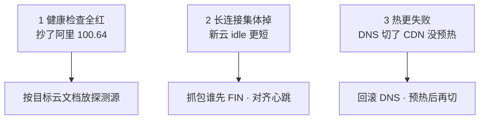

# 09｜多云对照 · 练习题

先合上知识点，对着 **一、一张图：一个能力的五张面孔** 把翻译→默认值→迁移→选型四步口述一遍，再来做题。

| 标记 | 含义 |
|------|------|
| **核心** | 不懂整章就没建立起来 |
| **必会** | 值班和面试都要能讲 |
| **常用** | 线上会反复碰到 |
| **常考** | 白板和追问的高频口径 |

## 本题目录
- [Q1 五朵云产品怎么对照](#q1)
- [Q2 切云最难的是什么](#q2)
- [Q3 为什么不做流量双活](#q3)
- [Q4 火山要学到多深](#q4)
- [Q5 腾讯和阿里差在哪](#q5)
- [Q6 跨云同款坑有哪些](#q6)
- [Q7 分市场和账号隔离怎么落](#q7)
- [Q8 用了 K8s/Terraform 就可搬](#q8)
- [Q9 ACK 和 EKS 谁管什么](#q9)
- [Q10 切云三件事与灰度怎么切](#q10)
- [Q11 默认值差异有哪些](#q11)
- [Q12 冷灾备怎么验收](#q12)
- [Q13 切云 idle 与心跳对齐](#q13)
- [Q14 默认值陷阱对照表](#q14)
- [合上书](#合上书)

---

## Q1

**★★★★★｜五朵云的产品怎么对照？阿里 NLB 到 AWS 叫什么？名字对上了就能切吗？**

**覆盖**：核心 · 必会 · 常考 ｜ **对应**：知识点 [二、翻译：五朵云产品名对照](知识点.md)

### 场景
面试官拿了一张白纸：「你把计算、LB、对象存储、K8s、IAM 在阿里 / AWS / 腾讯 / 火山 / GCP 分别叫什么写一下。名字对上了就能切云吗？」

### 完整解答
> 🎯 **一句话**：按能力翻译不按产品名 1:1——CLB≈NLB、OSS≈S3、RAM≈IAM；名字像不等于默认值像，切云必须逐行验收。

| 能力 | 阿里云 | AWS | 腾讯云 | 火山引擎 | GCP |
|------|--------|-----|--------|----------|-----|
| 计算 | ECS | EC2 | CVM | ECS | GCE |
| L4 负载 | CLB / NLB | NLB | CLB | CLB | Passthrough NL |
| 对象存储 | OSS | S3 | COS | TOS | GCS |
| 托管 K8s | ACK + Terway | EKS + VPC CNI | TKE | VKE | GKE |
| IAM | RAM + STS | IAM + STS | CAM | IAM | IAM |

翻译完了要加一句「名字像不等于默认值像」——阿里 NLB 和 AWS NLB 都是 L4，但 client IP 保留、健康检查源、跨 AZ 计费默认值不同。GCP 的 VPC 是**全球 VPC + 区域子网**，跨 region 内网默认通，和国内云的「地域 VPC」不是同一张图。腾讯模型接近阿里，差异在 CAM、高防形态、商务。火山同构但**禁止照抄 `100.64`**。

> ⚠️ **别混**：**名字像 ≠ 默认值像**。抄名字只说明产品能买到，不说明行为一致。**用了 K8s 就可搬**也是错的——Service `LoadBalancer` 注解和 CNI 都是**云绑定**。
> 📝 **面试**：「多云按能力翻译：CLB≈NLB、OSS≈S3、RAM≈IAM；切云必须单独验探测源和 idle。腾讯模型接近阿里，火山同构但不抄 `100.64`。」

### 再追问
- **GCP 全球 VPC 意味着可以画一张全球 Anycast？** ——不。游戏区服仍要按延迟和数据驻留切区域，全球 VPC 只是跨 region 内网默认通。
- **腾讯更懂游戏所以国内必选腾讯？** ——不。模型接近阿里，选哪家看团队熟练度、高防和商务、已有专线，技术模型不是决定项。

---

## Q2

**★★★★★｜切云最难的是什么？把 ECS 改名迁过去就行了吗？**

**覆盖**：核心 · 必会 · 常考 ｜ **对应**：知识点 [四、迁移：厂商绑定与换云要改什么](知识点.md)

### 场景
有人说「机器迁完就差不多了」。切换窗口健康检查全红、长连接集体掉、热更 403——三件事都不是机型没选对。

### 完整解答
> 🎯 **一句话**：迁云难在网络 / 入口 / 数据 / IAM / 观测，不是改 ECS 机型——计算面一天迁完，真正炸的是入口默认值和厂商绑定。

| 风险序 | 什么 | 为什么炸 |
|--------|------|----------|
| 1 网络 | CIDR 重叠；探测源、NAT、LB idle 默认值不同 | 专线做不了；切换窗口集中断线 |
| 2 入口 | 高防 / DNS / 证书 / 客户端写死 IP | TTL、双入口并行、源站 SG 只放新高防回源 |
| 3 数据 | 跨云复制延迟、驻留合规 | RPO 以校验过的备份为准 |
| 4 IAM | RAM 策略不能粘贴成 IAM JSON | IRSA / RRSA 要重做；CI 用旧 AK 是切日第二常见事故 |
| 5 可观测 | SLS 查询和告警不会跟着 VM 走 | 切日不搬告警 = 裸奔 |

机器改名是最简单的一步。真正难的是这五层，按风险从高到低排序。切日不搬 SLS / CloudWatch 告警 = 裸奔。证书和 GM 白名单必须在新入口先生效。

> ⚠️ **别混**：**迁移最难的不是改 ECS 机型**，难在 CIDR / 入口 / RPO / IAM / 告警。CI 用旧 AK 打新云是切日第二常见事故。
> 📝 **面试**：「迁移风险分五层——网络→入口→数据→IAM→观测，计算面一天迁完，真正炸的是入口默认值和厂商绑定。」

### 再追问
- **RAM 策略直接粘成 IAM JSON 行吗？** ——不行。字段名、条件键全错，IRSA / RRSA 的 Trust `sub=ns:sa` 要在目标云重做。
- **告警在新云没绿就切流量会怎样？** ——切日不搬告警 = 裸奔。先在新云把告警通道跑绿再切流量。

---

## Q3

**★★★★☆｜为什么游戏不做跨云流量双活？分市场和冷灾备怎么选？**

**覆盖**：核心 · 必会 · 常考 ｜ **对应**：知识点 [四、迁移：厂商绑定与换云要改什么](知识点.md)

### 场景
架构评审有人写「多云双活防锁定」。战斗服有状态、长连接、区服数据跨云 RTT 和一致性扛不住。

### 完整解答
> 🎯 **一句话**：有状态 + 长连接跨云 RTT 和一致性扛不住，还要两套 IAM / 网络 / 告警——游戏分市场或冷灾备，不做流量双活。

游戏不做跨云流量双活的三个理由：有状态战斗服跨云 RTT 放大帧同步延迟；匹配和区服数据跨云一致性扛不住；两套 IAM / 网络 / 告警维护成本高。合理策略：

- **分市场**：国内一朵（阿里 / 腾讯）、海外一朵（AWS），账号 / 数据隔离，同一战斗会话不跨云漂。
- **冷灾备**：RTO 小时 / 天级，至少真 restore 过一次到目标云隔离环境测 RTO。
- **入口高防可以和计算不同家**：DNS + 高防供应商可以不和计算同一家，降低单一清洗商绑定。

> ⚠️ **别混**：分市场**不是双活**——没有箭头把同一战斗会话从国内 VPC 漂到 AWS。入口高防可以和计算不同家是合理的「防锁定」，比双云双活现实。
> 📝 **面试**：「游戏不做双活——有状态 + 长连接跨云扛不住；分市场或冷灾备，灰度按区服，回滚只动 DNS。」

### 再追问
- **冷灾备只复制快照算不算有？** ——不算。要真 restore 到目标云隔离环境测 RTO，不只复制快照。
- **入口高防必须和计算同一家？** ——不必。DNS + 高防可以不同家，降低单一清洗商绑定。

---

## Q4

**★★★☆☆｜没用过火山引擎，面试问起来怎么答？要学到多深？**

**覆盖**：必会 · 常考 ｜ **对应**：知识点 [二、翻译：五朵云产品名对照](知识点.md)

### 场景
目标是字节或简历写了火山，但没在火山上跑过生产。面试官问「火山引擎你了解多少」。

### 完整解答
> 🎯 **一句话**：火山与阿里同构，VPC / 安全组 / CLB / TOS / VKE 排障思路可迁移，但探测源 / 内网域名 / IAM 单独验收，不抄 `100.64`。

标准说法：「我没在火山上跑过生产，但 NAT SNAT、SG 探测源、对象存储公共读这三件事我按同一套 SOP 验收；健康检查源我会先查文档和流日志，不搬阿里的网段。」

火山引擎与阿里**同构**：VPC / 安全组 / CLB / TOS / VKE 排障思路可迁移。但**禁止照抄阿里 `100.64.0.0/10`**——健康检查源每家不同。目标是字节或简历写了火山，再看 [08](../08-火山引擎生产/)。

> ⚠️ **别混**：火山**同构不等于照抄**。探测源、内网域名、IAM 条件键都要单独验收。说「和阿里一样照搬就行」是错的。
> 📝 **面试**：「火山同构可迁移，但探测源 / 内网域名 / IAM 单独验收；目标是字节再看 08。」

### 再追问
- **火山和阿里有哪些具体差异？** ——健康检查源不同（不抄 `100.64`）、TOS 内网域名不同、IAM 条件键不同；细节看 08。
- **「和阿里一样」能过面试吗？** ——不能。要说出「同构但探测源 / 内网域名 / IAM 单独验收」，不能只说「一样」。

---

## Q5

**★★★☆☆｜腾讯云和阿里云差在哪？国内主场选哪家？**

**覆盖**：必会 · 常考 ｜ **对应**：知识点 [二、翻译：五朵云产品名对照](知识点.md)

### 场景
面试官问「腾讯云和阿里云对游戏团队来说有什么区别？国内主场选谁？」

### 完整解答
> 🎯 **一句话**：模型接近，差异在 CAM、高防形态、商务——选哪家看团队熟练度、高防和商务、已有专线，技术模型不是决定项。

腾讯云和阿里云对游戏团队来说**模型接近**：CVM 同样有突发性能型要禁；CLB 长连接、COS + CDN 热更、TKE 网络插件同样吃 VPC IP。差异在 **CAM**（条件键和角色扮演流程不同，策略不能粘贴）、高防 / 游戏盾产品形态、地域覆盖、商务。不要编「腾讯更懂游戏」。

> ⚠️ **别混**：**腾讯模型接近阿里 ≠ 策略能粘贴**。CAM 条件键和角色扮演流程不同，RAM JSON 粘到 CAM 会字段全错。
> 📝 **面试**：「腾讯和阿里模型接近，差异在 CAM、高防形态、商务；选哪家看熟练度 / 高防 / 专线，技术模型不是决定项。」

### 再追问
- **「腾讯更懂游戏」对吗？** ——不编。模型相同、操作面不同，技术用「模型相同」就够，不编营销话术。
- **CAM 策略能从 RAM 粘过来吗？** ——不能。条件键和角色扮演流程不同，要重做。

---

## Q6

**★★★★☆｜跨云有哪些「同款坑」？换了云也不会消失的？**

**覆盖**：必会 · 常用 · 常考 ｜ **对应**：知识点 [三、默认值差异：名字像不等于行为像](知识点.md)

### 场景
切云团队以为换了云就换了坑。突发规格、公共读、源站裸 EIP 三件事在所有云都一样炸。

### 完整解答
> 🎯 **一句话**：突发规格、对象存储公共读、源站裸 EIP 是跨云同坑——不因换了云就消失；每家探测源、idle、跨 AZ 计费默认值不同，要单独验收。

跨云同坑（所有云都有）：
- **突发性能实例**：ECS `t` / EC2 `T` / CVM 突发型，游戏一律禁，CPU 信用耗尽后卡帧。
- **对象存储公共读**：OSS / COS / S3 / TOS 都会变成下载费炸弹。
- **源站裸 EIP**：ECS 绑 EIP + SG `0.0.0.0/0` 在所有云都危险，源站 IP 泄漏后被直打。

跨云不同（每家要单独验收）：
- **健康检查源**：阿里 `100.64.0.0/10`，AWS 是 NLB 节点，火山查文档。
- **LB idle / UDP 会话**：各家默认值不同，心跳 5min + idle 60s 是经典断线组合。
- **跨 AZ 计费**：AWS 明确计费，国内云通常不计费或方式不同。

> ⚠️ **别混**：**同坑不因换云消失，不同默认值要逐行验收**。名字都叫 NLB 不等于 idle 一样。
> 📝 **面试**：「突发规格、公共读、裸 EIP 是跨云同坑；探测源、idle、跨 AZ 计费每家不同，切云逐行验收。」

### 再追问
- **对象存储公共读只在 OSS 会炸？** ——不。OSS / COS / S3 / TOS 都会变下载费炸弹。
- **突发规格只是阿里的坑？** ——不。EC2 T 型同样有，游戏一律禁。

---

## Q7

**★★★★★｜分市场怎么落地？出海账号和网络隔离怎么切？中国区 AWS 当阿里云行吗？**

**覆盖**：核心 · 必会 · 常考 ｜ **对应**：知识点 [五、选型：国内主场、出海、字节系各选谁](知识点.md)

### 场景
出海不是「同一个账号开一个海外 region」。要切开的是账号、网络、密钥、CI、数据驻留五层。

### 完整解答
> 🎯 **一句话**：分市场 = 账号隔离 + CIDR 不重叠 + CI 角色分叉 + 数据驻留评估；中国区 AWS ≠ 阿里云 ≠ AWS Global，不是画一张全球 Anycast。

出海五层隔离：

1. **账号**：国内一套（账号 A），出海 AWS Global 一套（账号 B）。中国区 AWS（北京 / 宁夏）和 Global 又是两套 IAM。
2. **网络**：两套 CIDR 提前避开重叠。独立 VPC，不要把测试接到生产 CEN / TGW。
3. **密钥与 CI**：海外 CI 禁止拿国内生产角色。RAM 策略不能粘成 IAM JSON。
4. **数据驻留**：国内身份证 / 支付数据不要复制到 Global「做灾备方便」。技术上能同步不等于能同步。
5. **模板同源运行时分叉**：Terraform 模块 per-cloud；CDN 域名、热更检查地址、高防证书、GM 白名单两边各做一遍。

> ⚠️ **别混**：**中国区 AWS ≠ 阿里云 ≠ AWS Global**。账号、备案、高防能力、产品完整度都不同。出海写 AWS Global。账号服若全球一份要单独评估驻留。
> 📝 **面试**：「分市场 = 账号隔离 + CIDR 不重叠 + CI 角色分叉 + 数据驻留评估。不是画一张全球 Anycast。中国区 AWS 和 Global 是两套 IAM。」

### 再追问
- **国内和海外可以同一套 `10.10.0.0/16`？** ——不。迟早要对等 / 打专线，提前避开重叠。
- **账号服全球一份，一个 Redis 打全球？** ——不。单独评估驻留和合规，不要默认一个 Redis 打全球。

---

## Q8

**★★★★☆｜我们用了 K8s 和 Terraform，所以可以随便搬？厂商绑定最怕什么？**

**覆盖**：核心 · 必会 · 常考 ｜ **对应**：知识点 [四、迁移：厂商绑定与换云要改什么](知识点.md)

### 场景
有人说「我们用了 K8s 所以可搬」「Terraform 让我们云无关」。切云时 LB 注解改了地址变了，CSI 跨云 restore 不到。

### 完整解答
> 🎯 **一句话**：K8s 消灭不了 `LoadBalancer` 注解和 CNI 的云绑定，Terraform 让重建可重复但不消灭锁定——最怕托管库备份格式 + 客户端写死 IP。

| 对比 | 绑得死（不可移植） | 绑得松（可迁移） |
|------|-------------------|------------------|
| 什么 | 托管库备份格式、日志查询语言、IAM 条件键、LB 注解、HPA 云指标名 | AMI / 镜像、Terraform 模块、Prometheus 指标、游戏进程 |
| 迁移时 | 重做或重写，不能粘贴 | 模板同源、运行时分叉 |

**K8s 消灭不了** `LoadBalancer` 注解和 CNI 的云绑定——改注解可能重建 LB、地址会变，客户端写死 IP 全军覆没。CSI（云盘）也是云绑定——跨云 restore 托管库备份格式不兼容。**Terraform** 让「在同一朵云重建」可重复，per-cloud provider 仍绑产品 API，不能 `apply` 换 provider。

厂商绑定最怕两样：**托管库备份格式**（restore 不到另一家）+ **游戏客户端写死的入口 IP**（切不了高防 / LB）。不是 ECS 主机名。

> ⚠️ **别混**：**Terraform 不能消灭锁定，只能让重建可重复**。per-cloud provider 仍绑产品 API。真正可迁移的是 CIDR 规划文档、镜像构建、应用配置、监控指标语义。
> 📝 **面试**：「K8s / Terraform 消灭不了 LB 注解、CNI、CSI、IAM 条件键的云绑定；锁定最怕托管库备份格式 + 客户端写死 IP，不是 ECS 主机名。」

### 再追问
- **Terraform 模块可以跨云 apply 吗？** ——不能。per-cloud provider 绑产品 API，模板同源但运行时分叉。
- **HPA 用的云指标名能粘贴吗？** ——不能。各家电指标名不同，HPA 引用要重做。

---

## Q9

**★★★★☆｜ACK 和 EKS 都是托管 K8s，谁管什么？IRSA / RRSA 能粘贴吗？**

**覆盖**：必会 · 常考 ｜ **对应**：知识点 [三、默认值差异：名字像不等于行为像](知识点.md)

### 场景
面试官问「ACK 托管了和 EKS 托管了，你就不管节点了？」有人把 RAM 的 IRSA Trust 粘到 IAM。

### 完整解答
> 🎯 **一句话**：厂商管 Master / etcd，你管节点池 / CNI / 身份 / RPO / 探测源；IRSA / RRSA 的 Trust `sub=ns:sa` 要在目标云重做，不能粘贴。

**你管的（两家都一样）**：
- **节点池**：机型、ASG / 弹性伸缩、补丁、镜像
- **CNI**：阿里 Terway / AWS VPC CNI，按 Pod 占 IP，IP 耗尽加网段
- **身份**：IRSA（AWS）/ RRSA（阿里）的 OIDC Trust，`sub=system:serviceaccount:ns:sa`
- **RPO**：备份策略和恢复演练是你的事
- **探测源**：LB 健康检查源每家不同，SG 要放行

**IRSA / RRSA 不能粘贴**：Trust `sub=ns:sa` 要在目标云重做。RAM JSON 粘到 IAM 会字段名、条件键全错。CI 用旧 AK 打新云是切日第二常见事故。

> ⚠️ **别混**：**托管了 Master 不等于不管节点**。节点池 / CNI / 身份 / RPO / 探测源仍是你的。ACK 和 EKS 的责任切分一样：厂商管控制面，你管数据面。
> 📝 **面试**：「厂商管 Master / etcd，你管节点池 / CNI / 身份 / RPO / 探测源；IRSA / RRSA 的 Trust `sub` 要重做，不能粘贴。」

### 再追问
- **节点池报 `insufficient IP` 怎么办？** ——加 secondary CIDR 或新子网，不缩节点、不改已对等生产网段（见 [01](../01-云网络与安全/)）。
- **IRSA 的 OIDC Trust 和 RRSA 什么关系？** ——都是 OIDC 信任（IRSA = AWS，RRSA = 阿里），Trust `sub=ns:sa` 各家重做。

---

## Q10

**★★★★★｜切云当天最常见的三件事是什么？灰度怎么切？回滚动什么不动什么？**

**覆盖**：核心 · 必会 · 常用 · 常考 ｜ **对应**：知识点 [六、作战：选型决策与切云定责](知识点.md)

### 场景
机器已经迁完，DNS 准备切。切云当天三件事都不是「ECS 没迁完」：健康检查全红、长连接集体掉、热更 403。

### 完整解答
> 🎯 **一句话**：切云三件事——探测源全红（抄了 `100.64`）、idle 断连（新云更短）、热更 403（CDN 没预热）；灰度按区服不按百分比；回滚只动 DNS 不动双向写。



1. **本机 curl 200、LB Unhealthy** — 探测源抄了 `100.64.0.0/10`。按目标云文档放行，对流日志看真实源。
2. **进程还在、玩家集体掉线** — 抓包看谁先 FIN / RST。新云 idle 更短（心跳 5 分钟、idle 60 秒是经典组合）。对齐心跳到 idle 的 1/3。UDP 会话超时单独测。
3. **登录通、热更 403 / 超时** — DNS 切了 CDN 还指着空桶或鉴权失败。回滚 DNS，预热完成、命中率抽检后再切。

**灰度按区服**切，不按「10% 玩家」随机切——会话和区服绑定，随机切会把同一服玩家撕开：匹配失败、好友不在、充值账本对不上。先小服进真实玩家，对账 CCU / 登录 / 充值，再大服。

**回滚只动 DNS 和入口**，不动双向写——数据以源云为主。切换日最小闭环：DNS 双入口 → 源站 SG 只放新高防回源 → 小服进真实玩家 → 对账 → 大服。任一步失败只回滚 DNS。

> ⚠️ **别混**：**回滚不双向写**。数据以源云为主，只回滚 DNS 和入口。K8s 注解换了重建 LB 地址变了——客户端必须走域名。
> 📝 **面试**：「切云三件事：探测源全红、idle 断连、热更 403；灰度按区服不按百分比；回滚只动 DNS 不动双向写。」

### 再追问
- **为什么不按 10% 玩家随机切？** ——会话和区服绑定，随机切会撕开同一服玩家：匹配失败、好友不在、充值账本对不上。
- **K8s 注解换了 LB 地址变了怎么办？** ——客户端必须走域名，不能写死 IP。改注解可能重建 LB。

---

## Q11

**★★★★☆｜切云 / 开新 region 时默认值差异有哪些要验？LB idle 和心跳怎么对齐？**

**覆盖**：必会 · 常用 · 常考 ｜ **对应**：知识点 [三、默认值差异：名字像不等于行为像](知识点.md)

### 场景
切云 / 开新 region 用旧云配置直接粘贴。健康检查源、LB idle、跨 AZ 计费、NAT 处理费每家默认值不同。

### 完整解答
> 🎯 **一句话**：健康检查源、LB idle、跨 AZ 计费、NAT 处理费每家默认值不同——切云用对照表当验收清单，不能照搬旧云配置。

| 项 | 阿里云 | AWS | 切换必测 |
|----|--------|-----|----------|
| 探测源 | `100.64.0.0/10` | NLB 节点 / LB SG | 本机通、LB 全红 |
| LB idle | TCP 可调，常短于心跳 | ALB 60s；NLB ~350s | 心跳更长的一侧集中断线 |
| 跨 AZ 流量 | 延迟 0.5–2ms | **明确计费** | AWS 多 AZ 账单先炸 |
| NAT | 端口水位 / 并发 | `ErrorPortAllocation`；处理费贵 | 大流量走内网 endpoint |

```text
14:30:00 ... idle 到期, LB → 后端 FIN/RST   # ← LB 静默拆
14:30:00 ... 后端进程仍在, 无异常退出       # ← 进程没挂
14:35:00 ... 客户端发心跳, 才发现连接已断   # ← 玩家以为还在线 5 分钟
```

止血：心跳间隔 < idle timeout 的 **1/3**，或调大 idle（有上限）。UDP 无连接，LB 用会话超时，跨云切换后集体掉线优先怀疑新云 idle / UDP 会话超时默认值更短。AWS 跨 AZ 流量**明确计费**，NAT Gateway 按处理字节计费——大流量穿 NAT 处理费比带宽贵。解药：镜像和对象存储改 VPC 内网 endpoint（OSS 内网域名 / S3 Gateway Endpoint / TOS 内网域名）。

> ⚠️ **别混**：**名字都叫 NLB 不等于 idle 一样**。各家健康检查源、LB 超时、跨 AZ 计费都要单独验收。
> 📝 **面试**：「切云用对照表当验收：探测源不抄 `100.64`、idle 和心跳对齐、AWS 跨 AZ 计费、NAT 大流量走内网 endpoint。」

### 再追问
- **心跳 5 分钟、idle 60 秒会怎样？** ——LB 静默拆连接，客户端以为还在线，发数据才发现。心跳改 < idle 的 1/3。
- **AWS NAT 处理费和国内 NAT 差在哪？** ——AWS 按处理字节计费，大流量穿 NAT 处理费比带宽贵；国内 NAT 端口水位和并发是主要瓶颈。解药一样：走内网 endpoint。

---

## Q12

**★★★☆☆｜冷灾备怎么验收？只把快照复制过去算不算有？**

**覆盖**：必会 · 常考 ｜ **对应**：知识点 [四、迁移：厂商绑定与换云要改什么](知识点.md)

### 场景
有人说「我们做了冷灾备——快照都复制到另一朵云了」。地域故障那天才发现 IAM、网络、DNS 都没备好。

### 完整解答
> 🎯 **一句话**：冷灾备要真 restore 到目标云隔离环境测 RTO，不只复制快照——只复制不拉起，故障那天才发现 IAM / 网络 / DNS 都没备好。

**冷灾备验收**跟着走：

1. 在目标云隔离 VPC 里拉起一份库
2. 校验行数 / 账本
3. 测从 DNS 切到这份环境要多久
4. GSLB / DNS 权重切流前确认两边健康检查都绿

只把快照复制过去、从未拉起，地域故障那天才会发现：IAM 角色没建、网络 CIDR 重叠、DNS 没备、证书没生效。**RTO 以校验过的备份为准**，不是以「快照复制完成了」为准。

> ⚠️ **别混**：**冷灾备只复制快照不算有**。要真 restore 测 RTO。只复制不拉起 = 故障那天才发现 IAM / 网络 / DNS 都没备好。
> 📝 **面试**：「冷灾备要真 restore 到隔离环境测 RTO——拉起库、校验行数、测切流时间、两边健康检查都绿。不只复制快照。」

### 再追问
- **冷灾备的 RTO 怎么算？** ——以校验过的备份为准，从 DNS 切到目标云环境要多久，不是快照复制完成时间。
- **GSLB 切流前要确认什么？** ——两边健康检查都绿再切权重，不能先切再看。

---

## Q13

**★★★★☆｜切云后长连接集体掉线，idle 和心跳怎么对齐？**

**覆盖**：必会 · 常考 ｜ **对应**：知识点 [三、默认值差异](知识点.md)

### 场景

从阿里迁 AWS，玩家反馈「每晚固定时间断线重连」。心跳 60s，新云 NLB idle 60s。

### 完整解答

> 🎯 **一句话**：**心跳间隔 < idle timeout 的 1/3**——切云必须重测各家 LB idle、UDP 会话超时，**名字都叫 NLB 不等于行为一样**。

```text
阿里 CLB idle: 900s  → 心跳 60s OK
AWS NLB idle:  60s   → 静默 60s 就拆连接
修复：调大 idle 或心跳改 20s（< 60/3）
```

> ⚠️ **别混**：TCP keepalive 和应用心跳不是一回事——以 **LB idle** 为准。

### 再追问

**UDP 战斗包呢？**——无连接，看 LB **会话保持超时**，切云后常更短。

---

## Q14

**★★★★★｜多云默认值陷阱，验收对照表最少几条？**

**覆盖**：核心 · 必会 · 常考 ｜ **对应**：知识点 [三、默认值差异](知识点.md)、[六、作战](知识点.md)

### 场景

切云 checklist 只有「产品名对照」。上线后探测源、跨 AZ 费、公共读各炸一次。

### 完整解答

> 🎯 **一句话**：**对照表 = 产品名 + 默认值行为**——最少验收 **探测源 / idle / 跨 AZ 计费 / NAT 处理费 / 内网 endpoint / 对象存储公共读** 六条。

| 验收项 | 不测的后果 |
|--------|------------|
| 健康检查源 CIDR | 本机通 LB 全红 |
| LB idle vs 心跳 | 定时断连 |
| 跨 AZ 流量费 | 账单随 CCU 线性涨 |
| NAT vs Endpoint | 处理费阶跃 |
| 桶公共读 | 一夜账单炸 |
| IRSA/RRSA Trust sub | 任意 Pod 越权 |

```text
切云灰度：单区服 → 对表逐项打勾 → 再扩区服
回滚只动：DNS/入口权重，不动数据双写
```

> 📝 **面试**：「K8s/Terraform 消灭不了锁定——最怕探测源和 idle 没验收。」

### 再追问

**对照表谁维护？**——SRE 主表 + 每次切云补一条踩坑，不是一次性文档。

---

## 合上书

- [ ] 能**默画**一张图：翻译 → 默认值 → 迁移 → 选型，标出排障入口和切云三件事各对应哪步。
- [ ] 能说出五朵云产品对照（LB / 对象存储 / K8s / IAM / 专线）；GCP 全球 VPC 差在哪；腾讯和火山怎么对照。
- [ ] 能说出默认值差异（探测源 / idle / 跨 AZ 计费 / NAT 处理费 / 内网 endpoint）各要测什么；为什么名字像不等于行为像。
- [ ] 能**默画**迁移风险五层（网络 → 入口 → 数据 → IAM → 观测），标出每层为什么炸。
- [ ] 能说出厂商绑定绑死 / 绑松各有哪些；为什么 K8s / Terraform 消灭不了锁定；最怕哪两样。
- [ ] 能说出为什么不做双活；分市场和冷灾备怎么落；冷灾备怎么验收；回滚只动什么不动什么。
- [ ] 能说出选型：国内选谁、出海选谁、字节系选谁；出海五层隔离；中国区 AWS 和 Global 什么关系。
- [ ] 能**默画**作战决策树（切云异常 → 七条分叉），口述 60 秒剧本各敲什么、什么绝不碰。
- [ ] 能说出切云三件事（探测源全红 / idle 断连 / 热更 403）各怎么处理；灰度按区服不按百分比。
- [ ] 能说出跨云同坑（突发规格 / 公共读 / 裸 EIP）；IRSA / RRSA 不能粘贴；ACK vs EKS 责任切分。
