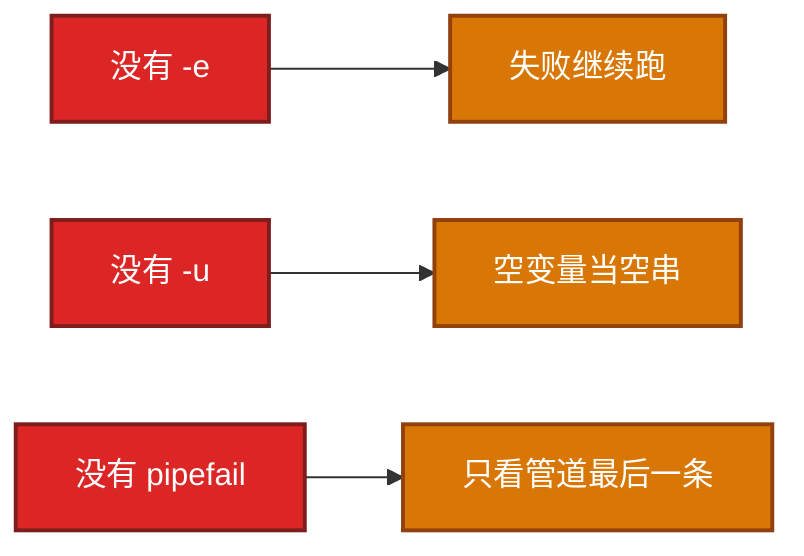
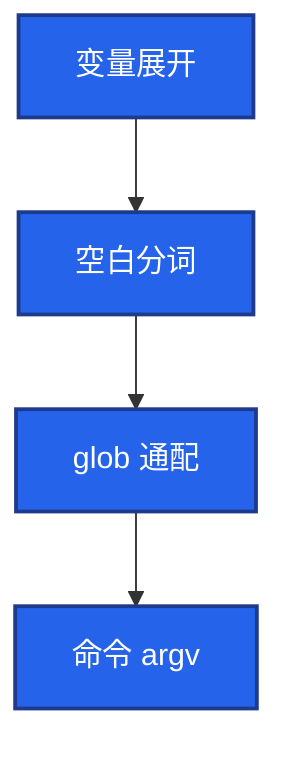
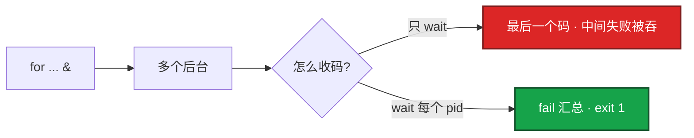
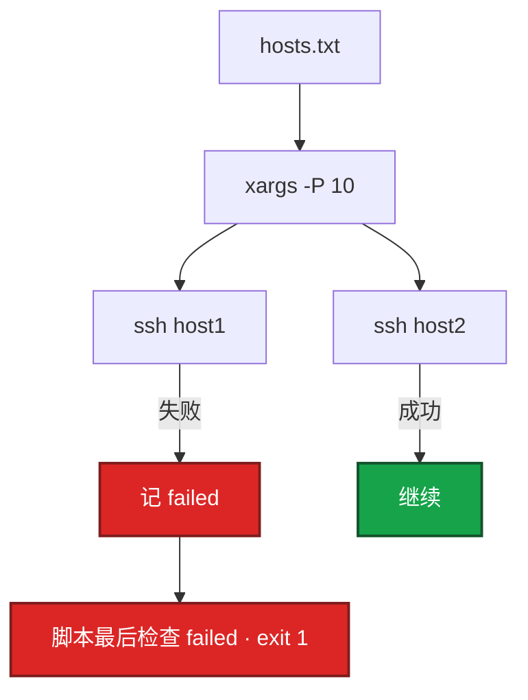
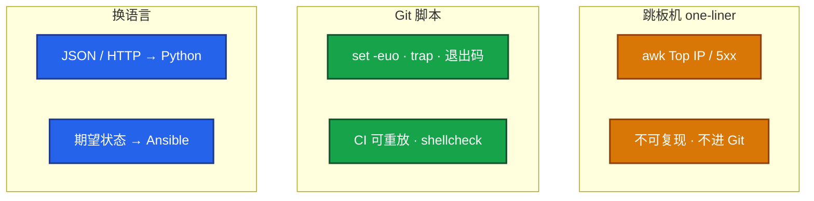

# 01｜Shell · SRE 开发能力

> 把 Shell 当**编排层**：调 kubectl / systemctl / awk / ssh，失败可见、可复现；不是「能写循环就算会」。

## 面试怎么考

| 标记 | 考点 |
|------|------|
| **核心** | `set -euo pipefail` 三开关各挡什么；`-e` 在 `if` / `\|\|` 里不停 |
| **必会** | 引号与 `-u` 分工；`PIPESTATUS`；trap EXIT；后台按 pid `wait` |
| **常用** | `xargs -P` 有界并发；探活有上限；SSH 循环记失败主机 |
| **常考** | one-liner vs Git 脚本；`\|\| true` 什么时候是埋雷；`bash -x` / shellcheck |

**30 秒怎么说**：Shell 是编排层，生产脚本头必须 `set -euo pipefail`，管道还要 `pipefail`，否则 grep 失败 wc 成功脚本仍绿。变量一律加引号，`-u` 抓未定义、引号防空值分词。后台 `&` 必须按 pid `wait` 收码，战斗服有状态串行滚动。跳板机 one-liner 只排障，结论进 Git。复杂 JSON / HTTP 重试换 Python。

---

## 能力边界

| 维度 | Shell 适合 | Shell 不适合 |
|------|------------|--------------|
| **任务** | 10 行管道、调已有命令、开服清单胶水 | 嵌套 JSON、带签名 HTTP、复杂重试 |
| **生命周期** | 一次性排障、CI/Cron 短脚本 | 长期驻留、要单测、要类型 |
| **并发** | 大厅/网关有限并行（`-P 10`） | 有状态战斗服全员 `&` restart |
| **vs Python** | kubectl 一行能定、管道组合 | 多 API 编排、ThreadPool、argparse |
| **vs Ansible** | 本机编排、CI 胶水 | OS 期望状态、多机相同配置 |
| **vs Go** | 跳板机 one-liner | 数千节点常驻 SSH Agent |

三个角色不要混：

| 角色 | 干什么 | 面试口径 |
|------|--------|----------|
| **跳板机 one-liner** | 看 5xx / Top IP；不可 review | 只排障，不当变更记录 |
| **Git 脚本** | 三开关 + trap + 退出码 + dry-run | 生产变更必须能复现 |
| **Ansible / Python** | 期望状态 / API 编排 | 不要两套抢同一文件 |

> **记住**：10 行管道 → Shell；调 API + JSON → Python；常驻采集 → Go。

**本章不讲：** 复杂 JSON / HTTP → [02 Python](../02-Python运维/)；正则抠字段 → [05](../05-正则与文本处理/)；批量部署整题 → [04](../04-运维开发实战题/)；Ansible → [05-工程化 04-Ansible](../../05-工程化与自动化/04-Ansible/)。

---

## 语言最小集（读写得动就够）

> **要不要学？** 要。大厂不考「for 循环语法题」，但**手写脚本、读 CI 脚本、白板 coding** 离不开这些。下面只收运维脚本天天用的，**不是** Bash 大全；冷门 `${var:0:5}`、进程替换 `<()` 面试几乎不问。

| 构造 | 写法 | SRE 场景 |
|------|------|----------|
| 变量 | `name=val`（**等号两侧无空格**） | 配置路径、版本号 |
| 只读 | `readonly VER` | 防脚本中途改版本 |
| 命令结果 | `out=$(cmd)` 或 `` out=`cmd` `` | 取 kubectl 输出 |
| 退出码 | `$?`；`cmd && ok \|\| fail` | 判断 nginx -t |
| 条件 | `[[ -f "$f" ]]` `[[ -z "$s" ]]` `[[ "$a" == "$b" ]]` | 文件存在、非空 |
| 数值比较 | `[[ $n -lt 10 ]]` `-eq -ne -gt` | 重试次数、并发上限 |
| if | `if cmd; then ... elif ... else ... fi` | 分支部署 |
| for | `for h in "${hosts[@]}"; do ... done` | 批量主机 |
| while 读行 | `while IFS= read -r line; do ... done < file` | 读 hosts.txt |
| 函数 | `deploy() { local h="$1"; ... }` | 复用逻辑 |
| 返回码 | `return 1` / 末尾 `exit 1` | 失败让 Cron 变红 |
| 重定向 | `cmd >log 2>&1`；`cmd >>log` | 日志合并 |
| 测试文件 | `[[ -f ]]` `-d` `-x` `-s`（非空） | 配置、目录、可执行 |
| 算术 | `(( n++ ))` `(( fail++ ))` | 计数失败台数 |

**最小可读脚本骨架**（先能写，再套后面的三开关）：

```bash
#!/usr/bin/env bash
# 生产版在下一节加 set -euo pipefail

usage() { echo "Usage: $0 --env staging|production"; exit 1; }

ENV=""
while [[ $# -gt 0 ]]; do
  case "$1" in
    --env) ENV="$2"; shift 2 ;;
    -h|--help) usage ;;
    *) echo "unknown: $1"; usage ;;
  esac
done
[[ -n "$ENV" ]] || usage

deploy_one() {
  local host="$1"
  echo "deploy $host env=$ENV"
  ssh -n "$host" "nginx -t" || return 1
}

main() {
  local fail=0
  for host in "${HOSTS[@]}"; do
    deploy_one "$host" || fail=1
  done
  return "$fail"
}

HOSTS=(gw-1 gw-2)
main || exit 1
```

| 易错 | 正确 |
|------|------|
| `if [ $n > 10 ]` | `[[ $n -gt 10 ]]`（`>` 是重定向） |
| `for h in $(cat hosts)` | `while IFS= read -r h` 或数组 |
| 函数里改全局变量忘 `local` | `local host="$1"` |
| 只看 `$?` 不立刻读 | 下一条命令会覆盖 |

> **记住**：语言最小集 + 下一节「三开关/引号/trap」= Shell 面试够用；复杂 JSON 换 Python。

---

## 语法必会

按 SRE 场景组织：每点 **用法 + 示例 + 易错**。

### 1. 脚本头三开关

**用法**：生产脚本第一行有效代码前写 `set -euo pipefail`。

```bash
#!/usr/bin/env bash
set -euo pipefail
```

| 选项 | 没有它会怎样 | 生产故事 |
|------|--------------|----------|
| `-e` | 失败继续跑 | 拷配置失败仍 reload，大厅 502 |
| `-u` | 未定义变量当空 | `rm -rf $DIR/` 空变量 → `rm -rf /` |
| `-o pipefail` | 只看管道最后一条 | `grep 5xx \| wc -l` 文件不存在仍成功 |

**易错**：`-e` 在 `if cmd`、`cmd || fallback` 里**不会停**——那是显式处理失败，不是开关坏了。

```bash
if nginx -t; then systemctl reload nginx; fi   # -t 失败不会触发 -e 退出
grep -q 5xx access.log || true                 # 吞失败，后面当成功——要写清为什么
```

### 2. 引号与参数展开

**用法**：变量、数组、`"$@"` 一律加引号；数字比较用 `-lt` / `-gt`。

```bash
scp "$CFG" "$host:/etc/nginx/"
for s in "${SERVERS[@]}"; do deploy "$s"; done   # 数组必须引号
: "${ENV:?ENV required}"                        # 必填，空或未定义立刻退
DB_HOST="${DB_HOST:-localhost}"                 # 有默认用 :-
```

| 写法 | 结果 |
|------|------|
| `cat $filename` | 空格分词 + glob |
| `cat "$filename"` | 一个参数 |
| `"$@"` | 保留每个参数边界 |
| `"$*"` | 糊成一串 |
| `if [[ $n -gt 10 ]]` | 数值比较 |
| `if [[ $n > 10 ]]` | **错**：`>` 是重定向 |

**易错**：`set -u` **不能替代引号**。未定义被 `-u` 抓住；**已定义但为空**（`CFG=""`）`-u` 放过，未加引号仍会裂开。

### 3. 管道与 PIPESTATUS

**用法**：管道任一失败要让脚本失败 → 必须 `pipefail`；个别命令允许失败用 `if cmd` 或明确 `cmd || true`。

```bash
grep 5xx access.log | wc -l
echo "${PIPESTATUS[@]}"    # 管道结束立刻读，后面命令会冲掉
```

**易错**：没有 `pipefail` 的 `-e` 是半套。

### 4. trap 与临时文件

**用法**：`mktemp` + `trap cleanup EXIT`，正常/失败/Ctrl-C 都清理。

```bash
TMP="$(mktemp)"
cleanup() { rm -f "$TMP" "$LOCK"; }
trap cleanup EXIT
```

**易错**：不要在 trap 里做复杂发布（又 scp 又 reload）；清理要幂等（`rm -f`）；trap 里再 `exit 1` 可能冲掉原失败码。

### 5. 后台 wait 与并发

**用法**：无状态可有限并行；有状态串行；必须按 pid 收码。

```bash
fail=0
pids=()
for s in login gate; do
  deploy "$s" "$VER" &
  pids+=("$!")
done
for pid in "${pids[@]}"; do
  wait "$pid" || fail=1
done
[[ "$fail" -eq 0 ]] || exit 1
```

**易错**：只写 `wait` 不加 pid——默认退出码是**最后一个**结束的任务，中间失败仍可能当成功。

### 6. xargs 有界并发

**用法**：批量主机用 `xargs -P`，上限约 10；子进程失败要自己汇总。

```bash
export -f deploy_host
export CONFIG_SRC DRY_RUN
xargs -P 10 -I {} bash -c 'deploy_host {}' < hosts.txt
```

| 坑 | 正确做法 |
|----|----------|
| `xargs -P` 子失败，xargs 仍 0 | 函数里记 failed，最后检查 |
| `$(cat hosts)` 读列表 | `while IFS= read -r` 或数组 |
| `ssh` 吃掉 stdin | `ssh -n` 或 `xargs -a` |
| `-P 200` 打爆堡垒机 | 上限 10 左右 |

### 7. here-doc 与 heredoc 传配置

**用法**：多行配置、远程脚本内联。

```bash
ssh -n "$host" bash -s <<'EOF'
set -euo pipefail
nginx -t
systemctl reload nginx
EOF
```

**易错**：不带引号的 `<<EOF` 会展开本地变量；远程执行要用 `<<'EOF'`。

### 8. 探活等待

**用法**：有上限 + `curl --max-time`；禁止无上限 `while true`。

```bash
for i in $(seq 1 30); do
  curl -sf --max-time 2 "http://127.0.0.1:8080/health" && exit 0
  sleep 2
done
log "health timeout" >&2
exit 1
```

**易错**：探活过了 ≠ 对玩家开放；登录冒烟见 [08-游戏 02](../../08-游戏运维专题/02-开服合服/)。

### 9. bash -x 与 shellcheck

**用法**：提交前 `shellcheck script.sh`；调试 `bash -x`，**勿打印密钥**。

```bash
shellcheck hall-restart.sh
bash -n hall-restart.sh    # 语法检查
# CI 临时 set -x 可以，确认日志谁能看；调试完 set +x
```

**易错**：`set -x` 会把 token、DB URL 打进日志——生产开着 xtrace 发版 = 泄漏。

### 10. SSH 批量循环

**用法**：`while read` + 记失败 + 最后非 0。

```bash
failed=()
while IFS= read -r host; do
  [[ -z "$host" || "$host" == \#* ]] && continue
  if ! ssh -n -o ConnectTimeout=5 "$host" 'nginx -t'; then
    failed+=("$host")
  fi
done < hosts.txt
[[ ${#failed[@]} -eq 0 ]] || { log "failed=${failed[*]}"; exit 1; }
```

**易错**：生产长期 `StrictHostKeyChecking=no`；第 N 台失败时前 N-1 台已变更——要有 bak 回滚策略。

---

## 原理讲透

### 3.1 为什么三开关是一套

**一句话**：Shell 默认「管道成功 = 最后一条成功」，`-e` 单独挡不住管道中间失败。

**打个比方**：像工厂流水线——中间一道工序坏了，最后包装工仍贴「合格」标签，除非你在每道工序都装传感器（`pipefail`）。

**现场走一遍**（活动后查 5xx，**故意不设 pipefail** 复现事故）：

1. 跳板机执行：

```bash
grep ' "5[0-9][0-9]' /var/log/nginx/access.log | wc -l
echo exit=$?
```

2. 屏幕出现（access.log 路径错或不存在）：

```text
grep: /var/log/nginx/access.log: No such file or directory
0
exit=0
```

3. **输出解读**：grep 报错了，但 wc 数空行输出 `0`，**退出码仍是 0**——Cron 认为「今天 0 个 5xx」，实际是没读到日志。

4. 补上 `set -euo pipefail` 后再跑同样命令，脚本在 grep 失败处直接退出，Cron 变红。



| 写法 | `-e` 会不会停 | 原因 |
|------|:-------------:|------|
| `cmd` 单独失败 | 会 | 默认 |
| `if cmd; then` | 不会 | 条件里的失败是分支 |
| `cmd \|\| fallback` | 不会 | 显式处理 |
| 管道且无 pipefail | 只看最后一条 | 前面挂后面成功 → 脚本成功 |

**面试怎么说**：「生产脚本头必须 `set -euo pipefail`，否则管道中间 grep 挂了 wc 仍成功，CI 绿但统计是假的。」

> **记住**：`set +e` 只在你清楚哪一段允许失败时局部关掉，段末立刻 `set -e`。不要整文件 `set +e` 当「稳健」。

### 3.2 分词、glob 与空值

**一句话**：Shell 先展开变量、再分词、再 glob，未加引号会在空格和 `*` 处裂开。

**打个比方**：像把一整句「hello world」交给程序——不加引号等于按空格切成两个词；`*` 还会变成「当前目录所有文件名」。

**现场走一遍**（开服脚本删备份目录，变量空）：

1. 某次变更漏设 `BACKUP_DIR`，脚本里有：

```bash
set -u   # 有 -u，但没引号
BACKUP_DIR=""   # 已定义但为空，-u 不拦
rm -rf "$BACKUP_DIR"/*   # 若写成 rm -rf $BACKUP_DIR/* ...
```

2. 若误写成 `rm -rf $BACKUP_DIR/*`（无引号），空变量展开后命令变成：

```text
rm -rf /*
```

3. **输出解读**：`-u` 只抓**未定义**，**已定义但为空**仍放过；引号才是最后一道门。



**面试怎么说**：「`-u` 和引号分工：未定义靠 `-u`，空值靠引号；函数里循环变量要 `local`，否则 `for s` 污染全局会串台。」

### 3.3 后台进程与 wait 语义

**一句话**：`wait` 不加 pid 只保证「等完」，不保证「收齐失败码」。

**打个比方**：像三个快递员同时出门——你只问「最后一个回来的说成功了吗」，中间两个丢件了你不知道。

**现场走一遍**（三台网关并行 reload，中间一台 nginx -t 失败）：

1. 错误写法：

```bash
for s in gw-1 gw-2 gw-3; do deploy "$s" &; done
wait
echo exit=$?
```

2. gw-2 的 `nginx -t` 失败（exit 1），gw-1/gw-3 成功；`wait` 无 pid 时退出码 = **最后结束的任务**（可能是 gw-3 的 0）。

3. 屏幕出现：

```text
nginx: configuration test failed
[gateway-02] done
exit=0
```

4. **输出解读**：CI 绿，但 gw-2 配置是坏的——大厅部分 502。

5. 正确写法：`wait "$pid" || fail=1` 逐个收码，末尾 `[[ "$fail" -eq 0 ]] || exit 1`。



**面试怎么说**：「无状态可以 `-P 10` 并行，但必须按 pid `wait` 汇总；战斗服有状态必须串行，一台 restart 探活过再下一台。」

### 3.4 xargs -P 与失败可见

**一句话**：`xargs` 是并发调度器，不是事务管理器——子进程非 0 不会自动传给你。

**打个比方**：像派 10 个外包同时装修——总包只问「今天干完了吗」，不会自动告诉你哪几间装错了。

**现场走一遍**（100 台 nginx -t，`xargs -P 10`）：

1. 脚本末尾只写 `xargs -P 10 ...`，gw-17 的 nginx -t 失败。

2. 屏幕出现：

```text
nginx: [emerg] unknown directive "proxy_passs" in /etc/nginx/nginx.conf:42
...
all done
exit=0
```

3. **输出解读**：xargs 自身退出码通常是 0（除非子进程被 signal 杀掉）；**必须在 deploy_host 里写 failed 文件**，末尾 `[[ -s failed_hosts.txt ]] && exit 1`。



**面试怎么说**：「xargs -P 子失败不会让脚本非 0，要在函数里记 failed 列表，最后检查文件非空再 exit 1；并发上限约 10，别打满堡垒机。」

### 3.5 one-liner vs 入库脚本

**一句话**：one-liner 解决「5 分钟内看现场」；Git 脚本解决「明天还能重放」。

**打个比方**：one-liner 像值班随手记的便签；Git 脚本是变更单上的正式步骤——便签丢了没法审计。

**现场走一遍**（活动高峰 502，群里有人贴 awk 一行流）：

1. 群里：`awk '$9>=500{print $1}' access.log | sort | uniq -c | sort -rn | head`

2. 输出 Top IP 后，有人直接 iptables 封 IP——第二天探活 IP 被封，登录全挂。

3. **输出解读**：one-liner **只解释现象**，结论应进 Runbook/Git 脚本（含 dry-run、失败汇总）；封禁走变更单。



**面试怎么说**：「跳板机 one-liner 只排障，生产变更必须 Git 脚本 + 三开关 + trap；复杂 JSON/HTTP 换 Python，期望状态换 Ansible。」

---

## 生产模板

每个模板：**场景 → 现场走一遍 → 完整脚本 → 典型输出 → 输出解读**。

### 模板 A：生产脚本最低标准

**场景**：Cron 调用的发布前检查，缺环境变量应立刻失败，临时文件 Ctrl-C 也要清。

**现场走一遍**：

1. 保存为 `scripts/precheck.sh`，`chmod +x`。
2. 不带环境变量跑：`./precheck.sh` → 应立刻非 0。
3. 带变量跑：`ENV=production DB_HOST=10.0.0.5 ./precheck.sh` → stderr 有 log 行，exit 0。
4. 运行中 Ctrl-C → `/tmp/tmp.xxx` 被 trap 清掉。

```bash
#!/usr/bin/env bash
set -euo pipefail

SCRIPT_DIR="$(cd "$(dirname "${BASH_SOURCE[0]}")" && pwd)"
TMP="$(mktemp)"
cleanup() { rm -f "$TMP"; }
trap cleanup EXIT

log() { echo "[$(date '+%F %T')] $*" >&2; }

: "${ENV:?ENV required}"
DB_HOST="${DB_HOST:-localhost}"

main() {
  log "start env=$ENV db=$DB_HOST"
  # ... 业务逻辑 ...
  log "done"
}

main "$@"
```

```text
./precheck.sh
precheck.sh: line 12: ENV: ENV required
exit=1

ENV=production DB_HOST=10.0.0.5 ./precheck.sh
2026-08-28 10:00:01 start env=production db=10.0.0.5
2026-08-28 10:00:03 done
exit=0
```

**输出解读**：

| 行/现象 | 含义 |
|---------|------|
| `ENV: ENV required` | `: "${ENV:?...}"` 必填校验，比跑到一半才发现好 |
| log 在 stderr | stdout 留给 `kubectl apply -f -` 等管道 |
| Ctrl-C 后无残留 tmp | `trap cleanup EXIT` 生效 |

| 行 | 作用 |
|----|------|
| `#!/usr/bin/env bash` | 不要写死 `/bin/sh`（dash 无 pipefail） |
| `SCRIPT_DIR` | 相对路径相对脚本，不相对 cwd |
| `log` → stderr | stdout 留给机器可读结果 |
| `: "${ENV:?...}"` | 必填环境变量 |

**面试怎么说**：「生产脚本最低标准：三开关、trap 清临时文件、必填 env、log 走 stderr、失败非 0。」

### 模板 B：滚动重启（有状态串行）

**场景**：三台战斗服，必须一台探活过再动下一台，禁止全员 `&` restart。

**现场走一遍**：

1. `systemctl restart battle-1` → 等 health 200 → 再 battle-2。
2. 若 battle-2 探活 30 次仍失败，脚本 **exit 1**，battle-3 **不应**被 restart。

```bash
#!/usr/bin/env bash
set -euo pipefail

log() { echo "[$(date '+%F %T')] $*" >&2; }

wait_health() {
  local url=$1
  for i in $(seq 1 30); do
    curl -sf --max-time 2 "$url" && return 0
    sleep 2
  done
  return 1
}

restart_one() {
  local svc=$1
  log "restart $svc"
  systemctl restart "$svc"
  wait_health "http://127.0.0.1:8080/health" || {
    log "health failed $svc"
    exit 1
  }
  log "ok $svc"
}

# 战斗服：串行
for s in battle-1 battle-2 battle-3; do
  restart_one "$s"
done
```

```text
2026-08-28 02:00:01 restart battle-1
2026-08-28 02:00:15 ok battle-1
2026-08-28 02:00:15 restart battle-2
2026-08-28 02:01:15 health failed battle-2
exit=1
# battle-3 未执行
```

**输出解读**：探活 30 次 × 2s = 最多约 60s；`curl --max-time 2` 防止单次 hang 住；失败时 **不要**继续下一台。

### 模板 C：SSH 批量 nginx -t（记失败）

**场景**：100 台网关配置变更前批量校验，任意一台失败整 job 非 0。

**现场走一遍**：

1. `hosts.txt` 一行一台，支持 `#` 注释。
2. `./check-nginx.sh hosts.txt` → 逐台 ssh `nginx -t`。
3. gw-17 配置有错 → stderr 打印 `failed: gw-17`，exit 1。

```bash
#!/usr/bin/env bash
set -euo pipefail

HOSTS_FILE="${1:-hosts.txt}"
failed=()

while IFS= read -r host; do
  [[ -z "$host" || "$host" == \#* ]] && continue
  if ! ssh -n -o ConnectTimeout=5 "$host" 'nginx -t 2>&1'; then
    failed+=("$host")
  fi
done < "$HOSTS_FILE"

if [[ ${#failed[@]} -gt 0 ]]; then
  echo "failed: ${failed[*]}" >&2
  exit 1
fi
echo "all ok"
```

```text
nginx: configuration file /etc/nginx/nginx.conf test is successful
...
nginx: [emerg] unknown directive "proxy_passs" in /etc/nginx/nginx.conf:42
failed: gw-17 gw-42
exit=1
```

**输出解读**：`ssh -n` 防止 ssh 吃掉 xargs 的 stdin；`ConnectTimeout=5` 避免单台 hang 住整批。

### 模板 D：现场 one-liner 速查（排障用）

**场景**：活动高峰 502，5 分钟内要看 Top IP 和状态码分布——**只排障，不当变更**。

**现场走一遍**：

1. `head -1 access.log` 确认 combined 列号。
2. Top IP → 若 IP 集中、URL 随机 → 扫号；若 `/login` 集中 5xx → 上游挂。
3. 结论贴工单，**不要**直接 iptables 封 Top IP（可能是探活/NAT 出口）。

先 `head -1 access.log` 对 `log_format`。combined 默认：`$1` IP，`$9` 状态，`$7` path。

```bash
# Top IP
awk '{print $1}' access.log | sort | uniq -c | sort -rn | head

# 状态码分布
awk '{print $9}' access.log | sort | uniq -c | sort -rn

# 最近 5xx
awk '$9 >= 500 {print}' access.log | tail

# /login 的 499/502
awk '$7 ~ /\/login/ && ($9 == 499 || $9 == 502)' access.log | tail
```

```text
   8421 10.0.0.5
    312 10.0.0.12
...
   8421 502
    312 200
```

Top IP 集中 → 扫号；URL 分散全是 502 → 上游大厅挂。复杂统计进 Python（[02](../02-Python运维/)）。10GB 先 grep 再 sort，不要一次 sort 打满跳板机内存。

---

## 踩坑清单

| 现象 | 原因 | 修法 |
|------|------|------|
| CI 绿、大厅 502 | 缺 `pipefail` 或 `-e`；管道中间失败 | 补三开关；查失败行是否在管道里 |
| 删了邻服目录 | 变量空且未加引号 | 引号 + `-u` + `${VAR:?}` |
| 一台没起来、CI 仍绿 | 后台没按 pid `wait` | `wait "$pid" \|\| fail=1` |
| 探活 40 分钟 | `while true` 无上限 | 30 次 × 2s + `--max-time` |
| SSH 200 路堡垒机打满 | `-P` 过大 | 降到 10；失败列表进日志 |
| 5xx 统计为零 | 列号抄错 | `head -1` 对 `log_format` |
| `set -x` 打出 token | xtrace 展开变量 | 立刻 rotate；关掉 xtrace |
| `umount \|\| true` 后 mkfs | `\|\| true` 吞门禁 | `if ! umount; then exit 1; fi` |
| `$(cat hosts)` 主机名裂开 | 再分词 | `while read` / 数组 |
| 群里 awk 当正式变更 | one-liner 不可复现 | 结论进 Git / Runbook |

---

## 必会 · 常考

| 说法 | 对错 | 口径 |
|------|:----:|------|
| 开了 `-e` 就能抓住管道失败 | 错 | 还要 `pipefail` |
| `set -u` 可以替代引号 | 错 | 空值 `-u` 放过 |
| `wait` 不加 pid 能收齐失败 | 错 | 默认码是最后一个任务 |
| 战斗服可以 `&` 全员 restart | 错 | 有状态必须串行 |
| `xargs -P` 子失败会让脚本非 0 | 错 | 要自己汇总 |
| `cmd \|\| true` 让脚本更稳健 | 错 | 只用于失败不影响目标 |
| 跳板机 awk 可以当变更记录 | 错 | 结论入库 |
| `while true` curl health 可以上 CI | 错 | 必须有上限 |
| 数字比较用 `>` | 错 | 用 `-gt`；`>` 是重定向 |
| 生产开着 `set -x` 发版 | 错 | 密钥进日志 |

**数字**：探活 30 次 × 2s；curl `--max-time 2`；SSH / xargs 并发上限约 **10**；`rollout status --timeout=120s`。

**易混**：`-e` vs `pipefail`；`-u` vs 引号 vs 空值；`wait` vs `wait "$pid"`；one-liner vs Git 脚本；`\|\| true` vs `if cmd`。

---

## 合上书，问自己

1. 生产脚本头三行是什么？`pipefail` 挡的是哪一类失败？
2. `set -u` 和引号各防什么？空字符串会不会被 `-u` 抓住？
3. Ctrl-C 之后临时文件谁清？trap 里能不能再 `exit 1`？
4. 后台 `&` 怎么收码？战斗服能不能并行 restart？
5. `xargs -P` 子进程失败，脚本退出码一定非 0 吗？
6. 等待服务启动为什么禁止 `while true`？现场 awk 能不能当变更？

六题都能口述，这一章就过了。下一章：[02 Python 运维](../02-Python运维/)——timeout、线程池、退出码。
