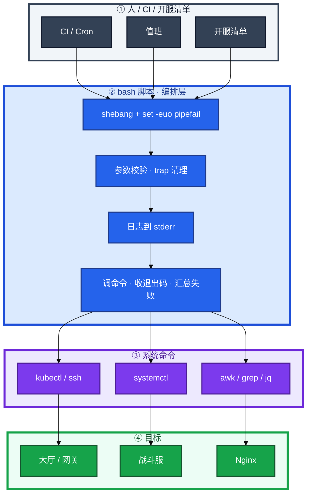
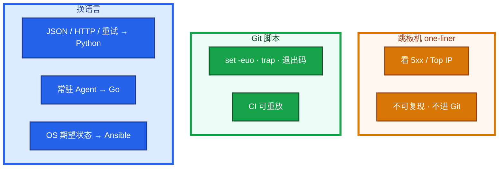
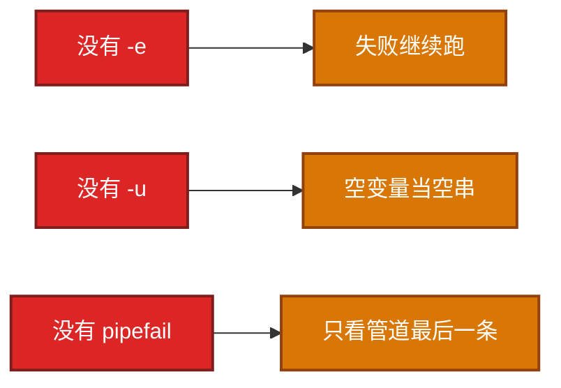
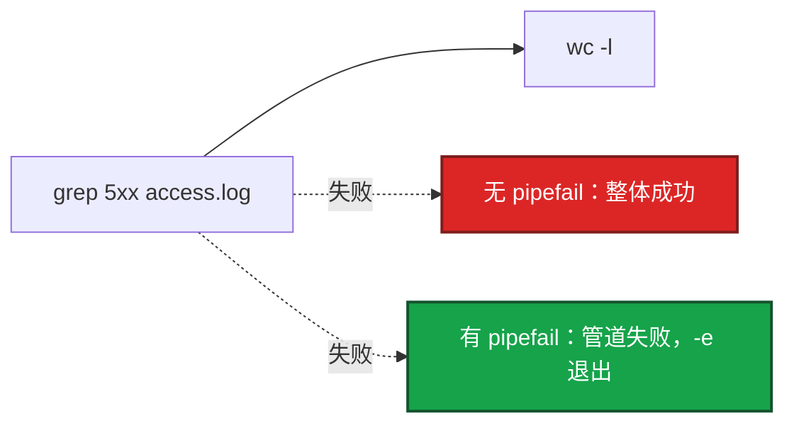
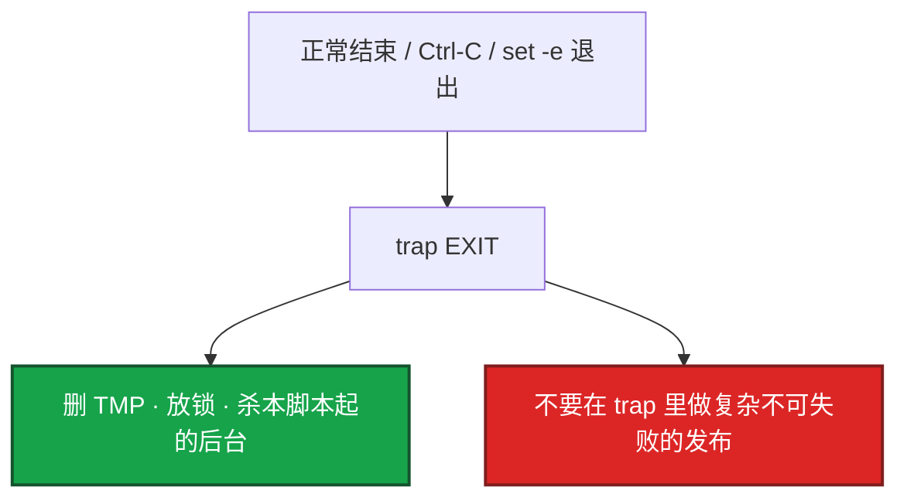
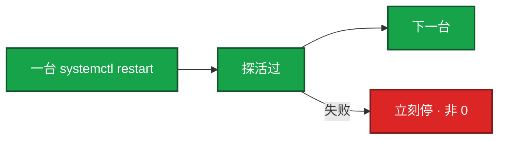

# Shell


活动前 2 小时，滚动重启 8 台大厅。`hall-restart.sh` 读主机列表、一台 `systemctl restart`、探活过再下一台。CI 绿灯，第 3 台拷配置失败，脚本仍 `reload`，大厅 502。群里有人把跳板机上一句 awk 当成正式变更。

先别动手。这一章后半全是你会动手的：**怎么写头、怎么停失败、怎么收后台码、怎么 `xargs -P`、探活怎么设上限。** 前面的概念和原理，是为了让你动手时不把管道成功当成变更成功。

**读完你能：** 白板上画出脚本在人和系统命令中间站哪一层；缺 `-e` / `-u` / `pipefail` 各会怎样；会写 trap、按 pid `wait`、`xargs -P` 汇总失败；能把 one-liner 和入库变更分开。

## 本章目录

缩进 = 上下级。3 下面才是 3.1。

想钉在**正文左边**跟着滚：菜单 **查看 → 打开视图 → 大纲**。Markdown 预览做不到独立左栏，目录只能写在文章开头。

- [1. 基本概念](#1-基本概念)
- [2. 架构图](#2-架构图)
- [3. 原理](#3-原理)
  - [3.1 `set -euo pipefail`](#31-set--euo-pipefail缺哪个会出事)
  - [3.2 引号与分词](#32-引号与分词空格和空值怎么炸)
  - [3.3 管道与 PIPESTATUS](#33-管道与-pipestatus)
- [4. 落地：怎么写、怎么跑](#4-落地怎么写怎么跑)
- [5. 关键写法与坑](#5-关键写法与坑)
  - [5.1 trap](#51-trap与清理)
  - [5.2 后台 wait](#52-后台--与-wait)
  - [5.3 xargs](#53-xargs并发与失败)
  - [5.4 `|| true`](#54--true允许失败)
- [6. 常用命令](#6-常用命令)
- [7. 常用操作](#7-常用操作)
  - [7.1 探活等待](#71-探活等待有上限)
  - [7.2 SSH 循环](#72-ssh-循环记失败主机)
  - [7.3 滚动重启](#73-滚动重启有状态串行)
  - [7.4 现场 one-liner](#74-现场-one-liner排障用不是发布)
- [8. 生产排障](#8-生产排障)
- [9. 必会 · 常考](#9-必会--常考)
- [合上书](#合上书问自己)

**本章不讲：** 复杂 JSON / HTTP / 重试 → [02 Python 运维](../02-Python运维/)；正则抠字段 → [05 正则与文本处理](../05-正则与文本处理/)；批量部署整题 → [04 运维开发实战题](../04-运维开发实战题/)；Ansible 期望状态 → [05-工程化 04-Ansible](../../05-工程化与自动化/04-Ansible/)；开服流水线业务约束 → [08-游戏 02-开服合服](../../08-游戏运维专题/02-开服合服/)。

---

## 1. 基本概念

Shell 是 **编排层**：读参数、设安全开关、失败就停、清理临时文件，去调已经存在的命令——kubectl、systemctl、awk、ssh。它不是「能写循环就算会」。

JSON 嵌套、带签名的 HTTP、要测的长期工具，不该挤在 bash 里。

| 在 Shell 里做 | 不在 Shell 里做 |
|---------------|-----------------|
| 管道组合、调 kubectl / 系统命令 | 调 HTTP JSON API、复杂重试、签名 |
| 一次性排障、开服检查清单胶水 | 长期运行、要单测、要类型 |
| 10 行内能看懂的变更 | 分支超过一屏、解析 nested JSON |
| 大厅有限并发、战斗服串行滚动 | `&` 全员一起 restart 有状态服 |

三个角色不要混：

| 角色 | 干什么 |
|------|--------|
| **跳板机 one-liner** | 看现场、缩小范围；不可 review、不可复现 |
| **Git 里的脚本** | `set -euo pipefail`、dry-run、退出码、可回放 |
| **Ansible / Python** | OS 期望状态、多机相同配置；API 编排 |

> **记住**：生产脚本必须能复现——进 Git，带 `set -euo pipefail`，失败非 0。one-liner 只用于跳板机看现场；得出结论后写成脚本或 Runbook。战斗服有状态：**一台成功再下一台**。

---

## 2. 架构图

先把整张图钉住。后面写法、命令、排障都对着这张图说话。



图上三条线：

1. **脚本站在人和命令中间**，不替代 kubectl / systemctl。
2. **失败必须非 0**，CI / Cron 只看退出码。
3. **awk 看现场 ≠ 变更**；变更走 Git 里那一层。

三种用法（写的时候选，挂的时候故障域不一样）：



大厅 / 网关无状态可以有限并发。战斗服必须串行。和 Ansible：OS 期望状态、多机相同配置用 Ansible；本机编排几条命令、CI 胶水用 Shell。两边都要幂等和失败可见，不要一套手工 ssh、另一套 playbook 抢同一文件。

---

## 3. 原理

原理只保留动手和面试会用到的：三个开关各挡什么、未加引号怎么裂开、管道成功为什么不等于变更成功。

**本节 3 块：** 3.1 三开关 · 3.2 引号 · 3.3 管道

### 3.1 `set -euo pipefail`：缺哪个会出事

三个开关是一套，不是装饰。缺一个，现场常见的是「脚本绿了，环境已经半残」。



| 选项 | 没有它会怎样 | 生产故事 |
|------|----------------|----------|
| `-e` | 失败继续跑 | 拷配置失败仍 reload，把坏文件载入，大厅 502 |
| `-u` | 未定义变量当空 | `rm -rf $DIR/` 在没引号时变成 `rm -rf /`，邻服被扫到 |
| `-o pipefail` | 只看管道最后一条 | `grep 5xx \| wc -l` 文件不存在，grep 失败但 wc 成功 |

`-e` 的例外（面试常追，写错会误判「开了 -e 为什么没停」）：

| 写法 | `-e` 会不会停 | 原因 |
|------|:-------------:|------|
| `cmd` 单独一条失败 | 会 | 默认 |
| `if cmd; then` | 不会 | 条件里的失败是分支，不是事故 |
| `cmd \|\| fallback` | 不会 | 你显式处理了失败 |
| `cmd && next` | 前失败则不停后面 | 短电路，整体非 0 仍会触发 `-e`（取决于是否在条件里） |
| 管道且无 pipefail | 只看最后一条 | 前面挂了后面成功 → 脚本成功 |
| 函数里失败 | 会（bash 4+ 且非条件） | 函数返回非 0 会向上传 |

`set +e` 只在你清楚哪一段允许失败时局部关掉，段末立刻 `set -e`。不要整文件 `set +e` 当「稳健」。

`set -u` 和 `${var:-default}` / `${var:?msg}` 是配套：未定义被 `-u` 抓住；要给默认用 `:-`；必填用 `:?`。

> **记住**：`pipefail` 是 `-e` 的另一半。没有它的 `-e` 是半套。允许失败必须写清，不能整文件 `set +e`。

### 3.2 引号与分词：空格和空值怎么炸

未加引号会 **分词 + glob**。大厅主机名带空格少见，文件名常见。`$1` 为空、数组展开没引号，都会变成删错目录 / 扫到别的服。

| 写法 | 结果 |
|------|------|
| `cat $filename` | 文件名有空格 → 两个参数，还可能 glob |
| `cat "$filename"` | 一个参数，空格安全 |
| `rm -rf $DIR/` | DIR 空且没 `-u` → `rm -rf /` |
| `"${SERVERS[@]}"` | 每个元素独立参数 |
| `${SERVERS[@]}` | 再分词、再 glob |
| `"$@"` | 保留参数边界 |
| `"$*"` | 糊成一串，传给下游会错 |

```bash
cat "$filename"
if [[ -z "${TOKEN:-}" ]]; then
  log "TOKEN empty"; exit 1
fi
if [[ "$ENV" == production ]]; then
  log "prod path"
fi
```

1. 用 `[[ ]]` 判字符串，不要用 `[ ]` 当默认（后者更脆，需要更多引号纪律）。
2. 函数里 `local`，别把循环变量漏到全局。`hall-restart.sh` 里 `for s in ...` 的 `s` 若不 `local`，下次开服脚本复用同名变量会串到上一台。
3. 数字比较用 `-lt` / `-gt`。`>` 是重定向：`if [[ $n > 10 ]]` 不是数值比较。

`set -u` **不能替代引号**：未定义被 `-u` 抓住；**已定义但为空**（`CFG=""`）`-u` 放过，未加引号仍会裂开或打到空路径。两边都防，才能碰 `rm` / `scp`。

### 3.3 管道与 PIPESTATUS



谁失败看 `${PIPESTATUS[@]}`，管道一结束 **立刻读**。后面再跑命令会冲掉数组。

个别命令允许失败：`if cmd; then` 或明确的 `cmd || true`——后者会吞失败，后面还当成功，必须写清为什么允许。

---

## 4. 落地：怎么写、怎么跑

生产脚本最低模板。缺一项，夜班无法判断「没干活」还是「干错了」。

```bash
#!/usr/bin/env bash
set -euo pipefail
SCRIPT_DIR="$(cd "$(dirname "${BASH_SOURCE[0]}")" && pwd)"
TMP="$(mktemp)"
cleanup() { rm -f "$TMP"; }
trap cleanup EXIT

log() { echo "[$(date '+%F %T')] $*" >&2; }

: "${ENV:?ENV required}"                 # 必填，缺了立刻退
DB_HOST="${DB_HOST:-localhost}"          # 有默认才用 :-
```

| 行 | 作用 |
|----|------|
| `#!/usr/bin/env bash` | 用 PATH 里的 bash，不要写死 `/bin/sh`（dash 没有 `pipefail` 数组） |
| `set -euo pipefail` | 三开关 |
| `SCRIPT_DIR` | 相对路径相对脚本，不相对 cwd |
| `mktemp` + `trap EXIT` | 中断也清临时文件 |
| `log` → stderr | stdout 留给可机器读的结果 |
| `: "${ENV:?...}"` | 必填环境变量，空或未定义立刻退 |

怎么跑：

1. 提交前 `shellcheck script.sh`。CI 里跑，不是靠人眼扫引号。
2. 调试：`bash -x script.sh`。`set -x` 会把变量打进日志，**不要在 xtrace 下 echo 密码、token、数据库串**。不要生产开着 xtrace 发版。
3. CI 临时 `-x` 可以，先确认 job 日志谁能看、有没有打码。调试完去掉。
4. 可执行：`chmod +x`；从任意 cwd 调用靠 `SCRIPT_DIR`，不要假设当前目录。

和 Ansible 的分工：OS 期望状态用 Ansible；本机编排、CI 胶水用 Shell。生产变更必须进 Git：可 review、可复现。群里贴的「一条 awk 修好了」事后没人能重放 → **禁止当正式变更**。

> **记住**：`bash -x` 勿打印密钥；提交前 shellcheck。有人要把开服平台 HTTP 签名写进 bash——停，换 Python（02）。有人要把 `hall-restart.sh` 只留在跳板机 history——停，进 Git。

---

## 5. 关键写法与坑

只动有证据的写法。改完用失败用例验收：空变量、管道中间失败、Ctrl-C、后台一台挂。

### 5.1 trap 与清理

`hall-restart.sh` 跑到第 3 台，你 Ctrl-C。没有 `trap`：临时文件还在、锁没放、半开的 ssh 留着。Ctrl-C、管道下游挂掉、`exit`，都该走到清理。



SIGINT 默认会走到 EXIT。ERR trap 可用来打堆栈，生产脚本更常见的是 EXIT 清理。不要在 trap 里再 `exit 1` 冲掉原来的失败原因。清理函数尽量幂等、`rm -f`，不要在 trap 里又 scp 又 reload。

### 5.2 后台 `&` 与 wait

错误写法：`for s in "${HALLS[@]}"; do restart "$s" & done; wait`——某个后台失败，`wait` 不查 pid 也会被当成成功。`set -e` 对 `wait` 的行为不要假设，**显式收码**。`wait` 不加 pid：等所有后台，默认退出码是最后一个结束的任务，中间失败仍可能被当成成功。

```bash
deploy() {
  local svc=$1 ver=$2
  kubectl set image "deploy/${svc}" "${svc}=reg/${svc}:${ver}"
  kubectl rollout status "deploy/${svc}" --timeout=120s
}

fail=0
pids=()
for s in login gate; do
  deploy "$s" "$VER" &
  pids+=("$!")
done
for pid in "${pids[@]}"; do
  wait "$pid" || fail=1
done
[[ "$fail" -eq 0 ]] || exit 1
```

大厅 / 网关无状态可以有限并发，仍要汇总失败列表。战斗服不行：一台成功并探活，再下一台。失败立刻停，不要 `&` 全员一起 restart——有状态战斗服会集体踢人。

### 5.3 xargs：并发与失败

`for h in $(cat hosts)` 会再分词。批量主机用 `xargs` 或 `while read`。`xargs -P` 是生产里最常见的有界并发，比手写 `&` 短，但 **默认不把子进程失败变成自己的非 0**——必须自己记失败。

```bash
# 空分隔：主机名带空格才安全；普通一行一台用 -I {}
xargs -P 10 -I {} ssh {} 'nginx -t' < hosts.txt

# NUL 分隔（find -print0 / tr '\n' '\0'）
find . -name '*.conf' -print0 | xargs -0 grep -l keepalive

# 把 bash 函数交给 xargs：必须 export -f
export -f deploy_host
export CONFIG_SRC DRY_RUN
xargs -P 10 -I {} bash -c 'deploy_host {}' < hosts.txt
```

| 坑 | 正确做法 |
|----|----------|
| `xargs -P` 子进程失败，xargs 仍 0 | 函数里写失败文件 / 记 host，最后检查 |
| `-P 200` 打爆堡垒机 | 上限 10 左右；三千台见 04 |
| `-I {}` 和 `-n` 混用 | `-I` 每占位一次一条；批量用 `-n` 不要同时 `-I` |
| 管道喂 `ssh` 把 stdin 吃掉 | `ssh -n` 或 `xargs -a hosts.txt` |
| `$(cat hosts)` 分词 | 数组或 `while IFS= read -r` |

并发 SSH 用 `xargs -P` 或显式 wait 收码，上限 10 左右。批量整题见 04。

### 5.4 `|| true`：允许失败

`cmd || true` 只用于「这条失败不影响目标」（例如备份文件尚不存在、`rm -f` 锁不存在）。用完如果后面当成功，就是事故源。

| 允许 | 禁止 |
|------|------|
| `cp` 备份已存在则覆盖；`rm -f` 锁不存在 | `umount \|\| true` 然后 mkfs |
| grep 无匹配且后面允许空输入 | `nginx -t \|\| true` 然后 reload |
| | `curl health \|\| true` 然后写服列表 |

更干净：`if ! umount; then log; exit 1; fi`。游戏开服任何「可以失败」的步骤，都要问：失败后下一步会不会对玩家可见。

管道里 `grep || true`：grep 无匹配退出码是 1。若只是过滤、后面 awk 允许空输入，可以。若「没有 5xx 才发布」，不要 `|| true`，按门禁写 `if grep -q 5xx; then exit 1; fi`。

---

## 6. 常用命令

| 目的 | 命令 | 看什么 |
|------|------|--------|
| 静态检查 | `shellcheck script.sh` | 引号、`-e` 例外、未用变量 |
| 跟踪 | `bash -x script.sh` | 展开后的命令；密钥会泄漏 |
| 管道谁失败 | `echo "${PIPESTATUS[@]}"` | 立刻读 |
| 有界并发 | `xargs -P 10 -I {} ...` | 失败要自己汇总 |
| 空安全读列表 | `while IFS= read -r h; do ...; done < hosts.txt` | 不要 `$(cat)` |
| 必填变量 | `: "${ENV:?ENV required}"` | 空立刻退 |
| 临时文件 | `mktemp` + `trap cleanup EXIT` | Ctrl-C 也清 |

值班先跑这四条（脚本挂了、CI 绿、线上半残）：

```bash
head -20 hall-restart.sh          # 有没有 set -euo pipefail
bash -n hall-restart.sh           # 语法
shellcheck hall-restart.sh
# 失败那一行是不是在管道中间；后台有没有按 pid wait
```

现场看日志（列号以你们 `log_format` 为准，先 `head -1`）：

```bash
awk '{print $1}' access.log | sort | uniq -c | sort -rn | head    # Top IP
awk '{print $9}' access.log | sort | uniq -c | sort -rn           # 状态码
awk '$9 >= 500 {print}' access.log | tail                         # 最近 5xx
```

正则细节在 05。游戏登录高峰时先 `grep` 缩小再 `awk`，几十 GB 不要一次 `sort` 把跳板机内存打满。

---

## 7. 常用操作

### 7.1 探活等待：有上限

禁止 `while true`。健康检查失败要非 0，让上层 CI 感知。探活过宽是应用问题，脚本只能探给定 URL，不要在脚本里发明「连了 Redis 就算登录好了」。

```bash
for i in $(seq 1 30); do
  curl -sf --max-time 2 "http://127.0.0.1:8080/health" && exit 0
  sleep 2
done
log "health timeout"
exit 1
```

探活过了不能对玩家开放目录。对玩家可见要走验收门禁（登录冒烟、支付沙箱），见 08。脚本这层先保证「失败能停」。

### 7.2 SSH 循环：记失败主机

1. 主机列表用数组或 `while read`，不要 `$(cat)` 再分词。
2. `StrictHostKeyChecking` 策略明确（已知指纹或统一 known_hosts），不要生产里全程 `ssh -o StrictHostKeyChecking=no`。
3. 失败要记是哪台，汇总后非 0 退出。
4. 数组：`"${SERVERS[@]}"` 必须加引号。
5. 并发用 `xargs -P 10` 或后台 + 按 pid wait。

```bash
failed=()
while IFS= read -r host; do
  [[ -z "$host" || "$host" == \#* ]] && continue
  if ! ssh -n -o ConnectTimeout=5 "$host" 'nginx -t'; then
    failed+=("$host")
  fi
done < hosts.txt
[[ ${#failed[@]} -eq 0 ]] || { log "failed=${failed[*]}"; exit 1; }
```

第 50 台失败、前 49 台已经 reload：这就是为什么要备份和可回滚。`set -e` 在串行下会停，已变更的机器用 `.bak` 回滚。并行时必须汇总失败列表，不能假装原子。批量部署还要 dry-run、备份、`nginx -t` 再 reload，整题在 04。

### 7.3 滚动重启：有状态串行



1. 一台 `systemctl restart`（或 kubectl 滚一个）。
2. 探活过再下一台。
3. 失败立刻停。游戏现场「看起来都 restart 了」不等于都健康，必须探活。

### 7.4 现场 one-liner：排障用，不是发布

大厅重启后登录 502。先 `head -1` 对格式。Nginx 默认 combined：`$1` IP，`$9` 状态，`$7` 常是 path，末列有时是 RT——**以你们 `log_format` 为准**。列号不对就先 `head -1`。

```bash
# 1 Top IP
awk '{print $1}' access.log | sort | uniq -c | sort -rn | head

# 2 状态码分布
awk '{print $9}' access.log | sort | uniq -c | sort -rn

# 3 5xx 最近
awk '$9 >= 500 {print}' access.log | tail

# 4 RT>1s（仅当 RT 在最后一列）
awk '$NF+0 > 1 {print}' access.log | tail

# 5 平均 RT
awk '{s += $NF; n++} END {if (n) print s/n}' access.log

# 6 错误日志计数
grep -cE 'ERROR|FATAL' app.log

# 7 排除 DEBUG
grep -v DEBUG app.log | tail -100

# 8 某 path 的 499/502（按需改字段）
awk '$7 ~ /\/login/ && ($9 == 499 || $9 == 502)' access.log | tail
```

Top IP 集中 → 扫号或单点故障；状态码全是 502、URL 分散 → 上游大厅挂了，不是个别 IP。列号抄成 `$8`，5xx「统计为零」——先 `head -1`，不要先改脚本。复杂统计（时间窗口 + URL 聚合 + JSON 行）进 Python。10GB 日志先 `grep` / `awk` 过滤出 5xx 再 sort。不要 `cat | grep`。压缩日志用 `zcat` / `zgrep`。经常查的进 Loki/ES，见 05。

> **记住**：one-liner 用来看现场。结论进 Git。列号以 `log_format` 为准。

---

## 8. 生产排障

和开服同一套三问：脚本还在跑吗？退出码是不是 0？已变更的机器能不能回滚？

**脚本绿了 ≠ 环境完好。** 管道、后台、`|| true` 都能把失败吞成成功。

```mermaid
%%{init: {"flowchart": {"padding": 16, "nodeSpacing": 28, "rankSpacing": 48}, "theme": "base"}}%%
flowchart TB
    subgraph gate ["先分叉"]
        A[CI 绿 / 线上半残] --> B{脚本头三开关?}
    end

    subgraph switches ["开关"]
        B -->|缺 -e / pipefail| C[失败在管道中间或继续跑]
        B -->|有三开关仍绿| D{失败被谁吞?}
    end

    subgraph swallow ["吞失败"]
        D -->|后台 wait 没 pid| E[按 pid 收码]
        D -->|xargs -P 子进程失败| F[失败列表 + 最后非 0]
        D -->|cmd \|\| true| G[问下一步会不会对玩家可见]
    end

    subgraph other ["开关对、码也对"]
        B -->|脚本失败但不知道哪台| H[SSH 记 host]
        D -->|战斗服集体掉线| I[不要 & 全员 · 串行滚动]
        D -->|统计为零| J[head -1 对 log_format]
    end

    classDef bad fill:#DC2626,stroke:#7F1D1D,stroke-width:2px,color:#fff
    classDef ok fill:#16A34A,stroke:#14532D,stroke-width:2px,color:#fff
    class C,I bad
    class E,F,H ok

    style gate fill:#DBEAFE,stroke:#1D4ED8,stroke-width:4px,color:#1E3A8A
    style switches fill:#FEF3C7,stroke:#D97706,stroke-width:4px,color:#92400E
    style swallow fill:#FFF7ED,stroke:#D97706,stroke-width:4px,color:#9A3412
    style other fill:#ECFDF5,stroke:#16A34A,stroke-width:4px,color:#14532D
```

现场顺序：

```bash
head -20 hall-restart.sh
echo "exit was $?"
# 失败行在不在管道里；有没有 wait "$pid"；xargs -P 有没有记 failed
ls -l .bak 2>/dev/null || true
```

| 现象 | 先做什么 | 不要做什么 |
|------|----------|------------|
| CI 绿、大厅 502 | 读三开关；失败那一行是否在管道中间 | 先重启逻辑服 |
| 删了邻服目录 | 变量是否为空、是否加引号、有没有 `-u` | 再跑一遍同一脚本 |
| 一台大厅没起来、CI 绿 | 按 pid `wait`；是不是被拿去并发了 | 假定 `wait` 会替你收码 |
| 探活 40 分钟 | 有没有超时上限 | `while true` |
| SSH 200 路堡垒机打满 | `-P` 降到 10，失败列表进日志 | 再加并发 |
| 5xx 统计为零 | `head -1` 对列 | 先改正则 |
| `set -x` 打出 token | 立刻 rotate，关掉 xtrace | 留在生产发布脚本里 |

活动高峰 `hall-restart.sh` 和游戏日志同机跑 `sort`，跳板机内存打满。正确处理：确认脚本头 → 停止对战斗服并行 restart → 先过滤再聚合 → 失败列表进通知。

---

## 9. 必会 · 常考

白板和追问高频，能一口回：

| 说法 | 对错 | 口径 |
|------|:----:|------|
| 开了 `-e` 就一定能抓住管道失败 | 错 | 还要 `pipefail` |
| `set -u` 可以替代引号 | 错 | 空值 `-u` 放过 |
| `wait` 不加 pid 能收齐失败 | 错 | 默认码是最后一个结束的任务 |
| 战斗服可以 `&` 全员 restart | 错 | 有状态必须串行 |
| `xargs -P` 子失败会让脚本非 0 | 错 | 要自己汇总 |
| `cmd \|\| true` 让脚本更稳健 | 错 | 只用于失败不影响目标 |
| 跳板机 awk 可以当变更记录 | 错 | 结论入库 |
| `while true` curl health 可以上 CI | 错 | 必须有上限和 `--max-time` |
| `$(cat hosts)` 读主机列表 | 错 | 会分词；用 read / 数组 |
| `[ ]` 当默认字符串判断 | 错 | 用 `[[ ]]` |
| 数字比较用 `>` | 错 | `>` 是重定向；用 `-gt` |
| 生产开着 `set -x` 发版 | 错 | 密钥进日志 |

数字：探活常见 30 次 × 2s、curl `--max-time 2`；SSH / xargs 并发上限约 **10**；`rollout status --timeout=120s`。

易混：`-e` vs `pipefail`；`-u` vs 引号 vs 空值；`wait` vs `wait "$pid"`；one-liner vs Git 脚本；`|| true` vs `if cmd`；xargs `-P` 成功 vs 子进程成功。

---

## 合上书，问自己

1. 生产脚本头三行是什么？`pipefail` 挡的是哪一类失败？
2. `set -u` 和引号各防什么？空字符串会不会被 `-u` 抓住？
3. Ctrl-C 之后临时文件谁清？trap 里能不能再 `exit 1`？
4. 后台 `&` 怎么收码？战斗服能不能并行 restart？
5. `xargs -P` 子进程失败，脚本退出码一定非 0 吗？
6. 等待服务启动为什么禁止 `while true`？现场 awk 能不能当变更？

六题都能口述，这一章就过了。下一章把 Python 胶水剖开：超时、重试、线程池、失败必须 `exit 1`。
