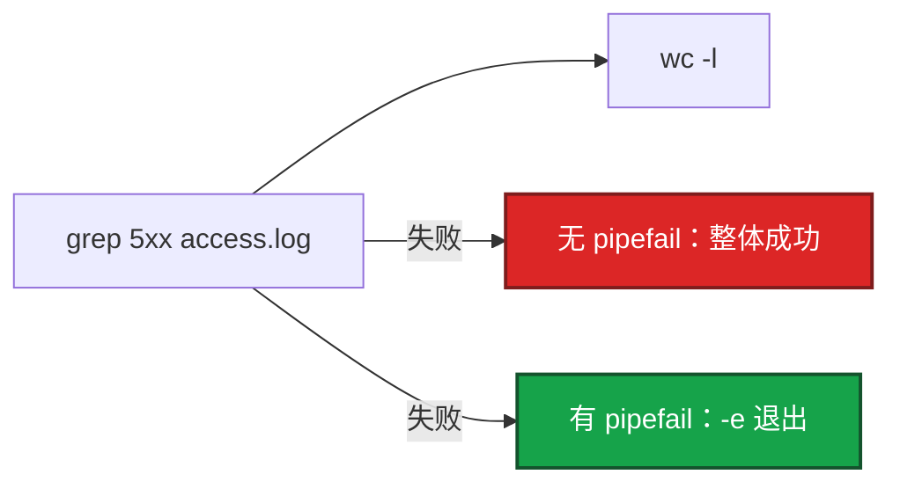
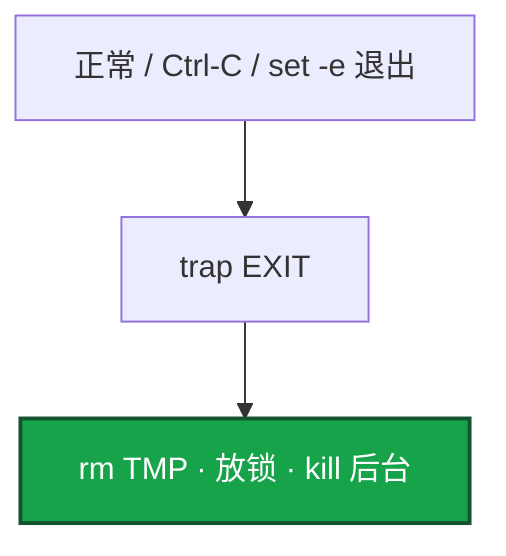

# 01｜Shell · 练习题

先自己画图或口述，再对照解答。每题标了覆盖范围：

| 标记 | 含义 |
|------|------|
| **核心** | 不懂整章就没建立起来 |
| **必会** | 值班和面试都要能讲 |
| **常用** | 线上会反复碰到 |
| **常考** | 白板和追问的高频口径 |

## 本题目录

- [Q1 三开关](#q1)
- [Q2 引号与 -u](#q2)
- [Q3 trap](#q3)
- [Q4 后台 wait / 战斗服](#q4)
- [Q5 何时换 Python](#q5)
- [Q6 bash -x / shellcheck](#q6)
- [Q7 探活等待](#q7)
- [Q8 one-liner 列号](#q8)
- [Q9 SSH / xargs](#q9)
- [Q10 `|| true`](#q10)
- [合上书](#合上书)

---

## Q1

**★★★★★｜`set -euo pipefail` 各干什么？缺哪个会出事？**

**覆盖**：核心 · 必会 · 常考

### 场景

开服检查脚本拷完 Redis 配置后 `nginx -t` 失败，脚本仍继续 `systemctl reload`，大厅 502。有人说「我开了 `-e` 为什么没停」。

### 完整解答

三个开关是一套。没有 `pipefail` 的 `-e` 是半套。



1. **`-e`**：命令失败立刻退。没有它，拷配置失败仍 reload。
2. **`-u`**：未定义变量报错。没有它，`rm -rf $EMPTY/` 在未加引号时可能变成 `rm -rf /`。
3. **`-o pipefail`**：管道任一失败整体失败。默认只看最后一条：`false | true` 成功。

`-e` 在 `if cmd`、`cmd || fallback` 里不会停——那是你显式处理失败，不是开关坏了。「开了 `-e` 管道没停」先查有没有 `pipefail`。

谁失败看 `${PIPESTATUS[@]}`，管道一结束立刻读。某条允许失败：用 `if cmd; then`；`cmd || true` 会吞失败，要写清为什么允许。

```bash
#!/usr/bin/env bash
set -euo pipefail
grep 5xx access.log | wc -l          # 有 pipefail：grep 失败则退
echo "${PIPESTATUS[@]}"              # 立刻读
```

### 再追问

- `set +e` 整文件关掉算稳健吗？——不算。只在你清楚的一小段允许失败，段末立刻 `set -e`。
- `if nginx -t; then reload; fi` 里 `nginx -t` 失败会不会被 `-e` 杀掉？——不会。条件里的失败是分支。

---

## Q2

**★★★★★｜变量为什么必须加引号？`set -u` 能不能替代引号？**

**覆盖**：核心 · 必会 · 常考

### 场景

脚本 `scp $CFG /etc/nginx/`，配置路径里有空格（活动名目录）。scp 参数裂开，把错误文件推到了邻服目录。

### 完整解答

未加引号会 **分词 + glob**。空格文件名、空 `$1`、数组展开没引号都会炸。

```bash
cat "$filename"          # 一个参数，空格安全
cat $filename            # 裂成多个参数，还可能 glob

scp "$CFG" host:/etc/nginx/
"${SERVERS[@]}"          # 每台主机独立参数
${SERVERS[@]}            # 再分词，主机名带空格就错
```

1. 用 `[[ ]]` 判字符串，不要默认 `[ ]`。
2. `"$@"` 保留参数边界；`"$*"` 糊成一串。
3. 函数 `local`，别污染全局。
4. 数字用 `-lt` / `-gt`，不要 `>`（那是重定向）。

`set -u` **不能替代引号**：未定义被 `-u` 抓住；已定义但为空（`CFG=""`）`-u` 放过，未加引号仍会裂开或打到空路径。两边都要。

### 再追问

`: "${ENV:?ENV required}"` 解决什么？——必填环境变量：空或未定义立刻退，并打出原因。比事后在错误目录上操作要早。

---

## Q3

**★★★★★｜trap 解决什么？Ctrl-C 之后临时文件谁清？**

**覆盖**：核心 · 必会 · 常考

### 场景

开服脚本 `mktemp` 写了半份 server_id 占用表，同事 Ctrl-C 打断。锁文件还在，下一班以为 ID 被占，开服卡死。

### 完整解答

`trap cleanup EXIT`：正常结束、`-e` 退出、Ctrl-C（SIGINT 默认会走到 EXIT）都能清临时文件、放锁、杀本脚本起的后台。



```bash
TMP="$(mktemp)"
cleanup() { rm -f "$TMP" "$LOCK"; }
trap cleanup EXIT
```

没有 trap：中断留垃圾、占锁、ssh 会话残留。不要在 trap 里做复杂不可失败的发布（又 scp 又 reload）——清理失败会掩盖真正的退出码。ERR trap 可用来打堆栈，生产脚本更常见的是 EXIT 清理。

### 再追问

trap 里再 `exit 1` 会怎样？——可能冲掉原来的失败原因。清理函数尽量幂等、允许失败用 `rm -f`，不要在 trap 里再走一套部署。

---

## Q4

**★★★★★｜后台 `&` + `wait` 的坑？滚动重启战斗服能不能全员并行？**

**覆盖**：核心 · 必会 · 常考

### 场景

有人写 `for s in battle-1 battle-2 battle-3; do restart $s &; done; wait`，三个战斗服一起重启，在线玩家集体掉线。脚本退出码还是 0。

### 完整解答

只写 `wait` 不查每个 pid 退出码，有人失败也会当成功。`set -e` 不要假设会替你收后台码。

```bash
fail=0
pids=()
for s in login gate; do          # 无状态可以有限并行
  deploy "$s" "$VER" &
  pids+=("$!")
done
for pid in "${pids[@]}"; do
  wait "$pid" || fail=1
done
[[ "$fail" -eq 0 ]] || exit 1
```

战斗服 / 有状态逻辑服：**一台成功再下一台**，失败立刻停。大厅、网关可以小并发，仍要汇总失败。游戏现场「看起来都 restart 了」不等于都健康，必须探活。

### 再追问

`wait` 不加 pid 呢？——等所有后台，但默认退出码是最后一个结束的任务，中间失败仍可能被当成成功。按 pid 收码。

---

## Q5

**★★★★☆｜什么时候改用 Python？现场 awk 能不能当变更记录？**

**覆盖**：必会 · 常用 · 常考

### 场景

群里贴了一条 12 段管道「把登录 5xx 按区服聚合好了」。第二天活动再发，没人能重放，字段还对不上新的 `log_format`。

### 完整解答

Shell 编排命令；复杂 JSON、HTTP、重试、分支超过一屏 → Python。长期驻留采集 → Go（见 03）。


生产禁止把不可复现的 one-liner 当变更记录。现场 awk **可以看日志**；得出结论后入库。列号风险：先 `head -1` 对 `log_format`，RT 不一定在 `$NF`。

### 再追问

开服 50 服要调平台 HTTP API，仍用 bash curl 循环吗？——不要。超时、重试、失败汇总、dry-run 用 Python（02、04）。bash 只适合「已经有 kubectl/ssh 命令、10 行能看懂」。

---

## Q6

**★★★★☆｜`bash -x` 和 shellcheck 注意什么？**

**覆盖**：必会 · 常用

### 场景

有人把 `set -x` 留在生产发布脚本里，token 打进 CI 日志。安全同学要立刻 rotate。

### 完整解答

`bash -x` / `set -x` 会把展开后的每一条命令和变量打进 stderr。密码、Bearer、数据库 URL 会泄漏。用完关掉。不要生产开着 xtrace 跑发布。

```bash
shellcheck hall-restart.sh
# 调试完立刻：set +x
log() { echo "[$(date '+%F %T')] $*" >&2; }   # 明文密钥永远不要 echo
```

1. 提交前 `shellcheck`，CI 里跑，不是靠人眼扫引号。
2. `${PIPESTATUS[@]}` 在 `set -x` 下仍可用，必须立刻读。
3. 日志用 `log()` 打到 stderr。

### 再追问

CI 里要调试某次失败，能不能临时 `-x`？——可以，但先确认 job 日志谁能看、有没有打码。调试完去掉。长期开着等于把密钥写入制品日志。

---

## Q7

**★★★★☆｜等待服务启动怎么写才安全？**

**覆盖**：必会 · 常用

### 场景

发布脚本 `while true; do curl health && break; done`，游戏服卡在迁移，流水线挂了 40 分钟，后面排队的合服窗口被吃掉。

### 完整解答

有上限的循环 + curl 超时 + 失败非 0。禁止无上限 `while true`。

```bash
for i in $(seq 1 30); do
  curl -sf --max-time 2 "http://127.0.0.1:8080/health" && exit 0
  sleep 2
done
log "health timeout"
exit 1
```

健康检查过宽（只探端口）是应用问题，脚本只能探给定 URL。上层 CI 只看退出码：成功 0，失败非 0。

### 再追问

探活过了就能对玩家开放目录吗？——开服不能。探活只说明进程在听。对玩家可见要走验收门禁（登录冒烟、支付沙箱），见 08 开服章。脚本这层先保证「失败能停」。

---

## Q8

**★★★★☆｜举三条现场 one-liner，并说明列号风险。**

**覆盖**：必会 · 常用

### 场景

活动开始 5 分钟，登录 502。有人用 `$9` 当状态码统计，你们自定义 `log_format` 把 RT 插在前面，统计全错，误判「没有 5xx」。

### 完整解答

先 `head -1` 对格式，再选列。典型 combined：`$1` IP，`$9` 状态。不对就不要抄网上的列号。

```bash
awk '{print $1}' access.log | sort | uniq -c | sort -rn | head    # Top IP
awk '{print $9}' access.log | sort | uniq -c | sort -rn           # 状态码
awk '$9 >= 500 {print}' access.log | tail                         # 最近 5xx
```

```mermaid
flowchart TB
    A[head -1 对 log_format] --> B{列对了?}
    B -->|对| C[awk 过滤 → sort | uniq -c]
    B -->|错| D[数字再漂亮也是错的]

    classDef ok fill:#16A34A,stroke:#14532D,stroke-width:2px,color:#fff
    classDef bad fill:#DC2626,stroke:#7F1D1D,stroke-width:2px,color:#fff
    class C ok
    class D bad
```

RT 不一定在 `$NF`。复杂统计（时间窗口 + URL）进 Python。这些 **不能当发布手段**，只排障。

### 再追问

10GB 日志 sort 把跳板机打满怎么办？——先 `grep` / `awk` 过滤出 5xx 再 sort。不要 `cat | grep`。压缩日志用 `zcat` / `zgrep`。经常查的进 Loki/ES，见 05。

---

## Q9

**★★★★☆｜SSH 循环 100 台，怎么写才不会把失败吞掉？xargs -P 呢？**

**覆盖**：必会 · 常用 · 常考

### 场景

`for h in $(cat hosts); do ssh $h 'nginx -t'; done` 全部「跑完了」，第 17 台认证失败，脚本退出码 0，配置没推上去。另一次 `xargs -P 50` 把堡垒机打满。

### 完整解答

1. 主机列表用数组或 `while read`，不要 `$(cat)` 再分词。
2. 每台失败记入列表，最后非 0。
3. 并发用 `xargs -P 10` 或后台 + 按 pid wait，上限别打爆堡垒机。
4. `StrictHostKeyChecking` 策略明确。
5. **`xargs -P` 子进程失败，xargs 自己仍可能 0**——函数里写失败文件，最后检查。

```bash
failed=()
while IFS= read -r host; do
  [[ -z "$host" || "$host" == \#* ]] && continue
  if ! ssh -n -o ConnectTimeout=5 "$host" 'nginx -t'; then
    failed+=("$host")
  fi
done < hosts.txt
[[ ${#failed[@]} -eq 0 ]] || exit 1

# 有界并发：失败仍要自己汇总
export -f deploy_host
xargs -P 10 -I {} bash -c 'deploy_host {}' < hosts.txt
```

`ssh` 会吃 stdin，循环里必须 `ssh -n`。批量部署还要 dry-run、备份、`nginx -t` 再 reload，整题在 04。

### 再追问

第 50 台失败，前 49 台已经 reload 了怎么办？——这就是为什么要备份和可回滚。`set -e` 在串行下会停，已变更的机器用 `.bak` 回滚。并行时必须汇总失败列表，不能假装原子。

---

## Q10

**★★★☆☆｜`cmd || true` 和「允许失败」怎么用才不算埋雷？**

**覆盖**：常用 · 常考

### 场景

脚本里 `umount /data || true` 后面继续 mkfs。某次 umount 失败（文件被占用），`|| true` 吞掉，mkfs 打到了还挂着的盘。

### 完整解答

`|| true` 把失败变成成功，后面逻辑当「已经做好」。只用在 **失败不影响目标** 的步骤：例如「备份文件可能还不存在」「grep 没有匹配」（还要确认你不是靠 grep 当门禁）。

```bash
# 允许
rm -f "$LOCK"
cp -a "$DST" "$DST.bak.$(date +%s)" 2>/dev/null || true   # 首次无旧文件

# 禁止
umount /data || true && mkfs.xfs /dev/sdb
nginx -t || true && systemctl reload nginx
curl -sf health || true && echo "$SID" >> open.list
```

更干净的写法是 `if ! umount; then log; exit 1; fi`。游戏开服任何「可以失败」的步骤，都要问：失败后下一步会不会对玩家可见。

### 再追问

管道里 `grep || true` 呢？——grep 无匹配退出码是 1。若只是过滤、后面 awk 允许空输入，可以。若「没有 5xx 才发布」，grep 无匹配应成功，有匹配应失败——这时不要 `|| true`，要按门禁写 `if grep -q 5xx; then exit 1; fi`。

---

## 合上书

- [ ] 能说出 `-e` / `-u` / `pipefail` 各挡什么，以及 `-e` 在 `if` / `||` 里不停
- [ ] 能区分 `-u` 和引号；空字符串要自己判
- [ ] 能写 `trap EXIT` 清临时文件，且 trap 里不再 `exit`
- [ ] 能按 pid `wait` 收码；战斗服串行滚动
- [ ] 能写有上限的探活循环；SSH / `xargs -P` 汇总失败
- [ ] 能把 one-liner 和 Git 变更分开；`|| true` 只用在不影响目标的步骤
