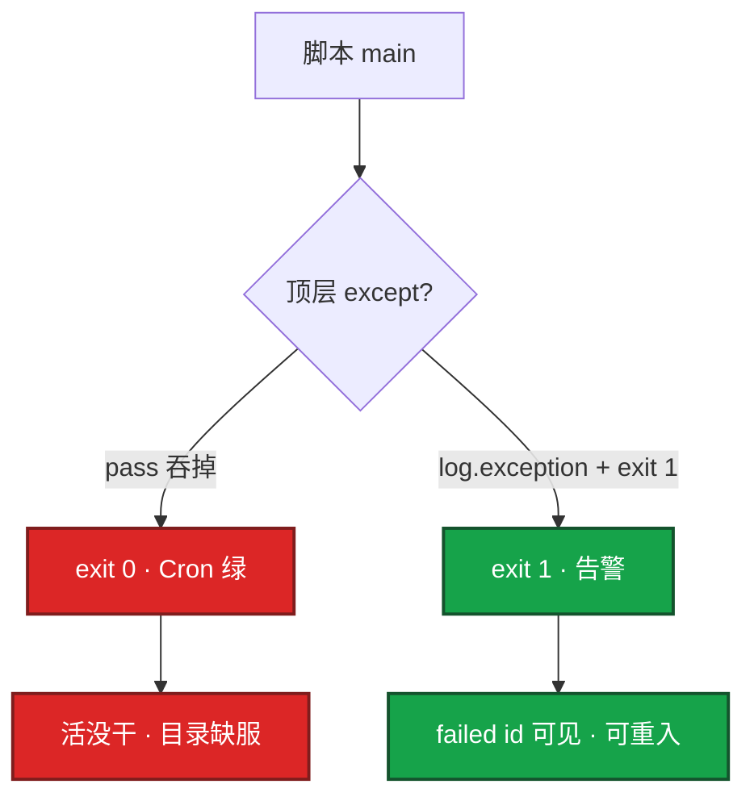
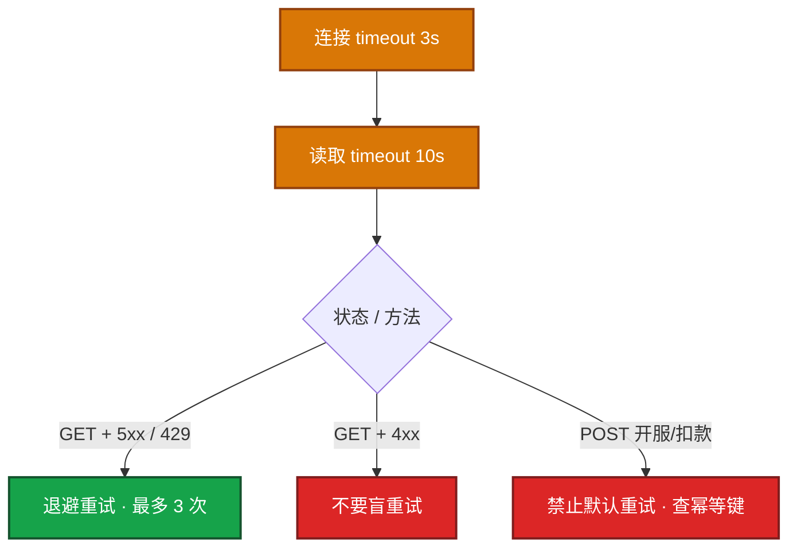
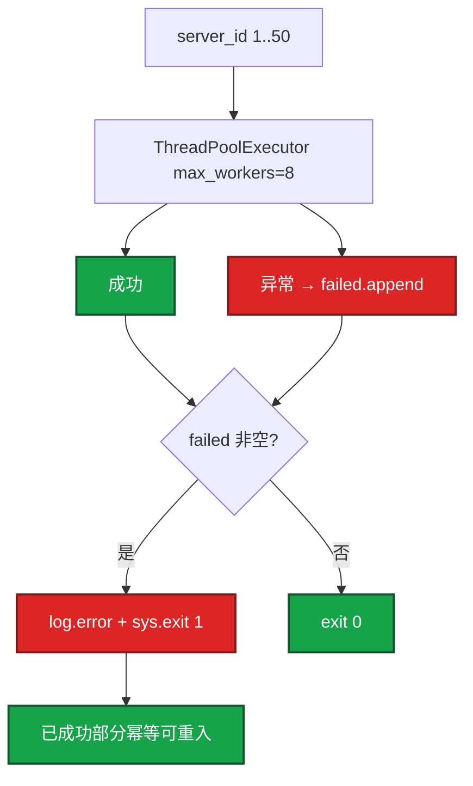
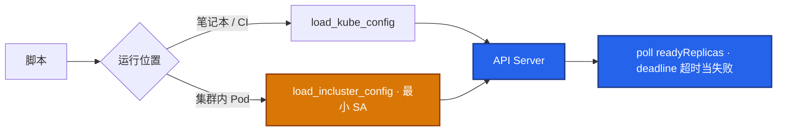
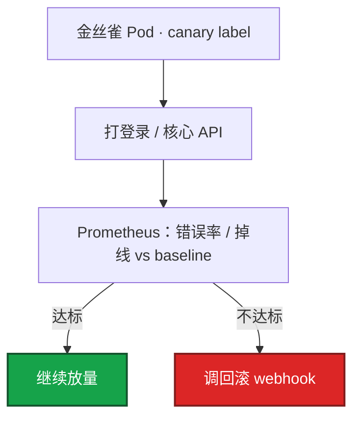

# 02｜Python 运维 · SRE 开发能力

> 把 Python 当**胶水层**：调平台 API、JSON 编排、有界并发巡检；Cron/CI 只看退出码，能跑通不等于能进生产。

## 面试怎么考

| 标记 | 考点 |
|------|------|
| **核心** | 生产脚本最低标准；`except pass` 为什么让 Cron 绿但没干活 |
| **必会** | `timeout=(3, 10)`；Retry 只对 GET/HEAD；POST 开服不盲重试 |
| **常用** | `ThreadPoolExecutor` 5–20 workers；`as_completed` + `result()` |
| **常考** | incluster vs kubeconfig；canary label Prom；token 不进日志 |
| **加分** | 发布门禁相对 baseline；云 API paginator；YAML 未知字段失败 |

**30 秒怎么说**：Python 是胶水，管 API 编排和 JSON，不是 Shell 的加长版。生产脚本必须 argparse、logging、`--dry-run`、失败 `sys.exit(1)`，禁止 `except Exception: pass`。HTTP 必设 `timeout=(连接, 读取)`，Retry 默认只给幂等 GET，POST 开服重试会双写。IO 用线程池 workers 5–20，`as_completed` 必须 `result()` 汇总失败。K8s 用官方 client，Pod 内 incluster + 最小 SA，写操作走 GitOps。门禁按 canary label 查 Prom，不看集群均值。

---

## 能力边界

| 维度 | Shell 适合 | Python 适合 | Go 适合 |
|------|------------|-------------|---------|
| **任务** | 10 行管道、kubectl 一行能定 | 多 API 编排、JSON、重试、argparse | 常驻 Exporter / Agent |
| **生命周期** | 跳板机 one-liner、CI 短脚本 | Cron/CI 巡检、开服、对账、门禁 | 7×24 采集、高并发连接 |
| **并发** | `xargs -P 10` 有限并行 | `ThreadPoolExecutor` 5–20 + 限流 | goroutine + pprof |
| **失败可见** | `set -euo pipefail` + trap | `sys.exit(1)` + logging | 同上 + 指标 |
| **配置** | env + here-doc | YAML `safe_load` + schema | flag / viper |
| **面试口径** | 编排层 | 胶水层 | 常驻层 |

三个角色不要混：

| 角色 | 干什么 | 不能干什么 |
|------|--------|------------|
| **CI / Cron** | 只看退出码：成功 0、失败非 0 | 不看日志里有没有 failed id |
| **脚本** | argparse、logging、dry-run、timeout、失败汇总 | 吞异常、`os.system`、200 workers 硬冲 |
| **平台 API** | 开服 / 云 / K8s | token 不进日志；写操作不经脚本直 patch 生产 |

> **记住**：10 行管道 → Shell；调 API + JSON + 重试 → Python；常驻采集 → Go。Ansible 管 OS 期望状态；Python 管 API 编排。可以 Ansible 调脚本，不要两套都改同一份配置还不进 Git。

**本章不讲：** Shell 三开关、trap → [01 Shell](../01-Shell/)；Exporter / goroutine / pprof → [03 Go 运维工具](../03-Go运维工具/)；批量部署整题 → [04 运维开发实战题](../04-运维开发实战题/)；正则抠字段 → [05](../05-正则与文本处理/)；GitOps 流水线 → [05-工程化](../../05-工程化与自动化/)、[04-K8s 22](../../04-Kubernetes/22-GitOps-ArgoCD与Tekton/)；开服业务门禁 → [08-游戏 02](../../08-游戏运维专题/02-开服合服/)。

---

## 语言最小集（读写得动就够）

> **要不要学？** 要。运维 Python 不是算法题，但**白板写批量脚本、读平台胶水代码**需要下面这些。不收装饰器、元类、async 大全——面试和值班用不到。

| 构造 | 写法 | SRE 场景 |
|------|------|----------|
| 类型 | `str` `int` `list` `dict` `set` `bool` | API 返回 JSON |
| f-string | `f"{host}:{port}"` | 拼 URL、日志 |
| 容器 | `d["key"]` `d.get("k", default)` | 解析 API 字段 |
| 遍历 | `for k, v in d.items():` | 批量处理 |
| 列表推导 | `[x for x in ids if x > 0]` | 过滤 server_id |
| 条件 | `if/elif/else`；`x in ("a","b")` | 环境分支 |
| 函数 | `def f(host: str) -> bool:` | 可测、可复用 |
| 文件 | `with open(path) as f: ...` | 读 hosts 列表 |
| JSON | `json.loads(s)` / `json.dumps(obj)` | 平台 API |
| 路径 | `from pathlib import Path`；`Path(p).exists()` | 配置、日志路径 |
| 环境变量 | `os.environ["TOKEN"]`；`os.getenv("X", "default")` | 密钥不进代码 |
| 异常 | `try: ... except Exception as e: ...` | 必须 log + exit 1 |
| 入口 | `if __name__ == "__main__": main()` | Cron/CI 调用 |
| 依赖 | `python3 -m venv .venv`；`pip install -r requirements.txt` | 可复现环境 |

**最小可读脚本骨架**（后面章节在此基础上加 requests/并发）：

```python
#!/usr/bin/env python3
import json
import logging
import os
import sys
from pathlib import Path

log = logging.getLogger(__name__)

def load_hosts(path: str) -> list[str]:
    return [line.strip() for line in Path(path).read_text().splitlines() if line.strip()]

def check_host(host: str) -> dict:
    # 实际场景换成 requests.get(..., timeout=(3, 10))
    return {"host": host, "ok": True}

def main() -> int:
    logging.basicConfig(level=logging.INFO, format="%(asctime)s %(levelname)s %(message)s")
    hosts = load_hosts("hosts.txt")
    failed = []
    for h in hosts:
        try:
            r = check_host(h)
            if not r["ok"]:
                failed.append(h)
        except Exception:
            log.exception("check failed host=%s", h)
            failed.append(h)
    if failed:
        log.error("failed hosts: %s", failed)
        return 1
    return 0

if __name__ == "__main__":
    sys.exit(main())
```

| 易错 | 正确 |
|------|------|
| `except: pass` | `log.exception` + `return 1` |
| `open()` 不 `with` | `with open(...) as f` |
| `requests` 无 timeout | 永远 `timeout=(3, 10)` |
| `pip install xxx` 不写 requirements | 进 Git，CI 可复现 |
| 密钥写进源码 | `os.environ` / K8s Secret |

> **记住**：会写上面骨架 + 下一节 argparse/logging/requests/线程池 = Python 运维面试够用。

---

## 语法必会

按 SRE 场景组织：每点 **用法 + 示例 + 易错**。

### 1. argparse 与 dry-run

**用法**：所有生产脚本用 `argparse`；写操作必须有 `--dry-run`，只打印将调用的 API，不 apply。

```python
def parse_args():
    p = argparse.ArgumentParser(description="open game server")
    p.add_argument("--server-id", required=True, type=int)
    p.add_argument("--env", choices=["staging", "production"], default="staging")
    p.add_argument("--dry-run", action="store_true", help="print only, no API call")
    return p.parse_args()

def deploy(args):
    url = f"{API}/servers/{args.server_id}/open"
    if args.dry_run:
        log.info("DRY-RUN POST %s env=%s token=***", url, args.env)
        return
    resp = session().post(url, json={"env": args.env}, timeout=(3, 10))
    resp.raise_for_status()
```

**易错**：dry-run 开关反了——看起来跑了实际没 apply，或以为安全实际连错集群。生产第一次必须先 dry-run 贴到变更单。

### 2. logging 与退出码

**用法**：`logging.basicConfig` 走 stdout；顶层 `try/except` 必须 `log.exception` + `sys.exit(1)`。

```python
def main():
    logging.basicConfig(
        level=logging.INFO,
        format="%(asctime)s [%(levelname)s] %(message)s",
    )
    args = parse_args()
    try:
        deploy(args)
    except Exception:
        log.exception("failed server_id=%s", args.server_id)
        sys.exit(1)

if __name__ == "__main__":
    main()
```

**易错**：`except Exception: pass` 是事故源——Cron 显示成功，活没干。`print` 代替 logging 在 CI 里难采集。`log.info("auth %s", headers)` 会把 Bearer 打进 ELK。

| 写法 | Cron 看到 | 实际 |
|------|-----------|------|
| `except Exception: pass` | 成功 | 活没干 |
| `log.exception; sys.exit(1)` | 失败 | 失败可见 |
| future 不 `result()` | 可能成功 | 异常留在 future 里 |

### 3. requests + timeout

**用法**：每个 HTTP 调用必设 `timeout=(连接, 读取)`，常见 `(3, 10)`。

```python
resp = session().get(
    url,
    timeout=(3, 10),  # 连接 3s，读取 10s
    headers={"Authorization": f"Bearer {os.environ['TOKEN']}"},
)
resp.raise_for_status()
```

**易错**：无 timeout 的 `requests.get` 会把线程池 worker 永久占住——巡检从 2 分钟变成永远跑不完，进程还在、CPU 很低。连接超时 vs 读取超时：`ConnectTimeout` 是对端没起来；`ReadTimeout` 是对端卡住。

### 4. Retry（只对幂等 GET）

**用法**：`Session` + `HTTPAdapter` + `Retry`；`allowed_methods` 只含 GET/HEAD。

```python
from requests.adapters import HTTPAdapter
from urllib3.util.retry import Retry

def session():
    s = requests.Session()
    r = Retry(
        total=3,
        backoff_factor=0.5,
        status_forcelist=(500, 502, 503, 504),
        allowed_methods=frozenset(["GET", "HEAD"]),  # POST 不在里面
    )
    s.mount("https://", HTTPAdapter(max_retries=r))
    return s
```

**易错**：Retry 默认 POST 也重试——开服 POST 重试出两个相同 server_id。429/503 要退避；下游失败率已经 30% 就熔断本轮，不要自己变 DDoS。4xx 除约定外不要盲重试。

| 条件 | 重试？ | 原因 |
|------|:------:|------|
| GET + 连接失败 / 读超时 | 是 | 幂等 |
| GET + 502/503/504 | 是 | status_forcelist |
| GET + 400/401/404 | 否 | 重试不会变对 |
| POST 开服 / 扣款 | **否** | 双写、双建库 |

### 5. ThreadPoolExecutor 与 as_completed

**用法**：IO 密集用线程池，workers 5–20；`as_completed` + `f.result()` 汇总失败。

```python
from concurrent.futures import ThreadPoolExecutor, as_completed

def batch_open(ids, workers=8):
    failed = []
    with ThreadPoolExecutor(max_workers=workers) as ex:
        futs = {ex.submit(open_one, i): i for i in ids}
        for f in as_completed(futs):
            sid = futs[f]
            try:
                f.result()
            except Exception:
                log.exception("server_id=%s", sid)
                failed.append(sid)
    if failed:
        log.error("failed=%s", failed)
        sys.exit(1)
```

**易错**：`max_workers=200` 打爆网关，一半 429 仍 `exit 0`。不 `f.result()` 异常留在 future 里。CPU 密集才用 `ProcessPoolExecutor`。已成功部分必须幂等可重入。

### 6. subprocess（不要 os.system）

**用法**：`subprocess.run(..., check=True, timeout=60)` 收 stderr，失败抛异常。

```python
import subprocess

result = subprocess.run(
    ["nginx", "-t"],
    check=True,
    timeout=60,
    capture_output=True,
    text=True,
)
log.info("nginx -t ok: %s", result.stdout.strip())
```

**易错**：`os.system(...)` 不抛异常，失败还能继续建库。`shell=True` 有注入风险。子进程 hang 没 timeout 和 HTTP 一样会拖死主进程。

### 7. YAML safe_load 与未知字段

**用法**：`yaml.safe_load` 后校验允许的 key 集合，未知字段立刻失败。

```python
import yaml

ALLOWED = {"env", "region", "replicas", "timeout_sec"}

def load_config(path):
    with open(path) as f:
        data = yaml.safe_load(f)
    unknown = set(data) - ALLOWED
    if unknown:
        raise SystemExit(f"unknown keys: {unknown}")
    return data
```

**易错**：静默忽略未知字段——`env: proudction` 拼错仍用默认 staging，连错集群还以为成功。环境变量和 YAML 谁覆盖谁写进 `--help`，冲突时打日志。

### 8. 虚拟环境（venv）

**用法**：依赖 pin + venv，CI 用同一 lock：`python3 -m venv .venv && . .venv/bin/activate && pip install -r requirements.txt`

**易错**：预发能跑、生产 ImportError——CI 没装同一 lock。「我机器上能跑」不是生产标准。

### 9. 和 Shell 分工

**用法**：管道、kubectl 一行能定 → Shell；要 JSON、重试、多 API 编排 → Python；长期驻留 exporter → Go。

**易错**：Shell 里嵌 Python one-liner 维护地狱；Python 里 `os.system("kubectl ...")` 丢退出码。Resume 没写 Go 到边界停即可。

---

## 原理讲透

### 3.1 退出码与异常

**一句话**：Cron / CI 只看进程退出码，吞异常等于把失败伪装成成功。



dry-run 默认能打开：打印完整请求方法和 URL（token 打码）、目标 host、将写入的字段。密钥走环境变量，禁止写进代码和日志。

### 3.2 HTTP 超时与重试

**一句话**：没 timeout 的 HTTP 会把线程池 worker 挂死；重试是幂等 GET 的特权，POST 开服默认禁止。



数字：`timeout=(3, 10)`；Retry `total=3`、`backoff_factor=0.5`；失败率 >30% 熔断本轮。

### 3.3 并发失败可见

**一句话**：线程池是调度器不是事务管理器——你必须 `result()` 收异常，failed 非空必须非 0 退出。



这就是开头 Cron 绿、缺 3 服的原因：只打日志不 `exit 1`，或 future 不 `result()`。

### 3.4 K8s client

**一句话**：笔记本 `load_kube_config()`，Pod 内 `load_incluster_config()` 用 ServiceAccount；脚本只读巡检，写操作走 GitOps。



| 场景 | 加载方式 | RBAC |
|------|----------|------|
| 本地排障 | `load_kube_config()` | 个人 kubeconfig |
| CronJob / Pod | `load_incluster_config()` | get/list 最小 SA |
| 写 scale/patch | **不要脚本直写** | 走 Git → Argo |

cluster-admin 给脚本是事故。人手排障用 kubectl；循环等待、分支、失败汇总用库。

### 3.5 发布门禁

**一句话**：门禁对 canary label 查 Prom 相对发布前 5min baseline，不用集群均值淹没金丝雀。



健康检查不能只 `/health`——`/health` 通但登录 502 仍应拦。阈值参数化，活动日放宽写配置不要改代码。

---

## 生产模板

### 模板 A：open_server.py（完整骨架）

```python
#!/usr/bin/env python3
import argparse
import logging
import os
import sys

import requests
from requests.adapters import HTTPAdapter
from urllib3.util.retry import Retry

log = logging.getLogger("ops")
API = os.environ.get("OPEN_API", "https://api.example.com")


def session():
    s = requests.Session()
    r = Retry(
        total=3,
        backoff_factor=0.5,
        status_forcelist=(500, 502, 503, 504),
        allowed_methods=frozenset(["GET", "HEAD"]),
    )
    s.mount("https://", HTTPAdapter(max_retries=r))
    return s


def parse_args():
    p = argparse.ArgumentParser()
    p.add_argument("--server-id", required=True, type=int)
    p.add_argument("--env", choices=["staging", "production"], default="staging")
    p.add_argument("--dry-run", action="store_true")
    return p.parse_args()


def deploy(args):
    url = f"{API}/servers/{args.server_id}/open"
    if args.dry_run:
        log.info("DRY-RUN POST %s env=%s token=***", url, args.env)
        return
    token = os.environ["TOKEN"]
    resp = session().post(
        url,
        json={"env": args.env},
        timeout=(3, 10),
        headers={"Authorization": f"Bearer {token}"},
    )
    resp.raise_for_status()
    log.info("opened server_id=%s", args.server_id)


def main():
    logging.basicConfig(
        level=logging.INFO,
        format="%(asctime)s [%(levelname)s] %(message)s",
    )
    args = parse_args()
    try:
        deploy(args)
    except Exception:
        log.exception("failed server_id=%s", args.server_id)
        sys.exit(1)


if __name__ == "__main__":
    main()
```

**典型输出：**

```text
2026-08-28 10:00:01 [INFO] DRY-RUN POST https://api.example.com/servers/101/open env=staging token=***
2026-08-28 10:05:45 [ERROR] failed count=2 ids=[103, 117]   # exit 1
2026-08-28 11:00:00 [INFO] rollout ok ready=10
```

虚拟环境一行：`python3 -m venv .venv && . .venv/bin/activate && pip install -r requirements.txt`。生产第一次 `--dry-run` 贴变更单；Cron 看退出码和日志。

### 模板 B：批量开服 + 失败汇总

```python
from concurrent.futures import ThreadPoolExecutor, as_completed

def batch_open(ids, workers=8):
    failed = []
    with ThreadPoolExecutor(max_workers=workers) as ex:
        futs = {ex.submit(open_one, i): i for i in ids}
        for f in as_completed(futs):
            sid = futs[f]
            try:
                f.result()
            except Exception:
                log.exception("server_id=%s", sid)
                failed.append(sid)
    if failed:
        log.error("failed count=%d ids=%s", len(failed), failed)
        sys.exit(1)
    log.info("all %d servers opened", len(ids))
```

### 模板 C：K8s 等待滚动（poll + deadline）

```python
import time
from kubernetes import client, config

def wait_rollout(name, ns, want_replicas, deadline_sec=600):
    try:
        config.load_incluster_config()
    except config.ConfigException:
        config.load_kube_config()
    apps = client.AppsV1Api()
    deadline = time.time() + deadline_sec
    while time.time() < deadline:
        dep = apps.read_namespaced_deployment(name, ns)
        ready = dep.status.ready_replicas or 0
        if ready >= want_replicas:
            log.info("rollout ok ready=%d", ready)
            return
        time.sleep(5)
    raise TimeoutError(f"rollout timeout deploy={name} ns={ns}")
```

---

## 踩坑清单

| 现象 | 原因 | 修法 |
|------|------|------|
| Cron 绿、目录缺 3 服 | `except pass` / dry-run 反了 / 没 exit 1 | `log.exception` + `sys.exit(1)` |
| 巡检永远跑不完、CPU 低 | HTTP 无 timeout | `timeout=(3, 10)` |
| 50 服一半 429、exit 0 | `max_workers=200` | workers 5–20；failed 非空非 0 |
| 两个相同 server_id | POST 被 Retry 重试 | `allowed_methods=GET/HEAD` |
| future 完成但脚本绿 | 不 `result()` | `as_completed` + `result()` |
| nginx -t 失败仍建库 | `os.system` | `subprocess.run(..., check=True)` |
| env 拼错仍成功 | YAML 未知字段忽略 | schema 校验，多了就失败 |
| 金丝雀 20% 错误仍放行 | 看集群均值 | 按 canary label 取 Prom |
| Bearer 进 ELK | `log.info(headers)` | filter 打码 + rotate |
| 对账 List 全量超时 | 无 paginator | SDK paginator + 页间 sleep |
| 脚本 cluster-admin | SA 权限过大 | get/list 最小；写走 GitOps |
| 预发能跑生产 ImportError | 没 pin 依赖 | venv + requirements.txt lock |

---

## 必会 · 常考

| 说法 | 对错 | 口径 |
|------|:----:|------|
| Cron 显示成功就是都开了 | 错 | 只看退出码；可能吞异常 |
| `requests.get` 可以不设 timeout | 错 | worker 会挂死 |
| POST 开服和 GET 一样重试 3 次 | 错 | 双写 |
| `max_workers=200` 更快 | 错 | 打爆网关 |
| 不 `result()` 异常也会非 0 | 错 | 异常留在 future 里 |
| 巡检脚本用 cluster-admin | 错 | get/list；写走 GitOps |
| 门禁看集群平均错误率 | 错 | 按 canary label |
| 健康检查只打 `/health` | 错 | 打登录 / 核心 API |
| YAML 未知字段忽略更宽容 | 错 | 配错 env 当成功 |
| `os.system` 和 `subprocess.run` 一样 | 错 | 前者失败不抛 |
| token 打日志删一行就行 | 错 | 立刻 rotate |
| 线程池卡住先加 worker | 错 | 先补 timeout、再限流 |

**数字：** timeout 常见 **(3, 10)**；Retry total **3**、backoff **0.5**；workers **5–20**；subprocess timeout **60s**；K8s poll deadline **600s**；金丝雀对比发布前 **5min** baseline。

**易混：** 连接超时 vs 读取超时；幂等 GET 重试 vs POST 开服；线程池 vs 进程池；dry-run 没 apply vs 吞异常没干活；incluster SA vs kubeconfig；集群均值 vs canary label。

---

## 合上书，问自己

1. 生产脚本最低标准哪四件？Cron 绿但没干活先查什么？
2. HTTP `timeout=(连接,读取)` 缺了会怎样？哪些方法可以重试？
3. 50 服并发怎么写？200 workers 行不行？失败怎么变成非 0？
4. K8s client 笔记本和 Pod 内各 load 什么？脚本能不能 cluster-admin？
5. 发布门禁为什么不能看集群均值？阈值为什么要参数化？
6. 打出 token 之后做什么？未知 YAML 字段该失败还是忽略？

六题都能口述，这一章就过了。下一章把常驻 Go 剖开：goroutine 泄漏、高基数、pprof。
