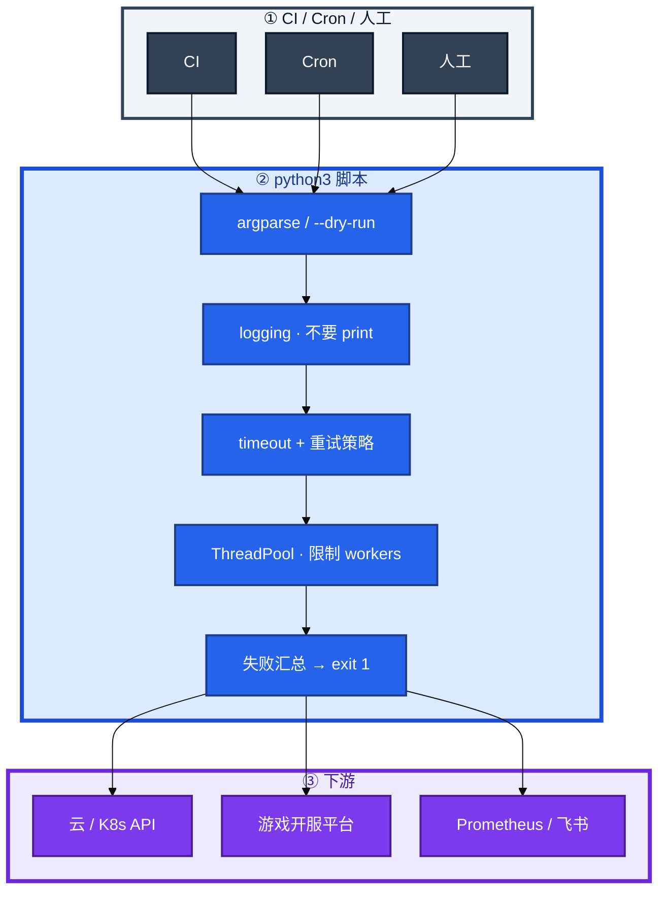
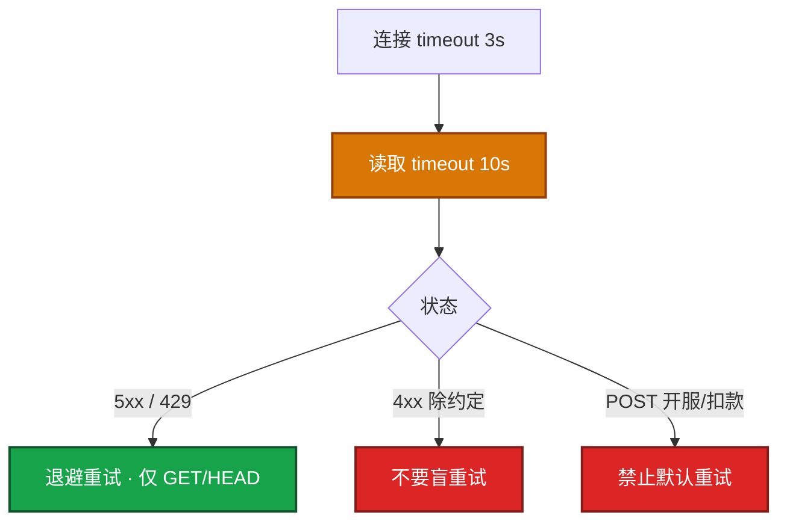
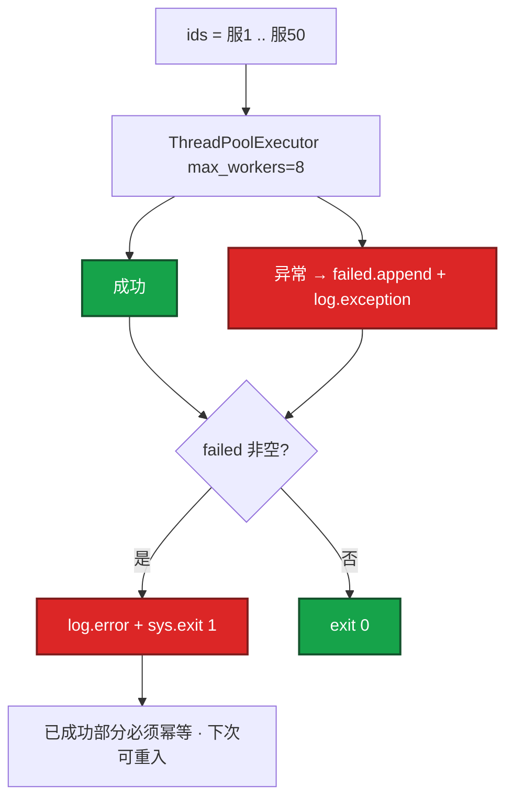
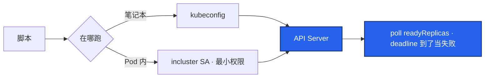
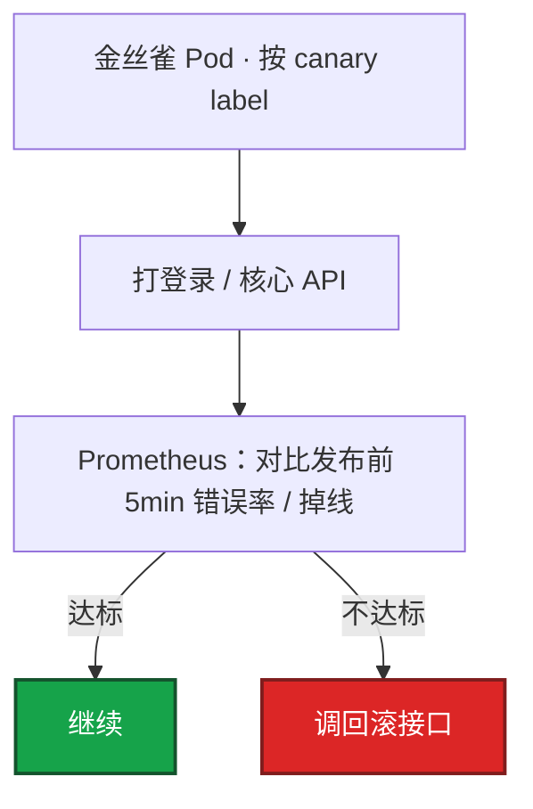
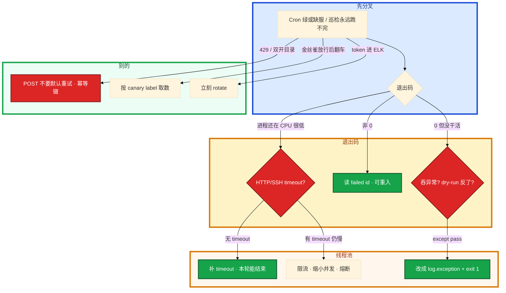

# Python 运维


运营点了「开 50 服」。Cron 跑 `open_server.py`。第二天目录里缺 3 个 server_id，Cron 却显示成功。线程池里 worker 被没 timeout 的 `requests.get` 永久占住。有人 `ThreadPoolExecutor(max_workers=200)` 把开服网关打出 429，脚本仍然 `exit 0`。

先别动手。这一章后半全是你会动手的：**怎么写 argparse / dry-run、HTTP 怎么设超时和重试、线程池怎么汇总失败、K8s 等待怎么带 deadline。** 前面的概念，是为了让你动手时不把「能跑通」当成能进生产。

**读完你能：** 白板上画出脚本在 CI/Cron 和平台 API 中间站哪；失败必须 `sys.exit(1)`；会写 timeout、幂等重试、有界并发；能把发布门禁接到金丝雀而不是集群均值。

## 本章目录

缩进 = 上下级。3 下面才是 3.1。

想钉在**正文左边**跟着滚：菜单 **查看 → 打开视图 → 大纲**。Markdown 预览做不到独立左栏，目录只能写在文章开头。

- [1. 基本概念](#1-基本概念)
- [2. 架构图](#2-架构图)
- [3. 原理](#3-原理)
  - [3.1 退出码与异常](#31-退出码与异常cron-只看退出码)
  - [3.2 HTTP 超时与重试](#32-http-超时与重试)
  - [3.3 并发与失败可见](#33-并发与失败可见)
- [4. 落地：怎么写、怎么跑](#4-落地怎么写怎么跑)
- [5. 关键写法与坑](#5-关键写法与坑)
- [6. 常用库](#6-常用库)
- [7. 常用操作](#7-常用操作)
  - [7.1 对接 K8s](#71-对接-k8s--平台-api)
  - [7.2 批量开服](#72-批量开服失败汇总)
  - [7.3 发布门禁](#73-发布门禁金丝雀--prom)
  - [7.4 日志与配置](#74-日志密钥与配置)
- [8. 生产排障](#8-生产排障)
- [9. 必会 · 常考](#9-必会--常考)
- [合上书](#合上书问自己)

**本章不讲：** Shell 编排、trap、one-liner → [01 Shell](../01-Shell/)；Exporter / goroutine / pprof → [03 Go 运维工具](../03-Go运维工具/)；批量部署 / 巡检 / SSH / 限流 / 飞书告警整题 → [04 运维开发实战题](../04-运维开发实战题/)；正则从日志抠字段 → [05](../05-正则与文本处理/)；GitOps 流水线 → [05-工程化](../../05-工程化与自动化/)、[04-K8s 22](../../04-Kubernetes/22-GitOps-ArgoCD与Tekton/)；开服业务门禁 → [08-游戏 02](../../08-游戏运维专题/02-开服合服/)。

---

## 1. 基本概念

Python 是 **胶水**：平台 API、JSON、并发巡检、发布门禁。Cron 和 CI **只看退出码**。能跑通不等于能进生产：还要 argparse、logging、`--dry-run`、失败 `sys.exit(1)`、HTTP 必设 timeout。

| 在 Python 里做 | 不在 Python 里做 |
|----------------|------------------|
| HTTP JSON、签名、重试、多 API 编排 | 10 行管道、调 kubectl 一行能定 → Shell |
| 开服 / 对账 / 发布门禁 | 常驻 Exporter / Agent → Go |
| IO 密集线程池、失败汇总 | OS 期望状态 → Ansible |

三个角色不要混：

| 角色 | 干什么 |
|------|--------|
| **CI / Cron** | 只看退出码：成功 0、失败非 0 |
| **脚本** | argparse、logging、dry-run、timeout、失败 id 进日志 |
| **平台 API** | 开服 / 云 / K8s；token 不进日志；写操作走 GitOps 或审批 |

> **记住**：`except Exception: pass` 是事故源。dry-run 默认能打开：打印将调用的 API / 目标主机，不 apply。密钥走环境变量或权限收紧的文件，禁止写进代码和日志。

---

## 2. 架构图

先把整张图钉住。后面超时、并发、排障都对着这张图说话。



图上三条线：

1. **成功 0、失败非 0**。吞异常 = Cron 绿、目录缺服。
2. **每个出站调用有上限**。无 timeout 的 HTTP 把 worker 挂死。
3. **失败 id 必须进日志和退出码**。已成功部分必须幂等可重入。

三种用法：


游戏开 50 服：并发带速率限制，失败列表进通知。对账用 **只读凭证**；写操作另开 job 加审批。和 Ansible：Ansible 管 OS 期望状态；Python 管 API 编排和数据。可以 Ansible 调脚本，不要两套都改同一份 nginx.conf 还不进 Git。

---

## 3. 原理

原理只保留动手和面试会用到的：退出码、超时、重试幂等、并发失败可见。

**本节 3 块：** 3.1 退出码 · 3.2 HTTP · 3.3 并发

### 3.1 退出码与异常：Cron 只看退出码

`except Exception: pass` 是事故源。顶层必须 `log.exception` + `sys.exit(1)`。

| 写法 | 结果 |
|------|------|
| `except Exception: pass` | Cron 成功，活没干 |
| `except Exception: log.exception; sys.exit(1)` | 失败可见 |
| `os.system(...)` | 不抛异常，失败还能继续建库 |
| `subprocess.run(..., check=True, timeout=60)` | 非 0 抛 `CalledProcessError`；超时抛 `TimeoutExpired` |
| future 不 `result()` | 异常留在 future 里，主进程可能 0 退出 |

dry-run 开关反了也会「成功但没干活」：看起来跑了，实际 apply 了或实际没 apply。生产第一次必须先 dry-run 贴到变更单里。

### 3.2 HTTP 超时与重试

没 timeout 的 `requests.get` 会把线程池里的 worker 永久占住，巡检变成自己的故障。重试默认只给幂等 GET；POST 开服/扣款重试会双写——50 服里出现两个相同 server_id，就是这么来的。



| 条件 | 重试？ | 原因 |
|------|:------:|------|
| GET/HEAD + 连接失败 / 读超时 | 是 | 幂等；退避 |
| GET + 502/503/504 | 是 | `status_forcelist` |
| GET + 429 | 是，退避 | 尊重限流 |
| GET + 400/401/404 | 否 | 重试不会变对 |
| POST 开服 / 扣款 / 写 CMDB | **否**（默认） | 双写、双建库 |
| 下游失败率已经 30% | **停** | 熔断本轮，避免自己变 DDoS |

`timeout=(连接, 读取)` 必设。Session + Retry 对 5xx。token 不打日志。云用官方 SDK（boto3 等）同样设 timeout 和分页：用 paginator，不要一次 List 全量账号资源。对账 CMDB 时限流，失败重试只针对 5xx。

打内部网关要带超时和熔断（失败率高就停）。对账脚本用只读凭证；写操作另开 job 加审批。

> **记住**：HTTP 必设 `timeout=(连接,读取)`；幂等才重试；POST 开服禁止默认重试；token 不进日志。

### 3.3 并发与失败可见

IO 用线程池，workers 大约 5–20。SSH/API 不要 200 并发打爆网关。CPU 密集才进程池。失败必须汇总，不能只打日志然后 `exit 0`——这就是开头 Cron 绿、缺 3 服的原因。



`as_completed` + `f.result()` 必须成对。异常在 future 里，你不 `result()` 就等于吞掉。游戏开 50 服：并发要带速率限制（令牌桶见 04）。已成功的区服必须幂等可重入——重跑不能双开目录、双建库。预检要挡「server_id 已占用」。

和 Shell 分工：管道、kubectl 一行能定 → Shell；要 JSON、重试、多 API 编排 → Python。长期驻留 exporter/agent → Go。简历没写 Go，到边界停（03）。

---

## 4. 落地：怎么写、怎么跑

`open_server.py` 最低标准就这些。缺一项，夜班无法判断「没干活」还是「干错了」。

```python
#!/usr/bin/env python3
import argparse
import logging
import sys

log = logging.getLogger("ops")

def parse_args():
    p = argparse.ArgumentParser()
    p.add_argument("--server-id", required=True, type=int)
    p.add_argument("--dry-run", action="store_true")
    p.add_argument("--env", choices=["staging", "production"], default="staging")
    return p.parse_args()

def main():
    logging.basicConfig(
        level=logging.INFO,
        format="%(asctime)s [%(levelname)s] %(message)s",
    )
    args = parse_args()
    try:
        deploy(args)  # dry-run 时只打将要调用的 API
    except Exception:
        log.exception("failed")
        sys.exit(1)

if __name__ == "__main__":
    main()
```

怎么跑：

1. 依赖 `requirements.txt` pin 版本 + venv；CI 用同一 lock，避免「我机器上能跑」。
2. `python3 -m venv .venv && . .venv/bin/activate && pip install -r requirements.txt`。
3. 生产第一次：`--dry-run` 打印完整请求方法和 URL（token 打码）、目标 host、将写入的字段，贴到变更单。
4. Cron：显式 `python3 /opt/ops/open_server.py ...`；看退出码和日志，不要只看「Cron 成功」。
5. 类型注解和 black 降低接手成本，**重点仍是失败可见、可演练、可限流**。

YAML 用 `yaml.safe_load`。未知字段要失败，不要静默忽略——配错 env 还以为成功。环境变量覆盖 YAML 的约定写进 `--help`：冲突时打日志。不要两边各写一套还互相不知道。

卡住：预发能跑、生产 ImportError。先看 CI 是不是同一 lock。YAML 多了个字段脚本没报——未知字段必须失败。

> **记住**：argparse + logging + `--dry-run` + `sys.exit(1)`。禁止裸 `except pass`，禁止 `os.system`。

---

## 5. 关键写法与坑

只动有证据的写法。改完用失败用例验收：无 timeout、POST 被重试、future 不 result、200 workers。

```python
from requests.adapters import HTTPAdapter
from urllib3.util.retry import Retry
import os
import requests

def session():
    s = requests.Session()
    r = Retry(
        total=3,
        backoff_factor=0.5,
        status_forcelist=(500, 502, 503, 504),
        allowed_methods=frozenset(["GET", "HEAD"]),
    )
    s.mount("https://", HTTPAdapter(max_retries=r))
    return s

resp = session().get(
    url,
    timeout=(3, 10),  # (连接, 读取)
    headers={"Authorization": f"Bearer {os.environ['TOKEN']}"},
)
resp.raise_for_status()
```

```python
from concurrent.futures import ThreadPoolExecutor, as_completed

def batch(ids, workers=8):
    failed = []
    with ThreadPoolExecutor(max_workers=workers) as ex:
        futs = {ex.submit(work, i): i for i in ids}
        for f in as_completed(futs):
            i = futs[f]
            try:
                f.result()
            except Exception:
                log.exception("id=%s", i)
                failed.append(i)
    if failed:
        log.error("failed=%s", failed)
        sys.exit(1)
```

| 坑 | 正确做法 |
|----|----------|
| `requests.get` 无 timeout | `timeout=(3, 10)` |
| Retry 默认 POST 也重试 | `allowed_methods=GET/HEAD` |
| `max_workers=200` | 5–20；再加令牌桶（04） |
| 不 `f.result()` | `as_completed` + `result()` |
| `os.system` | `subprocess.run(..., check=True, timeout=60)` 收 stderr |
| YAML 未知字段忽略 | schema / 允许的 key 集合，多了就失败 |
| 脚本 `FileHandler` 打满 CI 盘 | 日志走 stdout + sidecar |
| `log.info("auth %s", headers)` | filter 打码；打出 token 立刻 rotate |

429 之后立刻重试同一 `server_id`：开服 POST 非幂等。应查询是否已创建，或用幂等键。盲重试会双写。

---

## 6. 常用库

| 目的 | 库 / API | 看什么 |
|------|----------|--------|
| HTTP | `requests.Session` + `Retry` | timeout、allowed_methods、raise_for_status |
| 并发 | `ThreadPoolExecutor` / `as_completed` | workers 上限、result() |
| 子进程 | `subprocess.run(..., check=True, timeout=60)` | 不要 os.system |
| YAML | `yaml.safe_load` | 未知字段失败；多文档 `safe_load_all` |
| K8s | `kubernetes` client | incluster / kubeconfig；最小 SA |
| 云 | boto3 / 官方 SDK paginator | 分页 + 限流；只读凭证 |
| 参数 | argparse | `--dry-run`、`--env choices` |
| 日志 | logging | JSON 更好采集；exception 带栈 |

值班先跑这四条（Cron 绿、目录缺服）：

```bash
# 退出码、有没有 except pass、HTTP 有没有 timeout、failed 非空有没有 exit 1
grep -n "except Exception" open_server.py
grep -n "timeout" open_server.py
grep -n "sys.exit" open_server.py
tail -100 /var/log/open_server.log
```

指标（脚本侧你能打的）：本轮耗时、成功/失败 id 数、HTTP 超时次数、429 次数。goroutine 那套是 Go（03）。

---

## 7. 常用操作

### 7.1 对接 K8s / 平台 API

发版门禁脚本要等大厅 Deployment 滚动完。官方 client：笔记本 `load_kube_config()`，Pod 内 `load_incluster_config()` 用 ServiceAccount。RBAC 最小：只读巡检 get/list；**不要给脚本 cluster-admin**。



```python
from kubernetes import client, config

config.load_kube_config()
# config.load_incluster_config()
apps = client.AppsV1Api()
apps.patch_namespaced_deployment_scale(name, ns, {"spec": {"replicas": n}})
```

等滚动完成要自己 poll `readyReplicas`，设 deadline，超时当失败。发版检查：HTTP 健康 + 查 Prometheus 错误率相对 baseline，失败调回滚 webhook——这是 **Python 在流水线里的位置**，不是再写一套 CD。临时排障用 kubectl；生产变更仍走 GitOps（见 05-工程化、04-K8s 22）。

kubernetes 库适合逻辑和等待；人手排障 kubectl。scale/patch 要审计。写操作直接 patch 生产——停，走 GitOps；脚本只做只读或等滚动。SA 是 cluster-admin——改最小权限。

### 7.2 批量开服：失败汇总

`ThreadPoolExecutor(max_workers=8)`。失败列表进通知。已成功 30 服要不要回滚：看门禁——若还没写目录，拆失败的即可；若已经对玩家可见，按开服回滚纪律处理（08）。脚本层至少保证失败可见、可重入。

中途一页云 API 503：记失败页，非 0 退出或标记部分成功；不要把不完整清单当 CMDB 真相去关机器。

### 7.3 发布门禁：金丝雀 + Prom

大厅滚完，兄弟脚本做门禁，不是另搞一套 CD。



超时和阈值做成参数，写死在脚本里无法按活动日调。健康检查不能只 `/health`。门禁用集群平均错误率，金丝雀被淹——改成按 canary label 取数。`/health` 通但登录 502——门禁必须打登录 / 核心 API。活动日放宽阈值做成参数或配置，不要改代码；错误预算不够仍应冻结。

### 7.4 日志、密钥与配置

结构化（JSON）方便采集；`log.exception` 带栈。不要 `print`。轮转交给 stdout + sidecar。密钥进日志：立刻 rotate；logging filter 打码。对账脚本的 AK 不能和工作流发版用同一把：对账只读；写操作另开 job + 审批。

简历里 Python 运维项目怎么讲：讲胶水——对账 / 开服检查 / 发布门禁。数字：耗时、失败可见、误操作次数下降。强调 dry-run 和退出码。讲超时、并发上限、平台 API 权限。不要现场背 list/dict。一次性 JSON 脚本用 Python；常驻采集才 Go。为什么不用 Go 写开服检查：要快迭代、调多个 HTTP JSON、团队都会 Python。常驻、单二进制、高并发连接再用 Go。

---

## 8. 生产排障

三问：进程还在跑吗？退出码是不是 0？失败 id 在不在日志里？

**Cron 绿 ≠ 50 服都开了。** 吞异常、dry-run 反了、future 不 result，都能把失败变成成功。



现场顺序：

```bash
grep -n "except Exception: pass\|os.system\|timeout\|sys.exit" open_server.py
# 线程池卡住：先补 timeout，再查下游；不要加 worker 硬冲
```

| 现象 | 先做什么 | 不要做什么 |
|------|----------|------------|
| Cron 绿、目录缺 3 服 | 吞异常 / dry-run / 没 exit 1 | 先怪开服平台 |
| 线程池耗尽、load 不高 | HTTP 有没有 timeout | 加 workers |
| 50 服一半 429、exit 0 | workers 5–20；failed 非空非 0 | 200 并发硬冲 |
| 两个相同 server_id | POST 被重试 | 再重试一次 |
| 脚本一直等、CI 超时 | poll 有没有 deadline | 无限等滚动 |
| 金丝雀错误率 20% 仍放行 | 按 canary label，不要集群均值 | 只看 `/health` |
| Bearer 进 ELK | rotate + filter 打码 | 先改业务 |

活动高峰巡检从 2 分钟变成永远跑不完。正确处理：确认每个出站调用有上限 → 失败率高就熔断本轮 → 缩小并发 → 失败 id 进通知。不要为了「多试几次」加并发。

---

## 9. 必会 · 常考

白板和追问高频，能一口回：

| 说法 | 对错 | 口径 |
|------|:----:|------|
| Cron 显示成功就是都开了 | 错 | 只看退出码；可能吞异常 |
| `requests.get` 可以不设 timeout | 错 | worker 会挂死 |
| POST 开服和 GET 一样重试 3 次 | 错 | 双写 |
| `max_workers=200` 更快 | 错 | 打爆网关 |
| 不 `result()` 异常也会把脚本打非 0 | 错 | 异常留在 future 里 |
| 巡检脚本用 cluster-admin | 错 | get/list；写走 GitOps |
| 门看集群平均错误率 | 错 | 按 canary label |
| 健康检查只打 `/health` | 错 | 打登录 / 核心 API |
| YAML 未知字段忽略更宽容 | 错 | 配错 env 当成功 |
| `os.system` 和 `subprocess.run` 一样 | 错 | 前者失败不抛 |
| 对账 AK 和发版同一把 | 错 | 只读 / 写分开 |
| 线程池卡住先加 worker | 错 | 先补 timeout、再限流 |

数字：timeout 常见 **(3, 10)**；Retry total **3**、backoff 0.5；workers **5–20**；subprocess timeout **60s**；金丝雀对比发布前 **5min**。

易混：连接超时 vs 读取超时；幂等 GET 重试 vs POST 开服；线程池 vs 进程池；dry-run 没 apply vs 吞异常没干活；incluster SA vs kubeconfig；集群均值 vs canary。

---

## 合上书，问自己

1. 生产脚本最低标准哪四件？Cron 绿但没干活先查什么？
2. HTTP `timeout=(连接,读取)` 缺了会怎样？哪些方法可以重试？
3. 50 服并发怎么写？200 workers 行不行？失败怎么变成非 0？
4. K8s client 笔记本和 Pod 内各 load 什么？脚本能不能 cluster-admin？
5. 发布门禁为什么不能看集群均值？阈值为什么要参数化？
6. 打出 token 之后做什么？未知 YAML 字段该失败还是忽略？

六题都能口述，这一章就过了。下一章把常驻 Go 剖开：goroutine 泄漏、高基数、pprof。
