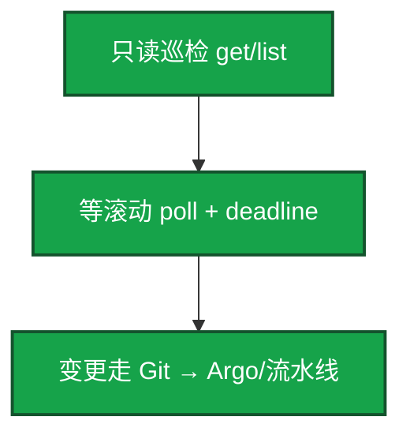
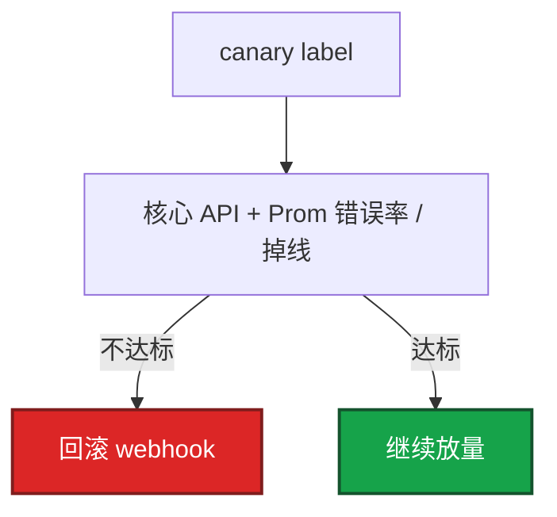
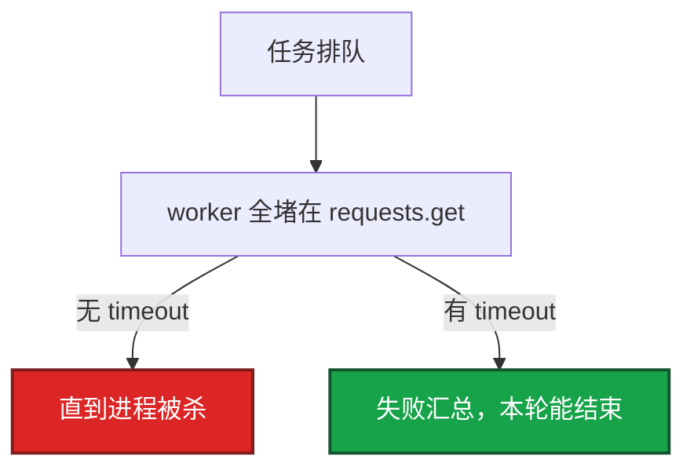

# 02｜Python 运维 · 练习题

先自己画图或口述，再对照解答。每题标了覆盖范围：

| 标记 | 含义 |
|------|------|
| **核心** | 不懂整章就没建立起来 |
| **必会** | 值班和面试都要能讲 |
| **常用** | 线上会反复碰到 |
| **常考** | 白板和追问的高频口径 |

## 本题目录

- [Q1 最低标准 / Cron](#q1)
- [Q2 HTTP 超时重试](#q2)
- [Q3 并发开服](#q3)
- [Q4 K8s client](#q4)
- [Q5 发布门禁](#q5)
- [Q6 密钥与日志](#q6)
- [Q7 简历怎么讲](#q7)
- [Q8 线程池卡住](#q8)
- [Q9 云 API 分页](#q9)
- [Q10 YAML 未知字段](#q10)
- [合上书](#合上书)

---

## Q1

**★★★★★｜生产脚本最低标准是什么？Cron 显示成功但没干活先查什么？**

**覆盖**：核心 · 必会 · 常考

### 场景

每天凌晨巡检「全部成功」，活动日发现 20 个区服 Redis 规格检查根本没跑。脚本里有 `except Exception: pass`。

### 完整解答

最低标准：argparse、logging、`--dry-run`、失败 `sys.exit(1)`、禁止裸 `except pass`。Cron/CI 只看退出码。

```python
def main():
    logging.basicConfig(level=logging.INFO, format="%(asctime)s [%(levelname)s] %(message)s")
    args = parse_args()
    try:
        deploy(args)  # dry-run 时只打将要调用的 API
    except Exception:
        log.exception("failed")
        sys.exit(1)
```

1. 依赖 pin + venv，CI 用同一 lock。
2. `subprocess.run(..., check=True, timeout=60)`，不要 `os.system`。
3. YAML `safe_load`，未知字段失败。

成功退出但没干活：吞异常，或 dry-run 开关反了。看日志和监控，不要先怪 Cron。

### 再追问

dry-run 怎么证明它真的「没 apply」？——打印完整请求方法和 URL（token 打码）、目标 host、将写入的字段。生产第一次必须先 dry-run 贴到变更单里。

---

## Q2

**★★★★★｜HTTP 调用有哪些硬要求？无 timeout 会怎样？POST 开服能默认重试吗？**

**覆盖**：核心 · 必会 · 常考

### 场景

巡检线程池逐渐耗尽，机器 load 不高但巡检延迟到小时级。下游支付网关偶发卡住，`requests.get` 没设 timeout。另一次开服 POST 重试出两个相同 server_id。

### 完整解答

`timeout=(连接, 读取)` 必设。重试默认只给幂等 GET。POST 开服/扣款重试会双写。token 不进日志。

```python
from requests.adapters import HTTPAdapter
from urllib3.util.retry import Retry

def session():
    s = requests.Session()
    r = Retry(
        total=3,
        backoff_factor=0.5,
        status_forcelist=(500, 502, 503, 504),
        allowed_methods=frozenset(["GET", "HEAD"]),
    )
    s.mount("https://", HTTPAdapter(max_retries=r))
    return s

resp = session().get(url, timeout=(3, 10), headers={"Authorization": f"Bearer {os.environ['TOKEN']}"})
resp.raise_for_status()
```

无 timeout：worker 挂死，巡检变故障，看起来像「Python 很慢」。429/503 退避。

### 再追问

内部网关失败率已经 30%，还继续重试吗？——停。失败率高就熔断本轮巡检，避免自己变成 DDoS。告警下游，不要加并发「多试几次」。

---

## Q3

**★★★★★｜并发巡检/开服怎么写？200 并发行不行？**

**覆盖**：核心 · 必会 · 常考

### 场景

活动前要开 50 服。脚本 `ThreadPoolExecutor(max_workers=200)` 打爆开服平台网关，一半 429，脚本仍然 `exit 0`。

### 完整解答

IO 用线程，workers 5–20，`as_completed` 汇总失败，有失败就非 0。已成功部分必须幂等可重入。

```python
from concurrent.futures import ThreadPoolExecutor, as_completed

def batch(ids, workers=8):
    failed = []
    with ThreadPoolExecutor(max_workers=workers) as ex:
        futs = {ex.submit(work, i): i for i in ids}
        for f in as_completed(futs):
            i = futs[f]
            try:
                f.result()
            except Exception:
                log.exception("id=%s", i)
                failed.append(i)
    if failed:
        log.error("failed=%s", failed)
        sys.exit(1)
```

200 并发会打爆网关。要限流（令牌桶见 04）。游戏开服部分失败：列出失败 id，通知人，不要默默当成功。

### 再追问

已成功的 30 服要不要回滚？——看门禁：若还没写目录，拆失败的即可，成功的可留。若已经对玩家可见，按开服回滚纪律处理（08）。脚本层至少保证失败可见、可重入。

---

## Q4

**★★★★★｜怎么调 K8s API 才合格？脚本能不能 cluster-admin？**

**覆盖**：核心 · 必会 · 常考

### 场景

巡检 Pod 给了 cluster-admin。有人用同一份 kubeconfig 在脚本里 `delete ns`。安全审计找上门。

### 完整解答

官方 client；Pod 内 incluster + 最小 SA。等待滚动自己 poll，带 timeout。写操作走 GitOps，脚本多只读。

```python
from kubernetes import client, config

config.load_incluster_config()   # Pod 内；笔记本用 load_kube_config()
apps = client.AppsV1Api()
# poll readyReplicas，deadline 到了当失败
```



cluster-admin 给脚本是事故。人手排障用 kubectl；逻辑等待用库。

### 再追问

和 kubectl 比，什么时候用库？——要循环等待、分支、失败汇总用库。一次性排障、你还不确定 JSON 路径，用 kubectl。生产变更仍 GitOps。

---

## Q5

**★★★★☆｜发布后检查脚本做什么？为什么不能看集群均值？**

**覆盖**：必会 · 常用 · 常考

### 场景

金丝雀 5 个 Pod 错误率 20%，集群另外 95 个还是旧版，平均错误率看起来「只升了一点」。门禁放行，全量后登录翻车。

### 完整解答

对金丝雀打登录/核心 API → 查 Prometheus **相对发布前 5min**，按 canary label 取数，不要用集群均值淹没。不达标调回滚。阈值参数化。



这是门禁代码化，不另搞 CD。健康检查不能只 `/health`。

### 再追问

活动日阈值要放宽怎么办？——做成参数或配置，不要改代码。放宽要写进变更窗口：错误预算不够仍应冻结。

---

## Q6

**★★★★☆｜密钥和日志怎么处理？打出 token 之后做什么？**

**覆盖**：必会 · 常用

### 场景

`log.info("auth %s", headers)` 把 Bearer 打进 ELK。群里还能搜到。

### 完整解答

密钥：环境变量或权限收紧的文件。结构化日志。`log.exception` 带栈。不要脚本自己 FileHandler 打满 CI 盘。未知配置字段应失败。

```python
# 打码 filter；不要 log.info("auth %s", headers)
log.info("auth Authorization=Bearer ***")
```

打出 token：立刻 rotate，logging filter 打码，清日志保留副本（合规允许的范围内）。和 Ansible：OS 期望状态 Ansible；API 编排 Python。

### 再追问

对账脚本的 AK 能不能和工作流发版用同一把？——不能。对账只读；写操作另开 job + 审批。泄漏面分开。

---

## Q7

**★★★★☆｜简历里 Python 运维项目怎么讲？不要讲 list/dict。**

**覆盖**：必会 · 常考

### 场景

对方问「你 Python 怎么样」。有人开始背切片和推导式。

### 完整解答

讲胶水：对账 / 开服检查 / 发布门禁。数字：耗时、失败可见、误操作次数下降。强调 dry-run 和退出码。讲超时、并发上限、平台 API 权限。

一次性 JSON 脚本用 Python；常驻采集才 Go。不要现场背语法。

### 再追问

为什么不用 Go 写开服检查？——要快迭代、调多个 HTTP JSON、团队都会 Python。常驻、单二进制、高并发连接再用 Go。边界说清即可。

---

## Q8

**★★★★☆｜线程池卡住、下游偶发死锁，你怎么查？**

**覆盖**：必会 · 常用

### 场景

巡检从 2 分钟变成「永远跑不完」。进程还在，CPU 很低。

### 完整解答

先怀疑 HTTP/SSH **无 timeout**。每个出站调用必须有上限。再看 worker 数是不是都被占住（同一下游）。



补 timeout 后仍慢：限流、缩小并发、熔断失败率高的目标。不要加 worker 硬冲。

### 再追问

`concurrent.futures` 里异常不 `result()` 会怎样？——异常在 future 里，你不 `result()` 就等于吞掉，主进程还可能 0 退出。必须 `as_completed` + `result()`。

---

## Q9

**★★★☆☆｜分页拉云 API 和一次 List 全量差在哪？**

**覆盖**：常用 · 常考

### 场景

对账脚本把账号下所有 ECS 一次 List，接口超时，偶发把 RAM 限额打满。

### 完整解答

用 SDK paginator 按页拉，页间 sleep 或限流。失败重试只针对 5xx。不要一次 List 全量。对账用只读凭证。

```python
for page in client.get_paginator("describe_instances").paginate():
    for inst in page.get("Reservations", []):
        work(inst)
    time.sleep(0.2)   # 限流
```

### 再追问

中途一页 503，整次对账怎么算？——记失败页，非 0 退出或标记部分成功；不要把不完整清单当 CMDB 真相去关机器。

---

## Q10

**★★★☆☆｜配置 YAML 多了一个未知字段，该失败还是忽略？**

**覆盖**：常用 · 常考

### 场景

把 `env: proudction` 写错，schema 里没有的键被忽略，脚本用默认 staging 对生产做了 dry-run 以为安全，实际连错集群——若校验失败本可以拦住。

### 完整解答

未知字段应失败。`safe_load` 之后用明确 schema（或只允许的 key 集合）校验。静默忽略会让配错 env 还以为成功。

```python
ALLOWED = {"env", "region", "replicas"}
data = yaml.safe_load(raw)
unknown = set(data) - ALLOWED
if unknown:
    raise SystemExit(f"unknown keys: {unknown}")
```

### 再追问

环境变量和 YAML 谁覆盖谁？——约定写进 `--help` 和文档：例如环境变量覆盖 YAML。冲突时打日志。不要两边各写一套还互相不知道。

---

## 合上书

- [ ] 能默写 argparse + logging + dry-run + `sys.exit(1)`，禁止 `except pass`
- [ ] 能写 `timeout=(3, 10)` + Retry 只对 GET/HEAD；POST 开服不默认重试
- [ ] 能写 ThreadPool `as_completed` + `result()` + failed 非空非 0
- [ ] 能说出 incluster vs kubeconfig、最小 SA、等待带 deadline
- [ ] 能把门禁接到 canary label + Prom 相对 baseline
- [ ] 能处理 token 泄漏、分页、未知 YAML 字段
