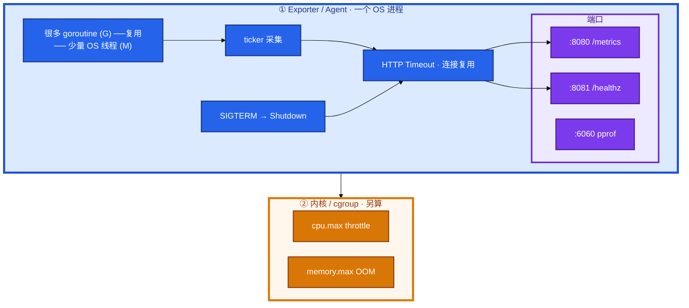
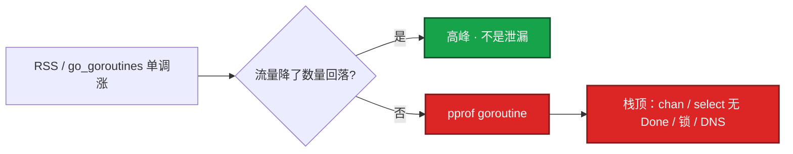
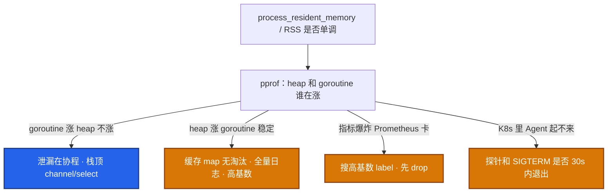
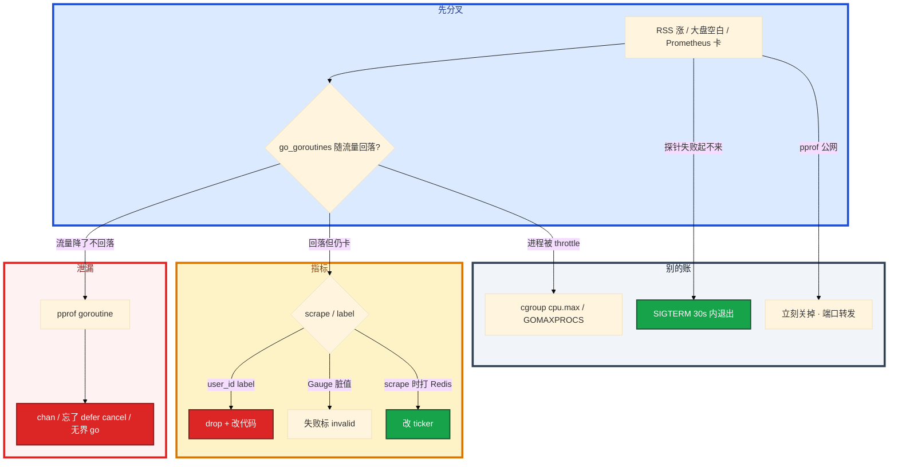

# Go 运维工具


大厅 `hall_exporter` 跑了一周，RSS 从 80MB 涨到 2GB，`go_goroutines` 从 40 涨到 3 万。有人把 `user_id` 打进 Histogram label，Prometheus OOM。简历没写 Go，对方却拖进 slice 语法。群里有人要重启「先苟过活动」。

先别动手。这一章后半全是你会动手的：**怎么读 exporter、怎么抓 pprof、怎么交叉编译、SIGTERM 怎么刷完指标再走。** 前面的概念，是为了让你动手时不把 cgroup throttle 当成 goroutine 泄漏。

**读完你能：** 白板上画出 Exporter 进程里 G 和 M 的关系；CCU 用 Gauge、玩家 id 不当 label；会用 pprof 区分 heap vs goroutine；会交叉编译和优雅退出。简历没写 Go：**不要主动展开语法**。

## 本章目录

缩进 = 上下级。3 下面才是 3.1。

想钉在**正文左边**跟着滚：菜单 **查看 → 打开视图 → 大纲**。Markdown 预览做不到独立左栏，目录只能写在文章开头。

- [1. 基本概念](#1-基本概念)
- [2. 架构图](#2-架构图)
- [3. 原理](#3-原理)
  - [3.1 goroutine](#31-goroutine便宜不等于免费)
  - [3.2 指标类型](#32-指标类型与高基数)
  - [3.3 context 与信号](#33-context与信号)
- [4. 落地：怎么写、怎么跑](#4-落地怎么写怎么跑)
  - [4.1 交叉编译](#41-交叉编译)
  - [4.2 怎么跑](#42-怎么跑pprof-与探针)
- [5. 关键写法与坑](#5-关键写法与坑)
- [6. 常用命令 / 库](#6-常用命令--库)
- [7. 常用操作](#7-常用操作)
  - [7.1 读 exporter](#71-读-exporter)
  - [7.2 查泄漏](#72-查-goroutine-泄漏)
  - [7.3 RSS 分流](#73-agent-rss-涨)
  - [7.4 优雅退出](#74-sigterm优雅退出)
- [8. 生产排障](#8-生产排障)
- [9. 必会 · 常考](#9-必会--常考)
- [合上书](#合上书问自己)

**本章不讲：** 脚本胶水、HTTP 重试、线程池 → [02 Python](../02-Python运维/)；并发 SSH 工具整题 → [04 实战题](../04-运维开发实战题/)；Prometheus 指标设计、告警 → [04-K8s 18](../../04-Kubernetes/18-监控与可观测性/)、[02-21 监控](../../02-基础底座/21-监控与告警/)；Operator/CRD 展开 → [04-K8s 20](../../04-Kubernetes/20-Operator与CRD/)；进程 RSS、cgroup → [02-04 内存](../../02-基础底座/04-内存与OOM/)、[02-07 cgroup](../../02-基础底座/07-cgroup与容器/)。

---

## 1. 基本概念

K8s、Prometheus、containerd 生态就是 Go。运维侧常驻进程要 **单二进制、goroutine 便宜、部署不像 Python 那样绑 venv**。便宜不等于免费。

胶水用 Python，常驻用 Go。简历没写 Go：能读 exporter、会用 pprof 看泄漏即可，**不要主动展开语法**。

| 在 Go 里做 | 不在 Go 里做 |
|------------|--------------|
| 常驻 Agent / Exporter / 网关 | 一次性 JSON、多 API 开服检查 → Python |
| 数千节点并发 SSH CLI | 10 行管道 → Shell |
| 读 Prometheus client、pprof | 现场背 slice / channel 语法 |

三个角色不要混：

| 角色 | 干什么 |
|------|--------|
| **goroutine (G)** | 用户态协程；很多个 G 复用少量 OS 线程 (M) |
| **pprof** | 看运行时：heap、goroutine 栈 |
| **cgroup** | 看内核账：`cpu.max` throttle、`memory.max` OOM |

Operator 一句话：Watch CR → Reconcile → 写集群 → 失败 requeue。幂等是灵魂。简历没写 Operator，说到这一句够。有状态游戏服自动扩要非常谨慎——Reconcile 里加副本不等于玩家能进，Session 不在新 Pod 上。对方追「你写过 Operator 吗」：没写过就停，不要现场编 CRD 字段。写过就补：失败必须可重入，reconcile 里禁止扣款、删库这类副作用。

> **记住**：泄漏时你看到的是 `runtime.NumGoroutine()` 和 RSS 斜线往上，**不是** top 里突然多了一万个内核线程，也**不是** cgroup `cpu.max` 把你 throttle。两套账不要混。

---

## 2. 架构图

先把整张图钉住。后面 pprof、信号、排障都对着这张图说话。



图上三条线：

1. **泄漏：G 只增不减 → RSS 涨；top 线程数不一定炸。**
2. **pprof 看运行时；cgroup 看内核账。** RSS 涨你先去看 `cpu.max`，账看错了。
3. **pprof 不要公网裸奔。** 采集循环要有 ticker；HTTP 要 Timeout；label 集合封闭。

GOMAXPROCS 默认等于 `nproc`（宿主机核数），limit=1 核时会自己把自己打进配额。K8s 里老版本要手动对齐 limit。64 核机器、container `cpu` limit=1，老 runtime 仍按 64 起线程，自己把自己打进 `cpu.max` throttle。你看到的是 pprof 里线程多、cgroup 里 throttled_usec 涨——两套账都要看。

---

## 3. 原理

原理只保留动手和面试会用到的：泄漏长什么样、四类指标、信号怎么退出。

**本节 3 块：** 3.1 goroutine · 3.2 指标 · 3.3 context/信号

### 3.1 goroutine：便宜不等于免费

流量下来还不回落，才是泄漏，不是高峰。活动结束 CCU 降了，计数还不降，才动手。



常见原因（能指出来即可）：

```go
// 无缓冲 channel 发出去没人收 → 永久阻塞
ch := make(chan int)
go func() { ch <- 1 }()

// HTTP/DB 没绑 context，上游取消了 goroutine 还在跑
req, _ := http.NewRequestWithContext(ctx, "GET", url, nil)

// WithTimeout 必须 cancel，否则 timer/goroutine 泄漏
ctx, cancel := context.WithTimeout(parent, 5*time.Second)
defer cancel()
```

死锁会卡住功能；泄漏是协程数单调升。都能 pprof。数量级：正常服务几十到几百 goroutine；持续涨到数万还在处理请求，就是泄漏或没限制的 fan-out。核对：goroutine 与 QPS 同升同降才正常。

请求路径里 `for` 里裸 `go f()` 且无 worker 池，就是泄漏或打爆下游的候选。每个登录请求 `go notify()` 打 webhook：活动高峰 goroutine 数万，下游飞书限流，登录 P99 跟着炸。用有界 worker + 有界 queue，满了丢弃或同步失败。登录主路径不要等通知。丢弃并打指标 `dropped_total`，或改成同步但带 timeout。保核心协议。

### 3.2 指标类型与高基数

| 类型 | 语义 | 运维误用 |
|------|------|----------|
| Counter | 只增（登录次数） | 当成当前 CCU |
| Gauge | 可上可下（CCU、队列） | 失败时留脏值 |
| Histogram | 延迟桶 | label 带 `user_id` → 基数爆炸 |

游戏：CCU 用 Gauge，登录次数 Counter，接口延迟 Histogram。采集打 Redis 必须 timeout，否则游戏服抖动时 exporter 自己先卡死，Prometheus 全空。采集失败 Gauge 还停在上次的 CCU → 大盘看起来「还在线」。失败要显式变成 NaN 或下调。

Histogram 桶按 SLA：游戏 API 常用 5–50–100–200–500ms，别用默认秒级桶。50ms SLA 配默认 `{0.005, 0.01, 0.025, 0.05, 0.1, 0.25, 0.5, 1, 2.5, 5, 10}` 秒，前几桶太空、业务全落 0.05 附近，没分辨率。

label：`server_id` / `region` 可以（封闭集合）；`user_id` / `role_id` / `order_id` 不行。高基数比「漏一个指标」更快把 Prometheus 打死。已经炸了：改代码丢 label，Prometheus 侧 drop，先止血。已经进了长期存储：停 scrape、drop、必要时放弃这批坏 series。不要靠「再加机器」硬扛。

### 3.3 context 与信号

- **context**：超时和取消往下游传；进程退出 `Shutdown(ctx)` 等 in-flight。忘了 `defer cancel()` 会 timer/goroutine 泄漏。
- **error**：`(T, error)`，禁止 `_` 丢掉。
- **优雅退出**：信号 → 停监听 → 等超时 → 退出。游戏 Agent 要在 SIGTERM 里刷完指标再走（K8s 先 SIGTERM 再 SIGKILL）。


下游不认 ctx：至少本进程能停；选客户端时要能绑定 ctx。否则 SIGTERM 后仍打满下游，探针失败被杀得更难看。

> **记住**：简历无 Go：四类指标 + 高基数 + pprof，到此为止。补丁交给开发。合格答法：指出 pprof 栈和指标误用，给出「加 timeout / 限制 worker / 改 label」三类方向。

---

## 4. 落地：怎么写、怎么跑

### 4.1 交叉编译

运维组件常要在 Mac 上编出 Linux amd64，丢进镜像或丢到 CVM。Go 交叉编译不靠交叉工具链（纯 Go 代码）：

```bash
# 大厅 exporter：Linux amd64，去掉符号表减小体积
CGO_ENABLED=0 GOOS=linux GOARCH=amd64 go build -trimpath -ldflags="-s -w" -o hall_exporter .

# ARM 机器 / Graviton
CGO_ENABLED=0 GOOS=linux GOARCH=arm64 go build -o hall_exporter .

# 看当前编出来的是什么
file hall_exporter
go version -m hall_exporter
```

| 项 | 选 | 不选 |
|----|----|------|
| CGO | `CGO_ENABLED=0` 静态、可移植 | 默认 CGO 在 glibc 不同的机器上跑不起来 |
| GOOS/GOARCH | 目标机，不是编译机 | 在 Mac 编完直接丢 Linux |
| 符号 | 生产 `-ldflags="-s -w"` | 要 pprof 符号的预发别剥 |
| 版本 | `-ldflags "-X main.version=..."` | 线上二进制说不清是哪次构建 |
| race | 预发 `-race` | 当生产默认（慢、吃内存） |

`CGO_ENABLED=1` 才需要目标平台的 C 编译器。纯 Prometheus exporter 保持 0。小 CLI：flag/`cobra`、`--dry-run`、`errgroup` + 限制 goroutine。

### 4.2 怎么跑：pprof 与探针

```bash
./hall_exporter --listen=:8080 --pprof=:6060
curl -s localhost:8080/metrics | grep -E 'go_goroutines|process_resident_memory'
curl -s localhost:8081/healthz
```

pprof 在非生产或带鉴权的 admin 端口开。公网裸奔 `/debug/pprof` 等于送栈和内存布局。生产临时开：端口转发，用完关。

```bash
kubectl port-forward deploy/hall-exporter 6060:6060
curl -s localhost:6060/debug/pprof/goroutine?debug=2 | head -80
```

Exporter 自身 `/metrics` 的 scrape 不要超过 1s。观测：`go_goroutines`、`process_resident_memory_bytes`、scrape 耗时。goroutine 与 QPS 解耦就报警。

---

## 5. 关键写法与坑

打开 `hall_exporter` 仓库。典型：`prometheus/client_golang` 注册指标，`promhttp.Handler()` 挂在 `/metrics`。按下面顺序看，能讲 90 秒。

| # | 看什么 | 错了会怎样 |
|---|--------|------------|
| 1 | `main`：`/metrics` 与 `/healthz` 是否分开 | 慢连接把 scrape 占死 |
| 2 | Server 有没有 `ReadHeaderTimeout` | 慢连接占死 |
| 3 | scrape 时现算还是后台 ticker 写 Gauge | 大厅一抖，采集全超时，大盘空白 |
| 4 | label 是否封闭（区服 id 可以；玩家 id 不行） | Prometheus OOM |
| 5 | 打游戏服/Redis 有无 timeout、连接是否复用 | exporter 自己先卡死 |
| 6 | SIGTERM：`Notify` → `Shutdown`，K8s 宽限期内返回 | 探针失败，被 SIGKILL |

口误两句：Counter 当在线人数；Histogram 默认桶全是秒，游戏 50ms SLA 全落第一桶。`go func` 里再起 HTTP 不设 timeout，泄漏和雪崩一起到。

读代码先搜 `MustRegister` / `promauto` 和 `label` 字符串——不会写代码也可以做完这两步。预发可用 `-race` 构建查竞态，不要当生产默认。

```go
srv := &http.Server{Addr: ":8080", ReadHeaderTimeout: 5 * time.Second}

ctx, stop := signal.NotifyContext(context.Background(), syscall.SIGTERM, syscall.SIGINT)
defer stop()
go srv.ListenAndServe()
<-ctx.Done()
shctx, cancel := context.WithTimeout(context.Background(), 20*time.Second)
defer cancel()
_ = srv.Shutdown(shctx)
```

---

## 6. 常用命令 / 库

| 目的 | 命令 / 库 | 看什么 |
|------|-----------|--------|
| 交叉编译 | `CGO_ENABLED=0 GOOS=linux GOARCH=amd64 go build` | `file` 是 ELF 64-bit |
| 指标 | `curl /metrics \| grep go_goroutines` | 是否随 QPS 回落 |
| 文本栈 | `curl .../goroutine?debug=2` | 函数名；不会 Go 也能读 |
| 交互 pprof | `go tool pprof -http=:8081 goroutine.pb.gz` | 阻塞在 chan / IO |
| heap | `curl .../heap > heap.pb.gz` | 缓存 map、全量日志 |
| 库 | `prometheus/client_golang`、`promhttp` | MustRegister、label |
| CLI | flag / cobra、errgroup | `--dry-run`、限制 goroutine |
| 信号 | `signal.NotifyContext` + `Shutdown` | 宽限期内返回 |

值班先跑这四条：

```bash
curl -s localhost:8080/metrics | grep -E 'go_goroutines|process_resident_memory'
curl -s localhost:6060/debug/pprof/goroutine?debug=2 | head -80
# 单调还是跟着 CCU 走；大量 runtime.selectgo / chan receive → 找发送方
```

看到大量 `runtime.selectgo` / `chan receive`，去找对应 channel 的发送方是否还在。heap 涨再 `curl .../heap`。

---

## 7. 常用操作

### 7.1 读 exporter

1. **`main` 里 `/metrics` 和 `/healthz` 挂在同一端口、没有 ReadHeaderTimeout** → 先补 Timeout，健康检查分开。
2. **scrape 时现算、还去打 Redis** → 改成后台 ticker 写 Gauge。
3. **label 里出现 `user_id` / `role_id`** → 先 drop 止血，再改代码。
4. **采集失败 Gauge 还停在上次的 CCU** → 失败要显式变成 NaN 或下调。

### 7.2 查 goroutine 泄漏

```bash
curl -s localhost:6060/debug/pprof/goroutine > goroutine.pb.gz
go tool pprof -http=:8081 goroutine.pb.gz
# 不会 Go 也可：curl '.../goroutine?debug=2' 读函数名
```

修复：出站请求带 ctx；channel 用 buffer 或 `select`+done；`WaitGroup` 配对 `Done`；不要在请求路径无限 `go func`。简历没写 Go：直接说「我按指标和 pprof 定位，改代码找开发」，不要现场背 slice。

重启能不能当修复？——能止血，不能当根因。活动中可以先重启保 CCU，活动后必须抓 pprof 再发版，否则下周还涨。

### 7.3 Agent RSS 涨

不要一上来 dump heap。



两边都在涨：先限 fan-out（goroutine），再查缓存。同时抓两份 pprof，不要只重启。改：timeout、有界队列、限制 worker。老 cgroup 对齐 GOMAXPROCS。

### 7.4 SIGTERM 优雅退出

Agent 起不来、探针失败：先看 SIGTERM 是否 30s 内退出，不要先改业务镜像。游戏 Agent 要刷完指标再走。对方问 slice 底层——拉回 pprof 和指标。

Operator：调和必须幂等，失败 requeue，不要在 reconcile 里做不可重入副作用（删数据、扣款）。和 Ansible 同一句话：期望状态，重复执行结果一样。Operator 是持续的 Ansible，不是一次性脚本。自写 Operator 在 Reconcile 成功路径里删临时库：requeue 或重复交付后把不该删的删了。有状态游戏服自动扩：不要让 Operator 按 CPU 加战斗副本。扩容边界见 08、01 系统设计。

简历没写 Go、被问 channel / `select` / nil channel：诚实——生产问题我用 pprof/metrics 定位，改代码找开发。我能判断是泄漏还是下游超时，能读 `debug=2` 栈上的函数名。把话题拉回：你们 Agent 的 `go_goroutines` 和 scrape 耗时我怎么设告警。若简历写了「熟悉 Go」却只改过小工具，应写「脚本级」。写了「熟悉」被问语法是自己挖的坑，见 01 简历章。

并发 SSH 几千台：更接近常驻或 CLI 池化，Go 合适（04 实战题）。50 台以内 Python 线程池也能做，关键是超时和失败汇总。

---

## 8. 生产排障

三问：进程还在？`go_goroutines` 跟不跟 QPS 走？scrape 还出数吗？

**RSS 涨 ≠ 先 dump heap。** 先分高峰还是泄漏，再分 heap vs goroutine。



| 现象 | 先做什么 | 不要做什么 |
|------|----------|------------|
| RSS 一周涨一倍、夜间 QPS 已下去 | pprof goroutine；流量降了不回落才是泄漏 | 先重启当修复 |
| CCU 图在活动结束后还涨 | Counter 当了 Gauge | 加采集频率 |
| Prometheus OOM | 搜 `user_id` / `role_id`，先 drop | 再加 Prometheus 机器 |
| 大厅大盘空白 | 采集打 Redis 有无 timeout；scrape 是否现算 | 先改业务镜像 |
| Agent 起不来 | SIGTERM / 探针 / 30s | 先改业务 |
| pprof 线程多 + throttled_usec 涨 | GOMAXPROCS 对齐 limit | 只看 pprof 或只看 cgroup |
| 每个请求 `go notify()` | 有界 worker + queue | 再加 goroutine |

活动高峰 goroutine 数万、飞书限流、登录 P99 炸。正确处理：确认是无界 fan-out → 有界队列 → 丢弃打 `dropped_total` → 保核心协议。不要为了通知把登录拖死。

---

## 9. 必会 · 常考

白板和追问高频，能一口回：

| 说法 | 对错 | 口径 |
|------|:----:|------|
| CCU 可以用 Counter | 错 | Gauge；Counter 只增 |
| `user_id` 可以当 Histogram label | 错 | 高基数打死 Prometheus |
| 流量降了 goroutine 不降是高峰 | 错 | 那是泄漏 |
| 泄漏 = top 里一万个内核线程 | 错 | 是 G，不是 M |
| RSS 涨先看 cpu.max | 错 | 先分 heap vs goroutine；cgroup 是另一套账 |
| 采集失败 Gauge 留着昨天的 CCU | 错 | 脏值；标 invalid |
| `/debug/pprof` 可以挂公网 | 错 | 送栈；内网 + 鉴权 |
| 忘了 `defer cancel()` 没问题 | 错 | timer/goroutine 泄漏 |
| 请求路径无限 `go func()` | 错 | 无界 fan-out |
| 交叉编译不用设 GOOS | 错 | Mac 编的不是 Linux ELF |
| Operator Reconcile 里删一次库就行 | 错 | 必须幂等；会 requeue |
| 简历没写 Go 也能现场讲 channel | 错 | pprof + 指标到此为止 |

数字：正常 goroutine **几十到几百**；scrape **< 1s**；ReadHeaderTimeout 常见 **5s**；Shutdown 宽限期对齐 K8s **30s** 内；Histogram 游戏 API **5–50–100–200–500ms**。

易混：G vs M；pprof vs cgroup；Counter vs Gauge；ticker 后台算 vs scrape 现算；泄漏 vs 死锁；交叉编译 CGO 0 vs 1。

---

## 合上书，问自己

1. 胶水用什么、常驻用什么？goroutine 泄漏和 cgroup throttle 差在哪？
2. CCU / 登录次数 / 延迟各用哪类指标？玩家 id 能不能当 label？
3. 流量降了 `go_goroutines` 不降，你敲哪条 curl？
4. 交叉编译三件套是什么？`CGO_ENABLED=0` 为什么？
5. SIGTERM 之后 Agent 该做什么？忘了 `defer cancel()` 会怎样？
6. 简历没写 Go，对方问 `select`，怎么收口？

六题都能口述，这一章就过了。下一章把白板实战题剖开：批量改配置、巡检、并发 SSH、限流、告警。
