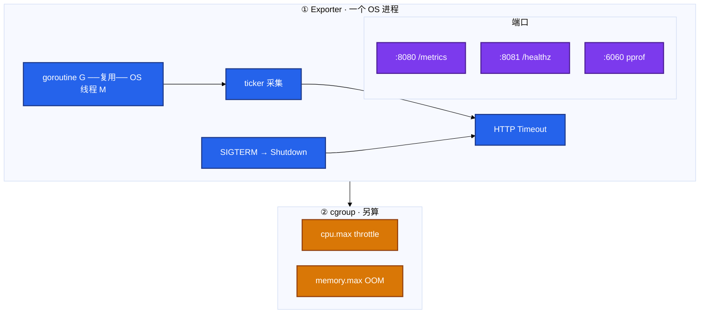
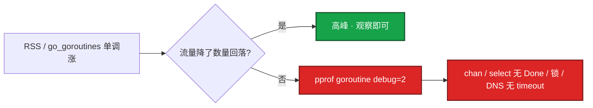
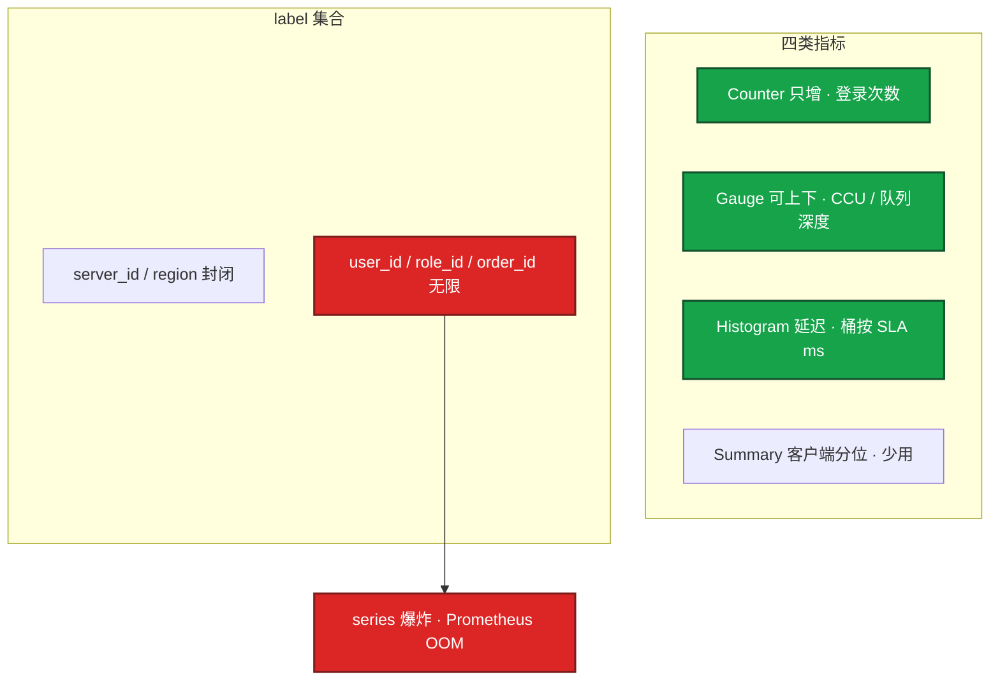
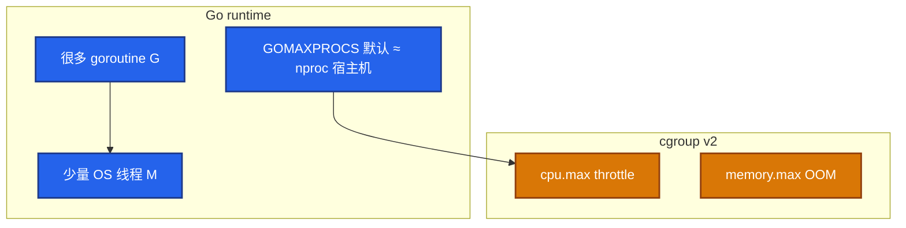
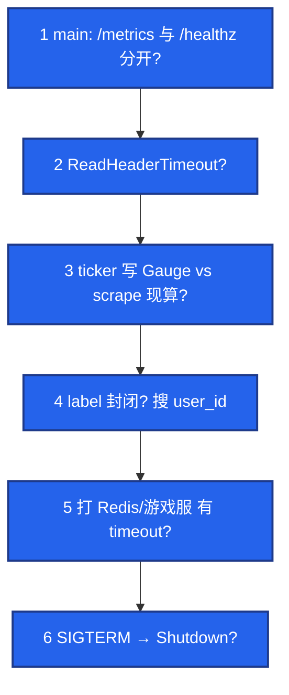

# 03｜Go 运维工具 · SRE 开发能力

> 把 Go 当**常驻运维组件语言**：读 exporter、抓 pprof、交叉编译、SIGTERM 优雅退出；简历没写 Go 就收口到指标与运行时排障，不背 slice/channel 八股。

## 面试怎么考

| 标记 | 考点 |
|------|------|
| **核心** | CCU=Gauge 不是 Counter；`user_id` 不能当 label；泄漏 = 流量降了 `go_goroutines` 不回落 |
| **必会** | pprof `debug=2` 读栈；`defer cancel()`；`http.Server` + `Shutdown` + `ReadHeaderTimeout` |
| **常用** | 交叉编译 `CGO_ENABLED=0 GOOS=linux GOARCH=amd64`；RSS 先分 heap vs goroutine |
| **常考** | G vs M vs cgroup throttle；Operator 幂等；简历没写 Go 怎么收口 |

**30 秒怎么说**：K8s/Prometheus 生态是 Go。运维侧常驻 Agent/Exporter 用 Go 是因为单二进制、goroutine 便宜。我生产上能读 exporter：CCU 用 Gauge，玩家 id 不当 label；泄漏看 `go_goroutines` 流量降了还不回落，curl pprof `debug=2` 找阻塞栈；SIGTERM 走 `Shutdown` 宽限期；Mac 编 Linux 要 `CGO_ENABLED=0`。简历没写 Go 我不主动展开语法，改代码找开发。

---

## 能力边界

| 维度 | Go 适合 | Go 不适合 |
|------|---------|-----------|
| **任务** | 常驻 Exporter/Agent、网关、高并发连接池 | 一次性 JSON 编排、多 API 开服检查 |
| **生命周期** | 7×24 单进程、K8s 探针、metrics 端点 | 10 行管道、Cron 里调 kubectl |
| **并发** | 数千 goroutine 复用少量 OS 线程 | 有界 fan-out 要靠 worker+queue，不是无限 `go` |
| **vs Python** | 常驻采集、低依赖部署 | HTTP JSON、argparse、ThreadPool 开服脚本 |
| **vs Shell** | 长期驻留、要 pprof/指标 | 跳板机 one-liner、管道组合 |
| **vs Operator** | 读 reconcile 循环在干什么 | 没写过就别现场编 CRD 字段 |

三个角色不要混：

| 角色 | 干什么 | 面试口径 |
|------|--------|----------|
| **goroutine (G)** | 用户态协程，很多 G 复用少量 OS 线程 (M) | 泄漏看 G 数，不是 top 里一万内核线程 |
| **pprof** | 看运行时：heap、goroutine 栈 | `debug=2` 文本栈，不会 Go 也能读函数名 |
| **cgroup** | 内核账：`cpu.max` throttle、`memory.max` OOM | 和 G 泄漏是两套账，别混 |

> **记住**：胶水用 Python，编排用 Shell，**常驻用 Go**。简历没写 Go：**不要主动展开语法**，能读 exporter + pprof 定位即可。

**本章不讲：** 脚本胶水、HTTP 重试 → [02 Python](../02-Python运维/)；并发 SSH 整题 → [04 实战题](../04-运维开发实战题/)；Prometheus 告警规则 → [04-K8s 18](../../04-Kubernetes/18-监控与可观测性/)、[02-21 监控](../../02-基础底座/21-监控与告警/)；Operator/CRD 展开 → [04-K8s 20](../../04-Kubernetes/20-Operator与CRD/)；RSS、cgroup 底层 → [02-04 内存](../../02-基础底座/04-内存与OOM/)、[02-07 cgroup](../../02-基础底座/07-cgroup与容器/)。

---

## 语言最小集（读代码够用）

> **要不要学？** 分情况。**简历写了 Go / 要读 Exporter**：下面必须会。**没写 Go**：会认 `err != nil`、`struct`、goroutine 即可，不必背语法大全。

| 构造 | 写法 | 读 Exporter 时见到 |
|------|------|---------------------|
| 包与入口 | `package main`；`func main()` | 二进制入口 |
| 导入 | `import ("fmt"; "net/http")` | 依赖一眼扫 |
| 短声明 | `x := 1`；`s := "a"` | 局部变量 |
| 多返回值 | `v, err := fn()` | **几乎每行都有** |
| 错误处理 | `if err != nil { return err }` | Go 没有 try/catch |
| 循环 | **只有** `for`：`for {}` / `for i := 0; i < n; i++` / `for k, v := range m` | 采集、遍历 |
| 条件 | `if x != nil`；`switch` | 分支 |
| 结构体 | `type Config struct { Port int \`yaml:"port"\` }` | 配置、指标定义 |
| 方法 | `func (c *Collector) Collect(ch chan<- prometheus.Metric)` | Exporter 核心 |
| 切片 | `[]string`；`append(s, "x")` | 主机列表 |
| map | `m := map[string]int{}`；`m["k"]` | 标签、缓存 |
| 指针 | `*T`；`&x`；`func f(p *Config)` | 大结构体传参 |
| 接口 | `type Reader interface { Read([]byte) (int, error) }` | `http.Handler`、mock |
| defer | `defer f.Close()`；`defer cancel()` | 关连接、释 timer |
| 并发 | `go worker()`；`chan T`；`select` | 采集 goroutine |
| 模块 | `go mod init`；`go build`；`go test ./...` | 项目结构 |

**最小可读程序**（能认结构，后面章节加 metrics/pprof）：

```go
package main

import (
    "context"
    "fmt"
    "log"
    "time"
)

type Result struct {
    Host string
    OK   bool
    Err  error
}

func ping(ctx context.Context, host string) Result {
    select {
    case <-ctx.Done():
        return Result{Host: host, Err: ctx.Err()}
    case <-time.After(50 * time.Millisecond):
        return Result{Host: host, OK: true}
    }
}

func main() {
    ctx, cancel := context.WithTimeout(context.Background(), 2*time.Second)
    defer cancel()

    hosts := []string{"10.0.0.1", "10.0.0.2"}
    failed := 0
    for _, h := range hosts {
        r := ping(ctx, h)
        if r.Err != nil || !r.OK {
            log.Printf("FAIL %s: %v", r.Host, r.Err)
            failed++
            continue
        }
        fmt.Println("OK", r.Host)
    }
    if failed > 0 {
        log.Fatalf("%d hosts failed", failed)
    }
}
```

**读 Exporter 源码时盯这几处**（顺序见后文 §3.5）：

```go
var up = prometheus.NewGaugeVec(prometheus.GaugeOpts{
    Name: "my_up", Help: "1 if scrape ok",
}, []string{"host"})

func (c *Collector) Collect(ch chan<- prometheus.Metric) {
    for _, host := range c.hosts {
        if err := c.scrape(host); err != nil {
            up.WithLabelValues(host).Set(0)
            continue
        }
        up.WithLabelValues(host).Set(1)
    }
    up.Collect(ch)
}
```

| 易错 | 正确 |
|------|------|
| 忽略 `err` | 每个 `err != nil` 都要处理或显式 `_` |
| `defer cancel()` 忘记 | 每个 `WithTimeout` 配对 defer |
| range 里 `go func() { use host }()` | `h := host` 再 `go func(){ use h }()` |
| 以为有 while | Go 只有 `for` |

> **记住**：语言最小集 = **认代码**；下一节 goroutine/context/pprof = **面试答 + 排障**。

---

## 语法必会

按 SRE 读 exporter / 写小 Agent **够用**组织。不考 slice 底层、channel trivia。

### 1. goroutine：便宜不等于免费

**用法**：`go f()` 启动协程；泄漏时 `runtime.NumGoroutine()` / `go_goroutines` 单调涨。

```go
// 错：无缓冲 channel 发出去没人收 → 永久阻塞
ch := make(chan int)
go func() { ch <- 1 }()

// 对：有界 worker + 有界 queue
jobs := make(chan Job, 1024)
for i := 0; i < 8; i++ {
    go worker(jobs)
}
```

**易错**：请求路径里 `for` 裸 `go notify()` → 活动高峰 goroutine 数万，下游限流，主路径 P99 炸。正常服务 **几十到几百** goroutine；持续涨到 **数万** 且流量已降，才是泄漏。

### 2. context + cancel

**用法**：超时和取消往下游传；`WithTimeout` / `WithCancel` **必须** `defer cancel()`。

```go
ctx, cancel := context.WithTimeout(parent, 5*time.Second)
defer cancel()   // 忘了 → timer / 关联 goroutine 泄漏

req, err := http.NewRequestWithContext(ctx, "GET", url, nil)
```

**易错**：HTTP/DB 没绑 ctx，上游取消了 goroutine 还在跑。文档要求：**每个 WithTimeout 配对 defer cancel()**。

### 3. errgroup + 限制并发

**用法**：批量打 API / 多目标采集，限制 goroutine 上限，任一失败可取消兄弟任务。

```go
g, ctx := errgroup.WithContext(parent)
g.SetLimit(10)   // Go 1.20+；老版本用 semaphore
for _, host := range hosts {
    h := host
    g.Go(func() error {
        return ping(ctx, h)
    })
}
if err := g.Wait(); err != nil { /* 汇总失败 */ }
```

**易错**：`errgroup` 不设 limit = 几千台同时打，把自己和下游一起打挂。CLI 还要 `--dry-run`、失败非零退出。

### 4. flag / cobra

**用法**：运维小工具用 `flag` 或 `cobra` 暴露 `--listen`、 `--pprof`、`--dry-run`。

```go
listen := flag.String("listen", ":8080", "metrics listen")
pprofAddr := flag.String("pprof", ":6060", "pprof listen (internal only)")
dryRun := flag.Bool("dry-run", false, "print actions only")
flag.Parse()
```

**易错**：硬编码端口进镜像；生产 pprof 端口必须内网 + 鉴权，不能和 `/metrics` 一起裸奔公网。

### 5. pprof：curl 够用

**用法**：进程开 `/debug/pprof`（或独立 admin 端口），文本栈 + 二进制 profile。

```bash
# 文本栈：不会 Go 也能读函数名
curl -s localhost:6060/debug/pprof/goroutine?debug=2 | head -80

# 二进制 + 交互火焰图
curl -s localhost:6060/debug/pprof/goroutine > goroutine.pb.gz
go tool pprof -http=:8081 goroutine.pb.gz

# heap 涨时再抓
curl -s localhost:6060/debug/pprof/heap > heap.pb.gz
```

**典型输出**（节选）：

```text
go_goroutines 2847
process_resident_memory_bytes 2.147483648e+09
...
goroutine 2847 [chan receive]:
runtime.gopark(...)
main.worker(...)
```

看到大量 `runtime.selectgo` / `chan receive` → 找 channel 发送方是否还在；`NewRequestWithContext` 是否缺失。

### 6. 交叉编译：CGO_ENABLED=0

**用法**：Mac 编 Linux amd64，纯 Go 不需要交叉工具链。

```bash
CGO_ENABLED=0 GOOS=linux GOARCH=amd64 go build -trimpath -ldflags="-s -w" -o hall_exporter .
file hall_exporter                    # ELF 64-bit LSB
go version -m hall_exporter           # 看 GOOS/GOARCH
```

| 项 | 生产选 | 不选 |
|----|--------|------|
| CGO | `CGO_ENABLED=0` 静态可移植 | 默认 CGO 绑 glibc，Alpine/CVM 跑不起来 |
| GOOS/GOARCH | **目标机**，不是编译机 | Mac 直接 build 丢 Linux |
| 符号 | 生产 `-ldflags="-s -w"` | 要完整符号的预发别剥 |
| race | 预发 `-race` 查竞态 | 当生产默认（慢、吃内存） |

**易错**：`CGO_ENABLED=1` 才需要目标平台 C 编译器。纯 Prometheus exporter 保持 **0**。

### 架构一张图（后面排障都对这张图）



图上三条线：① 泄漏 = G 只增不减，top 线程数不一定炸；② pprof 看运行时，cgroup 看内核账；③ pprof 勿公网裸奔，scrape 要有 ticker + timeout。

---

## 原理讲透

每节 **一句话 + 打个比方 + 现场走一遍 + 输出解读 + 面试怎么说**。

### 3.1 goroutine 泄漏

**一句话**：流量降了 `go_goroutines` 还不回落，才是泄漏；pprof 看栈顶卡在 channel / 无 ctx 的 IO / 忘了 cancel。

**打个比方**：像活动散场后电梯里人还不下来——不是高峰挤，是有人按了所有楼层键却不下（goroutine 阻塞不退出）。

**现场走一遍**（大厅 exporter 活动后 goroutine 从 200 涨到 2800 不回落）：

1. `curl -s localhost:8080/metrics | grep go_goroutines` → `go_goroutines 2847`。
2. QPS 已降到平时 1/10，数字仍 2800+。
3. `curl -s localhost:6060/debug/pprof/goroutine?debug=2 | head -40`：

```text
goroutine 2847 [chan receive]:
runtime.gopark(...)
main.worker(...)
net/http.(*Transport).RoundTrip(...)
```

4. **输出解读**：大量 `chan receive` → 找谁往 channel 发、谁该收却没收；或 HTTP 没绑 ctx，上游取消后 goroutine 还在等。

**面试怎么说**：「泄漏看流量降了 G 数不降；curl pprof debug=2 读栈，给开发 timeout/限 worker/改 label 三类方向。」



| 现象 | 含义 |
|------|------|
| goroutine 与 QPS 同升同降 | 高峰，正常 |
| QPS 已降，goroutine 只上不下 | 泄漏 |
| 功能卡住、不处理新请求 | 可能是死锁；也能 pprof |

死锁 vs 泄漏：都能 pprof；泄漏是**数量级**问题。修：ctx 传递、有界 queue、限制 worker；**重启能止血不能当根因**。

### 3.2 指标类型与高基数

**一句话**：CCU 用 Gauge 不是 Counter；`user_id` / `order_id` 当 label 会打死 Prometheus，比漏一个指标更快。

**打个比方**：像给每个玩家单独建一个监控通道——玩家一多，监控室电话线先爆，不是游戏先挂。

**现场走一遍**（开发把 `user_id` 写进 Histogram label）：

1. 活动上线后 Prometheus 内存一周从 8G 涨到 32G，`prometheus_tsdb_head_series` 暴涨。
2. `curl /metrics | grep user_id | wc -l` → 百万级 series。
3. **输出解读**：Counter 只增，CCU 活动结束图还在涨 = 用错类型；高基数 label 要先 drop 止血再改代码。

**面试怎么说**：「CCU 用 Gauge；玩家 id 不能当 label；Histogram 桶按 SLA 设 5–50–100–200–500ms。」



### 3.3 context 与 SIGTERM

**一句话**：ctx 传取消；K8s SIGTERM → 停监听 → `Shutdown` 等 in-flight → 宽限期内退出；忘了 `defer cancel()` 会慢性泄漏。

**打个比方**：像下班关店——先挂「停止营业」（Stop Listen），等店里客人结完账（Shutdown），再锁门；不能只拔电源。

**现场走一遍**（K8s 滚动更新，Agent 30s 被 SIGKILL）：

1. Pod 收到 SIGTERM，进程直接 `os.Exit(0)`，没 `Shutdown`。
2. 探针失败 → 反复重启；metrics 最后一分钟数据丢失。
3. 补上 `signal.NotifyContext` + `srv.Shutdown(20s)` → 宽限内 scrape 完成再退出。

**面试怎么说**：「SIGTERM 走 Shutdown 宽限期；每个 WithTimeout 必须 defer cancel()；K8s 默认宽限 30s。」


### 3.4 GOMAXPROCS 与 cgroup

**一句话**：GOMAXPROCS 默认跟宿主机核数走，container limit=1 核时老 runtime 仍按 64 起线程，自己打进 `cpu.max` throttle——和 goroutine 泄漏是两套账。

**打个比方**：像小办公室只租 1 个工位，却派 64 个人来轮流挤——不是人不够（G 泄漏），是座位配额（cgroup）被打满。

**现场走一遍**（limit=1 核的 exporter，P99 高、throttle 涨）：

1. `cat /sys/fs/cgroup/cpu.max` → `100000 100000`（1 核）。
2. cgroup `cpu.stat` 里 `throttled_usec` 持续涨。
3. pprof CPU 不高、goroutine 正常 → **不是泄漏**，是对齐 GOMAXPROCS。

**面试怎么说**：「RSS 涨先 pprof 分 heap vs goroutine；throttle 涨查 GOMAXPROCS 与 cpu limit，别和 G 泄漏混。」



### 3.5 读 exporter 代码顺序

**一句话**：不会写 Go 也能审：按 main → Server 超时 → ticker vs 现算 → label → 出站 timeout → SIGTERM 六步，能讲 90 秒。

**打个比方**：像验房清单——不用会砌墙，按项打勾就能发现「没装窗（timeout）」「门牌写玩家 id（高基数）」。

**现场走一遍**（Code Review 新 exporter，5 分钟）：

1. 搜 `MustRegister` / `promauto` → 看 metric 类型和 label。
2. 搜 `user_id` / `ListenAndServe` → 有无 `ReadHeaderTimeout`。
3. `Collect()` 里是否 scrape 现算打 Redis（>1s 会拖 scrape）。
4. main 里有无 `Shutdown` on SIGTERM。

**面试怎么说**：「读 exporter 六步：端口分离、ReadHeaderTimeout、ticker 写 Gauge、label 封闭、出站 timeout、SIGTERM Shutdown。」



| # | 看什么 | 错了会怎样 |
|---|--------|------------|
| 1 | `/metrics` 与 `/healthz` 是否分开 | 慢连接把 scrape 占死 |
| 2 | `ReadHeaderTimeout` | Slowloris 占死 worker |
| 3 | 后台 ticker 写 Gauge | 大厅一抖，scrape 全超时 |
| 4 | label 是否封闭 | Prometheus OOM |
| 5 | 出站 HTTP/Redis timeout | exporter 自己先卡死 |
| 6 | `Notify` → `Shutdown` | 探针失败，SIGKILL |

---

## 生产模板

### 完整 http.Server + Shutdown + ReadHeaderTimeout

**场景**：K8s 里常驻 exporter，滚动更新不能丢最后一分钟 metrics。

**现场走一遍**：

1. `go build` → 部署 Pod，`curl :8080/metrics` 有数据。
2. `kubectl delete pod` → 观察 SIGTERM 后 20s 内仍有一次 scrape 成功。
3. 去掉 Shutdown → Pod 反复 CrashLoop，对比差异。

```go
package main

import (
    "context"
    "log"
    "net/http"
    _ "net/http/pprof" // 或独立 admin mux，勿公网裸奔
    "os/signal"
    "syscall"
    "time"

    "github.com/prometheus/client_golang/prometheus/promhttp"
)

func main() {
    mux := http.NewServeMux()
    mux.Handle("/metrics", promhttp.Handler())
    mux.HandleFunc("/healthz", func(w http.ResponseWriter, _ *http.Request) {
        w.WriteHeader(http.StatusOK)
        _, _ = w.Write([]byte("ok"))
    })

    srv := &http.Server{
        Addr:              ":8080",
        Handler:           mux,
        ReadHeaderTimeout: 5 * time.Second,
        ReadTimeout:       10 * time.Second,
        WriteTimeout:      10 * time.Second,
        IdleTimeout:       60 * time.Second,
    }

    ctx, stop := signal.NotifyContext(context.Background(), syscall.SIGTERM, syscall.SIGINT)
    defer stop()

    go func() {
        log.Printf("listen %s", srv.Addr)
        if err := srv.ListenAndServe(); err != nil && err != http.ErrServerClosed {
            log.Fatal(err)
        }
    }()

    <-ctx.Done()
    log.Println("shutting down...")
    shctx, cancel := context.WithTimeout(context.Background(), 20*time.Second)
    defer cancel()
    if err := srv.Shutdown(shctx); err != nil {
        log.Printf("shutdown: %v", err)
    }
}
```

**典型行为**：

```text
listen :8080
shutting down...
# SIGTERM 后 in-flight scrape 在 20s 内完成；超时 K8s SIGKILL
```

### 采集循环：ticker + ctx

**现场走一遍**：后台 ticker 每 15s 调 `fetchCCU`（内部必须 timeout），scrape 只读内存 Gauge，避免 scrape 时打 Redis 超时拖死大盘。

```go
func runCollector(ctx context.Context, ccu prometheus.Gauge) {
    t := time.NewTicker(15 * time.Second)
    defer t.Stop()
    for {
        select {
        case <-ctx.Done():
            return
        case <-t.C:
            n, err := fetchCCU(ctx) // 内部必须 timeout
            if err != nil {
                ccu.Set(0) // 或 NaN；不要留昨天的脏值
                continue
            }
            ccu.Set(float64(n))
        }
    }
}
```

### pprof 排查：值班四条命令

**现场走一遍**（goroutine 泄漏怀疑）：

1. `curl -s localhost:8080/metrics | grep -E 'go_goroutines|process_resident_memory'`
2. `curl -s localhost:6060/debug/pprof/goroutine?debug=2 | head -80`
3. 生产临时：`kubectl port-forward deploy/hall-exporter 6060:6060`（用完关）
4. `curl -s localhost:8080/metrics | grep scrape_duration_seconds`

```bash
curl -s localhost:8080/metrics | grep -E 'go_goroutines|process_resident_memory'
curl -s localhost:6060/debug/pprof/goroutine?debug=2 | head -80
kubectl port-forward deploy/hall-exporter 6060:6060   # 生产临时开，用完关
curl -s localhost:8080/metrics | grep scrape_duration_seconds
```

**输出解读**：

| 看什么 | 正常 | 异常 |
|--------|------|------|
| `go_goroutines` | 随 QPS 升降 | 流量降了不回落 |
| `process_resident_memory_bytes` | 平台期 | 一周涨一倍 |
| pprof 栈 | 少量 IO wait | 大量 `chan receive` |
| scrape 耗时 | **< 1s** | 现算 + 打 Redis 超时 |

### 交叉编译命令

**现场走一遍**（Mac 编 Linux 丢 CVM）：

```bash
CGO_ENABLED=0 GOOS=linux GOARCH=amd64 go build \
  -trimpath -ldflags="-s -w -X main.version=$(git describe --tags --always)" \
  -o hall_exporter .
file hall_exporter
```

```text
hall_exporter: ELF 64-bit LSB executable, x86-64, statically linked, Go BuildID=...
```

预发：`go build -race` 查竞态，**不要**当生产默认。

### errgroup 批量采集模板

**现场走一遍**：100 个 server_id，`SetLimit(10)`，每个子任务 `WithTimeout(3s)` + `defer cancel()`，任一失败 `g.Wait()` 返回 err → CLI `os.Exit(1)`。

```go
g, ctx := errgroup.WithContext(ctx)
g.SetLimit(10)
for _, sid := range serverIDs {
    id := sid
    g.Go(func() error {
        sub, cancel := context.WithTimeout(ctx, 3*time.Second)
        defer cancel()
        n, err := fetchCCU(sub, id)
        if err != nil {
            return fmt.Errorf("server %s: %w", id, err)
        }
        ccu.WithLabelValues(id).Set(float64(n))
        return nil
    })
}
if err := g.Wait(); err != nil {
    log.Printf("collect partial fail: %v", err) // CLI 应 os.Exit(1)
}
```

有界并发 + 每个子任务独立 timeout + `defer cancel()`，是读 exporter 时你要能在代码里对上的三件套。

---

## 踩坑清单

| 现象 | 原因 | 修法 |
|------|------|------|
| CCU 活动结束还在涨 | Counter 当了 Gauge | 改 Gauge；登录次数才用 Counter |
| Prometheus OOM | `user_id` 进 Histogram label | drop 止血 + 改代码 |
| 大盘空白 | scrape 现算 + 打 Redis 无 timeout | ticker 后台写 Gauge；出站 timeout |
| goroutine 数万不回落 | 无界 `go func()` / 无 ctx IO | 有界 worker；`NewRequestWithContext` |
| timer 慢慢涨 | 忘了 `defer cancel()` | 每个 WithTimeout 配对 cancel |
| Mac 二进制 CVM 跑不了 | 没设 GOOS/GOARCH | `CGO_ENABLED=0 GOOS=linux GOARCH=amd64` |
| Alpine glibc 报错 | CGO=1 绑 libc | 纯 exporter 保持 CGO_ENABLED=0 |
| Agent 探针失败 | SIGTERM 30s 内没退出 | Shutdown + 对齐 terminationGracePeriod |
| pprof 被扫 | `/debug/pprof` 公网裸奔 | 内网 + 鉴权；临时 port-forward |
| throttle + 线程多 | GOMAXPROCS > cpu limit | 对齐 limit；别当 goroutine 泄漏 |
| Gauge 显示昨天 CCU | scrape 失败未标 invalid | 失败 Set(0) 或 NaN + 告警 scrape 失败 |
| Reconcile 删库 | 副作用不幂等 | 状态机 + 可重入；禁止「只执行一次」 |

---

## 必会 · 常考

| 说法 | 对错 | 口径 |
|------|:----:|------|
| CCU 可以用 Counter | 错 | Gauge；Counter 只增 |
| `user_id` 可以当 Histogram label | 错 | 高基数打死 Prometheus |
| 流量降了 goroutine 不降是高峰 | 错 | 那是泄漏 |
| 泄漏 = top 里一万个内核线程 | 错 | 是 G 涨，不是 M 炸 |
| RSS 涨先看 cpu.max | 错 | 先 pprof 分 heap vs goroutine |
| 采集失败 Gauge 留昨天 CCU | 错 | 脏值；标 invalid |
| `/debug/pprof` 可以挂公网 | 错 | 送栈和内存布局 |
| 忘了 `defer cancel()` 没问题 | 错 | timer/goroutine 泄漏 |
| 请求路径无限 `go func()` | 错 | 无界 fan-out |
| 交叉编译不用设 GOOS | 错 | Mac 编的不是 Linux ELF |
| Operator Reconcile 删一次库就行 | 错 | 必须幂等；会 requeue |
| 简历没写 Go 也能现场讲 channel | 错 | pprof + 指标到此为止 |

**数字**：正常 goroutine **几十到几百**；scrape **< 1s**；`ReadHeaderTimeout` 常见 **5s**；Shutdown 宽限期对齐 K8s **30s**；Histogram 游戏 API **5–50–100–200–500ms**。

**易混**：G vs M；pprof vs cgroup；Counter vs Gauge；ticker 后台 vs scrape 现算；泄漏 vs 死锁；CGO 0 vs 1。

**简历收口话术**（对方问 channel / `select` / nil channel）：

> 简历上 Go 是读 exporter 和 pprof 定位，不是写业务服务。生产问题我用 `go_goroutines` 和 pprof `debug=2` 判断泄漏还是下游超时，能给出 timeout / 限 worker / 改 label 三类方向，补丁找开发。你们 Agent 的 scrape 耗时和 goroutine 告警阈值我可以一起对齐。

若简历写了「熟悉 Go」却只改过小工具 → 应写「脚本级」。写了「熟悉」被问语法是自己挖的坑，见 [01 简历](../../01-职业发展/02-简历与项目/)。

---

## 合上书，问自己

1. 胶水用什么、常驻用什么？goroutine 泄漏和 cgroup throttle 差在哪？
2. CCU / 登录次数 / 延迟各用哪类指标？玩家 id 能不能当 label？
3. 流量降了 `go_goroutines` 不降，你敲哪条 curl？看到 `chan receive` 说明什么？
4. 交叉编译三件套是什么？`CGO_ENABLED=0` 为什么？
5. SIGTERM 之后 Agent 该做什么？`WithTimeout` 为什么必须 `defer cancel()`？
6. 简历没写 Go，对方问 `select`，怎么收口？

六题都能口述，这一章就过了。下一章把白板实战题剖开：批量改配置、巡检、并发 SSH、限流、告警 → [04 运维开发实战题](../04-运维开发实战题/)。
