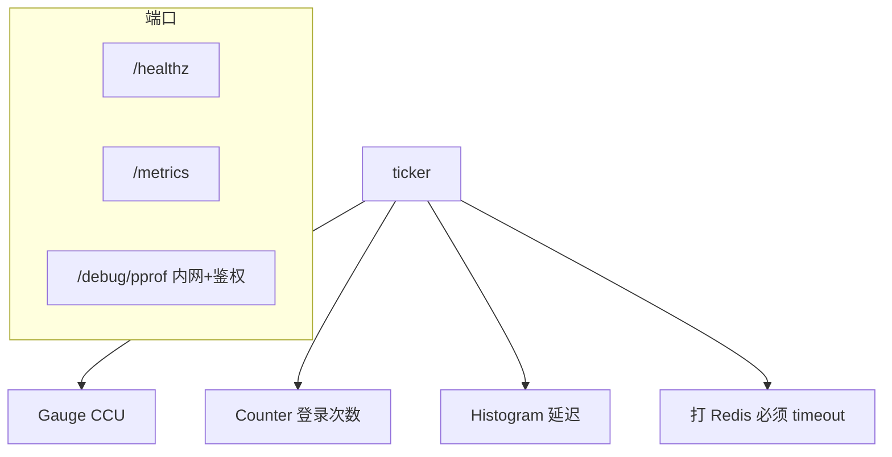
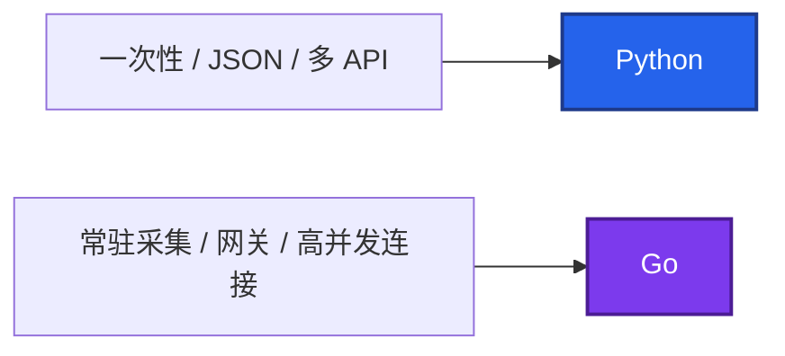
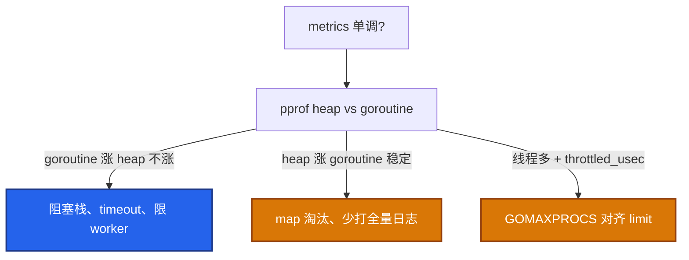

# 03｜Go 运维工具 · 练习题

先对照 [知识点](知识点.md) **面试怎么考** 和 **30 秒怎么说** 自己口述，再对答案。关键字（Gauge/Counter、pprof `debug=2`、context、`CGO_ENABLED=0`）要能点名。简历没写 Go：Q1 Q2 Q8 能答即可，**不要主动展开语法**。每题标了覆盖范围：

| 标记 | 含义 |
|------|------|
| **核心** | 不懂整章就没建立起来 |
| **必会** | 值班和面试都要能讲 |
| **常用** | 线上会反复碰到 |
| **常考** | 白板和追问的高频口径 |

## 本题目录

- [Q1 读 exporter / CCU](#q1)
- [Q2 goroutine 泄漏](#q2)
- [Q3 为何用 Go](#q3)
- [Q4 context / 信号](#q4)
- [Q5 RSS 分流](#q5)
- [Q6 高基数](#q6)
- [Q7 无界 go](#q7)
- [Q8 简历收口](#q8)
- [Q9 Operator 幂等](#q9)
- [Q10 交叉编译](#q10)
- [合上书](#合上书)

---

## Q1

**★★★★★｜读 Prometheus exporter 看什么？CCU 能不能用 Counter？**

**覆盖**：核心 · 必会 · 常考

**对应**：知识点 §3.2 · §3.5 · 生产模板

### 场景

游戏 exporter 把在线人数做成 Counter，活动结束 CCU 该降，图上还在涨。同时有人把 `user_id` 打进 Histogram label，Prometheus OOM。

### 完整解答

**一句话**：CCU 用 Gauge 不是 Counter；玩家 id 不能当 label，否则 Prometheus 高基数 OOM。

先画进程再点名指标：



1. CCU、队列深度用 **Gauge**，不是 Counter。
2. 登录次数用 Counter。
3. 延迟用 Histogram，桶按 SLA 毫秒级，别用默认秒。
4. label：`server_id`/`region` 可以；`user_id`/`order_id` 会打死 Prometheus。
5. HTTP `ReadHeaderTimeout`；scrape 过重放后台 ticker。

读代码顺序：main → ReadHeaderTimeout → ticker vs 现算 → 搜 `user_id` → 出站 timeout → SIGTERM Shutdown。

简历没写 Go 说到这里停。已经炸了：改代码丢 label，Prometheus 侧 drop，先止血。

### 再追问

采集失败时 Gauge 仍显示昨天的 CCU？——这是脏值。失败应标 invalid 或降为 0 并告警 scrape 失败，不能让值班以为人还在。

---

## Q2

**★★★★★｜goroutine 泄漏怎么查？和死锁差在哪？**

**覆盖**：核心 · 必会 · 常考

**对应**：知识点 §3.1 · pprof 命令

### 场景

大厅 Agent RSS 一周涨一倍。QPS 夜间已经下去，`go_goroutines` 不回落。有人要重启「先苟过活动」。

### 完整解答

**一句话**：goroutine 泄漏：流量降了 `go_goroutines` 不回落；用 pprof `debug=2` 看阻塞栈。

```bash
curl -s localhost:8080/metrics | grep -E 'go_goroutines|process_resident_memory'
curl -s localhost:6060/debug/pprof/goroutine?debug=2 | head -80
curl -s localhost:6060/debug/pprof/goroutine > goroutine.pb.gz
go tool pprof -http=:8081 goroutine.pb.gz
```

```text
go_goroutines 2847
...
goroutine 2847 [chan receive]:
runtime.gopark(...)
main.worker(...)
```

典型根因：

```go
ch := make(chan int)
go func() { ch <- 1 }()                    // 无人收 → 永久阻塞

ctx, cancel := context.WithTimeout(parent, 5*time.Second)
defer cancel()                             // 忘了就 timer 泄漏
req, _ := http.NewRequestWithContext(ctx, "GET", url, nil)
```

修：ctx、有界 queue、限制 worker。pprof 不要公网裸奔。死锁：功能卡住；泄漏：协程单调涨。都能 pprof。

### 再追问

重启能不能当修复？——能止血，不能当根因。活动中可以先重启保 CCU，活动后必须抓 pprof 再发版，否则下周还涨。

---

## Q3

**★★★★☆｜为什么运维组件常用 Go？和 Python 怎么选？**

**覆盖**：必会 · 常考

**对应**：知识点 · 能力边界

### 场景

对方问「你们巡检为什么不写成 Go」。简历只写了 Python 开服脚本。

### 完整解答

**一句话**：常驻 Agent/Exporter 用 Go 单二进制；一次性 JSON 编排用 Python。

| 场景 | 选 |
|------|-----|
| 7×24 Exporter / Agent / 网关 | Go |
| Cron 开服、多 API JSON、argparse | Python |
| 10 行 kubectl 管道 | Shell |

单二进制、goroutine 便宜、K8s/Prometheus 生态是 Go。没写 Go 就说边界，别背 slice。



Operator：Watch + 幂等 reconcile。有状态游戏服自动扩要非常谨慎。

### 再追问

并发 SSH 几千台呢？——更接近常驻或 CLI 池化，Go 合适（[04 实战题](../04-运维开发实战题/)）。50 台以内 Python 线程池也能做，关键是 timeout 和失败汇总。

---

## Q4

**★★★★☆｜context 在排障里的意义？为什么 `defer cancel()`？SIGTERM 怎么退？**

**覆盖**：必会 · 常用 · 常考

**对应**：知识点 §3.3 · 生产模板

### 场景

代码里 `context.WithTimeout` 没 cancel。跑几天后 goroutine 和 timer 慢慢涨。另一次 K8s 发 SIGTERM，Agent 还在打 Redis，探针失败被 SIGKILL。

### 完整解答

**一句话**：context 传超时并 `defer cancel()`；SIGTERM 走 `Shutdown` 宽限期再退出。

```go
ctx, cancel := context.WithTimeout(parent, 5*time.Second)
defer cancel()   // 文档要求；忘了 → timer/goroutine 泄漏

ctx, stop := signal.NotifyContext(context.Background(), syscall.SIGTERM, syscall.SIGINT)
defer stop()
go srv.ListenAndServe()
<-ctx.Done()
shctx, cancel := context.WithTimeout(context.Background(), 20*time.Second)
defer cancel()
_ = srv.Shutdown(shctx)   // 刷指标、等 in-flight；宽限期内返回
```

K8s SIGTERM → 停监听 → Shutdown → 宽限 **30s** 内返回 → 超时 SIGKILL。游戏 Agent 要刷完指标再走。

### 再追问

下游不认 ctx 怎么办？——至少本进程能停；选客户端时要能绑定 ctx。否则 SIGTERM 后仍打满下游，探针失败被杀得更难看。

---

## Q5

**★★★★☆｜RSS 涨的排查顺序？heap 和 goroutine 怎么分？**

**覆盖**：必会 · 常用

**对应**：知识点 §3.1 · §3.4 · 踩坑清单

### 场景

`process_resident_memory_bytes` 单调升。不知道是泄漏协程还是缓存 map。有人建议先看 `cpu.max`。

### 完整解答

**一句话**：RSS 涨先 pprof heap vs goroutine 分流；cgroup throttle 是另一套账。



```bash
curl -s localhost:8080/metrics | grep -E 'go_goroutines|process_resident_memory'
curl -s localhost:6060/debug/pprof/goroutine?debug=2 | head -80
curl -s localhost:6060/debug/pprof/heap > heap.pb.gz
```

**不要一上来 dump heap**。两边都在涨：先限 fan-out（goroutine），再查缓存。

### 再追问

预发怎么查竞态？——`go build -race`，不要当生产默认。老 cgroup 下 GOMAXPROCS 要对齐 cpu limit。

---

## Q6

**★★★★☆｜高基数为什么是事故？区服 id 能不能当 label？**

**覆盖**：必会 · 常用 · 常考

**对应**：知识点 §3.2

### 场景

有人把 `role_id` 打进登录延迟 Histogram。series 从万级到千万级，Prometheus 查询全超时，告警静默。

### 完整解答

**一句话**：高基数 label 会打爆 Prometheus；区服 id 可以，`user_id`/`order_id` 不行。

label 取值无限 → 时间序列爆炸 → Prometheus OOM，全站监控挂。这和会不会写 Go 无关，读 `/metrics` 就能审。

| label | 可否 | 原因 |
|-------|:----:|------|
| `server_id` / `region` | 可以 | 封闭集合 |
| `user_id` / `role_id` / `order_id` | 不行 | 无限基数 |

止血：drop 规则 + 改代码。先救 Prometheus，再发 exporter。已经进长期存储：停 scrape、drop、必要时放弃坏 series。

### 再追问

Counter 当 CCU 和高基数哪个更致命？——高基数更快打死 Prometheus；Counter 当 CCU 是语义错、图误导，也必改。

---

## Q7

**★★★★☆｜请求路径里 `go func()` 没有池，会怎样？**

**覆盖**：必会 · 常用

**对应**：知识点 §3.1 · errgroup

### 场景

每个登录请求 `go notify()` 打 webhook，活动高峰 goroutine 数万，下游飞书限流，登录 P99 跟着炸。

### 完整解答

**一句话**：无界 `go func()` 会 fan-out 雪崩；用有界 worker+queue，满了丢弃并打 `dropped_total`。

```go
// 错：每个请求 go f()  → goroutine ≈ QPS
// 对：N 个 worker 读 queue，上限明确，背压可见
jobs := make(chan Job, 1024)
for i := 0; i < 8; i++ {
    go worker(jobs)
}
select {
case jobs <- job:
default:
    dropped.Inc()   // 登录主路径不要等通知
}
```

批量打 API 用 `errgroup` + `SetLimit(10)`，不要几千 goroutine 同时出站。

### 再追问

queue 满了怎么办？——登录主路径不要等通知。丢弃并打指标，或改成同步但带 timeout。保核心协议。

---

## Q8

**★★★☆☆｜简历没写 Go，对方让你讲 channel 语法，怎么收口？**

**覆盖**：常考

**对应**：知识点 · 简历收口话术

### 场景

系统设计已经结束，对方突然问 `select` 和 nil channel。你生产只读过 exporter。

### 完整解答

**一句话**：简历没写 Go 就诚实收口到 pprof/metrics，不要现场编 channel 语法。

**收口话术**：

> 简历上 Go 是读 exporter 和 pprof 定位，不是写业务服务。生产问题我用 `go_goroutines` 和 pprof `debug=2` 判断泄漏还是下游超时，能给出 timeout / 限 worker / 改 label 三类方向，补丁找开发。你们 Agent 的 scrape 耗时和 goroutine 告警阈值我可以一起对齐。

不要现场编 `select`。把话题拉回告警阈值和 scrape SLO。

### 再追问

那简历为什么写「熟悉 Go」？——若只改过小工具，应写「脚本级」。写了「熟悉」被问语法是自己挖的坑，见 [01 简历](../../01-职业发展/02-简历与项目/)。

---

## Q9

**★★★☆☆｜Operator reconcile 里做了「只执行一次」的删数据，有什么风险？**

**覆盖**：常用 · 常考

**对应**：知识点 §3.5 · Operator 一句话

### 场景

自写 Operator 在 Reconcile 成功路径里删临时库。requeue 或重复交付后把不该删的删了。

### 完整解答

**一句话**：Operator reconcile 必须幂等；删数据/开服等副作用不能「只执行一次」无状态机。

调和循环：**Watch CR → Reconcile → 写集群 → 失败 requeue**。Watch 会再来，副作用（删数据、扣款、对玩家开服）必须可重入或有明确条件。

有状态游戏服自动扩：不要让 Operator 按 CPU 加战斗副本。Session 不在新 Pod 上。

和 Ansible 同一句话：**期望状态，重复执行结果一样**。Operator 是持续的 Ansible，不是一次性脚本。

### 再追问

没写过 Operator 面试怎么说？——会读 reconcile 在干什么即可；没写过别现场编 CRD 字段。说到幂等 + requeue 停。

---

## Q10

**★★★★☆｜交叉编译怎么编到 Linux？CGO 开着会怎样？**

**覆盖**：必会 · 常用

**对应**：知识点 · 交叉编译

### 场景

Mac 上 `go build` 出的 `hall_exporter` 丢到 CVM，`cannot execute binary file`。另一次带 CGO 的二进制在 Alpine 上报 glibc 找不到。

### 完整解答

**一句话**：交叉编译 `CGO_ENABLED=0 GOOS=linux GOARCH=amd64`；CGO=1 绑 glibc 目标机可能跑不起来。

```bash
CGO_ENABLED=0 GOOS=linux GOARCH=amd64 go build \
  -trimpath -ldflags="-s -w -X main.version=$(git describe --tags --always)" \
  -o hall_exporter .
file hall_exporter          # ELF 64-bit LSB, statically linked
go version -m hall_exporter
```

| 项 | 说明 |
|----|------|
| `CGO_ENABLED=0` | 纯 Go 静态链接，Alpine/CVM 可跑 |
| `GOOS=linux GOARCH=amd64` | 目标机，不是 Mac |
| `-ldflags="-s -w"` | 减体积；要符号的预发别剥 |
| `GOARCH=arm64` | Graviton / ARM 节点 |

预发 `-race` 不要当生产默认。

### 再追问

剥了符号还能 pprof 吗？——能抓 goroutine 文本栈（`debug=2`）；要完整符号的预发别 `-s -w`。线上二进制要用 `-X main.version=` 说清是哪次构建。

---

## 合上书

- [ ] 能说出 CCU=Gauge、登录=Counter、延迟=Histogram；玩家 id 不当 label
- [ ] 能用 `debug=2` 查泄漏；流量降了不回落才动手
- [ ] 能写 `defer cancel()` 和 SIGTERM `Shutdown` + `ReadHeaderTimeout`
- [ ] 能分 heap vs goroutine vs cgroup throttle；高基数先 drop
- [ ] 能交叉编译 `CGO_ENABLED=0 GOOS=linux GOARCH=amd64`
- [ ] 能按六步读 exporter；Operator 幂等一句话
- [ ] 简历无 Go：pprof + 指标到此为止，不背 channel
