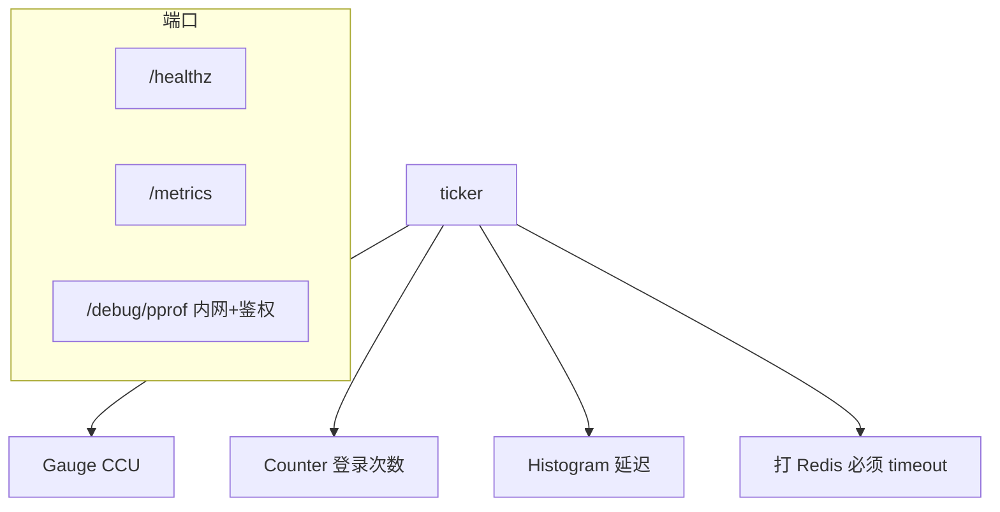
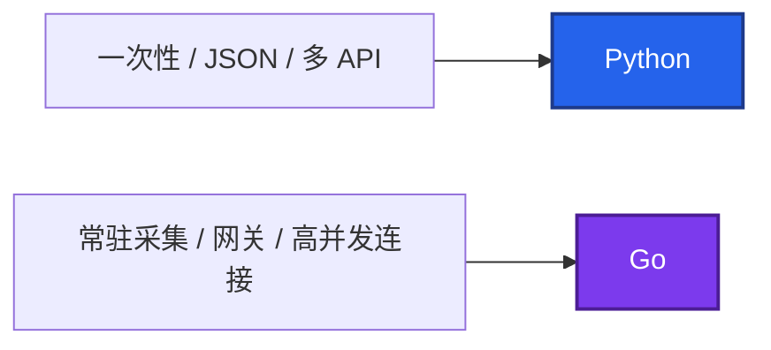
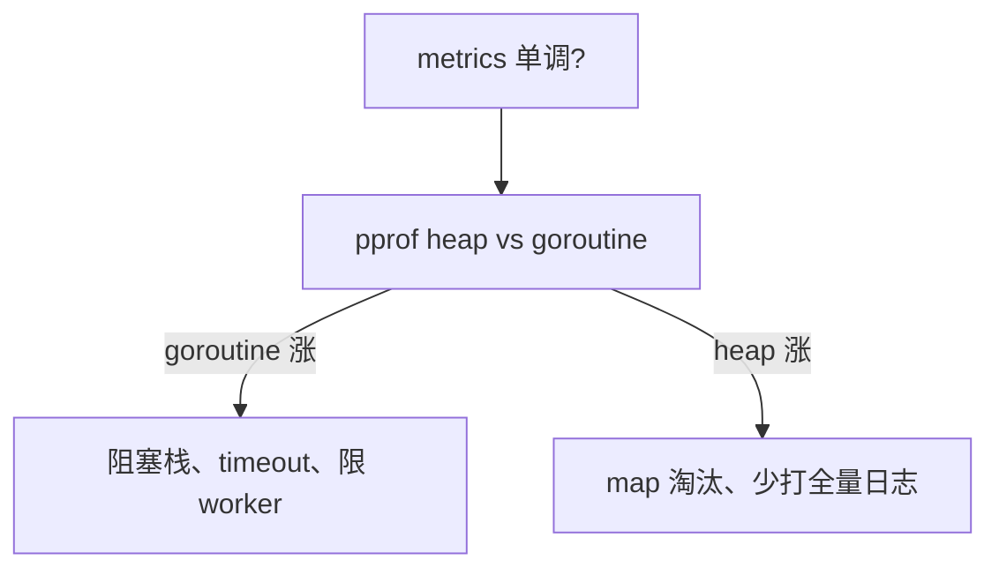

# 03｜Go 运维工具 · 练习题

先自己画图或口述，再对照解答。简历没写 Go：Q1 Q2 能答即可，不要主动展开语法。每题标了覆盖范围：

| 标记 | 含义 |
|------|------|
| **核心** | 不懂整章就没建立起来 |
| **必会** | 值班和面试都要能讲 |
| **常用** | 线上会反复碰到 |
| **常考** | 白板和追问的高频口径 |

## 本题目录

- [Q1 读 exporter / CCU](#q1)
- [Q2 goroutine 泄漏](#q2)
- [Q3 为何用 Go](#q3)
- [Q4 context / 信号](#q4)
- [Q5 RSS 分流](#q5)
- [Q6 高基数](#q6)
- [Q7 无界 go](#q7)
- [Q8 简历收口](#q8)
- [Q9 Operator 幂等](#q9)
- [Q10 交叉编译](#q10)
- [合上书](#合上书)

---

## Q1

**★★★★★｜读 Prometheus exporter 看什么？CCU 能不能用 Counter？**

**覆盖**：核心 · 必会 · 常考

### 场景

游戏 exporter 把在线人数做成 Counter，活动结束 CCU 该降，图上还在涨。同时有人把 `user_id` 打进 Histogram label，Prometheus OOM。

### 完整解答

先画进程再点名指标：



1. CCU、队列深度用 **Gauge**，不是 Counter。
2. 登录次数用 Counter。
3. 延迟用 Histogram，桶按 SLA 毫秒级，别用默认秒。
4. label：`server_id`/`region` 可以；`user_id`/`order_id` 会打死 Prometheus。
5. HTTP `ReadHeaderTimeout`；scrape 过重放后台 ticker。

简历没写 Go 说到这里停。已经炸了：改代码丢 label，Prometheus 侧 drop，先止血。

### 再追问

采集失败时 Gauge 仍显示昨天的 CCU？——这是脏值。失败应标 invalid 或降为 0 并告警 scrape 失败，不能让值班以为人还在。

---

## Q2

**★★★★★｜goroutine 泄漏怎么查？和死锁差在哪？**

**覆盖**：核心 · 必会 · 常考

### 场景

大厅 Agent RSS 一周涨一倍。QPS 夜间已经下去，`go_goroutines` 不回落。有人要重启「先苟过活动」。

### 完整解答

pprof goroutine，数量只上不下。流量降了不回落才是泄漏。栈多卡在 channel / 没 ctx 的 IO。

```bash
curl -s localhost:6060/debug/pprof/goroutine?debug=2 | head -80
curl -s localhost:6060/debug/pprof/goroutine > goroutine.pb.gz
go tool pprof -http=:8081 goroutine.pb.gz
```

```go
ch := make(chan int)
go func() { ch <- 1 }()                    // 无人收 → 永久阻塞

ctx, cancel := context.WithTimeout(parent, 5*time.Second)
defer cancel()                             // 忘了就 timer 泄漏
req, _ := http.NewRequestWithContext(ctx, "GET", url, nil)
```

修：ctx、有界队列、限制 worker。pprof 不要公网裸奔。死锁：功能卡住；泄漏：协程单调涨。都能 pprof。

### 再追问

重启能不能当修复？——能止血，不能当根因。活动中可以先重启保 CCU，活动后必须抓 pprof 再发版，否则下周还涨。

---

## Q3

**★★★★☆｜为什么运维组件常用 Go？和 Python 怎么选？**

**覆盖**：必会 · 常考

### 场景

对方问「你们巡检为什么不写成 Go」。简历只写了 Python 开服脚本。

### 完整解答

单二进制、并发、K8s/Prometheus 生态。胶水脚本 Python；常驻 Agent/Exporter Go。没写 Go 就说边界，别背 slice。



Operator：Watch + 幂等 reconcile。有状态游戏服自动扩要非常谨慎。不会写 Operator：会读循环在干什么即可。

### 再追问

并发 SSH 几千台呢？——这类更接近常驻或 CLI 池化，Go 合适（04 实战题）。50 台以内 Python 线程池也能做，关键是超时和失败汇总。

---

## Q4

**★★★★☆｜context 在排障里的意义？为什么 `defer cancel()`？SIGTERM 怎么退？**

**覆盖**：必会 · 常用 · 常考

### 场景

代码里 `context.WithTimeout` 没 cancel。跑几天后 goroutine 和 timer 慢慢涨。另一次 K8s 发 SIGTERM，Agent 还在打 Redis，探针失败被 SIGKILL。

### 完整解答

把超时取消传给下游 HTTP。忘了 cancel 会 timer/goroutine 泄漏。文档要求 `defer cancel()`。

```go
ctx, stop := signal.NotifyContext(context.Background(), syscall.SIGTERM, syscall.SIGINT)
defer stop()
go srv.ListenAndServe()
<-ctx.Done()
shctx, cancel := context.WithTimeout(context.Background(), 20*time.Second)
defer cancel()
_ = srv.Shutdown(shctx)   // 刷指标、等 in-flight；宽限期内返回
```

K8s SIGTERM → Shutdown 宽限期。游戏 Agent 要刷完指标再走。先 SIGTERM 再 SIGKILL。

### 再追问

下游不认 ctx 怎么办？——至少本进程能停；选客户端时要能绑定 ctx。否则 SIGTERM 后仍打满下游，探针失败被杀得更难看。

---

## Q5

**★★★★☆｜RSS 涨的排查顺序？heap 和 goroutine 怎么分？**

**覆盖**：必会 · 常用

### 场景

`process_resident_memory_bytes` 单调升。不知道是泄漏协程还是缓存 map。

### 完整解答



```bash
curl -s localhost:8080/metrics | grep -E 'go_goroutines|process_resident_memory'
curl -s localhost:6060/debug/pprof/goroutine?debug=2 | head -80
```

预发可用 race 构建。cgroup 下老版本 `GOMAXPROCS` 要对齐 limit。

### 再追问

两边都在涨？——先限 fan-out（goroutine），再查缓存。同时抓两份 pprof，不要只重启。

---

## Q6

**★★★★☆｜高基数为什么是事故？区服 id 能不能当 label？**

**覆盖**：必会 · 常用 · 常考

### 场景

有人把 `role_id` 打进登录延迟 Histogram。series 从万级到千万级，Prometheus 查询全超时，告警静默。

### 完整解答

label 取值无限 → 时间序列爆炸 → Prometheus OOM，全站监控挂。区服 id 可以（封闭集合），user_id/order_id 不行。这和会不会写 Go 无关，读 `/metrics` 就能审。

止血：drop 规则 + 改代码。先救 Prometheus，再发 exporter。

### 再追问

已经进了长期存储怎么办？——停 scrape、drop、必要时放弃这批坏 series。不要靠「再加机器」硬扛高基数。

---

## Q7

**★★★★☆｜请求路径里 `go func()` 没有池，会怎样？**

**覆盖**：必会 · 常用

### 场景

每个登录请求 `go notify()` 打 webhook，活动高峰 goroutine 数万，下游飞书限流，登录 P99 跟着炸。

### 完整解答

无界 fan-out：泄漏和雪崩一起到。用有界 worker + 有界 queue，满了丢弃或同步失败，不要无限 `go`。

```go
// 错：每个请求 go f()  → goroutine ≈ QPS
// 对：N 个 worker 读 queue，上限明确，背压可见
jobs := make(chan Job, 1024)
for i := 0; i < 8; i++ {
    go worker(jobs)
}
select {
case jobs <- job:
default:
    dropped.Inc()   // 登录主路径不要等通知
}
```

### 再追问

queue 满了怎么办？——登录主路径不要等通知。丢弃并打指标 `dropped_total`，或改成同步但带 timeout。保核心协议。

---

## Q8

**★★★☆☆｜简历没写 Go，对方让你讲 channel 语法，怎么收口？**

**覆盖**：常考

### 场景

系统设计已经结束，对方突然问 `select` 和 nil channel。你生产只读过 exporter。

### 完整解答

诚实：生产问题我用 pprof/metrics 定位，改代码找开发。我能判断是泄漏还是下游超时，能读 `debug=2` 栈上的函数名。不要现场编语法。

把话题拉回：你们 Agent 的 `go_goroutines` 和 scrape 耗时我怎么设告警。

### 再追问

那简历为什么写「熟悉 Go」？——若只改过小工具，应写「脚本级」。写了「熟悉」被问语法是自己挖的坑，见 01 简历章。

---

## Q9

**★★★☆☆｜Operator reconcile 里做了「只执行一次」的删数据，有什么风险？**

**覆盖**：常用 · 常考

### 场景

自写 Operator 在 Reconcile 成功路径里删临时库。requeue 或重复交付后把不该删的删了。

### 完整解答

调和循环必须幂等。失败会 requeue，Watch 会再来。副作用（删数据、扣款、对玩家开服）必须可重入或有明确条件，不能「只执行一次」却没有状态机。

有状态游戏服自动扩：不要让 Operator 按 CPU 加战斗副本。扩容边界见 08、01 系统设计。

### 再追问

和 Ansible 同一句话是什么？——期望状态，重复执行结果一样。Operator 是持续的 Ansible，不是一次性脚本。

---

## Q10

**★★★★☆｜交叉编译怎么编到 Linux？CGO 开着会怎样？**

**覆盖**：必会 · 常用

### 场景

Mac 上 `go build` 出的 `hall_exporter` 丢到 CVM，`cannot execute binary file`。另一次带 CGO 的二进制在 Alpine 上报 glibc 找不到。

### 完整解答

交叉编译三件套：`CGO_ENABLED=0 GOOS=linux GOARCH=amd64`。纯 Go 不需要交叉工具链。生产可加 `-trimpath -ldflags="-s -w"`。ARM / Graviton 用 `GOARCH=arm64`。

```bash
CGO_ENABLED=0 GOOS=linux GOARCH=amd64 go build -trimpath -ldflags="-s -w" -o hall_exporter .
file hall_exporter          # ELF 64-bit LSB
go version -m hall_exporter
```

`CGO_ENABLED=1` 绑 glibc，目标机 libc 不同就跑不起来。纯 exporter 保持 0。预发 `-race` 不要当生产默认。

### 再追问

剥了符号还能 pprof 吗？——能抓 goroutine 文本栈；要完整符号的预发别 `-s -w`。线上二进制要用 `-X main.version=` 说清是哪次构建。

---

## 合上书

- [ ] 能说出 CCU=Gauge、登录=Counter、延迟=Histogram；玩家 id 不当 label
- [ ] 能用 `debug=2` 查泄漏；流量降了不回落才动手
- [ ] 能写 `defer cancel()` 和 SIGTERM `Shutdown`
- [ ] 能分 heap vs goroutine；高基数先 drop
- [ ] 能交叉编译 `CGO_ENABLED=0 GOOS=linux GOARCH=amd64`
- [ ] 简历无 Go：pprof + 指标到此为止，不背 channel
