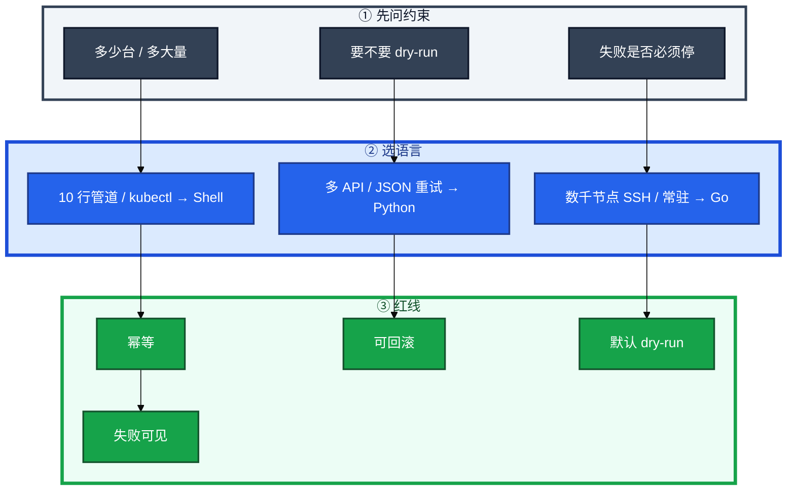
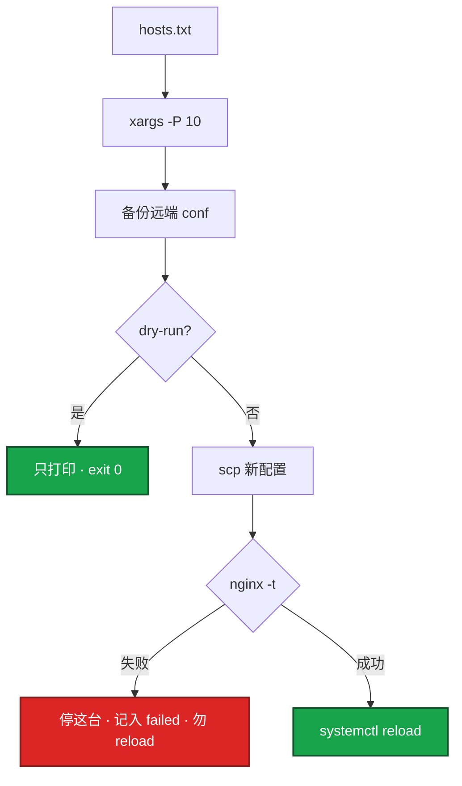
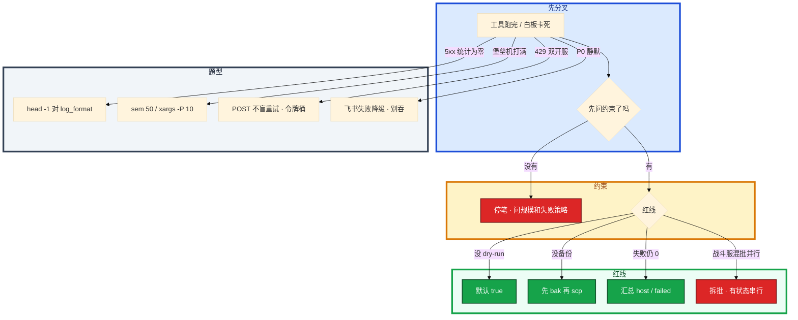

# 运维开发实战题


白板：「活动前改 100 台网关 Nginx 超时，写一个能进生产的工具。」有人一上来写 80 行完美 bash。第 50 台 `nginx -t` 会失败。另一次登录 502，有人 `cat access.log | grep 502 | wc` 把跳板机打满。考官看的不是语法，是：能不能问规模、会不会把失败当成功、有没有 dry-run 和回滚。

先别动手。这一章后半全是你会动手的：**批量改配置、抠 5xx、巡检集群、并发 SSH、限流、告警——每题完整解法。** 前面的概念，是为了让你动手时先问约束再选语言。

**读完你能：** 白板上先问约束再画骨架；四条红线一口回；六类题能写出可进生产的关键代码，而不是完美语法。

## 本章目录

缩进 = 上下级。3 下面才是 3.1。

想钉在**正文左边**跟着滚：菜单 **查看 → 打开视图 → 大纲**。Markdown 预览做不到独立左栏，目录只能写在文章开头。

- [1. 基本概念](#1-基本概念)
- [2. 架构图](#2-架构图)
- [3. 原理](#3-原理)
- [4. 落地：怎么写、怎么跑](#4-落地怎么写怎么跑)
- [5. 关键写法与坑](#5-关键写法与坑)
- [6. 常用命令 / 库](#6-常用命令--库)
- [7. 常用操作](#7-常用操作)
  - [7.1 批量部署 Nginx](#71-批量部署-nginx-配置)
  - [7.2 5xx Top IP](#72-nginx-日志-5xx-top-ip)
  - [7.3 K8s 巡检](#73-k8s-资源巡检)
  - [7.4 并发 SSH](#74-并发-ssh三千节点)
  - [7.5 令牌桶](#75-令牌桶开服-api)
  - [7.6 飞书告警](#76-飞书告警发送失败必须降级)
- [8. 生产排障](#8-生产排障)
- [9. 必会 · 常考](#9-必会--常考)
- [合上书](#合上书问自己)

**本章不讲：** `set -euo`、trap、引号 → [01 Shell](../01-Shell/)；argparse、HTTP timeout、线程池 → [02 Python](../02-Python运维/)；pprof、exporter 指标 → [03 Go](../03-Go运维工具/)；awk 列号、正则、jq → [05](../05-正则与文本处理/)；Ansible 批量 OS → [05-工程化 04](../../05-工程化与自动化/04-Ansible/)；开服五段门禁 → [08-游戏 02](../../08-游戏运维专题/02-开服合服/)、[01 系统设计](../../01-职业发展/03-系统设计/)。语言细节在 01/02/03/05。GitOps 流水线在 05-工程化。

---

## 1. 基本概念

白板或线上让你「写一个能进生产的工具」——考的是工程素养不是语法。白板上写出骨架 + 讲清取舍就够。评分：能跑通 + 异常处理 + 可维护 + 有测试意识（至少能讲怎么测）。

生产红线四条：**幂等、可回滚、默认 dry-run、日志可追溯。**

| 场景 | 推荐 | 核心考点 |
|------|------|----------|
| 批量部署/配置推送 | Shell 或 Ansible | 幂等、dry-run、备份回滚 |
| 日志解析统计 | Shell 简单 / Python 复杂 | awk、时间窗口、坏行 |
| K8s 资源巡检 | Python | JSON、分级、可扩展 |
| 批量 SSH | Go（大规模）/ Python（中小） | 并发上限、超时、汇总 |
| 限流 | Python/Go | 令牌桶、突发 vs 匀速 |
| 监控聚合 / 飞书告警 | Python | PromQL、重试、降级 |

三个角色不要混：

| 角色 | 干什么 |
|------|--------|
| **你（白板）** | 先问约束，再选语言，再写骨架 |
| **脚本** | 超时、失败汇总、退出码、dry-run |
| **考官** | 看第 50 台失败你怎么办，不看函数名背没背 |

> **记住**：卡住时一上来写 80 行完美 bash——对方要的是约束和红线。先问「100 台失败第 50 台怎么办」，再动笔。语言不熟就换你熟的，并说清取舍。编造没用过的 API 下一问就穿。

---

## 2. 架构图

先把整张图钉住。后面六类题都对着这张图选路。



白板 20 分钟路径：


网关可以有限并行；战斗服不要和网关混批。有状态进程会集体踢人，滚动纪律见 01 Shell。

---

## 3. 原理

原理只保留动手和面试会用到的：为什么四条红线缺一不可、并行为什么不是事务、限流为什么不是「加锁」。

**本节 3 块：** 红线 · 失败域 · 限流

1. **幂等**：同一文件多次 scp 再 reload，结果一样。开服 POST 默认不幂等——盲重试会双开目录。
2. **可回滚**：第 N 台失败不是事务。已变更的用 bak 回滚，未执行的保持旧配置。没有备份 = 没有回滚。
3. **默认 dry-run**：没传参就真 reload 了是事故。第一次必须打印将 scp / reload 的动作。
4. **失败可见**：`xargs -P`、线程池、goroutine 都可能把子失败吞成 0。CI 只看退出码。

令牌桶允许突发（桶满可瞬间消费）；漏桶严格匀速。开服这种「活动前一波」用令牌桶更合适——允许短突发，但平均速率封顶。跨多 worker / 多机：单机锁不够，用 Redis+Lua 或现成框架。拒绝时：开服脚本记入 failed 或排队等下一枚令牌，不要盲着重试把网关再打一次。

告警风暴在 Alertmanager 做 grouping/inhibit，不在发送脚本里发明一套。发送脚本只保证「这条能出去或可审计失败」。

> **记住**：并行不是事务。第 50 台失败时前 49 台已经接新超时值——看变更单要不要全部回滚，关键是失败可见、有 bak。

---

## 4. 落地：怎么写、怎么跑

面试完整解法五步，六类题都套这套，不要一上来写完美代码。

1. **问约束**：多少台？多大量？要不要 dry-run？失败是否必须停全集群？回滚 RTO？同一角色还是混批？
2. **选语言**：简单编排 → Shell；JSON/API/重试 → Python；大规模并发常驻 → Go。
3. **写骨架**：参数、超时、失败汇总、退出码、默认 dry-run。
4. **加红线**：幂等、可回滚、日志可追溯。
5. **说取舍**：为什么不用另一方案；怎么测（空 hosts、nginx -t 失败、一台 hung、429）。

怎么跑验收：

| 题 | 先怎么跑 | 失败用例 |
|----|----------|----------|
| 批量 Nginx | `DRY_RUN=true` 先打印 | 第 50 台 `-t` 失败；hosts 空 |
| 5xx Top IP | `head -1` 对列 | 10GB；列号错；JSON 行 |
| K8s 巡检 | `kubectl -o json` | P1 必须非 0；文本表格列宽变化 |
| 并发 SSH | `-P 10` / sem 50 | 一台防火墙丢包；InsecureIgnoreHostKey |
| 令牌桶 | 单测 allow/拒绝 | 429 后盲重试同一 server_id |
| 飞书 | timeout=5 失败降级 | 风暴在 Alertmanager 不在脚本 |

对方坚持要 Go 而你简历没写：用 Python 把并发模型讲完，对照说 Go 会用 worker pool + WaitGroup 同一结构。不要现场从零编 SSH 库细节。见 03。

---

## 5. 关键写法与坑

| 坑 | 正确做法 |
|----|----------|
| `for h in $(cat hosts)` | `while read` / `xargs -P`；`$(cat)` 会分词 |
| `DRY_RUN` 默认 false | 默认 true |
| `nginx -t` 失败仍 reload | `-t` 通过才 reload |
| `xargs -P` 子失败脚本仍 0 | 失败文件 / 记 host，最后非 0 |
| `cat log \| grep` 打满内存 | 先过滤再 sort；不要 `read()` 全文件 |
| `kubectl get` 文本表格 | `-o json` |
| 巡检 cluster-admin | get/list |
| SSH 无 Timeout | Dial 10s；一台 hung 整次不结束 |
| 生产 `InsecureIgnoreHostKey` | known_hosts；应急写进变更记录 |
| 令牌桶用线程锁做分布式 | Redis+Lua |
| 飞书超时 30s | 5s；堵住 on-call 发送队列 |
| 扫描 CVE `\|\| true` | 非 0 则停，不推 `:prod` |
| 对账直接 `stop + release` | 只读凭证；写另开审批 |

`xargs -P 10` 是批量 Shell 的默认并发：短、有界。它 **不会** 把子进程失败变成自己的非 0，函数里必须记失败。`ssh` 会吃 stdin，用 `ssh -n` 或 `xargs -a`。

---

## 6. 常用命令 / 库

| 目的 | 命令 / 库 |
|------|-----------|
| 有界并发 | `xargs -P 10 -I {} bash -c 'deploy_host {}'` |
| 5xx Top IP | `awk '$9 ~ /^5/ {count[$1]++} END {...}'` |
| JSON 行 | `jq -r 'select(.status >= 500) \| .client_ip'` |
| K8s | `kubectl get ... -o json` + Python |
| SSH | `golang.org/x/crypto/ssh` 或 Paramiko；Timeout 必设 |
| 限流 | 内存令牌桶 / Redis+Lua |
| 告警 | `requests.post(..., timeout=5)` |
| 门禁 | Prom instant query + canary label |

值班四条（工具「跑完了」但环境半残）：

```bash
echo "dry-run=$DRY_RUN"          # 默认必须 true
ls /etc/nginx/nginx.conf.bak.*   # 有没有备份
# 失败列表在不在；退出码是不是 0
```

---

## 7. 常用操作

### 7.1 批量部署 Nginx 配置

场景：100 台节点更新配置并 reload。要求幂等、可回滚、默认 dry-run。游戏活动前改网关超时，做错会把登录切死。



```bash
#!/usr/bin/env bash
set -euo pipefail

HOSTS_FILE="hosts.txt"
CONFIG_SRC="./nginx.conf"
CONFIG_DST="/etc/nginx/nginx.conf"
SERVICE="nginx"
DRY_RUN="${1:-true}"   # 默认 dry-run

[[ -f "$HOSTS_FILE" ]] || { echo "hosts.txt not found" >&2; exit 1; }
[[ -f "$CONFIG_SRC" ]] || { echo "config not found" >&2; exit 1; }

backup_remote() {
  local host=$1
  ssh -n "$host" "cp $CONFIG_DST $CONFIG_DST.bak.\$(date +%Y%m%d%H%M%S) 2>/dev/null || true"
}

deploy_host() {
  local host=$1
  echo "[$host] deploying..." >&2
  backup_remote "$host"

  if [[ "$DRY_RUN" == "true" ]]; then
    echo "[$host] DRY-RUN: scp $CONFIG_SRC -> $CONFIG_DST" >&2
    echo "[$host] DRY-RUN: nginx -t && systemctl reload $SERVICE" >&2
    return 0
  fi

  scp -q "$CONFIG_SRC" "$host:$CONFIG_DST"
  ssh -n "$host" "nginx -t && systemctl reload $SERVICE"
  echo "[$host] done" >&2
}

export -f backup_remote deploy_host
export CONFIG_SRC CONFIG_DST SERVICE DRY_RUN
xargs -P 10 -I {} bash -c 'deploy_host {}' < "$HOSTS_FILE"
```

评分点：`set -euo pipefail`；dry-run 默认开；备份；先 `nginx -t`；`-P 10`；重复 scp 同一文件幂等。Ansible 等价：copy + validate + reload，天然幂等。战斗服节点和网关同一批并行 reload → 有状态进程会集体踢人。

第 50 台失败时前 49 台已经接新超时值：若必须配置一致，对已成功的 49 台跑回滚 job。若新配置本身正确、只是第 50 台磁盘满，修第 50 台再重入即可。

回滚：`scp bak` 回去再 `nginx -t && reload`。

### 7.2 Nginx 日志：5xx Top IP

场景：access.log 找 5xx 最多的 Top-10 IP。活动登录 502，要分是个别 IP 扫、还是某条 URL 全挂。先 `head -1` 对 `log_format`，列号不对统计就是零。

Shell（列号以 combined 为准，`$1` IP，`$9` 状态）：

```bash
awk '$9 ~ /^5/ {print $1}' access.log | sort | uniq -c | sort -rn | head -10

awk '$9 ~ /^5/ {count[$1]++} END {for (ip in count) print count[ip], ip}' access.log \
  | sort -rn | head -10
```

Python（时间窗口、URL 聚合、坏行跳过）：

```python
#!/usr/bin/env python3
import sys
from collections import defaultdict
from datetime import datetime

def parse_log(path, start_time=None, end_time=None):
    ip_errors = defaultdict(lambda: {"count": 0, "urls": defaultdict(int)})
    with open(path) as f:
        for line in f:
            parts = line.split()
            if len(parts) < 9:
                continue
            ip, status = parts[0], parts[8]
            if not status.startswith("5"):
                continue
            time_str = parts[3].strip("[]")
            try:
                log_time = datetime.strptime(time_str, "%d/%b/%Y:%H:%M:%S")
            except ValueError:
                continue
            if start_time and log_time < start_time: continue
            if end_time and log_time > end_time: continue
            url = parts[6] if len(parts) > 6 else "-"
            ip_errors[ip]["count"] += 1
            ip_errors[ip]["urls"][url] += 1

    ranked = sorted(ip_errors.items(), key=lambda x: -x[1]["count"])
    for ip, data in ranked[:10]:
        print(f"{ip}: {data['count']} errors")
        for url, cnt in sorted(data["urls"].items(), key=lambda x: -x[1])[:3]:
            print(f"  {url}: {cnt}")

if __name__ == "__main__":
    parse_log(sys.argv[1] if len(sys.argv) > 1 else "access.log")
```

你看到什么：Top IP 集中且 URL 杂 → 扫号；URL 集中在 `/login`、IP 分散 → 上游大厅挂。10GB：awk/Python 逐行，不要 `read()` 全文件。先 `grep` 缩小。经常查的进 Loki/ES。JSON 行：`jq -r 'select(.status >= 500) | .client_ip'` 再 sort|uniq，不要用 awk 硬拆 JSON。列号不对先对格式，见 05。

### 7.3 K8s 资源巡检

场景：找出没设 resources 的 Pod、没配 readiness 的 Deploy、PVC Pending、节点 NotReady。游戏战斗服没 probes 会误杀，没 requests 会和大厅抢 CPU。用 `kubectl -o json`，不要 scrape 文本表格。

步骤：每类检查一个函数；JSON 解析；分级输出；加检查只加函数。持续 Watch 再用 client-go/informer，一次性巡检 `kubectl -o json` 够用。

```python
#!/usr/bin/env python3
import json
import subprocess
from dataclasses import dataclass

@dataclass
class Issue:
    severity: str
    resource: str
    message: str

def kubectl_json(cmd):
    result = subprocess.run(
        ["kubectl"] + cmd + ["-o", "json"],
        capture_output=True, text=True, timeout=60,
    )
    if result.returncode != 0:
        print(f"ERROR: {result.stderr}")
        return {"items": []}
    return json.loads(result.stdout)

def check_pod_resources():
    issues = []
    data = kubectl_json(["get", "pods", "-A"])
    for pod in data.get("items", []):
        ns = pod["metadata"]["namespace"]
        name = pod["metadata"]["name"]
        for c in pod["spec"].get("containers", []):
            res = c.get("resources", {})
            if not res.get("requests"):
                issues.append(Issue("P2", f"{ns}/pod/{name}/{c['name']}", "no resources.requests"))
            if not res.get("limits"):
                issues.append(Issue("P3", f"{ns}/pod/{name}/{c['name']}", "no resources.limits"))
    return issues

def check_deployment_readiness():
    issues = []
    data = kubectl_json(["get", "deploy", "-A"])
    for dep in data.get("items", []):
        ns = dep["metadata"]["namespace"]
        name = dep["metadata"]["name"]
        for c in dep["spec"]["template"]["spec"].get("containers", []):
            if "readinessProbe" not in c:
                issues.append(Issue("P1", f"{ns}/deploy/{name}/{c['name']}", "no readinessProbe"))
    return issues

def check_nodes():
    issues = []
    data = kubectl_json(["get", "nodes"])
    for node in data.get("items", []):
        name = node["metadata"]["name"]
        for cond in node["status"].get("conditions", []):
            if cond["type"] == "Ready" and cond["status"] != "True":
                issues.append(Issue("P1", f"node/{name}", "NotReady"))
    return issues

def check_pvc_pending():
    issues = []
    data = kubectl_json(["get", "pvc", "-A"])
    for pvc in data.get("items", []):
        ns = pvc["metadata"]["namespace"]
        name = pvc["metadata"]["name"]
        if pvc["status"].get("phase") == "Pending":
            issues.append(Issue("P2", f"{ns}/pvc/{name}", "Pending"))
    return issues

def main():
    all_issues = []
    all_issues.extend(check_pod_resources())
    all_issues.extend(check_deployment_readiness())
    all_issues.extend(check_nodes())
    all_issues.extend(check_pvc_pending())
    order = {"P1": 0, "P2": 1, "P3": 2}
    all_issues.sort(key=lambda x: order.get(x.severity, 9))
    for issue in all_issues:
        print(f"[{issue.severity}] {issue.resource}: {issue.message}")
    print(f"\nTotal: {len(all_issues)} issues")
    if any(i.severity == "P1" for i in all_issues):
        raise SystemExit(1)

if __name__ == "__main__":
    main()
```

战斗服 liveness 乱配会集体重启，巡检可以报「有状态负载用了过激 liveness」，不要只套 Web 标准。输出 JSON 给监控平台消费更好。P1 非 0 退出才能进 CI 门禁。不要 cluster-admin。`kubectl get` 文本解析在列宽变化时会炸——必须 `-o json`。

### 7.4 并发 SSH：三千节点

场景：三千游戏节点跑同一条巡检命令（磁盘、进程、配置版本）。Python 线程池中小规模够用；数千节点 Go 更合适：goroutine 池、连接超时、一台失败不影响其他。完整骨架见本章练习题 Q4。

系统里发生的：主 goroutine 读 hosts，往容量 50 的 channel 放令牌；每个 host 一个 worker，`Dial` 10s 超时，跑命令，结果写回 channel。`WaitGroup` 等完再 close results。慢主机靠 Timeout / context，不要无限等。

1. **堡垒机 CPU 打满、SSH 握手失败一片** → 并发没上限。把 sem 降到 50，不要 3000 路一起 Dial。
2. **某台 hung 住，整次巡检不结束** → 没 `ClientConfig.Timeout`。10s 必须有。
3. **失败 20 台，退出码仍是 0** → 主循环没汇总 Failed。CI 当成功。
4. **生产长期 `InsecureIgnoreHostKey`** → 停。验证 HostKey；密钥认证不写密码。
5. **goroutine 泄漏** → 所有 worker 必须 `Done`；WaitGroup 和 sem 要配对。

### 7.5 令牌桶：开服 API

场景：`open_server.py` 调开服平台，50 服并发把网关 429 打穿。白板让你写限流。

```python
import time
import threading

class TokenBucket:
    def __init__(self, capacity, refill_rate):
        self.capacity = capacity
        self.refill_rate = refill_rate
        self.tokens = capacity
        self.last_refill = time.monotonic()
        self.lock = threading.Lock()

    def allow(self):
        with self.lock:
            now = time.monotonic()
            elapsed = now - self.last_refill
            self.tokens = min(self.capacity, self.tokens + elapsed * self.refill_rate)
            self.last_refill = now
            if self.tokens >= 1:
                self.tokens -= 1
                return True
            return False
```

1. 问约束：QPS 上限？是否允许突发？单机还是跨进程？
2. 单机：内存令牌桶。`allow()` 先按时间补令牌，有则减 1。
3. 跨多 worker / 多机：单机锁不够。用 Redis+Lua 或现成框架。
4. 拒绝时：开服脚本记入 failed 或排队等下一枚令牌。429 之后立刻重试同一 `server_id`：开服 POST 非幂等。应查询是否已创建，或用幂等键。盲重试会双写。见 02 HTTP。

巡检打网关同样套这个，失败率高就停（熔断），避免巡检变成 DDoS。

### 7.6 飞书告警：发送失败必须降级

场景：P0 登录跌破 SLO，Alertmanager 已经分好组，脚本只负责 POST 飞书 webhook。

```python
def send_feishu_alert(webhook, title, content, severity="P1"):
    payload = {
        "msg_type": "interactive",
        "card": {
            "header": {"title": {"tag": "plain_text", "content": f"[{severity}] {title}"}},
            "elements": [{"tag": "div", "text": {"tag": "lark_md", "content": content}}],
        },
    }
    for attempt in range(3):
        try:
            r = requests.post(webhook, json=payload, timeout=5)
            r.raise_for_status()
            return True
        except Exception:
            if attempt < 2:
                time.sleep(2 ** attempt)
            else:
                log.exception("feishu send failed")
                return False
```

飞书 5s 超时、重试 3 次（1s、2s 退避），仍失败打本地日志 + 降级邮件/短信，事后补发。卡住：脚本里自己做去重和抑制——那是 Alertmanager 的活。超时设 30s 把 on-call 发送队列堵住——必须 5s。失败吞掉当成功——P0 没人收到。P0 和 P3 最好分开 webhook 或卡片带 severity，电话升级只绑 P0。

从 Prometheus 拉登录错误率接发布门禁：PromQL 带 canary label，对比发布前 5min。HTTP timeout，失败当门禁失败（不要当「没数据就放行」）。超阈值调回滚 webhook，`exit 1`。阈值做成参数。Prom 自己挂了：预发可以人工豁免并记录；生产默认失败。

CI 质量门禁：构建 → 扫描 → 测试 → 打不可变 tag。扫描非 0 则停，不推 `:prod`。豁免必须单独审批参数，打进日志，默认关闭。`latest` 禁止当生产 tag。扫描偶发超时：重试有上限；仍超时当失败。不要超时当成功。这是 Shell/Python 在流水线的位置，不是另写 CD。

对账 CMDB 和云上 ECS：只读凭证拉云 API（分页+限流）；输出 diff；写操作另开 job，人工审批，dry-run 默认。游戏备用机、数据盘要有保护标签。脚本能列出不等于能删。误释放有状态服是 P0。CMDB 滞后一天：对账结果当线索不是处决令。先标「待确认」，TTL 后再走审批。

---

## 8. 生产排障

三问：工具退出码？失败列表在哪？已变更的机器有没有 bak？

**「跑完了」≠ 100 台都对。** 并行、xargs、线程池都能吞失败。



| 现象 | 先做什么 | 不要做什么 |
|------|----------|------------|
| 第 50 台 `-t` 失败 | 失败列表 + bak 回滚策略 | 假装 100 台是事务 |
| 跳板机被 sort 打满 | 先 grep 5xx | `cat \| grep` |
| NotReady 没被发现 | `-o json` + P1 exit 1 | 肉眼扫宽表 |
| 一台防火墙丢包巡检不结束 | Dial Timeout 10s | 无限等 |
| 开服 429 双创建 | 令牌桶 + 幂等查询 | 立刻重试同一 id |
| 飞书挂了群里静默 | 降级邮件 + 本地日志 | 发送层做全集群去重 |
| 扫描 critical 仍推 prod | 门禁非 0 停 | `\|\| true` |
| 对账多 3 台无主机器 | 只读 + 审批 | 脚本直接 release |

---

## 9. 必会 · 常考

白板和追问高频，能一口回：

| 说法 | 对错 | 口径 |
|------|:----:|------|
| 先写完美代码再讲步骤 | 错 | 先约束和红线 |
| 没传参就可以真 reload | 错 | dry-run 默认 true |
| 第 50 台失败等于 100 台回滚 | 错 | 不是事务；看变更单 |
| `xargs -P` 子失败脚本一定非 0 | 错 | 要自己汇总 |
| `kubectl get` 文本可以当巡检输入 | 错 | `-o json` |
| 巡检用 cluster-admin | 错 | get/list |
| 令牌桶和漏桶一样 | 错 | 突发 vs 匀速 |
| 单机 threading.Lock 够分布式 | 错 | Redis+Lua |
| 告警去重写在发送脚本里 | 错 | Alertmanager grouping |
| 没 Prom 数据就放行金丝雀 | 错 | 失败当门禁失败 |
| 对账 diff 可以直接释放机器 | 错 | 只读 + 审批 |
| 语言不熟就编 API 名 | 错 | 换熟的，讲同一结构 |

数字：xargs **`-P 10`**；SSH sem **50**、Dial **10s**；飞书 timeout **5s**、重试 **3**；金丝雀对比 **5min**；kubectl subprocess **60s**。

易混：dry-run vs 真跑；并行 vs 事务；令牌桶 vs 漏桶；发送失败 vs 告警风暴；列出 vs 删除；Shell Top N vs Python 时间窗。

---

## 合上书，问自己

1. 白板第一句问什么？四条红线是哪四条？
2. 批量改 Nginx：备份、`-t`、`-P 10`、失败列表各挡什么？
3. 5xx Top IP 为什么先 `head -1`？10GB 怎么跑？
4. 巡检为什么必须 `-o json`？P1 为什么非 0？
5. 三千台 SSH 一台 hung 怎么办？令牌桶和漏桶差在哪？
6. 飞书挂了怎么降级？对账能不能直接释放机器？

六题都能口述，这一章就过了。下一章把 grep/sed/awk/jq 剖开：列号、回溯、游戏日志现场。
