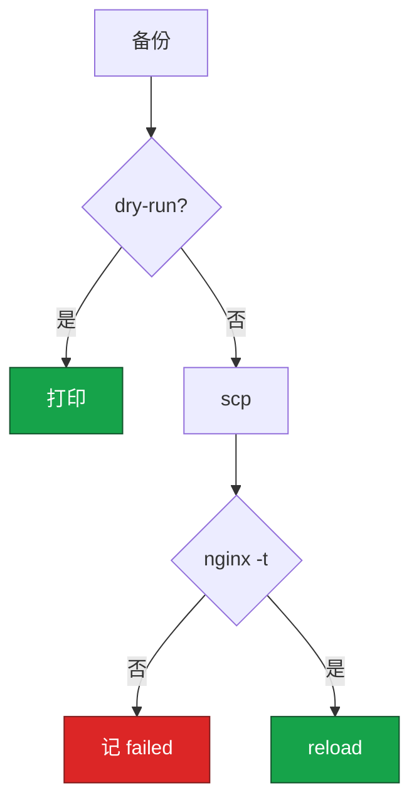
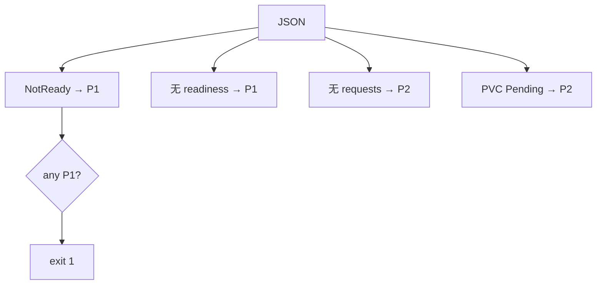
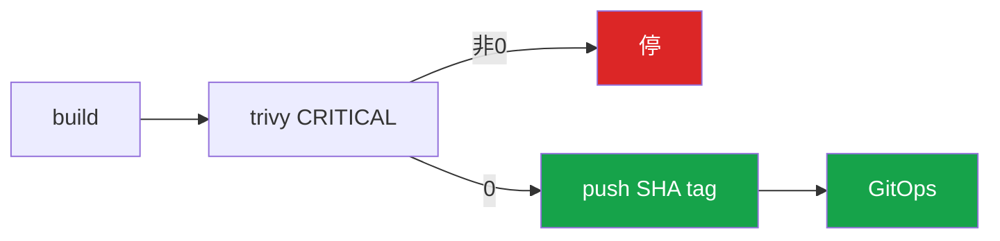
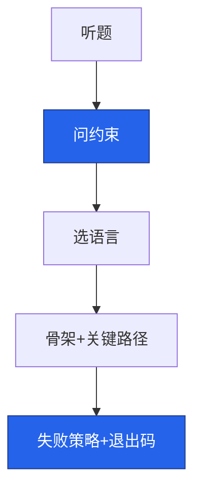

# 04｜运维开发实战题 · 练习题

先对照 [知识点](知识点.md) **面试怎么考** 自己口述，再对答案。关键字（dry-run、nginx -t、canary label、令牌桶、sem 50）要能点名。每题标了覆盖范围：

| 标记 | 含义 |
|------|------|
| **核心** | 不懂整章就没建立起来 |
| **必会** | 值班和面试都要能讲 |
| **常用** | 线上会反复碰到 |
| **常考** | 白板和追问的高频口径 |

## 本题目录

- [Q1 批量 Nginx](#q1) · [Q2 5xx Top IP](#q2) · [Q3 K8s 巡检](#q3)
- [Q4 Go 并发 SSH](#q4) · [Q5 令牌桶](#q5) · [Q6 飞书告警](#q6)
- [Q7 Prom 门禁](#q7) · [Q8 CI 扫描](#q8) · [Q9 对账释放](#q9) · [Q10 白板策略](#q10)
- [合上书](#合上书)

---

## Q1

**★★★★★｜100 台节点批量更新 Nginx 配置并 reload，怎么写才像生产？**

**覆盖**：核心 · 必会 · 常考 | **对应**：知识点 · Shell 模板

### 场景

活动前调大 `keepalive_timeout`。有人 `for h in $(cat hosts); do scp; ssh reload; done`，第 50 台 `nginx -t` 失败。

### 完整解答

**一句话**：备份→scp→nginx -t→reload，默认 DRY_RUN，`xargs -P 10`。



```bash
set -euo pipefail
DRY_RUN="${DRY_RUN:-true}"; PARALLEL=10
deploy_host() {
  local host=$1
  ssh -n "$host" "cp $CONFIG_DST ${CONFIG_DST}.bak.\$(date +%Y%m%d%H%M%S) 2>/dev/null || true"
  [[ "$DRY_RUN" == "true" ]] && { echo "[$host] DRY-RUN" >&2; return; }
  scp -q "$CONFIG_SRC" "$host:$CONFIG_DST"
  ssh -n "$host" "nginx -t && systemctl reload nginx"
}
export -f deploy_host
xargs -P "$PARALLEL" -I {} bash -c 'deploy_host "$@"' _ {} < hosts.txt
# failed_hosts.txt 非空 → exit 1
```

先问：同一角色？能并行？失败策略？回滚 RTO。网关 `-P 10`；战斗服别混批。第 50 台失败不是事务——看变更单决定回滚 49 台还是只修第 50 台。

评分点：`set -euo pipefail`；`DRY_RUN` 默认 true；远端备份 timestamp；**先 nginx -t 再 reload**；失败 host 汇总非 0。Ansible 等价：copy + validate + reload。

### 再追问

必须全集群一致？——对已成功的跑回滚 job（scp bak + nginx -t + reload）。磁盘满只修第 50 台？——新配置正确时修完重入 failed 列表即可。

---

## Q2

**★★★★★｜access.log 找 5xx Top-10 IP；日志 10GB 怎么办？**

**覆盖**：核心 · 必会 · 常用 | **对应**：知识点 · Python 5xx

### 场景

登录 502，`cat access.log | grep 502 | wc` 打满跳板机。要 Top IP + URL，限定活动前 10 分钟。

### 完整解答

**一句话**：先 head -1 对列；10GB 先 grep 再 awk/Python；JSON 用 jq。

combined：`$1` IP、`$9` status、`$6` URL。

```bash
awk '$9 ~ /^5/ {c[$1]++} END {for (i in c) print c[i], i}' access.log | sort -rn | head -10
grep '" 5[0-9][0-9]' huge.log | awk '...' | sort -rn | head -10   # 10GB
jq -r 'select(.status >= 500) | .client_ip' access.log | sort | uniq -c | sort -rn | head -10
```

时间窗见知识点 Python 模板（`--start/--end` 过滤 `$3`）。Top IP 集中 URL 杂 → 扫号；URL 集中 `/login` → 上游挂。

坏行处理：列数 `<9` 或时间戳 parse 失败 → skip + 计数 warning，别让一行脏数据炸全脚本。经常查的日志进 Loki/ES，跳板机只做 ad-hoc。

### 再追问

压缩日志？——`zcat | grep | awk`，逐行不 load 全文件。JSON 行能 awk 硬拆吗？——不能，用 jq 或 Python `json.loads`。

---

## Q3

**★★★★★｜K8s 巡检：没 requests、没 readiness、PVC Pending、Node NotReady。**

**覆盖**：核心 · 必会 · 常用 | **对应**：知识点 · K8s 模板

### 场景

肉眼 `kubectl get pod` 扫，活动日 NotReady 节点未发现，登录打到脏节点。

### 完整解答

**一句话**：`kubectl -o json` + timeout，P1 存在 exit 1，不要 cluster-admin。



```python
def kubectl_json(cmd):
    r = subprocess.run(["kubectl", *cmd, "-o", "json"],
                       capture_output=True, text=True, timeout=60)
    if r.returncode != 0: return {"items": []}
    return json.loads(r.stdout)
# 四函数：pod resources / deploy readiness / nodes / pvc
# any P1 → sys.exit(1)
```

完整脚本见知识点。不用 client-go；写操作走 GitOps。战斗服 liveness 过激要单独报——有状态负载别和 Web 套同一探针标准。

P1 示例：NotReady 节点、Deploy 缺 readinessProbe（误流量入口）。P2：缺 requests、PVC Pending（调度/存储风险）。

### 再追问

要 cluster-admin 吗？——不要，get/list 即可。输出 JSON 给平台消费？——可以，但 CI 门禁看 exit code。

---

## Q4

**★★★★☆｜Go 并发 SSH，一台卡住怎么办？**

**覆盖**：必会 · 常用 · 常考 | **对应**：知识点 · Go SSH

### 场景

3000 台扫 `uname -r`，指定 Go。一台防火墙丢包、一台 SSH hung。

### 完整解答

**一句话**：sem 50 + Dial Timeout 10s，failed>0 非 0 退出。

```go
sem := make(chan struct{}, 50)
cfg := &ssh.ClientConfig{Timeout: 10*time.Second, HostKeyCallback: knownHosts}
for _, h := range hosts {
    go func(host string) {
        sem <- struct{}{}; defer func(){ <-sem }()
        c, err := ssh.Dial("tcp", host+":22", cfg)
        // err → results; else CombinedOutput(cmd)
    }(h)
}
// wg.Wait → close → failed>0 → os.Exit(1)
```

一台 hung：靠 `Timeout`，可选 `context.WithTimeout` 包 Session。生产不用 `InsecureIgnoreHostKey` 当默认。

失败汇总示例：

```go
failed := 0
for _, r := range results {
    if r.Err != nil { failed++; log.Printf("FAIL %s: %v", r.Host, r.Err) }
}
if failed > 0 { os.Exit(1) }
```

泄漏检查：每个 goroutine `defer wg.Done()`；`close(results)` 必须在 `wg.Wait()` 之后。

### 再追问

3000/50=60 批，最坏 ~10 分钟；瓶颈在握手不是 goroutine 数。Python ThreadPool 什么时候够用？——几百台、命令短、连接复用少时够用；数千台 Go 更合适。

---

## Q5

**★★★★☆｜令牌桶 vs 漏桶？开服 API 怎么用？**

**覆盖**：必会 · 常用 · 常考 | **对应**：知识点 · 3.3 · TokenBucket

### 场景

限 20 QPS，50 并发打出 429，部分服双创建。

### 完整解答

**一句话**：令牌桶允许突发；开服用桶+failed 列表，POST 不盲重试。

```python
bucket = TokenBucket(capacity=40, refill_rate=20)
for sid in server_ids:
    if not bucket.allow(): failed.append(sid); continue
    open_server(sid)
```

| | 令牌桶 | 漏桶 |
|-|--------|------|
| 突发 | 允许 | 不允许 |
| 场景 | API QPS | 带宽整形 |

分布式 Redis+Lua。429 后查是否已创建，盲重试双写。

开服脚本用法：

```python
failed = []
for sid in server_ids:
    if not bucket.allow():
        failed.append(sid); continue
    resp = session.post(f"{API}/open", json={"id": sid}, timeout=(3, 10))
    if resp.status_code == 429:
        failed.append(sid)  # 不立刻 Retry POST
```

失败率高（>30%）应熔断本轮，避免巡检/开服脚本变 DDoS。

### 再追问

漏桶什么时候选？——要严格匀速出水、不能突发，比如日志写入速率整形。

**★★★★☆｜飞书告警发送；飞书挂了？告警风暴？**

**覆盖**：必会 · 常用 | **对应**：知识点 · 3.4 · 飞书模板

### 场景

P0 登录跌破，飞书故障全静默；Redis 挂 300 条重复卡片。

### 完整解答

**一句话**：三次退避 timeout=5 + 降级；风暴靠 AM grouping。

```python
for attempt in range(3):
    try:
        requests.post(webhook, json=payload, timeout=5).raise_for_status(); return True
    except Exception:
        if attempt < 2: time.sleep(2**attempt)
        else: log.exception("failed"); return False  # 降级邮件
```

dedupe 在 Alertmanager，不在发送脚本。P0/P3 分 webhook。

### 再追问

timeout 30s？——不行，队列会被 hung 堵住。

---

## Q7

**★★★★☆｜Prometheus 登录错误率接发布门禁？**

**覆盖**：必会 · 常用 | **对应**：知识点 · 3.4 · [02 Q5](../02-Python运维/练习题.md)

### 场景

金丝雀 5%，有人 curl 全集群均值，canary 2% 被 0.1% 淹没。

### 完整解答

**一句话**：PromQL 带 canary label；Prom 挂了默认失败。

```python
Q = 'sum(rate(http_requests_total{canary="true",status=~"5.."}[5m]))/sum(rate(...[5m]))'
r = requests.get(f"{prom}/api/v1/query", params={"query": Q}, timeout=5)
val = float(r.json()["data"]["result"][0]["value"][1])
if val > threshold: rollback(); sys.exit(1)
```

没数据不放行。预发可人工豁免并记录；生产默认失败。阈值做成参数——活动日可调但必须写进变更窗口。

对比 baseline：发布前 5min 同 query 的值，或对照未发布区服。全集群均值会把 canary 2% 错误淹没在 0.1% 里——这是常见坑。

### 再追问

为了发版临时关门禁？——可以记录豁免，但不能事后还声称「有自动检查」。Prom 挂了和「指标正常」是两回事。

---

## Q8

**★★★★☆｜CI 镜像扫描失败还推生产 tag 吗？**

**覆盖**：必会 · 常用 | **对应**：知识点 · 踩坑 · [05-CI-CD](../../05-工程化与自动化/02-CI-CD/)

### 场景

Critical CVE 有人 `|| true` 变绿仍 push；Trivy 超时当成功。

### 完整解答

**一句话**：Trivy Critical 非 0 停，不推 prod tag；豁免默认关。

```bash
set -euo pipefail
docker build -t "reg/hall:${GIT_SHA}" .
trivy image --exit-code 1 --severity CRITICAL "reg/hall:${GIT_SHA}"
docker push "reg/hall:${GIT_SHA}"   # 不可变 SHA，禁 :latest 生产
```

超时重试有上限，仍失败当失败。`:prod` 浮动指针须能追溯 SHA。



豁免：`SCAN_WAIVER=true` 必须带 `APPROVER` 写日志，默认关。这是 Shell 在流水线的位置，不是另写 CD。

### 再追问

扫描通过但有 High 级别 CVE？——看策略：Critical 硬拦，High 可能 warn+工单。口径要说清「我们拦什么 severity」。

---

## Q9

**★★★☆☆｜对账 CMDB 与 ECS，3 台无主能直接 release 吗？**

**覆盖**：常用 · 常考 | **对应**：知识点 · 踩坑 · [07 成本治理](../../07-云平台/06-成本治理/)

### 场景

读写 AK 直接 release，其中一台活动备用战斗机没打 CMDB 标签。

### 完整解答

**一句话**：只读凭证列 diff 等人审；protected 标签不能脚本删。

```python
for inst in fetch_readonly():
    if inst["Tags"].get("protected") == "true": continue
    if inst["InstanceId"] not in cmdb_ids: print(f"orphan {iid}")
if orphans: sys.exit(1)  # 列出 ≠ 删除
```

写操作另开 job + 审批 + dry-run。CMDB 滞后当线索，先「待确认」再 TTL 审批。

云有 CMDB 无 / CMDB 有云无 两种 diff 都要报——后者可能是 CMDB 录入漏了，不等于可以 release。游戏备用机、数据盘、活动 reserve 打 `protected=true`。

### 再追问

脚本发现 3 台 orphan，值班能半夜 auto release 吗？——不能。列清单 + 非 0 退出 + 工单；release 是独立审批 job，默认 dry-run。

---

## Q10

**★★★★★｜白板 coding 总策略：卡住、换语言、编造 API？**

**覆盖**：核心 · 必会 · 常考 | **对应**：知识点 · 面试怎么考 · 白板五步

### 场景

「3000 节点磁盘巡检」——有人写 perfect bash 5 分钟；有人编 `kubectl audit --fix`。

### 完整解答

**一句话**：先问约束+四条红线，选熟语言写骨架，编造 API 换真命令。



| 情况 | 做法 |
|------|------|
| 卡住 | 停笔问「第 50 台失败怎么办」 |
| 语言不熟 | 换熟的，说清取舍 |
| 编造 API | 用 kubectl/subprocess/ssh |
| 时间不够 | 骨架 + 10 行 + 口述 |

评分：约束 > 红线 > 失败策略 > 语法。简历没写 Go：诚实说小规模 Python ThreadPool 也行，能讲 sem+Timeout 骨架即可。

**开口模板（30 秒）**：「我先确认规模、失败是否停全批、有没有 dry-run 和回滚。生产脚本四条红线：幂等、可回滚、默认 dry-run、日志可追溯。我选 [Shell/Python/Go] 因为……关键路径是……失败时汇总 failed 并非 0 退出。」

**禁止**：没问约束就写循环；编造不存在的 API；`except pass` 或 `|| true` 让 CI 绿；无限并发 SSH；发送层做 dedupe。

### 再追问

考官说「写单元测试」？——讲测试点：dry-run 不 scp、nginx -t mock 失败不 reload、P1 触发 exit 1、TokenBucket 补令牌速率。不必现场写 pytest。

---

## 合上书

1. **Q1–Q3**：Nginx 六步？5xx 列号？K8s json + P1 exit？
2. **Q4–Q6**：Go sem/Timeout？令牌桶 vs 漏桶？飞书 dedupe 分工？
3. **Q7–Q9**：canary label？扫描失败推 tag？对账能 release？
4. **Q10**：卡住第一句话说什么？

闭卷重做 Q1、Q3、Q4、Q10 骨架——覆盖 **80% 白板权重**。

---

**回到**：[知识点 · 面试怎么考](知识点.md#面试怎么考--30-秒怎么说)
