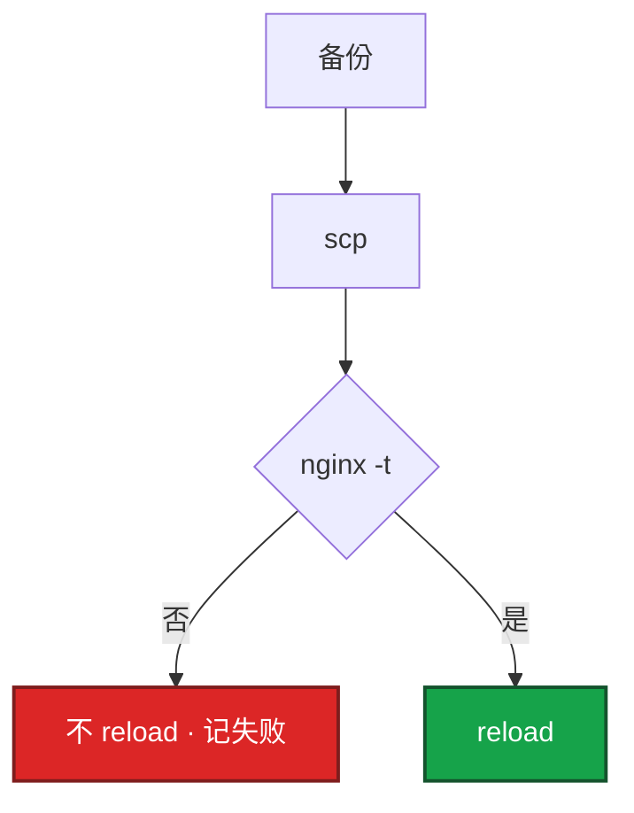

# 04｜运维开发实战题 · 练习题

先自己画图或口述，再对照解答。白板上写出骨架和取舍即可，不必默写每一行。每题标了覆盖范围：

| 标记 | 含义 |
|------|------|
| **核心** | 不懂整章就没建立起来 |
| **必会** | 值班和面试都要能讲 |
| **常用** | 线上会反复碰到 |
| **常考** | 白板和追问的高频口径 |

## 本题目录

- [Q1 批量 Nginx](#q1)
- [Q2 5xx Top IP](#q2)
- [Q3 K8s 巡检](#q3)
- [Q4 并发 SSH](#q4)
- [Q5 令牌桶](#q5)
- [Q6 飞书告警](#q6)
- [Q7 Prom 门禁](#q7)
- [Q8 CI 扫描](#q8)
- [Q9 对账释放](#q9)
- [Q10 白板策略](#q10)
- [合上书](#合上书)

---

## Q1

**★★★★★｜100 台节点批量更新 Nginx 配置并 reload，怎么写才像生产？**

**覆盖**：核心 · 必会 · 常考

### 场景

活动前要把网关 `keepalive_timeout` 调大。有人准备 `for h in $(cat hosts); do scp conf $h:/etc/nginx/; ssh $h reload; done`。第 50 台 `nginx -t` 会失败。

### 完整解答

先问：100 台是否同一角色、能不能并行、失败是否停全集群、回滚 RTO。网关可以有限并行；战斗服不要和网关混批。



```bash
set -euo pipefail
DRY_RUN="${1:-true}"
backup_remote() {
  ssh -n "$1" "cp $CONFIG_DST $CONFIG_DST.bak.\$(date +%Y%m%d%H%M%S) 2>/dev/null || true"
}
deploy_host() {
  local host=$1
  backup_remote "$host"
  if [[ "$DRY_RUN" == "true" ]]; then
    echo "[$host] DRY-RUN: scp && nginx -t && reload" >&2
    return 0
  fi
  scp -q "$CONFIG_SRC" "$host:$CONFIG_DST"
  ssh -n "$host" "nginx -t && systemctl reload nginx"
}
export -f backup_remote deploy_host
xargs -P 10 -I {} bash -c 'deploy_host {}' < hosts.txt
```

1. `set -euo pipefail`，默认 `DRY_RUN=true`
2. 校验 hosts.txt 和本地 conf
3. 每台：备份远端 →（dry-run 则打印并返回）
4. scp → nginx -t → 通过才 reload
5. `xargs -P 10`，失败记 host，最后非 0（xargs 自己不一定非 0）
6. 回滚：scp bak 回去再 `nginx -t && reload`

幂等：同一文件多次 scp 结果一样。Ansible：copy + validate + reload。第 50 台失败：已变更的用备份回滚，不要假装 100 台是一个事务。

### 再追问

第 50 台失败时前 49 台已经接新超时值，要不要全部回滚？——看变更单：若必须配置一致，对已成功的 49 台跑回滚 job。若新配置本身正确、只是第 50 台磁盘满，修第 50 台再重入即可。关键是失败可见、有 bak。

---

## Q2

**★★★★★｜access.log 找 5xx 最多的 Top-10 IP；日志 10GB 怎么办？**

**覆盖**：核心 · 必会 · 常用

### 场景

登录 502。有人 `cat access.log | grep 502 | wc` 把跳板机打满。需要 Top IP 和这些 IP 打的 URL。

### 完整解答

先 `head -1` 对 `log_format`。combined 下 `$1` IP、`$9` 状态、`$6/$7` 在引号请求里，列不对统计全错。

```bash
awk '$9 ~ /^5/ {count[$1]++} END {for (ip in count) print count[ip], ip}' access.log \
  | sort -rn | head -10
```

10GB：先 `grep '" 5[0-9][0-9]'` 再 awk；不要一次 load；压缩用 zcat。要 URL 聚合或时间窗：Python 逐行，坏行 skip（知识点 7.2）。

JSON 行：

```bash
jq -r 'select(.status >= 500) | .client_ip' access.log | sort | uniq -c | sort -rn | head -10
```

不要用 awk 硬拆 JSON。先过滤再聚合，跳板机内存才够。

### 再追问

JSON 行日志呢？——上面 jq；或 Python `json.loads` 逐行。Top IP 集中且 URL 杂 → 扫号；URL 集中 `/login`、IP 分散 → 上游大厅挂。

---

## Q3

**★★★★★｜写 K8s 巡检：没 requests、没 readiness、PVC Pending、Node NotReady。**

**覆盖**：核心 · 必会 · 常用

### 场景

战斗服和大厅混部。有人用 `kubectl get pod` 肉眼扫。活动当天 NotReady 节点没被发现，新登录全打到脏节点。

### 完整解答

```python
def kubectl_json(cmd):
    result = subprocess.run(
        ["kubectl"] + cmd + ["-o", "json"],
        capture_output=True, text=True, timeout=60,
    )
    if result.returncode != 0:
        print(f"ERROR: {result.stderr}")
        return {"items": []}
    return json.loads(result.stdout)
```

```mermaid
flowchart TB
    A[JSON items[]] --> B[node Ready != True → P1]
    A --> C[deploy 无 readinessProbe → P1]
    A --> D[pod 无 requests → P2]
    A --> E[pvc Pending → P2]
```

1. `kubectl get -o json`，timeout，失败当空并打 ERROR
2. 四类检查各一个函数，`Issue(P1/P2/P3, resource, msg)`
3. P1 存在则 `exit 1`，才能进 CI
4. 不用 client-go：一次性巡检不需要 Watch
5. 战斗服 liveness 过激单独报，不要和 Web 用同一套探针标准

完整四函数见知识点 7.3。

### 再追问

脚本要不要 cluster-admin？——不要。get/list 即可。写操作走 GitOps。见 02。

---

## Q4

**★★★★☆｜用 Go 写并发 SSH，批量执行并汇总。一台卡住怎么办？**

**覆盖**：必会 · 常用 · 常考

### 场景

3000 台 CVM 要扫 `uname -r`。Python 线程池也能跑，但对方指定 Go。有一台防火墙丢包。

### 完整解答

```go
sem := make(chan struct{}, 50)
var wg sync.WaitGroup
results := make(chan Result, len(hosts))

cfg := &ssh.ClientConfig{
    User: user, Auth: []ssh.AuthMethod{ssh.PublicKeys(signer)},
    HostKeyCallback: knownHostsCallback, // 生产不要 InsecureIgnoreHostKey
    Timeout: 10 * time.Second,
}

for _, h := range hosts {
    wg.Add(1)
    go func(host string) {
        defer wg.Done()
        sem <- struct{}{}
        defer func() { <-sem }()
        client, err := ssh.Dial("tcp", host+":22", cfg)
        if err != nil {
            results <- Result{Host: host, Err: err}
            return
        }
        defer client.Close()
        sess, _ := client.NewSession()
        out, err := sess.CombinedOutput("uname -r")
        results <- Result{Host: host, Out: string(out), Err: err}
    }(h)
}
wg.Wait()
close(results)
```

一台卡住：Timeout + 可选 `context.WithTimeout`。不要无限 Dial。泄漏：每 goroutine `defer wg.Done()`；close 在 Wait 之后。failed>0 则非 0 退出。

### 再追问

`InsecureIgnoreHostKey` 能上生产吗？——不能当默认。已知主机用 known_hosts。临时应急要写进变更记录，用完改回。

---

## Q5

**★★★★☆｜实现令牌桶。和漏桶差在哪？开服 API 怎么用？**

**覆盖**：必会 · 常用 · 常考

### 场景

开服平台限 20 QPS，脚本 50 并发把网关打出 429，部分服双创建。

### 完整解答

```python
import time
import threading

class TokenBucket:
    def __init__(self, capacity, refill_rate):
        self.capacity = capacity
        self.refill_rate = refill_rate
        self.tokens = capacity
        self.last_refill = time.monotonic()
        self.lock = threading.Lock()

    def allow(self):
        with self.lock:
            now = time.monotonic()
            elapsed = now - self.last_refill
            self.tokens = min(self.capacity, self.tokens + elapsed * self.refill_rate)
            self.last_refill = now
            if self.tokens >= 1:
                self.tokens -= 1
                return True
            return False
```

令牌桶允许突发；漏桶严格匀速。网关抗短脉冲用令牌桶。分布式：Redis+Lua，单机锁不够。拒绝应排队或失败列表，不要盲重试成双开。

### 再追问

429 之后立刻重试同一 server_id？——开服 POST 非幂等。应查询是否已创建，或用幂等键。盲重试会双写。见 02 HTTP。

---

## Q6

**★★★★☆｜写飞书告警发送。飞书挂了怎么办？告警风暴呢？**

**覆盖**：必会 · 常用

### 场景

P0 登录跌破要打电话。脚本只 POST 一次 webhook，飞书故障时群里全静默。另一次上游 Redis 挂，300 条重复卡片把值班打爆。

### 完整解答

```python
def send_feishu_alert(webhook, title, content, severity="P1"):
    payload = {
        "msg_type": "interactive",
        "card": {
            "header": {"title": {"tag": "plain_text", "content": f"[{severity}] {title}"}},
            "elements": [{"tag": "div", "text": {"tag": "lark_md", "content": content}}],
        },
    }
    for attempt in range(3):
        try:
            r = requests.post(webhook, json=payload, timeout=5)
            r.raise_for_status()
            return True
        except Exception:
            if attempt < 2:
                time.sleep(2 ** attempt)
            else:
                log.exception("feishu send failed")
                return False  # 降级邮件 / 本地日志，事后补发
```

风暴：Alertmanager grouping/inhibit/silence，不在发送层做去重全集群。发送脚本只保证「这条能出去或可审计失败」。

### 再追问

P0 和 P3 用同一个 webhook？——最好分开或卡片字段带 severity，电话升级只绑 P0。P3 刷屏会导致 P0 被忽略。

---

## Q7

**★★★★☆｜从 Prometheus 拉登录错误率，和发布门禁怎么接？**

**覆盖**：必会 · 常用

### 场景

金丝雀已放 5%。要脚本决定能不能继续。有人 curl 了全集群均值。

### 完整解答

```python
def gate(prom, query, threshold):
    r = requests.get(prom, params={"query": query}, timeout=5)
    r.raise_for_status()
    val = float(r.json()["data"]["result"][0]["value"][1])
    if val > threshold:
        rollback()
        raise SystemExit(1)
```

PromQL 带 **canary label**，对比发布前 5min 或对照区服。HTTP timeout，失败当门禁失败（不要当「没数据就放行」）。阈值做成参数，活动日可调但要写进窗口。

### 再追问

Prom 自己挂了门禁怎么走？——预发可以人工豁免并记录。生产默认失败。不要为了发版关掉门禁还声称「有自动检查」。金丝雀被均值淹没见 02 Q5。

---

## Q8

**★★★★☆｜CI 里质量门禁脚本：镜像扫描失败还要不要推生产 tag？**

**覆盖**：必会 · 常用

### 场景

扫描出 critical CVE，有人 `|| true` 让流水线变绿，生产 tag 仍推了。

### 完整解答

```bash
set -euo pipefail
docker build -t "reg/hall:${GIT_SHA}" .
trivy image --exit-code 1 --severity CRITICAL "reg/hall:${GIT_SHA}"
# 扫描非 0 则停，不推 :prod
# 豁免必须单独审批参数，打进日志，默认关闭
docker push "reg/hall:${GIT_SHA}"   # 不可变 tag；禁止 :latest 当生产
```

这是 Shell/Python 在流水线的位置，不是另写 CD。制品不可变见 05-工程化、01 系统设计发布题。

### 再追问

扫描偶发超时呢？——重试有上限；仍超时当失败。不要超时当成功。

---

## Q9

**★★★☆☆｜对账 CMDB 和云上 ECS，发现多 3 台「无主」机器，脚本能不能直接释放？**

**覆盖**：常用 · 常考

### 场景

对账 job 用了读写 AK。有人把 diff 直接 `stop + release`。其中一台是活动备用战斗机，没打 CMDB 标签。

### 完整解答

```python
# 1. 只读凭证 + paginator + 限流
# 2. 输出 diff：云有 CMDB 无 / 反之
# 3. 写操作另开 job，人工审批，dry-run 默认
# 4. 保护标签：游戏备用机、数据盘，对账忽略释放
if inst.get("Tags", {}).get("protected") == "true":
    continue
print(f"orphan {inst['InstanceId']}")   # 列出 ≠ 删除
sys.exit(1)  # 有 diff 就非 0，等人审
```

脚本能列出不等于能删。误释放有状态服是 P0。

### 再追问

CMDB 滞后一天怎么办？——对账结果当线索不是处决令。先标「待确认」，TTL 后再走审批。

---

## Q10

**★★★☆☆｜答题时先写完美代码还是先讲骨架？某语言现场写不顺怎么办？**

**覆盖**：核心 · 常考

### 场景

白板 20 分钟。有人卡在 Go 的 `ssh.InsecureIgnoreHostKey` 函数名，整题没讲 dry-run。

### 完整解答

先讲步骤和红线，再填关键片段。语言不熟就换你熟的（Python 线程池同样能讲并发上限和超时），并说清取舍。考的是工程素养。


编造没用过的 API 下一问就穿。诚实 + 正确步骤比背错函数名强。

### 再追问

对方坚持要 Go 而你简历没写？——用 Python 把并发模型讲完，对照说 Go 会用 worker pool + WaitGroup 同一结构。不要现场从零编 SSH 库细节。见 03。

---

## 合上书

- [ ] 能先问约束再选语言；四条红线一口回
- [ ] 能写批量 Nginx：备份、dry-run、`nginx -t`、`xargs -P 10`
- [ ] 能用 awk/Python 做 5xx Top IP；10GB 先过滤
- [ ] 能写巡检 `-o json` + P1 非 0；Go SSH 有 Timeout 和 sem
- [ ] 能写令牌桶和飞书降级；门禁带 canary、扫描失败不推 prod
- [ ] 能拒绝对账直接释放；白板先骨架不先背 API
