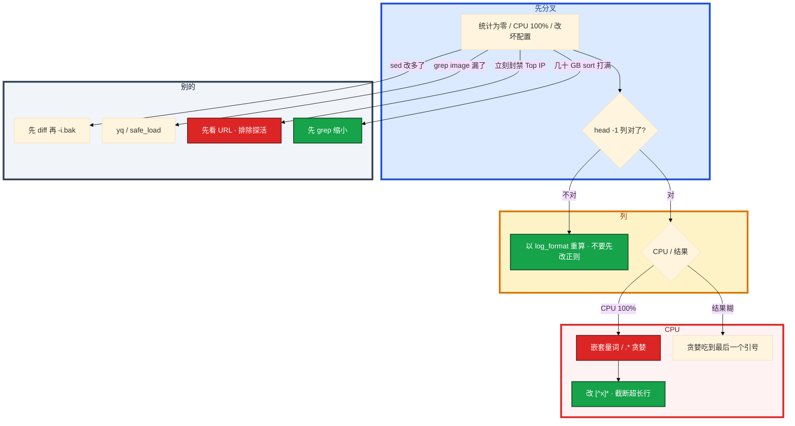

# 正则与文本处理


活动夜，大厅登录 502。跳板机上几 GB access.log。你要在 5 分钟内回答：是个别 IP 在扫，还是 `/login` 全挂。有人用网上抄的 `$10` 当状态码，统计显示没有 5xx。另一次 `re.compile(r'(.*:)+$')` 处理畸形行，CPU 100%。有人 `sed -i 's/100/500/g'` 把端口里的 100 全改了，没有备份。

先别动手。这一章后半全是你会动手的：**grep 缩小、awk 分列、sed 先预览、jq 抽 JSON、Python 命名组；回溯怎么避。** 前面的概念，是为了让你动手时先 `head -1` 对格式。

**读完你能：** 白板上画出「先过滤再聚合」；列号以 `log_format` 为准；会写 Top IP / 每小时 QPS / jq 非 Running；知道贪婪和回溯怎么改。

## 本章目录

缩进 = 上下级。3 下面才是 3.1。大纲：菜单 **查看 → 打开视图 → 大纲**。

- [1. 基本概念](#1-基本概念)
- [2. 架构图](#2-架构图)
- [3. 原理](#3-原理)
  - [3.1 BRE / ERE / PCRE](#31-bre--ere--pcre)
  - [3.2 贪婪与回溯](#32-贪婪与回溯)
  - [3.3 awk 分列](#33-awk-分列)
- [4. 落地：怎么写、怎么跑](#4-落地怎么写怎么跑)
- [5. 关键写法与坑](#5-关键写法与坑)
- [6. 常用命令](#6-常用命令)
- [7. 常用操作](#7-常用操作)
  - [7.1 游戏登录 502](#71-游戏登录-502现场)
  - [7.2 sed 改配置](#72-sed-改配置)
  - [7.3 jq / YAML](#73-jq-与-yaml)
  - [7.4 Python re](#74-python-re)
- [8. 生产排障](#8-生产排障)
- [9. 必会 · 常考](#9-必会--常考)
- [合上书](#合上书问自己)

**本章不讲：** `set -euo`、生产脚本头 → [01 Shell](../01-Shell/)；时间窗 + URL 聚合完整脚本 → [02](../02-Python运维/)、[04](../04-运维开发实战题/)；kubectl JSON 巡检结构 → [04](../04-运维开发实战题/)；日志平台架构 → [04-K8s 19](../../04-Kubernetes/19-日志管理/)、[02-22 日志](../../02-基础底座/22-日志运维/)。

---

## 1. 基本概念

SRE 用正则做三件事：日志分析、配置批量改、数据提取清洗。工具链是管道，不是「一条万能正则」。大文件先过滤再聚合，不要一次读全、也不要在跳板机上十层管道看到谁都不懂。

| 在本章做 | 不在本章做 |
|----------|------------|
| grep 缩小、awk 分列、sed 预览替换 | 生产脚本三开关 → 01 |
| jq 抽 K8s JSON | 巡检分级整题 → 04 |
| Python 命名组、逐行、避回溯 | 复杂时间窗完整脚本 → 02/04 |

三个角色不要混：

| 工具 | 干什么 |
|------|--------|
| **grep** | 缩小范围（5xx、ERROR、去掉注释） |
| **awk** | 分列、计数、时间窗粗切 |
| **sed** | 流式替换；不是配置管理系统 |
| **jq** | JSON；不要用 awk 硬拆 |
| **Python re** | 命名组、跨行、坏行跳过 |

> **记住**：先 `head -1` 对格式，Nginx 列号以你们 `log_format` 为准。sed 改文件先预览，`-i` 不可逆；生产改配置优先 Ansible/Git。贪婪 `.*` 会吃太多；用 `[^"]*` 往往更安全。

---

## 2. 架构图

先把整张图钉住。后面命令、现场、排障都对着这张图说话。

```mermaid
%%{init: {"flowchart": {"padding": 18, "nodeSpacing": 30, "rankSpacing": 50}, "theme": "base"}}%%
flowchart TB
    subgraph src ["① 磁盘"]
        log[日志 / 配置 / kubectl JSON]
    end

    subgraph pipe ["② 管道"]
        g[grep 缩小]
        a[awk 分列 · 计数]
        g --> a
        a --> t[简单 Top N：sort | uniq -c | sort -rn | head]
        a --> j[JSON：jq]
        a --> p[命名组/跨行：Python re 逐行]
    end

    log --> g

    classDef src fill:#334155,stroke:#0F172A,stroke-width:2px,color:#fff
    classDef g fill:#2563EB,stroke:#1E3A8A,stroke-width:2px,color:#fff
    classDef a fill:#7C3AED,stroke:#4C1D95,stroke-width:2px,color:#fff
    classDef out fill:#16A34A,stroke:#14532D,stroke-width:2px,color:#fff
    class log src
    class g g
    class a a
    class t,j,p out

    style src fill:#F1F5F9,stroke:#334155,stroke-width:3px,color:#0F172A
    style pipe fill:#DBEAFE,stroke:#1D4ED8,stroke-width:4px,color:#1E3A8A
```

图上三条线：

1. **先过滤再聚合。** 几十 GB 不要直接 `sort` 打满内存。
2. **列号以 log_format 为准。** 抄网上的 `$9` 可能是错的。
3. **one-liner 看现场，改文件先预览。** 封禁 IP 是变更，不是统计的下一步。

游戏登录高峰：先 grep 出 `/login` 和 5xx，再 awk。

---

## 3. 原理

原理只保留动手和面试会用到的：三种正则模式、贪婪/回溯、awk 字段。

**本节 3 块：** 3.1 模式 · 3.2 回溯 · 3.3 awk

### 3.1 BRE / ERE / PCRE

生产默认 `grep -E`。`grep 'a+b'` 在 BRE 下不是「一个或多个 a」——笔试常错。

| 模式 | 标志 | 特点 |
|------|------|------|
| BRE | 无 | `+ () {}` 需转义 |
| ERE | `-E` | `+ () {}` 直接用，**生产默认** |
| PCRE | `-P` | 前瞻后顾、命名组，功能最强 |

常用选项：`-i` 忽略大小写；`-v` 反向；`-c` 计数；`-n` 行号；`-r` 递归；`-l` 只文件名；`-o` 只匹配部分；`-A/-B/-C` 上下文；`-P` PCRE。

基础：`.` `*` `+` `?` `{n,m}` `[]` `[^]` `^$` `\d\w\s` `()` `|` `\b`。  
进阶（Python）：`(?P<name>...)` 命名组；`(?:...)` 非捕获；`(?=)` `(?!)` 前瞻；`(?<=)` `(?<!)` 后顾；`re.I/M/S`。`re.search` 任意位置；`re.match` 只从开头。日志用 search。

### 3.2 贪婪与回溯

`.*` 贪婪，吃到最后一个引号；`.*?` 非贪婪；更好是 `[^"]*`。避免嵌套量词 `(.+)+` 回溯爆炸。

回溯在干什么：引擎为了让整段正则成功，会把已经吞掉的字符一点点吐回去再试。嵌套量词让尝试次数指数涨。畸形行（没有你以为的分隔符、超长）最容易炸。


| 写法 | 结果 |
|------|------|
| `.*` 抽引号里的请求 | 两个 URL 糊成一段 |
| `[^"]*` | 只吃非引号，更稳更快 |
| `(.+)+` / `(.*:)+$` | 回溯爆炸 |
| `[^:]+(:[^:]+)*` | 明确字符类，线性 |

Python 标准 re 不好按行超时。控制输入长度 + 写死字符类，比「再等等」靠谱。先 grep 丢掉明显坏行。超长行截断。中文区间 `[\u4e00-\u9fa5]` grep 往往不行，用 Python re。

IP 正则 `\d+.\d+.`：`.` 匹配任意字符，会误匹配。要用 `\.` 或更严的 0–255 段。日志统计用字段列更稳。

> **记住**：非贪婪用 `[^x]*`。禁止嵌套量词炸回溯。

### 3.3 awk 分列

```
  BEGIN { 初始化 }
  条件 { 动作 }     <-- 每行：$0 整行，$1..$NF 字段，NR 行号
  END { 收尾 }
```

默认空白分列，`-F` 指定。`OFS` 输出分隔符。

| | sed | awk |
|--|-----|-----|
| 擅长 | 替换、删、插 | 分列、聚合、计算 |
| 典型 | 改配置项 | 日志统计 |

combined 常见：`$1` IP，`$4` 时间，`$7` path，`$9` status，`$NF` 有时是 RT。先打印 `$1 $7 $9`，和 `head -1` 对上，再写过滤。`$9 ~ /^5/` 计数 IP → Top IP；改 `count[$7]` → Top URL。两条都跑，才能分扫号还是上游挂。RT 不在最后一列 → `$NF+0 > 1` 会把状态码当延迟。

每小时 QPS（`$4` 形如 `[26/Aug/2026:10:00:00`）：`substr($4, 14, 2)` 取小时。列偏移随格式变，先打印 `$4` 再 substr。精确到分钟取 5 个字符 `10:00`。跨时区、文件里有两天：按完整日期+小时做 key，不要只取小时否则两天的 10 点会加在一起。

---

## 4. 落地：怎么写、怎么跑

现场顺序固定，不要现场发明第十层管道。

1. `head -1` 对格式 / 打印 `$1 $7 $9`。
2. grep 缩小（5xx、`/login`、ERROR）。
3. awk 计数或 Python 命名组。
4. 大文件：先过滤再 `sort`；直接 `grep pattern file`，不要 `cat | grep`。压缩 `zgrep`/`zcat`。
5. 常查的进 ES/Loki。
6. 得出结论入库成脚本或 Runbook。one-liner 不能当封禁依据直接上 iptables。

百万行：`re.compile` + `finditer` + 逐行读。纯过滤大文件，grep+awk 往往更快（C）。Python 适合结构化输出和接 API。>1GB 通常 grep/sort 更快。

配置批量：

```bash
for env in dev staging prod; do
  sed -e "s/{{ENV}}/$env/g" template.conf > "$env.conf"
done
```

多机 sed 没有备份等于不可回滚，见 04 批量部署。

---

## 5. 关键写法与坑

| 坑 | 正确做法 |
|----|----------|
| BRE 下 `grep 'error+'` 匹配不到 `error` | `-E` 或 `error\+`；生产默认 `-E` |
| `sed -i` 无备份、`s/100/500/g` | 先预览；匹配完整键；`-i.bak` |
| 路径含 `/` | `s\|old\|new\|g` |
| macOS BSD sed `-i` | `sed -i ''` 或 `sed -i.bak` 或 gnu-sed |
| `. * [ ]` 未转义 | `s/10.0.0.1/` 会误伤 `10x0x0x1` |
| awk 硬拆 JSON | jq / `json.loads` |
| grep `^image:` 漏多行 YAML | yq / `yaml.safe_load` |
| query string 当 URL | `split('?', 1)[0]` |
| `cat file \| grep` | `grep pattern file` |
| 现场 Top IP 立刻封禁 | 可能是探活 / NAT；走变更单 |

`sed -n '100,200p'` 抽行；`sed '/\[mysqld\]/a max_connections=500'` 插入；`sed 's/[[:space:]]*$//'` 去尾空白。

---

## 6. 常用命令

| 需求 | 组合 |
|------|------|
| Top10 IP | grep -oE IP 或 awk `$1` → sort \| uniq -c \| sort -rn \| head |
| 状态码分布 | awk `{print $9}` → 同上 |
| 5xx 最多的 IP | awk `$9 ~ /^5/` 计数 |
| 延迟 Top10 | awk `{print $NF, $0}`（先确认 RT 列） |
| 每小时 QPS | substr 时间列 |
| 请求量最大 URL | awk `{print $7}` 或 grep 抽 path |
| 只看 ERROR | grep -E 'ERROR\|WARN' |
| JSON 5xx IP | `jq -r 'select(.status >= 500) \| .client_ip'` |
| 非 Running Pod | `kubectl get pods -A -o json \| jq '...'` |

```bash
grep -oE '([0-9]{1,3}\.){3}[0-9]{1,3}' access.log | sort | uniq -c | sort -rn | head
grep -oE 'HTTP/[0-9.]+" [0-9]+' access.log | awk '{print $2}' | sort | uniq -c | sort -rn
grep -E 'HTTP/[0-9.]+" 5[0-9][0-9]' access.log
grep -vE '^\s*(#|$)' config.conf
grep -oP '"client_ip":"\K[^"]+' log.json
grep -E 'ERROR|WARN|FATAL' app.log
```

值班先跑这四条（统计为零 / CPU 打满）：

```bash
head -1 access.log
awk '{print $1, $7, $9}' access.log | head
# 列对了再计数；CPU 100% 先查有没有 (.+)+
```

---

## 7. 常用操作

### 7.1 游戏登录 502 现场

```bash
awk '{count[$9]++} END {for (c in count) print c, count[c]}' access.log | sort -k2 -rn
awk '$9 ~ /^5/ {count[$1]++} END {for (ip in count) print count[ip], ip}' access.log \
  | sort -rn | head
awk '{print $NF, $0}' access.log | sort -rn | head -10
awk '{print substr($4, 14, 2)}' access.log | sort | uniq -c
```

```bash
grep -oE '"(GET|POST|PUT|DELETE) [^"]+ HTTP' access.log \
  | awk '{print $2}' \
  | sort | uniq -c | sort -rn | head -20
```

某 path 的 499/502：`awk '$7 ~ /\/login/ && ($9 == 499 || $9 == 502)' access.log | tail`。

Top 5xx IP 里有健康检查探活和 NAT 出口。有人立刻封禁，登录全挂。one-liner 只解释现象。封禁是变更：要确认是攻击还是共享出口/探活，走变更单，可回滚。已知 LB/探活网段写进脚本白名单。统计时 `awk '$1 !~ /^10\./'` 只是例子，以你们网段为准。5xx 多也可能是自己服务挂了，IP 是玩家和探活。先看 URL 聚合（04 Q2），再决定限流还是修服务。

### 7.2 sed 改配置

活动前有人要用 sed 改 100 台 `my.cnf` 的 `max_connections`。`-i` 先不加、确认后再加；`sed -i.bak` 留备份。

```bash
sed 's/max_connections=100/max_connections=500/' my.cnf | diff -u my.cnf -
sed -i.bak 's/max_connections=100/max_connections=500/' my.cnf
sed -e 's/{{DB_HOST}}/192.168.1.100/g' \
    -e 's/{{DB_PORT}}/3306/g' template.conf > production.conf
sed 's|/old/path|/new/path|g'
```

预览过了，生产仍要 bak：预览看的是你笔记本上的副本；生产文件可能被别人改过。多机 `ssh + sed -i` 没有变更单、没有回滚，只能当应急。正式走 Ansible 或 Git。`find ... -exec sed -i.bak ... {} +`。

### 7.3 jq 与 YAML

几 MB 的 `kubectl -o json` 用 jq 比 Python 先 loads 全量更方便。YAML 用 `yq` 或 Python `yaml.safe_load`，grep `image:` 会漏多行写法、漏 Helm 缩进不是行首的 `image:`。

```bash
echo '{"a":{"b":2}}' | jq '.a.b'
echo '[{"name":"A"},{"name":"B"}]' | jq '.[].name'
echo '[{"age":20},{"age":30}]' | jq '.[] | select(.age > 25)'
kubectl get pods -o json | jq '.items[] | {name: .metadata.name, status: .status.phase}'
kubectl get pods -A -o json | jq '.items[].spec.containers[].image'
kubectl get pods -A -o json | jq '.items[] | select(.status.phase != "Running") | .metadata.name'
kubectl get pods -A -o json | jq '.items[] | select(.status.containerStatuses[].restartCount > 0) | .metadata.name'
```

Pending 可能还没有 `containerStatuses`，先 `select(.status.containerStatuses != null)`。生产镜像审计应对 Deployment/StatefulSet 模板，不要扫注释和 CRD 里的例子。`safe_load` 碰到多文档 `---`：`safe_load_all`。坏文件跳过并记入失败列表，不要整次扫描当成功。巡检整题用 Python 解析同一份 JSON，见 04。

### 7.4 Python re

```python
import re

pattern = re.compile(
    r'(?P<ip>\d+\.\d+\.\d+\.\d+)'
    r'.*\[(?P<time>[^\]]+)\]'
    r'.*"(?P<method>\w+) (?P<path>\S+) (?P<proto>[^"]+)"'
    r'\s+(?P<status>\d+)\s+(?P<size>\d+)'
)
m = pattern.search(log)
```

```python
pattern = re.compile(
    r'\[(?P<ts>\d{4}-\d{2}-\d{2} \d{2}:\d{2}:\d{2})\]'
    r'\s+\[(?P<level>\w+)\]'
    r'\s+(?P<msg>.*)'
)
results = []
with open("app.log") as f:
    for line in f:
        m = pattern.search(line)
        if m:
            results.append(m.groupdict())
```

```python
import re
from collections import Counter

pattern = re.compile(r'"(GET|POST|PUT|DELETE) (\S+) HTTP')
urls = []
with open("access.log") as f:
    for line in f:
        m = pattern.search(line)
        if m:
            urls.append(m.group(2).split("?", 1)[0])
for url, count in Counter(urls).most_common(20):
    print(count, url)
```

日志前面有 syslog 头，`re.match` 从行首匹配，全部 None——用 search。

---

## 8. 生产排障

三问：列对了吗？是过滤不够还是正则在回溯？改文件有没有 bak？

**统计为零 ≠ 没有 5xx。** 列号抄错最常见。



| 现象 | 先做什么 | 不要做什么 |
|------|----------|------------|
| 5xx 统计为零 | `head -1` 对列 | 先写更复杂的正则 |
| `grep 'error+'` 无匹配 | 改 `-E` | 以为文件里没有 error |
| sed 把端口 100 也改了 | 匹配完整键；bak 回滚 | 再 `s/100/500/g` |
| 正则 CPU 打满 | 查 `(.+)+`；改字符类 | 再等等 |
| grep `image:` 漏镜像 | yq / yaml | 当完整答案 |
| Top IP 封禁后登录全挂 | 排除探活 / NAT | one-liner 当变更 |
| macOS `-i` 把文件名吃成后缀 | `sed -i.bak` | 当文件丢了 |

活动夜几十 GB 直接 `sort`，跳板机内存打满。正确处理：`head -1` → grep `/login` 和 5xx → awk 计数 → 结论进 Git。不要 `cat` 全文件进 Python list。

---

## 9. 必会 · 常考

白板和追问高频，能一口回：

| 说法 | 对错 | 口径 |
|------|:----:|------|
| 生产 grep 不用 `-E` 也一样 | 错 | BRE 里 `+ () {}` 要转义 |
| `.*` 抽引号字段最省事 | 错 | 贪婪；用 `[^"]*` |
| `(.+)+` 只是「一个或多个」 | 错 | 回溯爆炸 |
| `re.match` 和 `search` 一样 | 错 | match 只从开头 |
| 网上 `$9` 一定是状态码 | 错 | 以你们 `log_format` 为准 |
| `sed -i` 不用 bak | 错 | 不可逆 |
| JSON 用 awk 拆 | 错 | jq |
| grep `image:` 能审计全部镜像 | 错 | 多行 YAML |
| Top IP 可以直接 iptables | 错 | 可能是探活；走变更 |
| `cat \| grep` 和 grep 文件一样 | 错 | 多一个进程；大文件更差 |
| 只取小时做 QPS key | 错 | 两天的 10 点会加在一起 |

数字：Top N 用 **head -10**；小时 substr 常见 **($4, 14, 2)**；分钟 **5** 个字符。

易混：BRE vs ERE；贪婪 vs 字符类；search vs match；sed vs awk；jq vs awk 拆 JSON；统计 vs 变更（封禁）。

---

## 合上书，问自己

1. 生产 grep 默认什么模式？BRE 下 `+` 是什么？
2. 5xx Top IP 为什么先 `head -1`？扫号和上游挂怎么分？
3. `.*` 和 `[^"]*` 差在哪？`(.+)+` 为什么会打满 CPU？
4. sed 改 `max_connections` 三步是什么？路径里有 `/` 怎么办？
5. jq 怎么列出非 Running 的 Pod？YAML `image:` 为什么会漏？
6. 现场 Top IP 能不能直接封禁？大文件为什么禁止先 sort？

六题都能口述，这一章就过了。开发能力五章到此收口：编排用 Shell，胶水用 Python，常驻用 Go，白板套红线，日志先对列。
