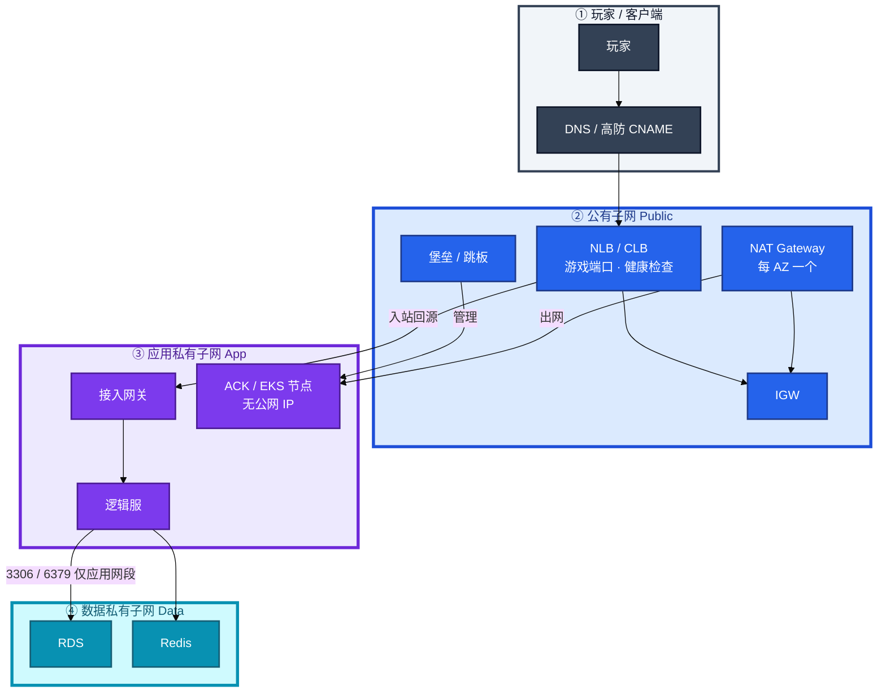
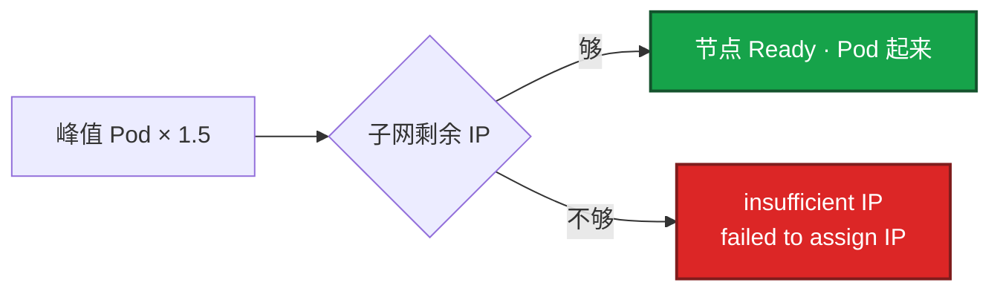
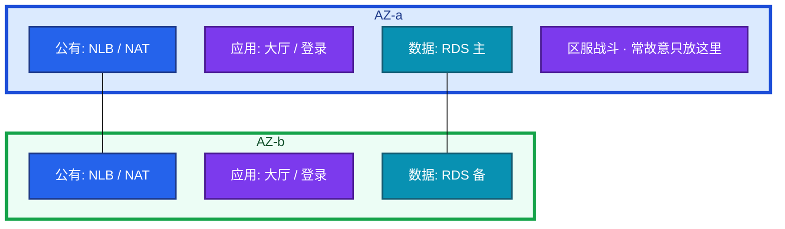
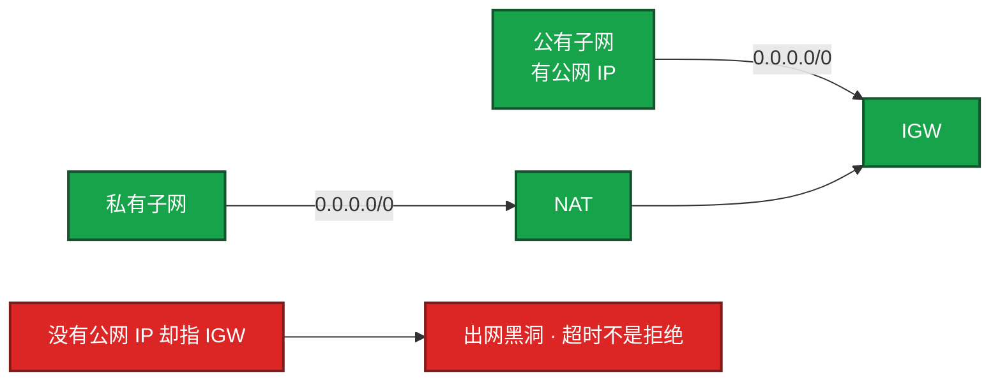
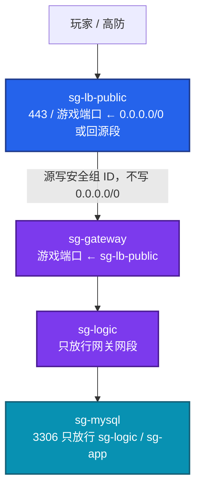
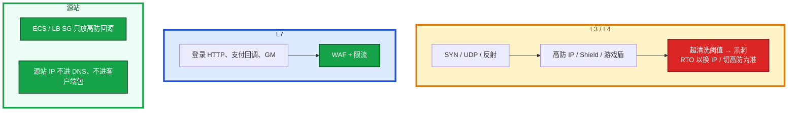
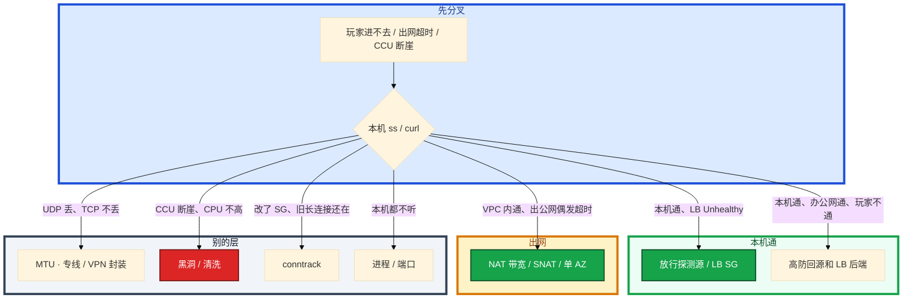

# 云网络与安全


活动高峰，玩家进不去。LB 后端全红。群里有人说云挂了，另有人要改安全组、重启 NAT、切高防。本机 `curl 127.0.0.0:port` 却是 200。

这一章只做一件事——**怎么划 VPC、怎么写安全组、怎么验 LB 探测源、NAT 端口满和黑洞分别怎么止血。** 前面的概念和原理，是为了让你动手时不选错层。

**读完你能：** 白板上画出玩家进 VPC 的三条路径；本机通、LB 红能判断是探测源不是进程死；出网偶发超时先看 SNAT 不是先改 SG。

**本章主线（排障就按这三步想）：**

1. **分层**：玩家入站 / 私网出公网 / 管理面三条路径分开想；SG 绑 ENI，NACL 绑子网。
2. **归类**：本机 curl 通、LB 红 → 探测源；出网偶发超时 → NAT SNAT；CCU 断崖 CPU 低 → 高防黑洞。
3. **留证**：SG 改了旧连接还在 = conntrack；Flow log 定向开，不全 VPC 海选。

## 本章目录

- [1. 基本概念](#1-基本概念)
- [2. 架构图](#2-架构图)
- [3. 原理](#3-原理)
  - [3.1 VPC 与 CIDR](#31-vpc-与-cidr故障域权限域路由域)
  - [3.2 多 AZ](#32-多-az数据面必须计算面可以单-az)
  - [3.3 IGW 与 NAT](#33-igw-与-nat出网路径和三大瓶颈)
  - [3.4 安全组 vs NACL](#34-安全组-vs-nacl一次规则把战斗服打不通)
  - [3.5 SLB vs NLB vs ALB](#35-slb-vs-nlb-vs-alb长连接接到哪一层)
- [4. 安装部署](#4-安装部署)
  - [4.1 生产怎么划](#41-生产怎么划环境切开-ip-按-pod-留)
  - [4.2 游戏怎么放](#42-游戏怎么放入口私网数据面)
- [5. 核心配置](#5-核心配置)
- [6. 命令与操作](#6-命令与操作)
- [7. 生产排障](#7-生产排障)
- [8. 必会 · 常考](#8-必会--常考)
- [合上书，问自己](#合上书问自己)

**本章不讲：** ACK Terway / CLB `100.64` 落地 → [02 阿里云生产](../02-阿里云生产/)；EKS VPC CNI、NLB preserve client IP、NAT 处理费 → [03 AWS生产](../03-AWS生产/)；火山健康检查源 → [08 火山引擎生产](../08-火山引擎生产/)；跨云默认值对照 → [04 多云对照](../04-多云对照/)；NAT / 跨 AZ / CDN 账单 → [06 成本治理](../06-成本治理/)；安全组变更权限、多账号拆 VPC → [07 IAM与多账号](../07-IAM与多账号/)；游戏入口对抗、心跳协议 → [08-游戏运维专题](../../08-游戏运维专题/)。

---

## 1. 基本概念

生产 VPC 不是「先建一个 `10.0.0.0/16` 再说」。它是一张网的 **故障域 + 权限域 + 路由域**。

| 域 | 谁决定 | 错了会怎样 |
|----|--------|------------|
| **故障域** | AZ、子网跨 AZ 怎么放 | 单 AZ 挂 = 该 AZ 里 ECS / 单 AZ RDS / 单 AZ NAT 一起没 |
| **权限域** | 安全组绑 ENI、NACL 绑子网 | 本机通、LB 红；改了 SG 旧长连接还在 |
| **路由域** | 路由表：`0.0.0.0/0` 指 IGW 还是 NAT | 没有公网 IP 却指 IGW = 出网黑洞，超时不是拒绝 |

三个入口不要混：

| 路径 | 谁走 | 不该谁走 |
|------|------|----------|
| **玩家入站** | DNS / 高防 CNAME → 公有子网 NLB / CLB | 逻辑服 EIP、NAT |
| **私网出公网** | 应用私有子网 → 本 AZ NAT → IGW | 数据子网随便穿、玩家下载 |
| **管理面** | 堡垒 / 运维 VPC，SSH 永不 `0.0.0.0/0:22` | 办公网直打数据子网 |

> **记住**：逻辑服、RDS、Redis **永不绑公网 IP**。只有 LB / NAT / 堡垒有出入口。玩家入站不走 NAT。本机 `curl` 通，只证明进程在听，不证明 LB 探测源和玩家路径通。

CIDR 一旦写进对等 / CEN / TGW 就很难改。测试和生产都用 `10.0.0.0/16`，后期一对等或打专线，路由直接冲突。国内一套、出海一套也要提前避开重叠——混合云和多账号互联是迟早的事。账号与网络隔离的落地表在 04。

---

## 2. 架构图

后面排障都对着这张图。



**读图三句话：**
1. **没有箭头从玩家指向逻辑服。** 玩家只碰高防 / LB。
2. **NAT 只服务私网出公网**（拉镜像、调支付、告警 webhook）。玩家入站不绕 NAT。
3. **数据子网可以没有 `0.0.0.0/0`。** 3306 / 6379 只放应用网段。

**读图一句话：**

| 控制面 | 绑在哪 | 状态 |
|--------|--------|------|
| **安全组 SG** | ENI / 实例 | 有状态：入站放行则回程自动放 |
| **NACL** | 子网边界 | 无状态：回程也要写 |

三种生产形态（划网的时候选，挂的时候故障域不一样）：


同账号同地域多环境，独立 VPC 比靠安全组隔离更不容易误配。跨地域本来就是另一张 VPC，用 CEN / TGW / 对等，不要幻想一个 VPC 跨 region。GCP 全球 VPC 是另一张图，对照在 04。

---

## 3. 原理

原理只保留动手和面试会用到的：IP 为什么会不够、AZ 抗什么、出网卡在哪、SG 和 NACL 差在哪、长连接该接到哪一层。

**本节 5 块：** 3.1 VPC / CIDR · 3.2 多 AZ · 3.3 IGW / NAT · 3.4 SG / NACL · 3.5 SLB vs NLB

### 3.1 VPC 与 CIDR：故障域、权限域、路由域

**一句话：** Terway / VPC CNI 按 Pod 占 IP；节点池按峰值 × 1.5 留 IP，/24 是经典事故。

**打个比方：** 像停车场按**车位**计费不是按**车**——一台 ECS 只占一个 IP，但 Terway 每个 Pod 占一个，64 台 × 30 Pod 瞬间要 1920 个「车位」，/24 只有 254 个。

**现场走一遍**（活动扩节点，Pod Pending）：



你眼睛看到的：

- `kubectl describe po` / Events：`insufficient IP`、`failed to assign IP`
- 节点 Ready 抖动或 NotReady；旧 Pod 还在跑，新的起不来
- VPC 控制台：该交换机 / subnet 可用 IP 接近 0

卡住先看节点池子网剩余 IP，不要先怪镜像、不要先缩节点「看起来像资源不够」。止血是给节点池加 **secondary CIDR** 或新子网，**不要现场改已经对等的生产网段**。细节分别在 02、03。

**面试怎么说**：「节点池按峰值 Pod × 1.5 留 IP；Events 里 insufficient IP 先查子网，不要给 ACK/EKS 划 /24。」

> **记住**：节点池按峰值 Pod × 1.5 留 IP；给 ACK / EKS 划 `/24` 是经典事故。

### 3.2 多 AZ：数据面必须，计算面可以单 AZ

**一句话：** 数据面必须多 AZ；有状态战斗服常故意单 AZ，RTO 按踢人写进预案。

**打个比方：** 像银行金库要两地备份（RDS 多 AZ），但棋牌室牌桌不能拆成两半打（战斗服单 AZ）——玩家 Session 在内存里，AZ 切换本来就要踢人。

**现场走一遍**（面试官问「你们全多 AZ 吗？」）：



**数据面必须多 AZ**：RDS 主备跨 AZ、Redis 多副本、K8s 控制面（ACK / EKS 托管已做）、NAT 每 AZ 一个。LB 本身跨 AZ，后端如果全在一个 AZ，LB 再跨也没用。

**有状态逻辑服经常故意单 AZ。** 同城跨 AZ RTT 通常 0.5–2ms，战斗服帧同步 / 频繁 RPC 会放大；AWS 跨 AZ 流量计费，逻辑服互相打会把账单打穿；一个区服绑一组进程内存态，AZ 级切换本来就要踢人重建 Session。

正确表述：区服计算面单 AZ 部署，故障域写进预案——RTO 按「切到热备 AZ 或重开进程」计，不以「玩家无感」承诺。大厅、登录、匹配、HTTP API 可以多 AZ。

**面试怎么说**：「数据面 RDS/Redis/NAT 必须多 AZ；有状态战斗服常故意单 AZ，跨 AZ RTT 和流量费会放大，RTO 按踢人写预案。」

别把「我们全多 AZ」说成默认最优。

丢一个 AZ 时跟着走：该 AZ 节点 / Pod 整片 NotReady，对端 AZ 的 LB 健康检查应把流量切走。如果健康检查也挂在故障 AZ 的探测路径上，会出现「AZ 挂了但流量还往死节点打」。先看对端 AZ 的 HealthyHostCount，再决定是切流量还是重开区服。关掉 NLB 跨 AZ 能少付钱、适合区服绑单 AZ，代价是该 AZ 目标全挂时流量不自动漂——要显式选择并写进预案。

### 3.3 IGW 与 NAT：出网路径和三大瓶颈

**一句话：** NAT 只给出网，玩家不走 NAT；三大瓶颈是带宽/PPS、SNAT 端口、单 AZ NAT。

**打个比方：** NAT 像公司前台统一寄快递——所有私网员工共用一个寄件地址（SNAT IP），寄给同一个收件人（支付网关 IP:443）时，「寄件人+端口」组合会用完。

**现场走一遍**（支付回调偶发 timeout，VPC 内互访正常）：

1. 所有逻辑服打 **同一个支付 IP:443**，NAT 单 IP 约 6 万源端口，五元组冲突 → 随机 `connect timeout`。
2. 控制台：阿里 NAT 端口水位贴线；AWS `ErrorPortAllocation` 往上跳。
3. **输出解读**：VPC 内互访正常、出公网偶发超时 → 先 NAT 不是先改 SG。



NAT 是私网访问公网（拉镜像、调第三方支付 / 账号、告警 webhook）的必经 hops，**不是玩家入站路径**。玩家连的是 LB / EIP，不要把玩家流量绕 NAT。

NAT 三大瓶颈对照：

1. **带宽 / PPS**：活动期所有节点抢同一 NAT。镜像拉取变慢，VPC 内仍正常。
2. **SNAT 端口耗尽**：热点目标同一 IP:443，随机 `connect timeout`。
3. **单 AZ NAT**：NAT 所在 AZ 挂，依赖出网的健康检查、拉配置、写外部账单全挂。生产按 AZ 各放 NAT，路由表走「本 AZ NAT」。

卡住先看 NAT 端口 / `ErrorPortAllocation`，不要先改安全组。止血：扩 NAT IP / 升带宽；热点目标改连接池、合并出口；镜像和对象存储改 VPC 内网 endpoint（OSS 内网域名、S3 Gateway Endpoint），大流量不要穿 NAT。NAT 处理费在 AWS 上经常贵过 ECS 本身，见 06。

治理：数据子网默认无 `0.0.0.0/0`；CI 拉镜像用内网镜像仓库；第三方回调改白名单 + 连接复用。

**面试怎么说**：「玩家入站不走 NAT；出网偶发 timeout 先看 SNAT 端口和单 AZ NAT，一个 NAT IP 约 6 万源端口。」

> **记住**：玩家流量不走 NAT；出网偶发超时先看 SNAT 端口和本 AZ NAT，再谈应用重试。

### 3.4 安全组 vs NACL：一次规则把战斗服打不通

**一句话：** 本机通、LB 全红，先放探测源；SG 有状态，NACL 无状态。

**打个比方：** SG 像酒店房卡——进门登记了，出门自动放行（有状态）；NACL 像小区大门——进出了都要刷两次卡（无状态）。

**现场走一遍**（战斗接入挂 CLB，本机 curl 200，LB 全 Unhealthy）：

LB 探测源不是玩家 IP，也不是你的笔记本：

| 云 | 探测源怎么写 |
|----|----------------|
| 阿里云 CLB | `100.64.0.0/10`（链路本地），或勾选「允许负载均衡探测」 |
| AWS ALB / NLB | LB 自己的 ENI / 节点地址；放行 **LB 所属安全组** 或 NLB 子网 CIDR |
| 火山引擎 | **禁止照抄 100.64**，以控制台 / 文档为准（08） |

卡住先 **放行探测源 CIDR / LB SG**，不要先改业务端口、不要先重启进程。止血：临时对探测源放行业务端口（及 HTTP 检查路径），观察 Unhealthy 变 Healthy 再收紧。根因：变更只测了「我从堡垒 ssh 再 curl」，没测 LB 真实源。治理：Terraform 里 backend SG 强制 `source_security_group_id = lb_sg`；上线检查清单包含「LB 控制台健康检查 + 后端本地监听」。

| | 安全组 (SG) | 网络 ACL / NACL |
|--|------------|-----------------|
| 作用点 | 弹性网卡 / 实例 | 子网 |
| 状态 | 有状态：入站放行则回程自动放 | 无状态：入、出都要写 |
| 默认 | 入站拒绝，出站常放行 | 自定义表常默认拒绝 |
| 匹配 | 规则并集，有一条 Allow 就过 | 按优先级号，先匹配先生效 |
| 生产用法 | 主控制面，按角色拆组 | 兜底拒绝（例如整段禁 22 从公网） |

**NACL 放行入站 80 却不放出站 1024-65535，HTTP 会建连失败或极慢。** SG 不会踩这个，因为有状态。所以生产以 SG 为主，NACL 只做粗粒度禁网，避免两层同时精细化导致「谁都说放了但不通」。流量在子网边界丢、实例 SG 已放行 → 查 NACL 序号和出站。

安全组按角色拆，不要一个「default 全开」：



改 SG 对 **已建立连接** 可能仍通（conntrack 未过期），表现为「规则删了但旧长连接还在」。新连接立刻拒绝。排障不要只看当前 SG，要看 conntrack / 是否仅新玩家进不去。

游戏长连接再叠加 conntrack 表满：`dmesg` 见 `nf_conntrack: table full`，新连接失败、旧连接还活着。调 `nf_conntrack_max` 只是止血；根因是超时过短导致频繁重建，或 UDP 无状态打爆表。云上安全组本身在宿主机实现，实例内 conntrack 仍可能先满，两边都要看。

**面试怎么说**：「本机 curl 通 LB 全红，先放探测源——阿里 CLB 是 100.64.0.0/10；改了 SG 旧连接还在是 conntrack 不是规则没生效。」

> **记住**：本机通、LB 全红，先放探测源；改了 SG 旧长连接还在，那是 conntrack，不是规则没生效。

### 3.5 SLB vs NLB vs ALB：长连接接到哪一层

**一句话：** 游戏长连接走 NLB/CLB；心跳必须短于 LB idle；自定义 TCP 不接 ALB。

**打个比方：** ALB 像 HTTP 专用闸机——只认 HTTP 握手；自定义 TCP 战斗协议走 ALB 等于拿身份证去刷地铁卡。
三家都把「负载均衡」拆成 L4 和 L7。名字像不等于默认值像，但层选错是同一类事故。

| | CLB / 传统 SLB | NLB | ALB |
|--|----------------|-----|-----|
| 层 | 4/7，TCP/UDP/HTTP | **4**，超高性能 | **7**，HTTP / gRPC |
| 游戏长连接 | 能用，会话保持常按源 IP | **首选**，PPS / 延迟更好 | **不适合**非 HTTP 战斗连接 |
| 灰度 | 4 层基本没有 | 无 L7 | Header / 路径 / 权重 |
| 健康检查 | 四层看端口；七层要 URL | TCP / HTTP；源是 LB 节点 | HTTP 路径 |
| idle | TCP 可调，默认往往短于心跳 | TCP 常 350s 量级；UDP 有独立会话超时 | 默认常 60s，最长可达数小时 |
| WAF | 不挂在自定义 TCP 上 | **挂不到** TCP / UDP | 登录 / 支付 HTTP 走这里 |

**选错的典型事故：** 把 WebSocket / 自定义 TCP 接到 ALB，空闲超时、健康检查路径、HTTP 解析全对不上，表现为随机断线。HTTP 登录、支付、GM 走 ALB + WAF；战斗长连接走 NLB / CLB。

四层会话保持按源 IP：NAT 后大量玩家同一出口 IP，会打到同一后端。全球玩家经运营商 NAT，开服时出现单机 CCU 畸形高、其他机器空转。此时要在接入层做连接级调度，不能指望源 IP 哈希。

**LB 空闲超时 vs 心跳。** 心跳 5 分钟一次，CLB / NLB / ALB idle timeout（TCP 常见 60–350 秒，产品默认不同）先到。LB 静默拆连接，客户端以为还在线，发数据包才发现。系统里：空闲超过 idle，LB 主动 FIN / RST；后端应用无异常退出，进程还在。卡住先对齐心跳和 idle，不要先重启逻辑服。止血：心跳间隔 < idle timeout 的 **1/3**，或调大 LB idle（有上限）。UDP 无连接，LB 用会话超时，超时后五元组漂移到别的后端——有状态 UDP 必须会话保持或改客户端重连。跨云切换后集体掉线，优先怀疑新云 idle / UDP 会话超时默认值更短（04）。

跨 AZ 的 NLB 开了 **client IP 保留** 时，后端看到的是玩家 IP，安全组不能只放 LB 网段——这和「健康检查源是 LB」同时存在，两组规则都要有。管理端口绝不能跟着重开。

阿里云落地（`100.64`、ACK 注解换 IP）在 02；AWS 落地（preserve client IP、跨 AZ 计费）在 03。本章只钉：**层选错和探测源写错，本机 curl 救不了。**

**面试怎么说**：「战斗长连接走 NLB/CLB，心跳 < idle 的 1/3；自定义 TCP 不接 ALB；源 IP 哈希在 NAT 后会打歪单机 CCU。」

> **记住**：游戏心跳必须短于 LB idle；自定义 TCP 不接 ALB；源站不要 EIP 裸奔。

---

## 4. 安装部署

### 4.1 生产怎么划：环境切开，IP 按 Pod 留

按环境切开 CIDR，而不是「一个大 VPC 用安全组硬隔离」：

| 环境 | 建议 CIDR | 用途 |
|------|-----------|------|
| prod | `10.10.0.0/16` | 按 AZ 切 `/20` 或 `/19` |
| staging | `10.20.0.0/16` | 与生产不对等「图方便」 |
| ops | `10.30.0.0/16` | 堡垒、CI runner、监控 |

子网再拆三层：公有（LB、NAT、堡垒）、应用私有（网关 / 逻辑服 / ACK 节点）、数据私有（RDS / Redis，连 NAT 路由都可以不配）。

| 项 | 选 | 不选 |
|----|----|------|
| VPC | 按环境独立；国内 / 出海 CIDR 不重叠 | 人人 `10.0.0.0/16`；一个大 VPC 靠 SG 隔离 |
| 节点池子网 | 按峰值 Pod × 1.5；不够加 secondary CIDR | `/24` 给 ACK / EKS |
| NAT | 每 AZ 一个，路由走本 AZ | 单 NAT 跨 AZ |
| 数据子网 | 可以没有 `0.0.0.0/0` | 和节点池混在同一 `/24` |
| 对等 / 专线 | 启动前对 CIDR 文档 | 切流当天才发现 overlap |

### 4.2 游戏怎么放：入口、私网、数据面

1. 玩家入口：公有子网的 NLB / CLB，或高防 CNAME 到 LB
2. 接入网关、逻辑服、匹配服：私有子网，无公网 IP
3. RDS / Redis：独立数据子网 + 安全组只放行应用网段
4. 热更 / 静态：OSS / S3 + CDN，不从 ECS 出公网扛下载

验收：进程在不算数。必须 LB 控制台健康检查变绿，且从探测源（不是堡垒）能打到业务端口。不要只探本机 TCP。

---

## 5. 核心配置

只动有证据的项。改 SG 对已有长连接可能不立刻断。`election-timeout` 那种跨地域问题这里对应的是：idle 和心跳必须一起改。

| 参数 / 项 | 生产怎么用 | 改错会怎样 |
|-----------|------------|------------|
| 路由 `0.0.0.0/0` | 公有 → IGW（实例要有公网 IP）；私有 → 本 AZ NAT | 无公网 IP 指 IGW = 黑洞超时 |
| NAT | 每 AZ 一个；热点目标连接池 | SNAT 满 / 单 AZ 挂 |
| 后端 SG | `source_security_group_id = lb_sg`；阿里另放 `100.64.0.0/10` | 本机通、LB 全红 |
| NACL | 粗禁公网 22；不要和 SG 同时精细 | 入 80 不出临时端口 = HTTP 极慢 |
| LB idle | 心跳 < idle 的 1/3 | 进程还在、玩家定时被踢 |
| UDP 会话超时 | 有状态必须会话保持或客户端重连 | 五元组漂到别的后端 |
| preserve client IP | 业务端口 + 检查源 **两套规则**；SSH 不跟着开 | ActiveFlow 涨、HealthyHost=0 |
| 数据子网出网 | 默认不配 | RDS 自己出公网拉东西 |

> **记住**：探测源每家不同，照抄 `100.64` 必 Unhealthy。火山以文档为准。NACL 无状态，回程端口必写。

---

## 6. 命令与操作

控制台和本机一起看。本机只证明进程，控制台证明路径。

| 目的 | 控制台 / CLI | 看什么 |
|------|--------------|--------|
| 子网 IP | VPC 交换机 / subnet 可用 IP | 接近 0 → 加 secondary CIDR，不要缩节点 |
| LB 健康 | 监听 Unhealthy / HealthyHostCount | 全红先查探测源，不是重启 ECS |
| NAT | 阿里：端口水位、并发；AWS：`ErrorPortAllocation` | VPC 内通、出公网偶发超时 |
| 流日志 | Flow log 对 ENI、定向五元组 | 规则看起来对但仍丢包时才开；不要全 VPC 开一天 |
| 高防 / 黑洞 | 高防流量图、黑洞告警 | CCU 断崖、源站 CPU 不高 |
| SG 计数 | 入站规则命中 | 有没有探测源那一条 |

值班先跑这几条：

```bash
ss -lnt                         # 进程有没有在听
curl -v 127.0.0.1:port          # 只证明本机，不证明探测路径
ping -M do -s 1472 <对端>       # 测路径 MTU，UDP 丢包时用
dmesg | grep conntrack          # 表满：新连接失败、旧的还活
```

本机 200 只说明监听在。接着必须看：LB 控制台健康检查、安全组是否放行探测源、NAT 端口 / `ErrorPortAllocation`。

---

### 6.1 暴露游戏端口

典型路径：客户端 ──TCP/UDP──▶ 高防 IP / NLB → 接入网关（私网）──▶ 逻辑服。

禁止：逻辑服绑 EIP，安全组 `0.0.0.0/0` 放自定义端口。源站 IP 一旦出现在 DNS / 抓包里，DDoS 会绕过高防直打 ECS，黑洞后整服没。高防只保护打到高防 IP 的流量，源站必须藏。

端口策略：

1. 对玩家：只在 LB / 高防上放业务端口；后端 SG 源 = LB / 高防回源网段
2. SSH / 管理：只放运维 VPC 或堡垒，永远不要 `0.0.0.0/0:22`
3. 健康检查端口：与业务端口分开更好，避免检查被业务线程池打满误杀。有状态服检查过严：检查打到会阻塞的业务线程，瞬时变慢被摘流，正在打的玩家被踢到另一台

ACK / EKS Service `LoadBalancer` 会自动开 CLB / NLB。改注解可能重建 LB，**地址会变**——游戏客户端若写死 IP 会全军覆没，必须用域名。产品细节在 02、03。

### 6.2 专线与 VPN

| | 专线（Express Connect / Direct Connect / 腾讯云专线） | IPsec / SSL VPN |
|--|------|------|
| 用途 | 云上 VPC ↔ 自建机房，生产数据面 | 应急、办公运维、专线备份 |
| 质量 | 带宽和时延可承诺 | 走公网，抖动不可控 |
| 玩家流量 | 不走专线（玩家在公网） | 更不走 |
| 成本 | 端口费 + 出云流量 | 便宜 |

生产混合云：双专线不同运营商 + BGP，VPN 只保管理面。单专线是单点，专线闪断时 DNS / 数据库跨云会双脑或超时，必须有探测和主备切换，不能靠「应该很稳」。没有探测和主备时，两边都以为自己是主。

谁不该走专线：CDN 回源、玩家下载、对公网开放的登录。专线是 IDC 与云数据库 / 内网 API 的通道。

**UDP 丢、TCP 不丢，先测 MTU。** 专线 / VPN 封装后有效 MTU < 1500。游戏 UDP 按 1500 发包会静默丢包——TCP 可 PMTU / 重传；游戏 UDP 常关掉或不处理分片，大包直接丢。卡住先 `ping -M do -s` 测路径 MTU，不要先调应用重传。专线两侧统一 MTU（常 1400–1460）或 clamp MSS。

> **记住**：玩家流量不走专线；UDP 随机丢先测封装后的 MTU。

### 6.3 DDoS 与 WAF：游戏端口不走 WAF

WAF 解析 HTTP(S)：注入、CC、盗刷登录接口。**游戏主连接是 TCP / UDP 自定义协议，WAF 看不见，也接不上去。** 把游戏端口接到 WAF 是错误架构。



一次 CCU 断崖：游戏侧 CCU 掉下去，逻辑服 CPU 不高、进程还在。优先怀疑入口被清洗 / 黑洞，而不是逻辑服崩了。卡住先看高防 / 黑洞，不要先重启逻辑服。止血：切高防 CNAME（提前演练 TTL）、临时换入口 IP、源站 SG 确认没有被直接打。根因常是测试域名 / 旧 EIP 泄漏。治理：所有对外 DNS 只指向高防；定期扫 EIP 和安全组 `0.0.0.0/0`。

AWS Shield Standard 抗常见 L3 / L4；大流量游戏仍要 Advanced 或第三方高防，且同样要藏源站。国内主场用高防 IP / 游戏盾更常见。

> **记住**：WAF ≠ DDoS；TCP / UDP 要高防，源站 SG 只放回源段。

---

## 7. 生产排障
通断问题不要从改 SG 开始猜。和集群同一套三问：进程还在不在？路径还通不通？已有长连接还活不活？

**入口被清洗 = 不能进新玩家，不是立刻踢还活着的长连接。** 先画路径再改规则。



现场顺序：

```
  客户端 → 高防 / DNS → LB（监听、健康检查、idle）
        → 安全组（源是谁）→ NACL → 路由表（IGW 还是 NAT）
        → 网卡 / conntrack → 进程是否在听
```

| 现象 | 先做什么 | 不要做什么 |
|------|----------|------------|
| 本机 `ss -lnt` 通、办公网通、玩家不通 | 高防回源和 LB 后端 | 先改业务端口 |
| 本机通、LB Unhealthy | 探测源 CIDR / LB SG | 先重启进程 |
| VPC 内通、出公网偶发超时 | NAT 带宽 / SNAT 端口 / 单 AZ | 先改安全组 |
| UDP 丢、TCP 不丢 | MTU（专线 / VPN 封装） | 先调应用重传 |
| CCU 断崖、CPU 不高 | 黑洞 / 清洗 | 先重启逻辑服 |
| 改了 SG，旧长连接还在 | conntrack，看是新玩家进不去还是全断 | 以为规则没生效再加 `0.0.0.0/0` |
| `insufficient IP` | 子网剩余 IP、secondary CIDR | 缩节点假装资源够 |
| 节点池 `/24` 耗尽 | 加网段 | 现场改已对等生产网段 |

Flow log / 流日志只在「规则看起来对但仍丢包」时开，定向五元组，不要全 VPC 开一天再去海选。

活动中支付回调随机超时，VPC 内互访正常：NAT 上所有逻辑服打同一个支付 IP:443，SNAT 源端口耗尽。加 NAT IP + 连接池之后恢复。同一类事故的反面：有人先改安全组，旧长连接还在，群里以为「规则没生效」——那是 conntrack，不是云坏了。长连接可能还活着。入口被清洗、LB 摘流、探测源没放行，重启业务只会主动踢还在线的玩家，把事故面放大。

---

## 8. 必会 · 常考
白板和追问高频，能一口回：

| 说法 | 对错 | 口径 |
|------|:----:|------|
| 逻辑服可以绑 EIP，高防会挡住 DDoS | 错 | 源站 IP 泄漏后直打 ECS，黑洞即整服没 |
| 玩家入站走 NAT 更安全 | 错 | NAT 只给出网；玩家连 LB / 高防 |
| 一个大 VPC 用安全组隔离就够 | 错 | 误配爆炸半径大；按环境切开 CIDR |
| 数据面和战斗服都必须多 AZ、玩家无感 | 错 | 数据面必须；有状态计算面常单 AZ，RTO 按踢人写 |
| 4 个 AZ 比 2 个更能抗地域故障 | 错 | AZ 是机房级；地域级走多地域 + DNS |
| 本机 curl 通说明 LB 一定绿 | 错 | 探测源不是你 |
| 自定义 TCP 接到 ALB 做灰度 | 错 | ALB 是 HTTP；长连接走 NLB / CLB |
| NACL 放行入站 80 即可 | 错 | 无状态，回程临时端口也要写 |
| 改了 SG 旧连接还在 = 规则没生效 | 错 | conntrack |
| 游戏端口接到 WAF | 错 | WAF 看不见自定义 TCP / UDP |
| ACK / EKS 节点池划 `/24` 够用 | 错 | Terway / VPC CNI 按 Pod 占 IP |
| 火山健康检查也可以抄 `100.64` | 错 | 每家探测源不同 |
| 专线给玩家走更稳 | 错 | 玩家在公网；专线是 IDC ↔ 云数据面 |

数字：峰值 Pod × **1.5** 留 IP；NAT 单 IP 约 **6 万** 源端口；跨 AZ RTT **0.5–2ms**；心跳 < idle 的 **1/3**；CLB 探测 **`100.64.0.0/10`**；专线 MTU 常 **1400–1460**；UDP 按 1500 会静默丢。

易混：IGW vs NAT（有无公网 IP）；SG 有状态 vs NACL 无状态；探测源 vs 玩家 IP（preserve client IP 时两套都要）；CLB / NLB（L4）vs ALB（L7）；WAF vs 高防；换探测源 vs 重启逻辑服；加 secondary CIDR vs 改已对等网段。

---

## 合上书，问自己

1. 生产 VPC 三个域是什么？为什么不能大家都用 `10.0.0.0/16`？
2. 玩家入站、私网出公网、数据子网各走哪条？NAT 三大瓶颈？
3. 数据面为什么必须多 AZ？战斗服为什么常常故意单 AZ？
4. SG 和 NACL 差在哪？本机通、LB 红先放什么？
5. 自定义 TCP 为什么不接 ALB？心跳和 idle 怎么对齐？preserve client IP 时 SG 写几套？
6. CCU 断崖、CPU 不高，该不该重启逻辑服？WAF 能不能接游戏端口？

六题都能口述，这一章就过了。下一章把国内主场钉死：ECS 规格、SLB 探测、ACK Terway、RAM 角色。
