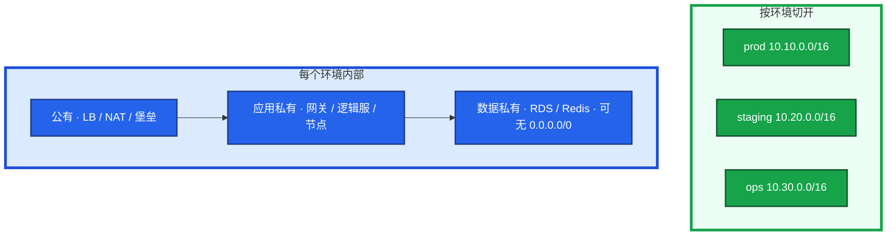
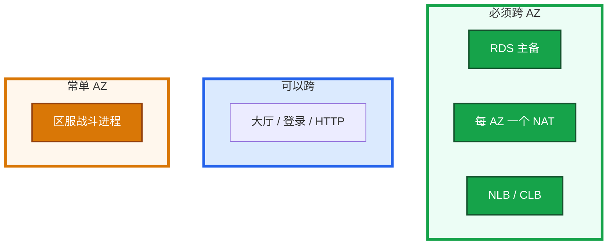
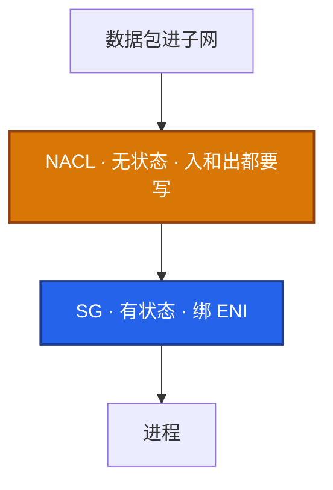
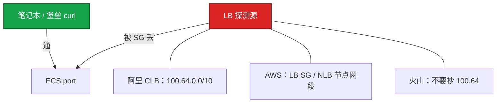
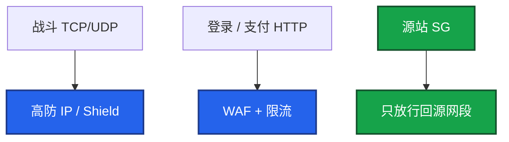

# 01｜云网络与安全 · 练习题

先自己画图或口述，再对照解答。每题标了覆盖范围：

| 标记 | 含义 |
|------|------|
| **核心** | 不懂整章就没建立起来 |
| **必会** | 值班和面试都要能讲 |
| **常用** | 线上会反复碰到 |
| **常考** | 白板和追问的高频口径 |

## 本题目录

- [Q1 生产 VPC 怎么划](#q1)
- [Q2 逻辑服要不要多 AZ](#q2)
- [Q3 出网偶发超时](#q3)
- [Q4 安全组 vs NACL](#q4)
- [Q5 本机通、LB 全红](#q5)
- [Q6 游戏端口怎么暴露](#q6)
- [Q7 SLB vs NLB / 心跳与 idle](#q7)
- [Q8 专线与 VPN](#q8)
- [Q9 WAF 和高防](#q9)
- [Q10 排障分流](#q10)
- [合上书](#合上书)

---

## Q1

**★★★★★｜生产 VPC 怎么划？为什么不能大家都用 10.0.0.0/16？**

**覆盖**：核心 · 必会 · 常考

### 场景

白板：「新环境从控制台默认网段建起来。半年后要对等生产、打专线。」有人说「一个大 VPC 用安全组隔离就行」。同时 ACK 节点池加不进去，报 `insufficient IP`。

### 完整解答

生产 VPC 是 **故障域 + 权限域 + 路由域**。按环境切开 CIDR，子网再拆公有、应用私有、数据私有。`10.0.0.0/16` 人人默认，一对等、打专线、CEN / TGW 就会路由冲突。

VPC CIDR 是路由和隔离的根；交换机 / 子网绑 AZ，创建后难改。Terway / AWS VPC CNI 按 Pod 占 IP，容量按峰值 Pod × 1.5 预留。给节点池划 `/24`（254 个地址）会耗尽：节点 NotReady、ENI 辅助 IP 分配失败。

止血：加 secondary CIDR 或新子网扩节点池，不要现场改已对等的生产网段。同账号多环境更稳的是独立 VPC。一个大 VPC 用安全组隔离能跑，误配爆炸半径大。

### 再追问

- ACK / EKS 节点池 IP 不够，缩副本假装资源够？——不行。Pod Pending、`failed to assign IP`。加网段或 prefix delegation，不是缩应用。
- 国内和出海可以同一套 `10.10.0.0/16`？——迟早要对等 / 打专线，提前避开重叠。隔离落地表在 04。

---

## Q2

**★★★★★｜游戏逻辑服要不要多 AZ？**

**覆盖**：核心 · 必会 · 常考

### 场景

架构评审有人写「全部多 AZ，所以 AZ 挂了玩家无感」。战斗服东西向 RPC 很密，AWS 账单里已经出现跨 AZ 流量。

### 完整解答

数据面（RDS / Redis / LB / NAT）必须多 AZ。有状态逻辑服常单 AZ：跨 AZ 延迟和（AWS）流量费，且 Session 在内存，AZ 故障本来就要踢人。把 AZ 风险写进 RTO，不要承诺玩家无感。

AZ 是机房级故障域。多 AZ 抗单机房，不抗地域。计算面跨 AZ 的 RPC / 帧同步会放大 RTT（同城通常 0.5–2ms）。AWS 明确对 AZ 间数据计费。

丢 AZ 时该 AZ 节点整片 NotReady；看 LB 是否把流量切到存活 AZ。如果健康检查也挂在故障 AZ 的探测路径上，流量还会往死节点打。

### 再追问

跨 AZ 流量为什么要钱？关掉 NLB 跨 AZ 呢？——AWS 对 AZ 间数据计费。关掉跨 AZ 能少付钱、适合区服绑单 AZ，代价是该 AZ 目标全挂时流量不自动漂。要显式选择并写进预案。

---

## Q3

**★★★★★｜私网访问公网偶发超时，VPC 内互访正常，怎么查？**

**覆盖**：核心 · 必会 · 常用

### 场景

活动期逻辑服调支付 / 账号 API 随机 `connect timeout`，拉镜像变慢。ping 同 VPC 的 RDS 正常。有人准备改安全组。

### 完整解答

先认定 NAT，不要先改 SG。私网出公网路径是 `0.0.0.0/0 → NAT → IGW`。瓶颈是带宽 / PPS、SNAT 端口耗尽、NAT 所在 AZ 故障。

一个 NAT IP 约 6 万源端口；同 dstIP:dstPort 最容易耗尽。本机 curl 偶发失败、换一个目标就好。AWS 看 `ErrorPortAllocation`、NAT Bytes；阿里云看 NAT 端口 / 并发水位。

没有公网 IP 的机器路由指到 IGW：出网黑洞，超时不是 ICMP 拒绝。公有子网要用 IGW 必须有公网 IP / EIP。

止血：加 NAT IP、升带宽、热点连接改连接池；镜像和对象存储改 VPC 内网 endpoint。治理：每 AZ 一个 NAT、本 AZ 路由；数据子网无出网；S3 / OSS / ECR 走 endpoint。

### 再追问

玩家流量会不会走 NAT？——不会，也不该。玩家连的是 LB / 高防。把下载走 NAT 会把账单和处理费一起打穿（见 06）。

---

## Q4

**★★★★☆｜安全组和 NACL 有什么区别？为什么生产以安全组为主？**

**覆盖**：必会 · 常用 · 常考

### 场景

有人从 AWS 文档抄了 NACL 示例，放行入站 80，HTTP 建连失败或极慢。另一边改了 SG，旧长连接还通，群里说「规则没生效」。

### 完整解答

SG 在网卡上、有状态，入站放行则回程自动放。NACL 在子网上、无状态，入和出都要写，按优先级先匹配。生产用 SG 按角色精细控制；NACL 只做粗禁（如整段禁公网 22），两层都精细会「都说放了但不通」。

NACL 放行入站 80 却不放出站临时端口 1024-65535，HTTP 建连失败。SG 不会踩这点。改了 SG，旧长连接还通：有状态 + conntrack。已建立连接可能直到超时才断，新连接立刻拒绝。排障要看是「新玩家进不去」还是「全断」。

### 再追问

conntrack 表满了会怎样？——`dmesg` 见 `nf_conntrack: table full` 时新连接失败、旧连接可能还活。调大 `nf_conntrack_max` 是止血；根因是超时过短狂建连或 UDP 打爆表。云上安全组在宿主机实现，实例内 conntrack 仍可能先满，两边都要看。

---

## Q5

**★★★★★｜本机 curl 通，负载均衡后端全 Unhealthy，为什么？**

**覆盖**：核心 · 必会 · 常考

### 场景

`curl 127.0.0.1:port` 200，办公网也能通。LB 控制台后端全红，玩家进不去。刚用 Terraform 建的安全组，变更只测了堡垒 ssh + curl。

### 完整解答

健康检查源不是你，也不是玩家。本机 curl 只证明进程在听，不证明探测路径通。LB 按检查失败摘流，业务端口对办公网开放也没用。

止血：放行探测源 CIDR 或 LB 安全组，看到 Healthy 再收紧。治理：backend SG 强制 `source = lb_sg`；上线清单含「LB 健康检查变绿」。

健康检查过严对有状态服的害：检查打到会阻塞的业务线程，瞬时变慢被摘流，正在打的玩家被踢到另一台。检查口要轻、与业务线程隔离。

### 再追问

NLB 开了 client IP 保留，SG 怎么写？——后端看到玩家 IP，业务端口可能要对 `0.0.0.0/0`，同时健康检查源仍是 NLB 网段，两组都要有。管理端口绝不能跟着重开。

---

## Q6

**★★★★★｜游戏长连接端口应该怎么暴露？能不能 ECS 绑 EIP？**

**覆盖**：核心 · 必会 · 常考

### 场景

测试期逻辑服绑了 EIP，安全组 `0.0.0.0/0` 放业务端口。正式开服后源站网卡 PPS 暴涨，高防流量图却正常。有人建议再买一台高防。

### 完整解答

玩家走高防 / NLB，后端在私网，SG 源是 LB 或高防回源段。逻辑服绑 EIP + `0.0.0.0/0` 放业务端口，源站 IP 泄漏后 DDoS 绕过高防直打，黑洞即整服没。高防只保护打到高防 IP 的流量，源站必须藏。

观测：源站网卡 PPS 暴涨但高防图正常；安全组 `0.0.0.0/0`；DNS / 旧 EIP 泄漏。止血：SG 收回仅回源段；切高防 CNAME；必要时换源站 IP。治理：对外 DNS 只指向高防；定期扫 EIP 和 `0.0.0.0/0`。

ACK / EKS LoadBalancer 改注解可能换 IP，客户端必须走域名。

### 再追问

ALB 能接自定义 TCP 战斗连接吗？——不能。ALB 是 HTTP。自定义 TCP / UDP 用 NLB / CLB。WebSocket 若是标准 HTTP 升级可以用 ALB，但 idle timeout 必须短于心跳。

---

## Q7

**★★★★☆｜CLB / NLB / ALB 怎么选？玩家定时被踢，进程没挂，怎么查？**

**覆盖**：必会 · 常用 · 常考

### 场景

Ingress 默认 ALB 注解套到了游戏端口。另一边战斗服进程正常，玩家大约每隔几分钟掉线一次。抓包看到有 FIN / RST，心跳是 5 分钟一次。HTTP 登录用的同一套 LB 超时配置。

### 完整解答

TCP / UDP 长连接用 CLB 或 NLB；HTTP 灰度、Header、gRPC 用 ALB。自定义 TCP 接 ALB：解析失败、超时和健康检查按 HTTP 来，随机断线。WAF 挂不到 NLB TCP。

LB idle timeout 短于心跳。CLB / NLB / ALB 默认几十秒到几分钟，游戏心跳 5 分钟一次会被静默拆连接。抓包见 LB 主动 FIN / RST，应用无崩溃。止血：心跳改为超时的 1/3，或调大 idle（有上限）。

四层会话保持按源 IP：运营商 NAT 后大量玩家同一出口，打到单机 CCU 畸形高。接入层要做连接级调度，不能指望源 IP 哈希。UDP 用会话超时，超时后五元组可能漂到别的后端。

### 再追问

跨云切换后集体掉线，优先怀疑什么？——新云 LB idle / UDP 会话超时默认值更短。名字都叫 NLB 不等于超时一样。切云验收必须单独测心跳（见 04）。

---

## Q8

**★★★★☆｜专线和 VPN 怎么选？玩家流量走专线吗？**

**覆盖**：必会 · 常用

### 场景

混合云：IDC 里还有自建库，云上跑逻辑服。有人提议玩家入口也走专线「更稳」。专线只有一条，UDP 战斗包随机丢，TCP 正常。

### 完整解答

专线给云 ↔ IDC 的生产数据面（库、内网 API），双线 + BGP。VPN 给管理面和专线备份，走公网有抖动。玩家在公网，不走专线也不走 VPN。

专线有带宽和时延承诺；VPN / 专线封装后 MTU < 1500，UDP 按 1500 会静默丢包。TCP 可 PMTU / 重传；游戏 UDP 常不处理分片，大包直接丢。排障用 `ping -M do -s` 测路径 MTU，两侧统一到 1400–1460 或 clamp MSS。

止血：切备专线或 VPN（仅管理）；UDP 降 MTU。根因：单专线当永远不会闪断。CDN 回源、玩家下载不该走专线。

### 再追问

专线闪断时为什么会出现双脑？——没有探测和主备切换时，两边都以为自己是主，DNS / 数据库跨云会双写或超时。单专线是单点，必须有切换，不能靠「应该很稳」。

---

## Q9

**★★★★★｜WAF 和高防差在哪？游戏端口接 WAF 行不行？**

**覆盖**：核心 · 必会 · 常考

### 场景

安全同学要把战斗端口接到 WAF。「反正都是防护」。开服当天 CCU 断崖，逻辑服 CPU 不高。

### 完整解答

不行。WAF 解析 HTTP，防注入和 CC。游戏 TCP / UDP 自定义协议 WAF 看不见。L3 / L4 用高防 / Shield；超过清洗阈值会黑洞。源站 SG 只放高防回源。

观测：高防流量与黑洞告警；CCU 断崖但逻辑服 CPU 不高 → 入口被洗，不要先重启逻辑服。止血：切高防 CNAME（提前演练 TTL）；确认源站没有被直打。AWS Shield Standard 抗常见 L3 / L4；大流量游戏仍要 Advanced 或第三方高防。国内主场用高防 IP / 游戏盾更常见。

### 再追问

源站已经在高防后面，为什么还会被直打？——测试域名、旧 EIP、客户端写死 IP、安全组 `0.0.0.0/0`。高防只保护打到高防 IP 的流量。源站必须从 DNS 和 SG 两头藏住。

---

## Q10

**★★★★☆｜通断问题你按什么顺序查？从改 SG 开始行不行？**

**覆盖**：必会 · 常用

### 场景

玩家进不去。群里同时有人改安全组、有人重启 NAT、有人准备切高防。没有人画出路径。四个工单：① 本机通 LB 红 ② VPC 内通出公网超时 ③ UDP 丢 TCP 不丢 ④ CCU 断崖 CPU 不高。

### 完整解答

不行。先画路径再改规则，否则把 conntrack、探测源、黑洞搅在一起。

| # | 走哪条 | 不要做 |
|---|--------|--------|
| ① | 探测源 CIDR / LB SG | 先重启进程 |
| ② | NAT 带宽 / SNAT / 单 AZ | 先改安全组 |
| ③ | MTU（专线 / VPN 封装） | 先调应用重传 |
| ④ | 黑洞 / 清洗 | 先重启逻辑服 |

现场：`ss` / 本机 curl → LB 健康 → SG 探测源 → NACL → 路由表（IGW 还是 NAT）→ conntrack → 进程。Flow log 只在「规则看起来对但仍丢包」时对 ENI 开，定向五元组。

### 再追问

为什么不要先重启逻辑服？——长连接可能还活着。入口被清洗、LB 摘流、探测源没放行，重启业务只会主动踢还在线的玩家，把事故面放大。

---

## 合上书

- [ ] 能画出公有 / 应用私有 / 数据私有，并说出 NAT 不是玩家入站路径
- [ ] 能说出按环境切开 CIDR；ACK / EKS 按峰值 Pod × 1.5 留 IP，`/24` 会耗尽
- [ ] 能区分数据面必须多 AZ 与战斗服常单 AZ；跨 AZ RTT 和 AWS 流量费
- [ ] 能对比 SG 有状态 vs NACL 无状态；本机通、LB 红先放探测源
- [ ] 能选出战斗走 NLB / CLB、HTTP 走 ALB；心跳 < idle 的 1/3
- [ ] 能说明专线给 IDC 数据面、玩家不走；UDP 丢先测 MTU
- [ ] 能用分流图处理通断，而不是先改 SG 或重启逻辑服
