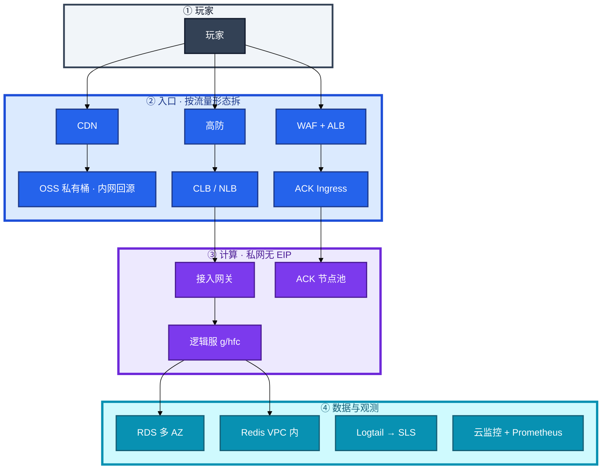
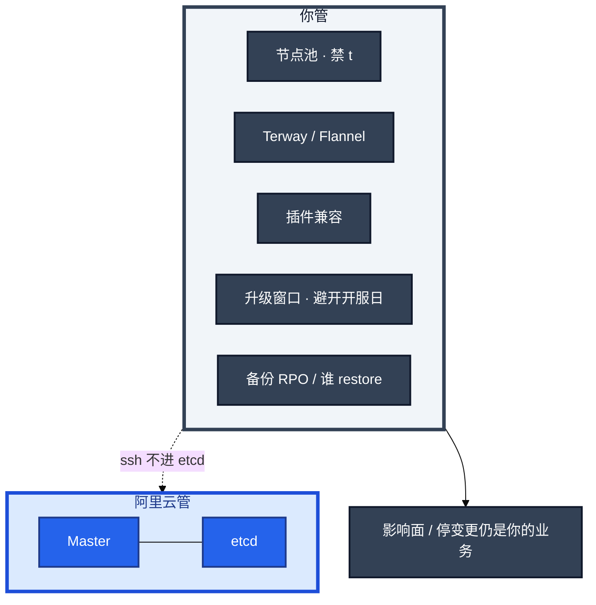
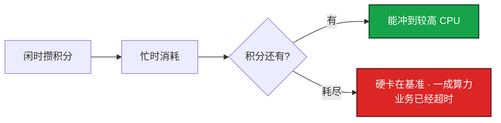
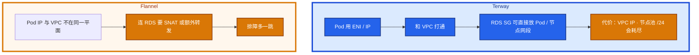
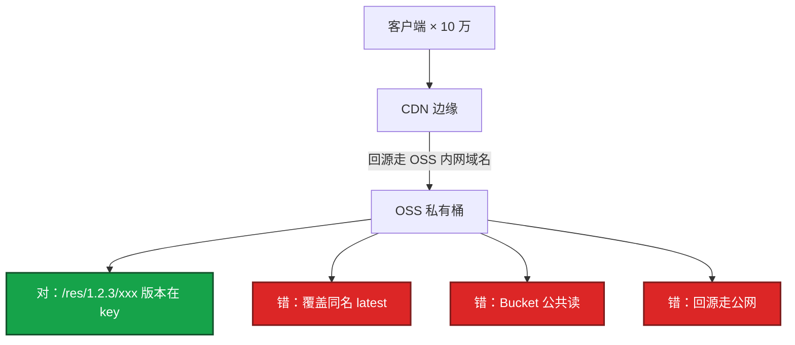
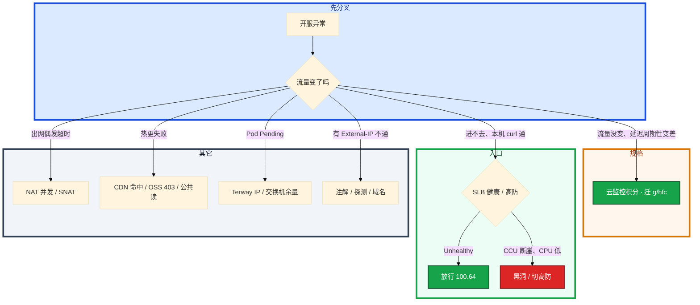

# 阿里云生产


开服当天，网关 P99 每 20 分钟抬一截，`top` 看不到打满。另一边 CLB 全红，本机 curl 全 200。群里有人要升配加 CPU，另有人要重启逻辑服。

这一章只做一件事——**规格怎么禁 t、探测怎么放 100.64、Terway IP 不够怎么加网段、RAM 角色怎么绑。** 前面的概念和原理，是为了让你动手时不选错产品层。

**读完你能：** 白板上画出国内游戏链路；t 系列积分耗尽和 CPU 打满能分开；ACK 托管了控制面，节点池、升级窗口、RPO 仍是你的。

**本章主线（开服就按这三步想）：**

1. **分层**：静态 CDN+OSS / 长连接 CLB+NLB / HTTP ALB+WAF；有状态战斗可不上 ACK。
2. **归类**：周期性卡顿 → t 积分；CLB 全红 → `100.64`；Pod Pending → Terway IP。
3. **留证**：ActionTrail + SLB 控制台；本机 curl 200 不证明探测通。

## 本章目录

- [1. 基本概念](#1-基本概念)
- [2. 架构图](#2-架构图)
- [3. 原理](#3-原理)
  - [3.1 ECS 规格与积分](#31-ecs-规格与积分游戏禁-t-系列)
  - [3.2 SLB vs ALB vs NLB](#32-slb-vs-alb-vs-nlb长连接不要接到-alb)
  - [3.3 ACK 控制面责任](#33-ack-控制面责任托管了什么你还管什么)
  - [3.4 RAM 求值入口](#34-ram-求值入口程序用角色不用长期-ak)
- [4. 安装部署](#4-安装部署)
  - [4.1 生产怎么选](#41-生产怎么选)
  - [4.2 ACK 落地](#42-ack-落地terway-吃-ip-lb-用域名)
- [5. 核心配置](#5-核心配置)
- [6. 命令与操作](#6-命令与操作)
- [7. 生产排障](#7-生产排障)
- [8. 必会 · 常考](#8-必会--常考)
- [合上书，问自己](#合上书问自己)

**本章不讲：** VPC / SG / NAT / 高防路径 → [01 云网络与安全](../01-云网络与安全/)；RDS 多 AZ vs 只读、备份 RPO、云 Redis 上限 → [05 云上存储与数据库](../05-云上存储与数据库/)；包年 / 按量 / 流量费 → [06 成本治理](../06-成本治理/)；RAM 求值细节、泄漏、多账号 → [07 IAM与多账号](../07-IAM与多账号/)；和 AWS / 火山对照 → [04](../04-多云对照/)、[03](../03-AWS生产/)、[08](../08-火山引擎生产/)；有状态服滚动、热更流程 → [08-游戏运维专题](../../08-游戏运维专题/)。

---

## 1. 基本概念

国内游戏这套组合不是「先买 ACK 再想网络」——**Terway 会反逼 VPC 规划**。先定网络和规格，再选 LB 类型，再决定哪些上 ACK。

| 在这套组合里 | 不在这套组合里 |
|--------------|----------------|
| ECS g / hfc、CLB / NLB 长连接、OSS+CDN 热更、ACK 节点池、SLS、RAM 角色 | 业务把 etcd 当锁；逻辑服绑 EIP；t 系列顶开服 |
| 人 = 控制台 + MFA；程序 = RAM 角色 / RRSA | 长期 AK 进 Git / 镜像 / 开服脚本 |
| 托管 Master / etcd | ssh 进 etcd 机器；开服日升控制面 |

有状态战斗服可以不上 ACK，理由是优雅下线、内核参数、固定容量，不是「不会 K8s」。能上的是大厅、登录、无状态 API。

三个角色不要混：

| 角色 | 干什么 |
|------|--------|
| **阿里云控制面** | ACK Master / etcd；SLB / RDS 的托管部分 |
| **你** | 节点池、网络插件、插件兼容、升级窗口、备份 RPO、Event / Webhook、业务停变更 |
| **RAM** | 人走 MFA 扮角色；程序走实例角色 / RRSA；禁止长期 AK |

> **记住**：托管不等于你不用懂。ssh 不进 etcd 机器，停变更的仍是你的业务。影响面问法见 [04-01 集群架构](../../04-Kubernetes/01-集群架构/)。

---

## 2. 架构图

后面排障都对着这张图。



**读图三句话：**
1. **静态 / 热更不走 ECS 网卡。** CDN → OSS 内网域名。
2. **战斗长连接不走 ALB。** 高防 → CLB / NLB → 私网网关。
3. **HTTP 登录 / 支付走 WAF + ALB。** 自定义 TCP 接到 ALB = 随机断线。

权限钉在图外一圈：人 = 控制台 + MFA；程序 = RAM 角色 / RRSA，禁止长期 AK。

ACK vs EKS 控制面怎么分（对照 03）：



托管：你看不见进程，停变更的仍是你的业务。上线前问清备份 RPO、谁 restore、升级是否滚动 etcd、磁盘是否独立。控制面升级期间 API 可能抖，GitOps / HPA 会受影响，不要和开服日重叠。

---

## 3. 原理

原理只保留动手和面试会用到的：为什么 t 系列会周期性卡、长连接接到哪、ACK 托管了什么、程序为什么不能用长期 AK。

**本节 4 块：** 3.1 ECS · 3.2 SLB · 3.3 ACK 责任 · 3.4 RAM

### 3.1 ECS 规格与积分：游戏禁 t 系列

**一句话：** t 系列积分耗尽是硬限速不是变慢；游戏禁 `ecs.t*`，抢占式不给逻辑服。

**打个比方：** t 系列像「透支信用卡 CPU」——积分花完不是变慢，是直接限速到 baseline，P99 每 20 分钟抬一截像心跳。

**面试怎么说**：「周期性卡顿先看 CPU 积分，不是先升配；游戏禁 t 系列和抢占式给逻辑服。」
**t 系列（突发性能）生产禁用于游戏。** 某卡牌开服，网关买了 t6「先顶一天」。流量曲线平稳，P99 却每 20 分钟抬一截。`top` 人人觉得没打满。

系统里发生了什么：t 系列有基准 CPU 百分比和 CPU 积分。闲时攒积分，忙时消耗。积分耗尽后 CPU 被硬限制在基准（常见 10%–20% 量级），不是「稍微慢一点」。游戏帧逻辑超时、GC 变慢。



你眼睛看到的：

- 云监控「CPU 积分余额」周期性掉光、回血、再掉光
- 利用率被卡在低基准，不是贴 100%；`top` 看不到打满
- 打满是利用率贴 100%、`top` 能看到忙；积分耗尽是利用率被卡在低基准

卡住先看规格族是不是 `ecs.t*`，不要先优化代码。止血：立刻变配到 g / hfc（要兼容变配约束，否则只能新开迁移）。活动中发现 t 系列，开服窗口不够就迁流量到 g 规格新实例。根因：有人按价格排序买了 t6 / t5。治理：Terraform 禁止 `ecs.t*`；开服模板白名单规格族。

怎么选：

| 场景 | 规格族 | 原因 |
|------|--------|------|
| 逻辑服、网关 | g 通用 / hfc 高主频 | 延迟敏感，要稳定算力 |
| 匹配 / 计算 | c 计算 | CPU 多、内存比低 |
| Redis / 单机缓存 | r 内存 | 内存带宽和容量 |
| 构建机、压测 | 按量或抢占式 | 可中断 |

抢占式（Spot）可给 CI、跑批、压测流量发生器；**不要给有状态逻辑服**——回收窗口短，踢人不可控。包年包月给基线 CCU，按量给活动峰值，见 06。

磁盘：系统盘云盘即可；数据盘看 IOPS。本地盘性能好但实例释放即没，且迁移受限，游戏服状态应在 Redis / RDS 而不是本地盘。24 核以上注意网络带宽基线，活动期网关先打满网卡再打满 CPU。

变配坑：部分规格只能停机变；t → g 常要换规格族。生产变更窗口按「是否停机」写进变更单，不要假设在线升配。

> **记住**：积分耗尽是限速不是变慢；游戏禁 `ecs.t*`，抢占式不给逻辑服。

### 3.2 SLB vs ALB vs NLB：长连接不要接到 ALB

**一句话：** 长连接走 CLB/NLB，HTTP 灰度走 ALB；探测必须放行 `100.64.0.0/10`。

**打个比方：** CLB 探测源 `100.64` 像「专用快递员」——你从堡垒 curl 通不等于 LB 通，没放这条 CIDR 后端全红。

**面试怎么说**：「CLB 全红本机 200，先放 100.64.0.0/10；Service 改 LB 注解可能换 IP，客户端必须用域名。」
和 01 同一套分层。阿里云落地必须单独走一遍探测源和注解。

| | CLB（传统） | ALB | NLB |
|--|------------|-----|-----|
| 层 | 4/7，TCP/UDP/HTTP | 7，HTTP/gRPC | 4，超高性能 |
| 游戏长连接 | 能用，会话保持按源 IP | 不适合非 HTTP 战斗连接 | 首选，PPS / 延迟更好 |
| 灰度 | 4 层基本没有 | Header / 路径 / 权重 | 无 L7 |
| ACK Ingress | 老 Ingress 常挂 CLB | 推荐 Ingress | 对应 LoadBalancer TCP |

**选错的典型事故：** 把 WebSocket / 自定义 TCP 接到 ALB，空闲超时、健康检查路径、HTTP 解析全对不上，表现为随机断线。HTTP 登录、支付、GM 走 ALB + WAF；战斗长连接走 NLB / CLB。

健康检查和 01 同一类故障，阿里云细节必须单独走一遍。Terraform 漏了「允许负载均衡探测」，开服前 30 分钟 CLB 全红，本机 curl 全 200。

1. CLB 四层检查只看端口；七层检查要正确的 URL 和状态码
2. 后端安全组必须放行 **负载均衡探测**（`100.64.0.0/10`）。控制台有开关，Terraform 漏掉就会「实例运行中、监听全挂」
3. 有状态服：健康检查失败会把正在打的玩家踢到另一台——检查端口不要和会阻塞的业务线程绑死，过严的检查比不过检查更危险

卡住先看哪：后端 SG 有没有 `100.64.0.0/10`、控制台探测开关有没有勾。不要先重启 ECS。火山引擎 **禁止照抄 100.64**（08）。

会话保持：四层按源 IP。NAT 后大量玩家同一出口 IP，会打到同一后端。全球玩家经运营商 NAT，开服时出现单机 CCU 畸形高、其他机器空转。此时要在接入层做连接级调度，不能指望源 IP 哈希。关掉会话保持，新连接可以打散；已有长连接还在旧后端。有状态服本来就该在接入层做连接级调度和 reconnection。

空闲超时：CLB TCP 可调，默认往往短于游戏心跳。调超时或加密心跳，两端必须一起改。UDP 监听要确认产品是否真支持（老 CLB 有限制），不支持就 NLB 或自建。

证书：HTTPS 在 ALB 卸载；游戏自定义加密在接入层，不要把证书私钥散落到每台 ECS。

ACK Service `LoadBalancer` 会自动开 CLB / NLB。注解写错规格、付费类型、健康检查，会出现「有 External-IP 但不通」。改注解可能重建 LB，**地址会变**——游戏客户端若写死 IP 会全军覆没，必须用域名。

> **记住**：长连接走 CLB / NLB，HTTP 灰度走 ALB；探测必须放行 `100.64.0.0/10`；ACK LB 用域名。

### 3.3 ACK 控制面责任：托管了什么、你还管什么

**一句话：** ACK 托管 Master/etcd；节点池、Terway、升级窗口、RPO 仍是你的。

**打个比方：** ACK 像「物业管电梯和消防」——你仍管房间装修（节点池）、住户数量（Pod IP）、搬家时间（升级窗口）。

**面试怎么说**：「托管不等于不用懂；Terway 按 Pod 占 IP，节点池 /24 是经典事故；ssh 不进 etcd 但 RPO 仍是你的。」
和 EKS 对照着记，不要背成「托管了就不用懂」。

| 项 | ACK（阿里） | EKS（AWS，细节 03） |
|----|-------------|---------------------|
| 控制面 | 阿里管 Master / etcd，跨 AZ | AWS 管控制面，跨 3 AZ |
| 你 ssh | **不进** etcd 机器 | 同样不进控制面节点 |
| 你负责 | 节点池、Terway / Flannel、插件兼容、升级窗口 | 节点组、VPC CNI、CoreDNS、控制器、升级节奏 |
| 网络插件 | Terway：Pod = VPC IP，吃 CIDR；Flannel：出 VPC 常 SNAT | VPC CNI：同样按 Pod 占 IP；prefix delegation |
| 工作负载身份 | **RRSA** 绑 ServiceAccount | **IRSA** 绑 SA，Trust 限制 `sub` |
| 升级 | 窗口自己选；控制面升级 API 可能抖 | 控制面和节点版本差不能跨太大 |
| 无状态突发 | ECI 适合 Job，**不适合**有状态战斗 | Fargate 同理，战斗用 EC2 节点 |
| 仍是你的 | Event 风暴、Webhook、备份 RPO、停变更的业务 | 同左；另加跨 AZ 流量费、健康检查源不是 100.64 |

网络：



活动扩容：节点池加机器，新 Pod Pending，Events 写 `insufficient IP`。系统里是 Terway 按 Pod 占 VPC IP。你眼睛看到交换机可用 IP 接近 0。卡住先加 secondary CIDR / 新子网，不要先缩节点。规划时按峰值 Pod × 1.5 预留（01）。

节点池：规格白名单禁 t；系统盘足够（镜像 + 日志）；数据盘走 PVC / 云盘 CSI，不把游戏状态落节点盘。弹性 ECI 适合突发无状态任务（跑批、一次性 Job），不适合有状态战斗服——要稳定节点、内核参数、可预期的摘流。

有状态游戏服上 ACK：要 PDB、优雅下线、session 迁移，细节在游戏运维模块。云上特有坑是：滚动时 SLB 摘流慢于 Pod 退出，或健康检查过快把正在 drain 的节点打成 Unhealthy 又打回去。

> **记住**：Terway 预留 VPC IP；RRSA 绑 SA，不要节点万能角色；LB 用域名。ACK 托管控制面，RPO 和升级窗口仍是你的。

### 3.4 RAM 求值入口：程序用角色，不用长期 AK

**一句话：** 人走 MFA 扮角色，程序走 RAM 角色/RRSA；永久 AK 按泄漏处理。
主账号（根）不开日常、不开 API。运维用人登录 + MFA；CI 和 ECS 用 **角色 / 实例 RAM 角色**，STS 临时凭证。长期 AK 出现在 Git、镜像、打包脚本，按泄漏应急处理（07）。

| 身份 | 走哪条 | 禁止 |
|------|--------|------|
| 人 | 控制台 + MFA，根账号不开日常 | 根 AK、无 MFA 登录 |
| ECS | 实例 RAM 角色 | UserData 里写永久 AK |
| ACK Pod | RRSA，绑具体 ServiceAccount | 节点角色 `*:*`；AK 进 Secret 挂全部 Namespace |
| CI / 开服脚本 | 角色 / STS | 流水线永久 AK；打包目录里的密钥 |

最小集：按环境拆 RAM 用户组（只读、变更、财务）；OSS 按 Bucket 前缀授权；禁止 `*:*`。ACK RRSA 按 ServiceAccount 绑角色，一个「万能 OSS 角色」挂全部 Pod 等于没做隔离。节点角色一宽，任意 Pod 都能调 API；RRSA 绑到具体 SA。

和 AWS IAM 的差别（细节求值在 03 / 07）：RAM 条件键、角色扮演流程不能把 AWS JSON 粘过来。对照时只记模型——**人走 MFA 扮角色，程序走实例角色 / RRSA，Trust 限制到具体身份**。泄漏后没有 ActionTrail 等于无法判断影响面。

操作审计：打开 ActionTrail，AK 调用失败和 `ConsoleSignin` 无 MFA 要告警。开服脚本同样走角色，打包目录里不许出现长期 AK。开服当天还来不及改 AK：先当泄漏处理——禁 Key、查 Trail、换角色，不要「开完服再收」。

> **记住**：人走 MFA 扮角色，程序走 RAM 角色 / RRSA，不用长期 AK。

---

## 4. 安装部署

### 4.1 生产怎么选

| 项 | 选 | 不选 |
|----|----|------|
| 规格 | g / hfc / c / r 白名单 | `ecs.t*`、抢占式给逻辑服 |
| LB | 长连接 CLB / NLB；HTTP ALB + WAF | 自定义 TCP 接 ALB |
| 热更 | OSS 私有桶 + CDN，回源内网 | ECS + Nginx 扛开服；Bucket 公共读 |
| ACK | 节点禁 t；Terway 按 Pod 留 IP | 开服日升控制面；ECI 跑战斗服 |
| 权限 | 角色 / RRSA；ActionTrail | 长期 AK；节点万能角色 |
| 磁盘 | 状态在 Redis / RDS | 游戏状态落本地盘 / 节点盘 |

变配：部分规格只能停机变；t → g 常要换规格族。变更窗口按「是否停机」写进变更单。

### 4.2 ACK 落地：Terway 吃 IP，LB 用域名

决策顺序：网络和规格 → LB 类型 → 哪些上 ACK。

验收：节点 Ready 不算数。必须交换机还有 IP 余量，`kubectl get svc` 的 External-IP 已进 DNS，控制面升级窗口不和开服日重叠。RRSA 绑到具体 SA，不要把 AK 放进 Secret。

CEN / 对等：多 VPC 同账号用对等即可；跨账号跨地域才上云企业网。CEN 路由学不会时，宁可少打通，不要把测试 VPC 接到生产 CEN 上「方便调试」。

---

## 5. 核心配置

只动有证据的项。改 LoadBalancer 注解可能换 IP。

| 参数 / 项 | 生产怎么用 | 改错会怎样 |
|-----------|------------|------------|
| 规格族 | Terraform 禁 `ecs.t*` | 积分耗尽，`top` 骗人 |
| CLB 探测 | SG 放行 `100.64.0.0/10` + 控制台开关 | 本机通、监听全红 |
| CLB idle | 心跳 < idle 的 1/3 | 进程还在、玩家定时被踢 |
| UDP 监听 | 确认产品真支持；不行就 NLB | 老 CLB 有限制 |
| ACK LB 注解 | 用域名；改注解当切入口 | 地址变了客户端全军覆没 |
| OSS | 私有桶、内网域名、版本在 key | 公共读 / 公网回源 = 账单炸 |
| CDN 刷新 | 覆盖同名必须刷新；强更分两步 | 客户端还是旧包；刷新有配额和延迟 |
| SLS 索引 | 克制；禁玩家 ID 当索引列 | 费用悄悄涨 |
| RDS 参数组 | 开服夜禁止顺手改 innodb | 有的要重启 |
| Redis | 连接 / 带宽 < 70%；无公网；配置端点 | 写死节点 IP，failover 后全断 |

> **记住**：quota 类问题（SLS 索引、OSS 公共读）先止血再开会。探测源漏了不要先重启 ECS。

---

## 6. 命令与操作

控制台和集群一起看。t 系列积分在云监控，本机 `top` 会骗人。

| 目的 | 控制台 / CLI | 看什么 |
|------|--------------|--------|
| 积分 | 云监控 CPU 积分余额 | 周期性掉光 = t 系列，不是打满 |
| 探测 | SLB 健康检查；本机是否有 100.64 来源 | 全红先放探测，不重启 |
| 节点 IP | 交换机可用 IP；`kubectl get nodes -o wide` | 接近 0 → secondary CIDR |
| LB 域名 | `kubectl get svc -A \| grep LoadBalancer` | EXTERNAL-IP 必须进 DNS |
| Trail | ActionTrail：`ConsoleSignin`、AK 失败 | 无 MFA、泄漏影响面 |
| 热更 | CDN 命中率、源站 403、OSS 流控 | 公共读立刻私有化 |

```bash
# 本机通不等于探测通：看有没有 100.64 来源
ss -lnt
curl -s -o /dev/null -w '%{http_code}\n' 127.0.0.1:port

# ACK 节点池 IP 余量和 LB 是不是域名
kubectl get nodes -o wide
kubectl get svc -A | grep LoadBalancer   # EXTERNAL-IP 必须进 DNS，禁止写进客户端
```

值班先看：SLB 新建连接、后端 Unhealthy 数、NAT 并发、RDS 连接、CDN 回源 4xx、SLS 摄入是否掉零。

---

### 6.1 OSS + CDN 热更

热更包、资源、日志归档放 OSS，**不要放 ECS 磁盘当下载源**。开服当天 10 万客户端拉 200MB 包，ECS 网卡和 SNAT 会先死。云盘是块设备，绑实例，吞吐有上限，没有边缘。RDS blob 当文件库同样错（05）。



生产配置：

1. Bucket 私有，CDN 用回源鉴权 / 私有 bucket 回源
2. 回源走 **OSS 内网域名**（同地域）
3. 生命周期：热更包 30 天标准 → 低频；日志 7 天标准 → 归档。规则按前缀，别对「当前 latest」做归档
4. 版本号在对象键里，发新包不覆盖旧键；覆盖同名文件必须刷新 CDN

一次大面积更新失败：客户端报下载失败。先看 CDN 命中率、源站 403（鉴权 / 时间差）、OSS 流控。个别地区慢：节点问题或 DNS 调度，对比直连 OSS 内网（只在 ECS 上测）和公网。误删：开版本控制；生产 Bucket 禁止匿名写；RAM 对删除操作单独授权并告警。

CDN 刷新不是瞬时全球一致。强更要「新包可下载」和「版本检查服务已切」分两步，留缓存窗口。ECS + Nginx 下包能扛小规模测试，扛不住开服，也没有边缘节点。

账单日炸：Bucket 公共读或回源走公网。立刻私有化 + 内网域名，再查访问日志谁在拖。细节账单在 06。不要先开会分析「是不是 CDN 配置」。

> **记住**：热更 OSS + CDN，Bucket 私有，回源内网；版本放对象键，少覆盖同名。

### 6.2 SLS 与云监控

SLS：采集（Logtail / Sidecar）→ 索引 → 查询 / 告警。对比自建 ES：免集群、按写入和存储计费、和 ACK / ECS 集成快。代价：查询语法和 ES 不同、超大索引成本会悄悄涨、长期归档仍要生命周期。自建 ES 只在查询模型和保留策略 SLS 搞不定时才上。

生产用法：K8s stdout → SLS；Nginx / 接入层访问日志 → SLS；告警用 SLS 时序 / SQL，不要只靠 grep 机器。索引字段要克制，高基数（玩家 ID 当索引列）会把费用打爆。账单爆通常是全字段索引 + 高基数 + Debug 全量打生产。

| 渠道 | 管什么 |
|------|--------|
| 云监控 | ECS / SLB / RDS 的 CPU、连接、后端健康数 |
| Prometheus | 业务黄金指标（CCU、登录成功率） |
| SLS | 日志，不要当时序库 |

开服夜三渠道同时炸 = 没去重。ARMS 是 APM，没做应用埋点就不要吹「全链路都在 ARMS」。没做 ARMS 埋点就不要吹全链路都在 ARMS。ECS / SLB / RDS 的厂商指标在云监控，SLS 管日志。

日志突然没了：先看 SLS 接入点流量是否掉零，再上机器查 Logtail 进程、配置是不是从错的机器组摘掉、RAM 有没有写权限。黄金指标仍用 Prometheus，SLS 管日志不要当时序库。

> **记住**：SLS 管日志，云监控管云资源，业务指标常自建 Prometheus；告警去重。

### 6.3 RDS / Redis 开服夜

数据面细节在 05，阿里云开服夜要盯的就这几条：

1. RDS 多 AZ，充值库更严；只读给报表，登录写路径不要指到只读
2. 参数组有的要重启，开服夜禁止「顺手改 innodb」
3. `max_connections`、`innodb_buffer_pool` 常被规格锁死，连接池 × 进程数要算总账
4. Redis 连接 / 带宽水位 < 70%；禁止公网地址；客户端用配置端点，不要写死节点 IP
5. 备份任务成功要告警；删除保护打开

### 6.4 开服当天组合检查

按这个清单过一遍，比再背一遍产品名有用：

- 规格：逻辑服 / 网关不是 t；网卡带宽基线 ≥ 活动预估 PPS
- 入口：高防 CNAME TTL 已演练；SLB 健康检查变绿；后端 SG 含 `100.64.0.0/10`
- 长连接：心跳 < CLB idle；UDP 若用了，确认监听类型真支持
- 热更：CDN 预热完成、命中率抽检、OSS 私有桶、回源内网
- ACK（若用）：节点池 IP 余量、PDB、LB 是域名不是 IP
- 数据：RDS 多 AZ、Redis 连接 / 带宽水位 < 70%、备份任务成功
- 日志：SLS 摄入没有掉零；告警去重（云监控 vs 自建 Prom vs SLS）
- 权限：开服脚本用角色，无长期 AK 在打包目录

活动开始 5 分钟看：SLB 新建连接、后端 Unhealthy 数、NAT 并发、RDS 连接、CDN 回源 4xx。任何一项跳变先止血再查。

---

## 7. 生产排障
和 01 同一套三问：进程还在不在？路径还通不通？已有流量还活不活？

**积分耗尽 = 限速，不是打满。** 全服进不去、进程还在，先看探测源和高防，不要先重启逻辑服。



| 现象 | 先做什么 | 不要做什么 |
|------|----------|------------|
| 流量没变、P99 周期性抬 | 规格是不是 `ecs.t*`；迁 g / hfc | 先给代码加核、假设在线升配 |
| 本机通、CLB 全红 | `100.64.0.0/10` / 探测开关 | 重启 ECS |
| CCU 断崖、CPU 不高 | 高防 / 黑洞 | 重启逻辑服 |
| 单机 CCU 畸形高、其它空转 | 四层源 IP 会话保持 + 运营商 NAT | 指望哈希自己打散 |
| OSS 账单炸 | 立刻私有化 + 内网回源，再查谁在拖 | 先开会分析 CDN |
| `insufficient IP` | 加 secondary CIDR | 缩节点；改已对等网段 |
| 改注解后全服连不上 | LB 地址变了，客户端必须走域名 | 写死 IP |
| 日志突然没了 | SLS 接入点流量、Logtail、RAM 写权限 | 先怪业务没打日志 |

国内生产故障三连：

1. **积分型卡顿**：流量没变、延迟周期性变差 → 查 t 系列积分，迁 g / hfc
2. **全服进不去、进程还在**：SLB Unhealthy + 本机 curl 通 → 探测源；或高防黑洞但源站 CPU 低
3. **账单日账单炸**：OSS 公共读或 CDN 回源走公网 → 立刻私有化 + 内网域名，再查访问日志谁在拖

某卡牌开服，网关买了 t6「先顶一天」。迁到 hfc 之后卡顿消失。同一天另一起：Terraform 漏了探测开关，CLB 全红，开服前 30 分钟才放行 `100.64.0.0/10`。

---

## 8. 必会 · 常考
白板和追问高频，能一口回：

| 说法 | 对错 | 口径 |
|------|:----:|------|
| 游戏可以用 t 系列先顶一天 | 错 | 积分耗尽硬卡基准，`top` 看不到打满 |
| 抢占式给逻辑服省钱 | 错 | 回收不可控 |
| 自定义 TCP 接到 ALB 做灰度 | 错 | 长连接走 CLB / NLB |
| 本机 curl 通说明 CLB 一定绿 | 错 | 必须放行 `100.64.0.0/10` |
| ACK 托管了就不用关心备份 | 错 | 停变更的是你的业务；问清 RPO |
| Terway 省心所以节点池 `/24` 够 | 错 | 按峰值 Pod × 1.5 留 IP |
| ECI 能跑战斗服 | 错 | 要稳定节点、内核、可预期摘流 |
| 节点角色给 OSS `*`，Pod 就不用 RRSA | 错 | 任一 Pod 逃逸搬空桶 |
| 长期 AK 放开服脚本，开完再收 | 错 | 先当泄漏：禁 Key、查 Trail |
| 热更放 ECS + Nginx | 错 | 开服打满网卡和 SNAT |
| Bucket 公共读省事 | 错 | 爬虫拖包，账单打穿 |
| 覆盖 latest 不用刷新 CDN | 错 | 缓存窗口；强更分两步 |
| 改 SLB 注解 IP 不会变 | 错 | 可能重建 LB，客户端走域名 |
| 四层会话保持能打散运营商 NAT | 错 | 同一出口 IP 打到单机 |
| 火山也能抄 100.64 | 错 | 每家探测源不同（08） |
| 三套告警一起响说明更全面 | 错 | 开服夜没去重 |

数字：积分基准常见 **10%–20%**；探测 **`100.64.0.0/10`**；Redis 水位 **< 70%**；热更生命周期 30 天 / 日志 7 天；峰值 Pod × **1.5**。

易混：积分耗尽 vs CPU 打满；CLB / NLB vs ALB；Terway vs Flannel；RRSA vs 节点角色；SLS vs 云监控 vs Prometheus；托管控制面 vs 你的 RPO；ACK vs EKS（探测源、CNI 名、身份名不同，责任模型相同）。

---

## 合上书，问自己

1. 国内游戏三条入口怎么拆？有状态服为什么可以不上 ACK？
2. t 系列积分耗尽和 CPU 打满怎么区分？变配窗口不够怎么办？
3. CLB / ALB / NLB 怎么选？`100.64` 是什么？改注解为什么必须用域名？
4. ACK 托管了什么？节点池、Terway、升级窗口、RPO 谁负责？和 EKS 差在哪？
5. 程序为什么不能用长期 AK？RRSA 和节点万能角色差在哪？
6. 开服 5 分钟先看哪几条？OSS 公共读账单炸先做什么？

六题都能口述，这一章就过了。下一章把出海钉死：NLB、IRSA、IAM 求值、本 AZ NAT。
