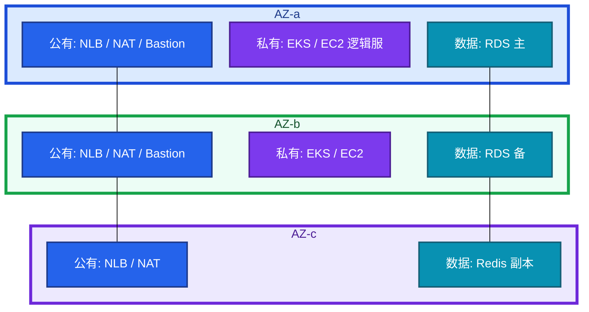
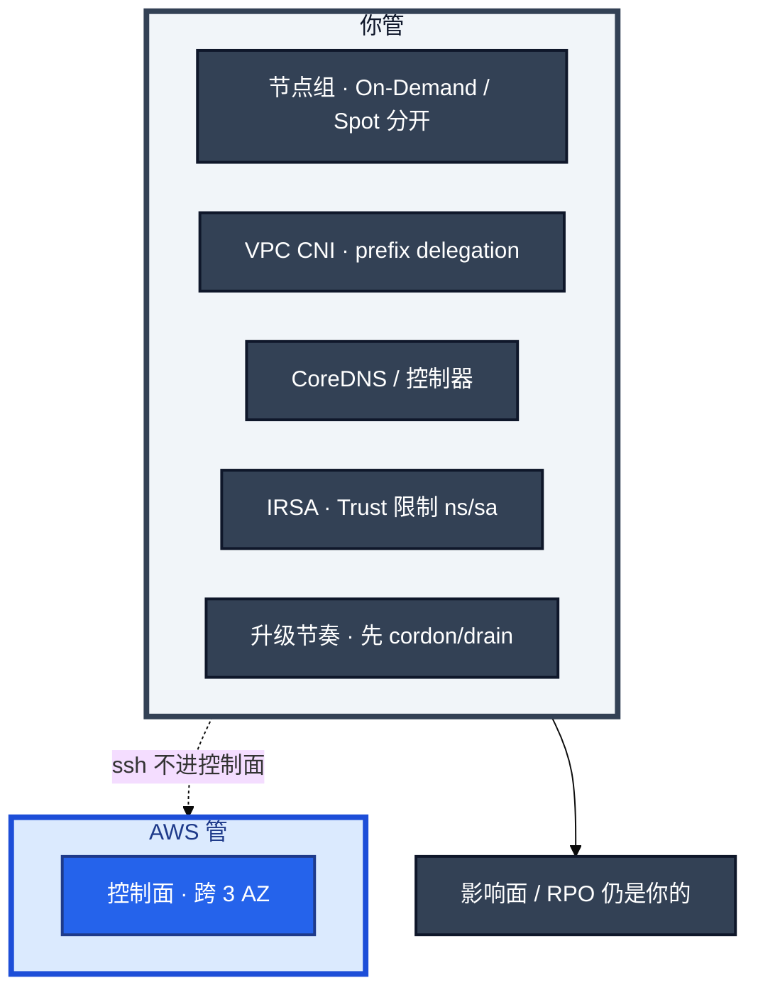
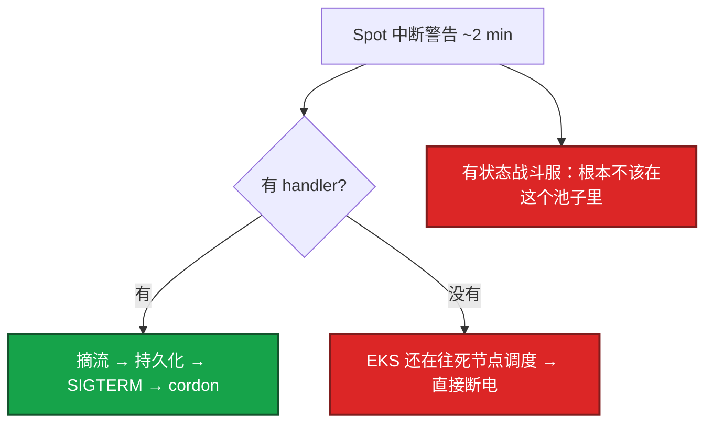
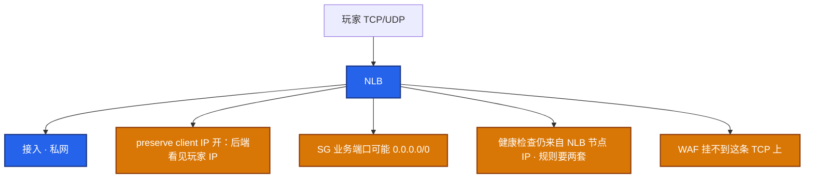
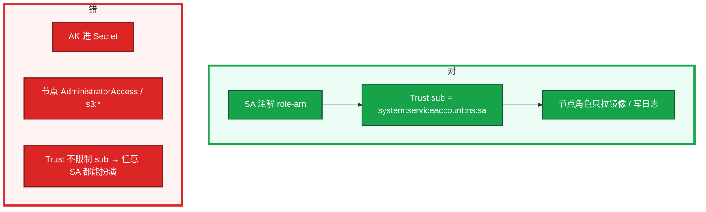
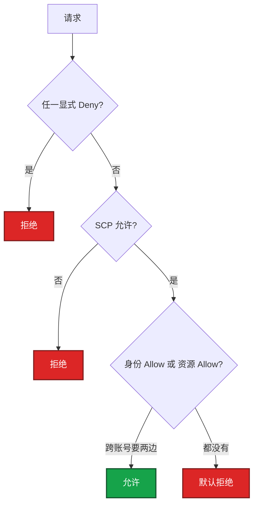
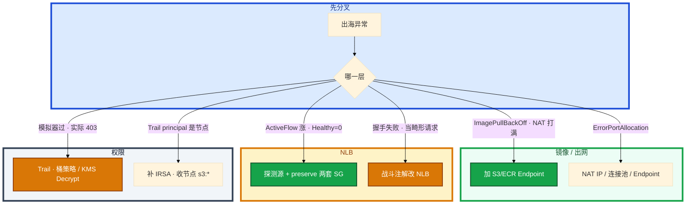

# AWS 生产


出海开服前夜，50 个节点同时拉 4GB 镜像，Pod 全 `ImagePullBackOff`。NAT 带宽和处理费一起打满。群里有人要扩 NAT，另有人把战斗 Service 注解成了 ALB。

这一章只做一件事——**本 AZ NAT、VPC Endpoint、NLB 两套 SG、IRSA Trust、Spot 两分钟怎么收尸。** 前面的概念和原理，是为了让你动手时不把中国区经验套到 Global。

**读完你能：** 白板上画出出海 VPC；长连接必须 NLB 能讲清探测源；IAM 模拟器过了实际 403 能去 Trail 而不是加 `*`。

**本章主线（出海就按这三步想）：**

1. **分层**：本 AZ NAT + S3/ECR Endpoint；游戏 NLB / HTTP ALB+WAF。
2. **归类**：ImagePullBackOff → Endpoint；Healthy=0 → 两套 SG；403 → Trail 不是模拟器。
3. **留证**：IRSA Trust 限制 `sub`；Spot 约 2 分钟，有状态不进池。

## 本章目录

- [1. 基本概念](#1-基本概念)
- [2. 架构图](#2-架构图)
- [3. 原理](#3-原理)
  - [3.1 跨 AZ 与 Endpoint](#31-跨-az-与-endpoint本-az-nat镜像不穿-nat)
  - [3.2 Spot 与 t 系列](#32-spot-与-t-系列两分钟中断)
  - [3.3 ALB vs NLB](#33-alb-vs-nlb游戏长连接选-nlb)
  - [3.4 EKS 控制面责任](#34-eks-控制面责任托管了什么你还管什么)
  - [3.5 IAM 求值](#35-iam-求值模拟器过了实际-403)
- [4. 安装部署](#4-安装部署)
  - [4.1 生产怎么选](#41-生产怎么选)
  - [4.2 EKS + IRSA 落地](#42-eks--irsa-落地节点角色要瘦)
- [5. 核心配置](#5-核心配置)
- [6. 命令与操作](#6-命令与操作)
- [7. 生产排障](#7-生产排障)
- [8. 必会 · 常考](#8-必会--常考)
- [合上书，问自己](#合上书问自己)

**本章不讲：** VPC / SG / NACL / NAT 通用模型 → [01](../01-云网络与安全/)；国内 ACK / CLB / OSS 组合 → [02](../02-阿里云生产/)；多云翻译、迁移、中国区 AWS vs 阿里 → [04](../04-多云对照/)；RDS / ElastiCache / 备份 RPO → [05](../05-云上存储与数据库/)；Spot / RI / NAT 处理费 / 跨 AZ 账单 → [06](../06-成本治理/)；泄漏应急、多账号、SCP → [07](../07-IAM与多账号/)；火山对照 → [08](../08-火山引擎生产/)。

---

## 1. 基本概念

出海落地和阿里同一套 VPC 模型（01），AWS 会追到具体资源名。先记住这几处会炸，再谈产品名。

| 和阿里最容易说错的 | 口径 |
|--------------------|------|
| 跨 AZ 流量要钱 | 逻辑服东西向一打，账单先于延迟爆 |
| NLB 是长连接默认解 | 自定义 TCP 接 ALB = 畸形请求 |
| 健康检查源不是 `100.64` | NLB 节点 IP / LB SG |
| IAM 求值更严 | Deny / SCP / 资源策略；模拟器常不带桶策略 |
| Spot 约 2 分钟中断通知 | 有状态战斗不用 |
| 中国区 AWS ≠ Global | 两套账号、两套 IAM，**同一个 AK 打不通** |

中国区（北京 / 宁夏）和 Global 是两套账号体系、两套 IAM。出海项目写清 region。高防、部分托管服务在中国区弱于阿里，不要把中国区经验直接当 Global 讲。简历写 Global region。

三个角色不要混：

| 角色 | 干什么 |
|------|--------|
| **AWS 控制面** | EKS Master / etcd（你 ssh 不进）；NLB / RDS 托管部分 |
| **你** | 节点组、VPC CNI、CoreDNS、控制器、升级节奏、RPO、停变更 |
| **IAM** | 显式 Deny 最大；跨账号身份 + 资源策略双允许；以 Trail 为准 |

> **记住**：本 AZ NAT；S3 / ECR 走 VPC Endpoint；中国区和 Global 账号隔离。托管不等于跳过这一章。

---

## 2. 架构图

后面排障都对着这张图。



**读图三句话：**
1. **本 AZ NAT**，避免跨 AZ 流量费 + 单点。数据子网可以没有默认出网。
2. **S3 / ECR 走 VPC Endpoint**，不穿 NAT。开服前夜镜像拉不下来，先加 Endpoint，不要先加 NAT 带宽硬扛。
3. **区服战斗常不放第三个 AZ。** 大厅 / 登录可以跨；有状态计算面常绑单 AZ（01）。

Subnet 创建时绑死 AZ，不能改。路由表：公有 `0.0.0.0/0 → igw`；私有 `0.0.0.0/0 → nat-xxx`（nat 必须是本 AZ）。

安全组绑 ENI。NLB 开了 client IP preservation 后，后端 SG 要放玩家 IP（常 `0.0.0.0/0` 在业务端口上）**同时**放行 NLB 健康检查网段。SSH 绝不能跟着重开。

EKS vs ACK 控制面（对照 02）：



Fargate 适合无状态小服务，有状态游戏进程要 EC2 节点（内核参数、hostNetwork、固定资源）。和 ACK 的 ECI 同一条红线。

---

## 3. 原理

原理只保留动手和面试会用到的：镜像为什么穿 NAT、Spot 两分钟够干什么、NLB 两套规则、EKS 你还管什么、模拟器为什么骗人。

**本节 5 块：** 3.1 Endpoint · 3.2 Spot · 3.3 NLB · 3.4 EKS 责任 · 3.5 IAM

### 3.1 跨 AZ 与 Endpoint：本 AZ NAT，镜像不穿 NAT

**一句话：** 本 AZ NAT；S3/ECR 走 VPC Endpoint，开服前夜不要让镜像穿 NAT。
**开服前夜镜像拉不下来。** 50 个节点同时拉 4GB 镜像，Pod 全 `ImagePullBackOff`。系统里是 EKS 节点拉 ECR 没配 VPC Endpoint，流量全穿 NAT。你眼睛看到 NAT 带宽和处理费一起打满，`aws-node` 不一定先报错。卡住先加 S3 / ECR Gateway 或 Interface Endpoint，不要先加 NAT 带宽硬扛。加 Endpoint 之后拉取走内网，NAT Bytes 掉下来。大流量不要穿 NAT，费用见 06。和阿里「OSS / 镜像走内网域名」是同一类坑，只是资源名叫 Endpoint。

IPv4 耗尽：VPC CNI 给每个 Pod 分配 VPC IP。`aws-node` 日志 `failed to assign IP`、Pod Pending。止血：加 subnet / prefix delegation；别用缩节点「看起来像资源不够」。规划时按 ENI 数量算 maxPods，不要按「机器还能 ssh」。峰值 Pod × 1.5 预留（01）。

数据子网可以不配 `0.0.0.0/0`，强制无出网。RDS / Redis 不该自己出公网拉东西。出网路径留给应用私有子网的本 AZ NAT。

### 3.2 Spot 与 t 系列：两分钟中断

**一句话：** Spot 约 2 分钟中断，有状态战斗不用；T3/T4g 同样禁用于游戏。
| 模式 | 何时用 | 何时不用 |
|------|--------|----------|
| On-Demand | 活动扩容、新服观察期、不确定容量 | 长期基线（太贵） |
| RI / Savings Plans | 跑了 3 个月以上的稳定逻辑服、EKS 系统节点 | 规格还在变、区服要关 |
| Spot | CI、压测、无状态统计、可重试 Job | 有状态战斗、单点 Redis、RDS 替代 |

**Spot 中断：实例被收回前约 2 分钟。** 活动期一批 Spot 节点同时收到警告。实例元数据 `/latest/meta-data/spot/instance-action` 或 EventBridge `EC2 Spot Instance Interruption Warning`。2 分钟不够做完整合服，只够：摘流量、持久化内存态、SIGTERM 让进程优雅退出。没接中断信号的进程 = 直接断电。



你眼睛看到的：CloudWatch / EventBridge 中断事件；kubelet 上若没配 interruption handler（如 AWS Node Termination Handler），Pod 直接没了，EKS 还在往死节点调度。

卡住先看：有状态工作负载是不是在 Spot 池。止血：活动期 Spot 被批量回收就切 On-Demand，不要在故障中抢容量。治理：有状态工作负载 `capacity-type=on-demand`；只在 NodePool 上标 Spot。Spot 和 On-Demand 分两个 ASG，不要一个组混容量类型还指望调度器懂业务。

t 系列（T3 / T4g burstable）同样禁用于游戏，机制与阿里云 t 相同：CPU credit 耗尽即限速。出海省钱用 Graviton（C7g / M7g）可以，但要过编译和延迟测试，不要空口「ARM 一定更快」。省钱用规格优化（含 Graviton）要过延迟测试，不是换 T 系列。

实例角色：EC2 Instance Profile 给节点，不要把永久 AK 写进 UserData。节点角色权限必须窄——真正的应用权限放 IRSA。

Savings Plans 比 RI 灵活（Compute SP 可跨规格族，盖 EC2 / Fargate / Lambda），但仍是承诺用量；用量掉下去一样浪费。Compute SP 盖不住 NAT 和流量——承诺买错品类是第二常见浪费。先砍闲置再买承诺（06）。承诺按 90 天最小常驻，不按开服峰值。

> **记住**：Spot 约 2 分钟中断，有状态服不用；t 系列同样禁。

### 3.3 ALB vs NLB：游戏长连接选 NLB

**一句话：** 游戏 TCP/UDP → NLB；preserve client IP 时 SG 写两套规则。
| | ALB | NLB |
|--|-----|-----|
| 协议 | HTTP/HTTPS/gRPC/WebSocket（HTTP 升级） | TCP/UDP/TLS |
| 延迟 | 多一跳 L7 解析 | L4，延迟和 PPS 适合战斗 |
| 目标类型 | IP / 实例 | IP / 实例 / ALB |
| 健康检查 | HTTP 路径 | TCP / HTTP |
| 空闲超时 | 默认 60s，最长 4000s | TCP 350s 量级，UDP 有独立超时 |

**自定义 TCP / UDP 游戏协议用 NLB。** 战斗 Service 注解成 ALB，自定义协议被当畸形请求，握手失败。WebSocket 若是标准 HTTP 升级，可以用 ALB，但 idle timeout 必须小于心跳，和阿里云同一类坑。HTTP 登录、支付、运营、EKS Ingress 走 ALB。WAF 关联在 ALB / CloudFront 上，不要幻想 WAF 能挂到 NLB TCP 端口。

NLB 考点跟着一次「连得上 NLB 进不了服」走：

1. **Preserve client IP**：后端看到真实玩家 IP，方便封禁；SG 不能只放 NLB 网段
2. **跨 AZ**：关掉跨 AZ 负载可减少流量费，但某 AZ 目标全挂时流量不会自动漂。游戏常按区服绑 AZ，显式选择
3. 注册目标后健康检查失败：目标 SG 未放行 NLB / 检查端口没听。NLB 的健康检查源是 NLB 节点 IP，不是你的笔记本，也不是阿里的 `100.64.0.0/10`



Preserve client IP 打开后 SG 只放了 VPC 网段：`ActiveFlowCount` 涨而 `HealthyHostCount` 为 0，流量在 LB 黑洞。卡住先补两套规则——业务端口给玩家 IP、健康检查给 NLB 节点 IP。SSH 绝不能跟着重开。和阿里 CLB 全红是同一类故障：探测源不是你。阿里放 `100.64.0.0/10`；AWS 放 NLB 节点 / LB SG。照抄必挂（04）。

证书：ACM 挂 ALB / NLB-TLS；私钥不出网。NLB TLS 卸载后后端可以是明文，VPC 内要清楚你是否接受。

目标组与连接耗尽：NLB 注册了实例但健康检查端口不是业务端口，同样会 HealthyHostCount=0。核对检查端口就是监听端口。不要先重启游戏进程。

> **记住**：游戏 TCP / UDP → NLB；HTTP → ALB + WAF；健康检查源是 NLB 节点，不是 100.64。

### 3.4 EKS 控制面责任：托管了什么、你还管什么

**一句话：** EKS 托管控制面；IRSA Trust 限制 `sub`，节点角色要瘦。
控制面 AWS 托管、跨 3 AZ。你负责：节点组、CNI、CoreDNS、控制器、升级节奏。

| 项 | EKS | ACK（02） |
|----|-----|-----------|
| 控制面 | AWS 管，跨 3 AZ | 阿里管 Master / etcd |
| 你 ssh | 不进控制面 | 不进 etcd 机器 |
| CNI | VPC CNI；IP 不够加 subnet / prefix delegation | Terway 吃 VPC IP；Flannel 出 VPC 常 SNAT |
| 身份 | IRSA：SA 注解 `eks.amazonaws.com/role-arn` | RRSA 绑 SA |
| Trust | `sub = system:serviceaccount:ns:sa` | 同样限制到具体 SA，不要把 AWS JSON 粘到 RAM |
| 控制器 | EBS CSI、AWS LB Controller 各自 IRSA | 少一个权限就 403，Service Pending |
| 升级 | 控制面和节点版本差不能跨太大；先 cordon / drain，PDB 挡着不要 `--force` | 窗口避开开服日 |
| 无状态 | Fargate 小服务 | ECI Job |
| 战斗服 | **EC2 节点** | **稳定节点池，不用 ECI** |

IRSA：给 ServiceAccount 注解 `eks.amazonaws.com/role-arn`，Pod 用 OIDC 换临时凭证访问 S3 / Secrets Manager，**节点 Instance Profile 不需要 s3:*。**



一次 Pod 403：业务要读 S3，Trail 里 principal 却是节点 Instance Profile，或 AccessDenied。系统里没做 IRSA：AK 进 Secret，或节点角色 `AdministratorAccess`。任一 Pod 逃逸都能搬空桶。卡住先看 SA 注解、Trust 的 `sub` 是否限制到 `system:serviceaccount:ns:sa`，不要给节点加 `s3:*` 验证「是不是权限问题」。

配套：EBS CSI 用 IRSA；AWS Load Balancer Controller 用 IRSA 建 ALB / NLB；少一个权限就 `controller` 日志 403，Service 一直 Pending。

IMDSv2：实例元数据强制 token，防 SSRF 把角色凭证偷走。新账号默认开；旧镜像还在 IMDSv1 要排期关。凭证从元数据来，所以节点角色必须瘦。

启动模板 / ASG：游戏按量扩要用启动模板钉死 AMI、SG、实例角色、子网。控制台手开的「临时一台」没有标签，活动后找不到、关不掉。

> **记住**：IRSA：SA 绑角色，Trust 限制 ns / sa；节点角色要瘦；IMDSv2。EKS 托管控制面，节点组和身份仍是你的。

### 3.5 IAM 求值：模拟器过了实际 403

**一句话：** 显式 Deny 最大；跨账号身份+资源策略双允许；以 Trail 为准。
求值顺序（能复述）：

1. 显式 Deny（身份策略、资源策略、SCP、权限边界任一 Deny）→ 拒绝
2. 组织 SCP 不允许的操作 → 拒绝
3. 身份策略 Allow 或资源策略 Allow（跨账号必须两边都允许）→ 允许
4. 默认拒绝



权限边界（Permissions Boundary）：角色「最多能有」的上限，防止自助开权限的人给自己 `*`。和生产最小权限是两层：边界是天花板，策略是实际开门的钥匙。SCP 是组织对账号的天花板。两层都是防「自己给自己开 *」。

STS AssumeRole：人从 SSO 扮演角色，程序从 IRSA / Instance Profile 扮演。永久 AK 只留给无法用角色的破旧系统，并强制轮换 + 告警。

一次「模拟器过了、实际 403」：人在 Policy Simulator 里 Allow，Pod 读加密桶仍 403。系统里漏了桶策略或 KMS `Decrypt`，模拟器默认不带资源策略。你眼睛以 CloudTrail `AccessDenied` 事件里的 Action 和资源为准。卡住去 Trail 搜，不要猜策略，不要加 `AdministratorAccess` 验证。更完整的泄漏应急和多账号见 07。

默认拒绝：没有 Allow 就是拒绝。不是「没写就过」。跨账号缺桶策略一边，身份策略写得再满也 403。

和 RAM 对照：模型相同（人 MFA 扮角色、程序用角色、禁长期 AK），求值更常考 Deny / SCP / 资源策略。RAM JSON 粘到 IAM 会字段名、条件键全错。

> **记住**：显式 Deny 最大；跨账号身份 + 资源策略双允许；以 Trail 为准。

---

## 4. 安装部署

### 4.1 生产怎么选

| 项 | 选 | 不选 |
|----|----|------|
| NAT | 每 AZ 一个，本 AZ 路由 | 单 NAT 跨 AZ |
| 镜像 / 对象 | S3 / ECR VPC Endpoint | 开服前夜穿 NAT 拉 4GB 镜像 |
| LB | 游戏 TCP/UDP → NLB；HTTP → ALB+WAF | 战斗注解 alb；WAF 挂 NLB TCP |
| 规格 | On-Demand 战斗节点；禁 T3 / T4g | Spot 混战斗池 |
| 身份 | IRSA + Trust 限制 sub；IMDSv2 | 节点 s3:*；UserData 永久 AK |
| 账号 | Global 与中国区隔离，简历写 region | 同一把 AK 打 `us-east-1` 和宁夏 |
| 数据子网 | 可不配 `0.0.0.0/0` | RDS 自己出公网 |

### 4.2 EKS + IRSA 落地：节点角色要瘦

验收：控制面 Ready 不算数。必须 Endpoint 已通（镜像不穿 NAT），NLB HealthyHostCount > 0，IRSA Trust 限制到具体 ns/sa，节点角色无 `s3:*`，战斗节点 On-Demand。

Spot 节点组和 On-Demand 系统节点组分开。升级：游戏服节点要先 cordon / drain，PDB 挡着就不要 `--force`。

---

## 5. 核心配置

只动有证据的项。改 preserve client IP 必须同时改 SG。

| 参数 / 项 | 生产怎么用 | 改错会怎样 |
|-----------|------------|------------|
| 路由 | 公有 → igw；私有 → 本 AZ NAT | 跨 AZ NAT 又贵又单点 |
| Endpoint | S3 Gateway + ECR Interface | ImagePullBackOff + NAT 账单 |
| NLB idle | 心跳 < idle 的 1/3；UDP 单独测 | 进程还在、集体掉线 |
| preserve client IP | 业务端口 + NLB 检查源两套；SSH 不跟着 | ActiveFlow 涨、Healthy=0 |
| 跨 AZ 负载 | 区服绑单 AZ 则显式关；写进预案 | 默认开着却说「已经多 AZ」 |
| IRSA Trust | `sub = system:serviceaccount:ns:sa` | 任意 SA 扮演 |
| IMDSv2 | 强制 token | SSRF 偷节点凭证 |
| S3 | 生命周期按前缀；Block Public Access | 整桶 Glacier 把 latest 归档 |
| 启动模板 | 钉死 AMI、SG、角色、子网、标签 | 手开临时机活动后关不掉 |

> **记住**：健康检查源按 NLB 节点放行，不抄 100.64。KMS 桶要 `kms:Decrypt`，模拟器没带资源策略会误导。

---

## 6. 命令与操作

控制台指标往往比 ssh 更早。

| 目的 | 控制台 / CLI | 看什么 |
|------|--------------|--------|
| Spot | `curl -s http://169.254.169.254/latest/meta-data/spot/instance-action`；EventBridge | 两分钟窗口，没 handler = 断电 |
| NAT | CloudWatch `ErrorPortAllocation` | SNAT 满；先加 IP / Endpoint |
| NLB | `ActiveFlowCount` 涨 + `HealthyHostCount=0` | 流量在 LB 黑洞 |
| IRSA | Trail 里 principal 应是角色，不是节点 Instance Profile | Trust 必须有 sub |
| IAM 403 | CloudTrail `AccessDenied` 的 Action / Resource | 不要加 AdministratorAccess 验证 |
| Flow log | 对 ENI、拒绝记录 | SG 已放行仍丢时才开 |

```bash
# Spot 中断：两分钟窗口，没 handler 等于断电
curl -s http://169.254.169.254/latest/meta-data/spot/instance-action
```

值班先看：NLB UnHealthyHostCount、NAT ErrorPortAllocation、ECR 是否走 Endpoint、Trail AccessDenied。

---

### 6.1 S3 生命周期：按前缀

热更、日志、Terraform state、备份都进 S3。生产规则按 **前缀**，不要整桶一刀切：

| 前缀 | 策略 |
|------|------|
| `res/current/*` | 标准，不自动归档、不过期 |
| `res/old/*` | 30 天 → IA，180 天 → Glacier |
| `logs/*` | 7 天标准，30 天过期 |
| `tfstate/*` | 标准 + 版本控制，禁止过期删除 |

Intelligent-Tiering 适合访问模式说不清的桶；热更「最新包」访问极热，不适合乱扔 Glacier。Glacier 取回有时间和钱，回档演练要真拉一次，不要只看「有生命周期」。没真 restore 过的 RPO 是假的（05）。

和阿里 OSS 对照：私有桶、内网 endpoint、版本在 key 里、禁止公共读，原则相同。AWS 多出来的坑是 Block Public Access、OAC、KMS `kms:Decrypt`。关掉 ACL，用 Bucket Policy + IAM。例外必须写进变更单（例如极少的公共静态，更好是 CloudFront OAC）。

state 桶禁止 List+Delete 给普通角色。版本控制防误删；管理删除加 MFA Delete（账号级约束，团队要能操作）。

一次热更 403：CDN / 客户端报 403，不是 404。系统里常见是 OAC、时间偏差、KMS 权限缺 `kms:Decrypt`。你眼睛在 Trail 里看到 `AccessDenied` 的 Action 和资源。卡住先对 Trail，不要先改对象键。模拟器没带资源策略会误导。生命周期误删热更包：靠版本控制还原，没有版本控制就走备份桶。治理：生产桶 Terraform 管，控制台改 Public 出告警。和 OSS 公共读一样，公共桶是流量炸弹。

RDS 多 AZ、只读、备份 RPO 与阿里同一套模型，细节在 05。出海额外盯：跨地域备份的驻留合规；客户端用配置端点，failover 后 IP 会变。

> **记住**：生命周期按前缀；403 常见原因是 Block Public / OAC / KMS Decrypt。

### 6.2 CloudWatch vs Prometheus

CloudWatch：EC2 / RDS / NLB / NAT 的云厂商指标、日志、告警、EventBridge。优点是开箱、和 Auto Scaling / Spot 事件一体。缺点：自定义指标贵、基数一高账单吓人、PromQL 生态没有、游戏业务指标（CCU、登录成功率）用 Prom 更自然。

生产常见：**CloudWatch 管云资源和 AWS 事件，Prometheus + Grafana 管应用黄金指标，日志用 CloudWatch Logs 或 Loki / SLS 类。** 不要把「我们全在 CloudWatch」说成高级——大厂出海多数是混合。小规模可以只用 CloudWatch。游戏黄金指标和 PromQL 生态、HPA 自定义指标，多数团队仍自建 Prom。和阿里「云监控 + SLS + Prom」是同一分工。

ALB / NLB 指标：`UnHealthyHostCount`、`ActiveFlowCount`、`NewFlowCount`。NAT：`ErrorPortAllocation`。这些比 ssh 上机器猜更早。`ActiveFlowCount` 涨而 `HealthyHostCount` 为 0，流量在 LB 黑洞。

Agent：CW Agent 收 syslog 可以；容器场景仍是 sidecar / DaemonSet 打 Prom。指标双写要控制基数（player_id 当 label 会把两边都打爆）。

VPC Flow Logs：排「SG 已放行仍丢」时对 ENI 开，不要全 VPC 开去海选。拒绝记录比全量有用。和 conntrack 满、NACL 无状态是三条平行线，先看症状再开日志。`ErrorPortAllocation` = SNAT 端口耗尽，大量连接到同一目标 IP:443（01）。先加 NAT IP / 连接池 / Endpoint，不要先改业务代码重试把连接打得更满。

> **记住**：CloudWatch 看云资源；CCU 等业务指标用 Prometheus。

### 6.3 出海检查清单

1. 本 AZ NAT；数据子网可不配默认出网
2. S3 / ECR VPC Endpoint，开服前夜不要让镜像穿 NAT
3. 游戏 TCP / UDP → NLB；HTTP → ALB + WAF
4. NLB 健康检查源按 NLB 节点 IP 放行，不抄 100.64
5. Preserve client IP 时 SG 两套规则；SSH 不跟着开
6. IRSA：SA 绑角色，Trust 限制 ns / sa；节点角色瘦；IMDSv2
7. S3 生命周期按前缀；state / current 不过期删除；Block Public Access
8. Spot 不进战斗节点；T3 / T4g 禁用
9. 中国区账号和 Global 隔离，简历写清 region

和阿里云差别收口：IAM 求值更严、跨 AZ 流量要钱、NLB 是长连接默认解、中国区和 Global 账号隔离。细节对照表见 04。和阿里开服清单同构：规格、入口、心跳、热更、数据、日志、无长期 AK。不同的是 Endpoint、IRSA、跨 AZ 计费、健康检查源。

---

## 7. 生产排障
和 01 同一套三问：进程还在不在？路径还通不通？已有流量还活不活？

**连得上 NLB、进不了服 = 流量在 LB 黑洞，不是进程死了。**



| 现象 | 先做什么 | 不要做什么 |
|------|----------|------------|
| ImagePullBackOff + NAT 打满 | VPC Endpoint | 先扩 NAT |
| `failed to assign IP` | 加 subnet / prefix delegation | 缩副本 |
| ActiveFlow 涨、Healthy=0 | NLB 检查源 + preserve 业务端口 | 重启游戏进程 |
| 战斗握手失败 | 改 NLB，不要 ALB | 把 WAF 挂到 TCP |
| 模拟器 Allow、实际 403 | Trail AccessDenied | 加 AdministratorAccess |
| Spot 批量回收 | 切 On-Demand；有状态不该在池里 | 故障中抢 Spot |
| 手开临时机活动后找不到 | 启动模板 + 标签 | 控制台点一台 |

游戏故事：出海开服前夜滚动，ECR 没配 VPC Endpoint，NAT 带宽和处理费一起打满。加 Endpoint 之后拉取走内网。同一周另一起：战斗 Service 注解成 ALB，自定义协议被当畸形请求，改 NLB 才通；Preserve client IP 打开后 SG 只放了 VPC 网段，`HealthyHostCount` 归零，玩家连得上 NLB 进不了服。

---

## 8. 必会 · 常考
白板和追问高频，能一口回：

| 说法 | 对错 | 口径 |
|------|:----:|------|
| 自定义 TCP 用 ALB，WAF 可以挂上 | 错 | 长连接 NLB；WAF 挂不到 TCP |
| 健康检查抄阿里 `100.64` | 错 | NLB 节点 IP / LB SG |
| preserve client IP 后 SG 只放 VPC 网段 | 错 | 业务端口 + 检查源两套；SSH 不跟着 |
| Spot 给战斗服省 70% | 错 | ~2 分钟中断，不够合服 |
| T3 / T4g 出海能给游戏用 | 错 | CPU credit 耗尽即限速 |
| EKS 托管了就不用懂 CNI / IRSA | 错 | 节点组、身份、RPO 仍是你的 |
| 节点角色 s3:* 就不用 IRSA | 错 | 任一 Pod 逃逸搬空桶 |
| Trust 不限制 sub 也行 | 错 | 集群里任意 SA 可扮演 |
| 模拟器过了就是有权限 | 错 | 常漏桶策略 / KMS Decrypt；以 Trail 为准 |
| 没有 Allow 就会默认放过 | 错 | 默认拒绝 |
| 镜像穿 NAT 先加带宽 | 错 | 先 Endpoint |
| 中国区 AWS 当阿里云用，同一把 AK | 错 | 两套账号两套 IAM |
| 全在 CloudWatch 更云原生 | 错 | CCU 用 Prom；混合是常态 |
| 整桶 30 天进 Glacier | 错 | `current` 不过期；按前缀 |
| Fargate 跑战斗服 | 错 | 要 EC2 节点 |
| Compute SP 能盖 NAT 和流量 | 错 | 盖不住；先砍闲置再买承诺 |

数字：Spot 中断约 **2 分钟**；ALB idle 默认 **60s**，最长 **4000s**；NLB TCP idle **350s** 量级；跨 AZ RTT 见 01 **0.5–2ms**。

易混：NLB vs ALB；探测源 vs 玩家 IP；IRSA vs 节点 Instance Profile；显式 Deny vs 默认拒绝；Gateway Endpoint vs Interface Endpoint；中国区 vs Global；ACK RRSA vs EKS IRSA（模型同、JSON 不能粘）。

---

## 合上书，问自己

1. 出海 VPC 和阿里差在哪几处会炸？本 AZ NAT 和 Endpoint 解决什么？
2. 为什么长连接必须 NLB？preserve client IP 时 SG 写几套？健康检查源是谁？
3. Spot 两分钟够干什么？T3 能不能给游戏用？
4. EKS 托管了什么？IRSA Trust 不限制 sub 会怎样？和 ACK / RRSA 怎么对照？
5. IAM 求值四步？模拟器过了实际 403 看什么？
6. 开服前夜检查顺序？中国区 AWS 能不能当阿里云用？

六题都能口述，这一章就过了。下一章把五朵云翻成一张对照表：迁移难在入口默认值，不是改机型。
