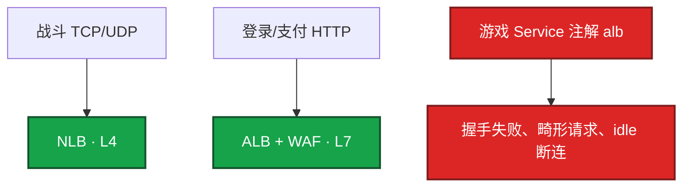
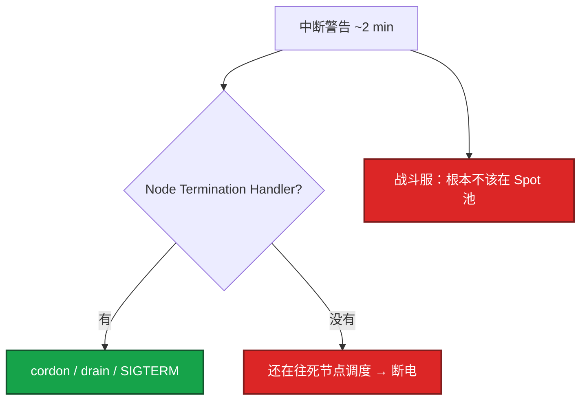
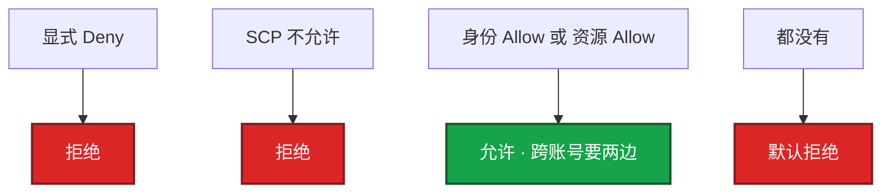
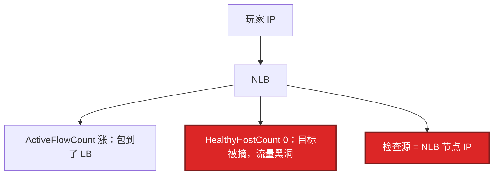

# 03｜AWS 生产 · 练习题

先自己画图或口述，再对照解答。每题标了覆盖范围：

| 标记 | 含义 |
|------|------|
| **核心** | 不懂整章就没建立起来 |
| **必会** | 值班和面试都要能讲 |
| **常用** | 线上会反复碰到 |
| **常考** | 白板和追问的高频口径 |

## 本题目录

- [Q1 长连接为什么用 NLB](#q1)
- [Q2 Spot 两分钟](#q2)
- [Q3 IRSA 与 Trust](#q3)
- [Q4 IAM 求值 / 模拟器 403](#q4)
- [Q5 ECR 穿 NAT](#q5)
- [Q6 S3 生命周期](#q6)
- [Q7 CloudWatch vs Prom](#q7)
- [Q8 NLB 黑洞](#q8)
- [Q9 中国区 vs Global](#q9)
- [Q10 开服前夜清单](#q10)
- [合上书](#合上书)

---

## Q1

**★★★★★｜游戏长连接为什么用 NLB 不用 ALB？**

**覆盖**：核心 · 必会 · 常考

### 场景

EKS Ingress 默认 ALB 注解套到了战斗端口。握手失败、空闲被拆。安全同学还要把 WAF 挂到同一条 TCP 上。

### 完整解答

ALB 是 HTTP(S) / gRPC。自定义 TCP / UDP 战斗协议必须 NLB（L4，延迟和 PPS 合适）。WebSocket 若是标准 HTTP 升级可以用 ALB，但 idle timeout 默认 60s，必须短于心跳。WAF 关联在 ALB / CloudFront 上，挂不到 NLB TCP。

Preserve client IP 之后：后端看到玩家 IP，业务端口可能 `0.0.0.0/0`；健康检查仍来自 NLB 节点 IP，规则要两套。SSH 绝不能跟着重开。健康检查源不是阿里的 `100.64.0.0/10`。

### 再追问

关掉 NLB 跨 AZ 的利弊？——少付跨 AZ 流量，适合区服绑单 AZ。代价是该 AZ 目标全挂时流量不自动漂。要显式选择并写进预案，不要默认开着也不要默认关着却说「我们已经多 AZ」。

---

## Q2

**★★★★★｜Spot 被回收前有多久？游戏能不能用？**

**覆盖**：核心 · 必会 · 常考

### 场景

有人把战斗节点组混了 Spot「省 70%」。活动期一批实例被收，EKS 还在往这些节点调度。财务很高兴，玩家在掉线。

### 完整解答

大约 2 分钟，元数据 `spot/instance-action` 或 EventBridge 中断事件。2 分钟只够摘流和持久化，不够合服。有状态战斗服、单点 Redis 不用 Spot；CI / 压测 / 可重试 Job 可以用。

止血：活动期切 On-Demand，不要在故障中抢 Spot。治理：有状态 `capacity-type=on-demand`；Spot 单独 NodePool。Savings Plans 和 RI：基线稳定再用。Compute SP 跨规格更灵活，盖不住 NAT 和流量。用量掉下去一样浪费。先砍闲置再买承诺。承诺按 90 天最小常驻，不按开服峰值。

### 再追问

T3 / T4g 出海能给游戏用吗？——不能。CPU credit 耗尽即限速，和 `ecs.t` 同一类事故。省钱用规格优化（含 Graviton）要过延迟测试，不是换 T 系列。

---

## Q3

**★★★★★｜IRSA 解决什么问题？Trust Policy 不限制 sub 会怎样？EKS 托管了还要你管什么？**

**覆盖**：核心 · 必会 · 常考

### 场景

节点 Instance Profile 给了 `s3:*`。有人说「反正已经能拉桶，还上 IRSA 干什么」。另一个角色做了 IRSA，Trust 里没有 `sub` 限制。老板说上 EKS 就不用懂安装。

### 完整解答

Pod 用 ServiceAccount 换 IAM 角色，不把 AK 放进 Secret，节点角色也不需要 `s3:*`。Trust 必须限制 `system:serviceaccount:ns:sa`，否则集群里任意 SA 都能扮演该角色。

EKS 托管控制面、跨 3 AZ，ssh 不进。你仍负责：节点组、VPC CNI、CoreDNS、控制器、升级节奏、RPO。Fargate 不适合战斗服：要内核参数、hostNetwork、可预期 drain，用 EC2 节点组。IMDSv2 强制 token，防 SSRF 偷节点凭证；节点角色更必须瘦。

观测：Pod 403、节点角色过宽、CloudTrail 调用主体是节点而不是角色。止血：收节点策略、补 IRSA、限制 Trust。EBS CSI、LB Controller 各自独立角色。少一个权限就 controller 日志 403，Service 一直 Pending。

### 再追问

和 ACK RRSA 怎么对照？——同一模型：Pod 扮角色、绑具体 SA、节点角色要瘦。名字不同，Trust / OIDC 细节按各自文档，不要把 AWS JSON 粘到 RAM。

---

## Q4

**★★★★★｜IAM 求值顺序是什么？为什么模拟器过了实际 403？**

**覆盖**：核心 · 必会 · 常考

### 场景

IAM Policy Simulator 显示允许。Pod 读 S3 仍 403。桶开了 KMS，跨账号。有人准备加 `AdministratorAccess`「验证是不是权限问题」。

### 完整解答

显式 Deny 优先，然后 SCP，然后身份或资源策略 Allow，默认拒绝。跨账号必须两边允许。403 常因漏了桶策略 / KMS `Decrypt`，模拟器没带资源策略会误导。以 CloudTrail `AccessDenied` 为准。

权限边界是角色自身上限；SCP 是组织对账号的天花板。两层都是防「自己给自己开 *」。更完整的泄漏和多账号见 07。

### 再追问

默认拒绝是什么意思？——没有 Allow 就是拒绝。不是「没写就过」。跨账号缺桶策略一边，身份策略写得再满也 403。

---

## Q5

**★★★★☆｜EKS 节点拉 ECR 一直 backoff，NAT 流量打满，为什么？**

**覆盖**：必会 · 常用

### 场景

开服前夜滚动。镜像 Pull backoff。NAT Bytes 打满，钱也在跳。VPC 内互访正常。有人准备扩 NAT。

### 完整解答

没配 VPC Endpoint，拉镜像走 NAT 出公网。节点多、镜像大时 NAT 带宽和钱一起爆。给 ECR / S3 加 Gateway 或 Interface Endpoint。扩 NAT 是治标。

错：kubelet 拉 ECR ──NAT──▶ 公网。对：VPC Endpoint。另：VPC CNI IP 不够 → Pod Pending，`failed to assign IP`，加 subnet / prefix delegation，不是缩副本。

观测：NAT Bytes、`aws-node` / kubelet 拉镜像超时。治理：节点建组检查清单含 endpoint。和阿里「OSS / 镜像走内网域名」是同一类坑。

### 再追问

数据子网要不要配 0.0.0.0/0？——可以不配，强制无出网。RDS / Redis 不该自己出公网拉东西。出网路径留给应用私有子网的本 AZ NAT。

---

## Q6

**★★★★☆｜S3 生命周期怎么配才不会把热更删了？**

**覆盖**：必会 · 常用

### 场景

整桶一条规则，30 天进 Glacier。开服当天 latest 包取不回来。另一边 403，文件其实在。有人说「文件不存在」。

### 完整解答

按前缀：`current` 标准且不过期；旧版本 30 天 IA、180 天 Glacier；日志短保留。tfstate 只版本控制、禁止过期删除。Intelligent-Tiering 不要套在极热的最新包上。

S3 403 最常见原因：公有访问块、OAC、时间差、KMS 缺 Decrypt，比「文件不存在」多。和 OSS 公共读一样，公共桶是流量炸弹。止血：版本控制还原；没有版本就备份桶。治理：Block Public Access；KMS 权限和桶策略一起测。

### 再追问

Glacier 里的备份算 RPO 吗？——取回有时间和钱。没真 restore 过的 RPO 是假的（05）。回档演练要真拉一次。

---

## Q7

**★★★★☆｜CloudWatch 和 Prometheus 怎么分工？**

**覆盖**：必会 · 常用

### 场景

有人说「我们全在 CloudWatch 更云原生」。自定义指标把 player_id 当 dimension，账单先于磁盘爆。NLB UnHealthy 没人看，大家都在 ssh。

### 完整解答

CloudWatch 管 EC2 / RDS / NLB / NAT 和 Spot 事件。CCU、登录成功率用 Prometheus。自定义指标高基数会把 CloudWatch 账单打穿。混合是常态，不是「全在 CW 更云原生」。

观测：`UnHealthyHostCount`、`ActiveFlowCount`、`ErrorPortAllocation`。治理：label 禁 player_id；告警去重。小规模可以只用 CloudWatch。和阿里「云监控 + SLS + Prom」是同一分工。

### 再追问

NAT ErrorPortAllocation 说明什么？——SNAT 端口耗尽，大量连接到同一目标 IP:443。见 01。先加 NAT IP / 连接池 / Endpoint，不要先改业务代码重试把连接打得更满。

---

## Q8

**★★★★☆｜NLB 注册了实例，ActiveFlowCount 在涨，HealthyHostCount 为 0，流量去哪了？**

**覆盖**：必会 · 常用 · 常考

### 场景

目标组有实例。玩家连得上 LB 但进不了服。SG 只放了 VPC 网段。刚开了 preserve client IP。

### 完整解答

流量在 LB 黑洞。常见两因：健康检查端口不是业务端口；`preserve_client_ip` 打开后 SG 只放了 VPC 网段，玩家 IP 进不来，同时健康检查源仍是 NLB 节点。

止血：放行 NLB 检查源 + 按 preserve 情况放业务端口；核对检查端口就是监听端口。不要先重启游戏进程。

### 再追问

和阿里 CLB 全红怎么对照？——同一类故障：探测源不是你。阿里放 `100.64.0.0/10`；AWS 放 NLB 节点 / LB SG。照抄必挂（04）。

---

## Q9

**★★★★☆｜中国区 AWS 能不能当阿里云用？简历怎么写 region？**

**覆盖**：必会 · 常考

### 场景

做过宁夏。出海项目按阿里经验配高防和 IAM，拿同一把 AK 打 `us-east-1`。

### 完整解答

不能。中国区（北京 / 宁夏）和 Global 是两套账号、两套 IAM，AK 不通。备案、产品完整度、高防能力都不同。出海写 Global region。中国区高防弱于阿里，不要按 Global Shield 或阿里游戏盾套。

对照时说清：模型（VPC / SG / NLB）可迁移；账号、合规、高防、endpoint 域名必须当新系统验收。

### 再追问

和阿里云差别你先讲哪三条？——IAM 求值更严；跨 AZ 流量要钱；NLB 是长连接默认解，健康检查源不是 100.64。中国区和 Global 账号隔离是第四条。

---

## Q10

**★★★★☆｜开服前夜出海检查你按什么顺序？**

**覆盖**：必会 · 常用

### 场景

海外新 region 第一次开服。镜像、权限、长连接、账单可能同时炸。

### 完整解答

按清单，不要从改游戏进程开始：

1. 本 AZ NAT；S3 / ECR Endpoint 已通，镜像不穿 NAT
2. NLB 健康检查变绿（检查源按 NLB 节点，不抄 100.64）
3. Preserve client IP 的 SG 两套；SSH 未对公网开放
4. 心跳 < NLB idle；UDP 会话超时单独测
5. IRSA Trust 限制 ns / sa；节点角色无 s3:*；IMDSv2
6. S3 Block Public、current 前缀不过期；RDS 多 AZ
7. 战斗节点 On-Demand，无 T3 / T4g
8. CloudWatch UnHealthy / ErrorPortAllocation 告警已接；业务 CCU 在 Prom

和阿里开服清单同构：规格、入口、心跳、热更、数据、日志、无长期 AK。不同的是 Endpoint、IRSA、跨 AZ 计费、健康检查源。

### 再追问

控制台手开的「临时一台」活动后怎样？——没有标签，找不到、关不掉。按量扩用启动模板钉死 AMI、SG、角色、子网。Spot 和 On-Demand 分两个 ASG。

---

## 合上书

- [ ] 能画出出海多 AZ VPC，并说出本 AZ NAT 和 Endpoint
- [ ] 能讲清 NLB vs ALB、preserve 两套 SG、探测源不是 100.64
- [ ] 能说出 Spot ~2 分钟、战斗不用；T3 同样禁
- [ ] 能对比 EKS 托管 vs 你负责的节点组 / CNI / IRSA；Trust 限制 sub
- [ ] 能复述 IAM 求值四步；模拟器 403 去 Trail
- [ ] 能处理 ImagePullBackOff 和 NLB 黑洞，而不是先扩 NAT 或重启进程
- [ ] 能说明中国区与 Global 账号隔离；简历写清 region
