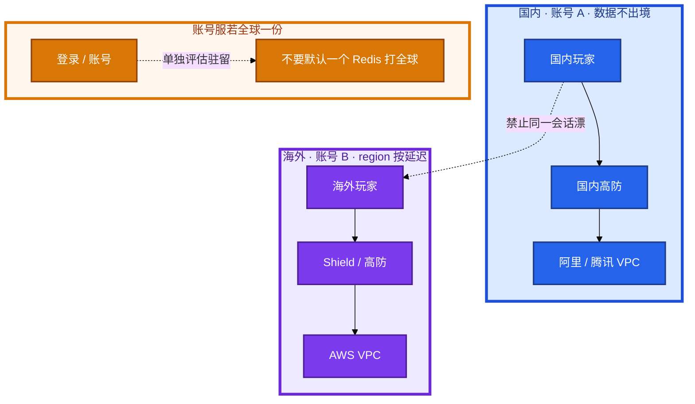
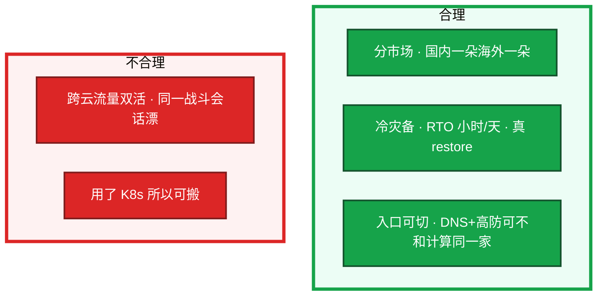
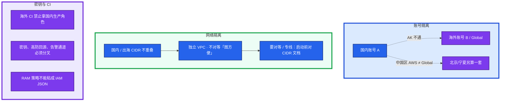
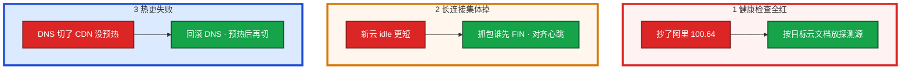
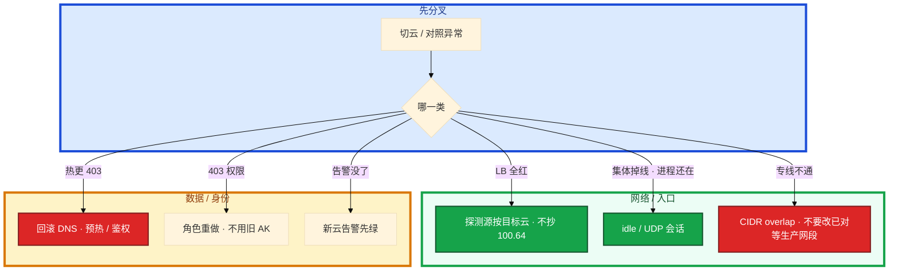

# 多云对照

国内阿里迁出海 AWS，机器一天迁完。切换窗口健康检查全红、长连接集体掉、热更 403。群里有人说「我们用了 K8s 所以可搬」，另有人按 10% 玩家随机切流量。

先别动手。这一章后半全是你会动手的：**对照表怎么当验收、账号怎么隔离、切云三件事怎么回滚 DNS。** 前面的概念和原理，是为了让你动手时不把名字 1:1。

**读完你能：** 按能力翻译五朵云；说出游戏为什么不做流量双活；切云当天探测源 / idle / CDN 预热能一口回。

## 本章目录

缩进 = 上下级。3 下面才是 3.1。

想钉在**正文左边**跟着滚：菜单 **查看 → 打开视图 → 大纲**。Markdown 预览做不到独立左栏，目录只能写在文章开头。

- [1. 基本概念](#1-基本概念)
- [2. 架构图](#2-架构图)
- [3. 原理](#3-原理)
  - [3.1 按能力翻译](#31-按能力翻译不按宣传名)
  - [3.2 多云网络对照](#32-多云网络对照表名字像不等于默认值像)
  - [3.3 ACK vs EKS 控制面](#33-ack-vs-eks-控制面责任)
  - [3.4 出海账号与网络隔离](#34-游戏出海账号与网络隔离)
- [4. 安装部署](#4-安装部署)
  - [4.1 迁移按风险排序](#41-迁移按风险排序不是-ecs--ec2)
  - [4.2 分市场怎么落](#42-分市场怎么落)
- [5. 核心配置](#5-核心配置)
- [6. 常用命令](#6-常用命令)
- [7. 常用操作](#7-常用操作)
  - [7.1 厂商锁定与多云策略](#71-厂商锁定与多云策略游戏不做流量双活)
  - [7.2 切云当天三件事](#72-切云当天三件事)
- [8. 生产排障](#8-生产排障)
- [9. 必会 · 常考](#9-必会--常考)
- [合上书](#合上书问自己)

**本章不讲：** VPC / SG / NAT 通用排障 → [01](../01-云网络与安全/)；阿里组合、100.64、Terway → [02](../02-阿里云生产/)；AWS NLB / IRSA / IAM 求值 → [03](../03-AWS生产/)；火山 TOS / VKE / 沐瞳现场 → [08](../08-火山引擎生产/)；RDS / 对象存储 / Redis → [05](../05-云上存储与数据库/)；跨 AZ / NAT / CDN 账单 → [06](../06-成本治理/)；跨账号 IAM、RAM 不能粘贴细节 → [07](../07-IAM与多账号/)；出海区服、数据驻留专题 → [08-游戏运维专题](../../08-游戏运维专题/) / [10-出海与多区域](../../08-游戏运维专题/10-出海与多区域/)。

---

## 1. 基本概念

对照是为了 **迁移和避坑**，不是背五朵云产品名。阿里 NLB 和 AWS NLB 都是 L4，但 client IP 保留、健康检查源、跨 AZ 计费默认值不同。

| 市场 | 常见落地 | 账号 |
|------|----------|------|
| 国内玩家 | 国内高防 → 阿里 / 腾讯 VPC | 账号 A，数据不出境 |
| 海外玩家 | Shield / 高防 → AWS VPC | 账号 B，region 按延迟 |
| 字节系 | 火山 VPC（08） | 办公身份和 IAM 绑得紧 |

腾讯云不单开章，能力放在这张表里。GCP 国内游戏岗点到差异即可。火山细节在 08。

三个不要混：

| 说法 | 实际 |
|------|------|
| 名字像 | 产品能买到 |
| 默认值像 | 健康检查源、idle、跨 AZ 计费必须单独测 |
| 用了 K8s 就可搬 | LB 注解和 CNI 都是云绑定；改注解可能换 IP |

> **记住**：按能力对照，不按产品名 1:1；名字像不等于默认值像。

---

## 2. 架构图

先把分市场钉住。后面对照表、隔离、切云都对着这张图说话。

图上三条线：

1. **没有箭头把同一战斗会话从国内 VPC 漂到 AWS。** 分市场，不是双活。
2. **账号 A 和账号 B 隔离。** AK 不通、CI 角色不通、CIDR 提前不重叠。
3. **账号服全球一份要单独评估驻留。** 不要默认「跟逻辑服走」。

合理形态 vs 不合理：

---

## 3. 原理

原理只保留动手和面试会用到的：能力怎么翻译、网络默认值差在哪、控制面谁负责、出海账号怎么切开。

**本节 4 块：** 3.1 能力表 · 3.2 网络对照 · 3.3 ACK/EKS · 3.4 账号隔离

### 3.1 按能力翻译，不按宣传名

| 能力 | 阿里云 | AWS | 腾讯云 | 火山引擎 | GCP |
|------|--------|-----|--------|----------|-----|
| VPC / 子网 | VPC + 交换机（AZ） | VPC + Subnet（AZ） | VPC + 子网 | VPC + 子网 | VPC 全球，子网按 region |
| 公网出口 | NAT 网关 | NAT Gateway | NAT 网关 | NAT 网关 | Cloud NAT |
| 实例防火墙 | 安全组（有状态） | Security Group | 安全组 | 安全组 | VPC firewall（层级不同） |
| 子网 ACL | 网络 ACL | NACL | ACL | 网络 ACL | 少用，防火墙为主 |
| 计算 | ECS（禁 t 突发） | EC2（禁 T burstable） | CVM | ECS | GCE |
| L4 负载 | CLB / NLB | **NLB** | CLB | CLB | Passthrough NL |
| L7 负载 | ALB | ALB | CLB-HTTP / 应用型 | ALB | URL map / GCLB |
| 对象存储 | OSS | S3 | COS | TOS | GCS |
| 托管 K8s | ACK + Terway / RRSA | EKS + VPC CNI / IRSA | TKE | VKE | GKE（Autopilot 另说） |
| IAM | RAM + STS | IAM + STS（求值最常考） | CAM | IAM | IAM 绑定到资源 |
| 日志 | SLS | CloudWatch Logs | CLS | TLS | Cloud Logging |
| 国内高防 | 高防 IP / 游戏盾 | Shield（国内区弱于阿里） | 高防 / 游戏盾 | 高防 | Cloud Armor（偏 L7） |
| 专线 | 高速通道 | Direct Connect | 专线接入 | 专线 | Interconnect |

GCP 的 VPC 是 **全球 VPC + 区域子网**，和国内云「地域 VPC」不是同一张图，跨 region 内网是默认能力。若岗位不是 GCP 主场，说清差异即可。GKE Autopilot 对有状态战斗服不友好。游戏区服仍要按延迟和数据驻留切区域，不要被「全球 VPC」带去画一张 Anycast。内网打通更省事，区服仍按延迟和数据驻留切。国内游戏岗极少 GCP 主场，点到差异即可。

腾讯云和阿里云对游戏团队来说能力接近：CVM 规格同样有突发性能型要禁；CLB 长连接、COS + CDN 热更、TKE 网络插件同样吃 VPC IP。差异常在：账号 / CAM 细节、高防和游戏盾产品形态、地域覆盖、商务。技术用「模型相同、操作面不同」就够，除非简历写了腾讯云深度。游戏盾 / 高防的 CNAME 和回源网段必须当新系统验收，不能「和阿里一样勾一下」。CAM 和 RAM 都是身份 + 策略，条件键和角色扮演流程不同，策略不能粘贴。选哪家：团队熟练度、高防和商务、已有专线。技术模型不是决定项。不要编「腾讯更懂游戏」。简历写了哪家就深讲哪家，另一家对照即可。

火山细节在 08。对照层记住：VPC / 安全组 / CLB / TOS / VKE / TLS 与阿里同构，**排障思路可迁移**。禁止照抄阿里 `100.64.0.0/10`。没用过火山的说法：「我没在火山上跑过生产，但 NAT SNAT、SG 探测源、对象存储公共读这三件事我按同一套 SOP 验收；健康检查源我会先查文档和流日志，不搬阿里的网段。」目标是字节或简历写了火山，再看 08。没落地不要编产品全家桶。腾讯云不要单开一章来学：模型接近，对照这张表即可。

COS 公共读和 OSS 公共读是同一类事故。OSS / COS / S3 / TOS 公共读都会变成下载费炸弹。跨云同坑还有突发规格、源站裸 EIP。

> **记住**：按能力对照，不按产品名 1:1；名字像不等于默认值像。

### 3.2 多云网络对照表：名字像不等于默认值像

切云 / 开新 region 用这张表当验收，不要当背诵。每一行问：这个能力在目标云的 **默认值** 是什么、健康检查源是哪段、idle 多少秒、跨 AZ 要不要钱。

| 项 | 阿里云 | AWS | 腾讯 / 火山 | 切换必测 |
|----|--------|-----|-------------|----------|
| VPC 模型 | 地域 VPC + 交换机绑 AZ | 地域 VPC + Subnet 绑 AZ | 同国内云；火山同构 | CIDR 无重叠，否则专线 / 对等做不了 |
| 探测源 | CLB：`100.64.0.0/10` 或探测开关 | NLB 节点 IP / LB SG | **禁止抄 100.64**；查文档和流日志 | 本机通、LB 全红 |
| L4 vs L7 | 长连接 CLB/NLB；HTTP ALB | 长连接 **NLB**；HTTP ALB | CLB 长连接；应用型走 HTTP | 自定义 TCP 接到 ALB = 随机断线 |
| client IP 保留 | 产品默认不同 | NLB preserve：后端见玩家 IP | 以文档为准 | SG 两套：业务端口 + 检查源 |
| LB idle / UDP 会话 | TCP 可调，默认常短于心跳 | ALB 默认 60s；NLB TCP ~350s | 各家不同 | 心跳更长的一侧会在切换窗口集中断线 |
| NAT | 端口水位 / 并发 | `ErrorPortAllocation`；处理费贵 | 同 SNAT 模型 | 每 AZ 一个；大流量走内网 endpoint |
| 跨 AZ 流量 | 延迟 0.5–2ms | **明确计费** | 以账单为准 | AWS 开了多 AZ 计算面账单先炸 |
| 内网拉镜像 / 对象 | OSS 内网域名 | S3 / ECR VPC Endpoint | TOS 内网域名（08） | 开服前夜穿 NAT = 带宽+钱一起爆 |
| SG vs NACL | SG 主控，有状态 | 同左 | 同左 | 改 SG 旧长连接可能还活（conntrack） |
| 专线 | 高速通道 | Direct Connect | 专线接入 | 玩家不走专线；UDP 先测 MTU |

安全组源写 `0.0.0.0/0` 在所有云都危险，但「LB 探测网段」每家不一样，照抄必出健康检查事故。对象存储公共读在 OSS / COS / S3 / TOS 都会变成下载费炸弹。突发性能实例各家都有便宜规格，游戏一律禁。

同一套游戏两朵云时，版本包构建可以一份，发布通道必须两套：CDN 域名、热更检查地址、高防证书、GM 白名单。混用国内 OSS 给海外客户端回源，延迟和流量费都会难看，还可能踩内容审核。账号体系若全球一份，登录服的地域和数据库驻留要单独设计，不要默认「跟逻辑服走」。

> **记住**：各家健康检查源、LB 超时、跨 AZ 计费都要单独验收；突发规格、公共读、源站裸 EIP 是跨云同坑。

### 3.3 ACK vs EKS 控制面责任

托管了控制面，不等于你不用懂安装。对照只记责任切分，插件名不要背串。

| 责任 | ACK | EKS | 两边一样 |
|------|-----|-----|----------|
| Master / etcd | 阿里管，ssh 不进 | AWS 管，跨 3 AZ，ssh 不进 | 停变更的仍是你的业务 |
| 节点 | 节点池，禁 t | 节点组，On-Demand / Spot 分开 | 战斗不用抢占 / Spot / ECI / Fargate |
| CNI | Terway 吃 VPC IP；Flannel 出 VPC 常 SNAT | VPC CNI；prefix delegation | `/24` 节点池会 `insufficient IP` |
| 身份 | RRSA 绑 SA | IRSA + Trust `sub=ns:sa` | 节点角色要瘦；AK 不进 Secret |
| LB | 注解可能重建、地址会变 | AWS LB Controller；改注解同样可能换 IP | 客户端走域名 |
| 探测源 | `100.64.0.0/10` | NLB 节点，不抄 100.64 | 本机 curl 救不了 Unhealthy |
| 升级 | 窗口自己选，避开开服日 | 控制面与节点版本差不能跨太大 | PDB 挡着不要 `--force` |
| 仍是你的 | Event / Webhook / RPO | 同左 + 跨 AZ 流量费 | 问清谁 restore、盘是否独立 |

TKE / VKE / GKE：插件都吃 VPC IP。GKE Autopilot 对有状态战斗服不友好。K8s 消灭不了 LoadBalancer 注解和云盘 CSI 绑定。

> **记住**：厂商管控制面进程；节点池、CNI、身份、RPO、停变更仍是你的。JSON / 探测源不能跨云粘贴。

### 3.4 游戏出海账号与网络隔离

出海不是「同一个账号开一个海外 region」。要切开的是 **账号、网络、密钥、CI、数据驻留** 五层。

落地规则：

1. **账号**：国内阿里/腾讯一套，出海 AWS Global 一套。中国区 AWS（北京 / 宁夏）和 Global 又是两套 IAM，不要假设同一个 AK 能打通（03）。禁止海外 CI 拿国内生产角色。
2. **网络**：两套 CIDR 提前避开重叠——混合云和多账号互联是迟早的事（01）。独立 VPC；不要把测试接到生产 CEN / TGW「方便调试」。玩家入口仍是各市场自己的高防 / LB，不走专线互穿。
3. **数据驻留**：国内身份证 / 支付数据不要复制到 Global AWS「做灾备方便」。出海玩家数据进国内也要合规评估。技术上能同步不等于能同步。账号服若全球一份：单独评估驻留和合规，不要默认一个 Redis 打全球。
4. **模板可以同源，运行时必须分叉**：Terraform 模块 per-cloud；密钥、CIDR、高防回源、告警通道、GM 白名单两边各做一遍权限。合服、热更、GM 发奖禁止共用角色。
5. **入口高防可以和计算不同家**：DNS + 高防供应商可以不和计算同一家，降低单一清洗商绑定。这是合理的「防锁定」，比双云双活现实。

两套环境模板可以同源（Terraform 模块 per-cloud），密钥、CIDR、高防回源、告警通道必须分叉。

> **记住**：分市场 = 账号隔离 + CIDR 不重叠 + CI 角色分叉 + 数据驻留评估。不是画一张全球 Anycast。

---

## 4. 安装部署

### 4.1 迁移按风险排序：不是 ECS → EC2

机器搬过去不是迁移。国内阿里迁出海 AWS，计算面一天迁完，切换窗口玩家进不去——真正炸的是入口默认值，不是机型名。

| 风险序 | 什么 | 为什么炸 |
|--------|------|----------|
| 1 网络 | CIDR 重叠；健康检查源、NAT、LB idle 默认值不同 | 专线做不了；切换窗口集中断线 |
| 2 入口 | 高防 / DNS / 证书 / 客户端写死 IP | TTL、双入口并行、源站 SG 只放新高防回源 |
| 3 数据 | 跨云复制延迟、驻留合规 | RPO 以校验过的备份为准 |
| 4 IAM | RAM 策略不能粘贴成 IAM JSON | IRSA / RRSA 要重做；CI 用旧 AK 是切日第二常见事故 |
| 5 可观测 | SLS 查询和告警不会跟着 VM 走 | 切日不搬告警 = 裸奔 |

游戏侧额外：有状态服要踢人窗口；热更 CDN 预热；协议端口在新云 LB 上的 UDP 会话超时可能更短。灰度按区服切，不要按「百分之十玩家」随机切——会话和区服绑定。随机切会把同一服玩家撕开：匹配失败、好友不在、充值账本对不上。

切换日最小闭环：

1. DNS 双入口
2. 源站 SG 只放新高防回源
3. 小服进真实玩家
4. 对账 CCU / 登录 / 充值
5. 大服

任一步失败只回滚 DNS，不动双向写。热更 CDN 在新云要重新预热，缓存不跟着 DNS 走。证书和 GM 白名单也要在新入口生效，否则切过去登录 443 失败或后台发奖被拒，看起来像「云挂了」。

一次「专线打不通」：两边 VPC 都用了 `10.0.0.0/16`，对等 / CEN / TGW 路由直接冲突。你眼睛在路由表里看到两条一样的网段，控制台报 CIDR overlap。卡住先改测试网段或做 NAT 转换，**不要现场改已经对等的生产网段**——那是 01 里同一条硬约束。迁移启动前就要对 CIDR 文档，不是切流当天才发现。

跨云验收清单（名字对上了也不算过）：

- CIDR 无重叠，专线 / 对等路由可写
- LB 健康检查源按目标云文档放行，禁止抄 100.64
- TCP / UDP idle 与心跳对齐，UDP 会话超时单独测
- 对象存储 Block Public + 内网回源
- IAM 角色重做，CI 不用旧 AK
- 告警在新云先绿再切流量
- 突发规格黑名单、无 EIP 裸奔

止血（切换中回滚）：DNS 切回、入口并行保留旧 LB、数据以源云为主不双向写。治理：迁移 runbook 按「网络连通 → 数据校验 → 无流量演练 → 小服 → 大服」门禁，每步有失败回滚。小服已经进玩家，发现只读延迟导致「刚买的道具没有」：先把写路径打回主库 / 源云，不要双向写。再查是复制延迟还是切到了只读（05）。DNS 可以一起切回。

> **记住**：迁移难在 CIDR / 入口 / 数据 RPO / IAM / 告警，不难在改机型。

### 4.2 分市场怎么落

按两张图讲，不要画成一张「全球 Anycast」。国内玩家 → 国内高防 → 阿里/腾讯 VPC（账号 A）。海外玩家 → Shield/高防 → AWS VPC（账号 B）。火山生产看 08。

验收：两边健康检查都绿，再 GSLB / DNS 权重切流。否则 50% 玩家进死入口。

---

## 5. 核心配置

切云 / 开新云时只动有证据的项。名字对上了只说明产品能买到。

| 项 | 生产怎么用 | 改错会怎样 |
|----|------------|------------|
| CIDR | 国内 / 出海不重叠；启动前对文档 | 专线 / 对等直接做不了 |
| 探测源 | 按目标云文档，禁止抄 100.64 | 本机通、LB 全红 |
| idle / UDP | 和心跳对齐，单独测 | 切换窗口集中断线 |
| 账号 | A/B 隔离；中国区 AWS 另算 | 同一把 AK 打不通还以为配错 |
| IAM | 角色在目标云重做；IRSA/RRSA 的 OIDC 和 Trust `sub` 重做 | RAM JSON 粘过去字段全错 |
| 发布通道 | CDN / 热更检查 / 高防证书 / GM 白名单两套 | 混用国内 OSS 给海外回源 |
| 灰度 | 按区服，不按随机百分比玩家 | 同一服玩家被撕开 |
| 回滚 | 只动 DNS 和入口，不双向写 | 两边都以为自己是主 |

> **记住**：切日前用对照表当验收。每一行问默认值，不问产品名。

---

## 6. 常用命令

对照层没有「一条 CLI 打五朵云」。值班看的是验收项和控制台，不是背命令。

| 目的 | 看什么 |
|------|--------|
| 网络 | 路由表 CIDR overlap；目标云探测源文档；LB idle / UDP 超时 |
| 入口 | DNS TTL；双入口；源站 SG 是否只放新回源；客户端有没有写死 IP |
| 身份 | 目标云角色是否重做；CI 有没有旧 AK；Trust `sub` |
| 数据 | 复制延迟；restore 演练记录；驻留清单 |
| 观测 | 新云告警是否先绿；SLS / CloudWatch 查询不能跟着 VM 走 |

现场仍用各云自己的 CLI（01–03、08）。本章只要求：**切日前把对照表逐行打勾。**

---

## 7. 常用操作

### 7.1 厂商锁定与多云策略：游戏不做流量双活

绑得死的：托管数据库的参数和备份格式、日志查询语言、IAM 条件键、LB 注解、自动扩缩的指标名。绑得相对松的：自己的 AMI / 镜像、Terraform 模块（仍要 per-cloud provider）、Prometheus 业务指标、游戏进程本身。

有人说「我们用了 K8s 所以可搬」。Service LoadBalancer 注解和 CNI 都是云绑定——改注解可能重建 LB、地址会变，客户端写死 IP 会全军覆没。K8s 消灭不了这一层。Terraform 不能消灭锁定，只能让「重建」可重复。真正可迁移的是：CIDR 规划文档、镜像构建、应用配置、监控指标语义。Terraform 让「在同一朵云重建」可重复，per-cloud provider 仍然绑产品 API。不要按「apply 换 provider」。

**不要为了「防锁定」把核心数据面做成双云双活。** 游戏长连接、区服状态、匹配，跨云 RTT 和会话保持会把架构拖成两套生产。为什么不上多云双活：成本（两套最小集群）、一致性（有状态）、故障面（两套 IAM 和网络）、团队熟悉度。

锁定最怕什么：托管库备份格式 + 游戏客户端写死的入口 IP，不是 ECS 主机名。IAM 策略不能粘贴：RAM JSON 粘到 IAM 会字段名、条件键全错，CI 用旧 AK 打新云是切日第二常见事故。角色要在目标云重做，IRSA / RRSA 的 OIDC 和 Trust `sub` 也要重做。

冷灾备验收：至少真 restore 过一次到目标云隔离环境，测 RTO。只把快照复制过去、从未拉起，地域故障那天才会发现 IAM、网络、DNS 都没备好。跟着走：在目标云隔离 VPC 里拉起一份库，校验行数 / 账本，再测从 DNS 切到这份环境要多久。GSLB / DNS 权重切流前确认两边健康检查都绿。

> **记住**：游戏不做跨云流量双活；分市场或冷灾备；灰度按区服不按随机百分比玩家。

### 7.2 切云当天三件事

用一次真实切换窗口把三件事串起来。机器已经迁完，DNS 准备切。不要从「ECS 没迁完」倒推。

这三件都不是「ECS 没迁完」。计算面迁完但入口 / 检查 / 缓存没验收，玩家侧就是故障。回滚只动 DNS 和入口，不动双向写。

逐步对应你眼睛看到的：

1. **本机 curl 200、LB Unhealthy** — 探测源抄了阿里 `100.64.0.0/10`。先按目标云文档放行，对流日志看真实源，不要先改业务端口。
2. **进程还在、玩家集体掉线** — 抓包看谁先 FIN / RST。新云 idle 更短（心跳 5 分钟、idle 60 秒是经典组合）。对齐心跳到 idle 的 1/3，或调 idle（有上限）。UDP 会话超时单独测，不要假设和旧云一样。
3. **登录通、热更 403 / 超时** — DNS 已经切，CDN 还指着空桶或鉴权失败。回滚 DNS，预热完成、命中率抽检后再切。版本检查服务和「包可下载」必须分两步。

K8s 注解换了重建 LB，地址变了——客户端必须走域名，否则第三件之外再加「全服连错 IP」。告警通道也要在新云先绿：切日不搬 SLS / CloudWatch 告警 = 裸奔。

游戏故事：国内阿里迁出海 AWS，机器一天迁完。切换窗口健康检查全红——探测源还写着 100.64；心跳 5 分钟、新云 idle 60 秒，长连接集体掉；DNS 切了 CDN 没预热，热更 403。回滚只动了 DNS，数据没双向写。后来 runbook 改成：探测源 / idle / 预热 / 告警先绿，再小服进真人。K8s 注解换了重建 LB，地址变了，幸好客户端走域名。

> **记住**：切云三件事：探测源、idle、CDN 预热；回滚只动 DNS，不双向写。

---

## 8. 生产排障

切云窗口不要从改机型或重启逻辑服开始。先问：名字对上了没有、默认值验收了没有。

| 现象 | 先做什么 | 不要做什么 |
|------|----------|------------|
| 本机通、LB Unhealthy | 目标云探测源文档 + 流日志 | 抄 100.64；先改业务端口 |
| 进程还在、集体掉线 | 对齐心跳与 idle；UDP 单独测 | 重启逻辑服 |
| 登录通、热更失败 | 回滚 DNS；预热后再切 | 双向写；先开会怪 CDN 厂商 |
| 专线 / 对等失败 | CIDR overlap | 现场改已对等生产网段 |
| 模拟器过了 / RAM 策略粘过去 403 | 目标云重做角色 | CI 继续用旧 AK |
| 随机 10% 玩家进了不同世界 | 灰度改回按区服 | 按 Web 百分比切 |
| GSLB 一半玩家进死入口 | 两边健康检查都绿再切权重 | 先切再看 |

对照时容易说错的点（收口进排障口令）：

- 名字像不等于行为像。
- 中国区 AWS ≠ 阿里云。账号、备案、高防能力、产品完整度都不同；出海写 AWS Global。
- 安全组源写 0.0.0.0/0 在所有云都危险，但 LB 探测网段每家不一样。
- GCP 全球 VPC 让「跨 region 内网」看起来简单，区服仍要按延迟和数据驻留切区域。
- 腾讯云 CAM 和 RAM 都是身份 + 策略，条件键和角色扮演流程不同。

---

## 9. 必会 · 常考

白板和追问高频，能一口回：

| 说法 | 对错 | 口径 |
|------|:----:|------|
| 按产品名 1:1 翻译就能切云 | 错 | 按能力；默认值单独验收 |
| 用了 K8s / Terraform 所以可搬 | 错 | LB 注解、CNI、CSI、IAM 条件键仍绑云 |
| 游戏做多云流量双活防锁定 | 错 | 分市场或冷灾备；同一会话不漂 |
| 灰度按 10% 玩家切 | 错 | 按区服；会话和区服绑定 |
| 火山健康检查抄 100.64 | 错 | 先查文档和流日志 |
| 中国区 AWS 当阿里云，同一把 AK | 错 | 两套账号两套 IAM |
| ACK 托管了和 EKS 托管了就可以不管节点 | 错 | 节点池 / CNI / 身份 / RPO 仍是你的 |
| 迁移最难的是改 ECS 机型 | 错 | 难在 CIDR / 入口 / RPO / IAM / 告警 |
| 冷灾备只复制快照就算有 | 错 | 要真 restore 到隔离环境测 RTO |
| 切云失败改双向写尽快追上 | 错 | 只回滚 DNS，数据以源云为主 |
| 混用国内 OSS 给海外客户端回源 | 错 | 延迟、流量费、内容审核 |
| 入口高防必须和计算同一家 | 错 | DNS+高防可以不同家 |
| 突发规格、公共读、裸 EIP 只是阿里坑 | 错 | 跨云同坑 |
| GCP 全球 VPC 所以画一张 Anycast | 错 | 区服仍按延迟和驻留切 |
| 腾讯更懂游戏所以国内必选 | 错 | 模型接近，看熟练度 / 高防 / 商务 |

数字：切云经典组合心跳 **5 分钟** vs idle **60 秒**；跨 AZ RTT **0.5–2ms**；探测阿里 **`100.64.0.0/10`**。

易混：名字 vs 默认值；分市场 vs 双活；ACK vs EKS（责任同、探测源/JSON 不同）；中国区 AWS vs 阿里 vs Global；冷灾备 vs 流量双活；按区服灰度 vs Web 百分比。

---

## 合上书，问自己

1. 长连接 LB、对象存储、托管 K8s、IAM 在五朵云分别叫什么？GCP 全球 VPC 差在哪？
2. 多云网络对照表里，探测源、idle、跨 AZ 计费、内网 endpoint 各要测什么？
3. ACK 和 EKS 控制面谁管什么？两边一样的是哪几条？
4. 出海账号与网络怎么隔离？能不能画一张全球 Anycast？
5. 迁移为什么难的不是改机型？灰度为什么按区服？
6. 切云当天三件事？回滚动什么、不动什么？

六题都能口述，这一章就过了。存储和账单、IAM 多账号在后面几章展开。
