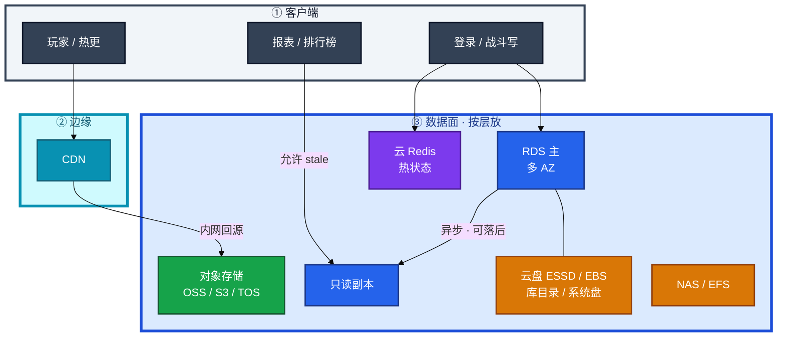
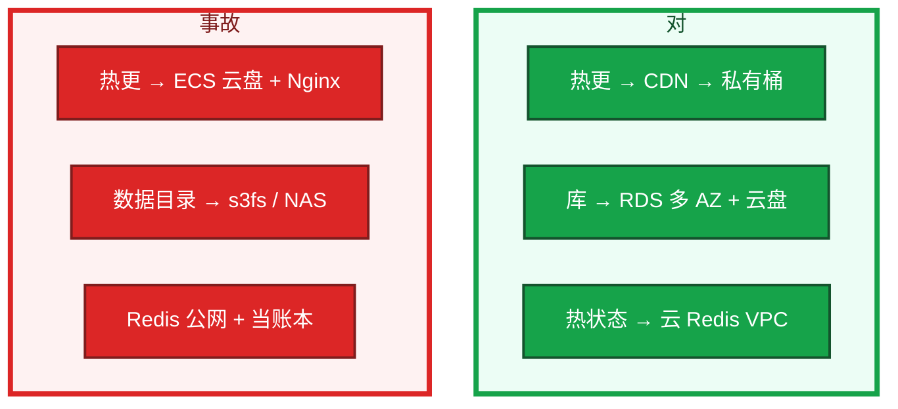
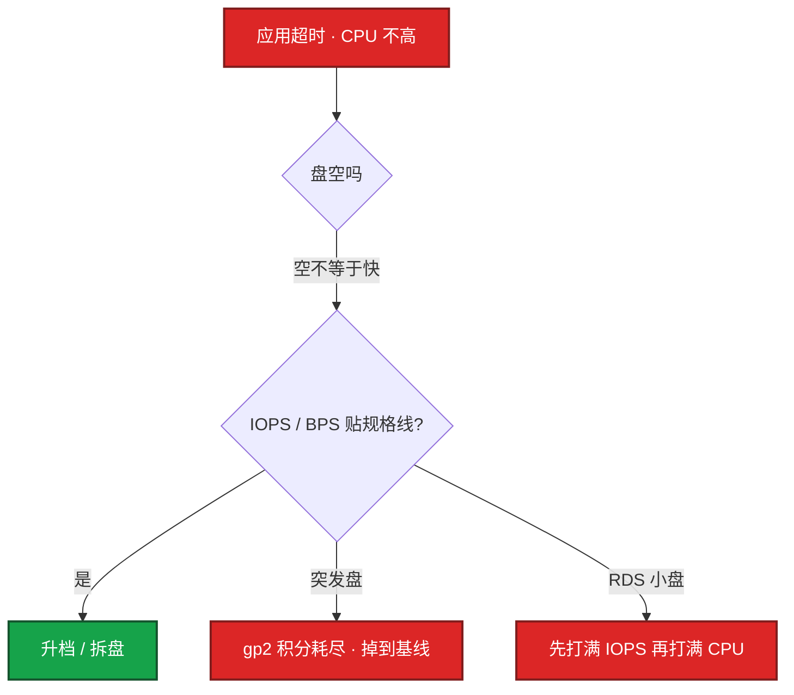
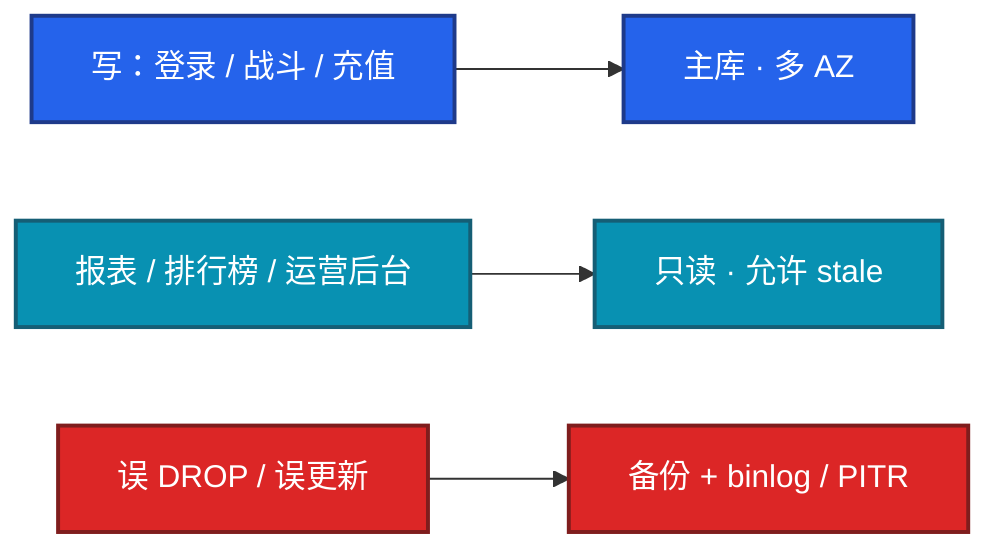
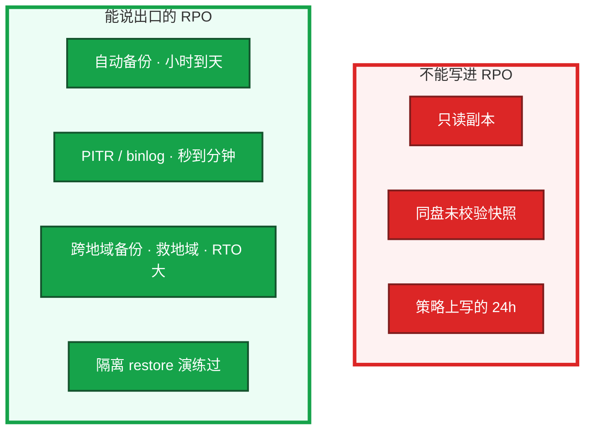
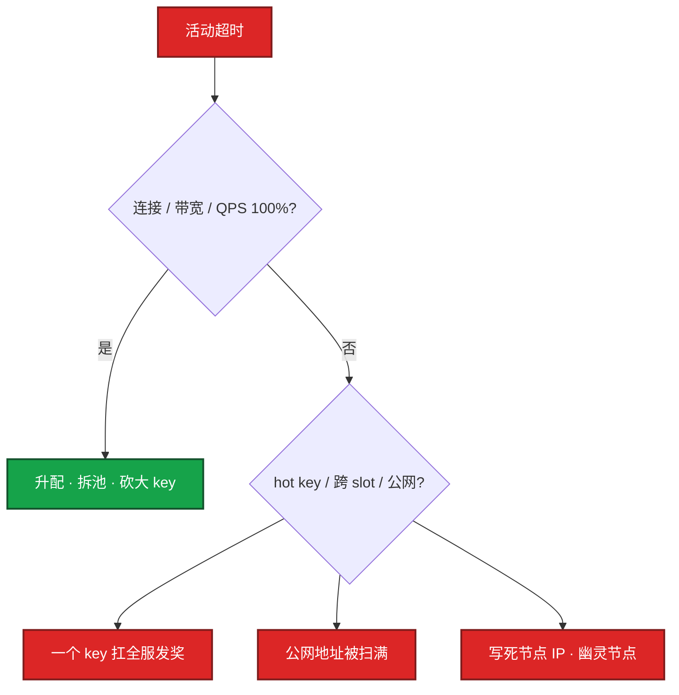
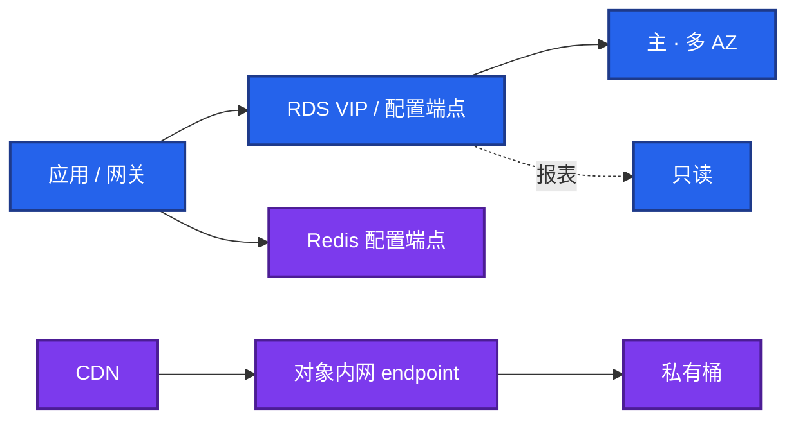
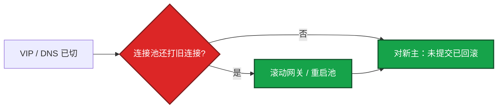
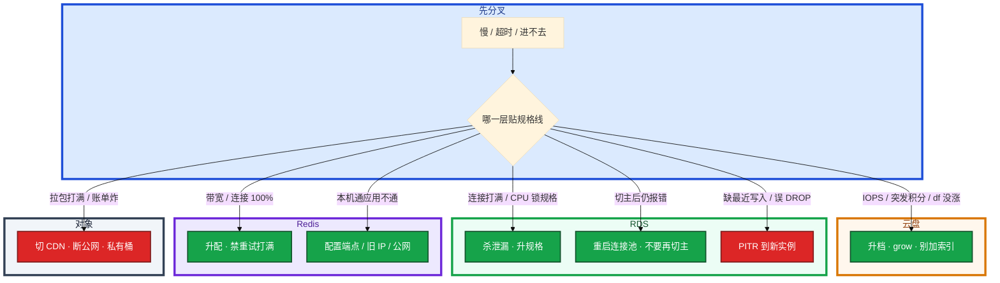

# 云上存储与数据库


开服十万客户端拉包。云盘 IOPS 和网卡打满。群里有人要把热更继续放 ECS + Nginx，另有人说「开了只读所以已经高可用了」。RDS 刚切主，应用还在报 `gone away`。

先别动手。这一章后半全是你会动手的：**怎么选盘和库、怎么验 RPO、切主后连接池怎么收、Redis 触顶怎么止血。** 前面的概念和原理，是为了让你动手时不把块、对象、库、缓存放错层。

**读完你能：** 白板上画出块 / 对象 / RDS / Redis 各放什么；多 AZ 和只读分得清；能说出「现在能回到过去哪一分钟」；活动 Redis 超时先看硬顶，而不是先改重试。

## 本章目录

缩进 = 上下级。3 下面才是 3.1。

想钉在**正文左边**跟着滚：菜单 **查看 → 打开视图 → 大纲**。Markdown 预览做不到独立左栏，目录只能写在文章开头。

- [1. 基本概念](#1-基本概念)
- [2. 架构图](#2-架构图)
- [3. 原理](#3-原理)
  - [3.1 云盘 IOPS](#31-云盘-iops规格上限和突发积分)
  - [3.2 多 AZ vs 只读](#32-rds-多-az-vs-只读副本)
  - [3.3 备份与 RPO](#33-备份与-rpo没-restore-过的数字是假的)
  - [3.4 云 Redis 合同](#34-云-redis规格是合同)
  - [3.5 生产红线](#35-rds--redis--oss-生产红线)
- [4. 安装部署](#4-安装部署)
  - [4.1 生产怎么选](#41-生产怎么选)
  - [4.2 落地你实际看到什么](#42-落地你实际看到什么)
- [5. 核心配置](#5-核心配置)
- [6. 常用命令](#6-常用命令)
- [7. 常用操作](#7-常用操作)
  - [7.1 备份与 restore 演练](#71-备份与-restore-演练)
  - [7.2 切主后连接池](#72-切主后连接池)
  - [7.3 扩容与 grow](#73-扩容与-grow)
  - [7.4 Redis 触顶](#74-redis-触顶)
  - [7.5 加密与密钥](#75-加密与密钥)
  - [7.6 删除保护](#76-删除保护)
- [8. 生产排障](#8-生产排障)
- [9. 必会 · 常考](#9-必会--常考)
- [合上书](#合上书问自己)

**本章不讲：** MySQL 复制、锁、慢 SQL → [03-中间件 / 01-MySQL](../../03-中间件与数据库/01-MySQL/)；Redis 大 key 内核 → [03-中间件 / 02-Redis](../../03-中间件与数据库/02-Redis/)；OSS / S3 产品细节 → [02](../02-阿里云生产/)、[03](../03-AWS生产/)；TOS 生命周期、内网 endpoint → [08](../08-火山引擎生产/)；游戏回档流程、选点、公告 → [08-游戏运维 / 07-玩家数据备份与回档](../../08-游戏运维专题/07-玩家数据备份与回档/)；云盘挂到 K8s PVC → [04-Kubernetes / 11-存储](../../04-Kubernetes/11-存储/)；对象存储公共读账单 → [06](../06-成本治理/)；VPC 安全组 → [01](../01-云网络与安全/)。

---

## 1. 基本概念

云上存储不是「有没有这个产品」，是 **故障域、性能上限、备份 RPO** 三件事。块、对象、库、缓存各干各的，选错的事故跟着走。

| 放这里 | 不放这里 |
|--------|----------|
| 系统盘 / 库数据目录 → 云盘（ESSD / EBS），POSIX，跟实例可独立 | 热更用云盘 + Nginx 对外 |
| 热更 / 录像 / 日志归档 / 跨服大文件 → 对象存储 + CDN + 生命周期 | 数据库数据目录放 s3fs |
| MySQL 数据 → RDS 多 AZ + PITR，只读给查询 | Redis 当唯一账本且无备份 |
| Redis 热状态 → 云 Redis（连接 / 带宽硬顶） | 共享盘当战斗服状态同步 |
| 本地临时 → 云盘，可丢 | 云盘当 CDN |

云盘（ESSD / EBS）：挂到一台 ECS / Pod，POSIX，延迟低，容量有上限，跟实例生命周期可独立。对象（OSS / S3 / TOS）：HTTP API，无限扩，无 POSIX，适合不可变对象、多客户端下载。NAS / EFS：多实例读同一份配置可以；延迟和 POSIX 锁弱于云盘。

三个角色不要混：

| 角色 | 干什么 |
|------|--------|
| **云盘** | 给库和系统盘；IOPS 按规格，不是「盘空就快」 |
| **对象存储** | 给热更 / 备份 / 日志；走 CDN，禁止 ECS 当下载源 |
| **NAS** | 共享配置、构建缓存；不当库、不当战斗状态、不当 CDN |

> **记住**：块存储给库和系统盘；对象存储给热更 / 备份 / 日志；NAS 不当库、不当战斗状态。跨服大文件不要进 RDS blob——会把备份、IOPS、恢复窗口一起拖垮。

---

## 2. 架构图

先把整张图钉住。后面选型、命令、排障都对着这张图说话。



图上五条线：

1. **热更不经过 ECS 云盘。** 客户端 → CDN → 私有桶。
2. **写路径（登录、战斗、充值）必须打主库。** 只读只给允许 stale 的读。
3. **账本在 RDS，Redis 是热状态。** failover 可能丢秒级，不能当唯一账本。
4. **NAS 不进写路径。** 共享配置可以，战斗状态和 MySQL 数据目录不行。
5. **库的数据目录在云盘或托管盘上，不在 s3fs。** POSIX 和 `fdatasync` 对对象存储会撒谎。

三种生产形态（选错的事故不一样）：



开服热更放云盘：10 万客户端拉包，打满云盘吞吐和 ECS 网卡，且没有边缘节点。数据库用 s3fs：POSIX 语义和延迟都不对，崩了才发现。备份只打在同一块云盘、快照策略没开，删实例或区域故障一起没。

---

## 3. 原理

原理只保留动手和面试会用到的：盘为什么空了还慢、多 AZ 为什么不是只读、RPO 怎样才算数、云 Redis 为什么是合同、三条生产红线钉在哪。

**本节 5 块：** 3.1 云盘 · 3.2 多 AZ · 3.3 RPO · 3.4 Redis · 3.5 红线

### 3.1 云盘 IOPS：规格上限和突发积分

系统盘：够装镜像和日志即可，不要把 MySQL 数据放系统盘。数据盘：ESSD 按 IOPS 选型。阿里云 ESSD PL0 / PL1 / PL2、AWS gp3 / io2，**IOPS 和容量 / 套餐绑定**，不是「盘够大就一定快」。



一次「应用超时、CPU 不高」跟着走。活动期登录变慢，盘看起来很空。突发型云盘（gp2 一类）有积分，积分耗尽 IOPS 掉到基线，和 ECS t 系列同一类「突然变慢、CPU 看起来不忙」。RDS 小盘也会先打满 IOPS 再打满 CPU。

你眼睛看到的：云监控磁盘 BPS / IOPS、await、RDS 的 `DiskIOPS` 贴线；CPU 很闲。卡住先对规格上限，不要先加索引（索引问题在中间件章）。止血：改 gp3 / io2 / ESSD 更高档，或拆盘。治理：按压测 IOPS 选型，不要按容量买最小盘。

多挂载：普通云盘单实例；共享要 NAS / EFS，游戏逻辑服不要拿共享盘当状态同步。加密：生产数据盘开加密，密钥走 KMS；快照继承加密。丢快照等于丢密钥权限时也打不开，密钥策略要进破窗流程。加密盘丢了 KMS 权限等于丢盘。

快照 vs RDS 备份：ECS 云盘快照救的是「这台机的文件系统」；RDS 备份救的是「这个库可恢复到时间点」。合服前两者都要，用途不同。用快照冒充数据库 PITR，会丢 binlog 里那几分钟。裸盘快照常是崩溃一致；MySQL 要 freeze / 热备或用 RDS 备份。

开服前、合服前打快照。止血用快照新建盘挂上，不要在生产盘上试修。云磁盘快照链不要当唯一备份——删实例有的产品连快照策略一起清。

云盘扩容：多数支持在线扩容量，**文件系统仍要 grow**；IOPS 档位可能要变配。生产变更把「盘变大了但 ext4 没长」写成检查项。控制台显示盘已经 500GB，`df` 还是 200GB，空间告警不消失——卡在文件系统没长，不是云盘没扩。

> **记住**：云盘 IOPS 有规格上限，突发盘积分耗尽会骤降；盘空不等于快。

### 3.2 RDS 多 AZ vs 只读副本

两者经常被说成「都是高可用」，不是。

| | 多 AZ（主备） | 只读副本 |
|--|-------------|----------|
| 目的 | 抗 AZ / 主机故障 | 扩展读 |
| 复制 | 同步或半同步（产品而异），备库一般不可读或可读但别当业务读 | 异步为主 |
| 切换 | 自动 failover，有秒到分钟级中断 | 主挂了只读还在，但只读不能变主（除非你明确提升） |
| 数据 | 切换后应无或极少丢失（看同步模式） | 延迟内的读是旧的 |



游戏库：玩家库、充值库多 AZ 必开。充值库甚至要更严的同步和备份。只读：报表、排行榜刷新、运营后台。登录和战斗写路径不要指到只读。

一次「刚买的道具没有」跟着走。活动刷表后副本落后分钟级，登录若指到只读会看到旧数据。观测 `ReplicaLag` / 秒级延迟；应用必须能接受 stale。把只读当「HA」：主挂之后发现副本落后 15 分钟，合服窗口会变成事故。大事务、DDL、活动刷表会让副本延迟从毫秒到分钟。

一次 failover 之后应用持续报错。系统里 DNS / VIP 已经切到新主，未提交事务回滚。连接池如果不处理 `gone away`，应用会持续报错即使新主已好。你眼睛看到新主已经可写，网关还打旧连接。卡住先重启连接池 / 滚动网关，不要先再切一次主。治理：连接池校验、failover 演练（真切一次）。切主窗口按「秒到分钟级中断 + 连接池重连」写进预案，不要承诺玩家无感。

多 AZ 不能替代备份。failover 复制的是已经误删的数据。删除 / 更新事故要靠备份 + binlog 回档。

规格：突发性能 RDS、过小的磁盘突发，活动期先打满 IOPS 再打满 CPU。参数 `max_connections`、`innodb_buffer_pool` 在云上常被规格锁死，应用连接池 × 进程数超限会直接拒绝。扩容要提前，不是报错再升。只读规格可以小于主库，但活动报表一打，只读先成为瓶颈——只读也要按读 QPS 选型。

RDS `max_connections` 打满：活动期登录拒绝，错误是 `Too many connections`。系统里连接池 × 进程数超过规格锁死的上限。你眼睛看进程列表大量睡眠连接、规格页上的连接配额贴线。卡住先杀长事务 / 泄漏连接，再升规格，不要无限加大应用池。治理：池大小上限、Proxy、只读分流。连接池 × 进程数要算总账，开服前就算，不是报错再升。

参数组变更要当生产变更：有的参数要重启。能区分「动态参数」和「重启生效」，避免开服夜改 `slow_query_log` 把实例重启了。开服夜禁止「顺手改 innodb」除非变更单写明接受重启。

> **记住**：多 AZ = HA；只读 = 读扩展且可落后；只读不是备份，failover 也不是备份。

### 3.3 备份与 RPO：没 restore 过的数字是假的

RPO = 故障时最多丢多久的数据。要能落到数字和校验。



合服前只打了 ECS 云盘快照，没做 RDS restore 演练。误操作 DROP 一张账本表之后，快照是崩溃一致、缺那几分钟 binlog。这就是「策略上写的 24 小时」和「能回到过去哪一分钟」的差别。

生产要求：

1. 备份成功要告警（失败比没有备份更危险，因为你以为有）
2. **定期 restore 演练**到隔离实例，校验表行数和关键账本。没 restore 过的 RPO 是假的
3. 保留期覆盖「发现误操作的最长时间」（游戏常见几天后才发现活动发错道具）
4. 充值 / 账本库备份与游戏库分开策略，权限更严，删除备份要双人

云厂商 PITR 依赖 binlog 是否开、保留多久。binlog 保留 7 天而运营 10 天后才发现发错道具，RPO 窗口已经关了。改实例删除保护、禁止控制台误释放。释放 RDS 后备份是否还在，要在删除前看清楚（有的产品释放即清）。

PITR 操作要点：restore 到 **新实例**，校验行数 / 账本 / 最大主键，再决定切连接串。不要在生产实例上「回滚试试」。你眼睛看到的是新实例的表行数、充值流水最大 ID、和故障前备份点对齐；校验不过就不要切连接串。合服前、大活动前各做一次隔离 restore，才能把 RPO 从「策略上写的 24 小时」变成「能回到过去哪一分钟」。

备份副本要离开生产账号或至少离开生产 VPC 的「同一套删除权限」。只给 DBA 角色 `Restore` 不给 `DeleteBackup`。跨地域备份抗的是地域故障，RTO 按小时计，不能替代同城多 AZ 的分钟级切换。

游戏回档：云备份是素材，回档流程（停服、选点、校验、公告）在游戏运维章。本章只要求：你能说出该实例「现在能回到过去哪一分钟」以及「上次 restore 演练是什么时候」。

> **记住**：RPO 以校验过的 restore 为准；误删靠 PITR；能说出「回到哪一分钟」和「上次 restore 哪天」。

### 3.4 云 Redis：规格是合同

云 Redis（阿里云 Redis、ElastiCache、腾讯云 CRedis、火山 veDB Redis）是 **规格合同**：

- **连接数、带宽、QPS 有硬上限**。活动期 `rejected connections` 或超时，先看是否触顶，不要先改应用重试把连接打得更满
- 集群版 vs 标准版：集群不能用跨 slot 的事务 / 部分命令；游戏若用了 `KEYS`、跨 key 事务、Lua 乱访，上集群会直接报错
- 持久化：有的规格 AOF / RDB 受限；重启或 failover 可能丢秒级数据。不能假设和自建 `appendfsync always` 一样
- 禁用命令：`FLUSHALL`、`KEYS`、`CONFIG` 常被禁或应被禁。运维习惯在自建上 `KEYS *` 会在云上失败或被审计
- 大 key / hot key：云控制台常有诊断；活动发奖一个 key 扛全服是跨云同款事故
- 内存满：逐出策略在云控制台，`noeviction` 时写失败。逻辑服当 DB 用 Redis 必须监控 `used_memory` 和 evicted



你眼睛看到的：控制台连接 / 带宽贴规格线；升配后 P99 从 80ms 回到 3ms。卡住先说规格上限，不要只说「Redis 慢」。监控硬顶告警提前于 80%。

同一活动 Redis 公网地址忘关，扫描把连接打满，本机 redis-cli 还通——应用连的是被打满的那条公网入口。网络：只走 VPC，安全组只放行应用。开了公网地址等于把内存数据库暴露在 DDoS 面上。

多 AZ：副本跨 AZ 有复制延迟；升主 RTO 秒级，客户端要能换 IP / 域名（集群模式用配置端点，不要写死节点 IP）。failover 后 IP 变，连接池会打到幽灵节点——本机 redis-cli 连配置端点通，应用还打旧 IP，表现为部分进程超时。卡住先看客户端是不是写死了节点 IP，不要先重启 Redis。

代理模式（有的云有 Proxy）会改变客户端看到的拓扑，连接池参数要按文档，不是按自建。

与自建对比：云 Redis 换运维时间、买上限清晰；代价是版本、模块（RedisJSON 等）、内核参数、slow log 深度不如自建。游戏战斗热数据若超规格，是拆 key / 分实例，不是「开一下持久化」。账本在 RDS，Redis 是热状态。

超时和重试要有上限。加密：传输中 TLS、静态加密是默认要开的；密钥在 KMS / RAM 角色上，应用不要把盘口令打进镜像。

> **记住**：云 Redis：连接 / 带宽硬顶、命令限制、不要公网、不要当账本、用配置端点。

### 3.5 RDS / Redis / OSS 生产红线

三条红线可以写进开服检查单。活动突发时先对红线，再进中间件章谈索引和热 key。

**RDS 红线**

| 红线 | 破了会怎样 |
|------|------------|
| 玩家库 / 充值库必须多 AZ | AZ 故障变成删档窗口 |
| 写路径禁止只读 | 「刚买的道具没有」；主挂后副本落后 15 分钟 |
| 删除保护 + Terraform `prevent_destroy` | 清理测试时点到生产，释放即清备份 |
| PITR 开，binlog 保留覆盖发现窗口（账本常见 14～30 天） | 运营 10 天后发现发错道具，窗口已关 |
| 备份失败告警；只给 DBA `Restore` 不给 `DeleteBackup` | 你以为有备份 |
| 参数组当变更；开服夜禁止顺手改 innodb | 改 `slow_query_log` 把实例重启了 |
| `max_connections` 开服前算：池 × 进程数 | `Too many connections`，升池只会更满 |
| 切主演练含连接池重连 | VIP 已切，应用持续 `gone away` |
| 小盘先看 IOPS 再看 CPU | 空盘超时 |
| 充值库独立备份策略、权限更严 | 误 DROP 跟着复制，failover 救不了 |
| 释放前确认备份是否还在 | 有的产品释放即清 |
| 跨地域不能替代同城多 AZ | 地域故障 RTO 按小时；同城是分钟级 |

**Redis 红线**

| 红线 | 破了会怎样 |
|------|------------|
| 禁止公网地址 | 扫描 / DDoS 打满连接，本机 cli 还通 |
| 不当唯一账本 | failover 丢秒级；持久化 ≠ `appendfsync always` |
| 连接 / 带宽 / QPS **80%** 告警 | 活动超时先触顶 |
| 客户端用配置端点，禁止写死节点 IP | 升主后打幽灵节点 |
| 禁 `KEYS` / `FLUSHALL` / `CONFIG` | 自建习惯搬上来直接报错或被审计 |
| 上集群前验收跨 slot / Lua | 活动发奖当场失败 |
| 发奖禁止单 key 扛全服 | hot key 跨云同款事故 |
| SG 只放应用；TLS + 静态加密 | 口令进镜像 = 泄漏面 |
| 开服夜水位 **< 70%** | 没有 buffer 就没有活动 |

**OSS / S3 / TOS 红线**

| 红线 | 破了会怎样 |
|------|------------|
| 桶私有 + Block Public Access | 公共读 = 下载费炸弹（06） |
| 热更：CDN + 内网回源，禁止 ECS + Nginx | 开服打满盘和网卡，无边缘 |
| 版本号在对象键里；覆盖同名必须刷新 CDN | 客户端还是旧包 |
| 生命周期按前缀，热更和日志归档不要一条规则 | 误删热更包或日志堆一年 |
| 禁止 RDS blob 放大文件 | 备份 / IOPS / 恢复窗口一起拖垮 |
| 删除权限单独授并告警；开版本控制 | 误删不可逆 |
| 拉镜像 / 回源走内网 endpoint | 穿 NAT 或公网，账单先炸 |
| 数据库目录禁止 s3fs | `fdatasync` 撒谎，崩了才发现 |

> **记住**：RDS 红线是多 AZ + PITR + 连接池；Redis 红线是硬顶 + 无公网 + 不当账本；OSS 红线是私有桶 + CDN 内网回源。三条都能写进开服当天检查单。

---

## 4. 安装部署

### 4.1 生产怎么选

| 项 | 选 | 不选 |
|----|----|------|
| 热更 | 对象存储 + CDN + 私有桶 | ECS 云盘 + Nginx、NAS 当下载体 |
| 库 | RDS 多 AZ，玩家 / 充值必开 | 只读当 HA；单 AZ 生产库 |
| 盘 | 数据盘按压测 IOPS（gp3 / io2 / ESSD 高档） | 系统盘放 MySQL；最小容量赌突发 |
| Redis | VPC 内、配置端点、规格留 30% | 公网地址；当账本；写死节点 IP |
| NAS | 共享配置、构建缓存 | MySQL 目录、战斗状态、热更源 |
| 备份 | RDS PITR + 隔离 restore 演练 | 只打一块未校验云盘快照 |
| 加密 | 数据盘 / RDS / Redis 静态加密 + TLS，密钥 KMS | 口令进镜像；加密盘无破窗密钥 |

托管 RDS / Redis：ssh 不进机器，上线前问清备份 RPO、谁 restore、failover 是否滚动、磁盘是否独立、binlog 保留几天、释放后备份还在不在。

### 4.2 落地你实际看到什么



| 你看到的 | 才是数据 / 入口 |
|----------|-----------------|
| RDS 连接串里的 VIP / 域名 | 写打主；不要缓存旧 IP |
| Redis **配置端点** | failover 后还通；节点 IP 会变 |
| 对象存储内网 endpoint | 回源 / 备份不穿 NAT |
| 云盘挂载点 + `df` / `lsblk` | 控制台容量和文件系统是两回事 |
| KMS 密钥策略 | 加密盘丢权限 = 丢盘 |

验收：控制台「运行中」不算数。必须：RDS 多 AZ 状态、最近一次备份成功、PITR 可回到的时间点、Redis 无公网、桶 Block Public Access、连接池能扛一次真切主。

---

## 5. 核心配置

只动有证据的项。参数组、备份窗口、删除保护都当生产变更。

| 参数 / 开关 | 生产怎么用 | 改错会怎样 |
|-------------|------------|------------|
| RDS 多 AZ | 玩家 / 充值库必开 | 单 AZ 主机故障 = 停写 |
| binlog / PITR 保留 | 覆盖发现窗口；账本 14～30 天 | 10 天后发现发错道具，窗口已关 |
| `max_connections` | 规格锁死；池 × 进程数先算 | 开服夜 `Too many connections` |
| `innodb_buffer_pool` | 跟规格走，不要开服夜改 | 参数组重启生效把库拉下 |
| 备份窗口 | 错开活动高峰；失败告警 | 你以为有备份 |
| deletion protection | RDS / Redis / 桶都开 | 控制台误释放 |
| Redis 逐出 | 账本路径不要 `noeviction` 当 DB | 写失败或把热数据挤掉 |
| Redis 公网 | **关** | DDoS 打满连接 |
| 桶 Block Public Access | **开** | 公共读账单炸 |
| 数据盘加密 + KMS | 生产必开；密钥进破窗 | 丢权限 = 丢盘 |

> **记住**：开服夜禁止顺手改 innodb / `slow_query_log`，除非变更单写明接受重启。quota 和连接上限先升规格，不要先加大应用池。

---

## 6. 常用命令

值班先对规格线和备份，不要先加索引。

| 目的 | 看什么 | 命令示意（各云名字不同，顺序一样） |
|------|--------|-----------------------------------|
| RDS 规格 / 连接 | `DiskIOPS`、连接数、CPU | `DescribeDBInstancePerformance` / `aws cloudwatch get-metric` |
| 只读延迟 | `ReplicaLag` | 控制台或 `SHOW REPLICA STATUS`（经堡垒） |
| 备份点 | 最近成功时间、PITR 可回到哪一分钟 | `DescribeBackups` / `aws rds describe-db-instance-automated-backups` |
| Redis 硬顶 | 连接、带宽、QPS、rejected | 云监控；`INFO clients` / `INFO stats` |
| 大 key / hot key | 控制台诊断 | 不要生产 `KEYS *` |
| 桶是否公共 | Block Public Access、ACL | `GetBucketPublicAccessBlock` / OSS 权限页 |
| 云盘 IOPS | BPS / IOPS 贴线、await | 云监控 + `iostat -x 1` |
| 扩容后容量 | 控制台 vs `df -h` | `lsblk`；没 grow 就还是旧大小 |

现场四条：

```bash
# 1 盘：规格线还是文件系统没长
iostat -x 1
df -h && lsblk

# 2 库：连接和延迟（经堡垒，不要把生产口令打进笔记本）
# Too many connections / ReplicaLag / 新主是否可写

# 3 Redis：硬顶，不要 KEYS *
redis-cli -h <配置端点> INFO clients
# 对照控制台：连接 / 带宽 / rejected connections

# 4 对象：先确认没公共读，再查流出
# GetBucketPublicAccessBlock / OSS 防盗链与 ACL
```

指标（云监控，阈值按规格百分比，不是绝对值）：

| 指标 | 阈值 | 级别 |
|------|------|------|
| 云盘 IOPS / BPS | **> 0.8 规格** | P1；打满 = 超时 |
| RDS `max_connections` | **> 0.8** | P1 |
| Redis 连接 / 带宽 / QPS | **> 0.8**；开服夜 **< 0.7** | P1 / 活动 P0 |
| `ReplicaLag` | 写路径不可接受分钟级 | 登录指到只读 = 事故 |
| 备份任务失败 | 任意失败 | P1（你以为有备份） |
| 桶公共读 / Redis 公网 | 非预期出现 | P0 |

日志：`Too many connections` = 规格；`gone away` = 切主后连接池；`rejected connections` = Redis 硬顶；对象 403 = 鉴权 / 时间差，不是「CDN 坏了」就刷新。

---

## 7. 常用操作

### 7.1 备份与 restore 演练

至少：自动备份开、PITR 开、失败告警、异地或跨账号留一份。合服前、大活动前加打一份，并做隔离 restore。本机 cron 拷数据文件不算 RDS 备份。

**季度做一次 restore 演练**，记下 RTO 和「能回到哪一分钟」。没有演练 = 没有备份。

PITR：restore 到新实例 → 校验行数 / 账本 / 最大主键 → 再切连接串。不要在生产实例上试。

### 7.2 切主后连接池



RTO 包含：切换本身 + 连接池重连 + 未提交事务回滚。不要承诺玩家无感。充值路径要能对账，不能靠「连接还在」。Redis 同样：配置端点，禁止写死节点 IP。

### 7.3 扩容与 grow

1. 控制台扩云盘 / RDS 磁盘。
2. **文件系统 grow**（ext4 / xfs），检查项写进变更单。
3. IOPS 档位可能要变配；按压测选，不要按容量买最小盘。
4. `df` 仍旧大小 = 没长，不是云盘没扩。

不要在生产数据盘上试修损坏；止血用快照新建盘挂上。

### 7.4 Redis 触顶

先看连接数 / 带宽 / QPS 是否 100%，不是先改重试。升配、拆池、砍大 key；禁止公网。根因常是自建习惯（`KEYS`、无限连接）搬上来。活动发奖拆 key，不要一个 key 扛全服。

### 7.5 加密与密钥

生产数据盘 / RDS / Redis 静态加密 + 传输 TLS。密钥在 KMS / 角色上。加密盘丢 KMS 权限等于丢盘，破窗流程要能拿到密钥，不能只备份盘。不要把盘口令打进镜像。

### 7.6 删除保护

RDS / Redis / 桶开 deletion protection；生产 Terraform `prevent_destroy`。误释放比误更新更常见。释放前看备份是否还在。只给 DBA `Restore` 不给 `DeleteBackup`。

---

## 8. 生产排障

和网络章同一套三问：进程还在不在？还能不能写？已有流量还通不通？

**RDS 切主 = 不能无感变更，不是立刻删档。** 已运行游戏进程通常还在；未提交事务回滚；连接池可能打旧主。



现场顺序：云盘 IOPS / BPS → RDS CPU 与 `max_connections` → Redis 带宽 / 连接 / QPS 与 hot key → 备份或对象存储是否穿 NAT、是否公共读。任一触顶，先升配止血，再谈 SQL 和代码。

| 现象 | 先做什么 | 不要做什么 |
|------|----------|------------|
| 空盘 + 超时 + CPU 不高 | IOPS 规格 / 突发积分 | 先加索引 |
| `Too many connections` | 杀长事务 / 泄漏，再升规格 | 无限加大应用池 |
| 切主成功应用仍报错 | 滚动网关 / 重启连接池 | 再切一次主 |
| 误 DROP | PITR 到新实例校验 | 在生产实例上回滚试试 |
| Redis 超时 | 硬顶 100%、hot key、公网 | 先把重试调大 |
| 本机 redis-cli 通、应用不通 | 配置端点、旧 IP、安全组 | 先重启 Redis |
| 开服拉包打满 | 切 CDN，禁止 ECS Nginx | 把热更换更大云盘 |
| 账单炸 | 公共读或跨地域；先断公网 | 先开会 |
| 只读延迟 | 写路径打回主库 | 把只读当 HA |
| 加密盘打不开 | KMS 权限 / 破窗 | 只恢复盘不管密钥 |

讲故障先报规格线：云盘 IOPS 贴线、RDS `max_connections` 打满、Redis 带宽 100%。升配止血之后再进中间件章谈索引和热 key。

活动高峰：确认进程还在 → 停止发版和无限重试 → 救规格 / 连接池 / 公网暴露 → 恢复后先对账（充值流水最大 ID），再补自愈。

---

## 9. 必会 · 常考

白板和追问高频，能一口回：

| 说法 | 对错 | 口径 |
|------|:----:|------|
| 热更放云盘 + Nginx 能扛开服 | 错 | 走对象存储 + CDN |
| 只读开了就是高可用 | 错 | 只读是读扩展，可落后 |
| 多 AZ 能替代备份 | 错 | failover 复制误删 |
| 没 restore 过也能写 RPO 24h | 错 | 以校验过的 restore 为准 |
| 盘还有 TB 所以不会慢 | 错 | IOPS 按规格；突发积分会掉 |
| 云 Redis 超时先加大重试 | 错 | 先看连接 / 带宽硬顶 |
| Redis 开了持久化就能当账本 | 错 | failover 可能丢秒级；账本在 RDS |
| Redis 写死节点 IP | 错 | 用配置端点 |
| 本机 redis-cli 通 = 应用路径通 | 错 | 可能打的是另一条入口 |
| 数据库目录可以放 s3fs | 错 | POSIX / fdatasync 不对 |
| NAS 能同步战斗服状态 | 错 | 锁和延迟都不对 |
| 裸盘快照 = 应用一致备份 | 错 | 常是崩溃一致 |
| 控制台盘变大了 `df` 就会变 | 错 | 文件系统要 grow |
| 切主后 TCP 连接还在就能用 | 错 | 连接池 gone away；未提交回滚 |
| 加密盘丢 KMS 还能靠快照开 | 错 | 丢权限 = 丢盘 |
| 跨地域备份能替代同城多 AZ | 错 | RTO 按小时 vs 分钟级 |

数字：Redis 硬顶告警 **80%**、开服夜 **< 70%**；PITR 保留覆盖发现窗口（账本常见 **14～30 天**）；切主 RTO 按 **秒到分钟 + 连接池**；gp2 积分类比 t 系列；备份失败 = P1。

易混：多 AZ vs 只读；快照 vs PITR；崩溃一致 vs 应用一致；云盘扩容 vs 文件系统 grow；配置端点 vs 节点 IP；公共读账单 vs 「CDN 没命中」。

---

## 合上书，问自己

1. 块、对象、NAS、RDS、Redis 各放什么？哪五件禁止？
2. 盘空为什么还会慢？扩容后 `df` 不涨先查什么？
3. 多 AZ 和只读差在哪？写路径能不能打只读？切主后连接池怎么办？
4. RPO 怎样才算有？PITR 到新实例还是生产上试？
5. 云 Redis 活动超时先看哪三条硬顶？为什么不能当账本、不能公网、不能写死 IP？
6. RDS / Redis / OSS 各三条生产红线是什么？加密盘丢 KMS 等于什么？

六题都能口述，这一章就过了。下一章把账单拆开：流量、NAT、闲置和开服按峰值包一年。
