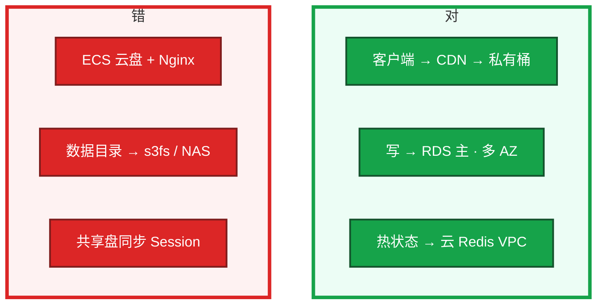
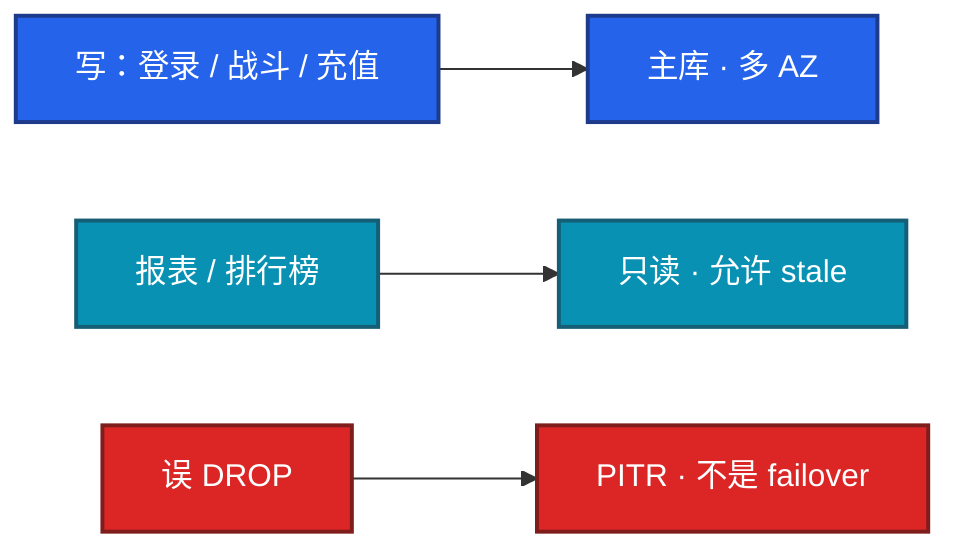
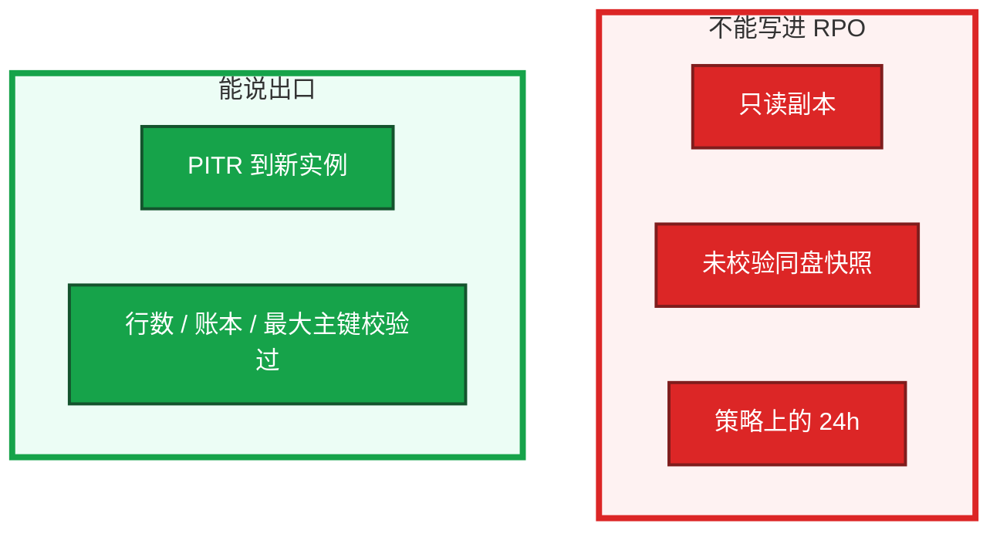
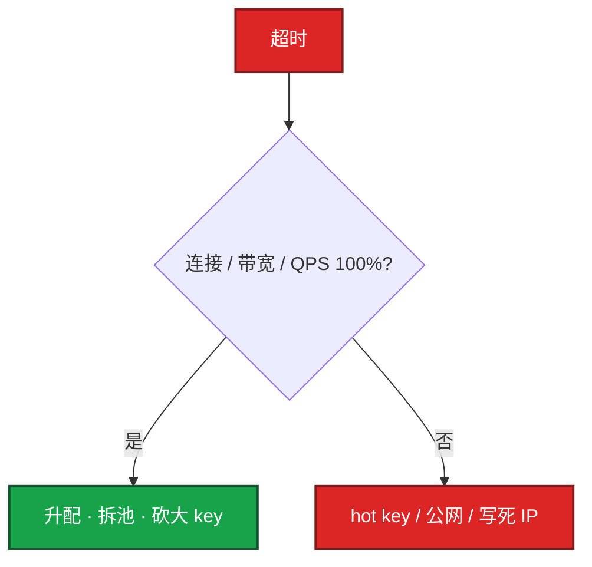
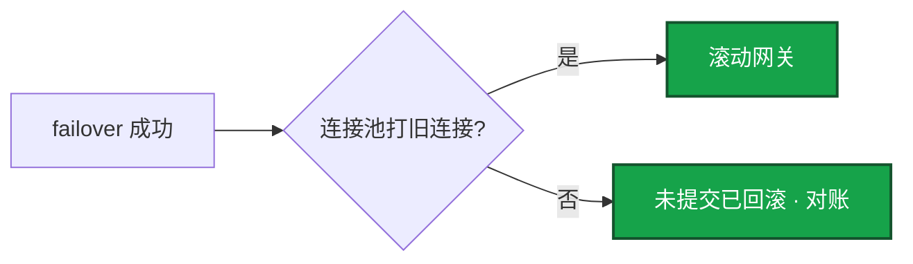

# 05｜云上存储与数据库 · 练习题

先自己画图或口述，再对照解答。每题标了覆盖范围：

| 标记 | 含义 |
|------|------|
| **核心** | 不懂整章就没建立起来 |
| **必会** | 值班和面试都要能讲 |
| **常用** | 线上会反复碰到 |
| **常考** | 白板和追问的高频口径 |

## 本题目录

- [Q1 块 / 对象 / 库各放什么](#q1)
- [Q2 多 AZ vs 只读](#q2)
- [Q3 RPO 与 restore](#q3)
- [Q4 云 Redis 硬顶](#q4)
- [Q5 空盘为什么慢](#q5)
- [Q6 max_connections](#q6)
- [Q7 Redis 公网 / 切主连接池](#q7)
- [Q8 RDS / Redis / OSS 红线](#q8)
- [Q9 NAS 与排障分流](#q9)
- [合上书](#合上书)

---

## Q1

**★★★★★｜热更放云盘和放对象存储差在哪？画各层放什么**

**覆盖**：核心 · 必会 · 常考

### 场景

测试环境包小，ECS + Nginx 一直没问题。开服十万客户端拉包，云盘 IOPS 和网卡打满。有人还想用共享云盘同步游戏状态，另有人要把跨服大文件塞进 RDS blob。

### 完整解答

云盘是块设备，绑实例，吞吐有上限，没有边缘节点。热更走对象存储 + CDN。数据库反过来：不能把数据目录放 s3fs。NAS 不当库、不当战斗状态、不当 CDN。

POSIX 低延迟 vs HTTP 海量不可变对象。观测：云盘 IOPS / BPS 触顶、ECS 网卡打满。止血：切 CDN。治理：模板禁止 ECS 当下载源。

### 再追问

- 跨服大文件放 RDS blob？——不行。备份、IOPS、恢复窗口一起拖垮。
- 普通云盘多挂载？——单实例。共享要 NAS / EFS，语义仍不是 Session 总线。

---

## Q2

**★★★★★｜RDS 多 AZ 和只读副本有什么区别？**

**覆盖**：核心 · 必会 · 常考

### 场景

「我们开了只读，所以已经高可用了。」登录写路径指到只读。主挂之后发现副本落后 15 分钟。另一边 failover 已完成，应用还在报 `gone away`。

### 完整解答

多 AZ 是 HA，抗 AZ 故障，切换有 RTO，备库不是用来扛业务读的。只读是扩展读，异步复制有延迟，主挂了只读不能当备份也不能自动变主（除非你提升）。误删数据两者都会跟着错，要靠备份 / PITR。

VIP 已切，连接池连接仍是旧连接。要能重连。活动刷表后副本落后分钟级，登录若指到只读会看到「刚买的道具没有」。切主窗口按「秒到分钟 + 连接池」写进预案，不要承诺无感。

### 再追问

多 AZ 能不能替代备份？——不能。failover 复制的是已经误删的数据。未提交事务切主后回滚，充值路径要能对账。

---

## Q3

**★★★★★｜你怎么定义备份 RPO？没 restore 过算数吗？**

**覆盖**：核心 · 必会 · 常考

### 场景

策略写着「每天备份，RPO 24 小时」。从来没 restore 过。binlog 留 7 天，运营 10 天后发现活动发错道具。有人准备在生产实例上「回滚试试」。

### 完整解答

RPO 是故障时最多丢多久，以最近一次 **校验成功的 restore** 为准。只读副本不是备份。PITR 依赖 binlog 保留天数。没演练过的 RPO 是假的。

止血：误操作走 PITR 到 **新实例**，再切连接串。治理：删除保护；充值库更严；只给 DBA `Restore` 不给 `DeleteBackup`。裸盘快照常是崩溃一致。合服前不要只打一块未校验快照。

### 再追问

- 跨地域备份能替代同城多 AZ 吗？——不能。跨地域 RTO 按小时；同城多 AZ 是分钟级。
- 释放 RDS 后备份还在吗？——产品而异，删除前看清楚。有的释放即清。

---

## Q4

**★★★★☆｜云 Redis 活动期超时，先看什么？**

**覆盖**：必会 · 常用 · 常考

### 场景

活动发奖。超时。有人把重试调大。另一边用了 `KEYS` 和跨 slot 事务。Redis 还开了公网地址。有人要把 Redis 当账本，「开了持久化」。

### 完整解答

先看连接数、带宽、QPS 是否触顶。云 Redis 是合同上限。集群版还要查跨 slot / `KEYS`。监控硬顶告警提前于 **80%**；开服夜水位 **< 70%**。

不能当唯一账本。持久化 / failover 可能丢秒级。账本在 RDS。客户端用配置端点。代理模式按云文档配连接池。禁 `FLUSHALL` / `KEYS` / `CONFIG`。

### 再追问

本机 redis-cli 通、应用不通？——查连接池、配置端点、安全组、是否打到旧 IP。不要先升配、不要先重启 Redis。

---

## Q5

**★★★★☆｜磁盘看起来很空，为什么突然变慢？**

**覆盖**：必会 · 常用

### 场景

盘还有 TB。应用超时，CPU 不高，await 高。用的是 gp2 / 突发盘。MySQL 数据在系统盘上。扩容后空间告警不消失。

### 完整解答

云盘 IOPS 按规格和容量，不是「还有 TB 就一定快」。gp2 / 突发盘积分耗尽会掉到基线，和 ECS t 系列同类。RDS 小盘同样先打满 IOPS。系统盘放 MySQL 是另一类慢。

止血：改 gp3 / io2 / ESSD 更高档，或拆盘。治理：按压测 IOPS 选型，不要按容量买最小盘。扩容后 `df` 不涨：文件系统没 grow，检查项要写上。不要在生产数据盘上试修；止血用快照新建盘挂上。

### 再追问

快照能不能当应用一致备份？——裸盘快照常是崩溃一致。库用 RDS 备份 / PITR。删实例有的产品连快照策略一起清。

---

## Q6

**★★★★☆｜RDS `max_connections` 打满怎么处理？参数组呢？**

**覆盖**：必会 · 常用

### 场景

`Too many connections`。应用把连接池调到 500，进程数很多。云上 `max_connections` 升不上去。开服夜有人想改参数组里的 innodb。只读规格小于主库，活动报表把只读打满。

### 完整解答

云上连接上限常绑规格。先杀长事务 / 泄漏连接，再升规格，不要无限加大应用池。连接池 × 进程数要算总账，开服前就算。

参数组有的要重启，开服夜禁止顺手改 innodb / `slow_query_log`，除非变更单写明接受重启。只读也要按读 QPS 选型。如果登录误指到只读，会超时或读到落后数据。写路径必须打主库。

### 再追问

`innodb_buffer_pool` 在云上能随便改吗？——常被规格锁死。改了可能要重启。当生产变更。

---

## Q7

**★★★★☆｜Redis 公网、切主后应用报错，各先看什么？**

**覆盖**：必会 · 常用 · 常考

### 场景

「方便家里连一下」，Redis 开了公网，扫描把连接打满。另一次 RDS 多 AZ 切主成功，新主健康，玩家登录持续失败，网关连接池没有重启。

### 完整解答

公网：内存库暴露在 DDoS 面上。只走 VPC，SG 只放应用。传输 TLS、静态加密默认开；密钥在 KMS / 角色上，不要把盘口令打进镜像。

切主：VIP / DNS 已切，连接池里还是旧连接。RTO 包含切换本身 + 连接池重连 + 未提交回滚。止血：重启连接池 / 滚动网关，不要再切一次主。Redis 同样：配置端点，禁止写死节点 IP，否则升主后打幽灵节点。

### 再追问

加密盘丢了 KMS 权限？——等于丢盘。破窗流程要能拿到密钥，不能只备份盘。快照继承加密。

---

## Q8

**★★★★★｜RDS / Redis / OSS 生产红线各钉哪几条？**

**覆盖**：核心 · 必会 · 常考

### 场景

开服检查单要写红线。有人只写「开了多 AZ」。桶还是公共读，Redis 公网忘关，binlog 只留 7 天。

### 完整解答

| 层 | 红线（开口能背） |
|----|------------------|
| RDS | 玩家 / 充值多 AZ；写路径禁只读；删除保护；PITR 覆盖发现窗口；备份失败告警；池 × 进程数先算；切主演练含连接池 |
| Redis | 无公网；不当账本；硬顶 80% 告警；配置端点；禁 KEYS / FLUSHALL；发奖禁单 key；开服夜 < 70% |
| OSS | 私有 + Block Public Access；CDN 内网回源；禁止 ECS Nginx；版本在 key；禁止 RDS blob；删除权限单独授 |

释放前确认备份是否还在。跨地域不能替代同城多 AZ。上集群前验收跨 slot。

### 再追问

账本 binlog 留几天？——覆盖发现窗口。游戏常见几天后才发现发错道具，账本常见 14～30 天。7 天不够。

---

## Q9

**★★★★☆｜NAS 能干什么？存储慢按什么顺序排除上限？**

**覆盖**：必会 · 常用

### 场景

有人提议战斗服用 EFS 同步状态。另一人要把 MySQL 数据目录放 NAS。「数据库慢」，有人开始加索引。CPU 不高。也可能是 Redis 带宽 100%，也可能是备份走 NAT。账单也炸了。

### 完整解答

NAS 能：多实例读同一份配置、构建缓存。不能：MySQL 数据、战斗服状态、热更下载源。录像 / 日志先写本地再异步上对象存储。

云上「慢」经常是规格上限而不是 SQL 没索引。本章先排除上限：

1. 云盘 IOPS / BPS 是否贴规格线、突发积分
2. RDS CPU 是否锁在规格、`max_connections`
3. Redis 带宽 / 连接 / QPS 是否 100%、hot key
4. 备份 / 对象存储是否穿 NAT、公共读

任一触顶，先升配止血，再谈 SQL 和代码。讲故障要用规格说话。

账单炸：公共读或跨地域复制。先断公网再查访问日志。不要先开会。

### 再追问

游戏回档是不是就是点一下 PITR？——云备份是素材。停服、选点、校验、公告在游戏运维章。本章要求能说出「回到哪一分钟」和「上次 restore 哪天」。

---

## 合上书

- [ ] 能画出块 / 对象 / RDS / Redis / NAS 各放什么，并说出五件禁止
- [ ] 能区分多 AZ 与只读；切主后先收连接池，误 DROP 走 PITR 到新实例
- [ ] 能定义 RPO = 校验过的 restore；binlog 覆盖发现窗口
- [ ] 能把 Redis 超时讲到硬顶 80%、无公网、配置端点、不当账本
- [ ] 能解释空盘慢 = IOPS / 突发积分；扩容后 `df` 要 grow
- [ ] 能默写 RDS / Redis / OSS 生产红线，并用规格线做排障分流
