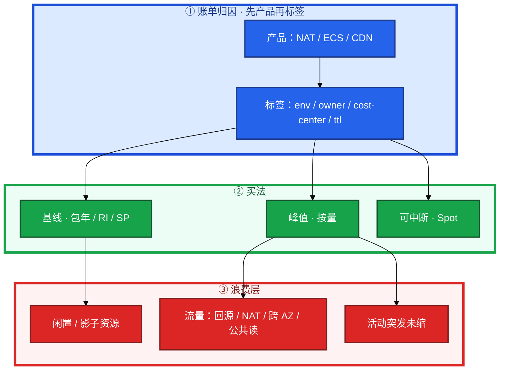
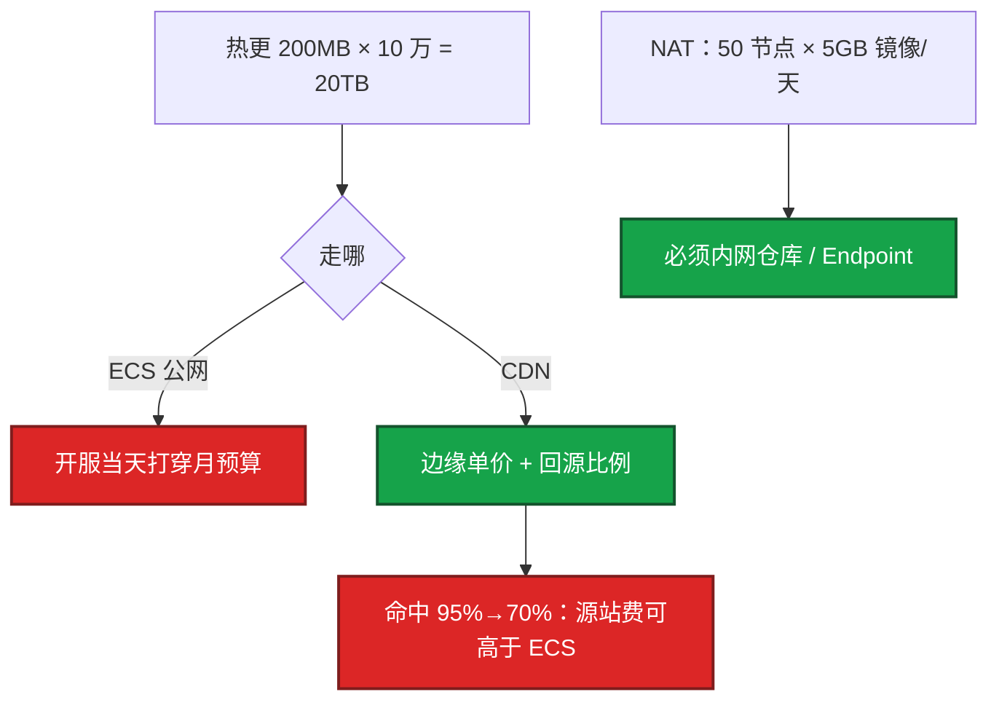
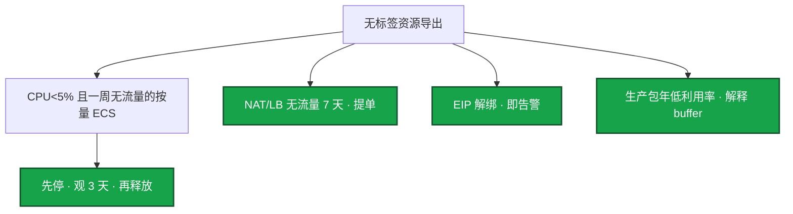
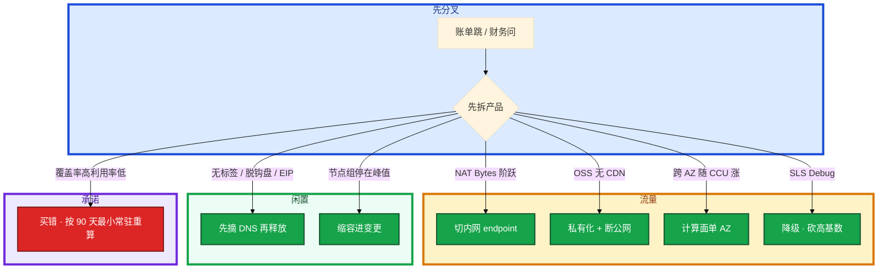

# 成本治理


月底打开账单，ECS 没变，流量那一行先炸。财务按开服当天 3 万 CCU 买了 50 台一年，三个月后日常 8 千，40 台闲置仍在付。群里有人要把战斗服改 Spot「省 70%」。

先别动手。这一章后半全是你会动手的：**怎么打标签、怎么算预留、怎么扫闲置、活动突发怎么买怎么缩。** 前面的概念和原理，是为了让你动手时不把峰值当全年、不把 Spot 开到战斗服。

**读完你能：** 先拆产品再拆标签；基线包年、峰值按量、Spot 只给可中断；开服周每天对着 NAT / CDN / 公共读拆账单；活动结束有缩容 runbook。

## 本章目录

缩进 = 上下级。3 下面才是 3.1。

想钉在**正文左边**跟着滚：菜单 **查看 → 打开视图 → 大纲**。Markdown 预览做不到独立左栏，目录只能写在文章开头。

- [1. 基本概念](#1-基本概念)
- [2. 架构图](#2-架构图)
- [3. 原理](#3-原理)
  - [3.1 包年 / 按量 / Spot](#31-包年--按量--spot--savings)
  - [3.2 流量费](#32-流量费一次账单暴涨从哪来)
  - [3.3 FinOps：标签 / 预留 / 闲置](#33-finops标签--预留--闲置)
  - [3.4 游戏活动突发成本](#34-游戏活动突发成本)
- [4. 安装部署](#4-安装部署)
  - [4.1 生产怎么选](#41-生产怎么选)
  - [4.2 开服弹性怎么买](#42-开服弹性怎么买)
- [5. 核心配置](#5-核心配置)
- [6. 常用命令](#6-常用命令)
- [7. 常用操作](#7-常用操作)
  - [7.1 周扫闲置](#71-周扫闲置)
  - [7.2 开服周盯账单](#72-开服周盯账单)
  - [7.3 活动缩容](#73-活动缩容)
  - [7.4 合服 / 关服清单](#74-合服--关服清单)
  - [7.5 优化当变更](#75-优化当变更)
- [8. 生产排障](#8-生产排障)
- [9. 必会 · 常考](#9-必会--常考)
- [合上书](#合上书问自己)

**本章不讲：** NAT / 跨 AZ 路径、区服单 AZ → [01](../01-云网络与安全/)；OSS 公共读、CDN 回源内网 → [02](../02-阿里云生产/)；Spot 2 分钟、NAT 处理费、Savings vs RI → [03](../03-AWS生产/)；切云后两套账单 → [04](../04-多云对照/)；备份保留 365 天、只读忘删 → [05](../05-云上存储与数据库/)；无标签治理的多账号拆账单、SCP 禁买大规格 → [07](../07-IAM与多账号/)；开服缩容与合服清单流程细节 → [08-游戏运维 / 02-开服合服](../../08-游戏运维专题/02-开服合服/)；成本作为可靠性合同、错误预算停发布 → [10-02](../../10-SRE实践/02-SLO错误预算与FinOps/)。

---

## 1. 基本概念

账单里游戏最常被打穿的是流量、NAT、闲置和「开服按峰值包一年」。计费要跟负载形态匹配，不是越包年越省。不背价格表。

负载分三层，计费也分三层。先砍闲置和流量，再谈 RI / Spot。上来就 Spot 战斗服是错的。

| 层 | 钱从哪出来 |
|----|------------|
| **计算** | 基线包年 / RI / SP；峰值按量；Spot = 可中断 |
| **数据** | RDS / Redis 规格；只读忘删；备份留 365 天 |
| **流量** | CDN 边缘、回源、NAT 处理费、公网出、跨 AZ、专线出云 |
| **日志** | SLS / CW 摄入、高基数索引、Debug 全量 |
| **影子** | 脱钩盘、解绑 EIP、空闲 NAT / LB、旧高防、孤儿 LB |

三个买法不要混：

| 买法 | 给谁 |
|------|------|
| **包年 / RI / Savings** | 常驻基线：老区逻辑服、RDS、EKS 系统节点 |
| **按量** | 可预期活动：版本日、节日，提前几小时知道，结束释放 |
| **Spot / 抢占式** | 可中断：CI、压测、统计离线。战斗服禁止 |

出账大头通常不是 32 核 ECS。说不清「这 8 万是 NAT 还是 ECS」就不要谈优化。单位经济：每 CCU 成本 = (计算 + 数据 + 流量 + 日志) / 平均 CCU，开服周和日常差几倍是正常的，用来判断该缩计算还是该砍流量。开服周这个数字会难看，要用「第七天以后」对比，不要用第一天吓财务。

张口要有量级：计算 / 数据库 / 流量 / 日志各占百分之多少；单逻辑服规格和包年单价；开服按量扛几天再转；CDN 命中率；NAT 是否曾经贵过节点。没有数字的「我们很注重成本」等于没答。

> **记住**：先拆产品再拆标签；先砍闲置和流量，再谈 RI / Spot。

---

## 2. 架构图

先把整张图钉住。后面标签、预留、闲置、活动突发都对着这张图说话。



图上三条线：

1. **没有标签就没有治理。** 先按产品拆（NAT 还是 ECS），再按标签拆环境。
2. **承诺锁的是基线，不是峰值。** 开服当天 CCU 不是全年。
3. **弹上去容易、缩下来要人。** 活动结束当天若不进变更单，节点组 min=max=峰值会过夜。

三种负载曲线（买的时候选，浪费的时候故障形态不一样）：


FinOps 循环：Inform（标签 + 分账）→ Optimize（闲置 / 预留 / 流量）→ Operate（预算 / 开服周盯账）。覆盖率 100% 但利用率 40% 是买错，不是治理成功。

---

## 3. 原理

原理只保留动手和面试会用到的：承诺按什么数字买、流量从哪炸、标签怎么落到执行、活动突发怎么买怎么缩。

**本节 4 块：** 3.1 买法 · 3.2 流量 · 3.3 FinOps · 3.4 活动突发

### 3.1 包年 / 按量 / Spot / Savings

**包年买错的典型：** 开服当天 CCU 3 万，按 3 万买了 50 台一年。三个月后日常 8 千，40 台闲置仍在付。游戏区服有生命周期，新服前两周和老服完全不是同一条曲线。

系统里发生了什么：承诺锁死了峰值容量。你眼睛在费用中心看到这 50 台仍在出账，利用率 40%。卡住先解释这是买错还是节日 buffer，不要先退订折损。治理：新服 1.5 倍按量七天，转包年底用 90 天最小常驻。

转包年 / RI 的门禁：规格稳定、区服不会合、至少看过一个完整活动周期。AWS Savings Plans 比 RI 灵活（可跨规格族，看买的是 Compute 还是 EC2 Instance SP），但仍是承诺用量；用量掉下去一样浪费。Compute SP 盖 EC2 / Fargate / Lambda，盖不住 NAT 和流量——承诺买错品类是第二常见浪费。

承诺用量怎么算：看过去 90 天 **最小** 常驻，不是平均，更不是峰值。平均会把活动峰值摊进去导致买多；峰值会把开服当天当全年。游戏用「老区日常 CCU 对应的机器数」做包年底，其余一律按量。

按量坑：忘记释放。按量 ECS 停机是否还收盘、是否收 EIP，各云不同——**停机不等于零费用**。你眼睛在账单里看到已停实例仍出盘费 / EIP 费。卡住先对产品计费规则，不要以为关机就清零。治理：标签 `ttl` / `owner` / `env`，定时扫；测试账号预算告警。包年退订有折损，把测试开成包年比按量忘关更痛。

Spot：折扣大，中断约 2 分钟（AWS）或更短。开服扩容用 Spot 会在最需要容量时被收走。压测机、镜像构建可以。混合节点组必须把有状态 taint 掉 Spot。Spot 节省比例只能出现在 CI / 压测的故事里，不要把战斗服改 Spot 当省钱案例。细节在 03。

RI / Savings 覆盖率是结果指标，不是目标——覆盖率 100% 但利用率 40% 是买错。成本治理的 KPI 是闲置率和流量异常。

> **记住**：基线包年，峰值按量，Spot 只给可中断；承诺按 90 天最小常驻，不按峰值。

### 3.2 流量费：一次账单暴涨从哪来

月底打开账单，ECS 没变，流量那一行先炸。游戏最常被打穿的不是 32 核单价。

| 项 | 何时产生 | 游戏场景 |
|--|---------|---------|
| 公网出 | ECS / LB 出互联网 | 没走 CDN 的下载、日志外发、源站被打 |
| CDN | 边缘出流量，一般比源站公网便宜 | 热更应该走这里 |
| 回源 | CDN 回 OSS / ECS | 缓存击穿、不会缓存的 query string、短 TTL |
| NAT 处理费 | 私网访问公网的字节数（AWS 很贵） | 拉镜像、打第三方 API、错误地把下载走 NAT |
| 跨 AZ | AWS 明确收；阿里部分场景也有 | 逻辑服东西向、LB 跨 AZ、NAT 跨 AZ |
| 专线出云 | 按量 | IDC 拉云上备份 |
| 负载均衡 LCU | ALB 按规则 / 新连接计 | HTTP 入口比「一台 CLB 包年」更难估 |



一次账单暴涨跟着走。费用中心按产品拆（Cost Explorer / 费用中心），NAT Gateway 的 Bytes 和 ECS 公网分开看。

1. **NAT 字节阶跃**：开服滚动，镜像没走内网仓库 / VPC Endpoint。AWS 上 NAT 处理费经常贵过节点本身。卡住先切内网 endpoint，不要先买更大的 NAT。
2. **OSS / S3 流出无 CDN**：Bucket 公共读，爬虫把包拖走；或回源走公网。立刻私有化 + 内网域名，再查访问日志谁在拖。
3. **跨 AZ 随 CCU 线性涨**：计算面误开跨 AZ。区服单 AZ 是成本理由，见 01。逻辑服 RPC 10Gbps 量级时，AWS 费用可以接近计算本身——这是区服单 AZ 的成本理由，不是偷懒。大厅 / 登录 / HTTP 仍可多 AZ。关掉 NLB 跨 AZ 同样省钱，某 AZ 目标全挂就不会漂，必须显式接受。
4. **SLS / CloudWatch 摄入随 Debug 涨**：高基数（玩家 ID 当索引）+ Debug 全量打生产。磁盘还没满，账单先满。黄金指标用 Prom 且克制 label；日志生命周期按前缀。止血：降采样、砍字段、TTL。为什么还要云监控：厂商指标（ECS / NLB / NAT），和 Prom、日志告警去重，否则开服夜三渠道同时炸。

CDN 账：边缘流量单价 × 下载量 vs 源站公网 × 回源比例。命中率从 95% 掉到 70%，回源费可以比 ECS 月费还高。短 TTL、带 query string 的版本检查、不会缓存的动态接口，都是命中率杀手。强更窗口单独预热，不要和「省 CDN」同一周做。

故障型账单还有：安全组 `0.0.0.0/0` 加 EIP，矿机扫描。开服周每天看一眼流量，不要月底才打开账单。

止血：热更强制 CDN + 私有桶；ECR / OSS 内网 endpoint；关掉跨 AZ 流量（区服单 AZ 计算面）；WAF / 高防后源站不出公网。治理：预算告警按项目；无标签资源禁止申请生产网关。

算一笔账再开口：节点每天拉 5GB 镜像 × 50 台 = 250GB/天穿 NAT，AWS 处理费可以超过节点本身；热更 200MB × 10 万 = 20TB，走 ECS 公网开服当天就能把月预算打穿。这些数字比「我们会注意流量」有用。

> **记住**：流量：CDN、回源、NAT、跨 AZ、公共读，经常先于 ECS 单价。

### 3.3 FinOps：标签 / 预留 / 闲置

没有标签就没有治理。FinOps 不是财务周点控制台，是 **分账 → 承诺 → 回收** 三条能执行的闸。

**标签（Inform）**

强制 `env`、`owner`、`cost-center`、`ttl`。生产禁止无标签 NAT / LB / EIP。无标签资源当闲置打，禁止申请生产网关。临时压测资源必须有 `ttl` 和负责人，过期自动提单关闭。

先按产品拆（NAT 还是 ECS），再按标签拆环境。说不清「这 8 万是谁」就不要谈优化。多账号拆账单更清楚，见 07；标签是账号内的第二把尺。

预算按账号或项目设阈值，**70% 告警、90% 升级**，开服周单独临时调高，避免告警疲劳后把真爆炸当噪声。

**预留（Optimize · 承诺）**

| 规则 | 口径 |
|------|------|
| 数字 | 过去 **90 天最小常驻**，不是平均、不是峰值 |
| 门禁 | 规格稳定、区服不会合、过一个完整活动周期 |
| 品类 | Compute SP 盖不住 NAT 和流量；买错品类是第二常见浪费 |
| KPI | 闲置率和流量异常；覆盖率 100% 利用率 40% = 买错 |
| 退订 | 有折损；测试开成包年比按量忘关更痛；能改挂就改挂 |

预留容量 / 包年未使用也是闲置——财务看利用率。SRE 要能解释「这 20 台是过年活动 buffer」还是「忘了」。buffer 要有数字：例如春节 CCU 模型 × 1.2，过完节 **7 天内**缩回。向财务解释 buffer 要给节日模型和过完节的缩容日，不给「以防万一」。

**闲置（Operate · 回收）**

比「机器太大」更常见：

- 按量磁盘跟释放的 ECS 脱钩后仍在
- EIP 解绑仍占费
- 测试 CLB / ALB、空闲 NAT（NAT 按小时 + 处理费）
- 旧高防实例、旧域名仍解析到付费 IP
- RDS 只读副本忘删、备份保留 365 天无人要
- ACK / EKS 节点组 min=max=峰值过夜
- 旧监听还挂在 CLB 上、测试域名 A 记录指向已删 ECS 的残留 EIP
- ACK 里 Service 创建的孤儿 LB、生命周期失败但仍付存储的快照

停机 ≠ 零费用。按量 ECS 停机是否还收盘、是否收 EIP，各云不同，要查不要假设。

ACK Service 删了 LB 还在计费 = 孤儿 LB。改注解也可能重建 LB。清理按入口摘掉再释放。这和「LB 用域名」是同一类生命周期问题。

隐藏成本：多 AZ 计算面用稳定性换跨 AZ 流量；NAT 集中导致 NAT 费 > 节点费；日志全量索引账单先于磁盘爆；每环境一个 ALB「以后可能用」；备份跨地域要算钱。数据传输出境是出海合规和流量双问题。

> **记住**：标签 `env/owner/cost-center/ttl`；预留按 90 天最小常驻；无标签资源当闲置打；停机 ≠ 零费用。

### 3.4 游戏活动突发成本

开服 / 节日 / 版本日不是「多买几台」。计算面能按小时弹，**数据面不能**。流量和日志会按 CCU 非线性涨。


开服成本曲线：第 1 天峰值高、第 2 周掉、合服后再掉。错误策略是按峰值包年。

正确策略：

1. 新服用按量或短期预留，规格与老服模板一致，方便之后转包年
2. 计算面按 CCU 扩，数据面（RDS / Redis）提前升配——库升配窗口长，来不及按小时弹
3. 热更流量走 CDN，把流量费从不可控公网变成可控 CDN
4. 活动结束有缩容 runbook：节点组、按量 ECS、临时只读、压测 Redis 副本
5. 合服后旧服资源清单关闭，含 LB、NAT、磁盘、监控包

数字示例（用自己的替换）：单逻辑服 2000 CCU、16c32g；新服第一天 1.5 倍按量；7 天后转包年 1.0 倍基线；活动结束缩容进变更，和开服一样有检查项。

弹性不是 HPA 万能：有状态逻辑服扩容要加进程和进服调度，不是云控制台加两台就均流。HPA 只能覆盖无状态；成本问题是买多了不缩，不是没开 HPA。

活动突发还要单独记账的几项：

| 突发项 | 为什么贵 | 怎么收 |
|--------|----------|--------|
| 临时只读 / 压测 Redis | 忘删收到下一次活动 | `ttl` + 负责人，过期提单 |
| 数据面升配 | 来不及按小时弹，只能提前 | 活动后降配进同一张变更单 |
| CDN 回源 | 短 TTL / 未预热 | 强更单独预热，不要和「省 CDN」同一周 |
| NAT / 镜像 | 滚动扩容穿公网 | 内网仓库，开服周盯 Bytes |
| Debug 日志 | 摄入随 CCU 涨 | 当天降级，不要等出账日 |
| 节点组 min=峰值过夜 | 弹上去没人缩 | 结束当天进变更 |

向财务解释多买：用 CCU 曲线和失败成本。开服买 1.5 倍按量三天，比买少了排队、商店打不开、充值失败的客诉便宜。解释完必须接「第三天开始缩」——只讲买不够、不讲收回，财务下次不信。

> **记住**：开服按峰值签一年 = 三个月后浪费；缩容要有 runbook，和开服对称；活动突发先升数据面，再弹计算面。

---

## 4. 安装部署

### 4.1 生产怎么选

| 项 | 选 | 不选 |
|----|----|------|
| 基线 | 90 天最小常驻 → 包年 / RI / SP | 按开服峰值签一年 |
| 峰值 | 按量，结束释放 | Spot 战斗服 |
| 标签 | `env/owner/cost-center/ttl` 强制 | 无标签 NAT / LB / EIP |
| 预算 | 70 / 90；开服周临时调高 | 告警疲劳后真爆炸没人看 |
| 流量 | CDN + 内网 endpoint；区服计算面单 AZ | 热更走 ECS 公网；镜像穿 NAT |
| 闲置 | 周扫 + DNS 先摘再释放 | 靠自觉；关机当清零 |

### 4.2 开服弹性怎么买


数据面提前升配。热更走 CDN。合服清单与开服对称：LB、NAT、磁盘、监控包、旧入口 DNS 一起关。包年窗口未到不要强行退订折损，能改挂就改挂。包年未到期的机器改挂新服或接受沉没成本，不要为了「用掉」把空服流量打上去。财务问「为什么关服还在付钱」时，答包年剩余窗口和是否改挂。关服 ≠ 立刻删备份。

---

## 5. 核心配置

| 项 | 默认要落到 | 改错会怎样 |
|----|------------|------------|
| 标签 | `env` `owner` `cost-center` `ttl` | 说不清 8 万是谁 |
| 预算 | 70% 告警 / 90% 升级 | 开服周疲劳后真爆炸当噪声 |
| 节点组 | 活动后 min 缩回基线 | min=max=峰值过夜 |
| CDN TTL | 强更窗口单独预热 | 财务周改 5 分钟，命中率 95%→70% |
| NAT / Endpoint | 镜像走内网 | NAT 费 > 节点费 |
| 无标签闸 | 禁止申请生产网关 | 影子资源堆一年 |

> **记住**：优化是生产变更，要回滚。省钱案例讲数字，也要讲你没动哪些（战斗服规格、RDS 多 AZ）。

---

## 6. 常用命令

值班先拆产品，不要先谈单价。

| 目的 | 看什么 |
|------|--------|
| 分账 | 费用中心 / Cost Explorer 按产品，再按标签 |
| NAT | Bytes 是否阶跃；是否贵过节点 |
| CDN | 命中率；回源比例 |
| 公共读 | OSS / S3 流出无对应 CDN |
| 闲置 | 无标签 NAT / LB / EIP；解绑 EIP；CPU<5% 一周无流量 |
| 预留 | 覆盖率 vs 利用率；90 天最小常驻 |
| 日志 | SLS / CW 摄入是否跟 Debug 走 |

开服周每天对着费用中心走一遍：

```text
ECS / EC2、LB、NAT、CDN、OSS / S3、RDS、日志
NAT Bytes 是否阶跃
OSS 流出有没有对应 CDN
跨 AZ 是否随 CCU 线性涨
SLS 摄入是否跟 Debug 走
```

被问优化案例：给一次砍闲置（释放了多少 NAT / EIP）或一次切 CDN（回源比例从 X 到 Y）的前后对比。不要把战斗服改 Spot 当案例。

---

## 7. 常用操作

### 7.1 周扫闲置



卡住先从 DNS / 入口摘掉再释放，避免删了还在解析。不要靠「大家自觉」。孤儿 LB、失败快照在周报里单列，不要和「机器太大」混在一张优化表里。确认不是备用。生产关资源走变更。

### 7.2 开服周盯账单

开服前七天和后三天，每天拆一次。发现当天改，不要等出账日。异常模式：NAT 字节阶跃 = 镜像没走内网；OSS 流出无 CDN = 桶被扫 / 公共读；跨 AZ 随 CCU 线性涨 = 计算面误开跨 AZ；SLS 摄入随 Debug 涨 = 日志级别没改。

临时资源必须有 `ttl` 和负责人。财务要的是「峰值买够」，SRE 要的是「峰值过后收回」——矛盾用 runbook 解决。

### 7.3 活动缩容

活动结束当天进变更单：节点组、按量 ECS、临时只读、压测 Redis。有状态服 drain，不要直接缩。第三天开始缩——向财务承诺过就要做。

### 7.4 合服 / 关服清单

LB、NAT、只读、Redis、高防、EIP、监控包、磁盘快照。漏一个 NAT 会按小时收到下一年。DNS 先摘再释放。关服检查项：解析、证书、监控、备份保留策略。包年改挂或接受沉没成本，不要为了「用掉」把空服流量打上去。

### 7.5 优化当变更

改 CDN TTL、关跨 AZ、并 NAT、缩节点，都是生产变更。要有回滚，不要财务周直接在控制台点。NAT 合并可能把 SNAT 端口和 AZ 单点一并带来（01）。CDN TTL 变短会打回源费。缩节点没有 drain 会踢人。

---

## 8. 生产排障

账单异常用分流，不是先开会。



| 现象 | 先做什么 | 不要做什么 |
|------|----------|------------|
| 流量比 ECS 贵 | 拆 NAT / CDN 回源 / 跨 AZ / 公共读 | 只盯 32 核单价 |
| 命中率 95%→70% | 短 TTL、query string、动态接口 | 和强更同一周「省 CDN」 |
| 已停实例仍出账 | 对盘 / EIP 计费规则 | 以为关机清零 |
| 关服还在付钱 | 清单 + 包年改挂 | 空服打流量「用掉」 |
| 优化后长连接掉 | 当生产变更回滚 | 财务周继续点 |
| 每 CCU 开服周难看 | 用第七天以后对比 | 用第一天吓财务 |

游戏故事：开服按第一天 3 万 CCU 包了 50 台一年，三个月后日常 8 千，40 台闲置仍在付。后来改成：新服 1.5 倍按量七天，转包年底用 90 天最小常驻。另一笔：镜像穿 NAT，处理费超过节点本身；切内网仓库后 NAT Bytes 掉一个数量级。财务周有人把 CDN TTL 从 1 天改成 5 分钟「省存储」，命中率从 95% 掉到 70%，回源费比 ECS 月费还高。

---

## 9. 必会 · 常考

| 说法 | 对错 | 口径 |
|------|:----:|------|
| 越包年越省 | 错 | 峰值按量；按峰值签一年三个月后浪费 |
| 承诺按平均值买 | 错 | 90 天最小常驻 |
| 战斗服上 Spot 省 70% | 错 | Spot 只给可中断 |
| 覆盖率 100% 就是治理好 | 错 | 利用率 40% 是买错 |
| Compute SP 能盖 NAT | 错 | 盖不住流量和 NAT |
| 停机 = 零费用 | 错 | 盘 / EIP 可能仍计 |
| 无标签也能优化 | 错 | 说不清 8 万是谁 |
| 成本 KPI 是 RI 覆盖率 | 错 | 闲置率和流量异常 |
| 区服计算面单 AZ 是偷懒 | 错 | 跨 AZ 可接近计算本身 |
| HPA 能解决开服成本 | 错 | 有状态服要调度；问题是不缩 |
| 优化可以财务周直接点 | 错 | 生产变更，要回滚 |
| 向财务只讲买不够 | 错 | 必须接第几天开始缩 |
| 关服立刻删备份 | 错 | 关服 ≠ 立刻删备份 |
| 为用掉包年把空服打满 | 错 | 改挂或接受沉没成本 |

数字：新服 **1.5 倍按量七天**；转包年 **90 天最小常驻**；预算 **70 / 90**；buffer 春节 CCU × **1.2**、过完节 **7 天内**缩回；热更 200MB × 10 万 = **20TB**；NAT 50 × 5GB/天；CDN 命中 **95%→70%** 回源费可高于 ECS。

易混：覆盖率 vs 利用率；关机 vs 清零；buffer vs 闲置；边缘流量 vs 回源；RI vs Compute SP；HPA vs 有状态扩容。

---

## 合上书，问自己

1. 钱从哪几层出来？为什么先砍闲置和流量再谈 RI / Spot？
2. 包年按什么数字买？Spot 能不能给战斗服？停机是不是零费用？
3. 流量五件套是哪五件？NAT 贵过节点时先做什么？
4. FinOps 三个闸：标签、预留、闲置，各落到哪几条强制项？
5. 活动突发：数据面和计算面谁先升？缩容哪天进变更？怎么跟财务讲 1.5 倍？
6. 开服周每天拆哪几行？合服还在付钱怎么答？

六题都能口述，这一章就过了。下一章把爆炸半径关进账号树：长期 AK、SCP、泄漏先禁 Key。
