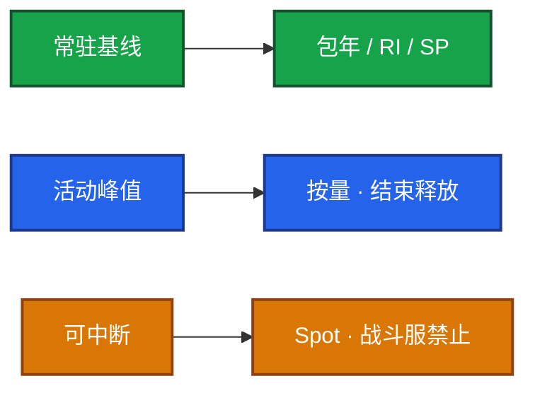
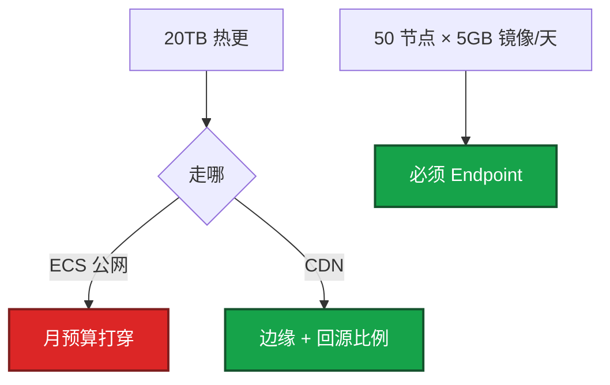
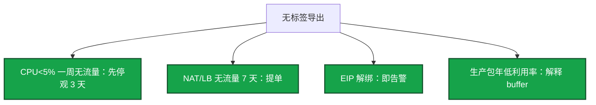

# 06｜成本治理 · 练习题

先自己画图或口述，再对照解答。每题标了覆盖范围：

| 标记 | 含义 |
|------|------|
| **核心** | 不懂整章就没建立起来 |
| **必会** | 值班和面试都要能讲 |
| **常用** | 线上会反复碰到 |
| **常考** | 白板和追问的高频口径 |

## 本题目录

- [Q1 包年 / 按量 / Spot](#q1)
- [Q2 流量比 ECS 贵](#q2)
- [Q3 开服弹性](#q3)
- [Q4 闲置与影子资源](#q4)
- [Q5 FinOps 标签 / 预留](#q5)
- [Q6 活动突发成本](#q6)
- [Q7 单 AZ 与优化风险](#q7)
- [Q8 日志账单 / 开服周](#q8)
- [Q9 关服还在付钱](#q9)
- [合上书](#合上书)

---

## Q1

**★★★★★｜游戏服该包年还是按量？Spot 呢？**

**覆盖**：核心 · 必会 · 常考

### 场景

开服当天 CCU 3 万，财务按 3 万买了 50 台一年。三个月后日常 8 千。有人提议战斗服上 Spot「省 70%」。按量测试机停机了，账单还在跳。

### 完整解答

跑满三个月且规格稳定的基线：包年 / RI / Savings。活动峰值：按量，结束释放。Spot 只给可中断（CI、压测）。战斗服和开服当天容量不用 Spot。承诺按 **90 天最小常驻**，不按平均、不按峰值。

覆盖率 100% 但利用率 40% 是买错。Compute SP 盖不住 NAT 和流量。停机按量 ECS 通常不是零费用：盘、EIP、部分产品仍计费。

### 再追问

怎么省 30%？——先砍闲置和流量，再谈 RI。上来 Spot 战斗服扣分。KPI 不是 RI 覆盖率，是闲置率和流量异常。

---

## Q2

**★★★★★｜账单里流量比 ECS 还贵，从哪查？**

**覆盖**：核心 · 必会 · 常用

### 场景

费用中心里 NAT、CDN 回源、跨 AZ 加起来超过计算。热更没走 CDN，镜像穿 NAT，Bucket 公共读。有人只盯 ECS 单价。命中率从 95% 掉到 70%。

### 完整解答

拆：公网出、CDN、回源、NAT 处理费、跨 AZ、专线出云。AWS NAT 处理费经常贵过节点。热更 200MB × 10 万 = 20TB，走 ECS 公网开服当天打穿月预算。

止血：切内网 endpoint、CDN、区服计算面单 AZ、立刻私有化公共桶。开服周每天看一眼流量。命中率杀手：短 TTL、query string 版本检查、不会缓存的动态接口。强更窗口单独预热，不要和「省 CDN」同一周做。

### 再追问

财务周把 CDN TTL 改成 5 分钟「省存储」？——命中率掉、回源费可高于 ECS 月费。优化是生产变更，要回滚。

---

## Q3

**★★★★☆｜开服弹性成本怎么买才不亏？**

**覆盖**：必会 · 常用 · 常考

### 场景

新服第一天峰值高，第二周掉。数据面来不及按小时弹。活动结束没人缩。合服后旧 NAT 还在。HPA 被当成成本方案。

### 完整解答

新服按量起，规格与模板一致，7 天～一个活动后再转包年。数据面提前升配。热更走 CDN。活动结束有缩容清单。合服后关旧 LB / NAT / 盘。

有状态服不是加两台就均流。HPA 只能覆盖无状态。向财务解释多买：1.5 倍按量三天，比买少了排队 / 商店打不开便宜。必须接「第三天开始缩」。

### 再追问

合服后旧入口 DNS 不摘会怎样？——玩家还打到已关高防 / LB，既产生流量费又「偶连不上」。关服 ≠ 立刻删备份。

---

## Q4

**★★★★☆｜有哪些闲置比「机器买大了」更常见？**

**覆盖**：必会 · 常用

### 场景

财务盯规格。真正漏斗是脱钩的盘、解绑 EIP、空闲 NAT、孤儿 LB、节点组 min 停在峰值。包年买了不用也没人解释。ACK Service 删了，LB 还在计费。

### 完整解答

脱钩的盘、解绑仍计费的 EIP、空闲 NAT / LB、旧高防 IP、忘删的只读和超长备份、节点组 min 停在峰值。包年买了不用也是闲置。靠标签 `owner/env/ttl` 和周扫，不靠自觉。

先从 DNS / 入口摘掉再释放。buffer 要有数字：春节 CCU × 1.2，过完节 7 天内缩回。孤儿 LB：改注解也可能重建 LB。停机 ≠ 零费用。

### 再追问

生产包年低利用率怎么跟测试忘关分表？——buffer 给节日模型和缩容日；测试忘关走 ttl 周扫。不要混在一张优化表里。

---

## Q5

**★★★★★｜FinOps 标签和预留怎么落到能执行，而不是口号？**

**覆盖**：核心 · 必会 · 常考

### 场景

「大家都要打标签」。生产 NAT 无标签。预算告警开服周天天炸，后来真爆炸没人看。有人按平均值买满 RI，覆盖率 100%、利用率 40%。

### 完整解答

FinOps 三个闸：标签（Inform）→ 预留（承诺）→ 闲置（回收）。

强制 `env` / `owner` / `cost-center` / `ttl`。生产禁止无标签 NAT / LB / EIP。无标签资源禁止申请生产网关。预算 **70% 告警、90% 升级**，开服周单独临时调高。

预留：过去 90 天 **最小** 常驻；门禁是规格稳、过一个活动周期。Compute SP 盖不住 NAT。覆盖率是结果不是目标。

先按产品拆，再按标签拆。说不清「这 8 万是谁」就不要谈优化。多账号拆账单见 07。临时压测必须有 ttl 和负责人。

### 再追问

每 CCU 成本怎么用？——月账单 / 月均 CCU，判断该砍计算还是该砍流量。开服周难看，用第七天以后对比，不用第一天吓财务。

---

## Q6

**★★★★★｜游戏活动突发成本怎么买、怎么缩？**

**覆盖**：核心 · 必会 · 常用

### 场景

节日活动。有人按峰值加买一年包年。数据面没提前升。临时只读和压测 Redis 忘了写 ttl。结束当天节点组 min=max=峰值过夜。Debug 日志全开。

### 完整解答

计算面能按小时弹，数据面不能。活动前：数据面提前升配、计算面 1.5 倍按量、CDN 预热。活动中盯 NAT / 回源 / Redis。结束当天缩容进变更。

突发还要单独记账：临时只读 / 压测 Redis 必须 ttl；CDN 不要和「省 TTL」同一周；镜像走内网；Debug 当天降级。不要按峰值签一年。

向财务：1.5 倍按量三天比买少了客诉便宜，必须接第三天开始缩。

### 再追问

HPA 能当活动成本方案吗？——不能覆盖有状态逻辑服。成本问题是买多了不缩，不是没开 HPA。

---

## Q7

**★★★★☆｜为了省跨 AZ 把计算面单 AZ，优化会不会引发故障？**

**覆盖**：必会 · 常用 · 常考

### 场景

AWS 账单里跨 AZ 随 CCU 线性涨。有人关掉 NLB 跨 AZ。财务周在控制台关跨 AZ、并 NAT、改 CDN TTL、缩节点。长连接掉、缓存击穿。

### 完整解答

AWS 跨 AZ 要钱，战斗服东西向会很贵。区服计算面单 AZ 是常见选择，数据面仍多 AZ。代价是 AZ 故障 RTO 按踢人重建写，不承诺无感。这是成本也是架构，要写进预案（01）。不算偷懒。逻辑服 RPC 10Gbps 量级时，跨 AZ 费用可以接近计算本身。大厅 / 登录 / HTTP 仍可多 AZ。

优化会引发故障。改 CDN TTL、关跨 AZ、并 NAT、缩节点都是生产变更，要回滚。NAT 合并可能把 SNAT 端口和 AZ 单点一并带来。缩节点没有 drain 会踢人。省钱案例讲数字，也要讲你没动哪些（战斗服规格、RDS 多 AZ）。不要把战斗服改 Spot 当案例。

### 再追问

关掉 NLB 跨 AZ 某 AZ 目标全挂会怎样？——不会漂到别的 AZ。必须显式接受。不要默认开着也不要默认关着却说「我们已经多 AZ」。

---

## Q8

**★★★★☆｜日志怎么把账单打爆？开服周每天拆什么？**

**覆盖**：必会 · 常用

### 场景

SLS / CloudWatch 按摄入计。Debug 全量 + player_id 当索引。磁盘还没满，账单先满。月底才打开账单，其实开服第二天 NAT 已经阶跃。

### 完整解答

账单爆：全字段索引 + 高基数 + Debug 全量。黄金指标用 Prom 且克制 label。止血：降采样、砍字段、TTL。开服周 SLS 摄入随 Debug 涨是异常模式，当天改。

云监控仍要：厂商指标（ECS / NLB / NAT）。和 Prom、日志告警去重，否则开服夜三渠道同时炸。

开服前七天和后三天每天拆：ECS / EC2、LB、NAT、CDN、OSS / S3、RDS、日志。

| 异常 | 含义 |
|------|------|
| NAT 字节阶跃 | 镜像没走内网 |
| OSS 流出无 CDN | 桶被扫 / 公共读 |
| 跨 AZ 随 CCU 线性涨 | 计算面误开跨 AZ |
| SLS 摄入随 Debug 涨 | 日志级别 |

发现当天改。张口要有量级。没有数字等于没答。

### 再追问

KPI 是 RI 覆盖率吗？——不是。是闲置率和流量异常。覆盖率 100% 利用率 40% 说明买错承诺。

---

## Q9

**★★★★☆｜关服 / 合服还在付钱，怎么跟财务解释？**

**覆盖**：必会 · 常用 · 常考

### 场景

区服合了。NAT、只读、旧高防、包年机器还在。财务问「为什么关服还在付钱」。有人为了「用掉」包年把空服流量打上去。有人要强行退订。

### 完整解答

合服 / 关服必须有对称清单：LB、NAT、只读、Redis、高防、EIP、监控包、磁盘快照。漏一个 NAT 会按小时收到下一年。包年未到期的机器改挂新服或接受沉没成本，不要为了「用掉」把空服流量打上去。

答包年剩余窗口和是否改挂。关服 ≠ 立刻删备份。DNS 先摘，再释放。测试开成包年比按量忘关更痛。能改挂就改挂，不要强行退订除非算过折损。

### 再追问

向财务解释「多买 1.5 倍」只讲买不够行吗？——不行。必须接「第几天开始缩」，只讲买不够下次没人信。

---

## 合上书

- [ ] 能说出基线包年、峰值按量、Spot 只给可中断；承诺按 90 天最小常驻
- [ ] 能拆流量五件套，并用 20TB / NAT 250GB 开口
- [ ] 能讲 FinOps 三闸：标签、预留、闲置；预算 70/90
- [ ] 能把活动突发讲成：数据面先升、1.5 倍按量、结束当天缩
- [ ] 能周扫闲置（含孤儿 LB），且停机 ≠ 零费用
- [ ] 能把优化当生产变更；关服清单与开服对称；向财务必须接缩容日
