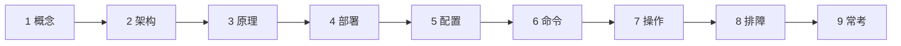
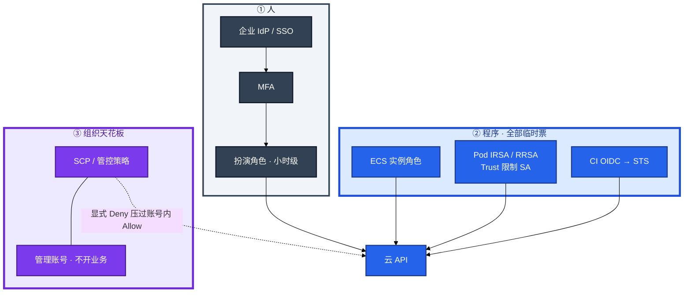
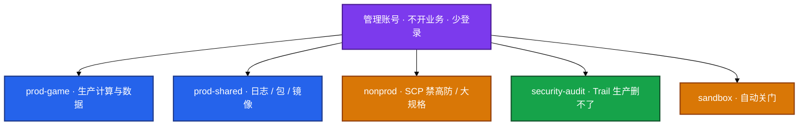
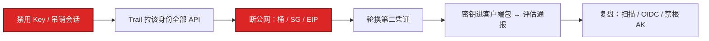
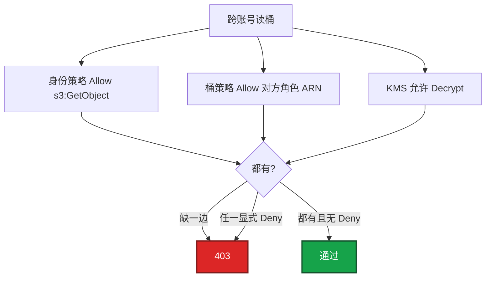
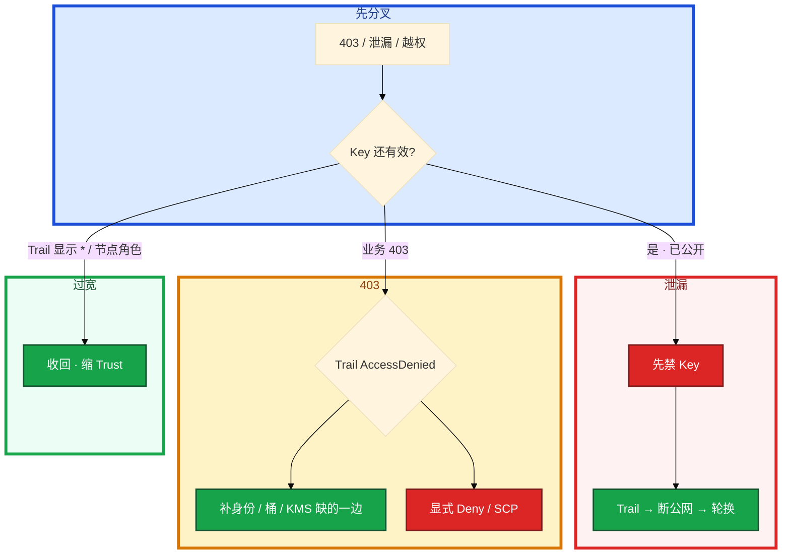

# IAM 与多账号



测试 AK 打进热更 json，玩家抓包拿到。群里有人先开会、force-push 删 Git。另有人给排障角色临时开了 `*:*`，工单没写到期，三个月后这把权限还在。

先别动手。这一章后半全是你会动手的：**泄漏怎么禁 Key、最小权限怎么写到前缀、多账号 SCP 怎么当天花板、破窗怎么演练。** 前面的概念和原理，是为了让你动手时不把长期 AK 当角色、不把 SCP 当日常权限清单。

**读完你能：** 人走 SSO + MFA 扮角色、程序走实例角色 / IRSA / RRSA / OIDC；泄漏先禁 Key 再查 Trail；画出 prod / nonprod / audit / shared；能说出 SCP 最小集。

## 本章目录

缩进 = 上下级。3 下面才是 3.1。

想钉在**正文左边**跟着滚：菜单 **查看 → 打开视图 → 大纲**。Markdown 预览做不到独立左栏，目录只能写在文章开头。

- [1. 基本概念](#1-基本概念)
- [2. 架构图](#2-架构图)
- [3. 原理](#3-原理)
  - [3.1 最小权限](#31-最小权限怎么落地)
  - [3.2 泄漏应急](#32-泄漏应急先作废再开会)
  - [3.3 多账号与 SCP](#33-多账号与-scp爆炸半径的硬顶)
  - [3.4 求值与跨账号](#34-求值与跨账号模拟器不是真相)
- [4. 安装部署](#4-安装部署)
  - [4.1 生产怎么选](#41-生产怎么选)
  - [4.2 账号树落地顺序](#42-账号树落地顺序)
- [5. 核心配置](#5-核心配置)
- [6. 常用命令](#6-常用命令)
- [7. 常用操作](#7-常用操作)
  - [7.1 泄漏 15 分钟](#71-泄漏-15-分钟)
  - [7.2 临时放大收回](#72-临时放大收回)
  - [7.3 SCP 变更](#73-scp-变更)
  - [7.4 破窗演练](#74-破窗演练)
  - [7.5 权限评审](#75-权限评审)
- [8. 生产排障](#8-生产排障)
- [9. 必会 · 常考](#9-必会--常考)
- [合上书](#合上书问自己)

**本章不讲：** AWS IAM 求值细节、IRSA Trust `sub` 展开 → [03](../03-AWS生产/)；ACK RRSA、RAM 开服用法 → [02](../02-阿里云生产/)；火山 IAM 与办公身份 → [08](../08-火山引擎生产/)；跨云策略不能粘贴 → [04](../04-多云对照/)；账单按账号拆 → [06](../06-成本治理/)；K8s RBAC / SA → [04-Kubernetes / 13-RBAC](../../04-Kubernetes/13-RBAC与安全/)；堡垒机、跳板 → [02-基础底座 / 25](../../02-基础底座/25-堡垒机与跳板机/)。

---

## 1. 基本概念

云上的身份不是「大家共用一个账号」。最小权限和多账号是为了爆炸半径，不是合规 PPT。

**永久 AK / SK 是口令**：抄进 Git、镜像、Jenkins、客户端热更配置，泄漏一次就是这把钥匙能开的全部门，因为它不绑「哪台机器、哪个 Pod」。**角色是临时票**：扮演之后拿到 STS，几小时过期，必须绑在实例 / SA / OIDC 上才能续。

| 对 | 错 |
|----|----|
| 人：企业 IdP / SSO → MFA → 扮演角色（会话小时级） | 人人一把长期 AK |
| ECS：实例 RAM 角色 / Instance Profile | 节点 `AdministratorAccess`，任意 Pod 调云 API |
| Pod：RRSA / IRSA，Trust 限制到具体 SA | STS 写进环境变量跑 12 小时（形式上用了角色，实际变长期票） |
| CI：OIDC 联邦到角色，STS 短时 | 流水线永久 AK + Admin |

两个角色不要混：

| 角色 | 干什么 |
|------|--------|
| **节点角色** | 只要拉镜像、写日志；不能 `oss:DeleteBucket` |
| **应用角色** | 绑 SA；逻辑服最多读热更前缀、写自己的日志；发奖不能和战斗服同一条 |

钥匙能复制、票不能带走。长期 AK 进仓库等于把门钥匙贴在墙上。STS 到期后进程必须能续期（SDK 默认凭证链会续）。破旧系统：独立低权限用户 + 强制轮换 + Trail 单独告警，排期消灭。

SSO / 联邦：人从企业 IdP 进云，不在云里造一套密码。离职关 IdP 账号即失去扮演资格，比在每个云账号删用户可靠。没有 SSO 时至少强制 MFA + 角色扮演。

GM 后台、发奖接口的云角色不能和逻辑服同一条。发奖脚本用独立角色 + 审计。两条角色混用，一次 Pod 逃逸就能发奖。CI 流水线同样：OIDC 短时角色只推镜像或只 `RunCommand`，不要 `AdministratorAccess`。

> **记住**：人走 SSO + MFA 扮角色；程序走实例角色 / IRSA / RRSA / OIDC；永久 AK 进 Git 按泄漏处理。

---

## 2. 架构图

先把整张图钉住。后面策略、泄漏、SCP 都对着这张图说话。



图上三条线：

1. **没有箭头从业务指向长期 AK。** 程序只拿绑在计算身份上的票。
2. **SCP 是「不能做什么」，不是日常权限清单。** 日常仍靠角色最小权限。
3. **节点角色和应用角色必须拆开。** Trust 不限制 `sub` = 集群内任意 SA 可扮演。

账号树（爆炸半径，不是图好看）：



单账号里用 VPC + RAM 隔离，最终会失败：一套账单、一套配额、一次 AK 打穿生产和测试。没有多账号也要能讲：爆炸半径和你怎么用 VPC / RAM 先挡着、下一步怎么拆。不要假装单账号已经等价于组织。

---

## 3. 原理

原理只保留动手和面试会用到的：权限怎么落到前缀、泄漏先做什么、SCP 天花板钉哪几条、跨账号为什么模拟器会撒谎。

**本节 4 块：** 3.1 最小权限 · 3.2 泄漏 · 3.3 SCP · 3.4 求值

### 3.1 最小权限怎么落地

日常权限按 **职责** 拆，不按人名堆：

- 只读：排障、oncall 夜间
- 变更：改 SG、扩容、发节点池（要审批或变更窗）
- 数据：RDS 备份下载、生产库登录单独角色，默认无
- 财务：账单，和生产变更分离

开服夜「先放开再收」。有人给排障角色临时开了 `*:*`，工单没写到期。三个月后这把权限还在。测试 Pod 或一条泄漏的 AK 拿到的就是生产半径。

系统里发生了什么：没有权限边界 / SCP，最小权限被第一张紧急工单冲掉。节点角色 `AdministratorAccess` 或「万能 OSS 角色」挂全部 Pod，任意工作负载都能 `DeleteBucket`。

你眼睛看到的：RAM / IAM 控制台策略是 `*:*`；Trail 里这个身份能改 SG、建用户、列桶；Trust 不限制 `sub`，集群里任意 SA 都能扮演。

卡住先看哪：这个身份实际能做什么（Trail），不要先开会改组织图。止血：收回临时 `*`、缩 Trust、节点角色只留拉镜像 / 写日志。治理：开权限要资源 ARN / 账号级资源限制；临时开 `*` 必须有工单、有到期、有收回确认。

对照一次「看起来像排障、实际是越权」：oncall 为了放行探测源，RAM 策略写成 `ecs:*` + `vpc:*`，顺手能改生产安全组和释放实例。你眼睛在策略文档里看到 Resource `*`。正确写法是 backend SG 的入站规则只允许 LB 安全组 ID，变更走变更窗，不要给排障角色整段 VPC 的写权限。OSS / TOS 同理：角色只能 `GetObject` 指定前缀，不能 `DeleteBucket`。

落到一条策略，而不是讲原则：Action 写 `GetObject` / `PutObject` 需要的那几个，Resource 写桶和前缀 ARN，条件加 MFA / 源 VPC。禁止 `*:*`。游戏发奖角色和逻辑服角色拆开。

条件键比「拆两个 Action」更有用：`aws:MultiFactorAuthPresent`、源 VPC、禁止没 MFA 的 `sts:AssumeRole`。阿里云 RAM 条件类似（MFA、源 IP）。生产 AssumeRole 强制 MFA，CI 用 OIDC 联邦，不要给 CI 一个万能用户。

权限边界：角色「最多能有」的上限，防止有 `iam:CreateRole` 的人给自己开 `*`。没有天花板时，最小权限会被第一张工单冲掉。

落地检查：新系统默认拒绝；90 天未用的 AccessKey 和未用角色告警关闭。不要只说原则，要说「我们 OSS 角色只能 `GetObject` 指定前缀」。

权限变更本身是生产变更。开服夜「先放开再收」而没有到期，就是下次泄漏的半径。

EKS 节点 Instance Profile 给了 S3 Full Access，仍算没做 IRSA：任意 Pod 都能用节点角色调 S3，逃逸即搬空桶。没限制 Trust `sub` 的 IRSA 等于集群内任意 SA 可扮演。IMDSv2 防 SSRF 偷节点凭证，节点角色更必须瘦。ACK RRSA 同一模型。EBS CSI 和 LB Controller 不要共用一个角色——少一个权限就 controller 403、Service Pending，共用只会把权限再放宽。

> **记住**：禁止 `*:*` 当日常；临时放大必须到期收回；节点角色要瘦，应用权限绑 SA。

### 3.2 泄漏应急：先作废，再开会

发现 AK 出现在 GitHub、聊天记录、镜像层、客户端包。测试 AK 打进热更 json，玩家抓包拿到——按生产泄漏同一套流程，不要用「那是测试的」开脱。

**止血（分钟级，按顺序）：**

1. **立刻禁用 / 删除该 AccessKey**（或 rotate）。不要先开会。RAM / IAM 控制台或 CLI 都能做。
2. 若密钥属于根账号：视为 P0，轮换根、开 MFA、查是否还有第二把根 AK。
3. 若是角色会话：禁用角色、吊销会话（支持的前提下），缩 Trust。
4. 对外暴露的 Bucket / 安全组：先断公网（Block Public Access、SG 收回），再细查。

**影响面（小时级）：**

- CloudTrail / ActionTrail：该 `accessKeyId` 的全部 API、源 IP、成功失败。列出改过的 SG、新用户、新策略、S3 列表 / 下载、RDS 快照共享。
- 没有审计 = 无法证明没被搬数据，只能按最坏假设轮换所有密钥、查 Bucket 访问日志。
- 代码库：全历史搜 AK 模式；已推送的视为公开，改 `.gitignore` 不够，必须作废密钥。



你眼睛看到的：控制台 Key 已 Disable；Trail 里这个 `accessKeyId` 的 ListBucket / 改 SG / 新建用户。卡住没有 Trail，只能按最坏轮换全部长期凭证，影响面说不清。

顺序错成「先开会分析影响面再禁 Key」，直接不及格。不要：泄漏后只删 Git 记录（历史还在）；只改密码不禁 AK；让「可能没用过」的密钥继续留着观察。公开仓库的 force-push 不能当应急。AK 独立于登录密码，必须单独作废。

根因：密钥出现在不该出现的载体。治理：预提交扫描、CI 拒绝疑似密钥、禁止主账号 AK、生产强制 MFA、定期密钥报告。GitHub secret scanning 告警要接进 oncall，和云 Trail 告警同等优先级。

STS 泄漏：有过期时间，仍要禁角色并查 Trail；窗口内的调用算数。Secret 进了镜像：重建镜像、作废旧凭证、检查是否推过公共仓库。

> **记住**：泄漏先禁 Key，再查 Trail，再断公网；不要先开会；改密码不等于禁 AK。

### 3.3 多账号与 SCP：爆炸半径的硬顶

SCP / 管控策略是组织对账号的天花板：**显式 Deny 压过账号内一切 Allow**。它不授予权限。日常仍靠角色最小权限；没有 SCP 的最小权限会被第一张紧急工单冲掉。

SCP 是「不能做什么」，不是「日常权限清单」。权限边界是角色自身上限；SCP 是账号层天花板。两层都是防「自己给自己开 *」。

**SCP 最小集（组织级，业务策略写在账号内）：**

| Deny 什么 | 为什么 |
|-----------|--------|
| 关闭 CloudTrail / ActionTrail / 配置记录器 | 没有审计 = 没有影响面 |
| 根用户创建 AccessKey、根用户日常 API | 根 Key 视为 P0 |
| 关掉 `s3:PutBucketPublicAccessBlock` / 公共读闸 | 公共桶是数据面 + 账单炸弹 |
| 非生产购买高防、大规格包年、昂贵 GPU | 测试账号冲动购买 |
| 成员账号离开组织 / 删审计桶 | 自己拆天花板 |
| 关 GuardDuty / 安全中心类服务（有则禁） | 静默失明 |
| 生产账号无限 `ecs:RunInstances` 给全体运维 | 按量冲动；要流程 |

落地检查：SCP 在 sandbox 先挂；生产 SCP 变更当生产变更；误杀后靠破窗从管理账号卸策略，不能靠「全员 Admin」。

网络：账号间用 CEN / TGW / 对等，CIDR 不重叠（01）。生产数据库安全组只放行 prod 应用账号的 VPC，不放行 nonprod。调试走堡垒和只读角色，不要把测试 VPC 接到生产 CEN「方便」。

计费：联动标签 + 账号，比在一个账号里用标签猜更清楚。生产账号关按量冲动购买要流程。

一次「测试 AK 打穿生产」说明为什么要拆账号。单账号里测试和生产共用一套 RAM，一把泄漏的 Key 能改生产 SG、列生产桶。拆开之后 nonprod 的 SCP 禁止买高防和大规格，生产数据库安全组只放行 prod VPC，测试身份进不去生产网。

一次切七个账号没有 runbook 会把自己锁在门外——管理账号的紧急角色要双人、离线保存，比「全员 Admin」安全。SCP 先上、管理账号没有紧急角色、全员都是普通账号里的 Admin → 管理账号没人能进。

> **记住**：多账号拆 prod / nonprod / audit / shared；SCP 禁止关审计和公共桶；SCP 不授权，只封顶。

### 3.4 求值与跨账号：模拟器不是真相

与 03 同一套，这里落到操作：

1. 显式 Deny 压过一切 Allow（含 SCP Deny）
2. 跨账号 S3：桶策略允许对方角色 **且** 对方身份策略允许 `s3:GetObject`，缺一边 403
3. 资源策略（桶、KMS、SQS）经常被漏，表现为「IAM 模拟器通过、实际 403」——模拟器默认不带资源策略时会误导
4. 阿里云 RAM 策略 + 资源策略（OSS Bucket）同样两边要配
5. 都没有 Allow → 默认拒绝，不是「没写就过」



一次「模拟器过了、实际 403」跟着走。CI 角色读共享账号的热更桶失败。系统里身份策略已 Allow，桶策略没写对方角色 ARN，或加密桶缺 `kms:Decrypt`。你眼睛以 Trail 里 `AccessDenied` 的 Action 和 Resource 为唯一可信输入，不要从控制台「感觉有权限」反推。不要加 `AdministratorAccess` 验证「是不是权限问题」——那是扩大泄漏面。

阿里云 RAM 与 AWS IAM 同模型不同细节：RAM 政策文档字段名、条件键、STS 会话时长默认值不同，**不要把 AWS JSON 粘到 RAM**。共通的是：人走扮演、程序走角色、Deny 优先、审计进独立桶。火山 IAM 与字节办公身份衔接见 08。

> **记住**：显式 Deny > Allow；跨账号身份 + 资源策略双允许；以 Trail 为准。

---

## 4. 安装部署

### 4.1 生产怎么选

| 项 | 选 | 不选 |
|----|----|------|
| 人 | SSO + MFA 扮角色 | 云里每人一把 AK |
| 程序 | 实例角色 / IRSA / RRSA / OIDC | 长期 AK 进 Git / Jenkins / 镜像 |
| 节点 | 只拉镜像 / 写日志 | `AdministratorAccess` / TOS Full Access |
| 组织 | prod / nonprod / audit / shared | 单账号靠 VPC 假装隔离 |
| SCP | 禁关审计、禁根 AK、禁公共桶、非生产禁大规格 | 把 SCP 写成 Allow 清单 |
| 审计 | 组织级 Trail 进独立账号，生产 WriteOnly | 生产角色能删日志桶 |
| 破窗 | 双人、密封、每年演练只登录 | 口头「我们有紧急账号」 |

### 4.2 账号树落地顺序


SCP 在 sandbox 验证后再挂生产 OU。一次切七个没有 runbook，比「全员 Admin」的单账号更危险。共享账号的热更桶：prod 只读，写入走发版角色。

---

## 5. 核心配置

| 项 | 生产怎么用 | 改错会怎样 |
|----|------------|------------|
| Trust `sub` | `system:serviceaccount:ns:sa` | 任意 SA 可扮演 |
| 条件键 | MFA、源 VPC、禁无 MFA 的 AssumeRole | CI 万能用户 |
| SCP Deny | 关 Trail / 根 AK / 公共桶 / 非生产大规格 | 第一张工单冲掉最小权限 |
| 权限边界 | 角色最多能有的上限 | 有 CreateRole 的人给自己开 `*` |
| Trail | 组织级，独立审计账号 | 泄漏无影响面 |
| 根用户 | 不开日常、不开 API、开 MFA | 根 Key = P0 |
| 90 天未用 AK | 告警关闭 | 观察中的死 Key 仍有效 |

> **记住**：文档和条件键各云不同，不要把 AWS JSON 粘到 RAM / 火山。共通口径不变：人走扮演、程序走角色、Deny 优先。

---

## 6. 常用命令

证书 / 密钥不要写进聊天记录。顺序永远是先禁再查。

```bash
# 先禁 Key，再查这条身份干过什么（各云 CLI 名字不同，顺序一样）
# 阿里云：Disable AccessKey → ActionTrail 按 accessKeyId 过滤
# AWS：aws iam update-access-key --status Inactive
#      再 CloudTrail LookupEvents，不要先开会
```

| 目的 | 看什么 |
|------|--------|
| 禁 Key | 控制台 Disable；根 Key 当 P0 |
| Trail | 该 `accessKeyId` 的 API、源 IP、SG / 用户 / 桶 |
| 模拟器 403 | Trail `AccessDenied` 的 Action + Resource；补资源策略 |
| 未用密钥 | 90 天未用 AccessKey / 角色 |
| SCP | 组织策略列表；sandbox 先挂 |
| 告警 | 根登录、关 Trail、新建 AK、策略变 `*`、桶公共、SG `0.0.0.0/0:22/3389` |

控制台登录 MFA；API 用角色。`ConsoleSignin` 无 MFA 要告警。根不开日常、不开 API。

---

## 7. 常用操作

### 7.1 泄漏 15 分钟

1. 禁用 Key / 吊销会话。
2. Trail 拉该身份全部 API。
3. 断公网（桶、SG、EIP）。
4. 轮换可能被读走的第二凭证（RDS 口令、另一把 AK）。
5. 密钥进了客户端商店包 → 评估通报。
6. 复盘：扫描、OIDC、禁根 AK、临时权限到期。

控制台或 CLI 都能做禁用，不要等审批流。

### 7.2 临时放大收回

工单 + 到期 + 收回确认。没有到期的临时 `*`，三个月后还在。权限变更是生产变更。

### 7.3 SCP 变更

sandbox 先挂 → 确认破窗角色不被误杀 → 再挂生产 OU。变更单写明 Deny 列表和回滚（从管理账号卸策略）。不要在开服夜改 SCP。

### 7.4 破窗演练

管理账号 / 根很少登录，但必须有破窗流程：生产组织 SCP 误杀、所有人被锁在门外时，谁能用离线保管的紧急角色进来。双人、密封、定期演练一次（只登录不改资源）。没有破窗的多账号，比单账号更容易在事故里瘫痪。演练当天确认密封包能打开、MFA 还能用、紧急角色没被 SCP 误杀。口头「我们有紧急账号」不够。每年一次写进变更日历。

### 7.5 权限评审

季度收回未用权限；新权限走工单。比持续精细到每个 API 更现实。发版角色和生产 oncall 角色分开；生产 apply 要人工审 plan（见 Terraform 章）。开服脚本同样用角色，打包目录扫 AK。

---

## 8. 生产排障

权限问题用 Trail 分流，不要加 Admin 验证。



| 现象 | 先做什么 | 不要做什么 |
|------|----------|------------|
| GitHub 出现生产 AK | 禁 Key，再 Trail | 先开会 / 只 force-push / 只改密码 |
| 模拟器过、实际 403 | Trail + 桶策略 / KMS | 加 AdministratorAccess 验证 |
| 任意 Pod 能调 S3 | 收节点策略、IRSA + Trust sub | 认为「节点能拉桶就算做了 IRSA」 |
| SCP 后全员进不去 | 破窗从管理账号卸策略 | 没有紧急角色时一次切七个账号 |
| 临时 `*` 三个月后还在 | 到期收回 | 开服夜先放开再收且不写到期 |
| 没有 Trail | 按最坏轮换全部长期凭证 | 声称「可能没用过」 |

游戏故事：测试 AK 打进热更 json，玩家抓包拿到。有人先开会、force-push 删 Git。正确顺序是立刻禁用这把 Key，再 Trail 拉该 `accessKeyId` 的 ListBucket / 改 SG / 新建用户。没有 Trail 的那次只能按最坏轮换全部长期凭证，影响面说不清，事后才把组织级 Trail 和 secret scanning 接进 oncall。同一类事故的另一面：开服夜临时 `*:*` 没到期，三个月后还在，下一次泄漏半径就是生产全部门。

---

## 9. 必会 · 常考

| 说法 | 对错 | 口径 |
|------|:----:|------|
| 程序可以用永久 AK，定期轮换就行 | 错 | 绑计算身份的角色 / OIDC |
| STS 写进环境变量跑 12h 算用了角色 | 错 | 实际变长期票 |
| 泄漏先开会再禁 Key | 错 | 作废前每一秒都算数 |
| 改登录密码等于禁 AK | 错 | AK 独立，必须单独作废 |
| force-push 能当应急 | 错 | 历史还在；密钥已公开 |
| 只读开了 / VPC 隔离了就不需要多账号 | 错 | 一次 AK 打穿生产 + 测试 |
| SCP 是日常权限清单 | 错 | 只 Deny；不授权 |
| 权限边界 = SCP | 错 | 边界是角色上限；SCP 是账号天花板 |
| IAM 模拟器过了就一定能读桶 | 错 | 还要资源策略 / KMS |
| 没写 Allow 就默认过 | 错 | 默认拒绝 |
| 节点 S3 Full Access = 做了 IRSA | 错 | 任意 Pod 用节点角色 |
| Trust 不限制 sub 也算 IRSA | 错 | 集群内任意 SA 可扮演 |
| 没有 Trail 也能说清影响面 | 错 | 按最坏轮换 |
| 发奖和逻辑服同一角色图省事 | 错 | Pod 逃逸就能发奖 |
| 把 AWS JSON 粘到 RAM | 错 | 字段和条件键不同 |

数字：STS 小时级；AK **90 天**未用告警；破窗 **每年**演练只登录；临时 `*` 必须有到期；泄漏止血 **分钟级**。

易混：AK vs 角色 vs STS 环境变量；SCP vs 权限边界 vs 日常 IAM；身份策略 vs 资源策略；禁 Key vs 删 Git；单账号 VPC vs 组织。

---

## 合上书，问自己

1. 人和程序各走哪条路？节点角色和应用角色为什么必须拆开？
2. 泄漏前 15 分钟顺序？为什么先开会不及格？
3. 最小权限落到一条 OSS 策略长什么样？临时 `*` 最低限度？
4. 账号树五格是哪五格？SCP 最小集 Deny 哪几条？
5. 跨账号 403，模拟器却过了，缺哪一边？不要用什么去「验证」？
6. 破窗没有会怎样？落地顺序为什么先 nonprod 再生产？

六题都能口述，这一章就过了。下一章对准火山：和阿里同构图，但健康检查源和办公身份不能照抄。
