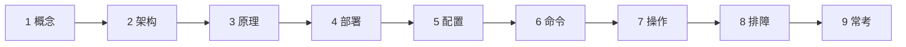
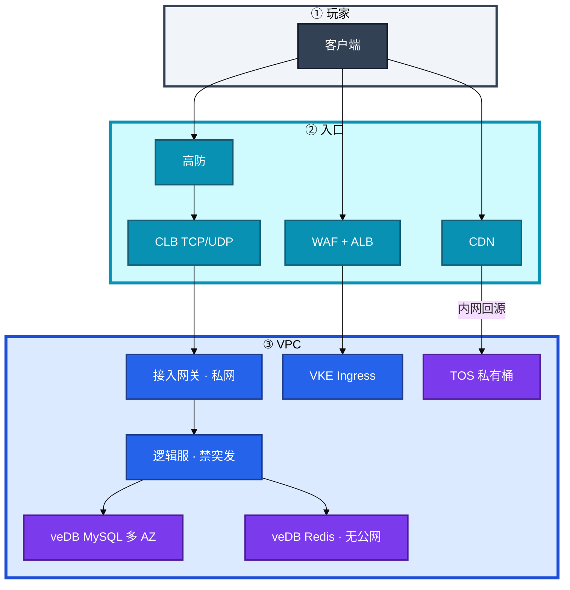
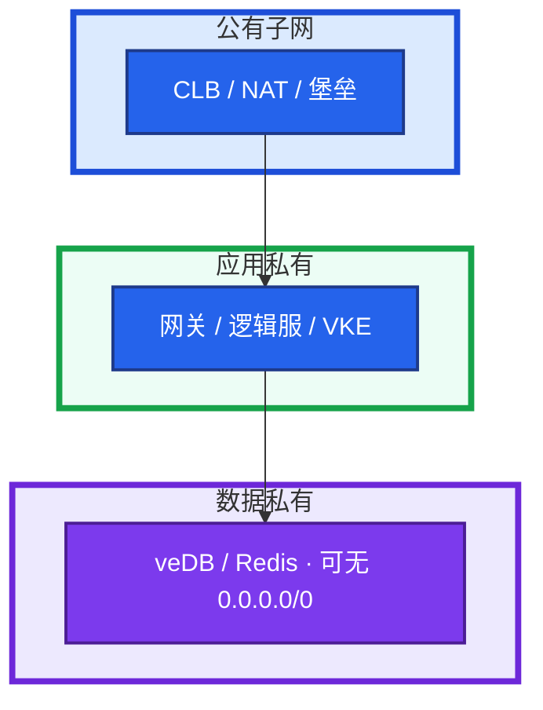
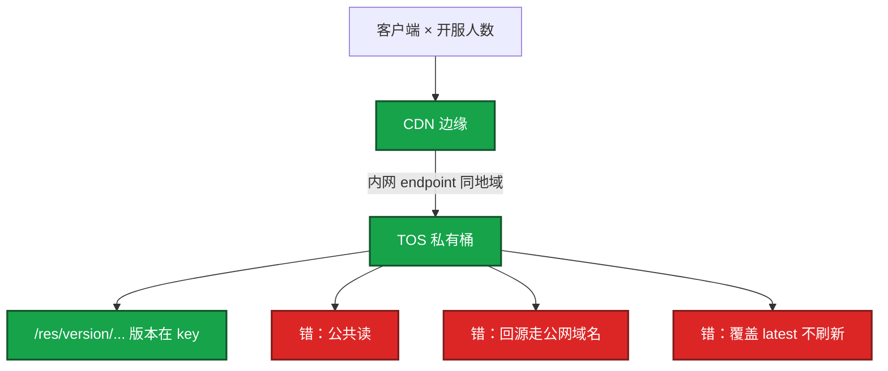
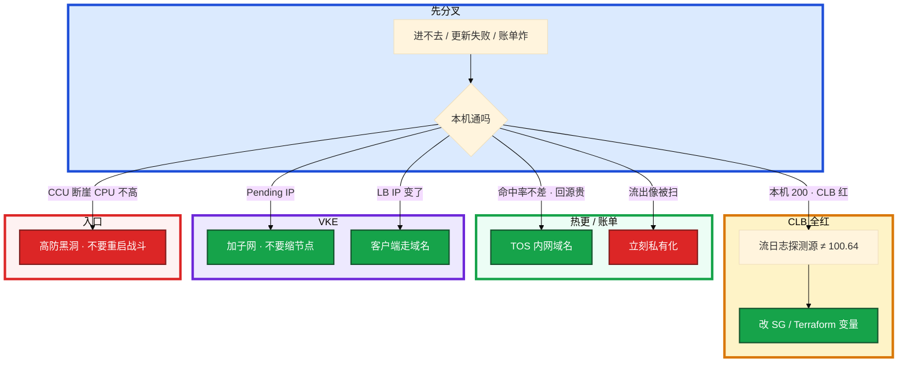

# 火山引擎生产



从阿里迁过来的 Terraform 模块把探测源写死成 `100.64.0.0/10`。开服前 CLB 全红，本机 curl 全 200。同一天 TOS 回源抄了 OSS 公网域名，CDN 命中率还行，回源账单先炸。

先别动手。这一章后半全是你会动手的：**探测源怎么验、TOS 内网怎么配、VKE IP 怎么留、办公 SSO 怎么扮到角色。** 前面的概念和对照表，是为了让你动手时不把阿里的网段和 JSON 粘过来。

**读完你能：** 画出沐瞳在火山上的入口；对照阿里说出健康检查源、内网域名、IAM 三条差在哪；开服当天 5 分钟清单里多出来的那一条不会漏。

## 本章目录

缩进 = 上下级。3 下面才是 3.1。

想钉在**正文左边**跟着滚：菜单 **查看 → 打开视图 → 大纲**。Markdown 预览做不到独立左栏，目录只能写在文章开头。

- [1. 基本概念](#1-基本概念)
- [2. 架构图](#2-架构图)
- [3. 原理](#3-原理)
  - [3.1 火山 vs 阿里对照](#31-火山引擎与阿里云对照)
  - [3.2 VPC 与探测源](#32-vpc-与安全组探测源不能抄)
  - [3.3 TOS + CDN](#33-tos--cdn热更和包体)
  - [3.4 VKE](#34-vke托管-k8s)
- [4. 安装部署](#4-安装部署)
  - [4.1 生产怎么选](#41-生产怎么选)
  - [4.2 开服当天检查](#42-开服当天检查火山)
- [5. 核心配置](#5-核心配置)
- [6. 常用命令](#6-常用命令)
- [7. 常用操作](#7-常用操作)
  - [7.1 探测源验收](#71-探测源验收)
  - [7.2 TOS 热更](#72-tos-热更)
  - [7.3 VKE 节点池与 LB](#73-vke-节点池与-lb)
  - [7.4 IAM 与办公身份](#74-iam-与办公身份)
  - [7.5 高防与出海](#75-高防与出海)
- [8. 生产排障](#8-生产排障)
- [9. 必会 · 常考](#9-必会--常考)
- [合上书](#合上书问自己)

**本章不讲：** VPC / SG / NAT / 高防通用路径 → [01](../01-云网络与安全/)；阿里 `100.64`、Terway、OSS 细节 → [02](../02-阿里云生产/)；AWS NLB / IRSA 对照 → [03](../03-AWS生产/)；五朵云翻译、腾讯对照 → [04](../04-多云对照/)；多 AZ vs 只读、RPO、云 Redis 上限 → [05](../05-云上存储与数据库/)；包年 / 流量 / 闲置 → [06](../06-成本治理/)；泄漏应急、多账号树 → [07](../07-IAM与多账号/)；开服合服、热更流程、出海区服 → [08-游戏运维专题](../../08-游戏运维专题/)。不背 veDB 全家桶。

---

## 1. 基本概念

火山引擎是字节跳动的云，产品模型和阿里同构：VPC、安全组、CLB / ALB、TOS、VKE、TLS、IAM。排障思路可迁移。字节系岗位要的不是再背一张表，而是 **你能在这张网上查 SG、LB、TOS、IAM，并且不把阿里的网段和 JSON 粘过来**。

沐瞳（及同类字节游戏）生产链路和国内阿里区几乎同一张图，换的是控制台、配额工单、内网域名、办公身份。

选火山通常两类原因：公司是字节系（朝夕光年 / 沐瞳），或要和字节内网 / 身份打通。不是「火山更懂游戏」这种空话。为什么不单开腾讯云一章：模型接近阿里，对照走 04。火山因为字节系（含沐瞳）必读才单开。

四个角色不要混：

| 能力 | 火山上叫什么 | 不要当成 |
|------|--------------|----------|
| 对象存储 | TOS | 「就是 OSS」，内网域名不同 |
| 托管 K8s | VKE | 文档密度 = ACK；健康检查源 = 阿里 |
| 日志 | TLS | 和云监控 / Prom / 字节内观测要去重 |
| 身份 | IAM + 办公 SSO | 再造一套云账号密码；粘 RAM JSON |

没用过火山的诚实说法：「NAT SNAT、SG 探测源、对象存储公共读这三件事我按同一套 SOP 验收；健康检查源我会先查文档和流日志，不搬阿里的网段。」有落地再讲具体故障。不要展开数十个 PaaS 名称。

> **记住**：和阿里同构图，排障 SOP 可迁移；禁止照抄 `100.64.0.0/10` 和内网域名。

---

## 2. 架构图

先把整张图钉住。后面探测源、TOS、VKE 都对着这张图说话。



图上四条线：

1. **静态 / 热更：** CDN → 内网回源 → TOS 私有桶。
2. **TCP/UDP 长连接：** 高防 → CLB → 接入网关（私网 ECS / VKE）→ 逻辑服（高主频 / 通用，禁突发）。
3. **HTTP 登录 / 支付 / GM：** WAF + ALB → VKE Ingress。
4. **数据：** veDB MySQL 多 AZ ↔ veDB Redis（VPC 内，无公网）。日志 TLS（可投递 TOS / Kafka）；指标云监控 + 字节内观测（常并存）。身份：人走字节办公 SSO → IAM 角色；程序走角色 / STS，禁止长期 AK。

决策顺序仍是：网络和规格 → LB 类型 → 哪些上 VKE。不要「先买 VKE 再想 VPC」——VPC-CNI 同样按 Pod 吃 VPC IP。有状态战斗服可以不上 VKE，理由和 ACK 一样：优雅下线、内核参数、固定容量、CLB 摘流时序。

和阿里对照时，先记住必须单独验收的几条，再谈产品名：

1. **健康检查源 CIDR 禁止照抄 `100.64.0.0/10`**，以控制台 / 文档 / 流日志为准
2. TOS / 镜像 **内网 endpoint 域名不同**，回源和拉镜像走错就变公网流量
3. IAM 与 **字节办公身份** 衔接，不是再造一套云账号密码
4. 文档密度和配额工单流弱于阿里，第一周交付是验收清单，不是背 PaaS 名称

---

## 3. 原理

原理只保留动手和面试会用到的：和阿里差在哪几条默认值、探测源为什么本机通 CLB 红、TOS 域名为什么不能抄、VKE 为什么会 `insufficient IP`。

**本节 4 块：** 3.1 对照 · 3.2 VPC · 3.3 TOS · 3.4 VKE

### 3.1 火山引擎与阿里云对照

按能力翻译，不按宣传名。名字像不等于默认值像。

| 能力 | 阿里云 | 火山引擎 | 切的时候别照抄 |
|------|--------|----------|----------------|
| VPC / 子网 | VPC + 交换机（AZ） | VPC + 子网 | CIDR 规划同一套；测试生产不要都 `10.0.0.0/16` |
| 安全组 | 有状态 SG | 有状态 SG | **探测源 CIDR 不是 `100.64.0.0/10`** |
| L4 | CLB / NLB | CLB | idle / UDP / 会话保持按新产品验 |
| L7 | ALB | ALB | 自定义二进制不要接 ALB |
| 对象 | OSS | TOS | **内网 endpoint 域名不同**；权限模型按火山文档 |
| 托管 K8s | ACK + Terway / RRSA | VKE + VPC-CNI / 工作负载角色 | JSON 不要粘 AWS；文档少、配额走工单 |
| 库 | RDS + Redis | veDB MySQL / Redis | 多 AZ ≠ 只读；硬顶同一套（05） |
| 日志 | SLS | TLS | 投递 TOS / Kafka；账单爆同样是高基数 + Debug |
| IAM | RAM + 企业 IdP | IAM + **字节办公 SSO** | 不要粘 RAM / AWS JSON |
| 高防 | 高防 IP / 游戏盾 | 高防 | CNAME、回源网段、黑洞阈值当新系统验收 |
| 镜像 | 内网 ACR | 对象存储体系上的仓库 | 拉镜像走内网，不要穿 NAT |
| 配额 | 控制台较熟 | **工单流弱于阿里** | 第一周按清单验收，不背 PaaS |

共通 SOP 可迁移：NAT SNAT、SG 探测源、对象存储公共读、源站无 EIP、长连接用四层、有状态服慎上弹性。

不可迁移的默认值：健康检查源、内网域名、IAM 条件键和文档、办公身份、配额工单。切从阿里迁过来的模块，第一件事就是替换探测 CIDR 和 TOS endpoint。

API 兼容度不必吹成「TOS 就是 S3」。生命周期、权限模型和内网域名按火山文档验收。

> **记住**：同构的是模型；不同的是探测源、内网域名、办公 IAM。对照表是为了迁移，不是背产品名。

### 3.2 VPC 与安全组：探测源不能抄

VPC 按环境切 CIDR，子网拆公有 / 应用私有 / 数据私有，和 01 完全一样。逻辑服无 EIP；数据子网可以没有默认出网；NAT 每 AZ 一个。CIDR 一旦对等 / 专线就难改。



SG 按角色：`sg-lb` 游戏端口 ← 高防回源段（不是 `0.0.0.0/0` 到逻辑服）；`sg-gateway` ← `sg-lb`；`sg-logic` 只放网关；`sg-mysql` 3306 只放应用。

从阿里迁过来的 Terraform 模块把探测源写死成 `100.64.0.0/10`。开服前 CLB 全红，本机 curl 全 200。

系统里发生了什么：火山的探测源不是阿里那条链路本地网段。健康检查包被 SG 丢掉，后端 Unhealthy，玩家进不去，进程还在听。

你眼睛看到的：`ss -lnt` 在听，`curl 127.0.0.1:port` 200；CLB 控制台后端全红；对流日志看真实源 IP，不是 `100.64.0.0/10`。

卡住先看哪：控制台 / 文档「负载均衡探测」，对流日志看真实源，再写进 Terraform。不要先改业务端口、不要先重启 ECS。模块里探测 CIDR 按云厂商参数化，禁止写死阿里网段。这是切云 / 切厂商最高频事故（01 / 04）。有状态服检查过严同样会把正在打的玩家踢到另一台，检查口要轻。

长连接：CLB 四层（TCP / UDP），不要把自定义协议接到 ALB。HTTP 登录 / 支付 / GM 走 ALB + WAF。心跳 < CLB idle；UDP 会话超时单独测。四层源 IP 会话保持同样会被运营商 NAT 打到单机，接入层要做连接级调度。NLB / CLB 开了源 IP 保持：后端可能看到玩家 IP，业务端口规则和健康检查源是两套。SSH 绝不能跟着重开。火山具体是否保留 client IP 以产品为准，不要假设和 AWS NLB 默认值一样。

源站保护：高防后 SG 只放回源段。逻辑服绑 EIP + `0.0.0.0/0` 放业务端口，DDoS 绕过高防直打，和阿里同一类事故。游戏端口不走 WAF。

突发性能 / 竞价实例：测试可以，战斗服和生产入口不用。逻辑服、网关选通用 g / 高主频 h；Redis / 单机缓存选 r。24 核以上盯网卡 PPS，活动期网关先打满网卡再打满 CPU。

VPC-CNI 吃 IP 和 ACK Terway 同一类：节点池 `/24` 会 `insufficient IP`，按峰值 Pod × 1.5 预留，见 01。

> **记住**：健康检查源禁止抄 `100.64.0.0/10`；本机通、CLB 全红，先对流日志看探测源。

### 3.3 TOS + CDN：热更和包体

沐瞳开服 / 热更真正打到的对象存储是 TOS，不是「再学一个 OSS」。原则与 OSS / S3 相同，验收的是域名、权限、生命周期前缀。



TOS 回源抄了 OSS 公网域名。CDN 命中率还行，回源账单先炸。系统里回源走了公网而不是 TOS 内网 endpoint。你眼睛在账单里看到 TOS / CDN 回源流出，命中率图却不差。卡住先换 TOS 内网 endpoint 域名（不要从 OSS 文档抄），再查访问日志。

生产配置：

1. Bucket 私有，CDN 回源鉴权；禁止匿名写
2. 回源走 **TOS 内网 endpoint**，域名不要从 OSS 文档抄
3. 生命周期按前缀：热更包热数据不过期删除；旧版本转低频 / 归档；日志短保留
4. 版本号在对象键里；覆盖同名必须刷新 CDN，刷新有配额和延迟，不是全球瞬时一致
5. 强更分两步：新包可下载，再切版本检查服务

故障：大面积更新失败先看 CDN 命中率、源站 403（鉴权 / 时间差）、TOS 流控。误删开版本控制；删除权限单独授并告警。ECS + Nginx 下包能扛测试，扛不住开服。

TOS 还承接：APK / IPA 包体、玩家录像 / 截图、日志归档、数据库备份。VKE 镜像仓库也常落在对象存储体系上——拉镜像走内网，不要穿 NAT（和 AWS ECR Endpoint、阿里内网镜像是同一类坑）。日志 TLS 可投递 TOS，归档前缀不要和 `res/current` 一条规则。

公共读在 TOS 和 OSS 都是账单炸弹。不要假设 S3 API 完全兼容。

> **记住**：TOS 私有 + CDN 内网回源；域名按火山文档，不要抄 OSS。

### 3.4 VKE：托管 K8s

VKE 对标 ACK / EKS：控制面托管，你管节点池、CNI、插件、升级窗口。升级不要和开服日重叠。ssh 不进 etcd，影响面照样问（见 [04-01](../../04-Kubernetes/01-集群架构/)）。

VPC-CNI：Pod = VPC IP，连 veDB 安全组好写；代价是节点池 `/24` 耗尽，`insufficient IP`。Serverless / 弹性实例：突发 Job 可以；有状态战斗服要稳定节点、内核参数、可预期 drain，不要图弹性。

节点池加机器后新 Pod Pending，Events 写 IP 不够。卡住先加子网 / 余量，不要先缩节点。节点池：规格白名单禁突发；系统盘够镜像 + 日志；游戏状态不落节点盘。弹性节点池类似 Karpenter，按需扩缩给无状态 / 构建，不给战斗进程。有状态服弹性：不能直接 HPA。状态进 Redis / DB、按区分服、或 VKE StatefulSet + 可预期 drain。合服后释放空服。

Service `LoadBalancer` 会开 CLB / ALB。注解写错规格、健康检查、付费类型，会出现「有外部 IP 但不通」。改注解可能重建 LB，**地址会变**——客户端必须走域名。滚动时 CLB 摘流慢于 Pod 退出，或健康检查过快把正在 drain 的节点打成 Unhealthy 又打回去，和 ACK 同一类时序问题。要 PDB、优雅下线。

权限：Pod 扮 IAM 角色访问 TOS / TLS，禁止 AK 进 Secret 挂全部 Namespace。节点角色要瘦。Trust 限制到具体 ServiceAccount，模型同 IRSA / RRSA，JSON 按火山文档，不要粘 AWS。

和 ACK / EKS 的差异够用的就这些：文档少、配额走工单、健康检查源不同、和字节内监控 / 日志 / IAM 绑得紧。成熟度不是答题重点；你能不能按同一套 SOP 验收才是。第一周交付就是：探测源、idle、CIDR、TOS 内网域名、办公 SSO 能扮到该环境角色。不要第一周去背 veDB 产品名。生产用 VKE 主要在字节系内部。

> **记住**：VKE 吃 VPC IP；LB 用域名，改注解可能换 IP；Serverless 不给战斗进程。

---

## 4. 安装部署

### 4.1 生产怎么选

| 项 | 选 | 不选 |
|----|----|------|
| 规格 | 逻辑服 / 网关 g 或 h；禁突发 | t 系列、竞价战斗服 |
| 长连接 | CLB 四层；心跳 < idle | 自定义协议接 ALB |
| 热更 | TOS 私有 + CDN 内网回源 | ECS Nginx；抄 OSS 公网域名 |
| 计算面 | 区服常单 AZ（成本，见 01） | 数据面也单 AZ |
| VKE | 无状态 API / Ingress | 战斗进程上 Serverless |
| 身份 | 办公 SSO → IAM 角色 | 云里每人一把 AK；粘 JSON |

CLB：会话保持、健康检查、idle timeout 三条必验。UDP 监听类型确认产品真支持。veDB：多 AZ 与只读不是一回事（05）；连接 / 带宽硬顶；禁止公网地址；客户端用配置端点。参数组有重启项，开服夜不要顺手改。备份成功要告警，删除保护打开。热 key / 大 key 控制台有诊断，活动发奖一个 key 扛全服是跨云同款事故。开服夜 Redis 连接 / 带宽水位 < 70%。

TLS：Agent / DaemonSet 采集 → 查询 / 告警 → 投递 TOS 或 Kafka。对比 SLS：免 ES 集群、和 VKE 集成快。账单爆同样是全字段索引 + 高基数玩家 ID + Debug 全量。云监控看云资源，业务 CCU 仍常自建 Prometheus；字节内观测可能并存，告警要去重。日志突然没了：先看摄入是否掉零，再查 Agent / 权限。自建 ELK 可以，但要自己管 ES。小规模可以，大规模默认 TLS。

### 4.2 开服当天检查（火山）

- 规格：逻辑服 / 网关不是突发型；网卡 PPS 够
- 入口：高防 CNAME TTL 已演练；CLB 健康检查变绿；探测源按火山文档，**没有抄 100.64**
- 长连接：心跳 < CLB idle；UDP 监听类型确认支持
- 热更：CDN 预热完成、命中率抽检、TOS 私有、回源内网 endpoint
- VKE（若用）：节点池 IP 余量、PDB、LB 是域名不是 IP
- 数据：veDB 多 AZ、Redis 连接 / 带宽 < 70%、备份成功
- 日志：TLS 摄入没有掉零；和云监控 / Prom / 内观测告警去重
- 权限：发布工具用角色，无长期 AK；办公 SSO 能扮到该环境角色

活动开始 5 分钟看：CLB 新建连接、Unhealthy 数、NAT 并发、veDB 连接、CDN 回源 4xx、TOS 流出是否像被扫。

和阿里同构清单之外，**多出来的一条：探测源有没有抄 100.64；TOS / 镜像是不是内网域名。**

---

## 5. 核心配置

| 项 | 生产怎么用 | 改错会怎样 |
|----|------------|------------|
| 探测 CIDR | 控制台 / 流日志，写入 Terraform 变量 | 本机通、CLB 全红 |
| TOS endpoint | 火山内网域名 | 回源账单炸、命中率却不差 |
| CLB idle | 大于心跳 | 长连接集体掉 |
| Block Public Access | TOS 必开 | 公共读账单炸 |
| VKE 子网 | 峰值 Pod × 1.5 | `insufficient IP` |
| LB 注解 | 当变更；客户端走域名 | 改注解换 IP，全服连不上 |
| Redis 公网 | **关** | 扫描打满连接 |
| 节点角色 | 瘦；工作负载角色绑 SA | TOS Full Access = 逃逸搬桶 |

> **记住**：模块按云厂商参数化。禁止写死阿里网段和 OSS 域名。

---

## 6. 常用命令

本机通 ≠ 探测通。

```bash
# 对流日志看 CLB 真实源，不要假设 100.64
ss -lnt
curl -s -o /dev/null -w '%{http_code}\n' 127.0.0.1:port

# VKE：IP 余量、LB 必须是域名
kubectl get nodes -o wide
kubectl get svc -A | grep LoadBalancer
kubectl describe pod <pending>   # Events: insufficient IP
```

| 目的 | 看什么 |
|------|--------|
| CLB 全红 | 流日志源 IP vs SG；不是先重启 |
| TOS 账单 | 回源是否公网域名；是否公共读 |
| VKE Pending | 子网余量，不是先缩节点 |
| TLS 没了 | 摄入是否掉零 → Agent / 权限 |
| CCU 断崖 CPU 不高 | 高防黑洞 / 入口被洗 |

---

## 7. 常用操作

### 7.1 探测源验收

控制台「负载均衡探测」→ 流日志真实源 → 写入 SG 和 Terraform 变量。切云第一件事。不要先改业务端口。

### 7.2 TOS 热更

私有桶、内网回源、版本在 key、强更两步、生命周期按前缀。预热做完再切版本检查。大面积失败：命中率、源站 403、流控。立刻私有化止血公共读。

### 7.3 VKE 节点池与 LB

IP 按峰值 × 1.5。Pending 先加子网。LB 用域名；改注解可能换 IP。PDB + 优雅下线，摘流时序和 ACK 同类。升级窗口躲开开服日。

### 7.4 IAM 与办公身份

人从字节办公 SSO 进火山 IAM，不在云里每人造一套密码。离职关办公账号即失去扮演资格。生产 AssumeRole 强制 MFA（CI 走联邦例外）。程序：ECS 实例角色、VKE 工作负载角色、CI 短时 STS。长期 AK 进 Git / 镜像 / 打包脚本，按 07 泄漏流程：先禁 Key，再查操作审计。STS 写进环境变量跑 12 小时：形式上用了角色，实际变长期票；用 SDK 默认链续期。

最小权限落到前缀：TOS 角色只能 `GetObject` 指定热更前缀；发奖 / GM 角色和逻辑服拆开。不要 `*:*`。节点角色不能 TOS Full Access。跨账号桶策略两边都要 Allow，和 OSS / S3 相同。

操作审计打开，日志尽量进独立账号，生产角色对审计桶 WriteOnly。告警：根登录、新建 AK、策略变 `*`、桶公共、SG `0.0.0.0/0:22`。文档和条件键与 RAM / AWS IAM 不同，**不要粘 JSON**。和办公网、内网服务绑得紧，外网文档密度低于阿里 / AWS，以控制台和内部文档为准。

### 7.5 高防与出海

DDoS：游戏 TCP / UDP 走高防，WAF 只管 HTTP。源站 SG 只放回源。超清洗阈值会黑洞，RTO 以换 IP / 切高防为准。CCU 断崖、逻辑服 CPU 不高，先查入口被洗，不要先重启战斗进程。

平时是否一直走高防：游戏服不能中断，生产倾向流量一直走高防，或高防 + CDN 组合。被攻击再切 DNS 有 TTL 窗口，要提前演练。和阿里游戏盾对照：都是 L3 / L4 清洗 + 藏源站。CNAME、回源网段、黑洞阈值按新产品验收，不能「和阿里一样勾一下」。

GAAP（全球应用加速）给出海长连接降延迟，不是玩家流量走专线，也不是跨云会话双活。玩家仍在公网。

出海：分市场。国内火山 / 阿里，海外按延迟和合规选 region。静态走 CDN 海外节点；数据驻留分 Region，不要默认一个 Redis 打全球。东南亚 / 港台火山有节点；欧美 AWS 更完整（03 / 04）。合规按当地法规评估，技术能同步不等于能同步。国内身份 / 支付数据不要复制到海外「方便」。灰度按区服。AWS Region 和合规认证更全。火山优势在国内节点、字节生态、部分区域成本。欧美主场仍常是 AWS Global。不要把中国区 AWS 当阿里，也不要把火山出海当 Global AWS。

成本：包年基线、按量峰值、竞价只给可中断，和 06 同一套。流量费盯 CDN 回源、NAT、公共读。闲置 NAT / LB / 解绑 EIP 照扫。开服按峰值签一年同样浪费。

> **记住**：游戏端口走高防不走 WAF；源站无 EIP 裸奔；玩家流量不走专线。

---

## 8. 生产排障

国内生产故障三连在火山上同样成立：突发规格卡顿、CLB 全红但本机通、TOS 公共读账单炸。加上第四条：**从阿里复制过来的安全组模块没改探测源**。



| 现象 | 先做什么 | 不要做什么 |
|------|----------|------------|
| CLB 全红、curl 本机通 | 流日志探测源 | 改业务端口 / 重启逻辑服 |
| TOS 回源账单炸、命中率还行 | 换内网 endpoint | 从 OSS 文档抄域名 |
| Pod Pending insufficient IP | 加网段 | 现场改已对等的生产 CIDR |
| 改 LB 注解后全服连不上 | 域名；IP 会变 | 客户端写死 IP |
| CCU 断崖、CPU 不高 | 入口被洗 / 黑洞 | 先重启战斗进程 |
| TLS 没日志 | 摄入掉零、Agent、权限 | 先改业务 |
| 四渠道同时炸群 | 告警去重 | 每个渠道各重启一轮 |

回滚入口 / DNS，不要先重启逻辑服。游戏故事：对流日志才看到探测源不是 `100.64`，改 SG 变绿；TOS 换成内网 endpoint 之后回源费掉下去。沐瞳这类现场，第一周交付就是这两条验收，不是背 veDB 产品名。

---

## 9. 必会 · 常考

| 说法 | 对错 | 口径 |
|------|:----:|------|
| 火山和阿里可以 1:1 粘模块 | 错 | 探测源、内网域名、IAM JSON 不能抄 |
| 健康检查源用 `100.64.0.0/10` | 错 | 以控制台 / 流日志为准 |
| 本机 curl 通 = CLB 通 | 错 | 探测源可能被 SG 丢掉 |
| TOS 回源抄 OSS 公网域名 | 错 | 用 TOS 内网 endpoint |
| 长连接用 ALB，因为支持 WebSocket | 错 | 自定义 TCP/UDP 走 CLB 四层 |
| 战斗服上 VKE Serverless 更弹性 | 错 | 要稳定节点和可预期 drain |
| VKE LB 可以写死 IP | 错 | 改注解可能换 IP |
| 游戏端口接 WAF | 错 | WAF 解析 HTTP；游戏走高防 |
| 被打再切 DNS 就行 | 错 | TTL 窗口；生产倾向一直走高防 |
| GAAP 是玩家走专线 | 错 | 就近接入，玩家仍在公网 |
| 一个 Redis 打全球 | 错 | 数据驻留分 Region |
| 粘 AWS IAM JSON 到火山 | 错 | 条件键和文档不同 |
| 第一周交付背 veDB 产品名 | 错 | 交探测源 / idle / CIDR / IAM 清单 |
| 没用过火山就编全家桶 | 错 | 按同一套 SOP 验收探测源 |
| 托管了就不用懂 etcd 影响面 | 错 | ssh 不进，停变更仍是你的业务 |

数字：峰值 Pod × **1.5** 预留 IP；开服夜 Redis **< 70%**；心跳 < CLB idle；第一周五件验收：探测源、idle、CIDR、TOS 内网、办公 SSO。

易混：CLB vs ALB；TOS vs OSS 域名；VKE vs ACK 成熟度口号 vs 验收清单；高防 vs WAF；GAAP vs 专线；办公离职 vs 云里删用户。

---

## 合上书，问自己

1. 火山和阿里同构在哪、不能抄的三条是哪三条？沐瞳现场主打哪几块？
2. 本机通、CLB 全红，先查什么？模块里探测 CIDR 怎么写？
3. TOS 热更五条配置？回源账单炸但命中率不差是哪条错了？
4. VKE `/24` 会怎样？战斗服能不能上 Serverless？LB 为什么必须用域名？
5. 人怎么从办公身份进来？程序还走不走角色？泄漏顺序还是不是 07 那套？
6. 开服当天 5 分钟，比阿里多出来的那一条是什么？高防 / WAF / GAAP 各管什么？

六题都能口述，这一章就过了。云平台这组到火山收口：国内阿里主场、出海 AWS、字节系火山必读。
