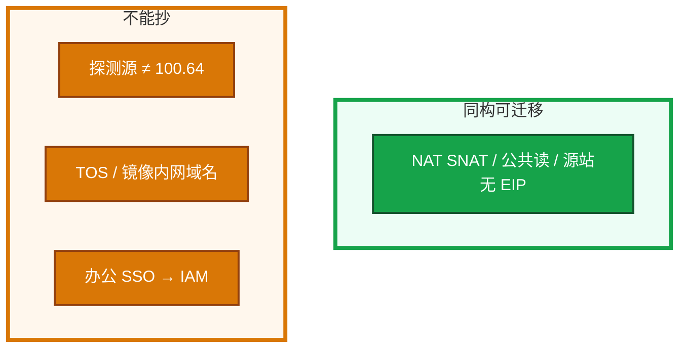
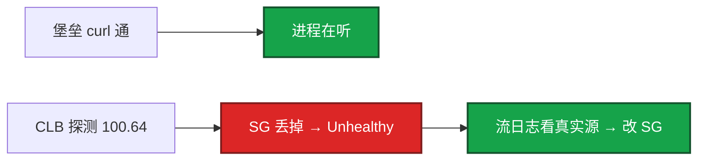
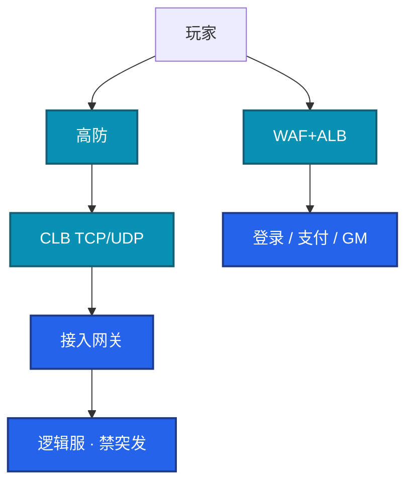
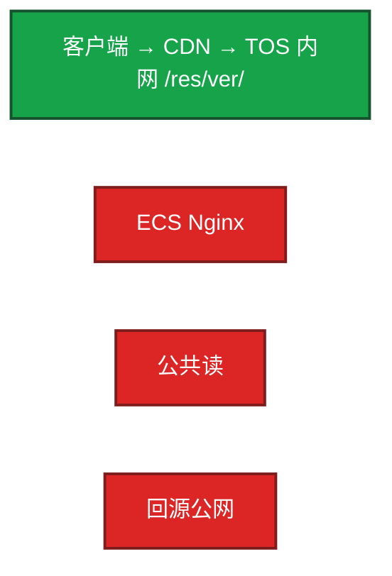
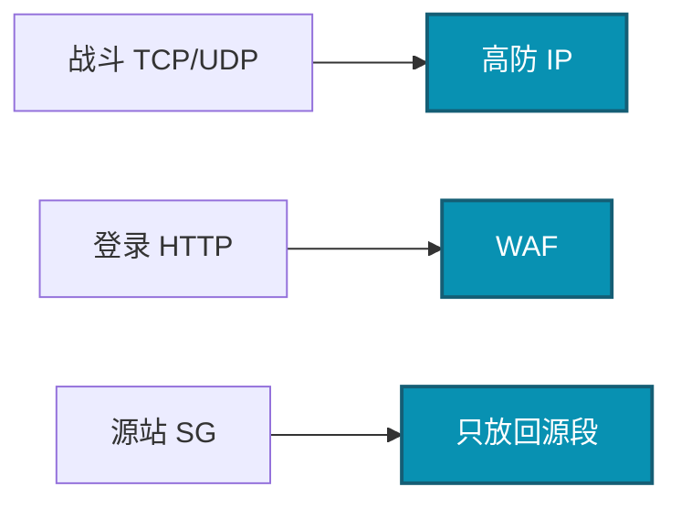

# 08｜火山引擎生产 · 练习题

先自己画图或口述，再对照解答。每题标了覆盖范围：

| 标记 | 含义 |
|------|------|
| **核心** | 不懂整章就没建立起来 |
| **必会** | 值班和面试都要能讲 |
| **常用** | 线上会反复碰到 |
| **常考** | 白板和追问的高频口径 |

## 本题目录

- [Q1 火山 vs 阿里](#q1)
- [Q2 CLB 全红本机通](#q2)
- [Q3 游戏入口与 CLB](#q3)
- [Q4 TOS 热更](#q4)
- [Q5 VKE IP 与 Serverless](#q5)
- [Q6 TLS 与账单](#q6)
- [Q7 高防 / WAF / GAAP](#q7)
- [Q8 办公 IAM](#q8)
- [Q9 出海与开服 5 分钟](#q9)
- [合上书](#合上书)

---

## Q1

**★★★★★｜火山和阿里差在哪？沐瞳游戏运维实际会碰到什么？**

**覆盖**：核心 · 必会 · 常考

### 场景

字节系岗位问「你们火山怎么跑」。有人开始背 veDB 全家桶。另一人把阿里模块原样 apply，健康检查全红。

### 完整解答

产品模型和阿里同构：VPC、安全组、CLB、TOS、VKE、TLS、IAM。排障思路可迁移。差在健康检查源、内网域名、IAM 与办公身份、文档 / 配额工单。沐瞳现场主打 TOS 热更 / 包体、CLB 长连接、VPC / SG、VKE 节点池、TLS、高防回源，不是 PaaS 名称。

必须单独验收：探测源 CIDR、TOS / 镜像内网 endpoint、IAM 与办公身份、配额工单流。没用过不要编全家桶。说法：「探测源我先查文档和流日志，不搬阿里网段。」选火山通常因为字节系或要打通字节内网 / 身份，不是「更懂游戏」。

### 再追问

为什么不单开腾讯云一章？——模型接近阿里，对照走 04。火山因为字节系（含沐瞳）必读才单开。

---

## Q2

**★★★★★｜从阿里复制过来的安全组，CLB 全红、本机 curl 通，先查什么？**

**覆盖**：核心 · 必会 · 常用

### 场景

Terraform 模块从 ACK 环境拷来，探测规则写着 `100.64.0.0/10`。实例运行中，监听全红。办公网能通。有人要改业务端口、重启 ECS。

### 完整解答

健康检查源不是阿里那条链路本地网段。本机 curl 只证明进程在听。按火山文档 / 控制台「负载均衡探测」放行真实源，对流日志看源 IP，再写进模块。不要先改业务端口、不要先重启逻辑服。

治理：模块里探测 CIDR 按云厂商参数化，禁止写死阿里网段。这是切云最高频事故。有状态服检查过严会把正在打的玩家踢到另一台，检查口要轻。

### 再追问

NLB / CLB 开了源 IP 保持，SG 怎么写？——业务端口规则和健康检查源是两套。SSH 绝不能跟着重开。不要假设和 AWS NLB 默认值一样。

---

## Q3

**★★★★★｜画一下游戏服在火山上的入口。长连接为什么不用 ALB？**

**覆盖**：核心 · 必会 · 常考

### 场景

Ingress 默认 ALB 套到战斗端口。自定义二进制协议。有人说 ALB 支持 WebSocket 所以也能接战斗。

### 完整解答

长连接选 CLB 四层，不解析协议、PPS / 延迟合适。ALB 是 HTTP；自定义 TCP / UDP 接上去会解析失败或按 HTTP 健康检查。WebSocket 仅当标准 HTTP 升级时走 ALB，idle 仍要短于心跳。UDP 只有四层。

逻辑服 ECS 高主频 / 通用，或 VKE 上的无状态 API。跨 AZ：数据面必须；战斗计算面常单 AZ。心跳 < CLB idle。源站无 EIP 裸奔。有状态服不能直接 HPA。弹性节点池给无状态 / 构建，不给战斗进程。

### 再追问

VKE LoadBalancer 改注解 IP 变了会怎样？——客户端写死 IP 会全服连不上。必须用域名。和 ACK 同一坑。

---

## Q4

**★★★★☆｜TOS 热更怎么配才不会开服当天炸？和 OSS 差在哪？**

**覆盖**：必会 · 常用 · 常考

### 场景

测试用 ECS 下包。开服十万客户端。桶公共读「省事」。回源抄了 OSS 公网域名。覆盖 latest 不刷新。CDN 命中率还行，回源账单先炸。

### 完整解答

TOS 扛源、CDN 扛边缘。Bucket 私有，回源走 TOS **内网 endpoint**（域名不要从 OSS 抄）。版本在对象键里，少覆盖同名。刷新有配额和延迟，强更分两步：新包可下载，再切版本检查。

观测：CDN 命中率、源站 403、TOS 流控、流出是否像被扫。生命周期按前缀，不要把 `res/current` 和日志归档一条规则。VKE 拉镜像同样走内网。能力同构；差异在内网域名、权限模型、和 VKE / TLS 集成。不要假设 S3 API 完全兼容。公共读在两家都是账单炸弹。

### 再追问

命中率不差但回源费炸，先换什么？——TOS 内网 endpoint，不要从 OSS 文档抄。

---

## Q5

**★★★★☆｜VKE 用 VPC-CNI，节点池 /24 会怎样？战斗服上 Serverless 行不行？**

**覆盖**：必会 · 常用 · 常考

### 场景

加节点后 Pod Pending。veDB 安全组只放了节点网段。有人用 Serverless 跑战斗服「更弹性」。控制面升级排在开服日。

### 完整解答

VPC-CNI 让 Pod IP 进 VPC，连库安全组好写，但吃大量 VPC IP，`/24` 会耗尽。止血：加网段 / 新子网，不要现场改已对等的生产 CIDR。规划按峰值 Pod × 1.5，和 Terway / AWS VPC CNI 同一套账。

战斗服：稳定节点、内核参数、可预期 drain，不要 ECI / Fargate / Serverless 图弹性。节点池禁突发规格。升级不要和开服日重叠。PDB、优雅下线、CLB 摘流时序和 ACK 同类。Pod 扮 IAM 角色访问 TOS / TLS，节点角色要瘦。

VKE 和 ACK：都是托管 K8s。VKE 文档少、和火山 / 字节内生态绑得紧。深度放在验收清单，不放在成熟度口号。

### 再追问

ssh 不进 etcd，这章能跳过影响面吗？——不能。停变更的仍是你的业务。见 04-01。

---

## Q6

**★★★★☆｜火山上日志怎么收？账单为什么会爆？**

**覆盖**：必会 · 常用

### 场景

TLS Agent 掉了。开服夜摄入和索引费用跳起来，玩家 ID 当列。云监控、TLS、Prometheus、字节内观测四个渠道同时炸群。

### 完整解答

TLS：Agent / DaemonSet 采集 → 查询 / 告警 → 投递 TOS 或 Kafka。默认用托管，免 ES 集群。账单爆：全字段索引 + 高基数 + Debug 全量。黄金指标用 Prom，TLS 管日志。观测：摄入是否掉零，再查 Agent / 权限。告警去重。自建 ELK 可以，大规模默认 TLS。和 SLS vs 自建 ES 是同一取舍。

veDB 仍看硬顶和多 AZ（05）：禁止公网、配置端点、开服夜 Redis < 70%、参数组开服夜不要顺手改。

### 再追问

不用 TLS 行不行？——行，自己管 ES 的 Heap / 分片 / 磁盘。小规模可以。

---

## Q7

**★★★★☆｜高防怎么接？游戏端口接 WAF 行不行？平时要不要一直走高防？**

**覆盖**：必会 · 常用 · 常考

### 场景

安全要把战斗端口接到 WAF。源站 SG 还是 `0.0.0.0/0`。被打时再切 DNS，TTL 5 分钟。CCU 断崖，逻辑服 CPU 不高。有人说 GAAP 等于玩家走专线。

### 完整解答

不行。WAF 解析 HTTP。游戏 TCP / UDP 走高防。源站 SG 只放回源。超阈值黑洞。CCU 断崖、CPU 不高 → 入口被洗，不要先重启战斗进程。

游戏服不能中断，生产倾向流量一直走高防，或高防 + CDN。被攻击再切 DNS 有 TTL 窗口，要提前演练。GAAP 给出海长连接加速，玩家仍在公网，不是专线，也不是跨云会话双活。和阿里游戏盾：都是 L3 / L4 清洗 + 藏源站，CNAME / 回源网段 / 黑洞阈值按新产品验收，不能「和阿里一样勾一下」。

### 再追问

逻辑服绑 EIP + `0.0.0.0/0` 会怎样？——DDoS 绕过高防直打，和阿里同一类事故。

---

## Q8

**★★★★☆｜IAM 上人和程序怎么走？办公账号离职够不够？**

**覆盖**：必会 · 常用 · 常考

### 场景

云里每人一把 AK。CI 也是长期密钥。节点角色 TOS Full Access。有人把 AWS IAM JSON 贴进火山。STS 写进环境变量跑 12 小时。

### 完整解答

人走字节办公 SSO → 扮演 IAM 角色 + MFA。离职关办公账号即失去扮演资格，比在云里删用户可靠。程序走实例角色 / VKE 工作负载角色 / CI 短时 STS。长期 AK 按 07：先禁 Key，再查操作审计。不要粘 AWS / RAM JSON。TOS 角色落到前缀；GM / 发奖与逻辑服拆开。审计打开，生产角色对审计桶 WriteOnly。STS 环境变量 12h = 形式上用了角色，实际变长期票；用 SDK 默认链续期。

### 再追问

条件键以谁为准？——火山文档和控制台。外网文档密度低于阿里 / AWS。

---

## Q9

**★★★★☆｜出海用火山还是 AWS？开服当天 5 分钟比阿里多哪一条？**

**覆盖**：必会 · 常用 · 常考

### 场景

国内已在火山。出海东南亚 / 欧美。有人画一张全球 VPC。身份证数据准备复制到海外「做灾备」。活动开始，模块从阿里拷来。

### 完整解答

分市场：国内火山 / 阿里，海外按延迟和合规选 region。东南亚 / 港台火山有节点；欧美 AWS 更完整。静态走 CDN 海外节点。数据驻留分 Region，不要一个 Redis 打全球。国内身份 / 支付数据不要复制到海外。灰度按区服。不要把火山出海当 Global AWS。

开服 5 分钟和阿里同构：规格、入口、心跳、热更、VKE IP / 域名、数据、日志去重、无长期 AK。**多出来的一条：探测源有没有抄 100.64；TOS / 镜像是不是内网域名。**

看：CLB 新建连接 / Unhealthy；高防是否黑洞；NAT 并发、veDB 连接、Redis 带宽；CDN 回源 4xx、TOS 流出；TLS 摄入掉零没有。从阿里复制模块没改探测源，是火山开服夜第四条经典故障。回滚入口 / DNS，不要先重启逻辑服。

第一周交付：对照表 + 探测源 / idle / CIDR / IAM 验收清单。不是 veDB 产品名。

### 再追问

成本在火山上还要另学一套吗？——包年基线、按量峰值、竞价只给可中断，和 06 同一套。盯 CDN 回源、NAT、公共读、闲置 EIP。开服按峰值签一年同样浪费。

---

## 合上书

- [ ] 能对照阿里说出探测源、内网域名、办公 IAM 三条不能抄
- [ ] 能处理本机通、CLB 全红：流日志看探测源，模块参数化
- [ ] 能画出高防→CLB→网关→逻辑服，并说明为什么不用 ALB
- [ ] 能配 TOS 私有 + CDN 内网回源；命中率不差但回源贵先换域名
- [ ] 能讲 VKE 吃 VPC IP、LB 用域名、Serverless 不给战斗进程
- [ ] 能把开服 5 分钟多出来的那一条和故障四连（含复制模块没改探测源）讲清楚
