# 游戏服务器架构

> 大家好，欢迎来到这次分享。开讲之前，先带大家回到一个现场：
> 公会战进行中，有人把大厅和战斗写成同一个 Deployment，YAML 抄了 Web 的 `maxUnavailable=25%`。三分钟后 CCU 掉了一截，工单里全是「判负」「掉线」——战斗房间钉在进程里，**没有「切流量」这回事**。
> 这一章讲完，你会知道当时那个人错在哪——大厅能滚、战斗不能按 Web 那套滚，以及正确的分层与发布边界是什么。
> **本章回答的问题**：一个玩家从点图标到打完一局，包和状态经过哪些层、哪层能扩哪层不能、权威数据落在哪。
> **本章不讲**：登录排队与 ticket → [02](../02-登录排队与选服/)；活动三峰与压测 → [03](../03-活动高峰与压测/)；全链路容量模型 → [04](../04-全链路压测与容量模型/)；开服合服 → [06](../06-开服合服/)；TCP 握手/长连接队列 → [12-网络栈与Socket](../../01-基础底座/12-网络栈与Socket/)、[13-TCP与UDP](../../01-基础底座/13-TCP与UDP/)。

**标记**：🎯重点 · 🔥难点 · ⭐常考 · 🔧实操

**怎么听这场分享**：先把第一节「玩家进游戏的一生」看熟——后面每一节都是这张图上的一层；第二到第十一节顺着出门 → 问路 → 进门 → 大厅 → 战斗 → 账本 → 分服 → 协议 → 部署 → 观测往下走；第十二节专门讲开头那个公会战现场怎么定责。每一节讲完会提示对应练习题，趁热打铁。

---

## 一、一张图：玩家进游戏的一生

> 🎯 **一句话**：进游戏不是一次 HTTP，而是一条长命——客户端 → 目录 → Gate → 大厅/战斗 → Redis/MySQL，每层职责不同、扩容边界不同。

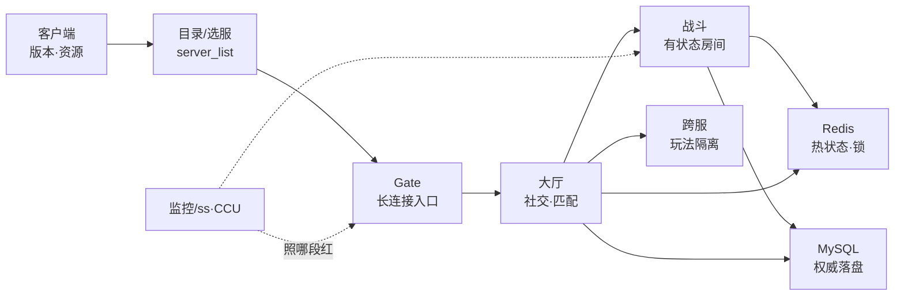

**读图**：

- 从左到右是**时间线**：先问路（目录），再进门（Gate 钉长连接），再办事（大厅/战斗），最后落账（Redis 缓存、MySQL 权威）。
- 排障时问「卡在哪一段」——全服进不去查目录/Gate，能进大厅进不了房间查匹配/战斗，打着打着全员掉线查战斗滚动发布。
- `ss`/CCU 监控主要照 **Gate（连接数）** 和 **战斗（房间数/进程存活）**，MySQL 慢是「落账段」的问题，不是连接段。


好，主图装进脑子了。接下来咱们从「出门」开始——客户端版本和 CDN 包。

本节对应练习题 Q1、Q14。

---

## 二、出门：客户端、版本与 CDN

> 🎯 **一句话**：客户端先对齐版本和资源，版本不对后面全白搭——这一层无状态，但 CDN 回源打爆照样全渠道进不去。

玩家点图标后，第一件事不是连游戏服，而是拉**版本清单**和**资源包**（差分包、热更资源）。这一跳走 HTTP/HTTPS + CDN，和后面 Gate 的长连接是两条路。

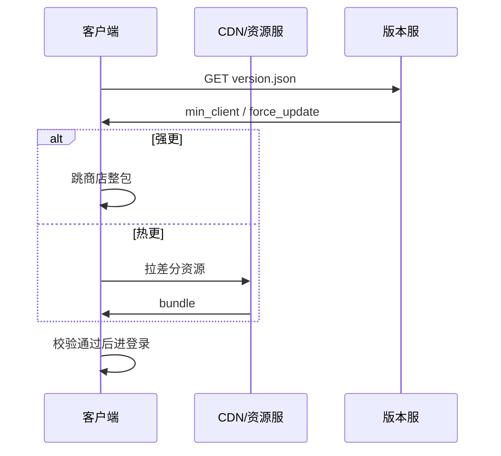

**读图**：`version.json` 决定能不能进登录链路；资源热更失败多数可重试，**强更**必须整包——运维别在 Gate 上查「连不上」时漏看版本服。CDN 细节见 [08](../08-CDN与资源更新/)。

**CCU（Concurrent Users，同时在线用户数）** 在这一段还不存在——只有下载 QPS 和带宽。值班常混：**下载峰 ≠ 在线峰**，开服前 CDN 预热和 Gate 预扩是两本账。

> 🔍 **现场**：版本服挂了，玩家卡在「检查更新」——不是登录失败。

```bash
curl -sS -o /dev/null -w '%{http_code} %{time_total}s\n' \
  https://cdn.example.com/version.json
# 200 0.042s   ← 版本文件可达；5xx/超时先修 CDN/源站，别动 Gate
```

> ⚠️ **别混**：**客户端版本（client version）** 管能不能进游戏；**协议版本（proto version）** 管连上后包能不能解析——两个号，热更只改资源不改协议时 client 升了 proto 不变。强更边界见 [05](../05-热更新与版本发布/)。

> 📝 **面试**：「游戏和 Web 架构最大差别？」——答「**长连接 + 有状态进程**」：Web 无状态副本可随意滚；战斗房间钉在进程内存，滚更 = 房间死亡。


出门讲完。玩家要找服务器，下一站是目录与选服。

本节对应练习题 Q1、Q2。

---

## 三、问路：目录与选服

> 🎯 **一句话**：**目录服（Directory Server）** 告诉客户端「有哪些服、哪个推荐、维护态」——全服进不去的第一刀 often 是目录 500，不是战斗。

目录返回 **server_list**：`server_id`、显示名、状态（流畅/爆满/维护）、推荐标记、Gate 地址或入口域名。客户端本地缓存一份，但**以目录为准**。

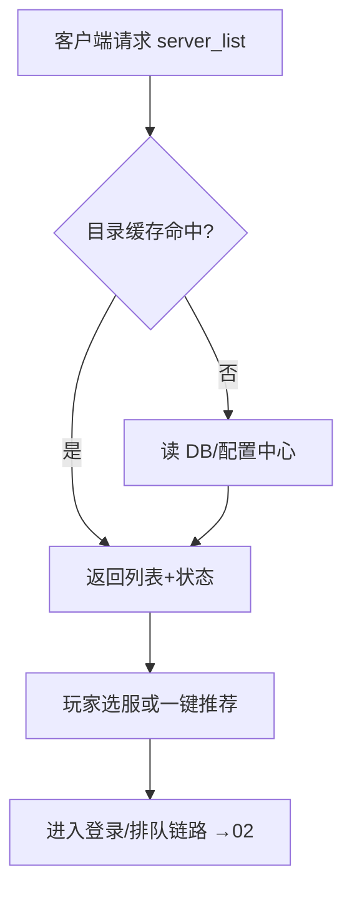

**读图**：目录是**只读聚合**，理论上可水平扩；但**不可 500**——宁可降级返回**旧列表 + 维护标记**，也不能空列表。选服、排队、ticket 全链路见 [02](../02-登录排队与选服/)，本章只标边界。

**分服（shard / 分服）**：每个 `server_id` 对应一套逻辑服，玩家数据按服隔离。运维单元是「服」不是「集群」——A 服爆满不能靠 B 服副本救 A 服玩家。

**爆满（full）** 只拦**新创角/新迁入**，已有角色必须能进；否则运营活动「拉新服」会直接资损。

> ⚠️ **别混**：**分服**（数据按 server_id 隔离）≠ **分库**（物理 MySQL 实例拆分）——一服一库常见，但合服后映射变了，见 [06](../06-开服合服/)。**跨服**（cross-server）是玩法层临时聚合，不替代分服存储边界。

> 🔍 **现场**：玩家说「选服列表空白」

```bash
curl -sS 'https://dir.example.com/api/server_list?channel=ios' | jq '.code, (.servers|length)'
# 0 128        ← code=0 且有条目；code≠0 或 servers=[] 先修目录，别重启战斗
# 500 null     ← 目录挂了，触发降级策略是否生效（旧列表缓存）
```

> 📝 **面试**：「全服进不去你怎么查？」——「先分跳：版本 → 目录 → 账号 → 排队 → Gate。目录 500 时全渠道同时挂，和单服战斗无关。」


问路讲完。真正进门靠 Gate 长连接——这是整章最关键的一层之一。

本节对应练习题 Q2。

---

## 四、进门：Gate 长连接入口 🔥⭐

> 🎯 **一句话**：**Gate（网关）** 是玩家和游戏逻辑的**唯一长连接入口**——连接钉在 Gate 进程上，扩 Gate 是扩**能接多少连接**，不是扩战斗算力。

Gate 职责：维持 TCP/KCP 长连接、心跳、会话（session）、协议转发（把客户端包路由到大厅/战斗进程）、限流与踢人。一个玩家在线 = 至少一条到 Gate 的 **ESTABLISHED**（状态名见 [13-TCP与UDP](../../01-基础底座/13-TCP与UDP/)）。

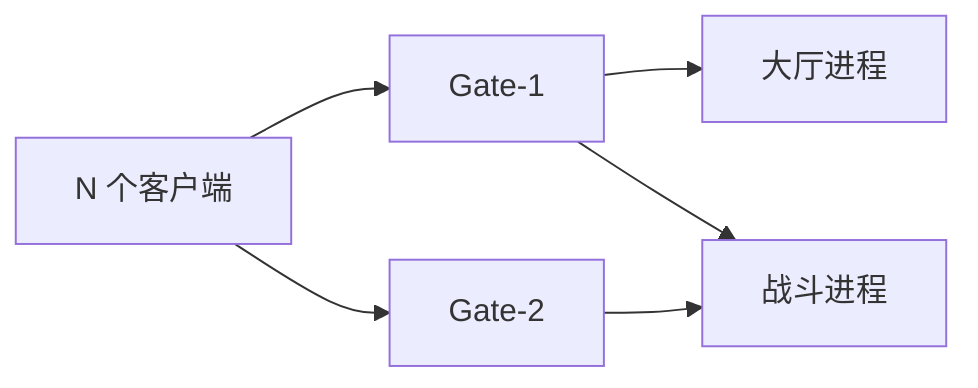

**读图**：Gate 后面可以挂多个逻辑进程；**连接在 Gate，业务在后方**。Gate fd/连接数到顶 = 新玩家连不上，但老玩家战斗可能正常——别误杀战斗。

**长连接容量** 粗算（面试常问）：

```text
单 Gate 进程连接上限 ≈ min(ulimit nofile, 内核 somaxconn, 应用 self limit)
内存 ≈ 每连接 (recv+send buffer + 会话对象) × 连接数
```

> 💡 **打个比方**：Gate 像酒店前台——房间（战斗）在后楼，前台卡了进不了门，后楼空房也没用。扩前台（Gate）救不了后楼满房（战斗进程满）。

Gate 扩缩容相对**无状态**（会话可 sticky 或集中存 Redis），但**不能把 Gate 和战斗绑同一个 Deployment**——滚动更新会断全服连接。连接队列、`Recv-Q`/`Send-Q` 排障见 [12-网络栈与Socket](../../01-基础底座/12-网络栈与Socket/)。

> 🔍 **现场**：CCU 涨但新玩家进不去，老玩家正常

```bash
ss -s | head -5
# Total: 512000 TCP: 510000 (estab 498000, ...)   ← 总连接接近上限

ss -ant state established '( sport = :4103 )' | wc -l
# 62000   ← 单 Gate 监听 4103 的 ESTAB 数；对比配置的 max_conn

ulimit -n
# 65535   ← 进程 fd 上限；连接数不能超过此值
```

> ⚠️ **别混**：**Gate 连接数**（长连接条数）≠ **CCU**（有时扣掉假连接/机器人/未进大厅）——以业务监控的 CCU 为准，但以 `ss` 验证 fd 压力。Gate **踢人**走协议通知，不要 `kill -9` Gate 进程当「维护」。

> 📝 **面试**：「Gate 能 HPA 吗？」——「能，但要 **session 亲和或集中 session 存储**，且滚动时用**摘流四步**（停新连接 → 等旧连接自然掉 → 再滚 → 接回），不能 `maxUnavailable=50%` 硬滚。」


Gate 讲完。进门之后先到大厅——社交、匹配，和无状态边界。

本节对应练习题 Q3。

---

## 五、大厅：社交、匹配与无状态边界

> 🎯 **一句话**：**大厅（Lobby）** 管社交、背包展示、匹配请求——相对无状态，扩副本加**吞吐**；匹配结果要把玩家**钉到具体战斗进程**。

大厅不持有对局状态，但持有**匹配队列**和**路由表**（哪个 `room_id` 在哪台 `battle_inst`）。匹配成功 = 写一条 `room_id → host:port` 映射，客户端（经 Gate）连过去或服内转发。

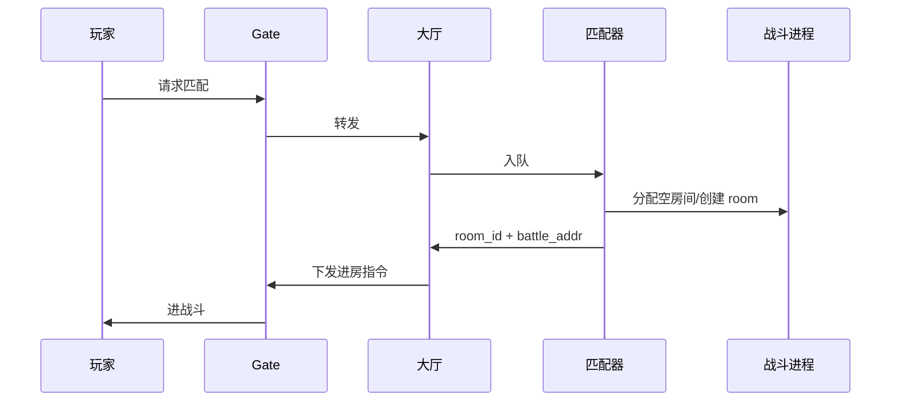

**读图**：「能进大厅进不了房间」= 匹配/路由/战斗**空进程**问题，不是 Gate。扩大厅副本不自动创造战斗空房间。

**无状态（stateless）** 在这里的含义：任意大厅副本都能处理任意玩家的**非对局**请求；对局一旦创建就变成**有状态**，交给战斗层。

> 🔍 **现场**：匹配转圈超时

```bash
# 假设有 Prometheus 指标 battle_empty_rooms / match_queue_depth
curl -sS 'http://prom:9090/api/v1/query?query=match_queue_depth' | jq '.data.result[0].value[1]'
# "1842"   ← 队列堆积；同时查 battle 空房间是否为 0

kubectl get pods -l app=battle -o wide | grep Running | wc -l
# 12   ← 战斗 Pod 数；HPA 刚扩的新 Pod 空房间=0，救不了已开对局
```

> 📝 **面试**：「大厅和战斗为什么要分开？」——「**生命周期和扩容模型不同**：大厅无状态可快速 HPA；战斗有状态，扩的是**空房间容量**，不是把正在打的局迁移走。」


大厅讲完。大家想想：公会战房间能不能像大厅一样滚动发布？很多人会答「一样滚」——错了。下一节把有状态战斗钉死。

本节对应练习题 Q4、Q8。

---

## 六、战斗：有状态房间与进程钉死 🔥⭐

> 🎯 **一句话**：**战斗服（Battle Server）** 把整局状态放在**进程内存**——房间 = 进程（或进程内 room 对象），**滚动发布 = 对局死亡**。

大家想想：Web 服务滚动更新「摘一个补一个」——战斗服能照抄吗？很多人会答「能，K8s 都一样」——⭐ 这是高频错答。🔥 大白话先钉死：**房间钉在进程内存里，没有「切流量」这回事**——滚掉进程 = 房间里的玩家直接判负。

这是游戏运维和 Web SRE 的**核心分叉点**。Web 请求无状态，Pod 随便杀；战斗里 10 人在线对局，Pod 被 SIGTERM = 全员掉线/判负。

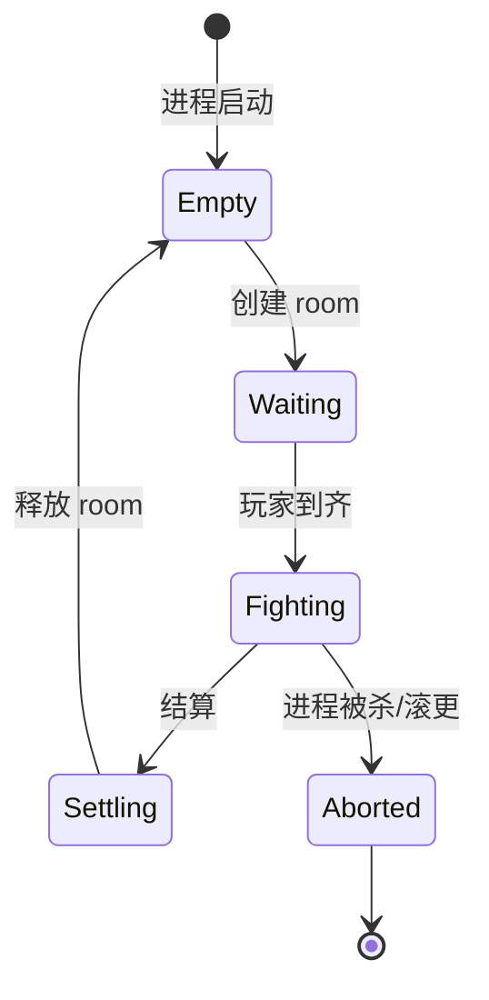

**读图**：只有 **Empty** 段可以安全回收进程；**Fighting** 段杀进程 = 事故。发布策略必须是：**摘流 → 停止分配新 room → 等存量 room 打完 → 再重启**。

**有状态（stateful）** 扩容含义：

```text
扩战斗 ≠ 救正在打的局
扩战斗 = 多几个「空房间」接新匹配
已开 room 不会自动迁移到新 Pod（除非业务做了 room 迁移——极少）
```

> 💡 **打个比方**：战斗进程像正在进行的棋局——你可以多摆几张空棋盘（新 Pod），不能把下到一半的那盘棋挪到新桌子上去，除非选手全体同意重开。

**跨服战斗**（cross-server battle）在独立进程池，和本服战斗隔离资源——本服战斗挂了别误杀跨服池；跨服匹配延迟更高，容量单独算。全服玩法（world boss）是**玩法层**概念，底层仍可能分 shard 汇总伤害，见活动章 [03](../03-活动高峰与压测/)。

> ⚠️ **别混**：**进程有状态** ≠ **Pod 必须用 StatefulSet**——很多团队用 Deployment + 本地内存 room，靠**发布流程**保状态；StatefulSet 解决的是**稳定网络标识和盘**，不自动帮你迁移 room。**PDB（Pod Disruption Budget）** 对战斗 often 是 `minAvailable=100%` 或发布窗口内禁止 voluntary disruption。

> 🔍 **现场**：发布后全员判负

```bash
kubectl rollout history deploy/battle-prod
# REVISION  CHANGE-CAUSE
# 42        helm upgrade ...   ← 对照事故时间点

kubectl get events --field-selector involvedObject.name=battle-prod-xxx --sort-by='.lastTimestamp' | tail -5
# ... Killing container battle ...   ← 确认是否滚动更新杀 Pod

# 业务侧：room 是否绑 pod name
kubectl exec -it battle-prod-abc -- curl -s localhost:8080/debug/rooms | head
# {"room_id":"r1","players":10,"state":"fighting"}   ← fighting 中被杀 = 判负
```

> 📝 **面试**：「战斗服怎么做发布？」——「**四步摘流**：① 标记不可匹配 ② 停止新 room ③ 等存量 room 打完或超时 ④ 再滚进程；**禁止**抄 Web 的 `maxUnavailable: 25%`。」

### 收束：有状态服凭什么不能「像 Web 一样滚」


**读图**（分组背）：

- **Web**：请求完即走，Pod 是 cattle（ cattle 可替换）。
- **战斗**：room 是 pet（ pet 有名字有状态），杀之前必须**迁走或等它自然结束**。
- **运维推论**：HPA 只能扩**空房间**；发布、节点 drain、集群升级都要**先问 room 在哪**。

> ⚠️ **别混**：有状态服「不能滚」不是说**永远不能重启**——是说**不能无感知滚动**。可以维护窗口强杀，但要运营公告 + 补偿预案。

> 📝 **面试**：背三句——「① 状态在内存不在 LB 后面 ② 扩副本不加已开 room ③ 发布=等 room 空或摘流」。


记住口诀：**大厅可切流，战斗钉进程**。下一节看账本——Redis 热状态与 MySQL 权威。

本节对应练习题 Q2、Q11。

---

## 七、账本：Redis 热状态与 MySQL 权威 🔥⭐

> 🎯 **一句话**：**MySQL 是权威（source of truth）**，Redis 是热缓存和分布式锁——回档、对账、资损事件只认 MySQL；Redis 丢了可以重建（有代价）。

🔥 大白话先钉死：⭐ **Redis 是热状态草稿纸，MySQL 是权威账本**——草稿纸丢了可以重算/重载，账本写坏了要回档。别把权威只放在 Redis 里赌持久化。

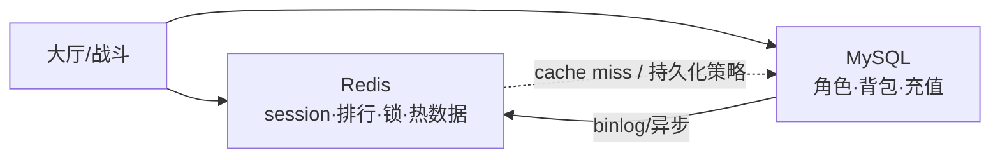

**读图**：写路径通常是「先业务规则 → MySQL 事务 → 异步刷 Redis」；读路径可能 Redis 先。**资损**（重复发货、扣了没加）查 MySQL 事务与幂等键，不要只看 Redis。

| 放 Redis | 放 MySQL |
|----------|----------|
| 在线标记、排行缓存、匹配临时队列 | 角色属性、背包、订单、公会 |
| 分布式锁（短 TTL） | 强一致账本 |
| Gate session（看架构） | 充值回调落库 |

**热 key**（hot key）：全服排行、活动总伤害——单 key QPS 顶穿 Redis 集群；活动章拆 key / 本地聚合见 [03](../03-活动高峰与压测/)。MySQL 索引与锁见 [02-01 MySQL](../../02-中间件与数据库/01-MySQL/)；Redis 持久化与高可用见 [02-02 Redis](../../02-中间件与数据库/02-Redis/)。

> 💡 **打个比方**：MySQL 是银行账本，Redis 是钱包里的现金——钱包丢了可以按账本补，账本错了全服破产。

> ⚠️ **别混**：**「读写分离」** 救不了活动发奖写尖刺——从库延迟只帮读，写仍打主库。**「Redis 集群化了就不会挂」**——热 key 和 big key 照样单分片顶穿。

> 🔍 **现场**：玩家说「道具没了但扣费记录还在」

```bash
# 先 MySQL 查幂等与订单，不要 flush Redis
mysql -e "SELECT id,status,item_id FROM player_order WHERE role_id=12345 ORDER BY id DESC LIMIT 5;"
# id  status  item_id
# 99  success 1001   ← 库里有成功记录 = 权威已发货，查客户端/cache

redis-cli -h redis.prod GET "bag:12345"
# (nil)   ← 缓存 miss 不是没发货，触发 rebuild 或查 MySQL 回填
```

> 📝 **面试**：「Redis 和 MySQL 怎么分工？」——「**MySQL 权威，Redis 加速**；任何涉及钱的写必须 MySQL 事务 + 幂等；Redis 可丢但要有重建路径。」


账本讲完。区服、跨服与故障域怎么切。

本节对应练习题 Q5、Q12。

---

## 八、分服、跨服与故障域

> 🎯 **一句话**：**分服**缩小爆炸半径，**跨服**隔离玩法资源，**账号/目录/Gate** 挂是全渠道——三层故障域要分开讲。

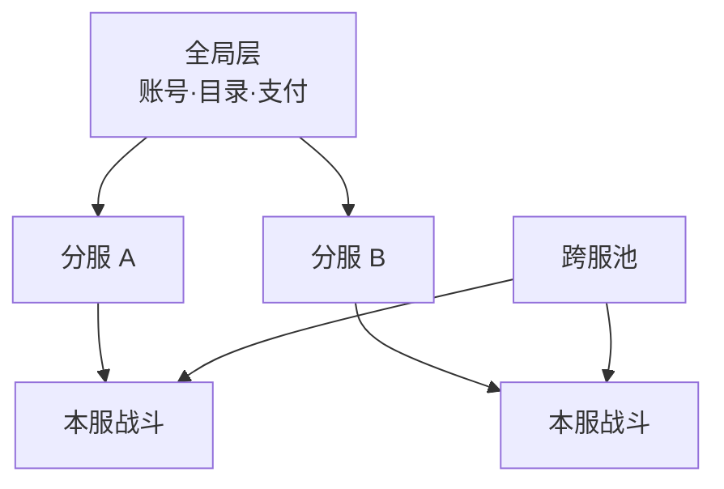

**读图**：

- **全局层**挂：全渠道进不去——优先恢复目录/账号，别动单服战斗。
- **单分服**挂：只有 A 服玩家受影响，B 服正常——别「一刀切重启全集群」。
- **跨服池**挂：只影响跨服玩法，本服仍可玩——告警要分玩法标签。

**CCU 口径**：全服 CCU = 各分服 CCU 之和（去重机器人规则看产品）；容量规划按**单服峰值**和**全局登录峰**分别做，见 [04](../04-全链路压测与容量模型/)。

> 📝 **面试**：「怎么定义故障影响面？」——「先画三层：全局 / 分服 / 跨服；玩家话术『全服』往往是全局层，『我们服』是分服。」


分服讲完。协议层：长连接上的消息与心跳。

本节对应练习题 Q6。

---

## 九、协议层：长连接上的消息与心跳 🔥⭐

> 🎯 **一句话**：Gate 之上是 **应用层协议**——**长度前缀定界**、**心跳**、**session 绑定**，排障「连上没包」要先分清 TCP 活没活、应用认不认 session。

游戏长连接在 TCP/KCP 之上跑自定义二进制协议（见 [13-TCP与UDP](../../01-基础底座/13-TCP与UDP/) 粘包节）。运维常碰：

- **心跳（heartbeat）**：客户端定时 ping，Gate 刷新 `last_seen`；超时踢 **应用层**，TCP 可能仍 ESTABLISHED
- **协议版本（proto version）**：与 client version 不同——不 match 表现为「连上立刻断」
- **消息路由**：Gate 按 `msg_type` 转发大厅/战斗，**不是**所有包都进同一后端

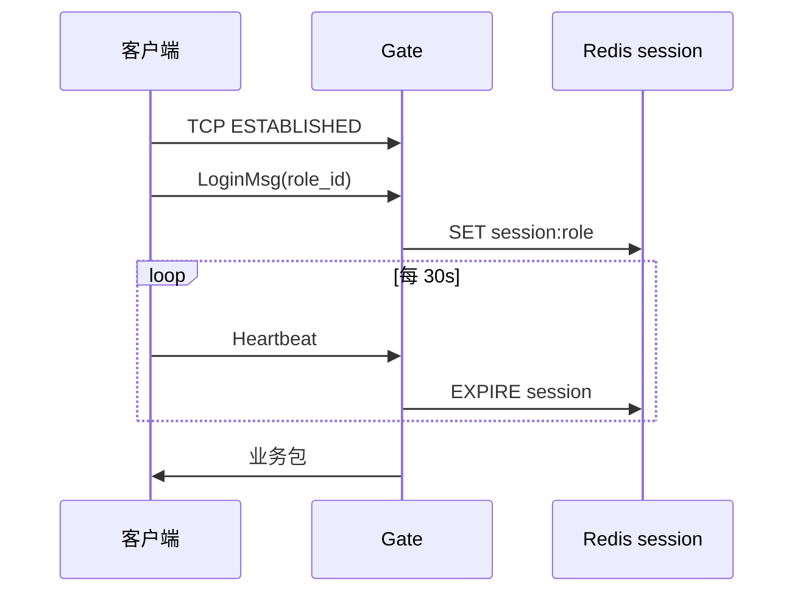

**读图**：**TCP 活 + 业务死** = 心跳/协议/session 问题；**TCP 死** = 网络/Gate 进程/发布（12/13 章）。

> 🔍 **现场**：CCU 监控高但玩家说「假死」

```bash
ss -ant state established '( sport = :4103 )' | wc -l
# 500000   ← TCP 仍多

curl -sS 'http://prom:9090/api/v1/query?query=sum(session_active)' | jq '.data.result[0].value[1]'
# 320000   ← 应用 session 少很多 → 心跳超时未踢或 session 泄漏

grep 'heartbeat timeout' /var/log/gate/gate.log | tail -5
# 是否在批量踢
```

> ⚠️ **别混**：**TCP keepalive**（内核，2h 级）≠ **应用心跳**（30～90s）——弱网排障看应用心跳；挂机踢人看产品 TTL。

> 📝 **面试**：「ESTABLISHED 很多但玩家掉线？」——「查应用 session 与心跳；TCP 层活不代表业务在线。」


协议讲完。落到 K8s：分层、探针与发布边界——就是开头那个 YAML 抄错的根。

本节对应练习题 Q9。

---

## 十、K8s 部署：分层、探针与发布边界 🔧⭐

> 🎯 **一句话**：**Gate / 大厅 / 战斗必须分 Deployment**——探针、PDB、HPA 各不同；战斗 **liveness 要保守**，别把 room 当无状态杀。

```text
gate-deploy     · 可滚动（摘流） · HPA on CPU+连接数指标
lobby-deploy    · 可滚动 · Session 放 Redis
battle-deploy   · OnDelete/手动摘流 · HPA on empty_rooms · PDB minAvailable 100% 战斗中
```

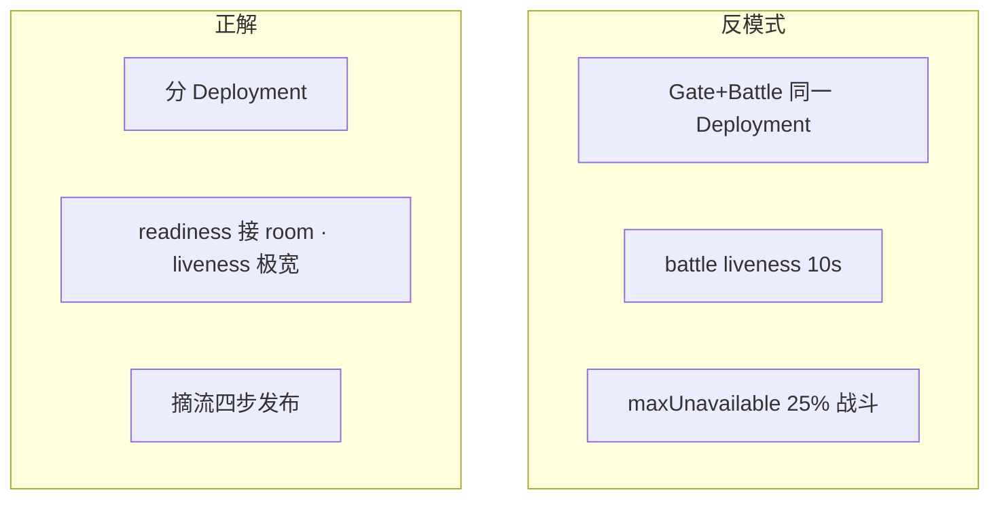

**读图**：K8s 只提供 **进程编排**——**room 状态机仍由业务保证**（六节）。Pod Ready 只表示进程起了，不表示 **能接新 room**（warmup/register）。

> 🔍 **现场**：HPA 疯狂扩 battle 无效果

```bash
kubectl describe hpa battle-prod | grep -A5 Conditions
kubectl get pods -l app=battle -o jsonpath='{range .items[*]}{.metadata.name}{"\t"}{.status.containerStatuses[0].ready}{"\n"}{end}' | head
# Ready=true 但 empty_rooms=0 → 指标选错
```

Pod 生命周期与 SIGTERM 见 [03-04 Pod生命周期](../../03-Kubernetes/04-Pod生命周期/)。

> 📝 **面试**：「游戏在 K8s 怎么部署？」——「三层分 Deployment；战斗发布摘流；HPA 看 empty_room 不是 CPU alone。」


部署讲完。怎么观测：CCU、连接数与黄金信号。

本节对应练习题 Q10。

---

## 十一、观测：CCU、连接数与黄金信号

> 🎯 **一句话**：**CCU、Gate ESTAB、登录 QPS、room 数** 四曲线一起看——单看 CCU 会漏 fd 顶、假在线、空 room 不足。

建议 Dashboard 分行：

```text
全局：CCU · login_qps · queue_depth · gate_estab_sum
分服：CCU by server_id · mysql_threads by shard
战斗：empty_rooms · fighting_rooms · match_queue_depth
资源：Gate CPU/mem · Battle CPU · MySQL Threads_running · Redis ops
```

**RED**（[09-SRE](../../09-可观测性与SRE方法论/)）：Rate 登录/玩法 API、Errors 漏斗、Duration P99。

> 🔍 **现场**：Grafana 快速面板

```bash
curl -sS 'http://prom:9090/api/v1/query?query=sum(ccu)' | jq -r '.data.result[0].value[1]'
curl -sS 'http://prom:9090/api/v1/query?query=sum(gate_connections)' | jq -r '.data.result[0].value[1]'
# CCU 48万 · gate 52万   ← 差值大查机器人/未进大厅连接
```

> 📝 **面试**：「游戏监控看什么？」——「CCU+Gate 连接+登录漏斗+empty_room+主库写；分服标签必带。」


观测齐了，咱们回到公会战那个现场——玩家进不去 / 打着掉线怎么定责。

本节对应练习题 Q13。

---

## 十二、作战：玩家进不去 / 打着掉线定责 ⭐

> 🎯 **一句话**：先问「进不去还是打着掉线」，再沿主图从左到右查，**禁止**未定位就重启战斗集群。

### 决策树

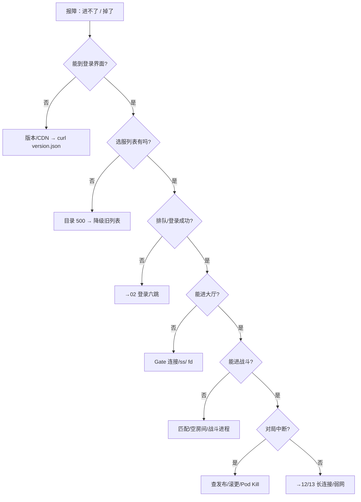

**读图**：左支是「进游戏链路」，右支是「已在玩」——**打着掉线**优先查**发布事件**和 **Pod 生命周期**，不是先扩登录。

| 现象 | 先做 | 别做 |
|------|------|------|
| 全渠道选服空白 | 目录健康、降级缓存 | 重启所有战斗 |
| 新玩家进不去老玩家正常 | Gate 连接数、fd 上限 | 扩战斗副本 |
| 能匹配进不了房间 | 空 room 数、战斗 Pod Ready | 只扩大厅 |
| 公会战全员判负 | `rollout history`、发布窗口 | 立即再滚一次「修复」 |
| 单服卡顿其他服正常 | 该服 DB/Redis，分服边界 | 全局重启 Gate |

### 60 秒剧本 🔧

```text
0–10s  问清：进不去 vs 打着掉 vs 单服 vs 全服；查 incident 时间线有无发布
10–30s curl version.json；查目录 API；Grafana 看 CCU/Gate 连接/匹配队列
30–45s ss -s / Gate ESTAB；kubectl get pods -l app=battle；rollout history
45–60s 定责层：全局/分服/战斗/网络；同步「先别滚战斗」若 room 进行中
```

> 🔍 **现场**：一键巡检脚本片段

```bash
echo "=== version ===" && curl -sS -o /dev/null -w '%{http_code}\n' https://cdn.example.com/version.json
echo "=== dir ===" && curl -sS 'https://dir.example.com/api/server_list' | jq -r '.code'
echo "=== gate conn ===" && ss -s | awk '/TCP:/ {print}'
echo "=== battle pods ===" && kubectl get pods -l app=battle --no-headers | awk '{print $3}' | sort | uniq -c
# Running 48   ← 若大量 Terminating 对照发布
```


现在再看群里那句「大厅战斗一个 Deployment + maxUnavailable=25%」，你知道该怎么拦住他了。收口把命令、面试口径和数字墙收齐。

本节对应练习题 Q7、Q13。

---

## 十三、收口

### 命令速查 🔧

```bash
# 版本/CDN
curl -sS -o /dev/null -w '%{http_code} %{time_total}s\n' https://cdn.example.com/version.json

# 目录
curl -sS 'https://dir.example.com/api/server_list' | jq '.code, (.servers|length)'

# Gate 连接
ss -s
ss -ant state established '( sport = :4103 )' | wc -l
ulimit -n

# 战斗/发布
kubectl get pods -l app=battle
kubectl rollout history deploy/battle-prod
kubectl get events --sort-by='.lastTimestamp' | tail -20

# 权威数据
mysql -e "SHOW PROCESSLIST;" | head
redis-cli INFO stats | grep instantaneous
```

### 面试锚点

遮住右列自问自答，卡壳的行回去重读对应小节——能讲出来才算会，看着答案点头不算。

| 问 | 30 秒答 |
|----|---------|
| 游戏架构和 Web 最大区别？ | 长连接 + 有状态战斗进程；滚更不能抄 Web 的 maxUnavailable |
| CCU 是什么？ | 同时在线用户数；和 Gate 连接数、登录 QPS 分开算账 |
| Gate 干什么？ | 长连接入口、会话、转发；扩 Gate 不扩战斗算力 |
| 有状态怎么扩？ | 扩空房间/新进程，不迁移已开 room |
| MySQL 和 Redis？ | MySQL 权威，Redis 热状态；钱和道具以库为准 |
| 分服和跨服？ | 分服隔离数据与故障；跨服隔离玩法资源池 |
| 全服进不去先查啥？ | 版本 → 目录 → 账号/排队 → Gate，别先动战斗 |
| 战斗发布怎么做？ | 摘流四步：停匹配 → 停新 room → 等存量 → 再滚 |

### 易错对照

- 错：战斗和 Gate 同一个 Deployment 方便管理 → 对：分层部署，Gate 可滚，战斗走摘流
- 错：CCU 高就 HPA 战斗 → 对：先看是连接满、匹配堆还是 room 满
- 错：Redis 没数据就是没发货 → 对：查 MySQL 幂等与订单
- 错：全服进不去重启战斗 → 对：先查全局层目录/账号
- 错：跨服挂了重启全服 → 对：只影响跨服玩法，本服独立
- 错：从库能扛活动写峰 → 对：写只打主库，读写分离不救写尖刺
- 错：Pod Ready 就能接 room → 对：进程内可能还在 warmup/注册

### 数字墙

```text
Gate 单进程连接：常见 2万～6万（看 buffer 与语言）· ulimit 默认 1024 必改
战斗 room 时长：5～40 分钟 · 发布窗口 often 留 2× P99 room 时长
目录缓存 TTL：30～300s · 降级旧列表允许 stale，不允许 empty
MySQL 主库写：单服峰值写 QPS 单独压测 · 活动发奖 often 100× 日常写
Redis 热 key：单 key >10万 QPS 要拆 · 排行刷新 1～5s  acceptable
心跳：移动网络 30～90s 超时 · 弱网见 12/13 章
CCU : 登录 QPS ≈ 1:0.3～1（看重连率）· 活动整点 20× 见 03 章
```

---

## 合上书

学到这里，先别急着翻下一章。合上书，试试下面这几件事能不能做到——能做到，这章才算真的听懂了。卡住的那一条，就回到对应的小节再听一遍：

- [ ] **默画**主图：客户端 → 目录 → Gate → 大厅/战斗 → Redis/MySQL，标出长连接钉在哪（Q1、Q14）。
- [ ] 口述 **CCU、Gate 连接数、登录 QPS** 三个数为什么不能混用一个扩容策略（Q1、Q2）。
- [ ] 说清 **有状态战斗** 为什么不能用 Web 的 `maxUnavailable: 25%` 滚动（Q2）。
- [ ] 背 **战斗发布摘流四步**，并说出跳过某一步的事故症状（全员判负）（Q3）。
- [ ] 解释 **MySQL 权威、Redis 热状态**——道具纠纷先查谁（Q4、Q8）。
- [ ] 分服 / 跨服 / 全局层 各挂一个时的**影响面**和**第一刀**（Q2、Q11）。
- [ ] 「能进大厅进不了房间」沿主图**定责路径**（匹配 → 空 room → 战斗进程）（Q5、Q12）。
- [ ] 「全服进不去」**不要做什么**（不要先重启战斗集群）（Q6）。
- [ ] 说出 **Gate 像前台、战斗像棋局** 的扩容比喻，并对应到 HPA 边界（Q9）。
- [ ] 口述 **目录不可 500、爆满只拦新号** 两条运维铁律（Q10）。
- [ ] **默画** K8s 三层 Deployment 边界：Gate 可滚、战斗摘流（Q13）。
- [ ] 说清 **TCP ESTABLISHED 多但 CCU 低** 的两种原因（未进大厅、心跳/session）（Q7、Q13）。

全部打勾之后，给自己出一个终极测试：找一位同事，十分钟讲清「公会战为什么不能把大厅和战斗写成一个 Deployment、maxUnavailable=25% 错在哪」。讲得下来，你就是下一个能拦住「按 Web 方式滚战斗」的人。
