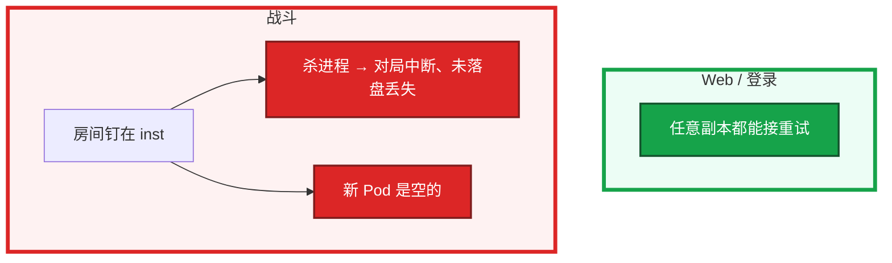
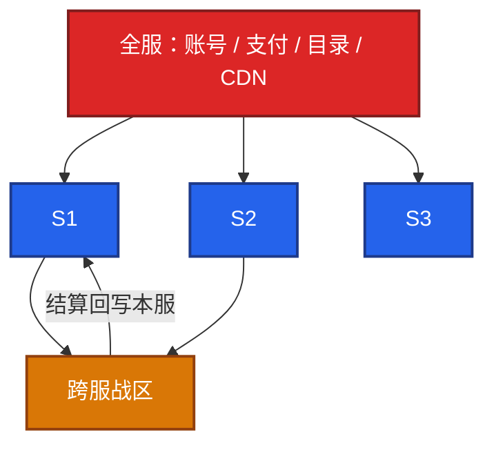
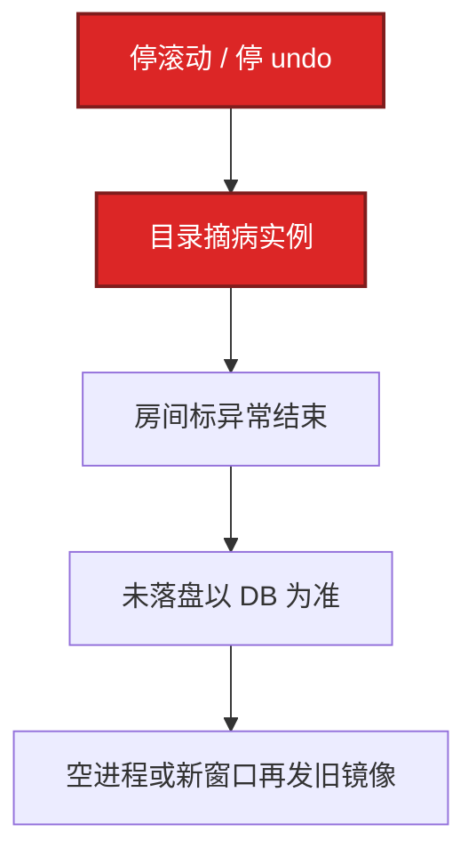

# 01｜游戏服务器架构 · 练习题

先对照 [知识点](知识点.md) **本章主线** 自己口述，再对答案。每题标了覆盖范围：

| 标记 | 含义 |
|------|------|
| **核心** | 不懂整章就没建立起来 |
| **必会** | 值班和面试都要能讲 |
| **常用** | 线上会反复碰到 |
| **常考** | 白板和追问的高频口径 |

## 本题目录

- [Q1 有状态 vs 无状态 / 战斗不能当 Web 滚](#q1)
- [Q2 分服 / 跨服 / 全服数据边界](#q2)
- [Q3 CCU、DAU、登录 QPS](#q3)
- [Q4 长连接粘滞 / 源 IP](#q4)
- [Q5 大厅 vs 战斗：扩容、探针、PDB、HPA](#q5)
- [Q6 Gate 活着但没回包](#q6)
- [Q7 有状态 OOM / 自动重启](#q7)
- [Q8 容量账 / 否决活动](#q8)
- [Q9 UDP / KCP](#q9)
- [Q10 全服 vs 区服变更](#q10)
- [Q11 发布四步与回滚](#q11)
- [合上书](#合上书)

---

## Q1

**★★★★★｜游戏逻辑服为什么不能像 Web 那样随便滚动发布？**

**覆盖**：核心 · 必会 · 常考
**对应**：知识点 §3.1

### 场景

版本夜有人把战斗服和大厅写成同一个 Deployment，`maxUnavailable: 25%`，说「K8s 滚动更安全」。公会战正在打。

### 完整解答

**一句话**：战斗服有状态，不能抄 Web 的百分比滚动，必须摘流→等空→flush→再发。

对局和 Session 在进程内存里，杀进程等于掉线或丢局。Web 请求可重试到任意节点；游戏连接粘在实例上。新 Pod 是空的，接不住正在打的局。



生产固定四步，缺一步不要发：

1. 目录或匹配摘流，不再往这台分配新人
2. 等房间清空，或到点强制结算（产品签字）
3. flush / snapshot，确认脏数据已落盘
4. 再发版本、再上线、再挂回流

大厅轻状态，Session 可落到 Redis，可以滚动。战斗是 Tick 驱动、房间绑定进程。K8s 上战斗服用手动摘流或 StatefulSet OnDelete，不要抄 Web 的 PDB 百分比。Deployment `Recreate` 会一次杀光，更糟。探针乱杀战斗进程会自己制造 P0。

`rollout undo` 不能当补救——二次结算比一次中断更脏。先停滚动，目录摘病实例，房间标异常结束。

### 再追问

- 大厅和战斗怎么拆？——分 Deployment、分发布策略、分 PDB。大厅按连接 / CPU 扩；战斗按空闲房间数预开空进程。liveness 对战斗要极保守，卡死走业务心跳和熔断，不要 10 秒杀一次。
- 有状态、轻状态、无状态差在哪？——无状态请求不粘进程；轻状态 Session 可进 Redis；有状态房间钉在内存，新副本接不住旧局。

---

## Q2

**★★★★★｜分服和跨服的数据边界怎么划？一个挂了影响范围是什么？**

**覆盖**：核心 · 必会 · 常考
**对应**：知识点 §3.2

### 场景

跨服公会战进行中，有人要停本服做合服预检。「跨服还在写，能停本服库吗？」

### 完整解答

**一句话**：分服是权威隔离，跨服只借快照、结算回写本服；全服组件挂了是全渠道。

分服：每个 `server_id` 一份角色和经济，故障隔离在该区。跨服：本服仍是权威，跨服只借快照开房间，结算回写本服。账号 / 支付 / 目录是全服，挂了是全渠道。



开新服是复制分服环境；合服是合并分服权威库。跨服不要和本服逻辑混池，路由键是 `match_id / war_id`，不是玩家当前 Gate。本服维护时必须先处理进行中的跨服回写，否则往已停写的库写，合服和回档都会脏。

| 挂谁 | 本服 | 跨服玩法 | 全渠道登录 / 储值 |
|------|------|----------|-------------------|
| 单区逻辑 | 该区停 | 该区进不了跨服 | 在 |
| 跨服集群 | 可玩 | 关 | 在 |
| 账号 / 支付 | 在线的人往往还能玩 | 看依赖 | **停** |

数据按「谁有权写」划，不要按进程跑在哪划。跨服快照是临时的，结算结果必须回写本服。

### 再追问

跨服进行中本服要停写，你怎么办？——提前关跨服入口，房间打完或到点强制结算，确认回写为 0 再停本服。窗口里还让跨服写，合服和回档都会脏。

---

## Q3

**★★★★★｜CCU、DAU、登录 QPS 各用来规划什么？单逻辑服的 2000 CCU 从哪来？**

**覆盖**：核心 · 必会 · 常用
**对应**：知识点 §3.5

### 场景

运营说「注册已经 100 万，机器按 100 万 CCU 备」。登录集群却按日常 CCU 配。开服前 3 分钟鉴权被打死，战斗服还是空的。

### 完整解答

**一句话**：CCU 规划连接，DAU 是运营指标，登录 QPS 规划账号和排队，写 QPS 看发奖结算。

CCU 规划 Gate / 逻辑的连接和内存；DAU 是运营指标，不是机器数；登录 QPS 规划账号和排队。写库 QPS 看发奖和结算，不跟 CCU 线性。

```
  注册 100 万  --×转化/在线率-->  峰值 CCU 可能只有几万
  登录尖峰：秒级（开服前 3 分钟）
  CCU 爬升：分钟级
  写库高峰：发奖 / 邮件 / 结算，不是「人在线」
```

算法：峰值 CCU / 单实例舒适 CCU × 余量。单实例舒适值来自压测（P95、CPU、Tick），不是厂商宣传。经验账：3 万 CCU、单 Logic 舒适 2000、余量 1.4 ≈ 21 台；Gate 单机 2～4 万连接，开服瞬间按 2× 留重连；登录按 10 分钟登录量 / 600 秒再乘 3。

禁止用注册量当 CCU。禁止只压 HTTP health。观测：`game_ccu{server_id}`，10 分钟腰斩当 P0 哨兵。

### 再追问

单逻辑服怎么定 2000 CCU 这条线？——压进服 + 战斗 + 结算，看 Tick、P95、内存斜率。到 CPU 60% 或 P95 破线就停，那就是舒适点。换玩法要重测，卡牌和实时不是一个数。

---

## Q4

**★★★★★｜长连接粘滞为什么不能按源 IP？加速器场景怎么绑？绑定表挂了呢？**

**覆盖**：核心 · 必会 · 常用
**对应**：知识点 §3.4

### 场景

开服日四层 LB 按源 IP 哈希。监控上只有一台 Gate 在冒烟，其余空转。玩家大量走加速器。

### 完整解答

**一句话**：粘滞跟 uid/session，不跟源 IP；加速器会把四层哈希打成单台 Gate。

加速器和 NAT 把海量玩家变成同一出口 IP，四层哈希会打满单台 Gate。粘滞用 uid 或 session token，在 Gate / 应用层做绑定表。

```
  错：LB 按 src IP --> 加速器出口 IP 成千上万玩家打进同一 Gate
  对：应用层 uid / session --> Gate 绑定表 --> 目标 inst
```

客户端到 Gate 是 TCP / WS。灰度、封禁同样不要只信源 IP。IP 风控对加速出口要单独阈值，否则误伤。传输层细节见 08。

### 再追问

绑定表挂了会怎样？——匹配成功但进错进程或进不去。先查 `room → inst` 路由和 Gate 绑定，不要先加机器。降级是拒绝新进、保留已有连接，重建绑定后再放。

---

## Q5

**★★★★★｜大厅和战斗的扩容、探针、PDB 有何不同？游戏服能上 HPA 吗？**

**覆盖**：必会 · 常用 · 常考
**对应**：知识点 §3.3

### 场景

有人给战斗服配了 CPU HPA 和 10 秒失败就杀的 liveness。活动 BOSS 房间打满，CPU 上不去（已经在 90%），HPA 不断加出来空 Pod。

### 完整解答

**一句话**：大厅可滚可扩，战斗扩空房间、探针极保守，HPA 追 CPU 救不了已开的局。

大厅可滚可扩，探针按常规。战斗扩的是空房间，进行中的局不迁；liveness 乱杀就是 P0；PDB 按「还能开新房」留容量。

```
  战斗 CPU 90%（房间已爆）
           |
           +-- HPA 加 Pod --> 新 Pod 是空的，旧房间仍爆
           |
           +-- liveness 杀进程 --> 集体判负，自己制造 P0
```

1. 战斗和大厅分 Deployment
2. 战斗发布只对空进程摘流；K8s 用手动摘流 / OnDelete
3. PDB `minAvailable` 保证匹配还能分到房间
4. 就绪探针失败不要把有局的进程摘出 Service，除非已强制结算
5. 内存升高先看房间堆积，不要自动重启

HPA：登录和大厅可以，按 QPS / 连接。战斗可以按「空闲房间数」扩出空进程，不要按 CPU 追已爆的房间。活动前预热水位，比现场 HPA 有用。

### 再追问

readiness 失败能不能把战斗进程摘出 Service？——有局在打就不要摘。摘了等于把还活着的长连接从入口拿掉，玩家掉线。先强制结算或等房间空，再摘。

---

## Q6

**★★★★☆｜Gate 活着、玩家「连着但点了没回包」，你怎么查？**

**覆盖**：必会 · 常用
**对应**：知识点 §6.1

### 场景

活动 BOSS 刷新。CCU 不掉，重连 QPS 也不升。客服说「点技能没反应」。有人要重启全部门 Gate。

### 完整解答

**一句话**：连接在只说明 Gate 没死，卡死沿下行查队列/Tick/DB，不是扩 Gate 能修的。

连接存在只说明 Gate 没死。这是下游阻塞，不是扩 Gate 能修的。容量顺序：fd → 内存 → Tick → 内核 → 下游。

```
  客户端 --> Gate（连接还在）--> 逻辑队列 / Tick --> Redis / DB
                 |                    |                  |
              fd 正常            单房间热点            慢查询 / 锁
```

沿下行查：Gate 到逻辑的队列、逻辑 Tick、CPU、慢查询、锁。单房间热点表现为部分人卡、CCU 不掉。止血：降级该玩法、限新进房间，不重启全部门 Gate。

| | 连接 | 重连 QPS | 操作成功率 |
|--|------|----------|------------|
| 掉线 | 断 | 升 | — |
| 卡死 | 在 | 不升 | 掉 |

### 再追问

和掉线怎么区分？——掉线是连接断、重连 QPS 升；卡死是连接在、重连不升、操作超时。指标要分开：连接数、重连 QPS、操作成功率。不要用一个「登录失败」总数糊弄。

---

## Q7

**★★★★☆｜有状态服 OOM 了，止血顺序是什么？K8s 自动重启帮了还是害了？**

**覆盖**：必会 · 常用
**对应**：知识点 §6.3

### 场景

某战斗实例 OOM。K8s `restartPolicy: Always` 已经把进程拉起来，房间结算日志出现重复发奖。

### 完整解答

**一句话**：战斗 OOM 先摘流，有局不要自动重启，以 DB 为准避免二次结算。

先看是单实例还是一片、是大厅还是战斗。目录立刻摘掉病服，防止匹配继续往里塞。

```
  OOM
   |
   +-- 大厅 --> 可拉起，从 Redis 重建 Session
   +-- 战斗 --> 先标房间异常结束，受控拉起，避免二次结算
   +-- 同时目录摘流
```

1. 战斗：避免自动拉起后重复结算；以 DB 为准，内存当丢失
2. 大厅：可以拉起并从 Redis 重建
3. 查房间数、单房间人数、泄漏还是配置
4. 复盘加房间上限和摘流，不是只加内存

K8s 自动重启：大厅帮。战斗若乱拉，可能二次结算或脏写。战斗要受控拉起，先标房间异常。kubelet / 节点失联时进程可能还在——先救节点，别重启还活着的游戏容器。

### 再追问

怎么快速判断堆积还是泄漏？——房间数 × 人均内存是否对得上；空房间是否内存不回。对得上是容量，对不上是泄漏或未释放。对得上就扩空进程 / 降级新进，不要重启有局的进程。

---

## Q8

**★★★★☆｜容量规划怎么向策划说「这个活动开不了」？加只读从库能不能抗发奖？**

**覆盖**：必会 · 常用 · 常考
**对应**：知识点 §3.5

### 场景

策划要全服实时发奖 + 全服实时榜，海报已经定了。你只有「再加两台」和「改节奏」两个选项能上台。

### 完整解答

**一句话**：容量分三峰给数字，只读从库救不了发奖写，运维要有否决权。

拿出三峰：登录、玩法 QPS、发奖写。指出硬顶：单服写、热 key、战斗房间。给可承载数字，要产品改发奖节奏或拆服。

```
  能扩：登录、目录、Gate 连接、大厅、空战斗进程
  硬顶：进行中的房间、单服单库写、全服排行一个 key
```

加只读从库救不了发奖——发奖是写和行锁。只能错峰、批量、降级邮件。没有数字的否决像抬杠；有「可承载发奖每秒」是容量负责。活动模型见 05。

### 再追问

你凭什么否决「全服实时榜」？——给出该 key 的预估 QPS 和单线程瓶颈，给替代：分片榜、定时刷新、只展示前 N。活动设计服从可承载，不服从海报文案。

---

## Q9

**★★★☆☆｜UDP / KCP 什么时候上，运维要保证什么？**

**覆盖**：常用 · 常考
**对应**：知识点 §3.4

### 场景

实时对战要降延迟。研发说切 UDP，安全组还是只放了 TCP。公网玩家全超时，内网 QA 正常。

### 完整解答

**一句话**：UDP/KCP 要放行 UDP 并盯丢包 RTT，会话仍钉在逻辑进程。

实时对战要低延迟、能接受丢包补偿时用。会话状态仍在逻辑进程，传输层换了不等于无状态。

运维保证：

1. 高防 / 安全组 / 云防火墙放行 UDP 端口
2. 统计丢包、RTT、PPS，不要只看 TCP 连接数
3. 不在机房改游戏协议

发现「UDP 被默丢」：内网通、公网全超时，抓包到边界没出站或没回。和业务 Tick 慢区分：Gate 根本收不到包。

### 再追问

切了 UDP，容量口径还用 CCU 吗？——用。CCU 是会话人数，不是 TCP fd 数。UDP 路径要另看 PPS 和丢包，但房间仍然钉在进程上，有状态纪律不变。

---

## Q10

**★★★☆☆｜全服组件和区服组件的变更纪律差在哪？**

**覆盖**：必会 · 常考
**对应**：知识点 §3.2

### 场景

有人拿单服热更的节奏改全局登录配置，灰度按一个 `server_id` 切，实际所有区都走同一账号服。

### 完整解答

**一句话**：全服组件一改全渠道，灰度更小、回滚更快，不能拿单服热更节奏。

区服变更爆炸在一区，可摘服。账号 / 支付 / 目录 / CDN 指针是全渠道，灰度更小、窗口更严、回滚更快。不要拿单服热更的随意度改全局登录。

```
  区服逻辑：摘该区目录即可止血
  全服账号：没有「只灰度 S1」这回事，一改全渠道
```

全服变更：更小灰度（内网 / 测试渠道）、更快回滚、和活动高峰错开。目录缓存失效策略要先演练，避免列表空或进错服。

### 再追问

目录挂了，已经在线的玩家呢？——已经打上的长连接通常还能玩。新登录、选服、进新服会失败。止血是目录降级出缓存列表（04），不要为了目录去重启战斗服。

---

## Q11

**★★★★☆｜有状态发布四步是什么？战斗发版失败怎么回滚？**

**覆盖**：必会 · 常用 · 常考
**对应**：知识点 §6.2

### 场景

战斗服镜像刚滚到一半，CCU 掉一截，判负工单刷屏。有人要 `kubectl rollout undo`。节点失联的那台，有人准备先把游戏容器重启「对齐」。

### 完整解答

**一句话**：有状态发布四步缺一步就赌未落盘，失败先停滚动摘病实例，不是 rollout undo。

四步：摘流 → 等空或强制结算 → flush → 再发。缺一步就是在赌未落盘。回滚不是 undo 再杀一轮。



节点失联：进程可能还在、长连接还活着。先救节点，别重启还活着的游戏容器。etcd / API 超时 = 不能变更，不是立刻踢玩家。

### 再追问

金丝雀能对战斗做吗？——只能对新开房间（匹配按版本分流），不能对已开房间切 5% 流量。进行中的局钉在旧进程上。

---

## 合上书

- [ ] 能画出从客户端到库：CDN / 登录 / 目录 / Gate / 大厅 / 战斗 / 跨服 / Redis 热 + MySQL 权威
- [ ] 能说出有状态 / 轻状态 / 无状态差在哪，为什么战斗不能抄 `maxUnavailable=25%`
- [ ] 能划清分服 / 跨服 / 全服的数据归属和爆炸半径
- [ ] 能把大厅和战斗的 Deployment / PDB / HPA / 探针拆开讲
- [ ] 能说明粘滞跟 uid 不跟源 IP；容量先 fd 再内存再 Tick 再下游
- [ ] 能把 CCU / 登录 QPS / 写 QPS 拆开规划，并讲有状态发布四步和失败回滚
- [ ] 能用掉线 vs 卡死 + 分流图处理「进不去」，而不是重启战斗服
