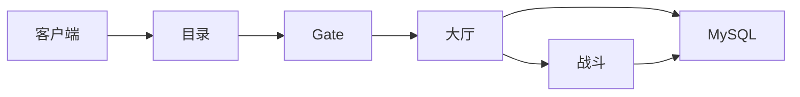

# 01｜游戏服务器架构 · 练习题

开始做题前，先给大家一个小建议：合上知识点，对着**第一节的主图**，把「玩家进游戏的一生」从点图标到打完一局口述一遍。能顺下来，下面这些题你会发现大半都会了；卡壳的地方，就是你该回去重读的那一节。

做题的方式也建议改一下：每道题**先看标题和场景，自己口述一遍答案，再往下看「完整解答」对答案**。直接看解答，容易产生「我会了」的错觉——能讲出来才是真的会。

| 标记 | 含义 |
|------|------|
| **核心** | 不懂整章就没建立起来 |
| **必会** | 值班和面试都要能讲 |
| **常用** | 线上会反复碰到 |
| **常考** | 白板和追问的高频口径 |

题目的顺序也是有意排的：Q1～Q5 先钉分层与 Gate/大厅；Q6～Q10 讲战斗、账本与协议；Q11～Q14 收尾到部署与定责。

## 本题目录

- [Q1 游戏 vs Web 架构](#q1)
- [Q2 有状态战斗发布](#q2)
- [Q3 Gate 与 CCU](#q3)
- [Q4 大厅 vs 战斗扩容](#q4)
- [Q5 MySQL 权威 Redis 热状态](#q5)
- [Q6 分服跨服故障域](#q6)
- [Q7 全服进不去第一刀](#q7)
- [Q8 能进大厅进不了房间](#q8)
- [Q9 协议心跳与 TCP](#q9)
- [Q10 K8s 分层部署](#q10)
- [Q11 发布后全员判负](#q11)
- [Q12 热 key 与活动](#q12)
- [Q13 60 秒进不去定责](#q13)
- [Q14 架构白板综合题](#q14)
- [合上书](#合上书)

---

## Q1

**★★★★★｜游戏服务器架构和 Web 最大区别是什么？**

**覆盖**：核心 · 必会 · 常考 ｜ **对应**：知识点 [一、一张图：玩家进游戏的一生](知识点.md)

### 场景

新人把战斗和 Gate 写进同一个 Deployment，说「和微服务一样滚动发布」。

先自己试试：不看下面，先口述一遍你的答案，再往下对。

### 完整解答

> 🎯 **一句话**：**长连接 + 有状态战斗进程**——Web 无状态可百分比滚；room 钉内存，滚更 = 对局死亡。

Web：请求完即走，任意 Pod 可接。游戏：连接钉 Gate，对局钉战斗进程。

> 📝 **面试**：两句——长连接；有状态 room 不能抄 `maxUnavailable: 25%`。

### 再追问

**Login 算有状态吗？**——HTTP 相对无状态；**战斗** 是核心有状态。**不要** 因此把 Login 和 Battle 绑一起发布。

---

## Q2

这是主图的出门与问路段。


**★★★★★｜战斗服怎么做发布？**

**覆盖**：核心 · 必会 · 常考 ｜ **对应**：知识点 [六、战斗：有状态房间与进程钉死](知识点.md)

### 场景

公会战期间 `kubectl rollout restart deploy/battle-prod`。

先自己试试：不看下面，先口述一遍你的答案，再往下对。

### 完整解答

> 🎯 **一句话**：**摘流四步**——停匹配 → 停新 room → 等存量打完 → 再滚。

```bash
kubectl rollout history deploy/battle-prod | tail -3
kubectl get events | grep Killing | tail -5
```

> ⚠️ **别混**：`rollout undo` 不能救已中断对局——可能二次结算。

> 📝 **面试**：背四步；跳过任一步 = 判负/掉线。

### 再追问

**PDB minAvailable 100%？**——战斗中 often 是；配合 **手动摘流** 而非盲目 HPA 杀 Pod。

---

## Q3

进门：Gate 长连接入口。


**★★★★☆｜CCU 和 Gate 连接数一样吗？**

**覆盖**：必会 · 常考 ｜ **对应**：知识点 [四、进门：Gate 长连接入口](知识点.md)

### 场景

`ss` 显示 52 万 ESTAB，Grafana CCU 48 万。有人要以 `ss` 为准扩容。

先自己试试：不看下面，先口述一遍你的答案，再往下对。

### 完整解答

> 🎯 **一句话**：**CCU 以业务监控为准**（扣 bot/未进大厅规则）；`ss` 验证 **fd 压力**。

差值大查：未进大厅连接、机器人、session 泄漏。

```bash
ss -ant state established '( sport = :4103 )' | wc -l
curl -sS 'http://prom:9090/api/v1/query?query=sum(ccu)' | jq .
```

### 再追问

**CCU 高就扩战斗？**——先看是连接满、匹配堆还是 room 满——**三层分开**。

---

## Q4

Gate 的连接与 Session。


**★★★★★｜大厅和战斗为什么要分开扩容？**

**覆盖**：核心 · 必会 ｜ **对应**：知识点 [五、大厅：社交、匹配与无状态边界](知识点.md)

### 场景

匹配转圈，有人 HPA 大厅从 10 到 40，战斗不变。

先自己试试：不看下面，先口述一遍你的答案，再往下对。

### 完整解答

> 🎯 **一句话**：大厅无状态扩 **吞吐**；战斗扩 **空 room**——「能进大厅进不了房间」查 **匹配/战斗空进程**。

```bash
curl -sS 'http://prom:9090/api/v1/query?query=match_queue_depth' | jq .
curl -sS 'http://prom:9090/api/v1/query?query=battle_empty_rooms' | jq .
# queue 1842 · empty 0
```

> 📝 **面试**：扩大厅不创造空 room。

### 再追问

**战斗 HPA 指标？**——`empty_rooms` 优于 CPU alone。

---

## Q5

大厅与无状态边界。


**★★★★★｜道具纠纷先查 MySQL 还是 Redis？**

**覆盖**：核心 · 必会 · 常考 ｜ **对应**：知识点 [七、账本：Redis 热状态与 MySQL 权威](知识点.md)

### 场景

玩家说道具没了，开发 `flush Redis` 后仍对不上。

先自己试试：不看下面，先口述一遍你的答案，再往下对。

### 完整解答

> 🎯 **一句话**：**MySQL 权威**——订单/背包以库为准；Redis miss 不是没发货。

```bash
mysql -e "SELECT id,status,item_id FROM player_order WHERE role_id=12345 ORDER BY id DESC LIMIT 5;"
redis-cli GET "bag:12345"
# (nil)   ← cache miss · 查库回填
```

> ⚠️ **别混**：**不要** 生产 flush Redis 当排障第一步。

### 再追问

**读写分离救活动写？**——不救；写打主库——链 [03](../03-活动高峰与压测/)。

---

## Q6

就是开头那个公会战现场——战斗钉进程。


**★★★★☆｜单服挂了和全服挂了怎么处理不同？**

**覆盖**：必会 ｜ **对应**：知识点 [八、分服、跨服与故障域](知识点.md)

### 场景

A 服 DB 慢，有人要「重启全集群 Gate」。

先自己试试：不看下面，先口述一遍你的答案，再往下对。

### 完整解答

> 🎯 **一句话**：**三层故障域**——全局（目录/账号）、分服、跨服；A 服问题 **不要** 一刀切全集群。

```text
全局挂 → 全渠道进不去
分服 A 挂 → 只 A 服玩家
跨服挂 → 只跨服玩法
```

> 📝 **面试**：玩家说「全服」often 是全局层。

### 再追问

**跨服和分服？**——分服数据隔离；跨服玩法池临时聚合——都不替代存储边界。

---

## Q7

战斗发布与摘流。


**★★★★★｜全服进不去你先查什么？**

**覆盖**：核心 · 必会 · 常考 ｜ **对应**：知识点 [十二、作战：玩家进不去 / 打着掉线定责](知识点.md)

### 场景

全渠道选服空白。战斗 Pod 正常。

先自己试试：不看下面，先口述一遍你的答案，再往下对。

### 完整解答

> 🎯 **一句话**：**版本 → 目录 → 账号/排队 → Gate**——**不要** 先重启战斗。

```bash
curl -sS -o /dev/null -w '%{http_code}\n' https://cdn.example.com/version.json
curl -sS 'https://dir.example.com/api/server_list' | jq '.code, (.servers|length)'
```

登录六跳详见 [02](../02-登录排队与选服/)。

### 再追问

**目录 500？**——降级 stale 列表，**不可** empty——02/01 铁律。

---

## Q8

账本：Redis vs MySQL。


**★★★★☆｜能进大厅，匹配一直转圈？**

**覆盖**：必会 · 常用 ｜ **对应**：知识点 [五、大厅：社交、匹配与无状态边界](知识点.md)

### 场景

Gate 正常，大厅 UI 正常，匹配 3 分钟无响应。

先自己试试：不看下面，先口述一遍你的答案，再往下对。

### 完整解答

> 🎯 **一句话**：查 **match_queue_depth、battle_empty_rooms、battle Pod Ready**——不是 Gate。

```bash
kubectl get pods -l app=battle --no-headers | awk '{print $3}' | sort | uniq -c
# 若 Ready 但 empty=0 → 进程 warmup 或未注册 room
```

### 再追问

**刚 HPA 的新 Pod？**——空 room=0 救不了 **已排队** 的瞬时——要 **活动前预开**（[03](../03-活动高峰与压测/)）。

---

## Q9

分服与故障域。


**★★★☆☆｜ESTABLISHED 很多但玩家说掉线？**

**覆盖**：常用 · 常考 ｜ **对应**：知识点 [九、协议层：长连接上的消息与心跳](知识点.md)

### 场景

`ss` 50 万连接，CCU 30 万，投诉「假死」。

先自己试试：不看下面，先口述一遍你的答案，再往下对。

### 完整解答

> 🎯 **一句话**：查 **应用 session 与心跳**——TCP 活 ≠ 业务在线。

```bash
curl -sS 'http://prom:9090/api/v1/query?query=sum(session_active)' | jq .
grep 'heartbeat timeout' /var/log/gate/gate.log | tail -3
```

> ⚠️ **别混**：TCP keepalive（内核）≠ 应用心跳（30～90s）——见 [13-TCP与UDP](../../01-基础底座/13-TCP与UDP/)。

### 再追问

**弱网？**——链 12/13 长连接章；**不要** 只重启 Gate。

---

## Q10

协议与心跳。


**★★★★☆｜K8s 上 Gate 和战斗怎么部署？**

**覆盖**：必会 ｜ **对应**：知识点 [十、K8s 部署：分层、探针与发布边界](知识点.md)

### 场景

battle 的 liveness 10s 失败就重启，线上偶发判负。

先自己试试：不看下面，先口述一遍你的答案，再往下对。

### 完整解答

> 🎯 **一句话**：**分 Deployment**；战斗 **liveness 极宽**，卡死走业务心跳；HPA 看 empty_room。

```text
gate-deploy   · 可摘流滚动
battle-deploy · OnDelete/手动摘流 · PDB 保守
```

链 [03-04 Pod生命周期](../../03-Kubernetes/04-Pod生命周期/) SIGTERM。

### 再追问

**StatefulSet 能救 room？**——不自动迁移 room；解决 **标识和盘**，不是业务状态机。

---

## Q11

K8s 分层部署。


**★★★★★｜发布后公会战全员判负，你怎么证明是发布？**

**覆盖**：核心 · 必会 ｜ **对应**：知识点 [六、战斗：有状态房间与进程钉死](知识点.md)

### 场景

20:15 大量「判负」工单，20:10 有 battle rollout。

先自己试试：不看下面，先口述一遍你的答案，再往下对。

### 完整解答

> 🎯 **一句话**：**时间线对齐 rollout + Pod Killing + room fighting 中被杀**。

```bash
kubectl rollout history deploy/battle-prod
kubectl exec battle-xxx -- curl -s localhost:8080/debug/rooms | head
# state:fighting 时被杀
```

> 📝 **面试**：fighting 段杀 Pod = 事故，不是「K8s 更安全」。

### 再追问

**再 roll 一次修复？**——**不要**——二次伤害；先停滚动、摘流。

---

## Q12

就是抄 Web YAML 的坑。


**★★★☆☆｜活动排行 Redis 单 key QPS 顶穿？**

**覆盖**：常用 ｜ **对应**：知识点 [七、账本：Redis 热状态与 MySQL 权威](知识点.md)

### 场景

`rank:activity:total` INCR 飙红，活动 API 超时。

先自己试试：不看下面，先口述一遍你的答案，再往下对。

### 完整解答

> 🎯 **一句话**：**热 key 拆桶 + 本地聚合**——单 key 顶穿集群单分片。

活动专项见 [03](../03-活动高峰与压测/) 世界 BOSS 节。

### 再追问

**加 Redis 节点？**——热 key 仍落单 slot；要 **改 key 设计**。

---

## Q13

观测：CCU 与黄金信号。


**★★★★★｜60 秒：进不去 vs 打着掉，你怎么分？**

**覆盖**：核心 · 必会 · 🔧 ｜ **对应**：知识点 [十二、作战：玩家进不去 / 打着掉线定责](知识点.md)

### 场景

告警同时：login_fail、battle pod terminating。

先自己试试：不看下面，先口述一遍你的答案，再往下对。

### 完整解答

> 🎯 **一句话**：**进不去走主图左支（版本/目录/Gate）；打着掉查发布/Pod Kill**。

```text
0–10s  问清症状 · incident 时间线
10–30s version.json · server_list · CCU/Gate
30–45s rollout history · battle events
45–60s 定责层 · 同步勿误滚战斗
```

### 再追问

**两个同时真发生？**——可能 Gate 滚导致登录+掉线；**分别** 对 queue 与 rollout 时间戳。

---

## Q14

把前面串成定责树。


**★★★★★｜白板：从点图标到进战斗，经过哪些层？各层扩容边界？**

**覆盖**：核心 · 常考 ｜ **对应**：知识点 [一、一张图：玩家进游戏的一生](知识点.md)

### 场景

终面系统设计题。

先自己试试：不看下面，先口述一遍你的答案，再往下对。

### 完整解答

> 🎯 **一句话**：**客户端/CDN → 目录 → Gate → 大厅 → 战斗 → Redis/MySQL**；无状态扩副本，战斗只扩 **空 room**，Gate 扩 **连接**。



> 📝 **面试**：每层一句扩容边界 + 有状态发布四步。

### 再追问

**容量数字哪来？**——链 [04](../04-全链路压测与容量模型/) 压测 ×0.7。

---

## 合上书

和知识点末尾那份清单逐条对齐——那边勾完、这边再口述一遍，两边都能讲顺，这章才算过关：

- [ ] **默画**主图：客户端→目录→Gate→大厅/战斗→Redis/MySQL。
- [ ] 口述 **CCU、Gate 连接、登录 QPS** 不能混用一个扩容策略。
- [ ] **有状态战斗** 为何不能 Web 式滚动；**摘流四步**。
- [ ] **MySQL 权威、Redis 热状态**——道具纠纷先查谁。
- [ ] 分服/跨服/全局 **影响面与第一刀**。
- [ ] 「能进大厅进不了房间」定责路径。
- [ ] 「全服进不去」**不要**先重启战斗。
- [ ] **Gate 前台、战斗棋局** 比喻对应 HPA。
- [ ] **目录不可 500、爆满只拦新号**。
- [ ] **K8s 三层 Deployment** 与战斗 liveness 保守。
- [ ] **TCP ESTABLISHED 多 CCU 低** 两种原因。
- [ ] 架构题链 **02 登录六跳、03 三峰、04 容量**。
