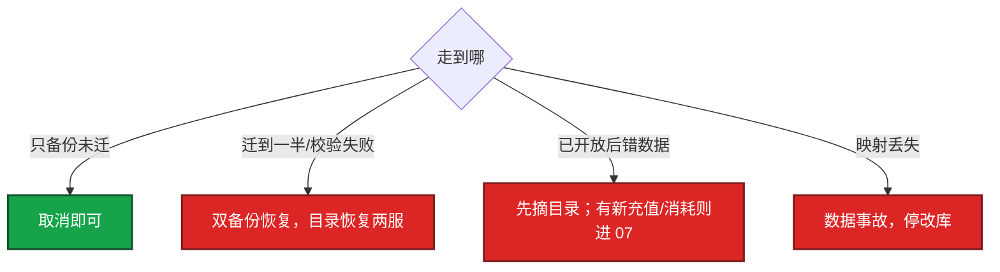

# 02｜开服与合服 · 练习题

先对照 [知识点](知识点.md) **本章主线** 自己口述，再对答案。每题标了覆盖范围：

| 标记 | 含义 |
|------|------|
| **核心** | 不懂整章就没建立起来 |
| **必会** | 值班和面试都要能讲 |
| **常用** | 线上会反复碰到 |
| **常考** | 白板和追问的高频口径 |

## 本题目录

- [Q1 开服五段门禁](#q1)
- [Q2 已写目录后回滚 / server_id 回收](#q2)
- [Q3 合服冲突与映射表](#q3)
- [Q4 禁止反向再迁](#q4)
- [Q5 合服窗口与超时](#q5)
- [Q6 周边系统](#q6)
- [Q7 停写 vs 在线双写](#q7)
- [Q8 开服幂等](#q8)
- [Q9 合服后排行 / 唯一道具](#q9)
- [Q10 一天开 20 服](#q10)
- [Q11 校验与备份门禁](#q11)
- [合上书](#合上书)

---

## Q1

**★★★★★｜把开服流水线按门禁讲一遍，哪一步对玩家可见？**

**覆盖**：核心 · 必会 · 常考
**对应**：知识点 §3.1

### 场景

开服脚本 apply 完就往目录写了新服。冒烟还没跑。玩家点进去创角失败，客服以为是登录挂了。

### 完整解答

**一句话**：开服五段只有写目录对玩家可见，前面失败一律阻断标 dirty。

预检 → 建库导表 → 部署 → 冒烟 → **最后写目录 / 服列表**。只有最后一步对玩家可见。前面失败阻断，环境标 dirty，不开放。


① 版本钉死、`server_id` 未占用、中心服健康。② 带 `server_id` 的独立库、静态表、Redis 开关默认关。③ Gate / 大厅 / 逻辑，尚未挂公网。④ 登录→创角→战斗→邮件，不是 health。⑤ 写目录、开创角——总闸。

目录是总闸：没写进去可以拆环境；写进去再发现空库就是开服事故。并行开服用 `server_id` 和 IP 段加锁。单服通常 8～15 分钟。

### 再追问

冒烟失败你还开放吗？——不。跳过冒烟是人为事故。修或重建后再跑通。用生产玩家当冒烟同样禁止。

---

## Q2

**★★★★★｜开服已经写进服列表后失败，怎么回滚？为什么回收 `server_id` 要写手册？**

**覆盖**：核心 · 必会 · 常考
**对应**：知识点 §6.2

### 场景

新服已在推荐位。发现静态表导的是上周版本，掉落全错。有人 SSH 去目录里把该服删了，准备用同一 ID 今晚再开一次。

### 完整解答

**一句话**：已开放失败先摘目录，server_id 回收必须写手册，不能同 ID 立刻再开。

先从目录摘掉或标维护，切断新进。能修则修；不能修则关服公告，冻结创角，按手册回收 `server_id`。

```
  未开放失败 --> 拆 Deployment / 脏 Schema，留日志
  已开放失败 --> 先摘目录
                 玩家可能已创角，作废要处理这些号
                 不是静默删库，不是同 ID 立刻再开
```

回滚指令和开放指令一样走变更，不要 SSH 手动改目录。

### 再追问

为什么回收 `server_id` 要写手册？——一周后有人用同一 ID 开新服，旧库 / 旧备份 / 旧数仓会对上，造成串服和错回档。回收规则（冷却期、备份归档、数仓打废服标）必须写死。

---

## Q3

**★★★★★｜合服数据冲突你怎么处理？映射表为什么要永久留？**

**覆盖**：核心 · 必会 · 常考
**对应**：知识点 §3.2

### 场景

两边角色主键都是区内自增。有人准备 `mysqldump` 进目标库。公会重名、排行准备直接 append。

### 完整解答

**一句话**：合服靠映射表改主外键，排行重算不拼接，映射表永久留盘。

主键按 `old(server_id,id) → new_id` 映射，外键全跟着改。重名加后缀 + 改名卡。排行重算，不拼接。唯一道具走约束，冲突工单。权威在 DB，Redis 作废重建。

```
  S1 uid=1001  --映射-->  new_id=91001
  S2 uid=1001  --映射-->  new_id=92001
         |
         +-- 背包 / 公会成员 / 好友 / 邮件 外键全部改
         +-- 映射表落盘、进备份、永久留
```

冲突表要能口述：角色名加后缀；公会同名加后缀、成员按映射重写；好友跨已删服丢弃并记日志；经济原样迁移，禁止现场「调平衡」。

校验三道：计数（角色 / 充值单 / 道具种类）、储值金额、高 V / 会长 / 未领邮件抽样。邮件、拍卖、公会成员漏一张表就是事故。

映射表留给客诉、封禁、回档、GM 查旧身份。丢了视为数据事故，停改库。`/tmp` 不算留存。

### 再追问

好友指向已删除服的 ID 怎么办？——丢弃并记日志，不要留悬挂指针。玩家侧表现为好友消失，比点进去报错好。

---

## Q4

**★★★★★｜合服失败为什么禁止「反向再迁一次」？**

**覆盖**：核心 · 必会 · 常用 · 常考
**对应**：知识点 §7

### 场景

迁移跑到公会表超时。有人说把目标库里已写入的行 delete 掉，再从源库重来。映射表还在一台跳板机的 `/tmp`。

### 完整解答

**一句话**：合服失败禁止反向再迁，回滚是双备份恢复两服，映射丢失停改库。

半成品删除会漏表、漏 Redis、漏跨服。回滚是丢掉目标上的合服结果，用合服前两份备份分别拉起两服，目录恢复。



禁止回滚后再对目标库继续修、两边同时写。`/tmp` 里的映射表不算留存。

### 再追问

目标库已经有新玩家登录写了，还能回两服吗？——先停写。新写入无法无损拆回两服。评估后要么修映射，要么回档并处理窗口内订单。所以开放前的校验不能省。

---

## Q5

**★★★★★｜合服窗口怎么定？到点没做完怎么办？运营说再给 20 分钟呢？**

**覆盖**：必会 · 常用 · 常考
**对应**：知识点 §3.4

### 场景

合服排在周日版本夜后面「顺便做」。演练没跑完。到点校验还没过，运营在群里说再给 20 分钟。

### 完整解答

**一句话**：合服窗口低峰+演练×1.5，到点未校验通过就回滚改期，现场加时必脏。

当地低峰（国内常见 02:00–06:00），公告 ≥ 48h，时长按演练 × 1.5。到点未校验通过就回滚改期，不现场加时。合服不和版本夜、跨服结算叠。

1. 提前关跨服入口，确认回写为 0
2. 变更负责人、数据负责人、运营公告分人
3. 回滚双签
4. 没演练过的合服不排生产
5. 开服可以白天；合服不行

超时策略写进变更单。加时是客诉和脏数据的常见来源。拒绝合服的条件：版本不一致、备份未验证、窗口不够、映射脚本未 dry-run。两边二进制 / 配置 / 协议必须一致，口头「都是最新」不算。

### 再追问

运营说再给 20 分钟？——拒绝。预案写死超时回滚，会前对齐。现场加时没有新的校验通过标准，只会把半成品暴露给玩家。

---

## Q6

**★★★★★｜合服和周边系统你漏过什么会出事？源服进程还要不要起来？**

**覆盖**：必会 · 常用
**对应**：知识点 §6.4

### 场景

库迁完了，目录还指着源服。支付发货仍按旧 `role_id` 打。客服用旧 `server_id + role_id` 查不到号。报表当天留存腰斩。

### 完整解答

**一句话**：库合并成功≠合服完成，目录/跨服/支付/GM/数仓漏一项就找不到号。

目录旧服下架 / 跳转、跨服战区重配、GM / 客服旧 ID 查询、数仓打合服标、支付发货窗口改投新 ID。漏一项就是找不到号或发错货。

```
  库合并成功 ≠ 合服完成
           |
           +-- 目录：源服下架或跳到目标服
           +-- 跨服：战区 / 房间按新 server_id 集合重配
           +-- 支付：窗口停写或缓冲，结束后按映射发
           +-- GM：旧身份经映射能查到
           +-- 数仓：合服日打标，防假断崖
```

客户端通常不用强更，但推荐服和已合并标记要改。

### 再追问

源服进程还要不要起来？——不要起写路径。最多只读查数据，防误写。目录不能再指向源服写入口。

---

## Q7

**★★★★☆｜为什么合服主流是停写合并，不是在线双写？**

**覆盖**：必会 · 常考
**对应**：知识点 §3.3

### 场景

有人说互联网都是灰度双写，游戏合服停写太土，要做在线合服「玩家无感」。

### 完整解答

**一句话**：游戏合服主流停写合并，在线双写对账成本大于短维护窗口。

游戏有状态 + 强一致经济，双写窗口更难证明两边一致，房间和背包锁跨服。停写窗口短、可校验、可回滚到备份。

```
  无状态订单：双写对账可行
  角色+公会+拍卖+跨服回写：对账成本 > 数小时维护
```

除非有成熟的全局 ID 和双写中间件，不要吹在线合服。停写会亏流水：选低峰、控制窗口、提前公告。用短窗口换数据正确；窗口失控才是真亏。

### 再追问

停写会亏流水怎么办？——选低峰、按演练 × 1.5 卡死窗口、提前 48h 公告。用资损换数据正确。现场加时把半成品放开，才是真亏。

---

## Q8

**★★★★☆｜开服脚本跑到一半机器重启，你怎么保证幂等？**

**覆盖**：必会 · 常用
**对应**：知识点 §3.1

### 场景

并行开 20 服，其中一台跳板机重启。脚本「再跑一遍」，部分库被 insert 了两次静态表。

### 完整解答

**一句话**：开服每段可重入，目录写入独立有锁，半成品标 dirty 宁可重建。

每段可重入：预检看状态机，建库前检查 Schema 是否完整，部署 apply 幂等，开放步骤独立且有锁。半成品标 dirty，宁可重建不续写未知状态。

```
  开服任务表：步骤、版本、操作者、日志
  server_id 分配落库，不是内存自增
  目录写入单独事务
  checkpoint：预检 | 建库 | 部署 | 冒烟 | 开放
```

不要无状态地「再跑一遍 insert」。冒烟失败重跑应从部署或建库的明确 checkpoint 开始。一天开 20 服先卡镜像、IP / 配额、建库速率、目录写、并行锁，要预热、分批，不是 20 路齐发。

### 再追问

状态机存在哪？——开服任务表。答「脚本 for 循环」减分。目录写入必须是可单独回滚的一步。

---

## Q9

**★★★☆☆｜合服后排行榜怎么处理？全服唯一道具呢？**

**覆盖**：常用 · 常考
**对应**：知识点 §3.2

### 场景

两边战力榜直接 UNION。合服后第一名战力翻倍，活动排名奖重发。

### 完整解答

**一句话**：排行榜按合并后重算不 append，唯一道具走约束冲突工单。

不拼接两份榜。按合并后角色重算。活动期榜要产品定规则：作废、按比例、或提前结束活动再合。

分数 append 会把两套经济叠在一张榜上，发奖必炸。合服窗口尽量避开活动结算；避不开就先结束活动再迁。

### 再追问

全服唯一道具两边都有怎么办？——按全局唯一约束迁移，冲突走工单，不要复制一份神器给两个人。

---

## Q10

**★★★☆☆｜一天开 20 服，基础设施先卡什么？**

**覆盖**：常用
**对应**：知识点 §4

### 场景

买量日要开 20 个新服。逻辑进程 CPU 很低，但一半服卡在 ContainerCreating 或建库超时。目录开始 5xx。

### 完整解答

**一句话**：一天开 20 服先卡镜像/配额/建库/目录锁，要预热分批不是齐发。

镜像拉取、IP / 配额、DB 实例建库速率、目录写、并行锁。不是逻辑进程 CPU。

```
  20 路齐发
      |
      +-- 镜像预热没做 --> 同时拉打满带宽
      +-- 同一 DB 实例建 20 个库 --> 元数据/磁盘打满
      +-- 目录无缓存、无锁 --> 写打穿
      +-- server_id / IP 段无锁 --> 冲突
```

要预热镜像和连接，分批而不是 20 路齐发。目录写入也要限速。开服流水线每段失败阻断，不要为了赶量跳过冒烟。

### 再追问

目录被开服写入打穿，已经在线的老服怎么办？——目录降级出最后一份成功列表（04）。宁可短暂看不到新服，也不要老服列表 500。开服写入不该和玩家选服共用一条无保护的写路径。

---

## Q11

**★★★★☆｜合服 T-0 门禁看什么？备份怎样才算有？**

**覆盖**：必会 · 常用
**对应**：知识点 §6.1

### 场景

「备份文件在」。从没 restore 过。写 QPS 还没降到 0，有人已经开迁。映射 dry-run 用的是昨天的库，正式跑用今晚的。

### 完整解答

**一句话**：写 QPS=0 才能迁，备份必须 restore 验证，dry-run 和正式同位点。

写 QPS=0 才能迁。备份不是文件在：restore 到旁路实例，角色数、充值总额、抽样高 V 三道和合服前快照对账。映射 dry-run 和正式跑必须同一份备份位点。

```bash
mysqladmin processlist | grep -c Query
# 旁路 restore + 校验 SQL
```

没有演练 = 没有备份。没演练过的合服不排生产。

### 再追问

跨服回写还在飞，能停本服吗？——不能。先冻跨服入口和回写，确认写 QPS=0，再动本服。窗口里还让跨服写，合服和回档都会脏（01）。

---

## 合上书

- [ ] 能把开服讲成五段，且只有写目录对玩家可见
- [ ] 能区分未开放拆脏环境 vs 已开放先摘目录，并说明 `server_id` 回收
- [ ] 能口述冲突表和映射表永久留、三道校验
- [ ] 能说明回滚 = 两份备份，禁止反向再迁
- [ ] 能定窗口、拒加时，合服不和版本夜叠
- [ ] 能列出目录 / 跨服 / 支付 / 数仓 / 映射查询，源服不起写路径
- [ ] 能说明停写原因、开服幂等、一天 20 服先卡什么
