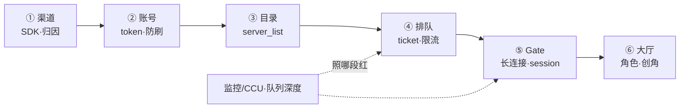
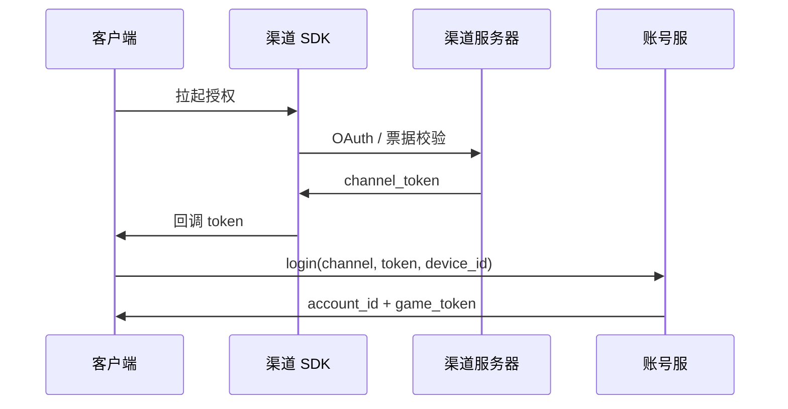
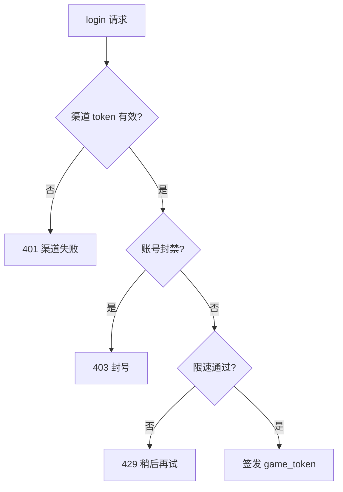
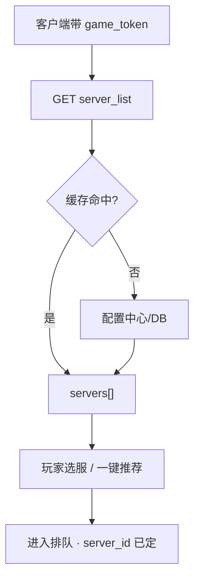
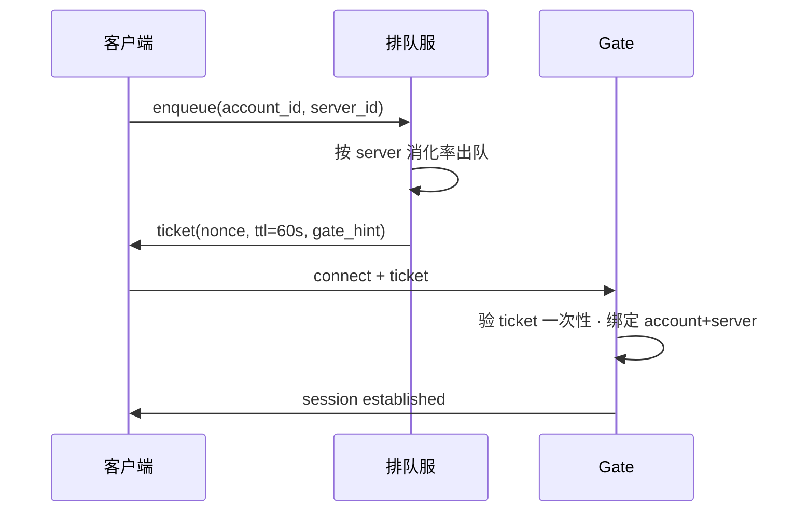
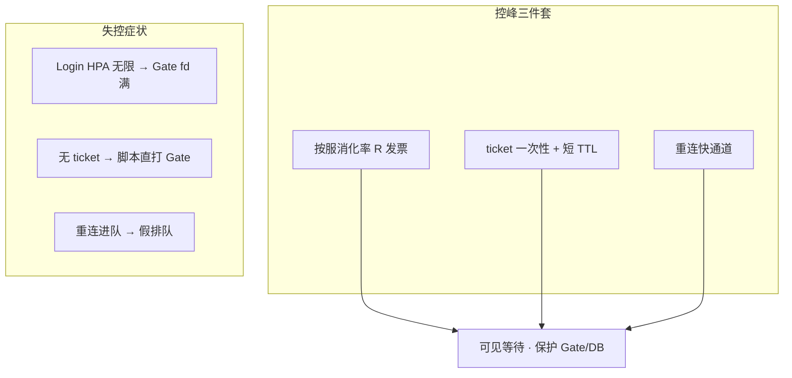
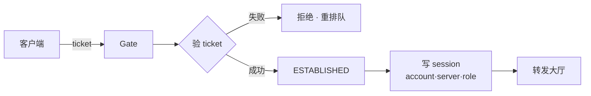
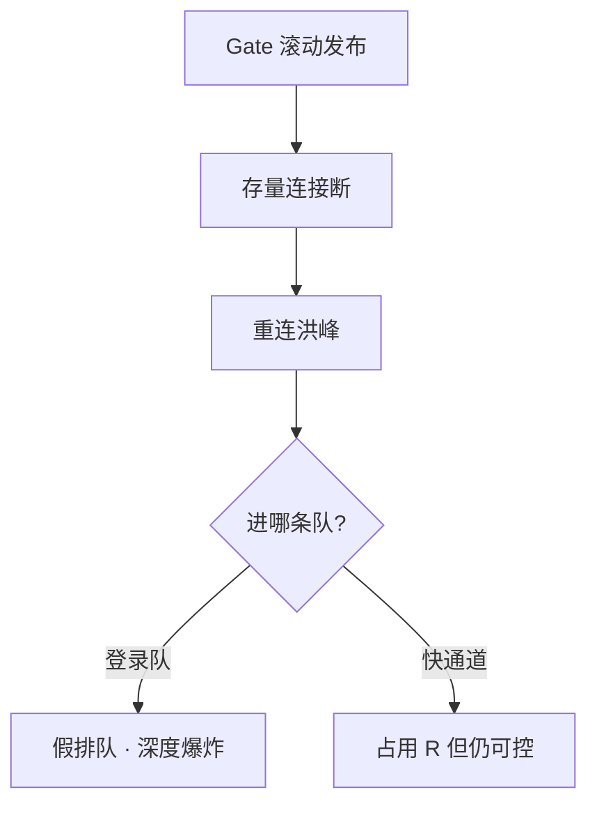
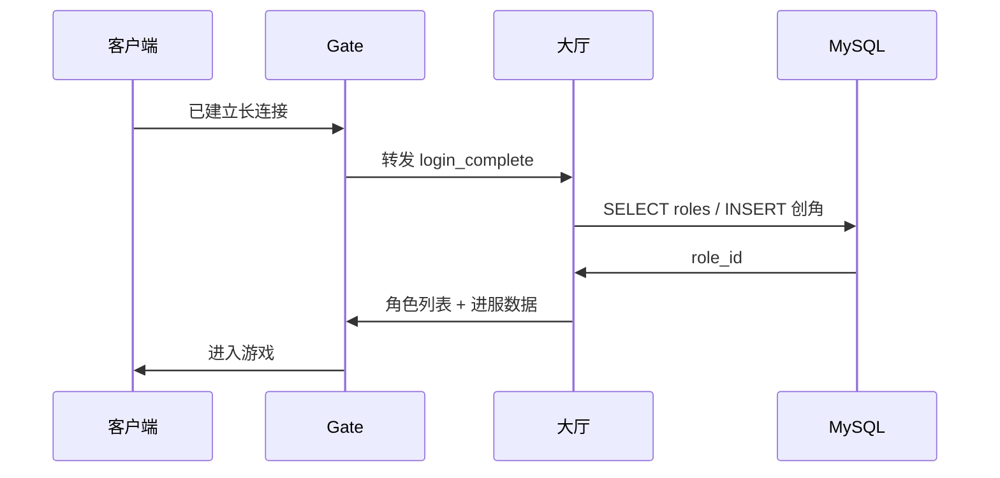
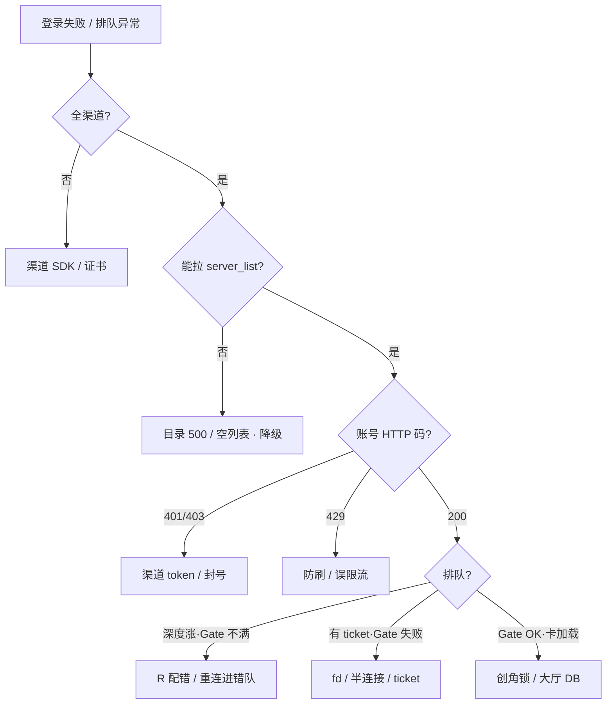

# 登录、排队与选服

> 开服第三分钟，工单全是「登录失败」——有人把 Login Deployment 从 10 扩到 80，排队器按「登录集群空闲」狂发票，Gate 的 fd 先打满，创角又把单服 MySQL 行锁打穿。客户端只显示一行红字，你要能拆成六跳定责。
> **本章回答**：一次登录从点图标到进大厅会经过哪六跳、每跳什么会坏、排队按什么速率发票、重连为什么不能和普通登录排同一队。
> **不讲**：Gate/战斗拓扑与有状态发布 → [01](../01-游戏服务器架构/)；活动整点登录峰 → [03](../03-活动高峰与压测/)；全链路压测建模 → [04](../04-全链路压测与容量模型/)；开服写目录 → [06](../06-开服合服/)；TCP 队列与 `ss` → [12](../../01-基础底座/12-网络栈与Socket/)、[13](../../01-基础底座/13-TCP与UDP/)。

**标记**：🎯重点 · 🔥难点 · ⭐常考 · 🔧实操

---

## 一、一张图：一次登录的旅程

> 🎯 **一句话**：登录不是「连上一个服」，而是 **渠道 → 账号 → 目录 → 排队 → Gate → 大厅** 六跳流水线——客户端只报「登录失败」，你要能指出红在哪一跳。



- 📖 **读图**
  - 🛤️ 从左到右是时间线：先证明「你是谁」（渠道+账号），再「去哪服」（目录），再「能不能现在进」（排队），再「钉长连接」（Gate），最后「角色落地」（大厅）
  - 🔦 Grafana 上 `login_qps` / `queue_depth` / `gate_estab` 分别照 ②～⑤；大厅创角慢照 ⑥ + MySQL——**禁止**未分跳就重启战斗

六跳主图装进脑子了。从「渠道」开始——点图标与 SDK 授权。

本节对应练习题 Q1。

---

## 二、渠道：点图标与 SDK 授权

> 🎯 **一句话**：**渠道（channel）** 决定走哪套 SDK、哪条支付/合规链路——渠道回调失败时，全渠道表现为「点登录没反应」，别误查 Gate。

- 🔑 **渠道这一跳**：玩家点「微信/苹果/官包」→ 客户端调 **渠道 SDK** 拿 `channel_token` → 交给 **账号服**。HTTPS 短请求，与长连接 Gate 无关
  - iOS 走 `ASAuthorization`、Android 走 Google Play / 渠道 jar、官包走自研 OAuth——最终都产出 `channel_token`
  - **channel_id** 还用于：分服推荐、防刷规则、支付回调路由；改 AppID/证书必须灰度



- 📖 **读图**
  - 账号服验的是 **渠道签发的 token**，不是 Gate 密码；渠道超时 = 卡在 ② 之前，**Gate 连接数不变**
  - 症状分流：授权页空白/转圈 → 渠道段；「排队中」→ 至少已过渠道

> ⚠️ **别混**：**渠道登录失败** ≠ **游戏 token 过期**——前者在 SDK/渠道 HTTP（卡在 ② 之前），后者在账号服/Gate 会话（卡在 ② 之后）。玩家截图要问清是**卡在授权页**还是**进度条转圈**。

> 🔍 **现场**：某渠道单独登录失败

```bash
curl -sS -o /dev/null -w '%{http_code} %{time_total}s\n' \
  'https://account.example.com/health'
# 200 0.031s   ← 账号服活着；若仅 iOS 失败，查苹果证书/渠道回调

curl -sS 'https://account.example.com/metrics' | grep -E 'login_channel_total|login_fail'
# login_fail{channel="ios"} 1842   ← 单渠道飙红，别动 Gate 集群
```

> 📝 **面试**：「全渠道登录失败和单渠道失败怎么分？」——「全渠道先账号/目录；单渠道先 SDK 配置与渠道回调，**不要**先扩 Gate。」

渠道讲完。渠道身份怎么换成 game_token？

本节对应练习题 Q9。

---

## 三、账号：渠道身份换成 game_token

> 🎯 **一句话**：**账号服** 把渠道身份换成 **game_token（游戏会话票据）**——短 TTL、可吊销，后面 Gate/大厅只认这张票，不再回查渠道。

- 🪪 **账号服职责**
  - 校验 `channel_token`，映射 **account_id（全局唯一账号）**
  - 签发 **game_token**（JWT 或自研 ticket，含 `account_id`、`expire`、`nonce`）
  - **防刷**：设备指纹、IP 限速、验证码、黑名单
  - **封号/踢下线**：吊销 token 或写「禁止登录」标记



- 📖 **读图**
  - 429 与 401 都像「登录失败」，但 **429 常伴随防刷触发**，401 是凭证问题；503 = 账号服过载或下游不可用
  - 监控要分状态码——只看 `login_fail_total` 会把 429 误判为系统故障去扩容

- 🔐 **token 吊销**：Redis 黑名单（TTL = 剩余寿命，ms 级）+ DB 标记位（持久兜底）——热路径走 Redis
- 👤 **account_id** 与 **role_id** 分离：一个账号多分服可有多角色；账号阶段只定「谁」，不定「哪服哪角」（见 [01](../01-游戏服务器架构/)）

> 💡 **打个比方**：账号服像机场安检——验护照发登机牌（game_token）；还没决定坐哪趟航班（server_id），更没进登机口（Gate）。

#### ❓ 为什么 game_token 不能当排队票？

- 🪪 **game_token**：证明「你是谁」——短 TTL、可吊销，整条登录链都要带
- 🎫 **排队 ticket**：证明「轮到你了可以连 Gate」——一次性、绑定 `account+server+nonce`，Gate 验过作废
- ❌ 混用一个串 = 「有 token 仍进不了 Gate」；脚本拿到 game_token 就能绕过排队打 Gate

> 🔍 **现场**：登录 QPS 高但成功率跌

```bash
curl -sS 'http://prom:9090/api/v1/query?query=rate(login_total[1m])' | jq '.data.result'
curl -sS 'http://prom:9090/api/v1/query?query=rate(login_fail_total[1m])' | jq '.data.result'
# fail 里若 429 占比高 → 防刷/限速；503 高 → 账号服过载或 DB 连接池满

mysql -e "SHOW PROCESSLIST;" | grep -c account
# 47   ← 账号库连接堆积；Login HPA 加了副本但 DB 池没扩 → 假扩容
```

> ⚠️ **别混**：**game_token**（登录会话）≠ **排队 ticket**（第四节）——前者证明身份，后者证明「轮到你了」。见上 ❓。

> 📝 **面试**：「Login 服无状态，为什么 HPA 加了还挂？」——「瓶颈可能在 **账号库连接池、Redis session 写、或下游 Gate 消化率**——无状态副本 ≠ 无瓶颈。」

账号讲完。玩家要选服——目录、推荐与维护态。

本节对应练习题 Q3、Q6。

---

## 四、目录：选服、推荐与维护态

> 🎯 **一句话**：**目录服** 返回 **server_list**——玩家选 **server_id** 后，后续排队、Gate、MySQL 都按**目标服**算账，不是按登录集群。

- 📋 **目录字段（典型）**

```text
server_id, name, status(流畅/爆满/维护), recommend, gate_entry, open_time, merge_target
```



- 📖 **读图**
  - **server_id 一旦选定，全链路绑定**——排队速率、Gate 路由、创角 DB 都是该服；换服 = 重新排队
  - 目录带缓存（Redis / 本地 stale），目的是 DB 抖动时仍能返回列表

### 📌 目录两条铁律 ⭐

1. 目录 **不可 500**——宁可返回 **stale 旧列表 + 维护标记**，不可 `servers=[]`
2. **爆满（full）** 只拦 **新创角/新迁入**，**已有角色必须能进**——老玩家被爆满拦在门外是运营事故

#### ❓ 为什么目录宁可 stale 也不能空列表？

- 😱 `servers=[]`：客户端分不清「故障」还是「真没服」——全员卡在选服页，比 500 更难排障
- ✅ stale + 维护标记：玩家至少能看见服、老号能进；运维有窗口修配置中心
- 🛠️ **维护（maintenance）**：对该服新登录拒绝；已在线走 Gate 踢人——**先目录标记，再断连**（反了会「幽灵在线」）

- 🎲 **推荐服要打散**：全推同一新服 = 人为制造单服登录峰；常见按 IP 段哈希或轮转权重

> 🔍 **现场**：选服列表空白

```bash
curl -sS 'https://dir.example.com/api/server_list?channel=official' | jq '.code, (.servers|length), .servers[0].status'
# 0 86 "smooth"   ← 正常
# 500 null        ← 目录挂；查降级缓存是否生效
# 0 0 null        ← 比 500 更糟——空列表；立即切备用 JSON 或旧版本
```

> ⚠️ **别混**：**目录维护**（不让新登录该服）≠ **Gate 摘流**（不接新连接）——目录先改，Gate 后断；否则客户端仍尝试连旧 Gate 地址。

> 📝 **面试**：「新服开服登录爆怎么选服？」——「推荐打散 + 爆满只拦新号 + 排队按 **该服** 消化率发票，不是按 Login Pod 数。」

目录讲完。开服最容易炸的一跳——排队。

本节对应练习题 Q5。

---

## 五、排队：Ticket、消化速率与重连快通道

> 🎯 **一句话**：**排队器（Queue Server）** 按 **目标服可消化登录速率** 发 **ticket**——不是「Login Pod 空闲就放行」，否则 Gate/MySQL 先死。

Login 集群空闲了，该不该狂发票？很多人答「对」——⭐ 高频错答。🔥 大白话钉死：**Ticket = 有限的入场券**；发票太快，Gate fd 和创角锁先被打穿。

### 🎫 为什么需要排队 🔥

登录峰下若无限放行：

- Gate **ESTABLISHED** 暴涨 → fd/内存满 → 老玩家也掉
- 创角/拉角色 **MySQL 行锁** → 单服库拖死
- 大厅 **冷启动**（背包、技能表）CPU 尖刺

排队 = **把超过消化能力的请求变成可见等待**，而不是让它们在 Gate 门口堆尸。



- 📖 **读图**
  - ticket **一次性**——用过作废，TTL 短（30～120s），防黄牛囤票
  - Gate **必须**校验 `account_id + server_id + nonce`；过期须重新 enqueue，硬连记 `ticket expired`

#### ❓ 为什么不能按 Login 空闲发票？

- ❌ **Login 空闲 ≠ 下游吃得下**：Login 只是 HTTP 入口，真正吃资源的是 **Gate 连 + 大厅进服 + DB**
- ✅ **R 必须对齐最窄下游**：`R = min(R_gate, R_hall, R_db) × α`（α 典型 0.6～0.8）
- 🧮 **错误公式**：`R = Login 副本数 × 单副本 QPS`——两者差一个数量级是常态
- 🔥 **开服现场**：Login 10→80 后狂发票 → Gate fd 满 → 创角行锁——正是这条错链

### 🔧 消化速率怎么定 🔧

```text
某 server_id 允许登录速率 R = min(R_gate, R_hall, R_db) × 安全系数 α
α 典型 0.6～0.8（留 headroom）
R_gate ≈ 该服 Gate 集群新增连接/秒（压测得出，见 04 章）
R_db   ≈ 创角+读角色 压测 QPS
```

> 💡 **打个比方**：排队像餐厅叫号——厨房（Gate+大厅）一分钟只能出 30 桌，前台（Login）开 80 个收银台也没用，只会叫号叫到门口堵死。

### 🚪 重连快通道 ⭐🔥

**重连（reconnect）** = 已有角色、曾在线、断线回连——**不应与首次登录/创角同一队列**。

- 判定：`role_id` 已存在 + 最近 N 分钟在线过；或 Gate session 未过期（Redis 仍有）
- 快通道：**直接发 ticket 或跳过深度等待**，但仍有 **Gate 连接上限**——仍占 R 预算

#### ❓ 为什么重连不能和登录排同一队？

- 😱 **同一队**：老玩家与创角抢位 → 深度爆炸、永远排不到；Gate 其实有空 → **假排队**
- ✅ **快通道**：已有角色优先回服，体验优先；监控分 `queue_type=new_login|reconnect`
- ⚠️ Gate 滚动后重连洪峰若进登录队 = 二次灾难（见第六节）

> ⚠️ **别混**：**排队人数 80 万** 有时是 **重连被误打进登录队**——Gate 空、队列深。这是 Gate 滚动发布后最常见的二次灾害。

> 🔍 **现场**：排队深度飙但 Gate 连接不满

```bash
curl -sS 'http://prom:9090/api/v1/query?query=queue_depth' | jq '.data.result[] | select(.metric.server_id=="s1001")'
# value: 92000   ← 单服队列

curl -sS 'http://prom:9090/api/v1/query?query=rate(gate_new_conn[1m])' | jq '.data.result'
# 12/s   ← 实际进 Gate 很慢；查 R 是否配错成 Login QPS

redis-cli HGET queue:config:s1001 drain_rate
# "800"   ← 若 drain_rate 单位是/min 却当 /s 用 → 假排队
```

> 📝 **面试**：「排队怎么配？」——「按 **目标服** 压测得到的 Gate/大厅/DB 最小消化率 ×0.7 出票；重连走快通道；ticket 短 TTL 一次性。」

### 收束：登录凭什么能「控峰」 ⭐



- 📖 **读图**（分组背）
  - **速率**：发票 ≤ 最窄下游；R 来自压测而非 Pod 数
  - **票据**：绑定 account+server+nonce，Gate 验一次作废，TTL 30～120s
  - **分类**：新登录/创角 与 重连 分队列，重连快通道仍占 R

> ⚠️ **别混**：排队**不保证**「公平到毫秒」——只保证**系统不崩**；VIP 插队是产品策略，运维要保证插队 **仍占 R**，不能 bypass Gate 上限。

> 📝 **面试**：背三句——「① 按服 R 发票 ② ticket 一次性 ③ 重连不进登录队」。

口诀：**发票速率跟 Gate/下游水位对齐，不跟 Login 空闲对齐**。下一节进 Gate。

本节对应练习题 Q2、Q3、Q4、Q14。

---

## 六、Gate：长连接、Session 与 Ticket 校验

> 🎯 **一句话**：**Gate** 在 ticket 校验通过后建立 **长连接（long-lived TCP/KCP）**——连接钉在 Gate 进程，session 进 Redis 或内存，后续包转发大厅/战斗。



- 📖 **读图**
  - Gate 是登录链路的 **终点也是在线的起点**——登录成功 = `ESTABLISHED` + session 写入
  - 半连接队列满 → 客户端「转圈后失败」，查 [12](../../01-基础底座/12-网络栈与Socket/) 的 `ListenOverflows`

### 📦 Session 亲和怎么存 ⭐

- **Redis 集中**：Gate 无状态化，滚动/扩容不受 session 影响；代价每次转发多一次 Redis 读（约 0.5～1ms）
- **Gate 内存 + sticky**：延迟最低；滚动必须等 session 过期或迁移，故障切换旧 session 全丢
- 扩 Gate：要么集中 session，要么 L4 sticky；滚动必须 **摘流**（停新连 → 等旧掉 → 再滚），见 [01](../01-游戏服务器架构/)

#### ❓ 为什么 Gate 满时扩 Login 零作用？

- 🚪 Gate fd / ESTAB 顶满 = **门票已经验过的人进不去**——再开 Login 收银台只多叫号
- ✅ 先 **扩 Gate** 或 **降 R**（少发票）；Login HPA 只在账号服/账号库是瓶颈时有效
- 📊 对照：`gate_new_conn` 已饱和而 `queue_depth` 仍涨 → 下游满，不是 Login 不够

> 🔍 **现场**：有 ticket 仍连不上 Gate 🔥

```bash
ss -ant state syn-recv '( sport = :4103 )' | wc -l
# 8200   ← SYN 堆积，半连接队列问题 → 12 章

ss -ant state established '( sport = :4103 )' | wc -l
ulimit -n
# 65000 / 65535   ← fd 顶满，新 ticket 也进不来

grep -i ticket /var/log/gate/gate.log | tail -3
# ticket expired nonce mismatch   ← 客户端囤票或时钟 skew
```

> ⚠️ **别混**：**Gate 连接满** 时扩 Login **零作用**——见上 ❓。

> 📝 **面试**：「登录成功标准是什么？」——「Gate **ESTABLISHED** + session 写入 + 大厅返回角色列表——缺一步都算未完成。」

### 🔄 Gate 滚动与登录峰叠加 🔧⭐

活动整点常见 **Gate 滚动 + 登录峰** 叠加——未摘流则旧连接 RST，玩家涌入重连；重连若进登录队 = 二次灾难。



- 📖 **读图**：发布窗口内 **暂停 Gate 滚动** 或 **先降 R 再滚**；重连必须走快通道但仍占 Gate fd 预算

> 🔍 **现场**：发布后排队暴涨

```bash
kubectl rollout history deploy/gate-prod | tail -3
# 对照 queue_depth 飙升时间点

curl -sS 'http://prom:9090/api/v1/query?query=sum(rate(reconnect_enqueue[5m]))' | jq '.data.result'
# 重连入队率；若 reconnect_enqueue 高而 reconnect_fastpass 低 → 分类 bug
```

Gate 讲完。进门：大厅、创角与登录完成。

本节对应练习题 Q7、Q12。

---

## 七、进门：大厅、创角与登录完成

> 🎯 **一句话**：**大厅** 完成 **拉角色 / 创角 / 进服初始化**——登录链路在「玩家可操作主界面」才算结束，不是 Gate 连上就完。



- 📖 **读图**
  - **创角** 是登录链最重的 DB 写——新服开服时创角 QPS 顶穿单行锁
  - 热点：名字唯一索引、角色 ID 序号生成器；手段：创角限流、异步名库、爆满只拦新号

#### ❓ 为什么 Gate 已连上还会卡「加载角色」？

- 🚪 Gate ESTAB 只说明 **长连接钉住了**——角色数据还在大厅 / MySQL
- 🔒 创角走 INSERT 写锁；已有号走 SELECT 读路径——两者负载完全不同
- 📊 端到端 P99 比单跳 SLA 更能发现「每跳都慢一点点」——六跳各慢 200ms，单跳全绿，端到端多 1.2s

- 📈 **登录完成指标**：`login_funnel` 渠道 OK → 账号 OK → 目录 OK → 出队 → Gate OK → 大厅 OK

> 🔍 **现场**：Gate 已连上但卡「加载角色」

```bash
mysql -e "SHOW ENGINE INNODB STATUS\G" | grep -A20 'LATEST DETECTED DEADLOCK'
# 创角死锁 / 行锁等待 → 限创角，已有号走读路径

curl -sS 'http://hall:8080/debug/login_stage?account=xxx' | jq .
# stage: "load_bag"  elapsed_ms: 45000   ← 大厅阶段卡背包，不是 Gate
```

> 📝 **面试**：「新服创角转圈？」——「单服 DB 写锁/索引热点；**停创角限流**，已有角色必须能进；别无限扩 Login。」

### 🦵 全服踢人与维护顺序 🔥

**全服踢人（mass kick）** 必须 **先目录维护 → 再 Gate 断连 → 最后清 session**——顺序反了会出现「目录不让进但 session 还在」。

```text
① 目录：目标 server_id → maintenance
② 排队：停发 ticket / drain_rate=0
③ Gate：协议通知踢人 · 停止新 ESTABLISHED
④ Redis：session 批量失效（可选 TTL 自然过期）
```

- 📖 **读图**：① 不让新的来 → ② 不让排队的进 → ③ 把已有的踢 → ④ 清残影。跳过任一步留窗口

#### ❓ 为什么不能 kill -9 Gate 当维护？

- 💥 `kill -9` = 全服连接瞬间 RST → **SYN 风暴** + 重连洪峰
- ✅ 协议踢 + session 失效：客户端有机会优雅退出，重连可控走快通道
- 👻 只断 Gate 不清 session → 「幽灵在线」；只改目录不踢人 → 老玩家还在服里

> 🔍 **现场**：维护后仍有人「幽灵在线」

```bash
redis-cli --scan --pattern 'session:*' | wc -l
# 120000   ← session 未清；目录已 maintenance 但 CCU 监控仍高

curl -sS 'https://dir.example.com/api/server_list' | jq '.servers[] | select(.server_id=="s1001") | .status'
# "maintenance"   ← 目录已对，查 Gate 是否仍转发
```

> ⚠️ **别混**：**踢人** 用协议 + session 失效；**不要** `kill -9` Gate 当维护。

### 🔭 登录可观测：漏斗与 SLO ⭐

```text
channel_ok → account_ok → dir_ok → ticket_ok → gate_ok → hall_ok
```

- 任一段转化率跌 5% 即告警
- **SLO 示例**：非活动期 `hall_ok / channel_ok > 99%`；开服期允许排队但 **ticket_ok 后 gate_ok > 99.5%**

> 🔍 **现场**：漏斗哪段掉

```bash
curl -sS 'http://prom:9090/api/v1/query?query=login_funnel_ratio' | jq '.data.result'
# stage=account ratio=0.98   ← 账号段开始掉；别只看最终 login_fail
```

> 📝 **面试**：「登录监控怎么建？」——「六跳漏斗 + 分 server_id 的 queue_depth + gate_new_conn vs drain_rate。」

### 📜 渠道侧证书与版本冻结

大版本前 **渠道 SDK 证书**（Apple/Google）过期 → **单渠道全挂**——纳入变更日历，与 [05](../05-热更新与版本发布/) 版本窗口对齐。

```bash
openssl s_client -connect account-ios.example.com:443 2>/dev/null | openssl x509 -noout -dates
# notAfter=...   ← 30 天内到期告警
```

六跳走完，回到开头那行「登录失败」红字——怎么拆成六跳定责。

本节对应练习题 Q8、Q10、Q11。

---

## 八、作战：登录失败定责

> 🎯 **一句话**：先问 **全渠道还是单渠道、新号还是老号、排队还是秒失败**，再沿六跳从左查，**禁止**未定位就重启战斗或 flush Redis。

客户端只有一行红字。先别扩容——先问：卡在六跳的哪一跳？

### 🧭 决策树



- 📖 **读图**
  - 左支「全渠道」走账号/目录；「Gate 不满但排队长」几乎总是 **排队配置或重连分类**
  - 每步用一个可观测信号分流——HTTP 码、queue_depth、gate_new_conn——不要靠猜

| 现象 | 先做 | 别做 |
|------|------|------|
| 全渠道登录失败 | 账号 health、目录 API | 重启战斗 |
| 排队 10 万+、Gate 空 | 查 drain_rate、重连队列 | 扩 Login 到 100 |
| 有 ticket、Gate 拒 | ticket TTL、nonce、时钟 | 关排队直通 |
| 仅新服创角慢 | MySQL 锁、创角限流 | 开爆满仍推新号 |
| 仅 iOS 失败 | 渠道证书、SDK 版本 | 全服维护 |

### ⏱️ 60 秒剧本 🔧

```text
0–10s  问：全渠道/单渠道 · 新号/老号 · 排队 or 秒失败 · 是否开服/整点
10–30s curl 目录 server_list；账号 metrics 分 status；queue_depth by server_id
30–45s gate_new_conn 速率 vs drain_rate；ss Gate ESTAB/SYN-RECV；ticket 错误日志
45–60s 定责跳数；同步「勿扩 Login 除非账号 DB 瓶颈」；创角问题限流不 flush Redis
```

> 🔍 **现场**：六跳一键巡检

```bash
echo "=== dir ===" && curl -sS 'https://dir.example.com/api/server_list' | jq -r '.code, (.servers|length)'
echo "=== account ===" && curl -sS -o /dev/null -w '%{http_code}\n' 'https://account.example.com/health'
echo "=== queue ===" && curl -sS 'http://prom:9090/api/v1/query?query=sum(queue_depth)' | jq -r '.data.result[0].value[1]'
echo "=== gate ===" && ss -ant state established '( sport = :4103 )' | wc -l
echo "=== hall err ===" && curl -sS 'http://prom:9090/api/v1/query?query=rate(hall_login_fail[5m])' | jq -r '.data.result[0].value[1] // "0"'
```

现在再看群里那句「Login 从 10 扩到 80」，你知道该怎么拦住他了。

本节对应练习题 Q13。

---

## 九、收口

### 命令速查 🔧

```bash
# 目录
curl -sS 'https://dir.example.com/api/server_list' | jq '.code, (.servers|length)'

# 账号
curl -sS -o /dev/null -w '%{http_code} %{time_total}s\n' 'https://account.example.com/health'

# 排队（Prometheus 示例）
curl -sS 'http://prom:9090/api/v1/query?query=queue_depth' | jq '.data.result'
curl -sS 'http://prom:9090/api/v1/query?query=rate(ticket_issued[1m])' | jq '.data.result'

# Gate
ss -s
ss -ant state established '( sport = :4103 )' | wc -l   # ← ESTAB 数
ss -ant state syn-recv '( sport = :4103 )' | wc -l       # ← 半连接数
ulimit -n                                                # ← fd 上限

# 大厅/DB
mysql -e "SHOW PROCESSLIST;" | head -20
mysql -e "SHOW ENGINE INNODB STATUS\G" | grep -A5 'TRANSACTIONS'

# 渠道证书
openssl s_client -connect account-ios.example.com:443 2>/dev/null | openssl x509 -noout -dates
```

### 面试锚点

遮住右列自问自答，卡壳的行回去重读对应小节。

| 问 | 30 秒答 |
|----|---------|
| 登录链路几跳？ | 渠道→账号→目录→排队→Gate→大厅；客户端只报失败，要分跳 |
| 排队按什么发票？ | 按 **目标服** 消化率 R=min(Gate,大厅,DB)×0.7，不是 Login 副本数 |
| ticket 是什么？ | 一次性、短 TTL，绑定 account+server+nonce，Gate 验过作废 |
| 重连为什么要快通道？ | 已有角色不应和创角抢登录队，否则假排队 |
| 目录两条铁律？ | 不可 500；爆满只拦新号，老号必须能进 |
| 扩 Login 何时有效？ | 仅当账号服/账号库是瓶颈；Gate 满、排队错配无效 |
| 全服登录失败先查？ | 目录+账号，别动战斗 |
| 登录成功定义？ | Gate ESTABLISHED + 大厅角色就绪 |
| Gate session 怎么存？ | Redis 集中（无状态化）或内存+sticky（低延迟） |
| 全服踢人顺序？ | 目录 maintenance → 停 ticket → Gate 协议踢 → 清 session |
| 登录监控怎么建？ | 六跳漏斗 + 分 server_id 的 queue_depth + gate_new_conn vs drain_rate |

### 易错对照

- 错：Login HPA 拉满就能扛开服 → 对：按服 R 限 Gate/DB 消化
- 错：排队人数 = 要扩 Gate → 对：先看 gate_new_conn 是否已达 R
- 错：game_token 当排队票 → 对：两票职责不同，Gate 都要验
- 错：目录 500 返回空列表 → 对：降级 stale 列表+维护标记
- 错：重连和创角同一队列 → 对：快通道或独立队列
- 错：Gate 满扩 Login → 对：扩 Gate 或降 R
- 错：登录失败重启战斗 → 对：战斗与登录峰无关
- 错：kill -9 Gate 当维护 → 对：协议踢人 + session 失效

### 数字墙

```text
ticket TTL：30～120s · 过期必须重新排队
消化率安全系数 α：0.6～0.8 · R 来自压测非 Pod 数
重连判定窗口：最近在线 5～30min（看 session TTL）
目录缓存 TTL：30～300s · 降级允许 stale 不允许 empty
Gate 单进程连接：2万～6万 · 登录峰先算 fd 再发票
创角峰值：新服开服 50～200 创角/s 可打穿行锁 · 必须限流
排队深度告警：>1万 关注 · >10万 几乎一定配置/分类错误
登录漏斗端到端 P99：日常 <3s · 开服 <30s（含排队可见）
CCU : 登录 QPS ≈ 1:0.3～1 · 整点 20× 见 03 章
```

---

## 合上书

学到这里，先别急着翻下一章。合上书，试试下面这几件事能不能做到——卡住的那一条，就回到对应的小节再听一遍：

- [ ] **默画**六跳主图：渠道→账号→目录→排队→Gate→大厅，标出 ticket 在哪发、长连接在哪建（Q1）
- [ ] 口述 **排队消化率 R** 怎么从压测来，为什么不是 Login 副本数×QPS（Q9）
- [ ] 说清 **ticket 一次性 + 短 TTL** 防什么；**game_token** 和 **ticket** 各管什么（Q3、Q6）
- [ ] 解释 **重连快通道**——什么情况下重连误进登录队，监控上长什么样（queue 深、Gate 空）（Q5）
- [ ] 背 **目录两条铁律**：不可 500；爆满只拦新号（Q2、Q3、Q4、Q14）
- [ ] 「全渠道登录失败」**第一刀**查什么，**不要**做什么（Q7、Q12）
- [ ] 「有 ticket 连不上 Gate」沿 **fd / SYN-RECV / ticket 日志** 定责（Q8、Q10、Q11）
- [ ] 「Gate 已连、卡加载角色」为什么往往是 **大厅/创角/MySQL**，不是排队（Q13）
- [ ] 口述 **登录漏斗** 监控比单跳 SLA 多的原因（Q13）
- [ ] **默画**排队时序：enqueue → 出队 → ticket → Gate 校验 → session（Q13）
- [ ] 口述 **全服踢人四步顺序**，解释跳过任一步会怎样（Q13）
- [ ] 口述 **Gate session 两种存储方案**的取舍（Q13）

全部打勾之后，给自己出一个终极测试：找一位同事，十分钟讲清「开服登录失败——为什么不能只扩 Login，发票速率该跟谁对齐」。讲得下来，你就是下一个能拦住「狂扩 Login」的人。
