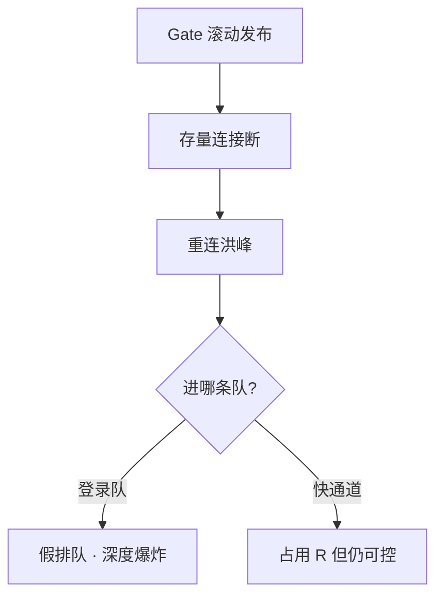

# 02｜登录、排队与选服 · 练习题

先合上知识点，对着 **一节的主图** 把「一次登录的旅程」口述一遍（渠道→账号→目录→排队→Gate→大厅），再来做题。

| 标记 | 含义 |
|------|------|
| **核心** | 不懂整章就没建立起来 |
| **必会** | 值班和面试都要能讲 |
| **常用** | 线上会反复碰到 |
| **常考** | 白板和追问的高频口径 |

## 本题目录

- [Q1 登录六跳分跳](#q1)
- [Q2 排队按什么发票](#q2)
- [Q3 ticket 与 game_token](#q3)
- [Q4 重连快通道](#q4)
- [Q5 目录 500 与爆满](#q5)
- [Q6 Login HPA 无效](#q6)
- [Q7 Gate fd 满](#q7)
- [Q8 创角行锁](#q8)
- [Q9 全渠道 vs 单渠道](#q9)
- [Q10 全服踢人顺序](#q10)
- [Q11 登录漏斗监控](#q11)
- [Q12 Gate 滚动叠加登录峰](#q12)
- [Q13 60 秒登录定责](#q13)
- [Q14 开服排队配置面试](#q14)
- [合上书](#合上书)

---

## Q1

**★★★★★｜玩家说「登录失败」，你怎么查？**

**覆盖**：核心 · 必会 · 常考 ｜ **对应**：知识点 [一、一张图：一次登录的旅程](知识点.md)

### 场景

开服第三分钟，客服群刷屏「登录失败」。开发提议「先把 Login Deployment 扩到 80」。战斗集群正常，CCU 几乎为 0。

### 完整解答

> 🎯 **一句话**：先 **六跳分跳**——渠道→账号→目录→排队→Gate→大厅，禁止未定位就扩 Login 或动战斗。

客户端只显示一行红字，运维必须拆跳：

```text
① 渠道 SDK   ② 账号 token   ③ 目录 server_list
④ 排队 ticket   ⑤ Gate ESTAB   ⑥ 大厅角色/创角
```

```bash
curl -sS 'https://dir.example.com/api/server_list' | jq '.code, (.servers|length)'
# 0 86   ← 目录 OK；若 500 或 0 条先修目录

curl -sS -o /dev/null -w '%{http_code}\n' 'https://account.example.com/health'
# 200   ← 账号服 OK
```

> ⚠️ **别混**：**全服进不去** 往往是目录/账号；**单服创角慢** 是 MySQL，不是 Login HTTP。

> 📝 **面试**：背六跳顺序；第一刀 `curl server_list` + 账号 health，**不要**重启战斗。

### 再追问

**Login 扩到 80 何时有用？**——仅当 **账号服或账号库** 是瓶颈（429/503、DB 连接池满）。Gate 空、排队假长时扩 Login **无效**。**不要**用 Login 副本数当排队消化率。

---

## Q2

**★★★★★｜排队人数 10 万，Gate 连接却不满，怎么回事？**

**覆盖**：核心 · 必会 · 常考 ｜ **对应**：知识点 [五、排队：Ticket、消化速率与重连快通道](知识点.md)

### 场景

新服开服，客户端显示「前方 102345 人」。监控上 Gate ESTAB 只有 8000，Login Pod CPU 30%。有人要再加 Login 副本。

### 完整解答

> 🎯 **一句话**：**drain_rate（消化率 R）配错** 或 **重连打进登录队**——不是 Login 不够。

排队按 **目标服** 可消化速率发票：

```text
R = min(R_gate, R_hall, R_db) × 0.7
```

若 `gate_new_conn` 只有 10/s 而队列 10 万，说明 **R 过小或单位搞错**（/min 当 /s）。

```bash
curl -sS 'http://prom:9090/api/v1/query?query=queue_depth{server_id="s1001"}' | jq '.data.result[0].value[1]'
# 102345

curl -sS 'http://prom:9090/api/v1/query?query=rate(gate_new_conn[1m])' | jq '.data.result[0].value[1]'
# 12   ← 实际进 Gate 很慢
```

> 📝 **面试**：排队深度高 + Gate 空 = **配置/分类** 问题，不是扩容 Login。

### 再追问

**怎么修？**——对 [04](../04-全链路压测与容量模型/) 压测报告调 R；重连改快通道。**不要**关排队直通 Gate（会打穿 fd）。

---

## Q3

**★★★★☆｜game_token 和排队 ticket 有什么区别？**

**覆盖**：必会 · 常考 ｜ **对应**：知识点 [三、账号：渠道身份换成 game_token](知识点.md)、[五、排队：Ticket、消化速率与重连快通道](知识点.md)

### 场景

客户端同学把 `game_token` 直接当 Gate 连接凭证，跳过排队服。测试环境能进，开服 Gate 瞬间 SYN 风暴。

### 完整解答

> 🎯 **一句话**：**game_token 证明身份**；**ticket 证明轮到你了**——Gate 两个都要验。

| 票据 | 谁发 | 作用 | TTL |
|------|------|------|-----|
| game_token | 账号服 | 身份 | 较长（会话级） |
| ticket | 排队服 | 放行连 Gate | 30～120s 一次性 |

混用的后果：拿 game_token 直连 Gate = 跳过限流，脚本可批量打穿 fd；Gate 只验 game_token 不验 ticket = 无法限速保护下游。

> ⚠️ **别混**：混用会导致「有身份无额度」仍打 Gate，或「有 ticket 无身份」安全洞。

### 再追问

**ticket 为何要一次性 nonce？**——防脚本囤票批量连 Gate。**不要**把 ticket TTL 调到 10 分钟「改善体验」——囤票+时钟 skew 更难排障。

---

## Q4

**★★★★★｜断线重连要不要排队？**

**覆盖**：核心 · 必会 ｜ **对应**：知识点 [五、排队：Ticket、消化速率与重连快通道](知识点.md)

### 场景

维护后玩家回流，排队显示 80 万。大量是老玩家重连。Gate 其实还有 fd 余量。

### 完整解答

> 🎯 **一句话**：**重连走快通道**——已有 `role_id`、session 未过期的不应与 **创角/新登录** 同一队列。

重连判定依据：`role_id` 已存在 + 最近在线过，或 Gate 侧 session 仍在 Redis。快通道直接发 ticket 或跳过排队，但仍占 **R 和 fd 预算**，不走深队。

```bash
curl -sS 'http://prom:9090/api/v1/query?query=rate(reconnect_enqueue[5m])' | jq '.data.result'
# 若 reconnect 进 login_queue → 配置 bug
```

> 📝 **面试**：假排队三特征——queue 深、Gate 空、重连占比高。

### 再追问

**快通道无限会怎样？**——仍可能 fd 满。**不要**完全 bypass 限流，要占 R。

---

## Q5

**★★★★☆｜目录服能不能返回 500？爆满怎么处理？**

**覆盖**：必会 · 常考 ｜ **对应**：知识点 [四、目录：选服、推荐与维护态](知识点.md)

### 场景

目录 DB 抖动 30s，API 500。运维提议返回空列表「避免误导」。运营要求新服显示爆满。

### 完整解答

> 🎯 **一句话**：目录 **不可 500、不可空列表**；**爆满只拦新创角**，老号必须能进。

降级策略：返回 **stale 缓存列表 + maintenance/爆满标记**，比 empty 强。空列表比 500 更糟——客户端分不清是故障还是真没服。

```bash
curl -sS 'https://dir.example.com/api/server_list?channel=official' | jq '.code, (.servers|length), .servers[0].status'
# 0 86 "smooth"   ← 正常
# 500 null        ← 目录挂；查降级缓存是否生效
# 0 0 null        ← 比 500 更糟——空列表
```

> 📝 **面试**：两条铁律——不可 500；爆满不拦老号。

### 再追问

**推荐服全推新服？**——人为制造单服登录峰；要打散推荐。

---

## Q6

**★★★★☆｜Login 无状态，HPA 加了为什么还登录失败？**

**覆盖**：必会 · 常用 ｜ **对应**：知识点 [三、账号：渠道身份换成 game_token](知识点.md)

### 场景

账号服 HPA 从 5 到 40，成功率仍 60%。MySQL `Threads_running` 120，连接池告警。

### 完整解答

> 🎯 **一句话**：瓶颈在 **账号库连接池/Redis**，Login 副本假扩容。

```bash
mysql -e "SHOW PROCESSLIST;" | wc -l
# 148   ← 池满；加 Pod 只加失败连接
```

无状态 **副本** ≠ 无状态 **数据层**。Login Pod 加了，每个 Pod 的 DB 连接池都去抢同一个 MySQL 的连接上限，反而加剧竞争。

> ⚠️ **别混**：无状态副本 ≠ 无状态数据层。

### 再追问

**怎么修？**——扩连接池、读写优化、限流 429。**不要**继续线性 HPA Login。

---

## Q7

**★★★★★｜有 ticket 仍连不上 Gate？**

**覆盖**：核心 · 必会 · 常考 ｜ **对应**：知识点 [六、Gate：长连接、Session 与 Ticket 校验](知识点.md)

### 场景

玩家拿到排队序号弹出「连接服务器失败」。ticket 日志有 `expired` 和 `nonce mismatch`。

### 完整解答

> 🎯 **一句话**：先查 **fd 上限 / SYN-RECV**，再查 **ticket TTL 与时钟**。

```bash
ss -ant state established '( sport = :4103 )' | wc -l
ulimit -n
# 64000 / 65535   ← fd 顶

ss -ant state syn-recv '( sport = :4103 )' | wc -l
# 9000   ← 半连接满，见 12 章

grep -i ticket /var/log/gate/gate.log | tail -3
# ticket expired nonce mismatch   ← 客户端囤票或时钟 skew
```

> 📝 **面试**：有 ticket 失败 ≠ 排队问题——Gate 资源或票据无效。

### 再追问

**扩 Login 有用吗？**——无。**要**扩 Gate 或降 R。

---

## Q8

**★★★★☆｜Gate 已连上，卡在加载角色？**

**覆盖**：必会 · 常用 ｜ **对应**：知识点 [七、进门：大厅、创角与登录完成](知识点.md)

### 场景

新服开服，创角界面转圈 5 分钟。Gate ESTAB 正常，Login 成功率高。

### 完整解答

> 🎯 **一句话**：**大厅/创角 MySQL 行锁**——限创角，已有号走读路径。

```bash
mysql -e "SHOW ENGINE INNODB STATUS\G" | grep -A10 'DEADLOCK'
# 名字唯一索引 / 序号生成器热点
```

创角是登录链里最重的 DB 写，热点两个：名字唯一索引和角色 ID 序号生成器。已有角色走 SELECT 读路径，不走 INSERT，不应被创角热点卡住。

> 📝 **面试**：新服创角慢 = DB 写，不是 Gate。

### 再追问

**爆满还推新号？**——违反「爆满只拦新号」；要目录改推荐+创角限流。

---

## Q9

**★★★☆☆｜只有 iOS 登录失败，Android 正常？**

**覆盖**：常用 ｜ **对应**：知识点 [二、渠道：点图标与 SDK 授权](知识点.md)

### 场景

苹果渠道更新后单渠道挂。有人要全服维护。

### 完整解答

> 🎯 **一句话**：**单渠道查 SDK/证书/渠道回调**，不要全服动 Gate。

```bash
curl -sS 'http://prom:9090/api/v1/query?query=rate(login_fail{channel="ios"}[5m])' | jq .
# 单渠道飙红 → 查苹果证书/渠道回调
```

单渠道失败的特征：其他渠道正常、账号服 health 200、Gate ESTAB 不变。排查方向是渠道后台的 AppID/证书/回调地址。

### 再追问

**全渠道失败才查什么？**——账号+目录。**不要**单渠道问题重启全集群。

---

## Q10

**★★★★☆｜全服踢人正确顺序？**

**覆盖**：必会 ｜ **对应**：知识点 [七、进门：大厅、创角与登录完成](知识点.md)

### 场景

维护前有人 `kill -9` Gate，随后目录改维护。玩家反馈「能连上立刻掉」。

### 完整解答

> 🎯 **一句话**：**目录 maintenance → 停 ticket → Gate 协议踢 → 清 session**。

```text
① 目录：目标 server_id → maintenance
② 排队：停发 ticket / drain_rate=0
③ Gate：协议通知踢人 · 停止新 ESTABLISHED
④ Redis：session 批量失效
```

跳过任一步都会留窗口：只做 ① 不做 ③ = 老玩家还在服里；只做 ③ 不做 ④ = session 残留导致「幽灵在线」。

> ⚠️ **别混**：`kill -9` Gate = SYN 风暴；**不要**当维护手段。

### 再追问

**幽灵在线？**——session 未清，CCU 虚高；查 Redis session 数量。

---

## Q11

**★★★☆☆｜登录漏斗怎么建？**

**覆盖**：常用 ｜ **对应**：知识点 [七、进门：大厅、创角与登录完成](知识点.md)

### 场景

最终 `login_fail` 告警晚 10 分钟才发现账号段下跌。

### 完整解答

> 🎯 **一句话**：六段漏斗 **channel→account→dir→ticket→gate→hall**，任一段跌 5% 告警。

```text
channel_ok → account_ok → dir_ok → ticket_ok → gate_ok → hall_ok
```

端到端 P99 比单跳 SLA 更能发现「每跳都慢一点点」——六跳各慢 200ms，单跳 SLA 全绿，端到端却多了 1.2s。

> 📝 **面试**：「登录监控怎么建？」——「六跳漏斗 + 分 server_id 的 queue_depth + gate_new_conn vs drain_rate。」

### 再追问

**和单跳 SLA 区别？**——漏斗看 **转化率**，定位「从哪跳开始掉」。

---

## Q12

**★★★★☆｜Gate 滚动后排队爆炸？**

**覆盖**：必会 ｜ **对应**：知识点 [六、Gate：长连接、Session 与 Ticket 校验](知识点.md)

### 场景

Gate 发布 20:00 撞上活动整点。queue_depth 从 1 万飙到 40 万。

### 完整解答

> 🎯 **一句话**：滚动断连 → **重连洪峰**；重连若进登录队 = 假排队。



对照 `kubectl rollout history` 与 queue 曲线；查 `reconnect_enqueue`。

```bash
kubectl rollout history deploy/gate-prod | tail -3
# 对照 queue_depth 飙升时间点

curl -sS 'http://prom:9090/api/v1/query?query=sum(rate(reconnect_enqueue[5m]))' | jq '.data.result'
# 若 reconnect_enqueue 高而 reconnect_fastpass 低 → 分类 bug
```

### 再追问

**活动窗口能否滚 Gate？**——避免或先降 R；重连必须快通道。

---

## Q13

**★★★★★｜给你 60 秒，登录全红你怎么做？**

**覆盖**：核心 · 必会 · 🔧 ｜ **对应**：知识点 [八、作战：登录失败定责](知识点.md)

### 场景

整点告警：login_fail 15%。On-call 紧张要重启「所有游戏服」。

### 完整解答

> 🎯 **一句话**：**60 秒内分跳定责**，同步「勿动战斗」。

```text
0–10s  全渠道/单渠道 · 排队 or 秒失败
10–30s curl server_list · account health · queue_depth
30–45s gate ESTAB · gate_new_conn vs drain_rate
45–60s 报责任何跳 · 否决无差别重启战斗
```

一键巡检：

```bash
echo "=== dir ===" && curl -sS 'https://dir.example.com/api/server_list' | jq -r '.code, (.servers|length)'
echo "=== account ===" && curl -sS -o /dev/null -w '%{http_code}\n' 'https://account.example.com/health'
echo "=== queue ===" && curl -sS 'http://prom:9090/api/v1/query?query=sum(queue_depth)' | jq -r '.data.result[0].value[1]'
echo "=== gate ===" && ss -ant state established '( sport = :4103 )' | wc -l
```

### 再追问

**谁可以说重启战斗？**——定责到大厅/战斗且非登录峰时；登录峰 **不要**。

---

## Q14

**★★★★★｜开服排队怎么配？面试官追问压测关系。**

**覆盖**：核心 · 常考 ｜ **对应**：知识点 [五、排队：Ticket、消化速率与重连快通道](知识点.md)

### 场景

面试官：「新服 5 万人在线目标，排队和 Gate 怎么定？」

### 完整解答

> 🎯 **一句话**：**R 来自 [04](../04-全链路压测与容量模型/) 压测 min 层 ×0.7**，不是 Login Pod 数。

```text
压 Gate+大厅+创角 → 得 R_gate, R_db → R=min×0.7
Gate 副本 = 目标连接 / 单进程安全连接
排队 drain_rate = R per server_id
```

> 📝 **面试**：三件套——按服 R、ticket 一次性、重连快通道。

### 再追问

**没有压测报告能开服吗？**——可以但 R 必须保守 α=0.6；**不要**关排队「赌一把」。

---

## 合上书

对齐知识点「合上书」，逐条口述，卡住就回对应节：

- [ ] **默画**六跳主图，标 ticket 与 ESTABLISHED 位置。
- [ ] 口述 **R = min(Gate,大厅,DB)×0.7**，为何不是 Login 副本数。
- [ ] **game_token vs ticket** 各管什么。
- [ ] **重连快通道** 与假排队识别（queue 深、Gate 空、重连占比高）。
- [ ] 目录 **不可 500、爆满只拦新号**。
- [ ] 「Gate 不满 queue 深」第一刀查 **drain_rate/重连分类**。
- [ ] 「有 ticket Gate 失败」查 **fd/SYN-RECV/ticket 日志**。
- [ ] 「卡加载角色」查 **创角/MySQL**，不扩 Login。
- [ ] 全服踢人 **四步顺序**，跳过任一步会怎样，禁止 `kill -9` Gate。
- [ ] **60 秒剧本** 口述，含「勿重启战斗」。
- [ ] 口述 **Gate session 两种存储方案** 的取舍。
- [ ] 口述 **登录漏斗** 监控比单跳 SLA 多的原因。
