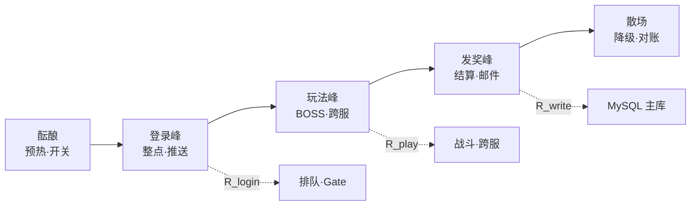
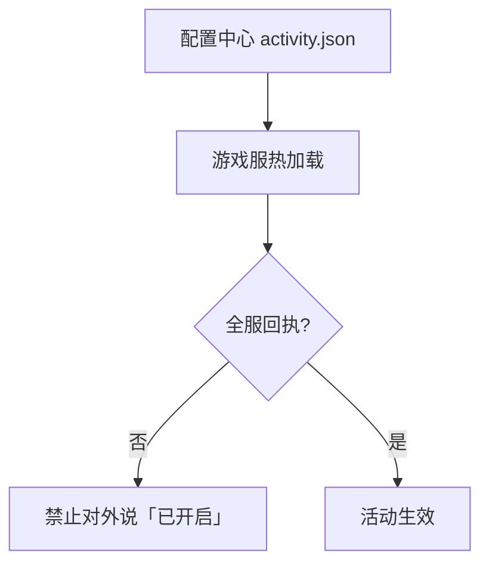
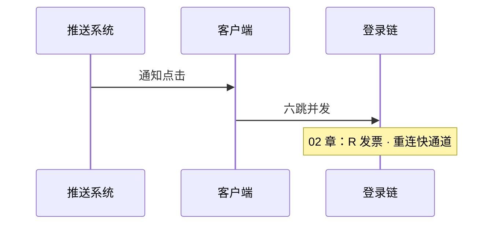
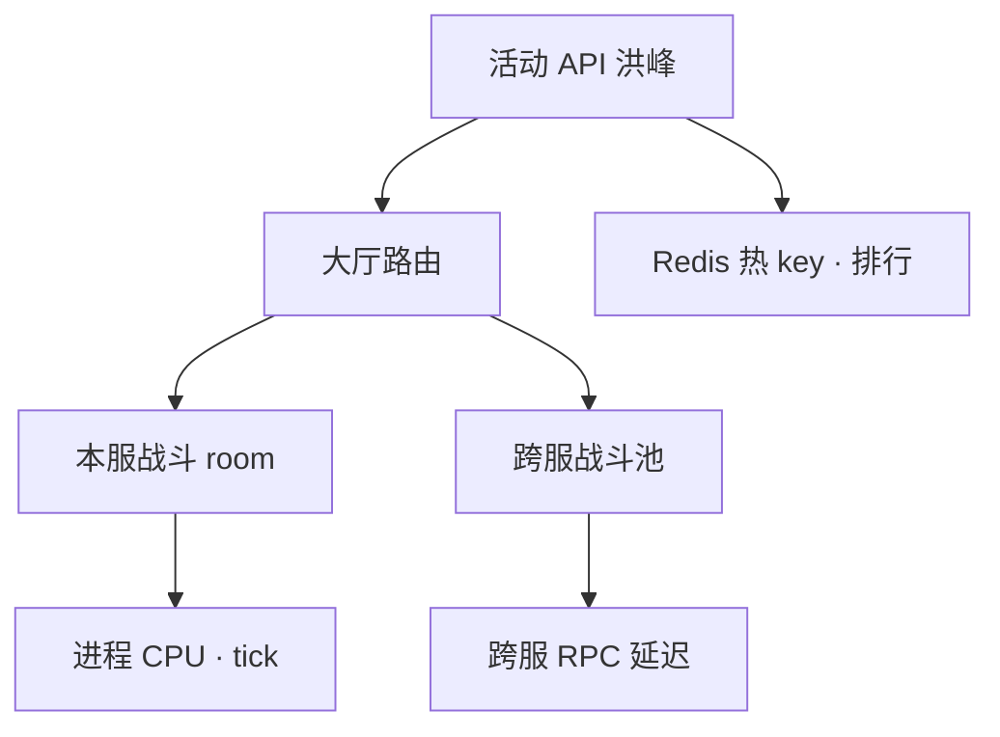
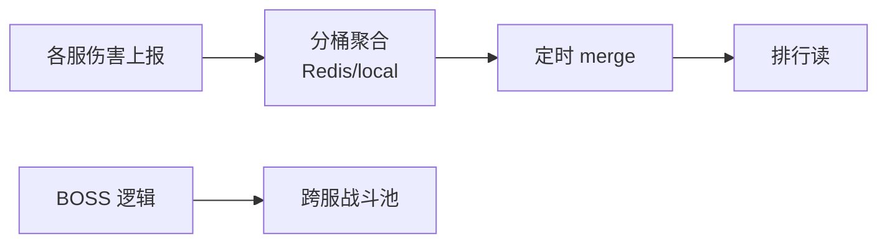
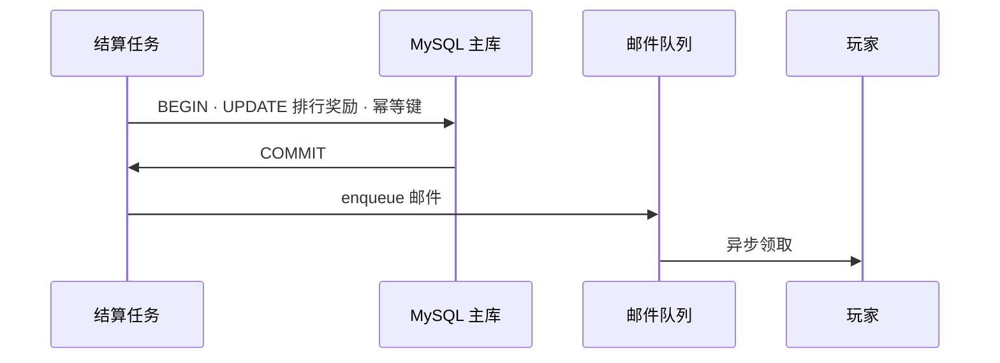
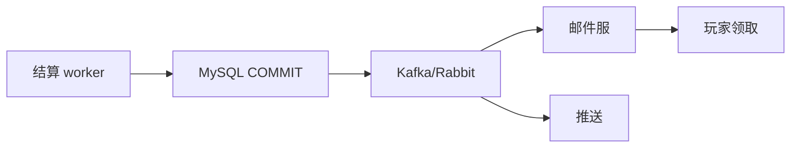
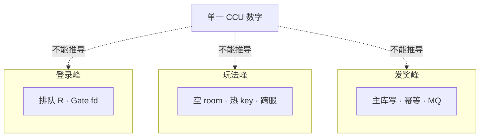
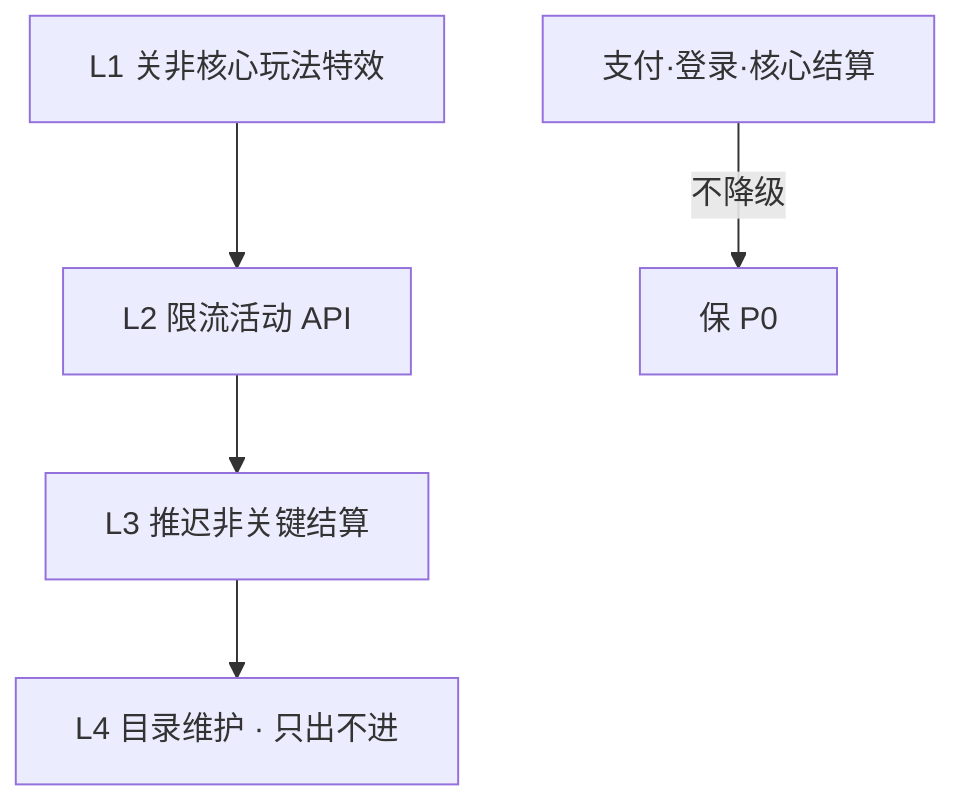
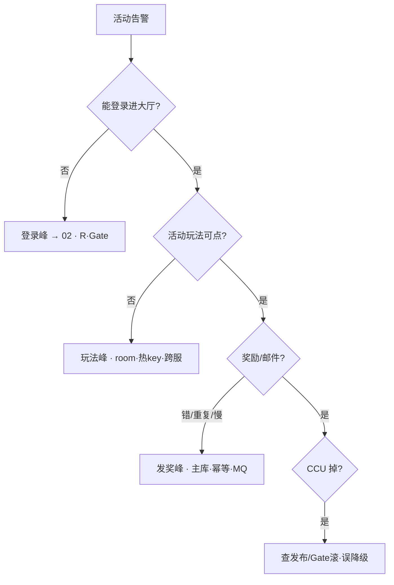

# 活动高峰与压测

> 周年庆 20:00 整点——推送、活动开启、排行榜结算叠在同一分钟。HPA 把战斗副本加了一倍，新 Pod 全是空房间；主库已被全服发奖 UPDATE 锁死，邮件队列积压 400 万。三峰不能用一个 CCU 买全部容量，炸了先降级再扩。
> **本章回答**：一场活动从预热到散场，**登录峰 / 玩法峰 / 发奖峰** 各打哪层、各怎么扩、各怎么降，以及为什么 HPA 救不了已开房间和主库写尖刺。
> **不讲**：登录六跳与 ticket → [02](../02-登录排队与选服/)；容量模型与压测执行 → [04](../04-全链路压测与容量模型/)；配置热更开关 → [05](../05-热更新与版本发布/)；CDN 资源 → [08](../08-CDN与资源更新/)；回档 → [09](../09-玩家数据备份与回档/)；SLO 体系 → [13](../13-游戏SRE稳定性/)、[09-SRE](../../09-可观测性与SRE方法论/)。

**标记**：🎯重点 · 🔥难点 · ⭐常考 · 🔧实操

---

## 一、一张图：活动高峰的一生

> 🎯 **一句话**：活动不是「CCU 高一点」，而是 **酝酿 → 登录峰 → 玩法峰 → 发奖峰 → 散场** 五段生命周期——每段瓶颈在不同层，扩容和降级手段完全不同。



**读图**：

- **横轴是时间**：20:00 推送触发登录峰；20:05 玩法接口峰；20:30 结算发奖写峰——不要用一个 HPA 规则覆盖全程。
- **纵轴是层**：登录打 Gate/排队；玩法打战斗/跨服；发奖打 **MySQL 主库**——从库、Redis 缓存都救不了写尖刺。
- 值班问「活动红没红」先问 **哪座峰、哪一层**——CCU 高但发奖慢是 DB，不是战斗 Pod 数。

---

## 二、酝酿：预热、开关与时间窗 🔧

> 🎯 **一句话**：活动高峰在 **玩家进服之前** 就要开始算账——空房间预开、配置热更、CDN 预热、降级开关默认关，缺一项等于把尖刺直接送给生产。

### 活动前 Checklist（运维视角）

```text
T-7d  容量评审：三峰分别对照 04 章压测报告 · 缺口走扩容或降需求
T-3d  战斗/跨服池预开空 room · Gate 预扩 · 登录 R 调高但 ≤压测×0.7
T-1d  全链路演练：真协议 · 影子库/挡板 · 验证降级开关回执
T-1h  CDN/版本确认 · 目录推荐打散 · 创角限流参数就绪
T-0   值班席 · 冻结非必要发布 · 主库慢查询清零
```

> 📝 **面试**：「活动前运维做什么？」——「三峰容量对表、预开空 room、Gate/排队 R 预热、开关热更回执、冻结发布。」

配置开关以 **全服回执（ack）** 为准，不是改完 DB 就算——半服开半服关 = 资损（重复领奖/规则不一致）。热更细节见 [05](../05-热更新与版本发布/)。



**读图**：开关 **以全服回执为准**——半数 Pod 拿到新配置、半数还在旧版，就是半服开活动。

> ⚠️ **别混**：**预扩战斗** = 多 **空 room** 接新匹配；**不能**给已开 room 加算力。预扩 Gate = 多 **fd** 接登录，不是帮 DB 扛写。

> 🔍 **现场**：活动前空房间是否够

```bash
curl -sS 'http://prom:9090/api/v1/query?query=sum(battle_empty_rooms)' | jq '.data.result[0].value[1]'
# "850"   ← 对比预计匹配 QPS × 平均匹配等待秒数

kubectl get hpa battle-prod -o jsonpath='{.status.currentReplicas}/{.spec.maxReplicas}'
# 48/80   ← 若已顶 max，活动前需调 max 或预手动扩容
```

---

## 三、登录峰：整点、推送与重连 ⭐

> 🎯 **一句话**：**登录峰** = 短时间 **登录 QPS / 重连** 相对 CCU 的尖刺——打 **账号、排队、Gate**，放大倍数常见 **日常 10×～30×**（整点+推送叠加更高）。

触发源：

- 运营 **推送**（全员切回游戏）
- **整点活动**（20:00 开抢）
- **开服**（新 server_id 开放）
- **版本热更后**（客户端重启洪流）



**读图**：登录峰 **不等于 CCU 线性涨**——大量是 **短连重连** 或 **排队等待**，监控看 `login_qps`、`queue_depth`、`gate_new_conn`，不是只看 CCU 曲线。

**登录 QPS 与 CCU 的关系**（数字墙有汇总）：

```text
登录 QPS ≈ CCU × 重连率 × 活动系数
活动整点：重连率飙 + 新登录涌入 → 双头峰
```

> 💡 **打个比方**：登录峰像地铁早高峰进站——限流闸机（排队）比加车厢（Login HTTP）更重要，否则站台（Gate）挤爆。

对策（按优先级）：

1. **排队 R** 按服发票（02 章）——保护 Gate/DB
2. **Gate 预扩** + fd/ulimit 确认
3. **重连快通道**——已有有效 session 的玩家跳过账号验证直接进大厅，避免假排队挤占新登录
4. **目录推荐打散**——勿推单一新服，多服分摊开服峰
5. **创角限流**——新服创角 QPS 上限，防 DB 写瓶颈

> ⚠️ **别混**：**登录峰** 扩战斗 **零作用**——战斗空 room 不接登录 HTTP。

> 🔍 **现场**：整点后 5 分钟登录红

```bash
curl -sS 'http://prom:9090/api/v1/query?query=sum(rate(login_total[1m]))' | jq '.data.result[0].value[1]'
curl -sS 'http://prom:9090/api/v1/query?query=sum(queue_depth)' | jq '.data.result[0].value[1]'
ss -ant state established '( sport = :4103 )' | wc -l
# login 8k/s · queue 5万 · gate estab 52万   ← 若 gate 接近上限先扩 Gate 或降 R
```

> 📝 **面试**：「活动整点登录爆？」——「排队 R + Gate 预扩 + 重连快通道；Login HPA 仅在账号库瓶颈时有效。」

---

## 四、玩法峰：房间、跨服与接口 QPS 🔥⭐

> 🎯 **一句话**：**玩法峰** = 活动玩法接口 **QPS / 并发 room** 尖刺——打 **战斗进程、跨服池、Redis 热 key**，放大 **10×～50×** 单接口。

典型场景：

- 世界 BOSS、公会战、限时副本
- **全服同时点按钮**（抢红包式）
- 跨服匹配池 **集中匹配**



**读图**：玩法峰 **CPU 型**（战斗 tick）和 **IO 型**（Redis 排行）可能同时出现——先分指标再扩。

### HPA 边界 🔥

```text
HPA 扩战斗 = 新 Pod 空 room ↑
         ≠ 已 Fighting room 变快
         ≠ 已开跨服局迁移
```

> 💡 **打个比方**：HPA 扩战斗像酒店新开了一层楼——新客可以住，但已经在开会的人不会因为多了空房间就开得更快。

### 跨服池与本服资源隔离 🔧

**跨服（cross-server）** 池独立容量——本服战斗 HPA 不影响跨服；跨服挂了 **只杀跨服玩法**，别重启全服 Gate。

```text
本服 battle HPA · 指标 empty_rooms_local
跨服 cross-battle HPA · 指标 cross_queue · RPC latency
告警 label: gameplay=cross|local
```

> 🔍 **现场**：跨服延迟

```bash
curl -sS 'http://prom:9090/api/v1/query?query=histogram_quantile(0.99, rate(cross_rpc_seconds_bucket[5m]))' | jq .
# 2.4   ← P99 2.4s · 查跨服池 CPU 与网络

kubectl get pods -l app=cross-battle --no-headers | wc -l
# 8   ← 独立于本服 battle 48
```

> 📝 **面试**：「跨服挂了能重启全服吗？」——「只影响跨服玩法；本服独立，分标签重启。」

### Redis 热 key

活动排行、全服伤害计数：

- 单 key QPS >10 万要 **拆 key**（分桶、local aggregate 再 merge）
- 本地聚合 + 定时 flush 比每次 INCR 全局 key 稳

> 🔍 **现场**：活动 API 502 但 CCU 正常

```bash
curl -sS 'http://prom:9090/api/v1/query?query=topk(5, rate(http_request_total{path=~"/activity.*"}[1m]))' | jq '.data.result'
# 定位最红接口

curl -sS 'http://prom:9090/api/v1/query?query=redis_key_qps{key="activity:damage:total"}' | jq '.data.result'
# 单 key 顶穿 → 拆 key 或本地聚合

kubectl top pods -l app=battle --sort-by=cpu | head -5
# CPU 99% · 空 room=0 → 不是副本不够，是 room 内逻辑或匹配堆
```

> ⚠️ **别混**：**玩法进不去**（体验 P1）和 **发奖错**（资损 P0）——玩法峰可以先降级玩法，**不能**跳过发奖幂等。

> 📝 **面试**：「战斗 HPA 翻倍为什么还卡？」——「新 Pod 空 room；已开 room 不吃 HPA；可能是 Redis 热 key 或跨服 RPC。」

### 世界 BOSS 与全服玩法专项 🔥

**全服同时打一个目标** = 玩法峰 + Redis 热 key + 跨服 RPC 三重叠加——容量要 **预分配跨服池 + 伤害本地聚合**，不是只加本服战斗。



**读图**：**每秒全局 INCR 单 key** 必死——改 **分片桶**（`damage:shard:{0..63}`）再 sum。

> 🔍 **现场**：世界 BOSS 卡顿

```bash
redis-cli --latency-history -i 1 | head -5
curl -sS 'http://prom:9090/api/v1/query?query=rate(redis_commands_total{cmd="incr"}[1m])' | jq '.data.result | length'
# 单 key incr 飙高 → 未分桶

kubectl top pods -l app=cross-battle | head -3
```

> 📝 **面试**：「世界 BOSS 怎么运维？」——「伤害分桶聚合、跨服池独立容量、排行读异步；单 key INCR 禁止。」

---

## 五、发奖峰：写尖刺、幂等与邮件 🔥⭐

> 🎯 **一句话**：**发奖峰** = 活动结束 **批量写 MySQL + 发邮件/背包**——**资损最高**，从库/读缓存 **救不了写**，必须 **幂等 + 分批 + 异步化**。



**读图**：写路径 **必须主库事务**；邮件/推送可异步。全服 **同一秒 UPDATE 同一排行表** = 行锁灾难。

### 幂等（idempotency）三件套

1. **业务幂等键**：`activity_id + role_id + reward_tier`
2. **DB 唯一索引**：重复发奖 INSERT 失败
3. **状态机**：`pending → sent`，禁止从 `sent` 回退

> 💡 **打个比方**：发奖像银行批量转账——宁可慢 10 分钟，不能 duplicate payment；「先扩从库」像多加复印机，账本还是一本。

### 错误架构 vs 正确架构

```text
❌ 20:30:00 全服 for-loop 同步 UPDATE
❌ 活动结束立刻 HPA 战斗 ×2 想「加速结算」
❌ 读写分离指望从库扛结算读 —— 写仍打主库

✅ 结算分片：按 server_id / role_id hash 多 worker
✅ 每批 500～5000 条 · sleep 控 QPS
✅ 邮件走 MQ · 玩家侧延迟可接受
✅ 对账 job：MySQL 订单 vs 发放日志
```

> ⚠️ **别混**：**重复发奖** 不是「玩家多领一次道具」那么简单——涉及 **充值法币、稀有掉落、排行公平**，回滚成本 >> 慢 10 分钟。

> 🔍 **现场**：主库 Threads_running 飙满

```bash
mysql -e "SHOW GLOBAL STATUS LIKE 'Threads_running';"
# Threads_running: 248   ← 发奖尖刺

mysql -e "SELECT db,sql_text FROM sys.statements_with_runtimes_in_95th_percentile LIMIT 5;"
# UPDATE rank_reward ...   ← 抓模板 SQL

mysql -e "SHOW ENGINE INNODB STATUS\G" | grep -A3 'LOCK WAIT'
# 行锁等待链 → 降并发 batch · 禁止再加结算 worker
```

### 邮件与异步发奖队列 ⭐

**邮件/MQ** 把「玩家感知」和「主库写峰值」拆开——结算写完了可以慢慢发邮件，但 **写路径幂等** 不能省。



**读图**：MQ 积压看 **consumer lag**，不是加战斗 Pod。lag 高时 **加邮件 consumer**，**不要** 再加结算 worker 写主库。

> 🔍 **现场**：邮件积压 400 万

```bash
kafka-consumer-groups.sh --bootstrap-server kafka:9092 --describe --group mail_sender | awk '$5>100000 {print}'
# LAG 4000000   ← 扩 consumer · 主库若已锁先停 worker
```

> ⚠️ **别混**：**邮件延迟**（体验）≠ **重复发奖**（资损）——前者加 consumer，后者停 worker 查幂等。

> 📝 **面试**：「发奖慢怎么办？」——「先分主库锁 vs MQ lag；锁降 batch，lag 扩 consumer。」

### 收束：三峰凭什么分开算



**读图**（分组背）：

- **登录峰**：保护 **连接与进服**——排队、Gate、创角限流
- **玩法峰**：保护 **算力与读**——空 room、跨服池、Redis 拆 key
- **发奖峰**：保护 **账本**——主库写速率、幂等、异步邮件

> ⚠️ **别混**：三峰 **可叠加** 但不 **共用同一扩容旋钮**——CCU 高 + 主库锁 = 发奖问题，加战斗 Pod 无用。

> 📝 **面试**：背三句——「登录限 R · 玩法预开 room · 发奖分批幂等写主库」。

---

## 六、散场：降级、恢复与对账 ⭐

> 🎯 **一句话**：活动当晚 **宁可降玩法保登录+结算+支付**——降级顺序写进 runbook，开关 **配置热更 + 全服回执**；散场先对账再恢复。



**读图**：越往下越伤体验；**L4 只出不进** 是 nuclear option。支付链路永不降级（见 [10](../10-充值支付链路保障/)）。

**熔断（circuit breaker）**：

- 活动 API 错误率 >5% 持续 1min → 自动返回「活动繁忙」
- Redis 超时 → 读降级为 stale 缓存，**写路径不 silent fail**
- 熔断恢复需 **半开探测**：先放 10% 流量试 30s，全绿再全量放

### 对账与恢复

活动结束后 **先对账再恢复降级**——降级开关不能一刀切回：

1. **对账 job** 跑完：MySQL 订单表 vs 发放日志 vs 邮件队列，差行为 0
2. **降级逐级恢复**：L3 结算 → L2 API 限流 → L1 特效，每级观察 5min
3. **容量回缩**：Gate/战斗 HPA max 调回日常值，空 room 自然回收

> 🔍 **现场**：确认降级是否生效

```bash
curl -sS 'http://gs:8080/debug/activity_switch' | jq .
# world_boss: false  ack_version: 992   ← 全服 ack 一致才真关

curl -sS 'http://prom:9090/api/v1/query?query=count(activity_config_ack_version!=992)' | jq .
# 0   ← 若有 Pod 版本不一致 → 半服开活动
```

> 📝 **面试**：「活动扛不住先砍什么？」——「特效/次要玩法 → API 限流 → 推迟非关键结算；**不砍**支付和发奖幂等。」

### 活动当晚时间线（20:00 整点样例）🔧

```text
19:50  empty_rooms 阈值 · drain_rate 已调 · 冻结发布
20:00  login_qps spike · queue_depth / gate_new_conn
20:05  玩法 API P99 · 热 key · cross-battle CPU
20:30  结算 worker · Threads_running · 禁止加战斗
21:00  对账 · 降级恢复 · incident 时间线
```

> 🔍 **现场**：按分钟对 runbook，别全程只盯 CCU 单曲线。

> 📝 **面试**：活动第一小时按 **分钟表** 切换关注曲线——20:00 登录、20:05 玩法、20:30 主库。

---

## 七、压测：活动专项与生产隔离 🔧

> 🎯 **一句话**：活动压测必须 **真协议 + 三峰分场景**——**不对生产主库写**，影子库/挡板 + 数据工厂见 [04](../04-全链路压测与容量模型/)。

```text
场景 A 登录峰：N 万虚拟账号 · 整点同时 enqueue · 验证 R 与 Gate
场景 B 玩法峰：M 并发 room · 活动 API 循环 · 验证 CPU/热 key
场景 C 发奖峰：全服排行 UPDATE 分批 · 验证主库 TPS 与锁
```

**数据工厂**：压测账号需 **真协议 handshake**——不是 HTTP 压测替代品。虚拟角色要有背包/等级/帮派等业务上下文，否则压不到真实 SQL 路径。影子库（shadow DB）做写隔离：压测流量打影子 MySQL，与生产主库物理隔离。

**验收指标**（示例）：

| 场景 | 指标 | 门槛 |
|------|------|------|
| 登录 | gate_ok 率 | >99.5% @ 目标 QPS |
| 玩法 | P99 活动 API | 小于 500ms @ 目标 QPS |
| 发奖 | 零重复 + 主库 Threads_running | 小于 128 @ 目标 batch |

> ⚠️ **别混**：**生产小流量试活动** ≠ 压测——样本不够、不敢打满发奖写，只能做灰度不能替全链路压测。

> 🔍 **现场**：压测报告关键页

```bash
grep -E 'R_gate|R_write|headroom' /docs/capacity/activity_anniversary.pdf.md
# 确认安全系数 0.7 已写入 runbook
```

**链到它章**：登录峰细节 → [02](../02-登录排队与选服/)；容量数字 → [04](../04-全链路压测与容量模型/)；支付不降 → [10](../10-充值支付链路保障/)；长连接排障 → [12-网络栈](../../01-基础底座/12-网络栈与Socket/)、[13-TCP](../../01-基础底座/13-TCP与UDP/)。

---

## 八、作战：活动当晚定责 🔧

> 🎯 **一句话**：先问 **登录进不去 / 玩法卡 / 道具没到账** 三类，再对三峰——**发奖问题禁止先 HPA 战斗**。

### 决策树



| 现象 | 先做 | 别做 |
|------|------|------|
| 整点登录排队 10 万 | drain_rate、Gate fd、重连分类 | 扩战斗 |
| 活动 API 超时 | 热 key、跨服延迟、空 room | 无限 HPA 不看 max |
| 主库锁死 | 降结算 batch、停加 worker | 加从库扛写 |
| 半服活动规则不一致 | config ack 版本对齐 | 再热更一次不查回执 |
| 重复发奖 | 停结算 worker、查幂等键 | 手工 SQL 批量改背包 |

### 60 秒剧本 🔧

```text
0–10s  问：登录/玩法/发奖哪类 · 全服/单服 · 刚才有无发布/开关变更
10–30s CCU/login_qps/queue_depth · 活动 API 错误率 · MySQL Threads_running
30–45s battle_empty_rooms · redis hot key · activity ack 版本是否一致
45–60s 定三峰之一 · 发奖问题先止血 worker · 同步「勿 HPA 战斗当结算」
```

---

## 九、收口

### 命令速查 🔧

```bash
# 登录峰
curl -sS 'http://prom:9090/api/v1/query?query=sum(rate(login_total[1m]))' | jq '.data.result[0].value[1]'
curl -sS 'http://prom:9090/api/v1/query?query=sum(queue_depth)' | jq '.data.result[0].value[1]'
ss -ant state established '( sport = :4103 )' | wc -l

# 玩法峰
curl -sS 'http://prom:9090/api/v1/query?query=battle_empty_rooms' | jq '.data.result'
kubectl top pods -l app=battle --sort-by=cpu | head

# 发奖峰
mysql -e "SHOW GLOBAL STATUS LIKE 'Threads_running';"
mysql -e "SHOW PROCESSLIST;" | grep -i reward | head

# 降级
curl -sS 'http://gs:8080/debug/activity_switch' | jq .
```

### 面试锚点

| 问 | 30 秒答 |
|----|---------|
| 活动三峰是什么？ | 登录峰打 Gate/排队；玩法峰打 room/Redis；发奖峰打主库写 |
| HPA 战斗为何救不了卡顿？ | 新 Pod 空 room，已开 room 不迁移 |
| 从库能否扛结算？ | 不能，写只打主库 |
| 活动前做什么？ | 三峰对容量表、预开 room、Gate/R 预热、开关回执 |
| 重复发奖怎么防？ | 幂等键+唯一索引+状态机+对账 |
| 先降级什么？ | 次要玩法/特效，保登录支付核心结算 |
| 登录整点爆？ | 排队 R+Gate 预扩+重连快通道，不是战斗 HPA |
| 热 key 怎么办？ | 拆 key、本地聚合、异步 merge |

### 易错对照

- 错：活动用一个 CCU 估全部容量 → 对：三峰分开压测分开扩
- 错：结算慢 HPA 战斗 → 对：降 batch、查主库锁
- 错：读写分离救发奖写 → 对：写只能主库，分批幂等
- 错：改完配置就算活动开 → 对：全服 ack 一致
- 错：登录峰扩战斗 → 对：排队+Gate
- 错：全服同时 UPDATE 排行 → 对：分片 worker 控 QPS
- 错：玩法挂就重启全集群 → 对：分跨服/本服/Redis

### 数字墙

```text
登录峰放大：日常 10×～30× · 推送+整点可叠 40×
玩法 API 放大：单接口 10×～50× · 世界 BOSS 常见 CPU 顶满
发奖写 batch：500～5000 条/批 · 批间 sleep 50～200ms
主库 Threads_running 告警：>128 关注 · >200 必须降 worker
Redis 热 key：>10万 QPS/key 要拆 · 排行 merge 间隔 1～5s
空 room 预估：匹配 QPS × P99 等待秒 ×1.5
活动开关 ack：必须 100% Pod 同 version · 不一致 = P0
降级顺序：特效 → API 限流 → 推迟非关键结算 → 只出不进
CCU : 登录 QPS 活动系数：1:0.5～2 · 看重连与推送
活动分钟表：T+0 登录 · T+5 玩法 · T+30 发奖
```

---

## 合上书

- [ ] **默画**活动生命周期主图：酝酿→登录峰→玩法峰→发奖峰→散场，标三峰各打哪层。
- [ ] 口述 **为什么 CCU 不能买三峰容量**——各举一条瓶颈。
- [ ] 说清 **HPA 战斗** 只能增加什么、不能救什么。
- [ ] 背 **发奖幂等三件套** 和 **分批写主库** 理由。
- [ ] 解释 **从库为什么不救发奖写尖刺**。
- [ ] 「整点登录排队爆炸」**第一刀**（R、Gate、重连）——**不要**扩战斗。
- [ ] 「活动 API 502 但 CCU 正常」查 **热 key / 空 room / 跨服** 路径。
- [ ] 「主库 Threads_running 200+」**止血**动作（降 batch、停 worker）——**不要**加从库。
- [ ] 口述 **降级顺序** 和 **不可降级的 P0**（支付、核心结算幂等）。
- [ ] **默画** 世界 BOSS 伤害分桶聚合路径，说清为何不能单 key INCR。
- [ ] 口述 **配置热更 ack** 不一致的症状与第一刀。
- [ ] 口述 **活动分钟表** T+0/T+5/T+30 各盯哪条曲线。

压测与容量章 [04](../04-全链路压测与容量模型/) 负责把活动系数写进分层账本；本章只讲活动当晚三峰怎么拆、怎么降。
