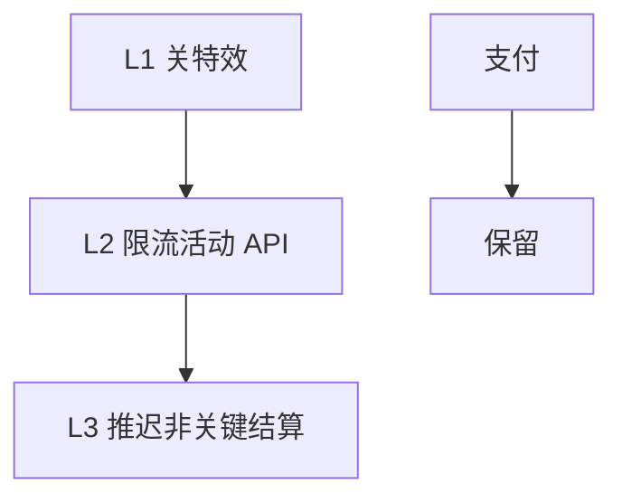

# 03｜活动高峰与压测 · 练习题

先合上知识点，对着 **一节的主图** 把「活动高峰五段」口述一遍（酝酿→登录峰→玩法峰→发奖峰→散场），再来做题。

| 标记 | 含义 |
|------|------|
| **核心** | 不懂整章就没建立起来 |
| **必会** | 值班和面试都要能讲 |
| **常用** | 线上会反复碰到 |
| **常考** | 白板和追问的高频口径 |

## 本题目录

- [Q1 活动三峰是什么](#q1)
- [Q2 CCU 能买三峰吗](#q2)
- [Q3 整点登录爆](#q3)
- [Q4 HPA 战斗无效](#q4)
- [Q5 发奖主库锁](#q5)
- [Q6 重复发奖幂等](#q6)
- [Q7 从库救写](#q7)
- [Q8 降级顺序](#q8)
- [Q9 配置 ack 不一致](#q9)
- [Q10 世界 BOSS 热 key](#q10)
- [Q11 活动前 checklist](#q11)
- [Q12 邮件 MQ 积压](#q12)
- [Q13 活动当晚 60 秒](#q13)
- [Q14 否决错误扩容](#q14)
- [合上书](#合上书)

---

## Q1

**★★★★★｜周年庆容量怎么估？一个 CCU 够吗？**

**覆盖**：核心 · 必会 · 常考 ｜ **对应**：知识点 [一、一张图：活动高峰的一生](知识点.md)

### 场景

运营目标「80 万 CCU」。架构师只按 CCU 买了 Gate 和战斗副本，没单独估结算写。

### 完整解答

> 🎯 **一句话**：活动要 **登录峰 / 玩法峰 / 发奖峰** 三峰分开算——一个 CCU 数字买不了全部层。

```text
登录峰 → 排队 R · Gate fd
玩法峰 → 空 room · 热 key · 跨服
发奖峰 → MySQL 主库写 TPS · 幂等
```

> 📝 **面试**：三峰各打哪层，各举一个旋钮。

### 再追问

**哪峰资损最高？**——发奖峰。**不要**为玩法加从库解决发奖写。

---

## Q2

**★★★★☆｜CCU 50 万和登录 QPS 什么关系？**

**覆盖**：必会 · 常考 ｜ **对应**：知识点 [三、登录峰：整点、推送与重连](知识点.md)

### 场景

整点推送后 login_qps 到 8 万/s，CCU 只涨 20%。

### 完整解答

> 🎯 **一句话**：**登录 QPS 与 CCU 非线性**——重连潮、短连、排队等待都会拆散两者。

监控必须 **login_qps、queue_depth、CCU** 三条线。

> ⚠️ **别混**：CCU 高 ≠ 登录峰过去——可能人在排队未进大厅。

### 再追问

**登录峰扩战斗？**——零作用。

---

## Q3

**★★★★★｜20:00 整点登录排队 10 万，你先做什么？**

**覆盖**：核心 · 必会 · 🔧 ｜ **对应**：知识点 [三、登录峰：整点、推送与重连](知识点.md)

### 场景

活动整点，queue_depth 10 万，gate_new_conn 15/s，Login HPA 已 max。

### 完整解答

> 🎯 **一句话**：查 **drain_rate vs 压测 R**、**Gate fd**、**重连是否进登录队**——不是扩 Login。

```bash
ss -ant state established '( sport = :4103 )' | wc -l
# 520000   ← Gate 接近上限先扩 Gate 或降 R
redis-cli HGET queue:config:s1001 drain_rate
# "800"   ← 对比压测 R × 0.7 安全系数
```

链到 [02](../02-登录排队与选服/) 排队章。

> 📝 **面试**：整点登录三件套——R、Gate 预扩、重连快通道。

### 再追问

**Gate fd 还有余量但 R 很低？**——调 R 要运营沟通可见等待，**不要**关排队直通。

---

## Q4

**★★★★★｜活动开始战斗 HPA 翻倍，玩家还是说卡？**

**覆盖**：核心 · 必会 · 常考 ｜ **对应**：知识点 [四、玩法峰：房间、跨服与接口 QPS](知识点.md)

### 场景

HPA 把 battle 从 24 扩到 48，新 Pod Ready。玩家「匹配转圈」「技能延迟」。

### 完整解答

> 🎯 **一句话**：**HPA 只加空 room**，已 Fighting 的 room 不迁移；可能是 **热 key 或跨服 RPC**。

```bash
curl -sS 'http://prom:9090/api/v1/query?query=battle_empty_rooms' | jq '.data.result[0].value[1]'
# 0   ← 无空 room，HPA 救不了当前局

kubectl top pods -l app=cross-battle --sort-by=cpu | head -3
# CPU 99%   ← 跨服池瓶颈，本服 HPA 无关
```

> 📝 **面试**：新 Pod 空 room；已开 room 不吃 HPA。

### 再追问

**匹配队列 1842 空 room 0？**——停匹配或预开 room（活动前应做），**不要**无限 HPA 不看 max。

---

## Q5

**★★★★★｜20:30 结算主库 Threads_running 250，怎么办？**

**覆盖**：核心 · 必会 · 常考 ｜ **对应**：知识点 [五、发奖峰：写尖刺、幂等与邮件](知识点.md)

### 场景

结算脚本 20 个 worker 全速 UPDATE 排行表。从库延迟 30s。有人建议「加从库」。

### 完整解答

> 🎯 **一句话**：**降 worker batch、降并发**——写只打主库，从库不救写尖刺。

```bash
mysql -e "SHOW GLOBAL STATUS LIKE 'Threads_running';"
# 250   ← 立即减 worker · 增大批间 sleep

mysql -e "SHOW ENGINE INNODB STATUS\G" | grep -A3 'LOCK WAIT'
# 行锁等待链 → 降并发 batch · 禁止再加结算 worker
```

> ⚠️ **别混**：读从库延迟是写太多的 **结果**，不是 **解法**。

> 📝 **面试**：发奖峰旋钮——batch、worker 数、异步邮件。

### 再追问

**加战斗 Pod 加速结算？**——荒谬；结算在 DB。**不要**加 worker 赌速度。

---

## Q6

**★★★★★｜怎么保证活动奖励不重复发？**

**覆盖**：核心 · 必会 · 常考 ｜ **对应**：知识点 [五、发奖峰：写尖刺、幂等与邮件](知识点.md)

### 场景

去年活动重复发稀有道具，补偿花了两周。

### 完整解答

> 🎯 **一句话**：**幂等键 + 唯一索引 + 状态机 + 对账**——宁可慢 10 分钟不可 duplicate。

```text
幂等键: activity_id + role_id + tier
UNIQUE INDEX on 幂等键
状态: pending → sent（不可逆）
对账 job: MySQL vs 发放日志
```

### 再追问

**手工 SQL 补发？**——无幂等键禁止批量。**不要**「先发了再对账」当常态。

---

## Q7

**★★★☆☆｜读写分离能否扛活动结算？**

**覆盖**：必会 · 常考 ｜ **对应**：知识点 [五、发奖峰：写尖刺、幂等与邮件](知识点.md)

### 场景

DBA 说从库 32 核空闲，提议结算读从库、写主库「分担」。

### 完整解答

> 🎯 **一句话**：结算 **写** 仍打主库；从库只帮 **读排行展示**，不减少写锁。

> 📝 **面试**：从库救不了写尖刺——见 [02-01 MySQL](../../02-中间件与数据库/01-MySQL/)。

### 再追问

**全服同一秒 UPDATE 一行？**——必锁；必须分片 worker。

---

## Q8

**★★★★☆｜活动扛不住先关什么？**

**覆盖**：必会 ｜ **对应**：知识点 [六、散场：降级、恢复与对账](知识点.md)

### 场景

玩法 API 错误率 8%，登录也开始跌。有人要关支付通道「减压」。

### 完整解答

> 🎯 **一句话**：**特效→次要玩法→API 限流→推迟非关键结算**；**支付、核心结算幂等不降**。



### 再追问

**关支付？**——P0 禁止。**不要**用关支付当减压手段。

---

## Q9

**★★★★☆｜半服活动规则不一致怎么查？**

**覆盖**：必会 · 常用 ｜ **对应**：知识点 [二、酝酿：预热、开关与时间窗](知识点.md)

### 场景

玩家说 A 服能领双倍 B 服不能。刚热更 activity.json。

### 完整解答

> 🎯 **一句话**：查 **config ack_version 全服是否一致**——不一致 = 半服开活动。

```bash
curl -sS 'http://gs:8080/debug/activity_switch' | jq '.ack_version'
# 各 Pod diff → 回执未齐

curl -sS 'http://prom:9090/api/v1/query?query=count(activity_config_ack_version!=992)' | jq .
# 0   ← 若有 Pod 版本不一致 → 半服开活动
```

> 📝 **面试**：开关以全服回执为准，不是改 DB 就算。

### 再追问

**再热更一次？**——先查哪些 Pod 未 ack，**不要** blind 重发。

---

## Q10

**★★★★☆｜世界 BOSS 全服伤害不同步？**

**覆盖**：必会 · 常用 ｜ **对应**：知识点 [四、玩法峰：房间、跨服与接口 QPS](知识点.md)

### 场景

Redis CPU 100%，`activity:damage:total` 单 key INCR 50 万/s。

### 完整解答

> 🎯 **一句话**：**单 key INCR 必死**——改分桶 `damage:shard:{0..63}` 本地聚合再 merge。

```bash
redis-cli INFO commandstats | grep cmdstat_incr
# cmdstat_incr: calls=500000   ← 单 key 顶穿

curl -sS 'http://prom:9090/api/v1/query?query=rate(redis_commands_total{cmd="incr"}[1m])' | jq '.data.result | length'
# 飙高 → 未分桶
```

> 📝 **面试**：世界 BOSS = 玩法峰 + 热 key + 跨服三叠加。

### 再追问

**加 Redis 分片？**——热 key 仍落单 slot；要 **拆 key 逻辑**。

---

## Q11

**★★★★☆｜活动前 T-3d 运维做什么？**

**覆盖**：必会 ｜ **对应**：知识点 [二、酝酿：预热、开关与时间窗](知识点.md)

### 场景

活动前只扩了 Login，没预开 battle empty_room。

### 完整解答

> 🎯 **一句话**：**三峰对 [04](../04-全链路压测与容量模型/) 容量表 · 预开 room · Gate/R 预热 · 开关 ack 演练 · 冻结发布**。

```bash
curl -sS 'http://prom:9090/api/v1/query?query=sum(battle_empty_rooms)' | jq '.data.result[0].value[1]'
# "850"   ← 对比预计匹配 QPS × 平均等待秒数

kubectl get hpa battle-prod -o jsonpath='{.status.currentReplicas}/{.spec.maxReplicas}'
# 48/80   ← 若已顶 max，活动前需调 max
```

### 再追问

**T-0 还要改 HPA max？**——若 ledger 已预警 D>C，活动前必须调，**不要**现场才看。

---

## Q12

**★★★☆☆｜邮件积压 400 万，主库已稳，怎么处理？**

**覆盖**：必会 ｜ **对应**：知识点 [五、发奖峰：写尖刺、幂等与邮件](知识点.md)

### 场景

结算 worker 已停，MySQL 正常。邮件 consumer 挂了 2 小时。

### 完整解答

> 🎯 **一句话**：**扩邮件 consumer、修 MQ**——不是加结算 worker 或战斗。

```bash
kafka-consumer-groups.sh --bootstrap-server kafka:9092 --describe --group mail_sender | awk '$5>100000 {print}'
# LAG 4000000   ← 扩 consumer · 主库若已锁先停 worker
```

> ⚠️ **别混**：邮件慢 ≠ 可以跳过幂等重跑结算。

### 再追问

**玩家投诉没邮件但库里有记录？**——查 MQ lag 与 consumer 错误日志。

---

## Q13

**★★★★★｜活动当晚 60 秒剧本？**

**覆盖**：核心 · 必会 · 🔧 ｜ **对应**：知识点 [八、作战：活动当晚定责](知识点.md)

### 场景

20:02 多告警同时响：login_fail、activity_api 5xx、mysql threads。

### 完整解答

> 🎯 **一句话**：先分类 **登录/玩法/发奖**，再对三峰——**发奖问题禁止 HPA 战斗**。

```text
0–10s  能进大厅? 玩法可点? 奖励问题?
10–30s login_qps/queue · activity err · Threads_running
30–45s empty_rooms · hot key · ack version
45–60s 定三峰 · 发奖先降 worker
```

### 再追问

**三个都红？**——通常登录先（整点）；**不要**同时无差别重启。

---

## Q14

**★★★★★｜运营要「活动再加 30% 人数」，你如何否决或接受？**

**覆盖**：核心 · 常考 ｜ **对应**：知识点 [一、一张图：活动高峰的一生](知识点.md)、[04](../04-全链路压测与容量模型/)

### 场景

压测报告 gate C=28万 D=26万，运营要加到 34万 CCU。

### 完整解答

> 🎯 **一句话**：对 **capacity_ledger** 每层算 D'——任一层 D'>C 则 **拒或降需求/加资源**。

```text
34/26 ≈ 1.31 → gate D'>C → 需加 Gate 或降系数
同时检查发奖 TPS 是否超 C
```

> 📝 **面试**：容量否决要有 **分层账本数字**，不是「感觉扛不住」。

### 再追问

**先上再看？**——活动 **不要**；可灰度小服验证。

---

## 合上书

- [ ] **默画**活动五段主图与三峰各打哪层。
- [ ] 口述 **HPA 战斗** 只能加什么、不能救什么。
- [ ] **发奖幂等三件套** + 为何从库不救写。
- [ ] **整点登录** 三件套（R、Gate、重连快通道）。
- [ ] **降级顺序** 与不可降 P0（支付、幂等结算）。
- [ ] **世界 BOSS** 为何不能单 key INCR。
- [ ] **config ack** 不一致症状与查法。
- [ ] **邮件 MQ lag** vs **主库锁** 分流处理。
- [ ] 活动前 **T-3d checklist** 口述。
- [ ] 用 **capacity_ledger** 否决 +30% CCU 的口径。
- [ ] 口述 **活动分钟表** T+0/T+5/T+30 各盯哪条曲线。
- [ ] 说清 **禁止对生产主库写压测** 的替代方案（影子库、预发、只读回放）。
