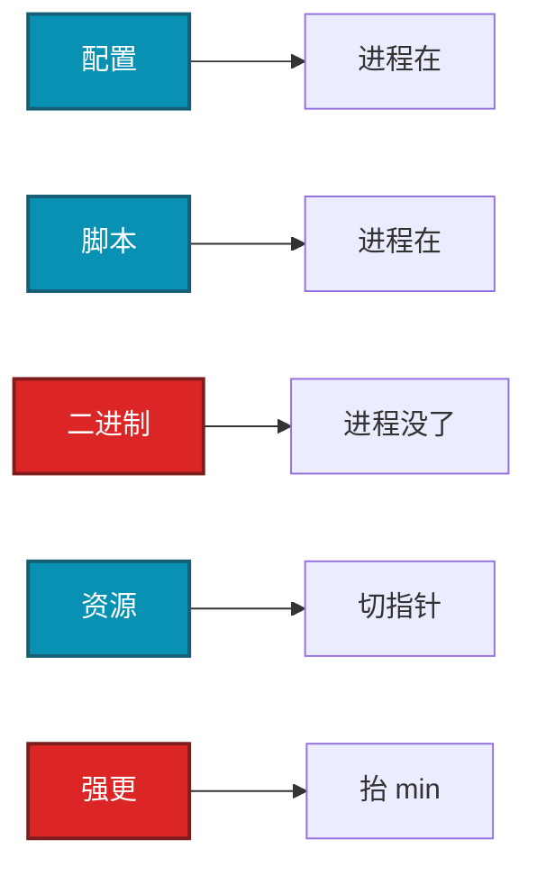

# 03｜热更新与版本发布 · 练习题

先对照 [知识点](知识点.md) **本章主线** 自己口述，再对答案。每题标了覆盖范围：

| 标记 | 含义 |
|------|------|
| **核心** | 不懂整章就没建立起来 |
| **必会** | 值班和面试都要能讲 |
| **常用** | 线上会反复碰到 |
| **常考** | 白板和追问的高频口径 |

## 本题目录

- [Q1 五类更新 / 热更 vs 停服更](#q1)
- [Q2 协议兼容与 min](#q2)
- [Q3 灰度](#q3)
- [Q4 客户端资源回滚](#q4)
- [Q5 CDN 指针顺序](#q5)
- [Q6 经济配错](#q6)
- [Q7 强更两段抬闸](#q7)
- [Q8 战斗 vs 登录发版](#q8)
- [Q9 热更回执](#q9)
- [Q10 版本号四元组](#q10)
- [Q11 脚本热更中的局](#q11)
- [合上书](#合上书)

---

## Q1

**★★★★★｜配置热更、脚本热更、二进制重启、资源热更、强更有什么差别？热更和停服更怎么分？**

**覆盖**：核心 · 必会 · 常考
**对应**：知识点 §3.1

### 场景

群里说「热更一下」。有人重载了配置，有人准备滚战斗镜像，有人在切 CDN 指针。没有人说这次改的是哪一类。

### 完整解答

**一句话**：先分五类更新，热更和停服更看进程在不在、端听不听、回滚能不能加载旧版。

先分类。配置：重载数值，进程不停，回滚最快。脚本：改逻辑不停服，进行中房间可能脏。二进制：必须摘流换镜像（停服更）。资源：客户端按清单拉包。强更：`min_client_version` 挡不兼容协议（停服更 / 挡老端）。



分界问三句：进程还在不在、已拿到的端会不会听、回滚是加载旧 version 还是只能向前修。蓝绿适合无状态登录，不适合房间钉死的战斗。先说这次改的是哪一类，再谈灰度。不要因为怕停服就把必须强更的协议改成热补丁；也不要改个活动图就抬 `min`。

### 再追问

脚本热更了战斗公式，正在打的局怎么办？——按房间切版本或维护后再补。一半人新公式一半人旧公式会出结算争议。已污染房间内存 → 该房间强制结算。

---

## Q2

**★★★★★｜协议怎么兼容？什么情况必须强更？`min` 放哪？**

**覆盖**：核心 · 必会 · 常考
**对应**：知识点 §3.4

### 场景

协议改了一个枚举含义，服务端已经上了。`min_client_version` 写在战斗进程里。老端能登录、能进大厅，进战斗才炸，背包被写坏。

### 完整解答

**一句话**：只加可选字段可热更，改含义/删必填/改握手必须强更，min 放登录目录。

只加可选字段、老端忽略。改含义、删必填、改握手必须强更。`min` 版本放登录 / 目录，不要进了战斗才判。

```
  可热更：新增可选字段 / 新消息号（老端丢弃，关键路径不能只走新消息）
  必须强更：改字段含义、改枚举、删必填、改加密握手
```

强更当天不同时改天经济数值，出问题无法归因。服务端先保留双协议，再抬 `min`；否则降 `min` 也进不去。版本号拆成端大版本 / 端资源 / 服配置，揉成一个自增数无法分层回滚。

### 再追问

已经抬 min 了，服务端不认老协议，怎么回？——先把服务端双协议加回或回滚服务端，再降 `min`。只降 `min` 是死门。所以两步必须同一变更设计。

---

## Q3

**★★★★★｜灰度按什么切？按 IP 为什么不行？5% 已经崩溃还全量吗？**

**覆盖**：核心 · 必会 · 常用
**对应**：知识点 §3.5

### 场景

灰度按源 IP 切 5%。加速器出口把灰度打成「某一批用户 100%」。崩溃率相对基线翻倍。有人说再观察一小时。

### 完整解答

**一句话**：灰度按 uid/服/渠道，不按 IP；崩溃翻倍立刻停，三类回滚不是一个按钮。

内网 → 指定服 → uid 哈希 → 渠道。加速器和 NAT 会毁 IP 比例。不要只用新注册号测兼容，他们没有老存档。全服组件没有「只灰度 S1」。

```
  观察 30～120 min（大版本 24h）
    崩溃率、登录/进战斗、错误码（协议 vs 资源 hash）
    支付、相对未灰度服的 CCU
  闸：崩溃翻倍 / 登录掉阈值 / 支付异常 → 立刻停
```

回滚闸提前写死。资源灰度最好独立指针，确认回源比再全量。三类回滚不是一个按钮：配置重载、清单指针、镜像 undo。

### 再追问

灰度 5% 已经出崩溃，你全量吗？——停灰度，回滚该类更新。分析是机型、资源 hash 还是协议。不「再观察一小时」。

---

## Q4

**★★★★★｜客户端资源回滚为什么比服务端难？能不能让端卸掉新资源？**

**覆盖**：核心 · 必会 · 常用
**对应**：知识点 §3.3

### 场景

新资源导致某机型闪退。CDN 指针已经切了 40 分钟，大量端已经下完。有人准备把指针改回去就宣布回滚完成。

### 完整解答

**一句话**：客户端包已落地，改指针管不了已装端，通常只能再发修复包向前兼容。

服务端配置 / 进程你能立刻改。客户端包已落到设备上，改指针只能管还没拉或再检查的人；已装新包的端常常必须再发一包向前修。

```
  服务端配置  --> 重载上一 version，分钟级
  服务端进程  --> 摘流 + 受控 undo
  CDN 指针    --> 改回旧 manifest + 预热旧包
  已装新资源的端 --> 一般不能卸，只能再发修复包向前兼容
```

回指针前确认旧包仍在边缘（预热）。经济数值已产出不是发版回滚，是停活动 + 数据修复（07）。

### 再追问

能不能让客户端卸掉新资源？——一般不能依赖。设计上资源要向前兼容，坏包就再发修复包。这是为什么资源也要灰度。

---

## Q5

**★★★★★｜CDN 指针和资源文件谁先切？部分地区新部分旧呢？**

**覆盖**：必会 · 常用 · 常考
**对应**：知识点 §3.1

### 场景

先改了 version 指针，包还在传源站。边缘全部 MISS，源站被全球回源打满。登录曲线变形，看起来像登录挂了。

### 完整解答

**一句话**：先上传预热 HIT 再切指针，先切指针再传文件等于全球回源。

先上传文件 → 预热抽检 HIT → 确认服务端兼容 → 再切小指针。先切指针再传文件 = 全球回源。

```
  对：上传 → 预热 HIT → 服务端兼容 → 切指针
  错：切指针 → 再传文件 → 全球回源（06）
```

指针短 TTL，文件 URL 带 hash、长 TTL。少覆盖同名、少全网 purge。失败指针打回，源站新文件先留着。

### 再追问

部分地区新部分旧？——指针被边缘缓存分裂，或源同步慢。查版本分布双峰，按 region 查 HIT，不先怪客户端。

---

## Q6

**★★★★★｜配置写错把掉落放大 100 倍，你的顺序？要不要关服？再热更乘 0.01 行不行？**

**覆盖**：必会 · 常用 · 常考
**对应**：知识点 §7

### 场景

活动掉落多写了一个零。十分钟高 V 背包变形。有人要再热更「掉落 ×0.01」当没发生。有人要立刻整服回档。

### 完整解答

**一句话**：经济配错先回配置停产出，再评估回档，不能热更×0.01 当没发生。

立刻回配置停产出 → 评估是否回档 → 支付和已消耗按 07 处理。不要再热更一个「再乘 0.01」当没发生。

```
  1. 回配置 / 关活动入口，停产出
  2. 产出还在刷 → 摘服或关入口
  3. 已停产出 → 不必全服维护，除非要整服回档
  4. 回档是数据动作，和发版回滚分开
```

监控应有产出相对基线的数量级告警。复盘加业务校验（概率和、上限）。

### 再追问

要不要关服？——产出还在刷就摘服或关活动入口。已经停产出则不必全服维护，除非要整服回档。继续热更只会让时间窗更乱，回档圈人更难。

---

## Q7

**★★★★☆｜强更两段抬闸怎么做？建议更新没人更怎么办？**

**覆盖**：必会 · 常用
**对应**：知识点 §5

### 场景

协议不兼容。有人想商店过审当天直接把 `min` 抬满，省事。iOS 过审还要几天。

### 完整解答

**一句话**：强更两段抬闸：过审→资源就位→双协议→建议更新→再抬 min。

商店过审 → 资源就位 → 服务端双版本 → 先建议更新看崩溃 → 再抬 `min`。一次抬满没有灰度，老端全堵登录。

```
  过审（iOS 按天，排期倒推）
    → CDN 资源就位
    → 服务端留双协议
    → 建议更新（看崩溃、覆盖率）
    → 覆盖率够再强制
```

强更不用于改活动图。乱强更按小时计收入和差评。

### 再追问

建议更新没人更怎么办？——活动奖励或登录弹窗促更，仍不抬 `min` 直到覆盖率够。覆盖率不够就抬 = 自己砍收入。

---

## Q8

**★★★★☆｜战斗服发版和登录服发版有何不同？能对战斗做金丝雀吗？**

**覆盖**：必会 · 常用 · 常考
**对应**：知识点 §3.1

### 场景

同一套 RollingUpdate 策略套到登录 Deployment 和战斗 Deployment。登录没事，战斗在线对局被砍。

### 完整解答

**一句话**：登录可滚动，战斗必须摘流等空 flush，混 RollingUpdate 会砍在线局。

登录无状态，可滚动 / 蓝绿。战斗先摘流等空，OnDelete。混一个 RollingUpdate 策略会砍在线对局。这是热更 vs 停服更在发布策略上的落地。

```
  登录 / 目录：蓝绿或滚动，就绪即切
  大厅：可滚动，Session 可重建
  战斗：摘流 → 等空或强制结算 → flush → 换镜像
```

### 再追问

能对战斗做金丝雀吗？——只能对新开房间金丝雀（匹配按版本分流），不能对已开房间切 5% 流量。进行中的局钉在旧进程上。

---

## Q9

**★★★☆☆｜热更回执没收齐怎么办？**

**覆盖**：必会 · 常用
**对应**：知识点 §4

### 场景

配置中心显示「已发布」。20% 进程没有回执。活动在部分服开了、部分服没开。

### 完整解答

**一句话**：热更回执不齐当失败，未回执实例重推或摘新进，规则分裂比晚开代价大。

当失败，不要假定全服生效。重推或摘掉未回执实例的新进。部分服新配置部分服旧，活动规则会分裂。

指令失败要可重入：重复「加载 X」必须幂等，不能叠加成两份活动。热更通道要鉴权、审计、限频，不要暴露公网或共用玩家 GM 令牌。发布指令和配置内容必须分开。

### 再追问

回执一直不齐，能先开放活动吗？——不能。未回执实例要么重推，要么从匹配 / 目录摘掉新进。规则分裂比晚开十分钟代价大。

---

## Q10

**★★★☆☆｜版本号你怎么拆？禁 latest 还不够时要钉死什么？**

**覆盖**：必会 · 常考
**对应**：知识点 §5

### 场景

变更单写着「跟测试服现在一样」。线上镜像是 latest，配置是人手 scp 的，CDN 指针和 `min` 没人说得清。

### 完整解答

**一句话**：版本号拆端大版本/资源/服配置，变更单钉死 digest+配置+指针+min。

端大版本 / 端资源 / 服配置分开。强更看端大版本；热更资源看资源号；出问题能判断哪一层。揉成一个自增数无法回滚分层。再加上镜像 digest，同一张变更单钉死四元组：镜像、配置 version、资源指针、`min_client_version`。禁 latest，禁口头对齐。预发和线上拉同一 artifact，不在线上再改一份。

### 再追问

合服前版本号怎么用？——两边二进制、配置、协议必须一致，否则映射脚本 dry-run 都不要跑（02）。口头「都是最新」不算一致。

---

## Q11

**★★★★☆｜热更通道和幂等你怎么设计？脚本改不了什么？**

**覆盖**：必会 · 常用
**对应**：知识点 §4

### 场景

热更后台共用玩家 GM 令牌，挂在公网。有人对同一活动配置点了两次「加载 X」，线上叠成两份活动。另一次有人想用热补丁改协议字段含义，避免强更。

### 完整解答

**一句话**：热更通道鉴权审计幂等，脚本能改逻辑改不了协议字段含义。

热更通道要鉴权、审计、限频，不要暴露公网或共用玩家 GM 令牌。内容先落到可回滚存储，指令只说加载 X；重复加载必须幂等。脚本能改分支逻辑，改不了结构体布局和协议字段含义——改含义必须强更，不要因为怕停服硬热补。

### 再追问

回滚是上机器改文件吗？——不是。回滚是再发「加载 X-1」。派人 SSH 改文件不可审计、不可重入。

---

## 合上书

- [ ] 能先分五类，并用三句区分热更 vs 停服更
- [ ] 能说出协议何时必须强更，`min` 放登录 / 目录
- [ ] 能按 uid / 服灰度，5% 崩溃立刻停
- [ ] 能说明切指针前预热，客户端包体常常只能向前修
- [ ] 能处理掉落写错：停产出，不 ×0.01
- [ ] 能把登录滚动和战斗摘流拆开，金丝雀只对新开房间
- [ ] 能对账回执、钉死四元组，热更通道鉴权幂等
