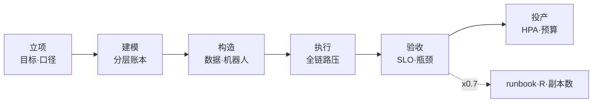
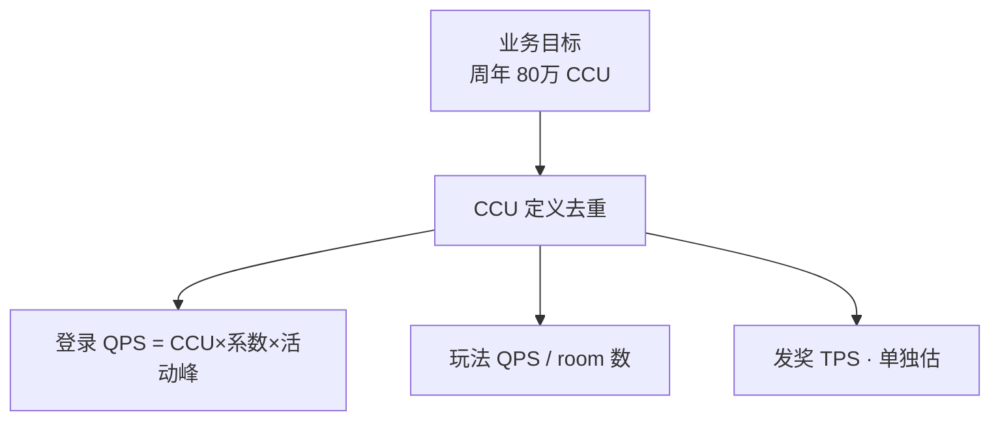
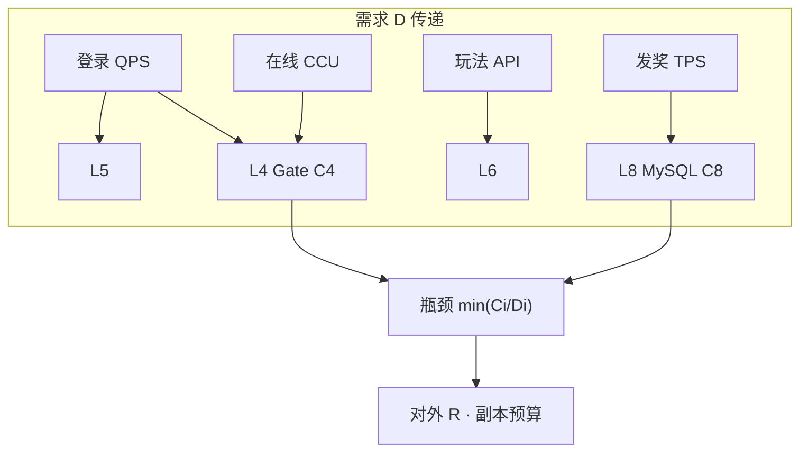
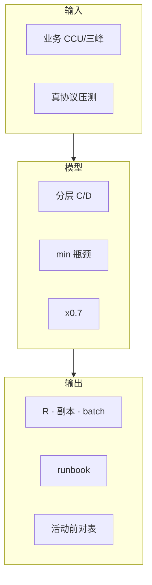
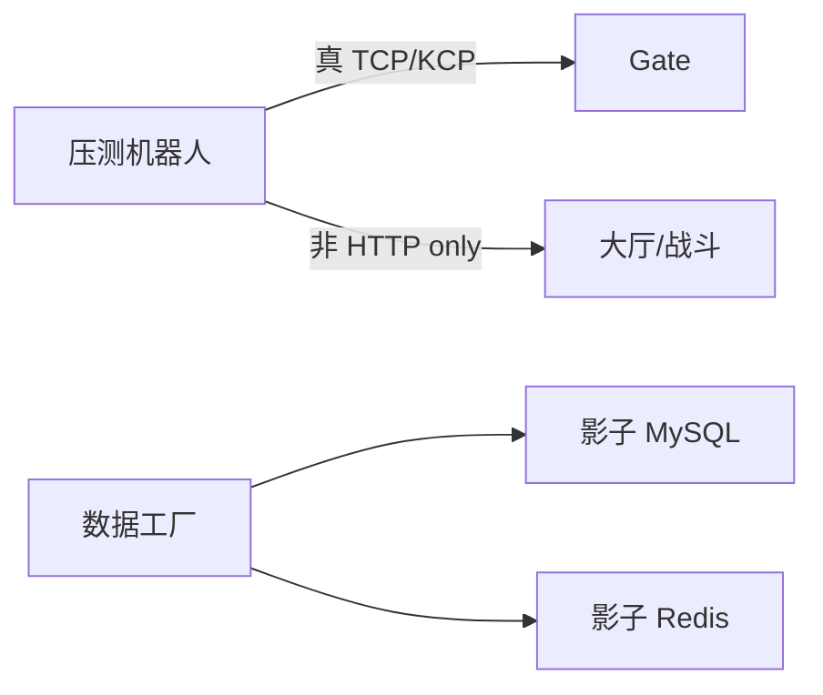
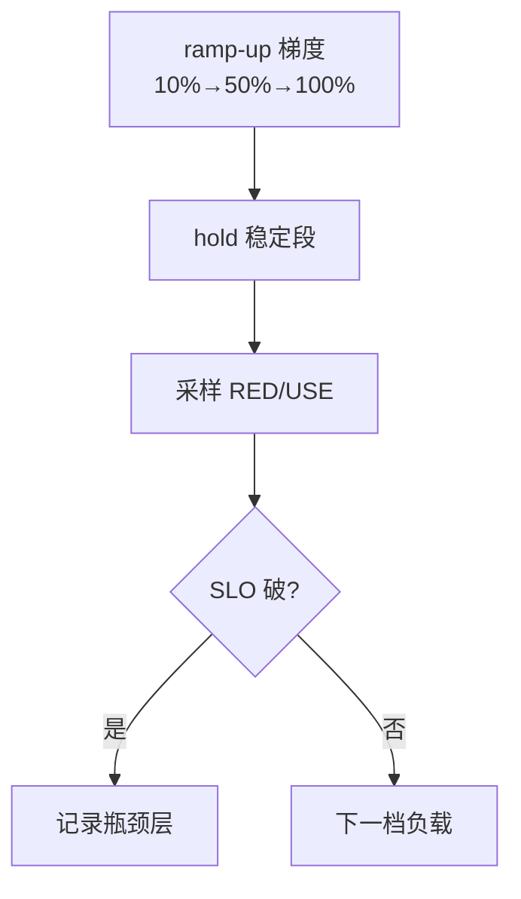
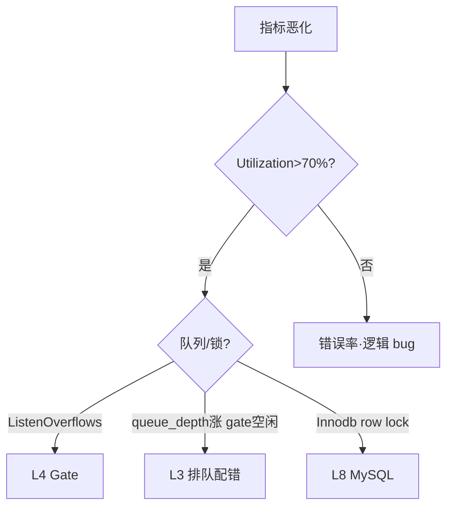
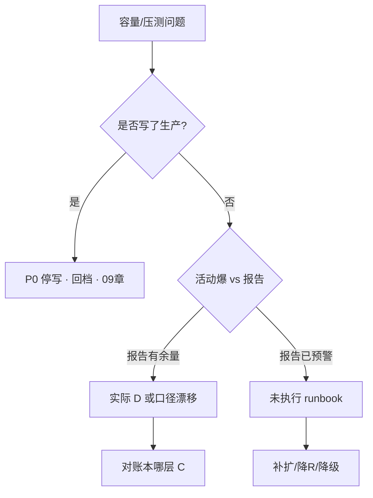

# 全链路压测与容量模型

> 运营喊「撑 50 万 CCU」——有人只压了 Login HTTP，报告写 Gate 还能再扛 3 倍；活动当晚 fd 打满、创角锁死。另一次对着生产主库跑发奖脚本，回档用了两天。
> **本章回答**：从零建立 **容量模型** 怎么做、**全链路压测** 怎么执行与验收、瓶颈怎么定责、结果怎么写进活动/开服 runbook。
> **不讲**：登录六跳与 ticket 细节 → [02](../02-登录排队与选服/)；活动三峰降级 → [03](../03-活动高峰与压测/)；K8s HPA/PDB 语法 → [03-05 HPA](../../03-Kubernetes/05-工作负载控制器/)；MySQL 索引调优 → [02-01 MySQL](../../02-中间件与数据库/01-MySQL/)；通用 RED/USE → [21-性能方法论](../../01-基础底座/21-性能方法论-USE与RED/)。

**标记**：🎯重点 · 🔥难点 · ⭐常考 · 🔧实操

---

## 一、一张图：一次压测的一生

> 🎯 **一句话**：容量建设是 **立项 → 建模 → 构造 → 执行 → 验收 → 投产** 六段——跳过任一段，活动容量就是猜。



**读图**：

- **从左到右是项目时间线**：不是「压一次就完」，而是 **压测结果 → 安全系数 → 日常/活动配置** 闭环。
- **建模（第三节）** 和 **执行（第五节）** 是运维面试最爱问的两段——「你怎么知道要多少 Gate」必须能追溯到压测报告某一页。
- 监控验收照 **USE/RED**（[21](../../01-基础底座/21-性能方法论-USE与RED/)）：Utilization 饱和、Saturation 队列、Errors 失败率。

---

## 二、立项：容量目标与口径统一 ⭐

> 🎯 **一句话**：先写清 **CCU、登录 QPS、DAU** 三个口径和 **活动系数**，再谈 Pod 数——口径混了，50 万 CCU 可以算出 50 种 Gate 数。

### 核心指标内联定义

- **CCU（Concurrent Users）**：同时在线、已完成登录在大厅或战斗中的角色数（去重规则以产品为准，是否扣机器人要写进文档）。
- **DAU（Daily Active Users）**：日活，与 CCU 关系 `CCU ≈ DAU × 同时在线率`（手游峰值同时在线率常见 8%～15%）。
- **登录 QPS**：每秒完成 **账号→…→大厅** 的新登录或重连请求数，与 CCU **非线性**——重连潮、整点推送会拉高（见 [03](../03-活动高峰与压测/)）。



**读图**：**一个 CCU 目标必须拆三条线**——登录、玩法、写——不能只有一个数字交给运维。三条线的瓶颈层完全不同：登录卡 L4 Gate、玩法卡 L6/L7、发奖卡 L8 MySQL。

**立项文档最小字段** 🔧：

```text
目标 CCU / 分服 CCU 上限
活动登录峰系数（相对日常）
核心玩法并发 room 数
结算写 TPS 峰值 · 是否全服同一秒
SLO：登录成功率 / P99 延迟 / 零资损
环境：预发全链路 · 数据规模 ≈ 生产 30%+
```

> ⚠️ **别混**：**压测 CCU**（机器人在线）≠ **压测登录 QPS**——可以 10 万机器人 **慢慢进**（低 QPS），也可以 1 万机器人 **秒进**（高 QPS）；两种测的是不同瓶颈。前者测 **稳态 fd/内存**，后者测 **登录 funnel 吞吐**。

> 📝 **面试**：「压测 CCU 怎么来的？」——「先统一 CCU 口径，再拆登录/玩法/写三峰，每峰单独目标+SLO，不是 Pod 拍脑袋。」

### 与运营/策划对齐的口径会议 🔧

立项阶段必须 **书面确认** 下列歧义，否则压测报告无法签字：

```text
「80 万在线」= CCU 峰值还是 DAU？
活动是否全服同一秒结算？
是否含机器人/工作室账号？
分服峰值还是全服加总？
```

> 🔍 **现场**：口径文档存在性检查

```bash
test -f /docs/capacity/ccu_definition.md && grep -E 'CCU|DAU|bot' /docs/capacity/ccu_definition.md
# CCU=concurrent  DAU=daily  bot=included   ← 口径已书面定义
# 若文件不存在则立项未闭环，拒签压测计划
```

---

## 三、建模：分层容量账本 🔥⭐

> 🎯 **一句话**：**容量模型 = 分层账本**——每层写 **容量 C、需求 D、利用率 U、安全系数 α**，最窄层决定全链路 R。

### 标准分层（游戏全链路）

```text
L0 CDN/版本        （带宽 · QPS）
L1 账号/Login HTTP （无状态 · DB 池）
L2 目录            （读缓存 · 不可 500）
L3 排队            （按服 R 发票）
L4 Gate            （长连接 fd · 内存）
L5 大厅/匹配       （CPU · DB 读）
L6 战斗/跨服       （空 room · CPU tick）
L7 Redis           （QPS · 热 key · 内存）
L8 MySQL 主库      （写 TPS · 行锁）
```

> 💡 **打个比方**：容量像水桶链——最窄的那截决定流速，加粗别的桶不增加出水。扩非瓶颈层就是「给粗桶换了个更粗的，出水没变」。



**读图**：**瓶颈层** 决定排队 **drain_rate**、Gate **副本数**、MySQL **batch 大小**——扩非瓶颈层是假容量。一条登录请求的 D 同时压到 L1/L3/L4/L5，但只有最先饱和的那层是瓶颈。

### 单层公式

```text
可用容量 C_layer = 压测饱和点 × α（α 典型 0.7）
需求 D_layer     = 业务目标 × 活动系数
余量 headroom    = C_layer - D_layer  （应 >0）
全链路 R          = min(C_i / D_i) × 满足SLO的最大负载
```

**Gate 示例**：

```text
压测：单 Gate 进程 4 万 ESTAB @ CPU 70% · 内存 60%
集群 10 台 → C_raw = 40万连接
C_gate = 40万 × 0.7 = 28万 CCU 连接预算
若目标 CCU 30万 → headroom = 28万 - 30万 = -2万 → 缺口
→ 加 Gate 或降 per-process 内存
```

**MySQL 写示例**：

```text
压测：主库 8000 write TPS @ Threads_running 80
发奖需求：5000 TPS 持续 10min
C = 8000 × 0.7 = 5600
headroom = 5600 - 5000 = 600 → 余量不足
→ 分批/延迟结算，不能硬顶
```

> 🔍 **现场**：容量表在不在 runbook

```bash
test -f /ops/runbook/capacity_ledger.yaml && yq '.layers[] | .name + " " + .C + " " + .D' /ops/runbook/capacity_ledger.yaml | head
# gate_connections 280000 300000   ← D>C 活动前必须动作
# login_drain_rate 1200 1000        ← headroom 充足
# 若文件不存在 → 容量未建模，活动靠猜
```

> ⚠️ **别混**：**Kubernetes requests/limits** 是调度单位，**不是**业务容量 C——C 来自压测饱和点，requests 只决定 Pod 能不能被调度到节点上。一个 Gate Pod request 4C/8G 不等于它能扛 4 万连接，后者要压测才知道。见 [03-05](../../03-Kubernetes/05-工作负载控制器/)。

> ⚠️ **别混**：**压测最大值** 不是 **投产目标**——投产 = 最大值 × α。最大值是实验边界，投产是 SLA 承诺。

> 📝 **面试**：「容量模型长什么样？」——「分层账本 L0～L8，每层 C/D/U，min 层定 R 和副本，α=0.7。」

### 收束：容量模型凭什么可复盘



**读图**（分组背）：

- **输入**：口径统一 + 影子库压测——输入错了，整个模型白建。
- **模型**：分层账本，min 层定旋钮——不是每层都扩，只扩瓶颈层。
- **输出**：可执行数字写 runbook，活动前 grep 对表——数字不在 runbook 里等于没做。

> ⚠️ **别混**：容量模型 **不保证**「永不故障」——保证 **知道先坏哪层、旋钮在哪**。故障来了能 60 秒定位到哪层 C 小于 D，而不是全家桶加副本。

> 📝 **面试**：背三句——「分层 C/D · min×0.7 · 写进 R 和副本表」。追问「凭什么复盘」——「因为每层 C 有压测报告页码可追溯，D 有口径文档可查，偏差 >15% 触发补压。」

---

## 四、构造：流量机器人与数据工厂 🔥⭐

> 🎯 **一句话**：**全链路压测** 必须用 **真协议机器人** + **规模相当的数据**——Mock HTTP 只配测 Login，测不出 Gate 粘包、战斗 room、MySQL 行锁。

### 机器人（bot）能力矩阵

| 能力 | 测哪层 | 没有则漏测 |
|------|--------|------------|
| 渠道/账号登录 | L1 | 账号 DB 池 |
| 选服+排队+ticket | L2-L3 | drain_rate |
| Gate 长连接+心跳 | L4 | fd · 半连接 |
| 进大厅+创角 | L5-L8 | 行锁 |
| 匹配+进战斗 tick | L6 | CPU · room |
| 活动 API 循环 | L6-L7 | 热 key |
| 结算发奖脚本 | L8 | 写尖刺 |



**读图**：机器人必须 **走 Gate 长连接**——只 curl Login 是假压测。bot 和数据工厂是两个独立工厂：bot 造流量，数据工厂造存量。

> 💡 **打个比方**：HTTP 压 Login 像只试了大门弹簧，没试电梯、走廊、房间——真链路要让人走进去坐下打仗才算压过。

**数据工厂**：

- 账号/角色/背包 **量级** 达到生产 30%+（索引选择性才真实）
- **影子库**：从生产脱敏 dump + 定期刷新；**禁止**压测写生产主库
- 公会/排行 **预置** 热数据，否则压测「假快」——排行表只有 100 行时 Redis 命中率虚高

> 🔍 **现场**：压测环境隔离检查

```bash
mysql -h mysql-shadow -e "SELECT COUNT(*) FROM role;"
# 8500000   ← 量级够；若只有 1万行，创角索引压不准

grep -r 'prod.mysql' /opt/loadtest/config/ && echo 'LEAK!' || echo 'shadow ok'
# shadow ok   ← 配置干净，未连生产
# 若输出 LEAK! → 立即停压测，检查是否已写生产
```

> ⚠️ **别混**：**录制回放 HTTP** 测不出 **有状态 room** 和 **长连接心跳**——录制回放是无状态请求序列，不维护 Gate session，进不了战斗 tick。要 stateful bot。

> 📝 **面试**：「压测数据哪来？」——「影子库脱敏+工厂造数，量级够；写永不打生产主库。」

---

## 五、执行：全链路压测怎么跑 🔧🔥⭐

> 🎯 **一句话**：压测 **分场景 ramp**——先 **soak（浸泡）** 找泄漏，再 **spike** 找尖刺，每阶段 **固定时长 + 固定指标采样**。

### 场景模板

```text
S1 基线 soak：70% 目标 CCU · 2h · 看内存泄漏/连接泄漏
S2 登录 spike：0→目标登录 QPS · 5min · 看排队/Gate SYN
S3 玩法 spike：活动 API · 目标 QPS · 10min · CPU/热 key
S4 发奖 spike：结算 batch · 目标 TPS · 30min · 主库锁
S5 混合：三峰叠加 · 20min · 定 min 瓶颈层
```



**读图**：**不要秒级从 0 拉到 100%**——中间档定位「从哪层开始非线性恶化」。10% 时一切正常，50% 时 L4 开始队列堆积，100% 时 L8 先挂——这条恶化曲线比一个「最大 QPS」数字有价值得多。

### 执行纪律

- 变更 **冻结**（压测期无发布）——压测中发布会改变 C，数据作废
- 监控 **双写**：压测平台 + 生产同构 Prometheus（预发）
- **abort 条件**：主库 Threads_running>200、错误率>1%、资损苗头——任一触发立即停

> 🔍 **现场**：压测中控

```bash
curl -sS 'http://loadtest:9090/api/v1/status' | jq '.phase, .target_qps, .actual_qps, .abort'
# "login_spike"   ← 当前阶段
# 8000            ← 目标 QPS
# 7920            ← 实际 QPS，达标
# false           ← 未触发 abort

curl -sS 'http://prom:9090/api/v1/query?query=login_funnel_ratio{stage="gate"}' | jq '.data.result[0].value[1]'
# "0.996"   ← gate 段 SLO 达标（≥99.5%）
```

> 📝 **面试**：「全链路压测和接口压测区别？」——「真协议走 Gate+room+主库写；分场景 spike/soak；找 min 瓶颈层写进 R。」

### 压测环境与生产同构 checklist ⭐

```text
内核：somaxconn · ip_local_port_range · ulimit 与线上一致
Gate：buffer 大小 · 心跳间隔 · ticket 校验逻辑同版本
MySQL：参数 template 同生产 · 行数 30%+
Redis：cluster 分片数一致 · 热 key 预置
K8s：requests/limits 比例同生产 · 网络插件同 CNI
```

> 🔍 **现场**：预发与生产 kernel 差

```bash
sysctl net.core.somaxconn net.ipv4.ip_local_port_range
# net.core.somaxconn = 4096       ← 与生产一致
# net.ipv4.ip_local_port_range = 32768 60999   ← 可用端口范围
# 与生产 sysctl 导出 diff，差异项压测前修齐
```

### 阶梯加压记录表（交付模板）

| 档位 | 目标 QPS/CCU | hold | gate_ok% | 瓶颈层 |
|------|--------------|------|----------|--------|
| 10% | 8000 | 10min | 99.8% | - |
| 50% | 40000 | 10min | 99.6% | L4 |
| 100% | 80000 | 10min | 99.1% | L4/L8 |

> ⚠️ **别混**：**预发 CPU 比生产强** 会高估 C——同构含 **单核性能与磁盘 IOPS**，不是只同 K8s yaml。预发用 c5.4xlarge、生产用 c5.2xlarge，同一份压测结果差 40%。

---

## 六、验收：SLO、瓶颈与报告 🔥⭐

> 🎯 **一句话**：压测交付物不是「QPS 最大值」，而是 **每层 C、瓶颈层、0.7 后 R、副本预算表**——能直接写进 [02](../02-登录排队与选服/) 的 drain_rate。

### 瓶颈定责表（示例）

| 场景 | 瓶颈层 | 现象 | 建议 |
|------|--------|------|------|
| 登录 spike | L4 Gate | ESTAB 满、SYN-RECV 涨 | +Gate 或降 R |
| 登录 spike | L8 MySQL | 创角锁等待 | 创角限流/拆索引 |
| 玩法 | L7 Redis | 单 key QPS 顶 | 拆 key |
| 发奖 | L8 MySQL | Threads_running 200 | 降 batch |



**读图**：先看 Utilization 是否到 70%——到了再看是哪种 Saturation。**queue_depth 涨但 Gate 空闲** 是经典误判：看起来是 L4 瓶颈，实则是 L3 排队 drain_rate 配低了，Gate 根本没收到请求。见 [02](../02-登录排队与选服/)。

> 💡 **打个比方**：瓶颈定责像水管堵了找堵点——不是哪里水多就是堵点，要看哪里 **该来水没来**（L3 没发水给 L4）和哪里 **水溢出来了**（L4 fd 满）。

**SLO 验收示例**：

```text
登录：hall_ok/login_total ≥ 99.5% @ 目标 QPS
Gate：ticket 校验失败 < 0.1%
玩法：P99 < 500ms @ 目标 API QPS
发奖：0 重复 · 主库 TPS 可持续 30min
```

> 🔍 **现场**：报告是否可执行

```bash
grep -E 'drain_rate|gate_replicas|mysql_batch' /docs/loadtest/2026_anniversary_report.md
# drain_rate: 840/min   ← 有具体数字
# gate_replicas: 22     ← 有副本建议
# mysql_batch: 200      ← 有 batch 建议
# 若 grep 无结果 → 报告不可执行，拒签上线
```

> ⚠️ **别混**：**压测最大值** 不是 **投产目标**——投产 = 最大值 × 0.7。压测压到 10 万连接不挂，投产只能按 7 万算。

---

## 七、投产：弹性、预算与复盘 ⭐

> 🎯 **一句话**：压测结论 **投产** = 写进 **HPA max、Gate 副本基线、排队 R、MySQL batch**——活动前按表执行，不是重新猜。

```text
Gate：replicas_min/max · 连接告警阈值
排队：drain_rate per server_id
战斗：empty_room 预开公式 = 匹配QPS × P99等待 × 1.5
HPA：仅对 L1/L4/L6 无状态或空 room 层；战斗按 room 指标自定义
MySQL：发奖 worker 并发 · batch · sleep
```

**成本（budget）**：

```text
日常：按 70% C 买资源
活动：临时扩容 +7d 保留 · 或云按量
```

**复盘（postmortem）**：

- 压测未覆盖的路径（新玩法、新渠道）——活动后补进下轮压测场景
- 生产偏差 >15% → 补压或调 α——偏差大说明模型和现实脱节

> 🔍 **现场**：HPA 与容量表一致吗

```bash
kubectl get hpa gate-prod -o jsonpath='{.spec.maxReplicas}'
# 30   ← HPA max=30

grep 'gate_max' /ops/runbook/capacity_ledger.yaml
# gate_max: 30   ← 两处一致
# 若不一致 → 配置漂移，谁改的查 git blame
```

### 压测报告最小交付清单 🔧

报告必须包含（缺一项不可签字）：

```text
① 口径文档 CCU/三峰目标
② 每场景 spike 曲线 + 瓶颈层 Lx
③ 饱和点 raw 值 + ×0.7 后 C
④ drain_rate / gate_replicas / mysql_batch 建议值
⑤ 已知缺口与活动前 action item
```

> 🔍 **现场**：评审报告

```bash
grep -cE '瓶颈层|drain_rate|alpha.*0\.7' /docs/loadtest/latest_report.md
# 4   ← 至少各出现 1 次
# 若 0 → 报告缺关键交付物，退回补写
```

---

## 八、作战：压测事故与容量偏差定责 🔧

> 🎯 **一句话**：**打生产、口径错、只压 HTTP** 三类人为事故；**活动实际偏差** 先对表哪层 **D>C**。

### 决策树



**读图**：第一步永远先排除「写了生产」——这是 P0，不是容量问题是数据安全问题。排除后看活动实况与报告的关系：报告有余量却挂了，说明实际 D 漂移了（口径变了、重连率高了）；报告已预警却没动作，是 runbook 未执行。

| 现象 | 先做 | 别做 |
|------|------|------|
| 压测打生产主库 | 停脚本、查 binlog | 继续「测完再说」 |
| Login 压测漂亮活动 Gate 挂 | 查是否真走 Gate | 再加 Login |
| 报告无 drain_rate | 拒签上线 | 凭 CCU 估 R |
| soak 2h 内存涨 | 查连接/session 泄漏 | 直接上生产 |
| 瓶颈层判错 | 重看 spike + USE | 全家桶加副本 |

### 60 秒剧本 🔧

```text
0–10s  问：预发还是生产 · 写库还是只读 · 当前 D 层指标
10–30s 对 capacity_ledger：哪层 C<D · 最近是否改口径
30–45s 压测报告瓶颈层 vs 现网 Prometheus 同层 USE
45–60s 出动作：扩/降R/降级/停错误压测；生产写事故升级
```

> 🔍 **现场**：活动容量偏差 60 秒排查

```bash
# 0-10s: 看当前 Gate 连接
ss -ant state established '( sport = :4103 )' | wc -l
# 285000   ← 接近 C=280000，headroom 几乎为零

# 10-30s: 对账本
yq '.layers[] | select(.D > .C) | .name + " OVER"' /ops/runbook/capacity_ledger.yaml
# gate_connections OVER   ← 这层先挂

# 30-45s: 看报告瓶颈层 vs 现网
curl -s 'http://prom:9090/api/v1/query?query=sum(rate(login_errors[5m]))' | jq '.data.result[0].value[1]'
# "0.012"   ← 错误率 1.2%，超 abort 线

# 45-60s: 止血
kubectl scale deploy gate-prod --replicas=30   ← 扩瓶颈层
```

---

## 九、收口

### 命令速查 🔧

```bash
# 压测中控
curl -sS 'http://loadtest:9090/api/v1/status' | jq .

# Gate 容量
ss -ant state established '( sport = :4103 )' | wc -l   # ← ESTAB 连接数
ss -s | awk '/TCP:/'                                     # ← TCP 总览

# MySQL 写容量
mysql -e "SHOW GLOBAL STATUS LIKE 'Threads_running';"   # ← 写压力
mysql -e "SHOW GLOBAL STATUS LIKE 'Com_commit';"         # ← 提交频率

# 排队 R 验证
redis-cli HGETALL queue:config:SERVER_ID                 # ← drain_rate 配置

# 容量表
yq '.layers[] | [.name,.C,.D,.alpha] | @tsv' /ops/runbook/capacity_ledger.yaml

# 误连生产检查
grep -r 'prod' /opt/loadtest/config/                     # ← 应无输出
```

### 面试锚点

| 问 | 30 秒答 |
|----|---------|
| 容量模型是什么？ | 分层账本 L0-L8，每层 C/D，min 瓶颈×0.7 定 R |
| 全链路压测要点？ | 真协议·Gate·room·主库写；分登录/玩法/发奖场景 |
| 为何不用 HTTP 压测代表全链路？ | 测不出 fd、room、行锁、热 key |
| 安全系数为何 0.7？ | 留 headroom 给抖动、发布、弱网重连 |
| 压测交付物？ | 瓶颈层+drain_rate+副本+batch，不是一句 QPS |
| 影子库作用？ | 量级真实·不写生产 |
| soak 测什么？ | 泄漏、长时间 degradation |
| 活动前怎么用报告？ | 对 capacity_ledger，D 不得大于 C |

### 易错对照

- 错：CCU 目标直接除 Pod → 对：分层 min 瓶颈
- 错：只压 Login HTTP → 对：Gate 长连接+大厅+战斗
- 错：压测最大值当投产 → 对：×0.7
- 错：压测写生产 → 对：影子库
- 错：从库参与写压测 → 对：写只打主库
- 错：无 soak 直接 spike → 对：先浸泡找泄漏
- 错：报告不写 drain_rate → 对：必须可执行
- 错：requests/limits 当容量 C → 对：C 来自压测饱和点

### 数字墙

```text
安全系数 α：0.7（常用）· 0.6 更保守 · 0.8 需强监控
soak 时长：≥2h @ 70% 目标负载
spike ramp：10%→50%→100% 每档 ≥10min
影子库数据量：≥生产 30% 行数 · 核心表必须有
Gate 压测：看 ESTAB + SYN-RECV + 内存 · 不单看 CPU
MySQL 写饱和：Threads_running 70～80% 为压测拐点参考
登录压测：必须含排队+ticket · 纯 HTTP 不算全链路
bot 心跳间隔：与线上一致 · 30～90s
压测 abort：错误率>1% 或 主库 Threads>200 或 资损
容量复盘偏差：生产超报告 15% 触发补压
```

### capacity_ledger.yaml 最小示例 🔧

账本要 **机器可读**——活动前脚本 diff `D>C` 自动告警：

```yaml
layers:
  - name: gate_connections
    C: 280000
    D: 300000
    alpha: 0.7
    source: loadtest_2026_q1_spike_login
  - name: login_drain_rate_s1001
    C: 1200
    D: 1000
    unit: per_minute
    source: loadtest_2026_q1_spike_login
  - name: mysql_write_tps
    C: 5600
    D: 5000
    alpha: 0.7
    source: loadtest_2026_q1_spike_settle
```

```bash
yq '.layers[] | select(.D > .C) | .name + " OVER"' /ops/runbook/capacity_ledger.yaml
# gate_connections OVER   ← 活动前必须处理
```

### USE/RED 映射到分层

| 层 | Utilization | Saturation | Errors |
|----|-------------|------------|--------|
| L4 Gate | fd/CPU | SYN-RECV | ticket 失败 |
| L3 排队 | drain 使用率 | queue_depth | 出队超时 |
| L8 MySQL | Threads_running | lock wait | 死锁 |

---

## 合上书

- [ ] **默画**一次压测的一生：立项→建模→构造→执行→验收→投产，标出 0.7 在哪段乘。
- [ ] 口述 **分层账本 L0-L8** 和 **min 瓶颈 ×0.7** 怎么得到 **drain_rate**。
- [ ] 说清 **真协议压测** 与 **HTTP 压 Login** 漏测什么（fd、room、行锁、热 key）。
- [ ] 背 **三场景 spike**：登录、玩法、发奖各盯哪层 USE。
- [ ] 解释 **soak 2h** 找什么（泄漏），**spike** 找什么（饱和点）。
- [ ] **影子库** 三条纪律（量级、脱敏、不写生产）。
- [ ] 压测 **交付物清单**——报告里必须有的五个字段。
- [ ] 「活动 Gate 挂了但 Login 压测过」**定责**路径。
- [ ] **60 秒**对 capacity_ledger 判断 C 与 D 的剧本。
- [ ] 口述 **投产** 如何把报告写进 HPA max 和排队 R。
- [ ] 解释 **USE** 在 Gate 层看哪两个 S（Saturation 队列、Utilization fd/CPU）。
- [ ] **口径会议** 四条必问（CCU vs DAU、是否同时结算、机器人、分服加总）。
