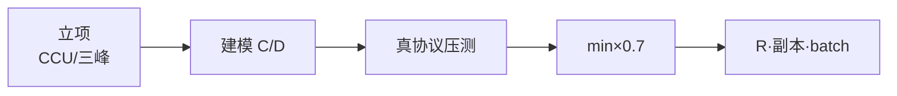
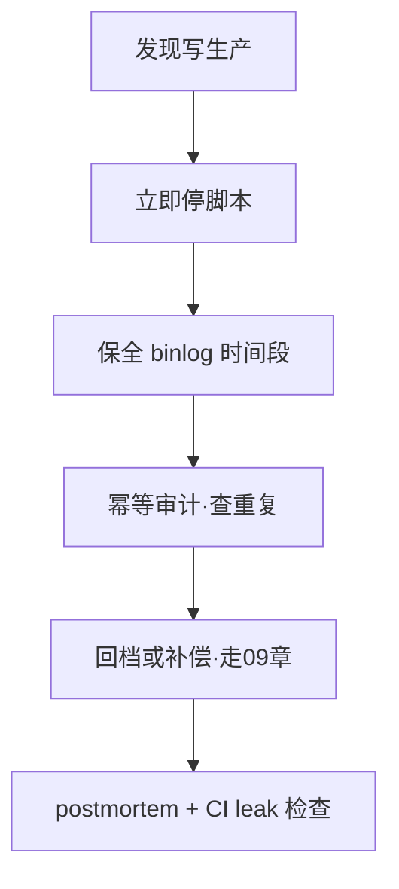

# 04｜全链路压测与容量模型 · 练习题

开始做题前，先给大家一个小建议：合上知识点，对着**第一节的主图**，把「一次压测的一生」从立项到投产口述一遍。能顺下来，下面这些题你会发现大半都会了；卡壳的地方，就是你该回去重读的那一节。

做题的方式也建议改一下：每道题**先看标题和场景，自己口述一遍答案，再往下看「完整解答」对答案**。直接看解答，容易产生「我会了」的错觉——能讲出来才是真的会。

| 标记 | 含义 |
|------|------|
| **核心** | 不懂整章就没建立起来 |
| **必会** | 值班和面试都要能讲 |
| **常用** | 线上会反复碰到 |
| **常考** | 白板和追问的高频口径 |

题目的顺序也是有意排的：Q1～Q4 先钉立项与建模；Q5～Q8 讲构造与执行；Q9～Q14 收尾到验收、投产与定责。

## 本题目录

- [Q1 50 万 CCU 容量规划](#q1)
- [Q2 为何 0.7](#q2)
- [Q3 HTTP 压 Login 够吗](#q3)
- [Q4 影子库纪律](#q4)
- [Q5 三场景 spike](#q5)
- [Q6 soak 测什么](#q6)
- [Q7 瓶颈层验证](#q7)
- [Q8 drain_rate 从哪来](#q8)
- [Q9 压测打生产](#q9)
- [Q10 CCU 口径会议](#q10)
- [Q11 USE 映射](#q11)
- [Q12 活动容量否决](#q12)
- [Q13 60 秒容量偏差](#q13)
- [Q14 全链路压测面试综合](#q14)
- [合上书](#合上书)

---

## Q1

**★★★★★｜你怎么做 50 万 CCU 容量规划？**

**覆盖**：核心 · 必会 · 常考 ｜ **对应**：知识点 [一、一张图：一次压测的一生](知识点.md)

### 场景

面试官要你从零讲容量，不是报 Pod 个数。有人准备直接说「50 万除以单 Pod 5 万 = 10 个 Pod」。

先自己试试：不看下面，先口述一遍你的答案，再往下对。

### 完整解答

> 🎯 **一句话**：**立项口径 → 分层账本 L0-L8 → 真协议压测 → min 瓶颈 ×0.7 → 写 runbook**。



六段闭环：先统一 CCU/DAU/QPS 口径，再按 L0-L8 分层写 C 和 D，用真协议 bot 走 Gate+room+主库写，找到 min 瓶颈层饱和点，乘 0.7 得到投产 R，最后写进 drain_rate/副本/batch。

> 📝 **面试**：六段闭环，交付物是 **可执行数字** 不是「整体良好」——报告里必须有 drain_rate、gate_replicas、mysql_batch 三个具体值。

### 再追问

**只有 CCU 一个数？**——拒签，必须先拆三峰（登录 QPS、玩法 room 数、发奖 TPS），三峰瓶颈层不同，一个数字压不了。见 [03](../03-活动高峰与压测/)。**不要**直接除 Pod。

---

## Q2

口径统一：CCU 怎么定义。


**★★★★☆｜为什么安全系数是 0.7 不是 1.0？**

**覆盖**：必会 · 常考 ｜ **对应**：知识点 [三、建模：分层容量账本](知识点.md)

### 场景

开发说压测最大值 10 万连接没挂，想按 10 万投产。有人觉得留 30% 浪费。

先自己试试：不看下面，先口述一遍你的答案，再往下对。

### 完整解答

> 🎯 **一句话**：留 **headroom** 给弱网重连、发布窗口、抖动——投产 = 饱和点 × **α≈0.7**。

```text
C = C_sat × 0.7
10万饱和 → 投产 7万连接预算
headroom = 10万 - 7万 = 3万（留给突发）
```

> ⚠️ **别混**：最大值是 **实验边界**，不是 **SLA 承诺**。实验里没有弱网重连洪峰、没有发布抖动、没有多服同时排队。

### 再追问

**0.8 行不行？**——监控强、活动少可以；开服/周年建议 0.6-0.7。0.8 意味着只有 20% 余量，一次发布+一波重连就吃完了。**不要**在开服日赌 0.8。

---

## Q3

就是分层账本怎么建。


**★★★★★｜只压 Login HTTP 为什么不够？**

**覆盖**：核心 · 必会 · 常考 ｜ **对应**：知识点 [四、构造：流量机器人与数据工厂](知识点.md)

### 场景

压测报告 Login 8 万 QPS 通过，活动 Gate fd 仍满。有人准备加 Login 机器。

先自己试试：不看下面，先口述一遍你的答案，再往下对。

### 完整解答

> 🎯 **一句话**：**全链路** 必须 **Gate 长连接 + ticket + 大厅 + 创角**——HTTP 压测漏 fd、半连接、行锁。

机器人要走完整链路：

```text
真 TCP/KCP → ticket 校验 → 心跳 → 进大厅 → 创角 → 匹配 → 战斗 tick
```

只 curl Login HTTP 测的是 L1（账号服务），没经过 L4 Gate（fd）、L5 大厅（DB 读）、L6 战斗（room/CPU）、L8 MySQL（创角行锁）。

> 📝 **面试**：Mock HTTP 只测 L1，不是全链路。全链路必须真协议走 Gate。

### 再追问

**录制回放行吗？**——无长连接状态，不维护 Gate session，漏 room 和心跳。**不要**当全链路替代，要 stateful bot。

---

## Q4

账本里哪一层先成为瓶颈。


**★★★★☆｜压测能对生产主库写吗？**

**覆盖**：必会 · 常考 ｜ **对应**：知识点 [四、构造：流量机器人与数据工厂](知识点.md)

### 场景

测试同学图省事连 prod.mysql 跑发奖脚本，「反正只写一点」。

先自己试试：不看下面，先口述一遍你的答案，再往下对。

### 完整解答

> 🎯 **一句话**：**禁止写生产**——影子库脱敏 + 量级 30%+。

```bash
grep -r 'prod.mysql' /opt/loadtest/config/ && echo 'LEAK!' || echo 'shadow ok'
# shadow ok   ← 配置干净
# 若输出 LEAK! → 立即停压测
```

事故 P0：停脚本、查 binlog、走 [09](../09-玩家数据备份与回档/) 回档流程。

> 📝 **面试**：影子库三条——脱敏、量级（≥30%行数）、隔离写。写永不打生产主库。

### 再追问

**只读压测生产？**——仍谨慎（负载影响线上）；发奖写 **绝对不行**。**不要**以「只写一点」为借口。

---

## Q5

流量机器人怎么造。


**★★★★★｜活动压测分几个场景？**

**覆盖**：核心 · 必会 ｜ **对应**：知识点 [五、执行：全链路压测怎么跑](知识点.md)

### 场景

只跑了一个「80 万 CCU soak」就签字上线。有人觉得 soak 过了就够了。

先自己试试：不看下面，先口述一遍你的答案，再往下对。

### 完整解答

> 🎯 **一句话**：至少 **登录 spike、玩法 spike、发奖 spike**，再加 **混合**——三峰不能一个场景混过去。

```text
S1 基线 soak  → 70% CCU · 2h  → 找泄漏
S2 登录 spike → L3-L4         → 看 Gate SYN / 排队
S3 玩法 spike → L6-L7         → 看 CPU / 热 key
S4 发奖 spike → L8            → 看主库锁
S5 混合       → 三峰叠加       → 定 min 瓶颈层
```

三峰瓶颈层完全不同，soak 只测稳态泄漏，测不出尖刺瓶颈。见 [03](../03-活动高峰与压测/) 三峰定义。

### 再追问

**只有 soak？**——找泄漏有用，找不到 **尖刺瓶颈**。soak 2h 内存不涨不代表 spike 100% 时 L8 不挂。**不要**用 soak 替代 spike。

---

## Q6

数据工厂与账号池。


**★★★☆☆｜soak 2 小时测什么？**

**覆盖**：必会 ｜ **对应**：知识点 [五、执行：全链路压测怎么跑](知识点.md)

### 场景

spike 通过，上线 4 小时 Gate 内存线性涨 OOM。有人问压测怎么没发现。

先自己试试：不看下面，先口述一遍你的答案，再往下对。

### 完整解答

> 🎯 **一句话**：soak @ **70% 负载 ≥2h** 找 **连接/session/内存泄漏**。

```bash
# 对比 T+0 与 T+2h
ss -ant state established '( sport = :4103 )' | wc -l
# T+0: 280000   ← 基线
# T+2h: 285000  ← 微涨可接受
# 若 T+2h: 320000 → 线性增长，有连接泄漏，不能上线
```

### 再追问

**直接 spike 100%？**——应 **ramp 10→50→100**，每档 hold ≥10min。**不要**秒级拉满，看不到非线性恶化拐点。

---

## Q7

就是只压 Login 的坑。


**★★★★★｜压测报告说 Gate 瓶颈，怎么验证？**

**覆盖**：核心 · 必会 ｜ **对应**：知识点 [六、验收：SLO、瓶颈与报告](知识点.md)

### 场景

报告写 Gate 饱和，但 CPU 只有 40%。有人准备否定报告结论。

先自己试试：不看下面，先口述一遍你的答案，再往下对。

### 完整解答

> 🎯 **一句话**：Gate 瓶颈常在 **fd/内存/SYN 队列**，不是 CPU alone。

```bash
ss -ant state established '( sport = :4103 )' | wc -l
# 39980   ← 接近 ulimit -n 40000，fd 即将打满

nstat -az | grep -iE 'ListenOverflows|ListenDrops'
# ListenOverflows 1234   ← 全连接队列溢出，确认 L4 瓶颈

ulimit -n
# 40000   ← 单进程 fd 上限
```

> 📝 **面试**：USE 看 Utilization(fd) + Saturation(SYN-RECV)。CPU 不高不代表没瓶颈。

### 再追问

**queue 深 Gate 空？**——瓶颈可能是 **L3 排队配错**（drain_rate 太低），不是 L4——Gate 根本没收到请求。见 [02](../02-登录排队与选服/)。**不要**看到排队就扩 Gate。

---

## Q8

生产隔离与禁区。


**★★★★★｜排队 drain_rate 从哪来？**

**覆盖**：核心 · 必会 · 常考 ｜ **对应**：知识点 [七、投产：弹性、预算与复盘](知识点.md)

### 场景

运维手工设 drain_rate=9999「让玩家快进去」。有人觉得排队长体验差就该开大。

先自己试试：不看下面，先口述一遍你的答案，再往下对。

### 完整解答

> 🎯 **一句话**：**drain_rate = 压测 min(Gate,大厅,DB) × 0.7** 写入 capacity_ledger。

```yaml
login_drain_rate_s1001:
  C: 1200
  D: 1000
  unit: per_minute
  source: loadtest_2026_q1_spike_login
```

drain_rate 可追溯到压测报告某一页的饱和点数字，不是拍脑袋。

> 📝 **面试**：drain_rate 必须 **可追溯报告**，不是拍脑袋。设 9999 等于绕过排队保护。

### 再追问

**9999 后果？**——Gate fd 满、创角锁死、全服卡顿。**不要**关排队赌。正确做法是扩瓶颈层后调高 drain_rate。

---

## Q9

验收 SLO 怎么写。


**★★★★☆｜压测误写生产怎么定责？**

**覆盖**：必会 ｜ **对应**：知识点 [八、作战：压测事故与容量偏差定责](知识点.md)

### 场景

发奖脚本连错库 10 分钟，部分玩家重复道具。有人想「测完再修」。

先自己试试：不看下面，先口述一遍你的答案，再往下对。

### 完整解答

> 🎯 **一句话**：**P0 停写 → 保全 binlog → 幂等审计 → 回档/补偿**——不是「测完再说」。



> ⚠️ **别混**：压测写生产不是「容量问题」，是 **数据安全事故**，走 [09](../09-玩家数据备份与回档/) 不是走容量复盘。

### 再追问

**hide 不报？**——资损事件必须 postmortem + 配置 leak 检查进 CI。**不要**隐瞒，隐瞒只会让下次连错更大的库。

---

## Q10

报告怎么写才不骗人。


**★★★☆☆｜CCU 口径会议必问什么？**

**覆盖**：必会 ｜ **对应**：知识点 [二、立项：容量目标与口径统一](知识点.md)

### 场景

运营「80 万在线」未说明 CCU 还是 DAU，压测目标扯皮。有人准备按 DAU 算。

先自己试试：不看下面，先口述一遍你的答案，再往下对。

### 完整解答

> 🎯 **一句话**：书面确认 **CCU/DAU/是否含 bot/是否分服加总/是否同一秒结算**。

```bash
test -f /docs/capacity/ccu_definition.md && grep -E 'CCU|DAU|bot' /docs/capacity/ccu_definition.md
# CCU=concurrent  DAU=daily  bot=included   ← 口径已定义
# 无文件 → 立项未闭环
```

### 再追问

**DAU 当 CCU？**——会低估 **登录 QPS 尖刺**。80 万 DAU 峰值 CCU 可能只有 8-12 万，但登录 QPS 尖刺远高于 CCU 均值。**不要**用 DAU 直接除 Pod。

---

## Q11

结果写进弹性与预算。


**★★★☆☆｜USE 怎么映射到 Gate 层？**

**覆盖**：常用 ｜ **对应**：知识点 [九、收口](知识点.md)

### 场景

压测说 CPU 不高所以 Gate 不是瓶颈。有人准备排除 L4。

先自己试试：不看下面，先口述一遍你的答案，再往下对。

### 完整解答

> 🎯 **一句话**：Gate 看 **U:fd/CPU · S:SYN-RECV/ListenOverflows · E:ticket 失败**。

```bash
nstat -az | grep -iE 'ListenOverflows|ListenDrops'
# ListenOverflows 1234   ← 全连接队列溢出 → Saturation
# ListenDrops 567        ← SYN 丢弃 → 更严重

ss -ant state established '( sport = :4103 )' | wc -l
# 39980   ← fd 接近上限 → Utilization
```

### 再追问

**MySQL 层 S？**——`Innodb_row_lock_waits`、Threads_running。MySQL 的 Utilization 看 Threads_running（不是 CPU%），Saturation 看 lock wait。

---

## Q12

复盘与 runbook。


**★★★★☆｜活动要 +30% CCU，你怎么否决？**

**覆盖**：必会 · 常考 ｜ **对应**：知识点 [三、建模：分层容量账本](知识点.md)

### 场景

ledger 显示 gate D 已接近 C，运营仍要加人。有人准备「先上了看」。

先自己试试：不看下面，先口述一遍你的答案，再往下对。

### 完整解答

> 🎯 **一句话**：算 D' = D × 1.3，**任一层 D'>C** 则拒、或加资源、或降活动需求。

```bash
yq '.layers[] | select(.D > .C) | .name + " OVER"' /ops/runbook/capacity_ledger.yaml
# gate_connections OVER   ← 这层 D 已经超 C，+30% 更不可能
```

> 📝 **面试**：否决要有 **数字**，不是感觉。对 capacity_ledger，哪层 D'>C 就指出哪层。

### 再追问

**先上再看？**——活动大促 **不要**；小服灰度可以。大促流量洪峰不可逆，挂了就是事故不是演练。

---

## Q13

把前面串成事故定责。


**★★★★★｜活动 Gate 爆了但压测报告有余量，60 秒怎么查？**

**覆盖**：核心 · 必会 · 🔧 ｜ **对应**：知识点 [八、作战：压测事故与容量偏差定责](知识点.md)

### 场景

现场 D 明显高于报告 C，on-call 懵。有人准备全家桶加副本。

先自己试试：不看下面，先口述一遍你的答案，再往下对。

### 完整解答

> 🎯 **一句话**：对 **ledger 哪层 D>C** + **口径是否变了**（重连率、bot、分服）。

```text
0–10s  现网 D 层指标 vs 报告 C
       ss -ant state established '( sport = :4103 )' | wc -l
       # 285000  ← 接近 C=280000

10–30s 最近变更：口径/CCU定义/drain_rate/未执行预扩
       yq '.layers[] | select(.D > .C) | .name' capacity_ledger.yaml
       # gate_connections  ← 这层先挂

30–45s USE 哪层饱和
       nstat -az | grep -i ListenOverflows
       # ListenOverflows 5678  ← L4 确认饱和

45–60s 止血：扩瓶颈层或降 R/降级
       kubectl scale deploy gate-prod --replicas=30
```

> ⚠️ **别混**：全家桶加副本是 **错动作**——只扩瓶颈层，非瓶颈层扩了浪费资源还干扰判断。

### 再追问

**报告错了？**——生产偏差 >15% 触发补压。**不要** blindly 信旧报告，活动后必须复盘偏差来源（口径漂移、新玩法未覆盖、环境不同构）。

---

## Q14

收尾到跨章。


**★★★★★｜描述一次你做过的全链路压测（面试综合）**

**覆盖**：核心 · 常考 ｜ **对应**：知识点 [五、执行：全链路压测怎么跑](知识点.md)

### 场景

面试要你讲完整项目。有人准备讲「压了一下 QPS 很高」。

先自己试试：不看下面，先口述一遍你的答案，再往下对。

### 完整解答

> 🎯 **一句话**：按 **立项→分层建模→真协议 bot→分场景 spike/soak→瓶颈×0.7→写 drain_rate/副本** 讲，带 **一个数字**。

口述模板：

```text
目标：单服 CCU 8万 · 活动登录 20×
压测：影子库 · bot 走 Gate+创角+战斗 tick
场景：soak 2h → 登录 spike → 玩法 spike → 发奖 spike → 混合
瓶颈：L8 创角 1200/s 饱和 → C=840/min（×0.7）
投产：drain_rate=840 · Gate 22 副本 · 活动前对表
```

> 📝 **面试**：必须有 **可追溯瓶颈层** 和 **0.7**。讲不出瓶颈层等于没做过压测。

### 再追问

**没做过真的？**——讲预发演练 + 指标，**不要**编造生产压测写库。面试官追「报告第几页写的 C」时编不出来。

---

## 合上书

和知识点末尾那份清单逐条对齐——那边勾完、这边再口述一遍，两边都能讲顺，这章才算过关：

- [ ] **默画**一次压测的一生六段主图，标出 0.7 在哪段乘。
- [ ] 口述 **分层账本 L0-L8** 与 **C/D/min×0.7** 怎么得到 drain_rate。
- [ ] **HTTP 压 Login** 漏测什么（fd、room、行锁、热 key）。
- [ ] **三 spike + soak** 各测什么、各盯哪层。
- [ ] **影子库** 三条纪律（量级、脱敏、不写生产）。
- [ ] **drain_rate** 与报告、ledger 的关系。
- [ ] **USE** 在 Gate/MySQL 各看什么 S。
- [ ] **0.7** 为何不是 1.0（headroom 给什么）。
- [ ] **D>C** 如何否决 +30% CCU。
- [ ] **60 秒** 容量偏差对表剧本。
