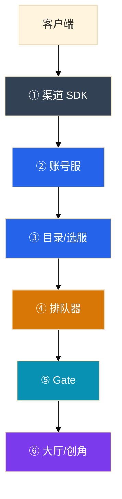
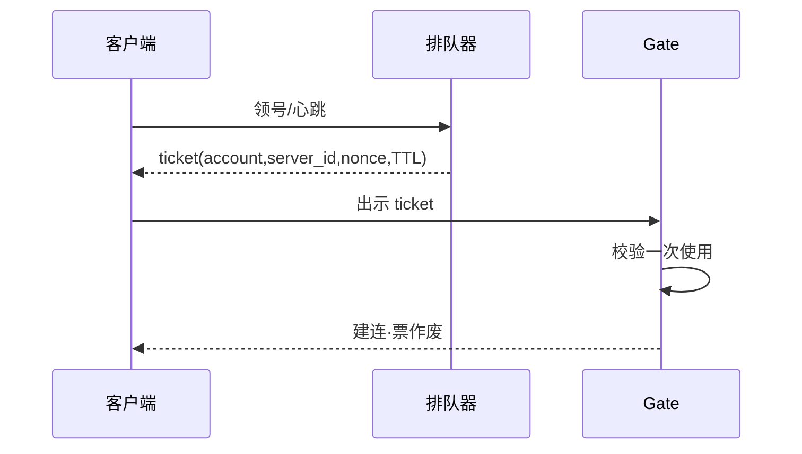

# 登录、排队与选服


开服三分钟登录全红。有人把登录 Deployment 从 10 扩到 80，排队器按登录集群空闲发票——Gate fd 打满，新服创角把单库行锁打穿。**分跳看登录，按目标服消化速率发票，重连走快通道。**

**本章主线（开服/活动就按这三步想）：**

1. **分跳**：渠道→账号→目录→排队→Gate→大厅；客户端只显示「登录失败」，你要看哪一跳红。
2. **限流**：排队按**目标服**压测可消化 ×0.7 发票，不是按登录 HPA 空闲发；重连不进队。
3. **目录**：可降级出旧列表，**不可 500**；推荐打散，爆满只进已有号。

**读完你能：** 分跳看登录失败；ticket 短 TTL 一次性绑定账号+服+nonce；全服踢人先目录维护再断连。

## 本章目录

- [1. 基本概念](#1-基本概念)
- [2. 架构图](#2-架构图)
- [3. 原理](#3-原理)
- [4. 落地](#4-落地)
- [5. 核心配置](#5-核心配置)
- [6. 命令与操作](#6-命令与操作)
- [7. 生产排障](#7-生产排障)
- [8. 必会 · 常考](#8-必会--常考)
- [合上书](#合上书问自己)

**本章不讲：** Gate/战斗拓扑 → [01](../01-游戏服务器架构/)；开服写目录 → [02](../02-开服合服/)；`min_client_version` → [03](../03-热更新与版本发布/)；活动登录峰 → [05](../05-活动高峰与压测/)；加速器 → [08](../08-游戏网络与对抗/)。

---

## 1. 基本概念

登录打爆的是无状态登录和目录，不是已经在线的战斗。

**值班里什么时候碰到：**

| 玩家说的 | 技术含义 | 你的第一刀 |
|----------|----------|------------|
| 「登录失败」 | 六跳某一跳红 | 分跳，不要先重启战斗 |
| 「排队 80 万」 | 重连进了登录队 | 重连改快通道 |
| 「新服创角一直转圈」 | 单服 DB 行锁 | 停创角，已有号可进 |
| 「选服列表空白」 | 目录 500 | 降级出旧列表 |

| 凭证 | 证明什么 | 寿命 |
|------|----------|------|
| 账号 token | 你是这个账号 | 长 |
| 进服 ticket | 排队器允许你进这个服 | **短、一次性**，绑 `account+server_id+nonce` |
| Gate session | 长连接身份 | 随连接 |

排队器职责：领号→心跳续位→**按目标服消化速率发 ticket**→Gate 校验一次使用。

> **记住：** 登录 QPS ≠ CCU。只扩登录副本 = 把洪峰原样送给有状态层。排队器挂了就停进服，不要裸放。

**面试怎么说**：「开服我先分六跳看哪红。排队按目标服压测 ×0.7 发票，不按登录 HPA 空闲。重连走快通道，不进百万队列。」

---

## 2. 架构图



**读图三句话：**

1. 没有箭头从登录 HPA 直接指向「多发票」——扩登录不自动等于多放人进服。
2. 重连不进队，否则 Gate 抖动把在线玩家打进百万队列。
3. 排队器挂了 = 目录标维护，裸放 = 用登录打死逻辑服。

---

## 3. 原理

### 3.1 六跳

**一句话：** 分跳看成功率和 P95，才能决定扩哪一层。

**打个比方**：登录像机场六站——**只说「航班取消」不够，得看是值机、安检还是登机口挂了**。

**现场走一遍**（开服 3 分钟，客户端统一「登录失败」）：

1. 看各跳 5min 成功率面板：

```text
①渠道: 99.8%  ②账号: 62%  ③目录: 99.5%
④排队: —     ⑤Gate: 98%   ⑥创角: —
```

2. ② 账号 62% 掉过预案线 → **P0 在账号层**，不是 Gate。
3. 若只扩 Gate/战斗 → 洪峰原样送给有状态层，创角行锁更惨。
4. 止血：扩账号、开排队防狂点、风控异步。
5. `min_client_version` 放目录/登录（03），不要放战斗。

| 跳 | 典型故障 | 止血 |
|----|----------|------|
| ① 渠道 | 证书、时间戳 | 公告渠道；开排队防狂点 |
| ② 账号 | 连接打满 | 扩账号、风控异步 |
| ③ 目录 | 全回源 DB | **降级出旧列表** |
| ④ 排队 | 超发 | 中心计数、按服降速 |
| ⑤ Gate | fd/握手满 | 降发放+扩 Gate |
| ⑥ 创角 | 行锁 | 停创角，已有号可进 |

**面试怎么说**：「登录失败不等于登录挂了，六跳分看。目录 DB 被打穿返回旧列表优于 500。」

### 3.2 登录 QPS ≠ CCU

**一句话：** 开服尖峰秒级，CCU 分钟级；失败重试是乘法。

**打个比方**：CCU 是「同时在场人数」，登录 QPS 是「门口每秒检票数**——开服像演唱会开场，门口 1 分钟涌进 10 万人，和场内坐 3 万人不是一回事**。

**现场走一遍**（登录 HPA 扩到 80，创角仍打穿）：

1. 登录 QPS：日常 50 → 开服尖峰 8000（×160）。
2. 排队器按「登录 Pod 空闲」发票 → 每秒放 500 人进 S105。
3. S105 创角压测舒适写 QPS = 200；实际 500 → 行锁等待 8s。
4. 正确放行：目标服压测可消化 × **0.7** = 140/s。
5. 容量分桶：① 账号/登录 API ② 排队放行 ③ Gate/大厅 ④ 单服 DB 创角写。

**面试怎么说**：「只扩登录 Deployment 不限制放行 = 没管过开服。登录 QPS 和 CCU 不线性，失败重试还会再乘。」

### 3.3 排队令牌

**一句话：** 按目标服消化 ×0.7 发票；成功率掉了只降速，不涨速清队列。

**打个比方**：ticket 像游乐园 fast pass——**绑定了哪个园区（server_id）、哪个游客（account）、只能用一次**。

**现场走一遍**（弱网同一 ticket 多次握手，超发）：

1. 玩家弱网，同一 ticket 向 Gate 重试 5 次。
2. Gate 若只校验「ticket 有效」不校验 nonce 一次性 → 5 条连接进服。
3. 监控：`ticket_replay_total` 相对基线 ×3。
4. 修复：ticket 绑 account+server_id+**nonce**，Gate 校验**一次使用**后作废。
5. 超发来源：Pod 内存计数；按登录空闲发票；回滚旧批次 TTL 未降。



**面试怎么说**：「排队按目标服 ×0.7，不按登录集群空闲。队列长了只降速不涨速。ticket 短 TTL、一次使用，防弱网重放超发。」

### 3.4 选服

**一句话：** 推荐错了 = 自己制造单服热点；目录 DB 被打穿返回旧列表优于 500。

**打个比方**：选服像导航推荐路线——**把所有人导到同一条堵死的高速，比显示「地图加载失败」还糟**。

**现场走一遍**（三新服并行开服，全涌进 S103）：

1. 推荐算法按「最新服权重最高」→ 90% 新玩家点进 S103。
2. S103 创角锁等待破线；S101/S102 空闲。
3. 开服后 5 分钟：**只看成功率和队列**，不要改推荐算法。
4. 止血：CCU 到阈值摘「推荐」；账号哈希打散。
5. 目录 DB 被打穿 → **降级出旧列表**，不要 500「更诚实」。

**面试怎么说**：「开服后 5 分钟只盯成功率和队列，不改推荐权重。爆满服只进已有号。」

### 3.5 Session 与踢人

**一句话：** 全服踢人：目录维护 → Gate 广播断连 → 失效 ticket 批次 → 删 Gate 绑定。

**打个比方**：踢人像清场——**先关大门（目录维护），再逐房通知（Gate 断连），最后作废入场券（ticket）**。

**现场走一遍**（维护只 kill Gate 进程，玩家秒回来）：

1. 运维 `kubectl delete po -l app=gate` 想「快速踢人」。
2. 玩家重连 storm → 登录 QPS ×10 → 账号层再红。
3. 正确顺序：目录标维护 → Gate 广播断连 → 失效 ticket 批次 → 删 Gate 绑定。
4. 三种凭证不要混一个 JWT——踢了又回来。
5. 验证码降级只拦创角，不连重连一起拦。

**面试怎么说**：「全服踢人先目录维护再断连，不是只杀进程。ticket、账号 token、Gate session 三种凭证分开吊销。」

---

## 4. 落地

| 项 | 选 | 不选 |
|----|----|------|
| 扩容 | 分桶：账号、排队、Gate、创角 | 只扩登录 Deployment |
| 排队 | Redis/专用服务，按服分桶 | Pod 内存排队 |
| 发票 | 目标服 ×0.7 | 按登录集群空闲 |
| 重连 | 有效 session 快通道 | 和新登录同一队 |
| 目录 | 缓存+降级旧列表 | 500「更诚实」 |

开服前 30 分钟：登录就位、排队阈值、目录预热、告警按服路由。

---

## 5. 核心配置

| 参数 | 生产怎么用 | 改错会怎样 |
|------|------------|------------|
| 放行速率 | 压测可消化 ×0.7 | 按队列长度涨速 |
| ticket TTL | 短；一次使用 | 长 TTL+可重放=超发 |
| ticket 绑定 | account+server_id+nonce | 改包进测试服 |
| 目录 TTL | 维护变更主动失效 | 看见已关服 |
| 验证码降级 | 只拦创角 | 连重连一起拦 |

---

## 6. 命令与操作

### 6.1 开服夜第一屏

| 指标 | 阈值 | 级别 |
|------|------|------|
| 任一跳成功率 | 掉过预案线 | P0 |
| 重连/新登录 QPS | 重连占比突升 | P0 |
| ticket 已用/重放 | 相对基线翻倍 | P1 |
| 目录 5xx | >0 且无降级 | P0 |
| 单服创角锁等待 | 超压测线 | 停创角 |

### 6.2 开排队

渠道狂点或账号 5xx 就开。放行按目标服预案。T0 可以降速，不要涨速清队列。

### 6.3 回滚

错误推荐：停热更，恢复上一版配置（03 reload）。超发 ticket：降 TTL、作废批次。排队器挂：目录维护，不要回滚成裸放。

---

## 7. 生产排障

| 现象 | 先做 | 别做 |
|------|------|------|
| 登录 HPA 80，创角打穿 | 降放行、停创角 | 继续加登录 |
| 重连进同一队，队 80 万 | 重连改快通道 | 摘排队器裸放 |
| 目录 500 | 降级出旧列表 | 重启战斗 |
| 放行对、Gate 仍拒 | ticket 失败码四件套 | 先加 Gate |
| 踢人后又回来 | 三种凭证拆开 | 只删账号 token |
| 尖峰上改推荐 | 停 | 热更推荐权重 |

令牌口诀：**宁少发、重连快通道、失败码四件套、排队器挂了停进服**。

---

## 8. 必会 · 常考

| 说法 | 对错 | 口径 |
|------|:----:|------|
| 只扩登录就能抗开服 | 错 | 洪峰送给有状态层 |
| 登录 QPS 和 CCU 线性 | 错 | 尖峰秒级；重试再乘 |
| 按登录集群空闲发票 | 错 | 按目标服 ×0.7 |
| 每个登录 Pod 内存排队 | 错 | 水平扩展超发 |
| 重连和新登录进同一队 | 错 | 重连快通道 |
| 队列长了就涨速 | 错 | 成功率掉了只降速 |
| 排队器挂了先让人进去 | 错 | 目录维护 |
| 目录 500 比旧列表诚实 | 错 | 永不让总入口空 |
| 全服踢人只杀进程 | 错 | 先目录维护再断连 |
| 登录失败就是登录挂了 | 错 | 六跳分看 |
| ticket 不绑服也可以 | 错 | 防改包进未开放/测试服 |
| 一个 JWT 从账号传到战斗 | 错 | 踢人吊销不干净 |
| 三套渠道各限各的 | 错 | 汇到账号维度 |
| 验证码挂了整段登录停 | 错 | 只拦创角 |
| 开服后 5 分钟改推荐算法 | 错 | 只看成功率和队列 |
| 登录失败先重启战斗 | 错 | Gate/大厅才是进服问题 |

数字：登录 QPS 日常 20～100×；放行=压测 ×0.7；进服成功率 ≥99%；DB 连接 <70%；静态兜底 0.5～0.7。

| 令牌字段 | 防什么 |
|----------|--------|
| account | 转赠、多开刷队 |
| server_id | 改包进未开放/测试服 |
| nonce+一次性 | 弱网重放超发 |
| 短 TTL | 持票不用占额度 |

易混：新登录 vs 重连；ticket 没拿到 vs 票被用过；渠道挂 vs 自家账号挂。

---

## 合上书，问自己

1. 六跳是哪六跳？怎么分渠道还是自家？
2. 为什么不能只扩登录？容量怎么分桶？
3. ticket 绑定什么？排队器挂了呢？
4. 目录 DB 被打穿怎么办？
5. 全服踢人步骤？
6. 开服后 5 分钟盯什么？

六题能口述，这一章就过了。下一章：[活动高峰与压测](../05-活动高峰与压测/)。
