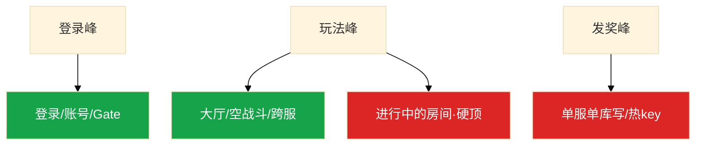

# 活动高峰与压测


周年庆整点。推送、活动开启、排名结算叠在同一分钟。HPA 把战斗副本加了一倍，新 Pod 是空的，主库已被全服发奖锁死。**三峰分开算、分开降，炸了先降级再扩。**

**本章主线（活动就按这三步想）：**

1. **拆峰**：登录峰 / 玩法峰 / 发奖峰——不要用一个 CCU 买所有层。
2. **边界**：战斗只能预开空进程；从库救不了写；活动中途不能分库。
3. **降级**：保登录+结算+支付；开关走配置热更（03），回执齐才算生效。

**读完你能：** 把活动拆成三峰做容量账；否决全服同时发奖；压测走真协议且不对生产主库写。

## 本章目录

- [1. 基本概念](#1-基本概念)
- [2. 架构图](#2-架构图)
- [3. 原理](#3-原理)
- [4. 落地](#4-落地)
- [5. 核心配置](#5-核心配置)
- [6. 命令与操作](#6-命令与操作)
- [7. 生产排障](#7-生产排障)
- [8. 必会 · 常考](#8-必会--常考)
- [合上书](#合上书问自己)

**本章不讲：** 战斗 HPA/PDB → [01](../01-游戏服务器架构/)；排队 → [04](../04-登录排队与选服/)；配置热更 → [03](../03-热更新与版本发布/)；CDN → [06](../06-CDN与资源更新/)；回档 → [07](../07-玩家数据备份与回档/)；SLO → [09](../09-游戏SRE稳定性/)。

---

## 1. 基本概念

| 峰 | 时间 | 打谁 | 典型放大 |
|----|------|------|----------|
| 登录/重连 | 整点、推送 | 账号、排队、Gate | 日常 20×+ |
| 玩法 | 活动开启、BOSS | 逻辑、房间、跨服 | 单接口 10×～50× |
| 发奖/结算 | 活动结束、排名 | DB 写、邮件、背包锁 | 写尖刺，**资损最高** |

哪座峰最容易资损：**发奖/结算写错或重复发**。玩法进不去是体验；钱和道具错是 P0。

> **记住：** 三峰分别扩分别降。HPA 箭头到不了已开房间。从库救不了写。

**面试怎么说**：「活动我拆三峰：登录、玩法、发奖。CCU 买一个数会漏写库硬顶；发奖峰资损最高，否决全服同一秒发奖。」

---

## 2. 架构图



**读图三句话：**

1. HPA 新 Pod 是空的，救不了已开房间——从玩法峰往下查，不要先加 CPU HPA。
2. 发奖峰打写和锁，不是 CCU——主库锁等待是发奖峰信号。
3. 预发可打穿；生产只降级和预扩；**禁止对生产主库写压测**。

---

## 3. 原理

### 3.1 三峰不是一个 CCU

**一句话：** CCU→Gate/大厅；玩法 QPS→该玩法进程；发奖条数/秒→MySQL 写。

**打个比方**：周年庆像三层楼同时办派对——**一楼检票（登录）、二楼跳舞（玩法）、三楼发奖金（发奖）——只扩一楼救不了三楼收银台锁死**。

**现场走一遍**（整点 T0，该先看哪座峰）：

1. 登录每跳成功率 98% → 登录峰尚可。
2. 跨服 Tick P95 破线、房间创建失败率 15% → **玩法峰**。
3. 主库 `innodb_row_lock_time_avg` 800ms、发奖失败率 12% → **发奖峰**。
4. 若只扩 Gate → 登录更好，发奖仍锁死。
5. 止血顺序：停发奖入口 → 改批量 → 关跨服/限新进。

| 曲线 | 用来定什么 | 不能用来定什么 |
|------|------------|----------------|
| 登录方波 | 账号/排队放行 | 战斗台数 |
| 玩法爬升 | 空战斗进程/跨服池 | 发奖节奏 |
| 发奖尖刺 | 每秒条数/邮件批量 | Gate 连接 |

**面试怎么说**：「CCU 管连接，发奖条数/秒管 MySQL 写——三个数不能混。T0 先看哪座峰，先扳开关再扩能扩的。」

### 3.2 有状态扩容边界

**一句话：** 活动中战斗只能预开空进程；从库救不了写；活动中途不能分库。

**打个比方**：战斗房间像已开机的游戏机——**加新机器接不了正在玩的那局**；发奖像改账本，**复印一本（从库）不能代替写账**。

**现场走一遍**（战斗 CPU 90%，HPA 加了 10 个空 Pod）：

1. 旧 Pod：800 房间，CPU 90%；新 Pod：`idle_rooms=800`，CPU 5%。
2. 玩家：「老房间卡，新房间能进」。
3. 结论：HPA 按 CPU 追已爆房间 = 空 Pod 堆起来。
4. 正确：活动前预热空进程；活动中限新进、关跨服入口。
5. 否决：活动中途分库；现场给热 key 加 Redis 分片。

| 组件 | 活动中能做什么 | 不能做什么 |
|------|----------------|------------|
| 登录/Gate | 提前扩 | Gate 扩完不迁已有连接 |
| 战斗 | **预开空进程** | 迁已开战房间 |
| 单服 MySQL | 读加从库；写靠降级 | 活动中途分库 |
| 全服榜 | 预分片、本地缓存 | 现场加 Redis 节点 |
| 跨服 | 提前扩房间池 | 本服加机器救跨服 |

**面试怎么说**：「跨服挂关跨服入口，不把本服标维护。活动中内存高先对房间×人均，不重启战斗进程。」

### 3.3 压测模型与容量账

**一句话：** `/health` 绿了不算；最低六条真协议路径；禁止对生产主库写。

**打个比方**：压测像消防演练——**只测消防栓有没有水（health）不算，要走完疏散、灭火、救护全套**。

**现场走一遍**（容量评审：5 万 CCU 活动）：

1. 六条路径：① 登录+排队 ② 进服拉背包 ③ 活动主循环 ④ 结算发奖 ⑤ 支付沙箱 ⑥ 重连风暴（踢 30% 连接）。
2. 发奖账：5 万行/秒 vs 主库舒适 3 千行/秒 → **否决同时发**，改 20 分钟批量。
3. 热 key：5 万 QPS 打一个 key → 分片榜/5s 刷新。
4. 战斗：800 房 → 预开 20 空进程 ×1.4；Gate 4 台预热（非现场 HPA）。
5. 报告必须写：**哪层先破 + 可承载发奖每秒**，不是只交最大 CCU。

```
峰值 CCU 5 万 → Gate 4 台已预热（非现场 HPA）
战斗 800 房 → 预开 20 空进程 ×1.4
发奖 5 万行/秒 vs 主库舒适 3 千行/秒 → 否决同时发，改 20 分钟批量
热 key 5 万 QPS 打一个 key → 分片榜/5s 刷新
```

**面试怎么说**：「压测最低六条，开服用新号、活动用老号。机器人思考时间 0 更狠但低估尖峰——要方波。禁止对生产主库写。」

### 3.4 活动开关与降级

**一句话：** 保登录+结算+支付；开关走配置热更+回执齐；恢复顺序相反。

**打个比方**：降级像断电保核心——**先保电梯和 ICU（登录、结算、支付），再关霓虹灯（排行、跨服）**。

**现场走一遍**（主库被排名结算锁死）：

1. 发奖失败率 > 预案 → 立刻**停发奖入口**。
2. 改 20 分钟批量发邮件，不是现场分库。
3. 配置中心扳 `cross_server=false`、`rank_refresh=300s` → 对账回执。
4. 回执不齐 = 部分服还在打跨服 → **不要当全服已降级**（03）。
5. 恢复：先结算和支付缓冲，再跨服和排行——排行延迟不是 P0。

| 开关 | 何时扳 |
|------|--------|
| 跨服入口 | 跨服 Tick/房间失败 |
| 排行刷新 | 热 key 打满 |
| 邮件 | 发奖峰锁等待 |
| 发奖入口 | 主库被排名结算锁死 |
| 活动入口 | 经济配错 |

保底顺序：① 登录+重连 ② 结算和背包权威 ③ 支付（可排队不能丢）④ 活动玩法 ⑤ 跨服/排行/聊天 ⑥ 动画/实时刷新。

**面试怎么说**：「经济配错回配置停产出，不要 ×0.01。降级开关走配置热更，不能发版上。恢复时先开结算再开实时榜。」

---

## 4. 落地

| 项 | 选 | 不选 |
|----|----|------|
| 容量评审 | 三峰分账，可承载发奖每秒 | 一个 CCU 买所有层 |
| 战斗 | 活动前预热空房间 | 按 CPU HPA；活动中滚战斗 |
| 发奖 | 分片/延迟邮件 | 全服同一秒；从库抗写 |
| 压测 | 预发同构；真协议六路径 | health；生产主库写 |
| 排期 | 结算和强更错开 | 买量+新服+活动同一天 |

T-7 演练扳一次跨服和发奖入口，看回执和玩家侧表现。

---

## 5. 核心配置

| 参数 | 生产怎么用 | 改错会怎样 |
|------|------------|------------|
| 战斗 HPA | 空闲房间数；活动前预热 | CPU 追已爆房间 |
| 发奖节奏 | 可承载每秒条数 | 全服同一秒锁死主库 |
| 降级开关 | 配置 version+回执 | 未齐=部分服还在打 |
| 压测中止 | 错误率、锁等待、误打生产 | 续压打穿预发 |

---

## 6. 命令与操作

### T-7 / T-1 / T0

```
T-7d  容量评审、降级演练、压测报告签字
T-1d  登录/Gate/跨服预扩、CDN 预热、发布冻结
T0    看登录成功率和发奖失败率，不看无关看板
```

### T0 第一屏

| 指标 | 阈值 | 动作 |
|------|------|------|
| 登录每跳成功率 | 掉过预案 | 排队降速 |
| 发奖失败率 | >预案 | 停入口 |
| 主库锁等待 | 超压测线 | 改批量 |
| 空闲房间→0 且 Tick 破线 | — | 限新进 |
| 误打生产主库 | 任何写 | 立刻停 |

### 经济配错

回配置停产出，关活动入口（03）。不要 ×0.01。已发错奖走 07。

---

## 7. 生产排障

| 现象 | 先做 | 别做 |
|------|------|------|
| 登录成功率掉 | 排队降速，保重连 | 涨速清队 |
| Tick 破线 | 关跨服/降级玩法 | 重启有局进程 |
| 锁等待/发奖失败 | 停发奖入口，改批量 | 现场分库 |
| 新战斗 Pod 空、旧 CPU 90% | 停按 CPU 扩 | 指望新 Pod 接旧房间 |
| 有人对生产主库压测 | 拒绝 | 「验证容量」 |
| 跨服 OOM | 关跨服入口 | 全渠道维护 |

T0 口诀：**先看哪座峰，先扳开关，再扩能扩的**。战斗空 Pod 不是扩容成功。

---

## 8. 必会 · 常考

| 说法 | 对错 | 口径 |
|------|:----:|------|
| 活动容量一个 CCU 就够 | 错 | 三峰分账 |
| HPA 按 CPU 能救战斗 | 错 | 新 Pod 是空的 |
| 加只读从库能抗发奖 | 错 | 发奖是写和行锁 |
| 活动中途分库 | 错 | 现场只能降级 |
| `/health` 绿就算压过活动 | 错 | 要走进服战斗发奖重连 |
| 压测可以对生产主库写 | 错 | 禁止 |
| 跨服挂应把本服标维护 | 错 | 关跨服入口 |
| 活动中内存高就重启战斗 | 错 | 先对房间×人均 |
| 经济错奖再热更补偿 | 错 | 停产出，走 07 |
| Gate 扩了会迁走已有连接 | 错 | 不会 |
| 现场给热 key 加 Redis 分片救命 | 错 | 预分片 |
| 机器人思考时间 0 更狠所以更真 | 错 | 方波，低估尖峰 |
| 报告只交最大 CCU | 错 | 哪层先破+可承载发奖每秒 |
| 排行延迟是 P0 | 错 | 可定时刷新 |
| 把战斗服当 Deployment 滚释放内存 | 错 | 砍在线局 |
| 降级开关可以发版上 | 错 | 配置热更+回执 |
| 恢复时先开实时榜再开结算 | 错 | 恢复顺序相反 |

数字：登录峰 20×+；玩法 10×～50×；重连风暴踢 30%；T-7/T-1/T0。

易混：三峰 vs 一个 CCU；扩空进程 vs 迁已开房间；从库 vs 写；压测预发 vs 生产；降级开关 vs 发版。

---

## 合上书，问自己

1. 三峰打谁？哪座最容易资损？
2. HPA 为什么救不了战斗？从库呢？
3. 压测最低六条？health 为什么不算？
4. 降级顺序？排行延迟必须保吗？
5. 活动中战斗内存高能重启吗？
6. 凭什么否决全服实时榜？

六题能口述，这一章就过了。下一章：[CDN 与资源更新](../06-CDN与资源更新/)。
