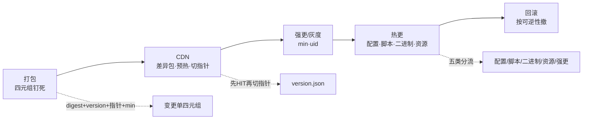
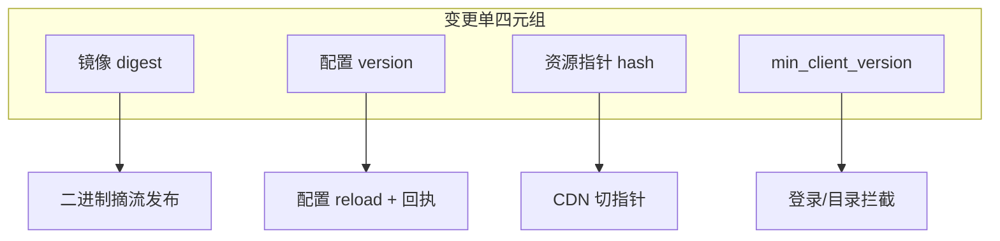
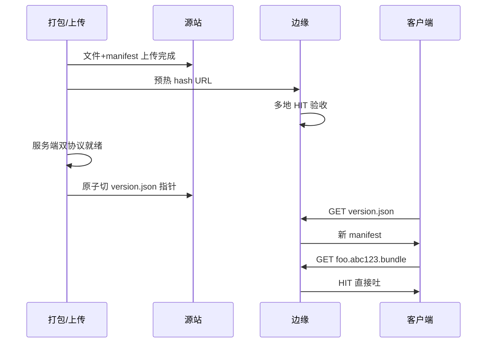
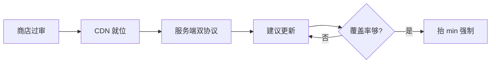
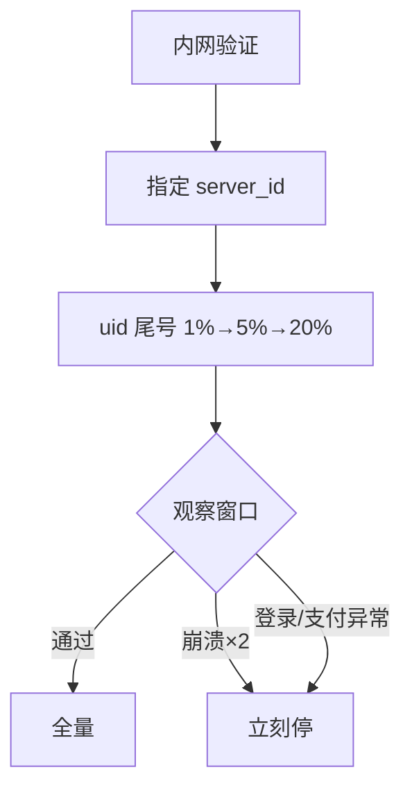
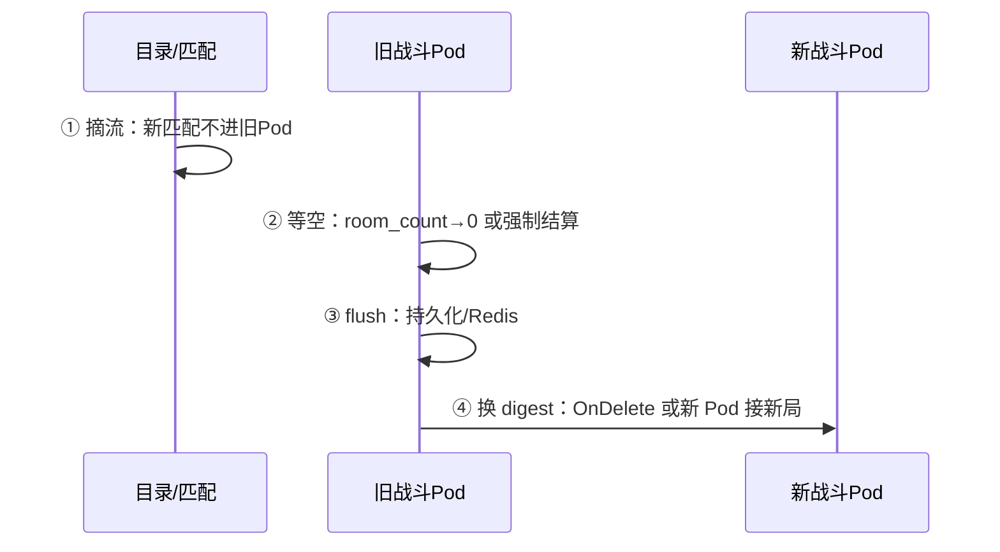
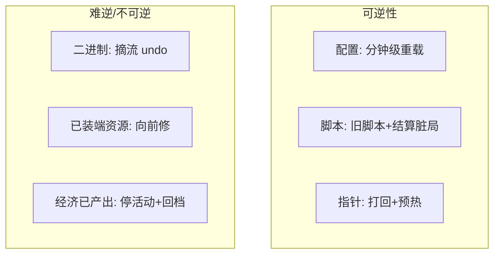
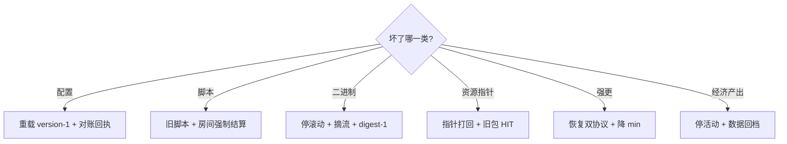
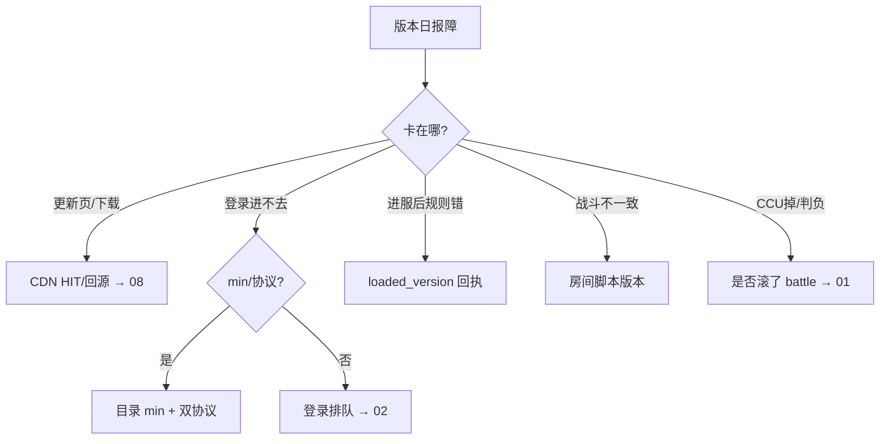

# 热更新与版本发布

> 版本日群里有人喊「热更一下」——有人重载配置，有人滚战斗镜像，有人在切 CDN 指针；活动掉落多写了一个零，另有人要再热更「×0.01」当没发生。
> **本章回答**：一次版本发布从打包到 CDN、强更/灰度、热更、回滚，每个阶段改什么、怎么验、错了怎么撤。
> **不讲**：战斗摘流四步细节 → [01](../01-游戏服务器架构/)；开服版本钉死 → [06](../06-开服合服/)；`min_client_version` 登录侧 → [02](../02-登录排队与选服/)；CDN 预热深排 → [08](../08-CDN与资源更新/)；经济回档 → [09](../09-玩家数据备份与回档/)；维护窗口 → [07](../07-停服维护与不停机更新/)。

**标记**：🎯重点 · 🔥难点 · ⭐常考 · 🔧实操

---

## 一、一张图：版本发布的一生

> 🎯 **一句话**：版本发布像一列火车——打包装货、CDN 铺差异包、强更/灰度检票、热更途中换规则、回滚是倒车，每站职责不同，不能混在同一节车厢。



**读图**：

- 从左到右是**一次发布**的时间线：产物先钉死 → 资源上 CDN 并预热 → 客户端强更/灰度放量 → 服务端热更各类变更 → 任何阶段错了按可逆性回滚。
- 监控分阶段看：打包看 artifact hash；CDN 看 HIT/回源；强更看端大版本分布；热更看 `loaded_version` 回执；回滚看 SLI 是否恢复。
- 出事故先问「火车停在哪一站」——配置 reload 和滚战斗镜像是两列不同的车，不能同时发车。

---

## 二、打包：四元组钉死

> 🎯 **一句话**：发布前先把**四元组**写进变更单——镜像 digest、配置 version、资源指针、`min_client_version`，禁 `latest`，禁「跟测试服一样」。

**镜像 digest**（`sha256:abc123…`）是二进制层的唯一身份证，CI 打出 artifact 后不可再改。配置 **version** 是服务端 reload 的加载号，和端大版本无关。资源**指针**是 CDN 上 `version.json` 指向哪一版 manifest。`min_client_version` 是登录/目录挡不兼容老端的门槛——四者必须在同一变更单里自洽。



**读图**：四元组各管一层——改活动数值只动配置 version；改战斗逻辑动 digest；改客户端资源动指针；改协议才动 min。揉成一个「版本号 2.5.1」无法分层回滚。

> 🔍 **现场**：对账变更单与线上是否一致。

```bash
# 战斗镜像（禁 latest）
kubectl get deploy battle -o jsonpath='{.spec.template.spec.containers[0].image}{"\n"}'
# ← 必须是 digest 或带 digest 的 immutable tag，不能是 :latest

# 配置回执（伪 API）
curl -s 'https://config/internal/receipts?version=20250901-a' \
  | jq -r '.items[] | select(.loaded_version!="20250901-a") | .instance'
# ← 空输出 = 全齐；有行 = 规则分裂风险

# 端大版本分布
curl -s 'http://prom:9090/api/v1/query?query=count by (client_major)(client_version_info)' \
  | jq '.data.result[] | {major: .metric.client_major, n: .value[1]}'
```

```text
registry.game/battle@sha256:7f3a9c2e1b...
# ← digest 钉死，预发和线上一致

logic-s1002-07
# ← 这台 Logic 还没加载目标 version → 不能开放活动

{"major":"2.4","n":"842000"}
{"major":"2.5","n":"158000"}
# ← 强更覆盖率：2.5 才 16%，不宜再抬 min
```

端侧版本号也要拆开：**端大版本**（强更，改协议/引擎）、**端资源号**（热更资源 manifest）、**服配置 version**（reload）、**镜像 digest**（二进制）。面试常问「怎么回滚」——先判断坏在哪一层，再选对应按钮，不是一个 `rollback` 搞定全部。

> ⚠️ **别混**：**变更单 version**（服务端配置加载号）≠ **客户端大版本**（App Store 包）≠ **资源 manifest hash**——三层独立，回滚时只动坏的那层。

> 📝 **面试**：「变更单钉四元组：digest、配置 version、资源指针、min。禁 latest，禁口头对齐测试服。出问题先问坏在哪一层。」

---

## 三、CDN：差异包、预热与切指针

> 🎯 **一句话**：资源发布顺序是**先上传 → 再预热 HIT → 服务端兼容 → 最后原子切指针**——先切指针再传包 = 全球回源（详见 [08](../08-CDN与资源更新/)）。

客户端启动拉小指针 `version.json`（短 TTL），对比本地 manifest 只拉**差异包**——hash 变了的文件才下载，没变的跳过。**指针**告诉边缘「现在该哪一版」；**文件** URL 带 content hash、长 TTL，内容变 = 新 URL，几乎不用 purge。差异包靠的是 manifest 逐文件 hash 比对，不是整包版本号递减。



**读图**：切指针是**最后一跳**——之前必须文件齐、预热 HIT、服务端能解析新资源协议。指针切了但大包还在上传 40%，边缘全球 miss，源站带宽打满，下载成功率掉而登录仍绿。

> 💡 **打个比方**：指针像餐厅今日菜单（天天换、短 TTL）；文件像 sealed 罐头——换内容就换 SKU（新 hash URL），不用把旧罐头从货架一个个抠下来。差异包 = 只拿菜单上新增的菜，已经吃过的不重下。

> 🔍 **现场**：切指针前验收预热。

```bash
URL="https://res.example.com/bundles/hero.abc123.bundle"
curl -sI "$URL" | grep -iE 'HTTP/|X-Cache|Cache-Control'
curl -s "$URL" | sha256sum
curl -sI "https://res.example.com/version.json" | grep -iE 'X-Cache|Cache-Control'
```

```text
HTTP/2 200
X-Cache: HIT
Cache-Control: public, max-age=31536000, immutable
# ← 文件层 HIT + 长 TTL 正确

e3b0c44298fc1c149afbf4c8996fb92427ae41e4649b934ca495991b7852b855  -
# ← 与 manifest 中 hash 一致才可切指针

Cache-Control: public, max-age=30
# ← 指针短 TTL，切了边缘快吐新清单
```

失败时**指针打回**上一份已预热 manifest，**不删**源站新文件——便于修好后再切。改指针 ≠ 客户端资源回滚完成：已下完差异包的端常常只能**再发修复包向前兼容**。

> ⚠️ **别混**：**CDN 指针回滚**（管还没拉或再检查的端）≠ **已装包体回滚**（设备上文件已落地，一般不能卸）。

---

## 四、强更：min 与双协议 ⭐🔥

> 🎯 **一句话**：改枚举/删必填/改握手 = **强更**；`min_client_version` 放**登录/目录**，不放战斗——否则老端能登录、进战斗才炸。

协议兼容边界：

- **可热更/可兼容**：新增可选字段、老端忽略的新消息号（关键路径不能只走新消息）。
- **必须强更**：改字段**含义**、改枚举值、删必填、改加密握手、结构体布局变更。

强更**两段抬闸**：商店过审 → CDN 资源就位 → **服务端先双协议** → 建议更新看崩溃/覆盖率 → 覆盖率够再抬 `min`。一次过审当天抬满 min = 没有灰度，老端全堵登录。



**读图**：`min` 是最后一道闸——之前服务端必须同时认老协议和新协议。只降 `min` 不够：服务端若已删老协议，降 min 后老端能登录、进战斗握手仍失败。

> 💡 **打个比方**：检票应在大厅门口（登录/目录）做——**不要在进房间时才查身份证**，那时局已开，踢人 = 判负。

> 🔍 **现场**：强更后进战斗失败，先查协议栈而非 CDN。

```bash
# 目录 min（应在登录/目录服务，不在 battle）
curl -s 'https://dir/internal/server_list' | jq '.min_client_version, .recommended_version'

# 战斗握手错误码分布（伪）
curl -s 'http://prom:9090/api/v1/query?query=sum by (err)(rate(battle_handshake_fail_total[5m]))'
```

```text
"2.5.0"
"2.5.0"
# ← min 和推荐一致，2.4 端应在登录被挡，不应进战斗

{"err":"PROTO_VERSION_MISMATCH","value":"1240"}
# ← 若登录成功但此处飙 = min 放错层或双协议未开
```

> ⚠️ **别混**：**降 min**（客户端门槛）≠ **服务端双协议**（服务端还认不认老包）——回滚强更要两步都做，顺序是先恢复双协议再降 min。

> 📝 **面试**：「强更两段抬闸。min 放目录/登录。只降 min 不够，服务端须还认老协议。改活动图不是强更，那是资源/配置。」

### 协议演进：双协议窗口 🔥

协议变更标准路径（与强更联动）：

```text
Phase 0：设计 — 只加 optional 字段 → 可热更；改 enum 含义 → 必须强更
Phase 1：服务端双协议 — 同时解析 v1/v2 报文
Phase 2：资源+建议更新 — CDN 就绪，灰度 uid
Phase 3：抬 min — 覆盖率够再强制
Phase 4：下版本 — 观察 1～2 版本后删 v1 解析
```

删老协议前必须确认端大版本分布 **v1 < 0.1%** 且支付/进战斗 SLI 稳定——否则老端进战斗 handshake 失败。

```bash
curl -s 'http://prom:9090/api/v1/query?query=sum(rate(handshake_v1_total[1d]))/sum(rate(handshake_total[1d]))'
```

```text
0.0008
# ← v1 占比 0.08%，可考虑下版本删 v1（仍需产品 sign-off）
```

> 📝 **面试**：「协议演进五阶段。删 v1 前看端分布和 SLI，不是只看 min。」

---

## 五、灰度：按 uid 放量与观察 ⭐

> 🎯 **一句话**：灰度按 **uid / server_id / 渠道**，不按源 IP；崩溃相对基线**翻倍立刻停**，不是「再观察一小时」。

灰度路径：内网 → 指定服 → uid 哈希尾号 → 渠道包。加速器和 NAT 把源 IP 灰度打成「某出口 100% 新包」。全服组件（登录配置、支付开关）没有「只灰 S1」——要么全服一致，要么设计独立灰度指针。

观察窗口 30～120 min（大版本 24h），盯：

- 崩溃率相对未灰度基线
- 登录/进战斗成功率
- 错误码（协议 vs 资源 hash）
- 支付、CCU 相对未灰度服

闸条件写进变更单：崩溃翻倍 / 登录掉阈值 / 支付异常 → **立刻停灰度**，不是继续全量。



**读图**：灰度是**漏斗**不是开关——每档通过才放大。资源灰度最好用**独立指针文件名**（如 `version-canary.json`），勿与全量共用会被长 TTL 缓存的 URL。只用新注册号测兼容 = 没有老存档，测不出协议问题。

> ⚠️ **别混**：**灰度比例**（多少 uid 收到新包）≠ **覆盖率**（多少在线端已装新包）——抬 min 前看覆盖率，不看灰度比例 alone。

> 📝 **面试**：「灰度按 uid/server_id，不按 IP。5% 崩溃翻倍立刻停。三类回滚不是一个按钮：配置 reload、指针、镜像 undo。」

---

## 六、热更：五类更新与可逆性 🔥⭐

> 🎯 **一句话**：开口先分**五类**——配置/脚本/二进制/资源/强更；热更 vs 停服更三句：进程还在不在、端听不听、回滚能不能加载旧 version。

| 类型 | 改什么 | 进程 | 典型回滚 |
|------|--------|------|----------|
| 配置 | 活动、掉落、开关 | 在 | 重载上一 version |
| 脚本热更 | Lua/热补丁 | 在 | 再发旧脚本 + 脏房间结算 |
| 二进制 | 逻辑镜像 | **没了** | 摘流 + 滚 digest |
| 客户端资源 | 图、音、预制 | — | 改清单指针 |
| 强更 | 协议、引擎 | — | 降 min + 双协议 |

### 6.1 配置 reload

配置中心发布 version=X，后台显示「已发布」≠ 全服生效——要对账 **`loaded_version` 回执**。收不齐当失败：重推或摘未回执实例的新进，**不要开放活动**（规则分裂比晚开代价大）。

重复「加载 X」必须**幂等**——不能叠加成两份活动。热更通道要鉴权、审计、限频，不要暴露公网或共用玩家 GM 令牌。

### 6.2 脚本热更

脚本能改分支逻辑，**改不了结构体布局和协议字段含义**。进行中的局：按房间切版本，或强制结算；一半新公式一半旧公式 → 结算争议。

战斗**二进制**不能 RollingUpdate（抄登录 Deployment = 砍在线局）。路径：摘流 → 等空或强制结算 → flush → 换 digest。金丝雀只对新**开**房间分流，不能对已开房间切 5% 流量。

### 6.3 二进制：摘流四步 🔧⭐

战斗 **Deployment RollingUpdate** 会 Terminating 旧 Pod → 进行中的局直接判负。正确路径引用 [01](../01-游戏服务器架构/) **摘流四步**：



**读图**：① 只影响**新进**房间；已开房间仍钉旧进程直到局结束。③ flush 未完成就 kill = 背包丢数据。金丝雀只能让**新匹配**进新 digest 的 Pod，不能「切 5% 流量」到已开房间。

大厅 / 登录可 RollingUpdate 或蓝绿——Session 可重建。Gate 滚动会断长连接，需重连快通道（[02](../02-登录排队与选服/)）。

> 🔍 **现场**：误滚战斗时的第一刀。

```bash
kubectl rollout status deploy/battle -n prod
kubectl rollout pause deploy/battle -n prod
kubectl get po -l app=battle -o wide
curl -s 'http://prom:9090/api/v1/query?query=sum(game_ccu{layer="battle"})'
```

```text
Waiting for deployment "battle" rollout to finish: 1 out of 3 new replicas have been updated...
# ← RollingUpdate 进行中 = 危险，先 pause

battle-old-7f2k9   1/1   Terminating   0   45m
# ← 旧 Pod 被删 = 在线局判负来源
```

### 6.4 资源与已装端：向前兼容 🔥

客户端资源变更**不经过**服务端 reload——靠 CDN 指针 + 客户端下载器拉差异包。服务端须**兼容**新旧资源协议（双 manifest 解析或字段 optional），否则新资源进服后老逻辑 crash。

已装新包的设备：

- 改回 CDN 指针**管不到**已写入本地存储的文件
- 卸载/清缓存不可依赖（渠道包权限、用户不会操作）
- 正确路径：**再发修复包**（新 hash URL），客户端版本号向前递增

资源灰度应用**独立指针文件**（如 `version-canary.json`），与全量 `version.json` 分离，避免长 TTL 缓存污染。

### 6.5 热更通道：鉴权、审计、幂等 🔧

热更后台最低要求：

- **鉴权**：独立令牌，不与玩家 GM 共用；IP 白名单 + mTLS
- **审计**：谁、何时、对哪些实例、加载哪个 version
- **幂等**：重复「加载 version X」结果与一次相同，不能叠两份活动
- **限频**：防误点 / 脚本狂发

回滚 = 再发「加载 version X-1」，不是 SSH 改文件——不可审计、不可重入。

### 收束：五类凭什么分开管 ⭐🔥



**读图**：越往下越难撤——配置最快；已装客户端包和已产出经济不能靠「再热更 ×0.01」假装没发生。经济配错顺序：**回配置停产出 → 评估回档（07/09）**，不是再乘 0.01。

> 💡 **打个比方**：五类回滚不是同一个「撤销键」——像 Word 里撤销文字、撤销图片、撤销保存完全是三个菜单。

> ⚠️ **别混**：**发版回滚**（换 version/指针/digest）≠ **经济回档**（改玩家背包数据）——掉落多写一个零走后者。

> 📝 **面试**：「开口分五类。配置看 loaded_version 回执。战斗二进制按 01 摘流四步。经济错了先停产出，不是热更 ×0.01。」

---

## 七、回滚：按可逆性止血 🔧⭐

> 🎯 **一句话**：回滚顺序看**可逆性**——配置 → 重载上一 version；脚本 → 旧脚本 + 脏房间强制结算；二进制 → 摘流 + 受控 undo；CDN → 指针改回 + 确认旧包 HIT；经济已产出 → 停活动 + [07](../07-停服维护与不停机更新/)/[09](../09-玩家数据备份与回档/)。



**读图**：决策树第一条分支是**分类**，不是「全员回滚」。灰度 5% 崩溃 → 停灰度 + 回滚该类，不是观察一小时再全量。战斗 RollingUpdate 进行中 → **先停滚动**，再按摘流 undo，不要 undo 再杀一轮。

| 现象 | 先做 | 别做 |
|------|------|------|
| 后台已发布、部分服规则旧 | 对账回执，摘新进 | 开放活动 |
| 同一房间两边公式 | 房间切版本或强制结算 | 再补一刀热更 |
| 先切指针再传包 | 指针打回 | 全网 purge |
| 灰度崩溃翻倍 | 立刻停 | 再观察一小时 |
| 掉落多写一个零 | 回配置停产出 | 热更 ×0.01 |
| 战斗 RollingUpdate | 停滚动，摘流 | undo 再杀一轮 |

---

## 八、版本纪律：活动窗口与预发规范 ⭐

> 🎯 **一句话**：版本发布不要和活动整点、合服、跨服结算**叠窗**——变更单里写「互斥项」，指挥只认一张单。

互斥组合（任一叠加 = 拒绝）：

- 战斗 digest 滚动 + 活动开启整点
- CDN 首切指针 + 强更抬 min 同一天不加观测
- 配置活动开关开放 + 回执未齐
- 合服窗口 + 版本夜热更（[06](../06-开服合服/)）

变更指挥原则（对齐 [13](../13-游戏SRE稳定性/)）：**唯一指挥官**；先说哪类更新、哪条 SLI 异常，再止血一项——禁止四人同时动镜像、指针、配置、min。

复盘必查：四元组是否钉死、灰度闸是否触发、回滚是否按可逆性、经济是否误走热更。

### 预发 promote 与回滚演练 🔧

预发与线上 **artifact 一致**纪律：

- CI 同一 pipeline 产出 digest，预发 approve 后 promote 同一 digest 到 prod
- 禁止线上 `kubectl set image battle:latest`
- 配置 version 从 Git tag 生成，禁止跳板机 scp
- 资源 manifest 从同一次打包 job 上传 CDN

版本发布变更在预发必须跑完：

- 五类更新路径各至少演练一次（配置/脚本/二进制摘流/资源指针/强更 min）
- 回滚演练：配置 version-1、指针打回、rollout pause + digest-1
- 灰度闸：模拟崩溃×2 是否自动停

合服前 [06](../06-开服合服/) 版本对齐检查脚本应比较四元组，不是只比 Git branch 名。

### 与 08 章协同 checklist

资源大版本日前：

```text
[ ] manifest hash CI 校验
[ ] 上传+预热 HIT（含海外 region）
[ ] 服务端资源协议兼容
[ ] 强更：双协议已开再抬 min
[ ] 下载/登录看板并排
[ ] 回源应急：指针打回 runbook
```

---

## 九、作战：版本发布定责 🔧

> 🎯 **一句话**：版本日事故先分「卡在更新页 / 进不去服 / 进服后规则错 / 战斗不一致」——四件事对应 CDN、min/协议、配置回执、脚本版本，不要四人同时动镜像和指针。

### 定责决策树



### 60 秒剧本 🔧

```text
① 0–10s  开口问：改的是哪一类？变更单四元组是什么？
② 10–30s 卡更新页 → curl HIT/hash；进不去 → min+协议；进服错 → 回执
③ 30–45s 战斗争议 → 房间版本；CCU掉 → kubectl rollout status battle
④ 45–60s 止血一项：停灰度 / 指针打回 / 停滚动 / 停产出——禁止同时改三处
```

> 🔍 **现场**：版本日指挥台最小命令集。

```bash
kubectl rollout status deploy/battle -n prod
kubectl get deploy battle -o jsonpath='{.spec.template.spec.containers[0].image}{"\n"}'
curl -sI "https://res.example.com/version.json" | grep -iE 'X-Cache|HTTP/'
curl -s 'https://config/internal/receipts?version='"$CFG_VER" | jq '.missing | length'
```

---

## 十、收口

### 命令速查 🔧

```bash
# 四元组对账
kubectl get deploy battle -o jsonpath='{.spec.template.spec.containers[0].image}{"\n"}'
curl -s 'https://config/internal/receipts?version=TARGET' | jq '.missing'
curl -s 'https://dir/internal/server_list' | jq '.min_client_version'
curl -sI "https://res.example.com/version.json" | grep -iE 'Cache-Control|X-Cache'

# 强更覆盖率 / 崩溃（Prometheus 示例）
# count by (client_major)(client_version_info)
# sum(rate(crash_total[5m])) by (canary)

# 战斗误滚动
kubectl rollout pause deploy/battle -n prod
kubectl rollout status deploy/battle -n prod
```

### 面试锚点

| 问 | 30 秒答 |
|----|---------|
| 五类更新怎么分？ | 配置/脚本/二进制/资源/强更；三句：进程在不在、端听不听、回滚能否加载旧版。 |
| 变更单钉什么？ | digest + 配置 version + 资源指针 + min；禁 latest。 |
| CDN 发布顺序？ | 上传 → 预热 HIT → 服务端兼容 → 切指针；失败打回指针。 |
| 差异包靠什么？ | manifest 逐文件 hash 比对，只下变了的文件；指针短 TTL，文件长 + immutable。 |
| 何时必须强更？ | 改含义/枚举/删必填/改握手；只加可选字段可兼容。 |
| min 放哪？ | 登录/目录；不放战斗。回滚要强协议+降 min。 |
| 灰度怎么切？ | uid/server_id/渠道；不按 IP；崩溃×2 立刻停。 |
| 配置怎么验？ | `loaded_version` 回执齐，不齐不能开活动。 |
| 战斗怎么发？ | 摘流四步，禁 RollingUpdate；金丝雀只对新房间。 |
| 经济配错？ | 停产出，评估回档；不能热更 ×0.01。 |
| 客户端资源回滚？ | 已装包一般只能向前修；指针只管未拉端。 |
| 协议演进几阶段？ | 五阶段到删 v1；删前看端分布和 SLI，不只看 min。 |

### 易错一句话对照

- 热更是一种东西 → 先分五类
- 脚本热更可改协议字段含义 → 必须强更
- 战斗可以 RollingUpdate → 摘流四步
- 配置后台已发布 = 全服生效 → 看回执
- min 放战斗更精确 → 老端进战斗才炸
- 只降 min 就能回滚强更 → 服务端须双协议
- 按源 IP 灰度 → 加速器毁比例
- 先切指针再传包 → 全球回源
- 差异包 = 整包版本号递减 → 是逐文件 hash 比对
- 经济错了热更 ×0.01 → 停产出+回档
- 改指针 = 客户端回滚完成 → 已装端不听
- 灰度 5% 崩了再观察 → 立刻停
- 变更单跟测试服一样 → 钉死四元组

### 数字墙

> 灰度档位 **1%→5%→20%** · 观察 **30～120 min**（大版本 **24h**）· 崩溃相对基线 **×2** 立刻停 · 指针 TTL 常见 **30s** · 文件 max-age **31536000** + **immutable** · 开服单服 **8～15 min**（合服章）

---

## 合上书

- [ ] **默画主图**：打包 → CDN → 强更/灰度 → 热更 → 回滚，标出四元组钉在哪。
- [ ] 能分**五类更新**并用三句讲热更 vs 停服更（进程在不在、端听不听、回滚能否加载旧版）。
- [ ] 能口述**变更单四元组**：各管哪一层、禁 latest 的原因。
- [ ] 能口述 **CDN 发布顺序**与「先切指针」为何全球回源；能讲差异包靠逐文件 hash 比对。
- [ ] 能口述**强更两段抬闸**：min 放哪、双协议与降 min 的关系。
- [ ] 能口述**灰度**：按什么切、观察什么、何时立刻停；灰度比例 ≠ 覆盖率。
- [ ] 能口述**配置回执**：`loaded_version` 不齐为何不能开活动。
- [ ] 能口述**战斗发布**：为何禁 RollingUpdate、摘流四步、金丝雀只对新房间。
- [ ] 能口述**回滚决策树**：五类各怎么撤、经济为何不能 ×0.01。
- [ ] 能**定责**：更新页 / 进不去 / 规则错 / 战斗不一致各查什么。
- [ ] 能口述**协议演进五阶段**与删 v1 前看什么指标。
- [ ] 能口述**预发 promote 纪律**：为何禁止线上改 digest、回滚演练跑什么。
