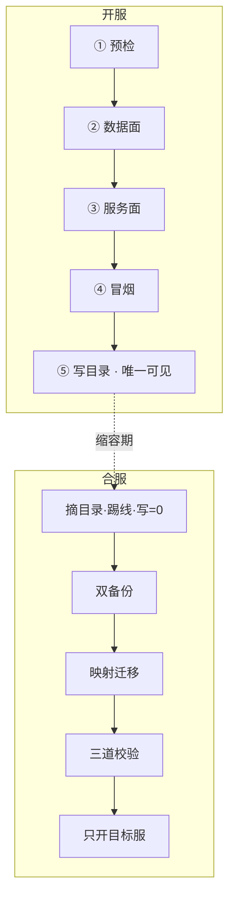
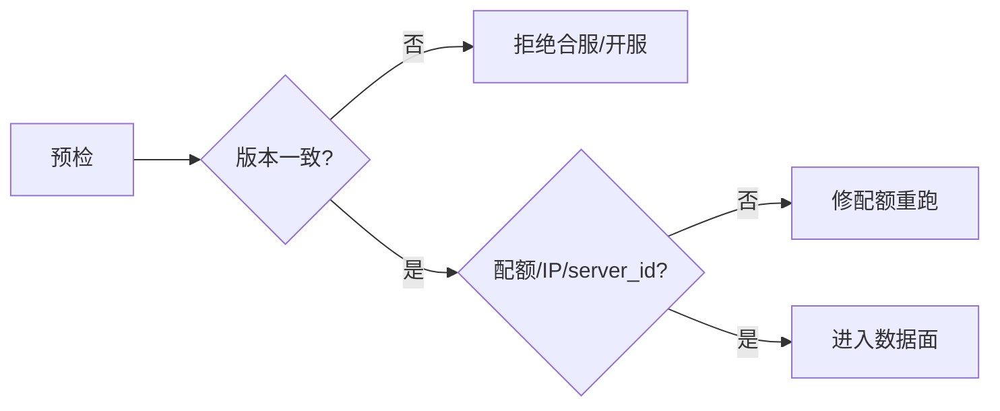
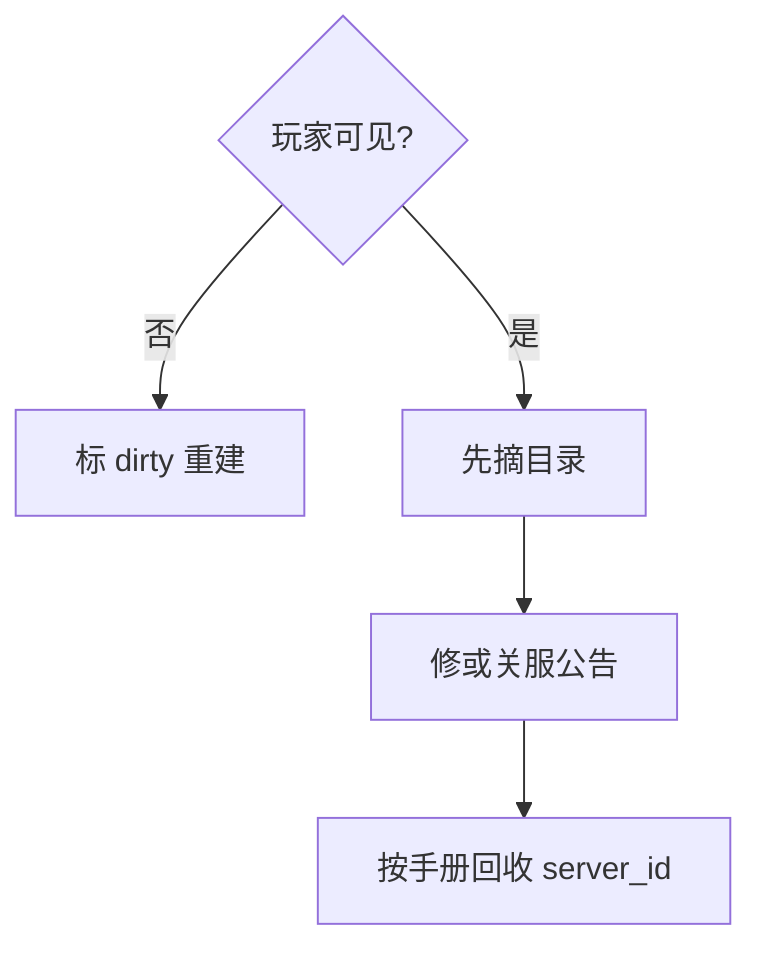
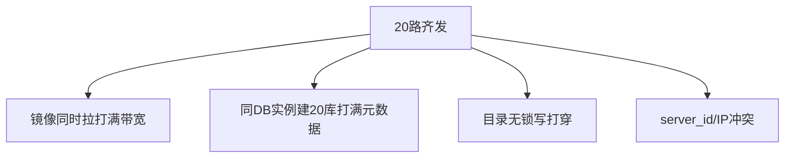
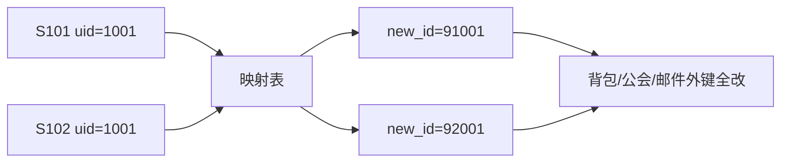
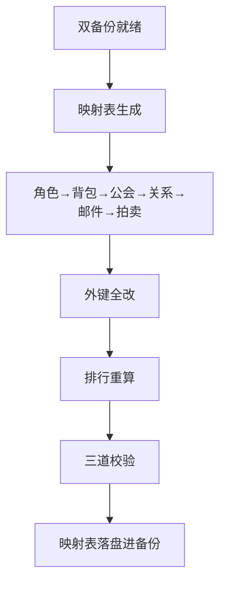
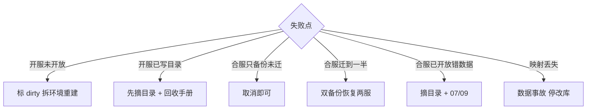
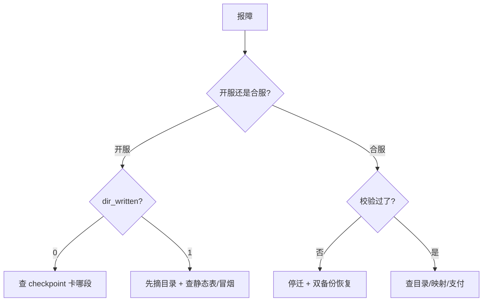

# 开服与合服

> 大家好，欢迎来到这次分享。开讲之前，先带大家回到一个现场：
> 新服已经在列表里能点，进去却是空库——运维说「Pod 全 Running 了」。合服迁到一半，运营在群里要「再给 20 分钟」，有人建议「反向再迁回去」。
> 这一章讲完，你会知道当时「Pod 绿就能写目录」和「反向再迁」各自错在哪，以及开服五段、合服停写链该怎么卡死。
> **本章回答的问题**：一次开服合服变更从预热预检、开服五段、缩容管理、合服停写到数据迁移校验，每段谁可见、卡在哪、失败了怎么撤。
> **本章不讲**：分服拓扑与战斗摘流 → [01](../01-游戏服务器架构/)；热更五类 → [05](../05-热更新与版本发布/)；目录排队 → [02](../02-登录排队与选服/)；合服后回档 → [09](../09-玩家数据备份与回档/)；维护窗口 → [07](../07-停服维护与不停机更新/)。

**标记**：🎯重点 · 🔥难点 · ⭐常考 · 🔧实操

**怎么听这场分享**：先把第一节「开服合服变更的一生」看熟——开服像新店开业，合服像两家银行合并，目录是总闸；第二到第六节顺着开服五段与并行缩容走，第七到第十节走合服停写→映射→校验→回滚；第十一节专门讲开头那个现场怎么定责。每一节讲完会提示对应练习题，趁热打铁。

---

## 一、一张图：开服合服变更的一生

> 🎯 **一句话**：开服像新店开业（装修→试营业→最后挂招牌），合服像两家银行合并（停业清账→双备份→映射迁库→只开一家柜台）——目录是总闸。



**读图**：开服 ①～④ 对玩家不可见，只有 ⑤ 写目录后外面才看得到新服；`kubectl get po` 全 Running 只说明 ③ 过了，不等于开服成功。合服以 MySQL 权威为准、Redis 作废重建；映射表 `old(server_id,id) → new_id` 是永久产物，不是 `/tmp` 临时文件。两种变更的回滚哲学不同：开服未开放拆脏环境、已开放先摘目录；合服失败恢复合服前两份备份，禁止反向再迁。


好，主图装进脑子了。接下来咱们从「预热」开始——预检门禁不过，后面五段全白搭。

本节对应练习题 Q1、Q11。

---

## 二、预热：预检门禁与演练 ⭐🔧

> 🎯 **一句话**：开服合服第一步是预检门禁——镜像 digest、配置 version、协议版本、`server_id` 未占用、中心服健康、配额与 IP 段；口头「都是最新」不算过。

**版本钉死**：与 [05](../05-热更新与版本发布/) 四元组一致（镜像 digest、配置 version、协议版本、数据 schema）；合服前两边二进制、配置、协议必须**完全一致**，否则映射 dry-run 都不要跑。

**`server_id` 分配**：落库分配，带锁；回收须写手册（冷却期、备份归档、数仓打废服标）。并行开 N 服要有 `server_id` 和 IP 段**分布式锁**，防止双开同 ID。

**配额**：DB 实例可建库数、K8s namespace 资源、公网 IP 段、目录写 QPS 预算。

**中心服**：账号、支付、目录、跨服注册中心健康——新服依赖它们，中心挂了开出来也是空壳。

合服预检额外项：T-48h 公告已发；T-4h 关跨服入口，确认跨服回写 QPS=0；映射脚本 dry-run 与正式跑必须是**同一份备份位点**；备份 restore 演练通过——从没 restore 过 = 没有备份。



**读图**：预检失败一律**阻断**，不「先开服再补」。合服预检还要跑 dry-run 输出行数、冲突数、孤儿外键，`orphan_fk > 0` 禁止 T-0。

> 🔍 **现场**：开服任务表 checkpoint 对账。

```bash
# 开服状态机（任务表查询）
mysql -N -e "SELECT server_id,stage,smoke_ok,dir_written FROM open_server_job WHERE server_id='S105'"

# server_id 是否已占用
mysql -N -e "SELECT COUNT(*) FROM server_registry WHERE server_id='S105' AND status IN ('open','merging')"
```

```text
S105  deploy_done  0  1
# ← 冒烟未过(smoke_ok=0)但目录已写(dir_written=1) = 事故：玩家可见但冒烟失败

0
# ← server_id 未占用，可分配
```

> ⚠️ **别混**：**`kubectl apply` 成功**（③ 服务面）≠ **开服成功**（④ 冒烟 + ⑤ 目录）——Pod Running 不能当冒烟。本章首次交代，后面不再重复。

> 📝 **面试**：「预检钉 digest 和 server_id。合服前两服版本必须一致。apply 成功不是开服成功。」

合服演练四件套（缺任一拒绝排生产）：

1. 旁路实例 restore 备份 A/B，跑三道校验 SQL
2. 映射脚本 dry-run 输出行数、冲突数、孤儿外键
3. 全链路计时（踢线→备份→迁移→校验→开目录）× 1.5 = 窗口
4. 回滚演练：双备份恢复两服 + 目录恢复

```bash
# dry-run 示例
./merge.sh --dry-run --backup-a=/bak/S101.sql --backup-b=/bak/S102.sql \
  | tee /var/log/merge-dryrun-$(date +%F).log
grep -E 'conflict|orphan|rows' /var/log/merge-dryrun-*.log | tail
```

```text
roles: 84201 -> 84201 rows (0 conflict)
guild_name_dup: 12 (suffix applied)
orphan_fk: 0          # ← 必须 0，否则禁止 T-0
rank_rebuilt: yes     # ← 必须 yes，不是 union
duration_estimate: 118min
```

T-48h 公告模板含：影响服列表、预计时长、补偿口径（对照 SLA）、合服后跳转规则。T-0 变更负责人、数据负责人、运营公告**分人**，避免一人既迁库又回玩家消息。


预检讲完。大家想想：Pod Running 了就能写目录吗？很多人会答「能」——⭐ 这是高频错答。下一节先把数据面钉死。

本节对应练习题 Q10、Q11。

---

## 三、开服数据面：建库与静态表

> 🎯 **一句话**：数据面给新服**独立权威库**（带 `server_id` 隔离）+ 静态表 + Redis 初始化（活动默认关）——失败删脏 Schema 重建，不 insert 两次。

① 建库/Schema（带 `server_id` 隔离）→ ② 导静态表（掉落、关卡、商品）→ ③ 初始化 Redis（开关默认关、排行空、模拟战标记关）。

开服脚本必须**幂等**：每段可重入；checkpoint 存开服任务表（步骤、版本、操作者、日志），不是内存 for 循环。建库用 `CREATE IF NOT EXISTS` + 静态表版本号校验，禁止 blind insert。

> 💡 **打个比方**：开服数据面像新店开业前摆货架——货架没搭好（Schema 缺）就挂招牌（写目录），顾客进来看到的是空架子。

> 🔍 **现场**：静态表是否真导进去了。

```bash
mysql -N -e "SELECT COUNT(*) FROM item_template WHERE server_id='S105' OR server_id IS NULL"
mysql -N -e "SELECT COUNT(*) FROM role WHERE server_id='S105'"
redis-cli -h redis-s105 INFO keyspace
```

```text
1842
# ← 静态表行数 > 0，导入成功

0
# ← 新服 role 表为空，正常

db0:keys=128,expires=64
# ← 新服 Redis 键少、排行空；活动开关应全关
```

> 📝 **面试**：「建库带 server_id 隔离，静态表版本号校验，Redis 活动默认关。脚本幂等存 checkpoint，不 blind insert。」


数据面讲完。货架摆好了，还要部署服务面，但此时玩家仍看不到新服。

本节对应练习题 Q14。

---

## 四、开服服务面：部署与冒烟

> 🎯 **一句话**：服务面部署 Gate/大厅/Logic，**尚未挂公网目录**；④ 冒烟是登录→创角→战斗结算→邮件的**业务路径**，不是 `health` 探活。

③ 服务面：Gate / 大厅 / Logic Deployment Ready。失败拆 Deployment，标 `dirty`。服务面部署时**尚未挂公网目录**——玩家此时看不到新服。

④ 冒烟：测试账号走完整路径（登录→创角→战斗结算→邮件领取）。冒烟失败**禁止写目录**——玩家能进空库或错表就是事故。单服通常 8～15 分钟；并行开服先卡镜像预热、DB 建库速率、目录写锁，不是 Logic CPU。

冒烟与 `health` 探活的区别：`health` 只查进程存活和端口就绪，冒烟走的是**业务路径**——静态表有没有、创角能不能写库、战斗结算能不能落盘、邮件能不能发。`health` 绿但静态表缺 → 创角必失败。

> 🔍 **现场**：冒烟失败 vs Pod Running。

```bash
kubectl get po -l app=logic,server_id=S105 -n prod
kubectl logs deploy/logic-s105 --tail=20 | grep -iE 'smoke|create_role|error'
```

```text
logic-s105-0   1/1   Running   0   12m
# ← Pod 绿，但 Pod Running ≠ 冒烟通过

ERROR smoke step create_role: static table version mismatch
# ← 冒烟失败原因：静态表版本不匹配
```

> 📝 **面试**：「我盯任务表 checkpoint 和冒烟路径，不是 Pod Running。冒烟失败跳过开放是人为事故。」


服务面与冒烟讲完。记住口诀：**冒烟过才写目录，Pod 绿不算开服**。下一节是总闸——写目录。

本节对应练习题 Q1、Q14。

---

## 五、开放：写目录总闸 ⭐

> 🎯 **一句话**：**目录/服列表是总闸**——只有 ⑤ 写目录对玩家可见；没写进去可以拆环境；写进去再发现错 = 先**摘目录**。

目录写入要求：**独立事务 + 分布式锁**——不和玩家选服共用无保护写路径；开服写入打穿目录 → 老服列表 500 时降级出最后成功列表（[02](../02-登录排队与选服/)）。开放步骤可单独回滚，不要 SSH 手动删目录行。

已开放失败：**先摘目录或标维护** → 冻结创角 → 按手册回收 `server_id`（不能同 ID 立刻再开）。一周后用同一 `server_id` 再开 → 旧库/旧备份/数仓对串 = **串服事故**。

买量日前开服批次与 CDN 资源预热联动（[08](../08-CDN与资源更新/)）：新服开目录前确认客户端资源 manifest 已 HIT，否则新服+新版本叠加 CPS 和下载 miss。开服批次的压测基线见 [03](../03-活动高峰与压测/)。



**读图**：已开放失败玩家可能已创角——作废要处理这些号，不是静默删库。回收手册要点见第六节。


写目录讲完。开一台服会了，一天开 20 服会卡在哪？下一节讲并行与 server_id 生命周期。

本节对应练习题 Q2。

---

## 六、缩容：并行开服与 server_id 生命周期 🔥🔧

> 🎯 **一句话**：一天开 20 服先卡镜像预热、IP/配额、DB 建库速率、目录写锁、`server_id` 锁——不是 Logic CPU；脚本必须**幂等可重入**。

并行开服风险链：



**读图**：正确做法是**分批**（如每批 5 服）、镜像提前预热到节点、建库分散到多 DB 实例、目录写入限速 + 分布式锁。20 路齐发 → ContainerCreating、建库超时、目录 5xx。

开服状态机存**开服任务表**，跳板机重启后「再跑一遍」从 checkpoint 重跑失败段，不是从头来：

```text
checkpoint: precheck | db | deploy | smoke | open
每个 checkpoint 有 status / version / operator / log
```

> 🔍 **现场**：并行开服卡住。

```bash
kubectl get po -A | grep -c ContainerCreating
mysql -N -e "SELECT server_id,stage FROM open_server_job WHERE batch_id='20250901' ORDER BY server_id"
curl -s 'http://dir/internal/health' | jq '.write_qps,.cache_hit'
```

```text
47
# ← 大量 ContainerCreating → 镜像/配额问题，不是 Logic CPU

S101  precheck
S102  db
S103  deploy_done
# ← 各服进度不一，用任务表不是「脚本跑完就算」
```

目录被开服写打穿 → 降级出最后成功列表（[02](../02-登录排队与选服/)），宁可短暂看不到新服，不要老服 500。

### server_id 回收手册要点

回收前检查：该 `server_id` 下是否仍有活跃角色（应无，或已迁移/作废）；备份归档是否打「废服」标，防误 restore；数仓是否标记 `server_status=decommissioned`；冷却期（如 90 天）内禁止同 ID 再开。已开放失败且玩家已创角：除摘目录外，需运营口径（删号/补偿/迁服）——不是纯技术动作。

> 📝 **面试**：「一天 20 服先卡镜像/配额/建库/目录锁；分批预热非齐发。server_id 回收写手册，冷却期内禁止同 ID 再开。」


并行开服讲完。🔥 再钉一次：**一天开 20 服先卡镜像/配额/建库/目录锁，不是 Logic CPU**。好，开服这条线收住，接下复合服——停写与双备份。

本节对应练习题 Q8。

---

## 七、合服：停写与双备份 ⭐🔥🔧

> 🎯 **一句话**：合服主流是**停写合并**，不是在线双写——有状态 + 强一致经济，对账成本高于数小时维护窗口。

游戏战斗房间钉进程、背包行锁、拍卖未结算、跨服写回本服——在线双写需要冲突策略 + 全链路对账 + 回档预案，研发测试成本 ≥ 2 周；停写窗口短、可校验、可双备份恢复。

> 💡 **打个比方**：两家银行合并，你不会让两个柜台同时改同一本账——**停业几小时清账，比边营业边对账便宜**。

### T-0 门禁

**业务写 QPS = 0** 持续 2min+ 才能备份。踢线未完成、跨服还在回写 → 禁止备份。

```bash
# 合服 T-0：业务写 QPS（Prometheus）
curl -s 'http://prom:9090/api/v1/query?query=sum(rate(mysql_writes{server_id=~"S101|S102"}[1m]))' | jq '.data.result[0].value[1]'

# processlist 抽查
mysqladmin processlist | grep -E 'INSERT|UPDATE|DELETE' | grep -v Sleep
```

```text
0
# ← 写 QPS = 0 持续 2min+ 才过门禁

# 空 = 无业务写连接
```

### 双备份与窗口

双备份：源服 A、源服 B 各一份全量（逻辑 + binlog 位点）。备份验收：**旁路 restore** 后跑三道校验 SQL，和合服前快照对账——文件在磁盘上 ≠ 能 restore。

窗口 = 演练耗时 × **1.5**；国内合服常见 **02:00–06:00**；公告 ≥ **48h**。到点未校验通过 → **回滚改期**，不现场加时——加时是客诉和脏数据常见来源。合服不和版本夜、跨服结算、战斗热更叠窗（[13](../13-游戏SRE稳定性/) 事故套餐）。

> 📝 **面试**：「停写可校验可双备份恢复。没有成熟全局 ID+双写中间件别吹在线合服。加时是半成品暴露给玩家的常见来源。」


停写门禁讲完。大家想想：为什么不能边营业边对账？产品常问「无感在线合服」——下一节看映射与冲突，就知道对账有多贵。

本节对应练习题 Q5、Q7、Q10。

---

## 八、迁移：映射与冲突策略 ⭐🔥

> 🎯 **一句话**：合服数据迁移不是两个 dump 直进目标库——**映射表改主外键、排行重算、公会同名加后缀**；映射表永久落盘进备份。

映射表 `old(server_id, id) → new_id` 是永久产物。迁移顺序典型：角色 → 背包 → 公会 → 关系 → 邮件 → 拍卖未结项。

> 💡 **打个比方**：合服像两本独立账本合并——**不能直接把两本页码叠在一起**，必须重新编号并写对照表（映射表），所有引用旧页码的地方都要跟着改。

### 冲突策略

| 冲突 | 做法 | 不能做的 |
|------|------|----------|
| 区内 uid | 映射表，外键全改 | 两边主键直接 insert |
| 角色名 | 被合入方加后缀 + 改名卡 | 静默改名 |
| 公会 | 同名加后缀；成员按映射重写 | 两个同名公会叠成员 |
| 排行 | **合服后重算** | UNION ALL / append |
| 唯一道具 | 全局唯一约束，冲突工单 | 复制给两人 |
| 好友跨已删服 | 丢弃并记日志 | 留悬挂指针 |
| 经济 | 原样迁移 + 事后监控 | 现场「调平衡」 |



**读图**：每个 `old(server_id,id)` 唯一映射到一个 `new_id`；所有外键跟着改。排行不拼接——合服后按合并后角色**重算**。活动期榜要产品定规则（作废/按比例/先结束活动再合）。

映射表必须**落盘、进备份、永久保留**——客诉、封禁、GM 查旧身份、回档都靠它。
丢了 = 数据事故，**停一切改库**。映射表不是 `/tmp` 临时文件，不是跑完就扔的中间产物。

### 收束：合服迁移凭什么不丢号



**读图**：从备份到校验是一条**单向链**，每一步的产物（映射表、改后外键、重算排行）都是下一步的输入。回看这条链：映射表是身份的唯一桥梁、外键改是数据完整性的保证、排行重算不 append 是公平性的保证、三道校验是正确性的最后一道闸。

可背清单——合服迁移七件套：

1. 双备份（源 A、源 B，逻辑 + binlog 位点）
2. 映射表 `old(server_id,id) → new_id`（永久落盘进备份）
3. 迁移顺序：角色 → 背包 → 公会 → 关系 → 邮件 → 拍卖未结项
4. 外键全改（背包、公会、邮件跟随角色映射）
5. 排行重算（不 UNION、不 append）
6. 冲突处理（角色名后缀、公会同名后缀、唯一道具工单、好友跨删服丢弃）
7. 三道校验（计数、金额、抽样）

> ⚠️ **别混**：**映射表**（永久身份对照）≠ **备份**（时间点快照）——两者都要，丢任何一个都无法安全合服或客诉。映射表丢了 = 停一切改库。

> 📝 **面试**：「两个 dump 直进目标库是错的。主键映射、外键全改、排行重算。映射表永久留，不是 /tmp。合服迁移七件套：双备份→映射→顺序迁移→外键改→排行重算→冲突处理→三道校验。」


记住口诀：**映射改主外键，排行重算不 UNION，映射表永久留不是 /tmp**。库迁完只做一半——下一节三道校验与周边系统。

本节对应练习题 Q3、Q9。

---

## 九、校验：三道校验与周边系统

> 🎯 **一句话**：库迁完只做一半——**目录、跨服、支付、GM、数仓**漏一项就是「号没了」或发错货。

### 三道校验

① **计数**：角色数、充值单数、道具种类数 — 合服前后一致（按映射后口径）。  
② **金额**：储值累计总额。  
③ **抽样**：高 V、会长、未领邮件、拍卖未结。

校验不过 → 不开目标服；已开放后发现错 → 摘目录进 [07](../07-停服维护与不停机更新/)/[09](../09-玩家数据备份与回档/)。

### 周边系统清单

| 系统 | 合服后必须 |
|------|------------|
| 目录 | 源服下架或跳转目标服 |
| 跨服 | 战区/房间按新 server_id 集合重配 |
| 支付 | 窗口停写或缓冲，按映射发新 role_id |
| GM/客服 | 旧 server_id+role_id 经映射能查到 |
| 数仓 | 合服日打标，防留存假断崖 |
| 客户端 | 推荐服、已合并标记（通常不需强更） |

源服进程：**不要起写路径**——最多只读查数据，防误写。目录不能再指向源服写入口。

合服维护窗口内支付处理典型策略：**停写期**支付回调缓冲队列或返回「维护中」拒新单；**开放后**按映射表 `old_role_id → new_role_id` 重放未发货订单；**对账**窗口前后各做一次储值总额校验。漏改支付映射 = 扣了钱发到旧 ID 或丢单——与目录漏改同等严重。

### 合服后 Redis 重建

合服后 **Redis 作废重建**，不以 Redis 为权威：

- 会话 / Gate 路由：清空，玩家重连重建
- 排行：按 MySQL 重算写入，不 append 旧榜
- 分布式锁：确认无残留锁（TTL 过期或 flush）
- 跨服房间路由：按新 server_id 集合重配

库迁完若只起 Redis 不起校验，仍会「号在那但进不去」。

```bash
redis-cli -h redis-s105 INFO keyspace
redis-cli -h redis-s105 KEYS 'rank:*' | wc -l
```

```text
db0:keys=128,expires=64
0
# ← 合服后排行不应靠旧 Redis 拼接，应从 MySQL 重算写入
```

> 📝 **面试**：「库合并成功 ≠ 合服完成。周边漏目录或支付 = 找不到号。源服不起写路径。Redis 不是合服权威，库为准。」

### 合服后首周观察

合服开放后 7 天内加密度观察（不等同故障 P0，但 SLI 阈值可收紧）：登录/创角/进战斗分目标服 SLI；充值与发货按新 `role_id` 对账抽样；GM 映射查询工单量（「号没了」早期信号）；排行/公会异常举报；数仓留存曲线是否假断崖（合服日打标是否生效）。

发现映射遗漏：**先摘目标服目录**，不要在线 patch 主键——在线 patch 比停写修复更难证明一致。


校验与周边讲完。合服最怕的不是迁慢，是失败了怎么撤——下一节钉死：禁止反向再迁。

本节对应练习题 Q6、Q12。

---

## 十、回滚：失败怎么撤 ⭐🔥

> 🎯 **一句话**：合服失败**禁止反向再迁**——回滚是丢掉目标上的半成品，用合服前**两份备份分别拉起两服**，目录恢复；开服已开放先摘目录。



**读图**：半成品 delete 会漏表、漏 Redis、漏跨服——**禁止**「把目标库已写入的行 delete 掉再从源库重来」。目标库已有新玩家写入 → 无法无损拆回两服，评估修映射或回档窗口内订单。

| 现象 | 先做 | 别做 |
|------|------|------|
| apply 成功但进空库 | 先摘目录 | 再导一次表当没事 |
| 冒烟失败 | 标 dirty 重建 | 跳过开放 |
| 合服迁到一半 | 停；双备份恢复 | 反向再迁 |
| 运营再给 20 分钟 | 拒绝，按变更单回滚 | 现场加时 |
| 玩家说号没了 | 目录跳转 + 映射表 | 先怀疑库没迁完 |
| 映射在 /tmp | 落盘进备份 | 当留存 |

### 合服 T 日时间线

```text
T-48h   公告、冻结无关变更
T-4h    预检、关跨服、版本四元组对齐
T-1h    dry-run 输出 orphan=0 复核
T-0     摘目录→踢线→写QPS=0→双备份
T+0~2h  映射迁移（角色→背包→公会→…）
T+2~3h  三道校验
T+3h    只开目标服目录
T+7d    首周加密度观察
```

到点未过校验 → 按变更单回滚，运营「再给 20 分钟」拒绝。

> 📝 **面试**：「合服失败禁止反向再迁——双备份恢复两服+目录恢复。映射丢失 = 停一切改库。开服已开放先摘目录。」


现在再看群里那句「再给 20 分钟 / 反向再迁」，你知道该怎么拦住他了。下一节把开服合服定责收成 60 秒剧本。

本节对应练习题 Q4。

---

## 十一、作战：开服合服定责

> 🎯 **一句话**：「能点进新服但创角失败」查冒烟与静态表；「号没了」查映射与目录；「合服超时」到点回滚不加时。

### 定责决策树



### 60 秒剧本 🔧

```text
① 0–10s  开服：checkpoint+dir_written；合服：写QPS+校验状态
② 10–30s  开服：静态表行数+冒烟日志；合服：映射表是否在备份链
③ 30–45s  已可见：摘目录；迁一半：停+恢复备份
④ 45–60s  拒绝加时；周边清单逐项勾
```

一天开 20 服先卡什么：镜像预热、IP/配额、DB 建库速率、目录写锁、`server_id` 锁——不是 Logic CPU。20 路齐发 → ContainerCreating、建库超时、目录 5xx。要**分批 + 预热**，不是齐发。

合服后首周观察也归入作战视野：登录/创角/进战斗分目标服 SLI 收紧阈值；充值与发货按新 `role_id` 对账抽样；GM 映射查询工单量是「号没了」的早期信号。发现映射遗漏先摘目标服目录，不要在线 patch 主键——在线 patch 比停写修复更难证明一致。


定责剧本齐了。收口把命令、面试口径和数字墙收齐。

本节对应练习题 Q13。

---

## 十二、收口

### 命令速查 🔧

```bash
# 开服进度
mysql -N -e "SELECT server_id,stage,smoke_ok,dir_written FROM open_server_job WHERE server_id='S105'"

# 合服 T-0
curl -s 'http://prom:9090/api/v1/query?query=sum(rate(mysql_writes{server_id=~"S101|S102"}[1m]))'

# 静态表/角色
mysql -N -e "SELECT COUNT(*) FROM role WHERE server_id='S105'"

# Redis 状态
redis-cli -h redis-s105 INFO keyspace
```

### 面试锚点

遮住右列自问自答，卡壳的行回去重读对应小节——能讲出来才算会，看着答案点头不算。

| 问 | 30 秒答 |
|----|---------|
| 开服几段？哪步可见？ | 五段：预检→数据→服务→冒烟→写目录；只有最后可见。 |
| apply 成功=开服？ | 否；冒烟过才写目录。 |
| 已开放失败？ | 先摘目录；server_id 回收写手册。 |
| 合服冲突？ | 映射改主外键；排行重算；公会同名后缀。 |
| 映射表？ | 永久落盘进备份；丢了停改库。 |
| 为何停写不合在线双写？ | 有状态+强一致，对账成本>维护窗。 |
| 合服失败回滚？ | 双备份恢复两服；禁止反向再迁。 |
| 窗口超时？ | 到点回滚；拒绝加时。 |
| 库迁完=合服完成？ | 否；目录/跨服/支付/GM/数仓。 |
| 一天 20 服？ | 先卡镜像/配额/建库/目录锁；分批。 |

### 易错一句话对照

- apply 成功 = 开服成功 → 冒烟+目录
- 两个 dump 直进目标库 → 映射
- 排行 UNION → 重算
- 反向再迁 = 回滚 → 双备份恢复
- 映射表可删 → 永久留
- 在线双写更先进 → 停写主流
- 窗口超时加时 → 到点回滚
- Redis 是合服权威 → MySQL 为准
- 源服起写方便对账 → 禁写路径
- 经济现场调平衡 → 裸改禁止

### 数字墙

> 单服开服 **8～15 min** · 合服公告 ≥ **48h** · 窗口 = 演练 × **1.5** · 国内合服 **02:00–06:00** · 写 QPS=0 持续 **2min+** · 校验 **三道**（计数/金额/抽样） · server_id 回收冷却期 **≥90 天**

---

## 合上书

学到这里，先别急着翻下一章。合上书，试试下面这几件事能不能做到——能做到，这章才算真的听懂了。卡住的那一条，就回到对应的小节再听一遍：

- [ ] **默画主图**：开服五段 + 合服停写链，标出唯一可见点（写目录）（Q1）
- [ ] **口述开服五段**（预检→数据→服务→冒烟→写目录）与每段失败动作（Q1、Q14）
- [ ] **口述已开放 vs 未开放**回滚差异与 server_id 回收手册（冷却期、废服标、数仓 decommissioned）（Q2）
- [ ] **口述合服冲突策略表**与映射表为何永久留（≠ 备份）（Q3、Q9）
- [ ] **口述停写 vs 在线双写**的理由（有状态+强一致，对账成本>维护窗）（Q7）
- [ ] **口述 T-0 门禁**（写 QPS=0 持续 2min+）与备份 restore 验收（Q10、Q11）
- [ ] **口述三道校验**（计数/金额/抽样）与周边系统清单（目录/跨服/支付/GM/数仓/客户端）（Q6）
- [ ] **说明禁止反向再迁**与双备份恢复两服（Q4）
- [ ] **口述窗口怎么定**（演练×1.5）；运营加时怎么答（到点回滚拒绝加时）（Q5）
- [ ] **口述一天 20 服**先卡什么（镜像/配额/建库/目录锁，非 Logic CPU）与分批预热（Q8）
- [ ] **口述合服 Redis 重建**与为何不以 Redis 为权威（MySQL 为准）（Q12）
- [ ] **默画合服迁移七件套**（双备份→映射→顺序迁移→外键改→排行重算→冲突处理→三道校验）（Q3、Q13）

全部打勾之后，给自己出一个终极测试：找一位同事，十分钟讲清本章开头那个现场——错在哪、正确第一刀是什么。讲得下来，这章才算过关。

下一章：[停服维护与不停机更新](../07-停服维护与不停机更新/)。上一章：[热更新与版本发布](../05-热更新与版本发布/)。
