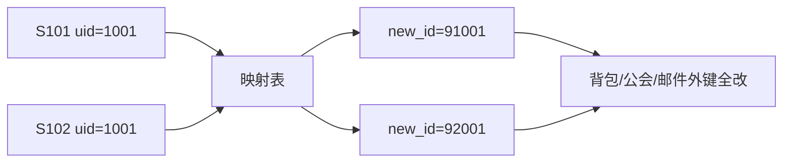
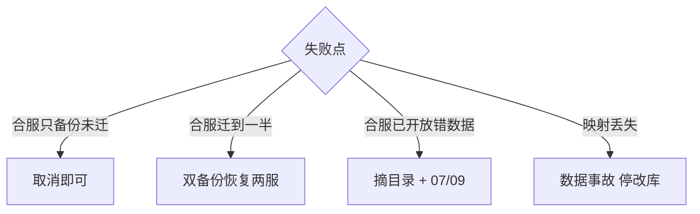

# 06｜开服与合服 · 练习题

开始做题前，先给大家一个小建议：合上知识点，对着**第一节的主图**，把「开服合服变更的一生」——开服五段到合服停写链——口述一遍。能顺下来，下面这些题你会发现大半都会了；卡壳的地方，就是你该回去重读的那一节。

做题的方式也建议改一下：每道题**先看标题和场景，自己口述一遍答案，再往下看「完整解答」对答案**。直接看解答，容易产生「我会了」的错觉——能讲出来才是真的会。

| 标记 | 含义 |
|------|------|
| **核心** | 不懂整章就没建立起来 |
| **必会** | 值班和面试都要能讲 |
| **常用** | 线上会反复碰到 |
| **常考** | 白板和追问的高频口径 |

题目的顺序也是有意排的：Q1～Q4 先钉开服五段与回滚；Q5～Q9 讲合服窗口、映射、周边；Q10～Q14 收尾到 T-0、演练、Redis 与 60 秒定责。

## 本题目录

- [Q1 开服五段](#q1)
- [Q2 已开放回滚](#q2)
- [Q3 合服冲突与映射](#q3)
- [Q4 禁止反向再迁](#q4)
- [Q5 合服窗口](#q5)
- [Q6 周边系统](#q6)
- [Q7 停写 vs 双写](#q7)
- [Q8 并行开服与幂等](#q8)
- [Q9 排行与唯一道具](#q9)
- [Q10 T-0 门禁](#q10)
- [Q11 合服演练](#q11)
- [Q12 Redis 重建](#q12)
- [Q13 60 秒开服合服](#q13)
- [Q14 静态表版本 blind insert](#q14)
- [合上书](#合上书)

---

## Q1

**★★★★★｜开服流水线几段？哪步对玩家可见？apply 成功算开服吗？**

**覆盖**：核心 · 必会 · 常考 ｜ **对应**：知识点 [四、开服服务面：部署与冒烟](知识点.md)

### 场景

apply 完就写目录。冒烟未跑。玩家创角失败，客服说登录挂了。

先自己试试：不看下面，先口述一遍你的答案，再往下对。

### 完整解答

> 🎯 **一句话**：五段只有写目录可见；apply/Pod Running 不等于开服。

预检→数据→服务→冒烟→写目录。④ 冒烟是登录→创角→战斗结算→邮件的业务路径，不是 `health` 探活。单服 8～15 分钟。

```bash
kubectl get po -l app=logic,server_id=S105 -n prod
# logic-s105-0   1/1   Running   0   12m  ← Pod 绿 ≠ 冒烟通过

kubectl logs deploy/logic-s105 --tail=20 | grep -iE 'smoke|create_role|error'
# ERROR smoke step create_role: static table version mismatch  ← 冒烟失败
```

> ⚠️ **别混**：`kubectl apply` 成功（③ 服务面）≠ 开服成功（④ 冒烟 + ⑤ 目录）——Pod Running 不能当冒烟。
> 📝 **面试**：盯任务表 checkpoint 和冒烟路径，不是 Pod 绿。冒烟失败跳过开放是人为事故。

### 再追问

冒烟失败能开放吗？——不能，标 dirty 重建，不 insert 两次静态表。

---

## Q2

写目录总闸之后——已开放怎么撤。

**★★★★★｜已写入服列表后失败怎么回滚？**

**覆盖**：核心 · 必会 ｜ **对应**：知识点 [五、开放：写目录总闸](知识点.md)

### 场景

新服在推荐位，静态表是上周版本。有人 SSH 删目录行准备同 ID 再开。

先自己试试：不看下面，先口述一遍你的答案，再往下对。

### 完整解答

> 🎯 **一句话**：先摘目录；server_id 回收写手册，禁止同 ID 立刻再开。

未开放拆脏环境重建；已开放先摘目录或标维护 → 冻结创角 → 按手册回收 `server_id`（冷却期 ≥ 90 天、备份打废服标、数仓 `decommissioned`）。变更回滚，不 SSH 改目录。已开放失败玩家可能已创角——需运营口径（删号/补偿/迁服），不是静默删库。

> 📝 **面试**：回收手册四件——冷却期、废服标、数仓 decommissioned、禁止同 ID 立刻再开。同 ID 再开 = 串服事故。

### 再追问

为何要回收手册？——同 ID 再开会对串旧库/备份/数仓，旧角色数据和新服混在一起。

---

## Q3

这是合服迁移的核心：映射与冲突。

**★★★★★｜合服冲突怎么处理？映射表为何永久留？**

**覆盖**：核心 · 必会 · 常考 ｜ **对应**：知识点 [八、迁移：映射与冲突策略](知识点.md)

### 场景

准备 dump 直进目标库。排行 UNION，公会同名叠成员。

先自己试试：不看下面，先口述一遍你的答案，再往下对。

### 完整解答

> 🎯 **一句话**：映射改主外键；排行重算；映射表落盘进备份永久留。

区内 uid 走映射表、外键全改；角色名被合入方加后缀 + 改名卡；公会同名加后缀、成员按映射重写；排行合服后**重算**不 UNION；唯一道具全局唯一约束、冲突走工单不复制；好友跨已删服丢弃记日志；经济原样迁移 + 事后监控，禁止现场调平衡。三道校验：计数/金额/抽样。



> ⚠️ **别混**：映射表（永久身份对照）≠ 备份（时间点快照）——两者都要，丢任何一个都无法安全合服或客诉。
> 📝 **面试**：两个 dump 直进目标库是错的。主键映射、外键全改、排行重算。映射表永久留，不是 /tmp。

### 再追问

好友指向已删服？——丢弃记日志，不留悬挂指针。经济不平衡怎么办？——原样迁移，事后监控，禁止现场裸改。

---

## Q4

就是开头那个「反向再迁」现场。

**★★★★★｜合服失败为何禁止反向再迁？**

**覆盖**：必会 · 常考 ｜ **对应**：知识点 [十、回滚：失败怎么撤](知识点.md)

### 场景

迁到公会表超时。建议 delete 目标库已写入行再重来。映射在 /tmp。

先自己试试：不看下面，先口述一遍你的答案，再往下对。

### 完整解答

> 🎯 **一句话**：回滚 = 双备份恢复两服 + 目录恢复；禁止反向再迁；映射丢失停改库。

半成品 delete 会漏表、漏 Redis、漏跨服——目标库已有新玩家写入就无法无损拆回两服。正确回滚是丢掉目标上的半成品，用合服前**两份备份分别拉起两服**，目录恢复。映射在 `/tmp` 不算留存——必须落盘进备份。



> 📝 **面试**：禁止反向再迁——目标库已写入行 delete 掉会漏表漏 Redis。回滚用备份恢复，不是 delete 重来。

### 再追问

目标库已有新登录？——停写，评估修映射或回档窗口内订单。在线 patch 主键比停写修复更难证明一致。

---

## Q5

和 Q4 的回滚门禁呼应——窗口怎么定、加时怎么拒。

**★★★★☆｜合服窗口怎么定？运营加时 20 分钟？**

**覆盖**：必会 · 常用 ｜ **对应**：知识点 [七、合服：停写与双备份](知识点.md)

### 场景

版本夜「顺便合服」。04:30 校验未过，运营要再加 20 分钟。

先自己试试：不看下面，先口述一遍你的答案，再往下对。

### 完整解答

> 🎯 **一句话**：低峰 + 演练 × 1.5 + 公告 ≥ 48h；到点未过回滚，拒绝加时。

国内常见 02:00–06:00。不合版本夜、跨服结算、战斗热更叠窗（[13](../13-游戏SRE稳定性/) 事故套餐）。超时策略写进变更单：加时是客诉和脏数据的常见来源。

> 📝 **面试**：加时是半成品暴露给玩家的常见来源。到点未过校验 → 按变更单回滚改期。

### 再追问

停写亏流水？——低峰 + 卡死窗口 + 公告；加时才是真亏，半成品暴露给玩家。

---

## Q6

库迁完只做一半——周边系统漏一项就是「号没了」。

**★★★★☆｜库迁完合服完成了吗？源服还要起写吗？**

**覆盖**：必会 · 常用 ｜ **对应**：知识点 [九、校验：三道校验与周边系统](知识点.md)

### 场景

库迁完。目录仍指源服。支付按旧 role_id。数仓留存腰斩。

先自己试试：不看下面，先口述一遍你的答案，再往下对。

### 完整解答

> 🎯 **一句话**：库成功 ≠ 合服完成；目录/跨服/支付/GM/数仓都要改；源服禁写。

周边清单六项：目录（源服下架或跳转目标服）、跨服（按新 server_id 集合重配）、支付（窗口停写或缓冲，按映射发新 role_id）、GM（旧 ID 经映射能查到）、数仓（合服日打标防假断崖）、客户端（推荐服标记）。源服最多只读，不起写路径。

> 📝 **面试**：库合并成功 ≠ 合服完成。周边漏目录或支付 = 找不到号。源服不起写路径。

### 再追问

GM 查旧 ID？——必须经映射表能查到。支付漏改映射？——扣了钱发到旧 ID 或丢单，与目录漏改同等严重。

---

## Q7

这是 Q5 停写结论的「为什么」版。

**★★★★☆｜为何主流停写不合在线双写？**

**覆盖**：必会 · 常考 ｜ **对应**：知识点 [七、合服：停写与双备份](知识点.md)

### 场景

产品要「无感在线合服」，像互联网双写灰度。

先自己试试：不看下面，先口述一遍你的答案，再往下对。

### 完整解答

> 🎯 **一句话**：有状态 + 强一致经济，双写对账成本 > 短维护窗；Redis 非权威。

游戏战斗房间钉进程、背包行锁、拍卖未结算、跨服写回本服——在线双写需要冲突策略 + 全链路对账 + 回档预案，研发测试成本 ≥ 2 周。停写窗口短、可校验、可双备份恢复。没有成熟全局 ID + 双写中间件别吹在线合服。

> 💡 **打个比方**：两家银行合并，你不会让两个柜台同时改同一本账——停业几小时清账，比边营业边对账便宜。
> 📝 **面试**：停写可校验可双备份恢复。没有成熟全局 ID+双写中间件别吹在线合服。

### 再追问

Redis 合服权威吗？——否，库为准，Redis 重建（会话清空、排行重算、锁清残留、跨服路由重配）。

---

## Q8

开服线的并行版——一天 20 服卡在哪。

**★★★★☆｜开服脚本中断怎么幂等？一天开 20 服先卡什么？**

**覆盖**：必会 · 常用 ｜ **对应**：知识点 [六、缩容：并行开服与 server_id 生命周期](知识点.md)

### 场景

并行开 20 服，跳板机重启，静态表 insert 两次。一半 ContainerCreating，目录 5xx。

先自己试试：不看下面，先口述一遍你的答案，再往下对。

### 完整解答

> 🎯 **一句话**：任务表 checkpoint + 每段可重入；先卡镜像/配额/建库/目录锁，分批预热非齐发。

开服状态机存**开服任务表**（checkpoint: precheck | db | deploy | smoke | open），跳板机重启后从失败段重跑。建库用 `CREATE IF NOT EXISTS` + 静态表版本号校验，禁止 blind insert。目录写入独立锁，未 smoke_ok 禁止 dir_written=1。

20 路齐发 → ContainerCreating（镜像/配额）、建库超时（DB 元数据）、目录 5xx（无锁写）。要分批（每批 5 服）+ 镜像提前预热到节点 + 建库分散到多 DB 实例。目录打穿 → 降级最后成功列表（[02](../02-登录排队与选服/)）。压测基线见 [03](../03-活动高峰与压测/)。

> 📝 **面试**：一天 20 服先卡镜像/配额/建库/目录锁，不是 Logic CPU。分批预热非齐发。

### 再追问

状态机存哪？——开服任务表，不是 for 循环内存。server_id 怎么防冲突？——落库分配带分布式锁。

---

## Q9

就是 Q3 冲突表里「排行 / 唯一道具」那两行。

**★★★☆☆｜合服后排行怎么处理？唯一道具？**

**覆盖**：常用 · 常考 ｜ **对应**：知识点 [八、迁移：映射与冲突策略](知识点.md)

### 场景

战力榜 UNION，两个第一名，活动奖重发。

先自己试试：不看下面，先口述一遍你的答案，再往下对。

### 完整解答

> 🎯 **一句话**：排行重算不 append；唯一道具冲突走工单不复制。

排行合服后按合并后角色**重算**，不 UNION ALL、不 append 旧榜。唯一道具全局唯一约束，冲突走工单不复制给两人。活动期合服先结束活动或产品定作废/按比例规则。

> 📝 **面试**：排行重算不 append。唯一道具全局唯一约束，冲突工单。活动期榜要产品定规则。

### 再追问

两边都有神器？——全局唯一约束，冲突工单解决，不能复制给两人。

---

## Q10

合服 T-0 门禁——写 QPS=0 与备份验收。

**★★★★☆｜合服 T-0 看什么？备份怎样才算有？**

**覆盖**：必会 · 常用 ｜ **对应**：知识点 [二、预热：预检门禁与演练](知识点.md)

### 场景

备份文件在但从没 restore。写 QPS > 0 已开始迁。

先自己试试：不看下面，先口述一遍你的答案，再往下对。

### 完整解答

> 🎯 **一句话**：写 QPS = 0 持续 2min+ 才能迁；备份 = 旁路 restore + 三道校验。

T-0 门禁：业务写 QPS = 0 持续 2min+ 才能备份。踢线未完成、跨服还在回写 → 禁止备份。备份验收：旁路 restore 后跑三道校验 SQL 和合服前快照对账——文件在磁盘上 ≠ 能 restore。dry-run 与正式跑必须是同一份备份位点。

```bash
curl -s 'http://prom:9090/api/v1/query?query=sum(rate(mysql_writes{server_id=~"S101|S102"}[1m]))' | jq '.data.result[0].value[1]'
# 0  ← 写 QPS = 0 持续 2min+ 才过门禁

mysqladmin processlist | grep -E 'INSERT|UPDATE|DELETE' | grep -v Sleep
# 空 = 无业务写连接
```

> 📝 **面试**：没演练 = 没备份。从没 restore 过的备份不算备份。

### 再追问

跨服回写还在飞？——先冻跨服入口（T-4h 关跨服），确认回写 QPS=0，再停本服。

---

## Q11

和 Q10 配套：没演练 = 没备份。

**★★★☆☆｜合服演练必须做什么？dry-run 看什么字段？**

**覆盖**：必会 ｜ **对应**：知识点 [二、预热：预检门禁与演练](知识点.md)

### 场景

「做过合服」但从没 dry-run，也没计时。

先自己试试：不看下面，先口述一遍你的答案，再往下对。

### 完整解答

> 🎯 **一句话**：restore 验证 + dry-run 冲突/孤儿 + 全链路计时 × 1.5 + 回滚演练，四件缺任一拒绝排生产。

演练四件套：① 旁路实例 restore 备份 A/B 跑三道校验；② 映射脚本 dry-run 输出行数、冲突数、孤儿外键；③ 全链路计时 × 1.5 = 窗口；④ 回滚演练（双备份恢复两服 + 目录恢复）。

dry-run 必看字段：`orphan_fk` 必须 0、`rank_rebuilt` 必须 yes（不是 union）。`orphan_fk > 0` 或 `rank_rebuilt: no` → 禁止 T-0。

> 📝 **面试**：没演练过的合服不排生产。dry-run orphan_fk > 0 禁止正式跑。

### 再追问

能和版本夜叠吗？——拒绝，[13](../13-游戏SRE稳定性/) 事故套餐。变更负责人、数据负责人、运营公告要分人。

---

## Q12

Q7 追问的展开——合服后 Redis 怎么重建。

**★★★☆☆｜合服后 Redis 怎么处理？为何不以 Redis 为权威？**

**覆盖**：常用 ｜ **对应**：知识点 [九、校验：三道校验与周边系统](知识点.md)

### 场景

库迁完只起 Redis 从旧服复制，排行看起来「正常」。

先自己试试：不看下面，先口述一遍你的答案，再往下对。

### 完整解答

> 🎯 **一句话**：Redis 作废重建；排行从 MySQL 重算，不 append 旧榜。

合服后 Redis 四类键重建：会话/Gate 路由清空（玩家重连重建）；排行按 MySQL 重算写入；分布式锁确认无残留（TTL 过期或 flush）；跨服房间路由按新 server_id 集合重配。库迁完若只起 Redis 不起校验，仍会「号在那但进不去」。

```bash
redis-cli -h redis-s105 INFO keyspace
# db0:keys=128,expires=64  ← 键少

redis-cli -h redis-s105 KEYS 'rank:*' | wc -l
# 0  ← 合服后排行不应靠旧 Redis 拼接，应从 MySQL 重算写入
```

> 📝 **面试**：Redis 不是合服权威，MySQL 为准。合服后 Redis 作废重建，排行重算不 append。

### 再追问

开服 Redis 默认？——活动关、排行空、模拟战标记关，避免空服被脚本误开活动。

---

## Q13

把前面开服 checkpoint 与合服写 QPS 收成 60 秒。

**★★★★★｜60 秒：开服任务卡住 / 合服窗口内告警，你怎么定方向？**

**覆盖**：核心 · 必会 · 🔧 ｜ **对应**：知识点 [十、作战：开服合服定责](知识点.md)

### 场景

开服：Pod Running 但推荐位没新服。合服：窗口内写 QPS 告警。群里有人要「再 apply 一遍」或「跳过校验先开目录」。

先自己试试：不看下面，先口述一遍你的答案，再往下对。

### 完整解答

> 🎯 **一句话**：**开服查 checkpoint + 冒烟**；**合服查写 QPS + 校验状态**——禁止跳过冒烟/校验开放目录。

```text
开服 0–10s   任务表 checkpoint 卡哪段（precheck/db/deploy/smoke/open）
开服 10–30s  冒烟日志 create_role/static version · Pod≠冒烟
开服 30–60s  dir_written 是否误写 · 未 smoke_ok 禁止开放

合服 0–10s   写 QPS 是否连续 2min=0 · 跨服回写
合服 10–30s  三道校验 / dry-run orphan_fk · 备份是否 restore 验过
合服 30–60s  周边六项（目录/支付/GM）· 禁止加时硬迁
```

```bash
mysql -e "SELECT server_id,checkpoint,status FROM open_server_task WHERE server_id='S105'"
# deploy | failed   ← 从 failed 段重跑，不是从头 blind insert

curl -s 'http://prom:9090/api/v1/query?query=sum(rate(mysql_writes{server_id=~"S101|S102"}[1m]))' | jq '.data.result[0].value[1]'
# 非 0 → 合服禁止备份/迁移
```

> 📝 **面试**：一天 20 服先卡镜像/配额/建库/目录锁，不是 Logic CPU（Q8）。合服没演练 = 没备份（Q11）。

### 再追问

**能和版本夜叠吗？**——拒绝，[13](../13-游戏SRE稳定性/) 事故套餐。

---

## Q14

这是 Q1 冒烟失败的根因版——静态表 blind insert。

**★★★★☆｜静态表 blind insert 两次会怎样？版本号校验怎么口述？**

**覆盖**：必会 · 常考 ｜ **对应**：知识点 [四、开服服务面：部署与冒烟](知识点.md)

### 场景

跳板机重启后脚本从头跑，`INSERT INTO static_item` 第二次，主键冲突或数据翻倍。冒烟报 `static table version mismatch`，有人仍要「先开放让玩家进」。

先自己试试：不看下面，先口述一遍你的答案，再往下对。

### 完整解答

> 🎯 **一句话**：建库 **`CREATE IF NOT EXISTS` + 静态表版本号校验**；脚本幂等存 **checkpoint**，禁止 blind insert；冒烟失败 **禁止写目录**。

```sql
-- 幂等建库
CREATE DATABASE IF NOT EXISTS game_s105;

-- 版本校验（示例）
SELECT version FROM static_meta WHERE name='item';
-- 期望 20260802，实际 20260725 → 冒烟失败
```

blind insert 后果：重复主键报错中断流水线，或静默翻倍导致战斗数值错、经济脏。正确做法：任务表记录静态表版本，已导入则 skip；失败段从 checkpoint **重跑失败段**，不是整脚本重头来。冒烟必须走 **登录→创角→战斗→邮件**，`health` 探活不算冒烟。

> ⚠️ **别混**：`kubectl apply` 成功 ≠ 静态表正确——Pod 绿但版本错，玩家进服即炸。

> 📝 **面试**：「脚本幂等存 checkpoint，不 blind insert。」冒烟失败跳过开放是人为事故。

### 再追问

**静态表从哪来？**——镜像/包内版本与开服任务声明一致；合服禁止对目标服 blind insert 源服静态表。

---

## 合上书

学到这里，先别急着翻下一章。合上书，试试下面这几件事能不能做到——能做到，这章才算真的听懂了。卡住的那一条，就回到对应的小节再听一遍：

- [ ] 能默画开服五段 + 合服停写链，标出唯一可见点（写目录）
- [ ] 能讲只有写目录可见与 apply ≠ 开服（冒烟 + 目录）
- [ ] 能区分已/未开放回滚与 server_id 回收手册（冷却期、废服标、数仓 decommissioned）
- [ ] 能口述冲突表、映射永久留（≠ 备份）、三道校验
- [ ] 能讲双备份恢复、禁反向再迁
- [ ] 能定窗口（演练 × 1.5）、拒加时、列周边系统（目录/跨服/支付/GM/数仓/客户端）
- [ ] 能讲停写原因（有状态 + 强一致，对账成本 > 维护窗）
- [ ] 能讲一天 20 服卡点（镜像/配额/建库/目录锁）与幂等 checkpoint
- [ ] 能讲 T-0 门禁（写 QPS=0 持续 2min+）、演练四件套、dry-run orphan_fk=0
- [ ] 能讲合服 Redis 重建与为何不以 Redis 为权威
- [ ] 能 **60 秒** 定开服 checkpoint / 合服写 QPS 方向（Q13）
- [ ] 能讲静态表版本校验、禁止 blind insert、冒烟失败不开放（Q14）
- [ ] 能默画合服迁移七件套（双备份→映射→顺序迁移→外键改→排行重算→冲突处理→三道校验）
