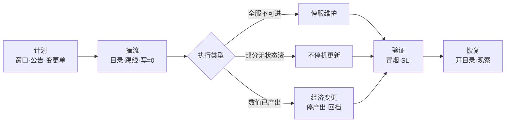
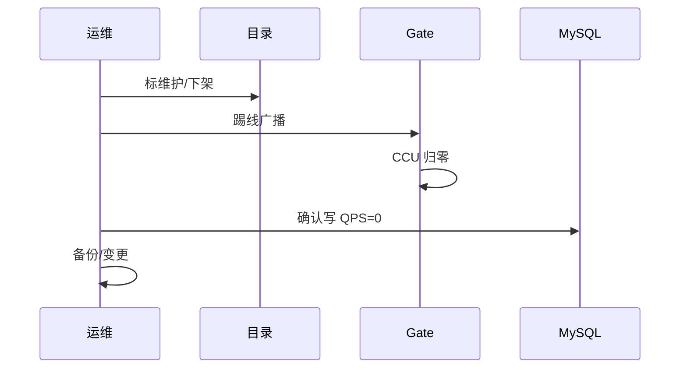
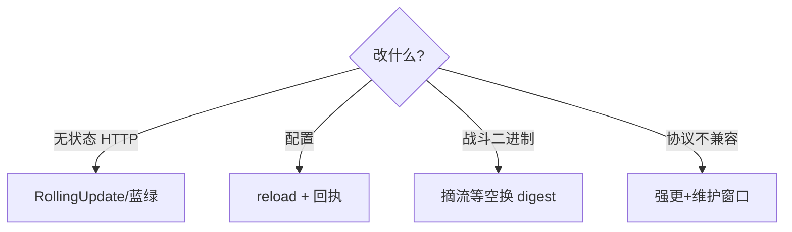
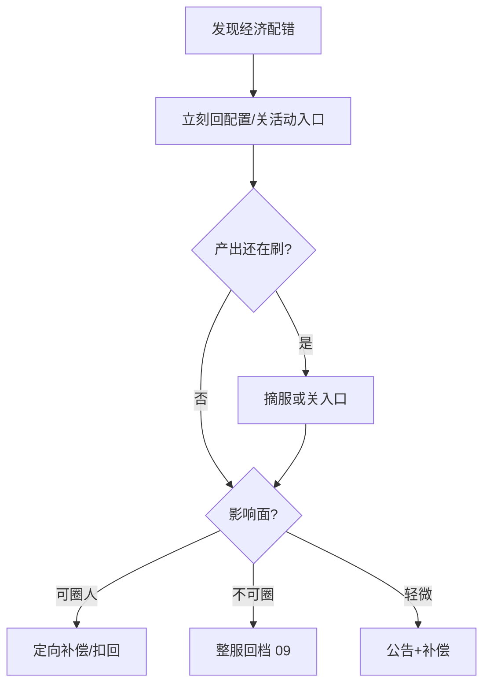
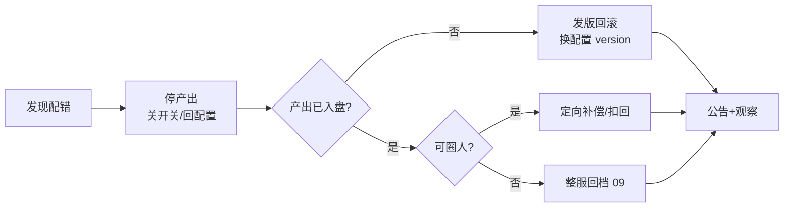
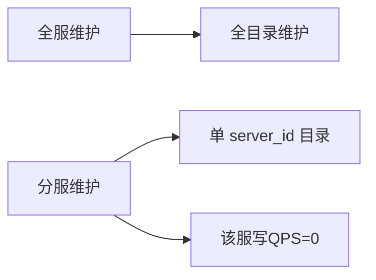
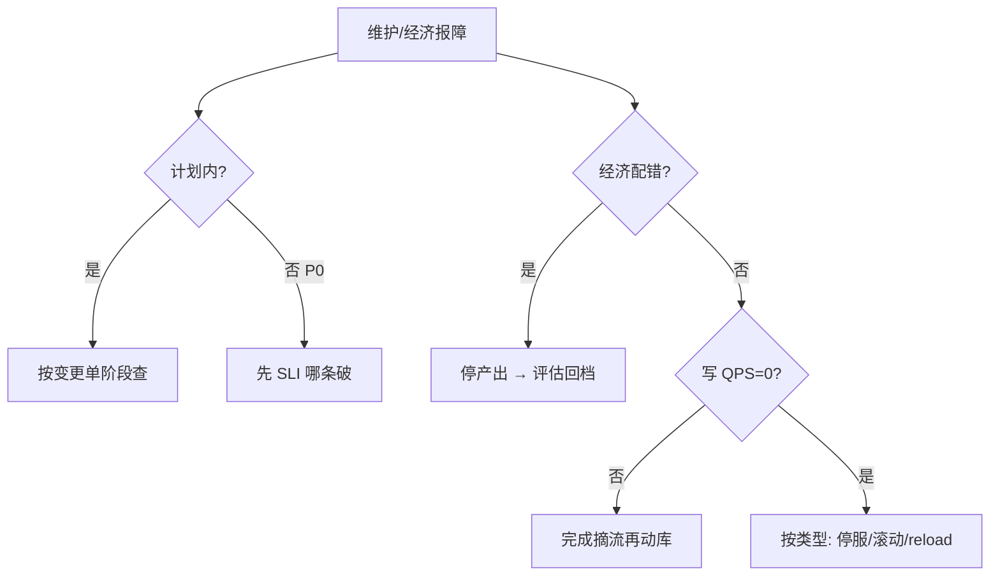

# 停服维护与不停机更新

> 掉落配错 ×100，有人要热更 ×0.01，有人要全服维护——ECON 产出还在刷，写 QPS 还没归零就动库，SLI 眼看要破。
> **本章回答**：一次维护变更从计划公告、摘流踢线、停服/不停机执行、验证到恢复，每种维护改什么、谁可见、经济错了走哪条路。
> **不讲**：战斗摘流四步 → [01](../01-游戏服务器架构/)；热更五类 → [05](../05-热更新与版本发布/)；合服停写 → [06](../06-开服合服/)；数据回档 → [09](../09-玩家数据备份与回档/)；SLO 定级 → [13](../13-游戏SRE稳定性/)。

**标记**：🎯重点 · 🔥难点 · ⭐常考 · 🔧实操

---

## 一、一张图：维护变更的一生

> 🎯 **一句话**：维护变更像手术——计划排期 → 麻醉摘流 → 动刀（停服或不停机）→ 缝合验证 → 苏醒开放。



- 📖 **读图**
  - 🛤️ 主线五段：计划 → 摘流 → 执行三分支 → 验证 → 恢复；卡在哪一段，刀就动哪一段
  - 🔀 执行分叉：全服不可进 / 无状态滚动 / 经济停产出——三条路验证与开放共用
  - 🚨 计划内维护另本错误预算账，但 SLI 破了仍按 P0 响应（[13](../13-游戏SRE稳定性/)）

本节对应练习题 Q1。

---

## 二、计划：窗口、公告与变更单 ⭐

> 🎯 **一句话**：维护先写**变更单**——类型（停服/不停机/经济）、窗口、影响范围、回滚条件、公告文案；活动整点**禁无关变更**。

| 类型 | 玩家感知 | 典型场景 | 窗口 |
|------|----------|----------|------|
| **计划停服** | 全服不可进或仅已有号 | Schema、大版本、合服 | 低峰，公告 ≥48h |
| **不停机** | 可玩，可能短断线 | 登录/目录滚动、配置 reload | 低峰或内网先验 |
| **经济变更** | 可进但活动关 | 配错掉落、刷道具 | 立刻停产出，窗口另算 |
| **紧急维护** | 全服或分服摘 | P0 止血、安全漏洞 | 即时公告，事后补流程 |

- 🎫 **变更单（change ticket）** = 一次维护的授权凭证，必含：
  - **负责人三角**：工程 / 数据 / 运营——三条线都知道在动什么
  - **回滚双签**：发布人 + 值班负责人，不靠口头
  - **超时策略**：到点未验证通过 → 回滚，不现场加时（同 [06](../06-开服合服/)）
  - **版本四元组**：客户端 / 配置 version / 战斗 digest / CDN 指针——涉及哪层冻哪层（[05](../05-热更新与版本发布/)）

> ⚠️ **别混**：**计划内停服**（合服、大维护，另本错误预算账）≠ **故障 P0**（未计划 SLI 破）——对外公告口径不同，**恢复标准一样**：冒烟 + SLI。工程师对内说 SLO，对外补偿说 SLA，不混一句 99.9%。

> 📝 **面试**：「维护变更单写类型、窗口、回滚条件。活动整点禁无关变更；战斗热更叠维护窗 = 事故套餐。」

本节对应练习题 Q8、Q9。

---

## 三、摘流：踢线与写 QPS=0 ⭐🔥

> 🎯 **一句话**：动库前必须**摘目录 → 踢线 → 写 QPS=0**——顺序不能反；跨服回写未冻就停本服 = 合服/回档都会脏。

- 🎭 **小剧场**：目录标了维护，能不能动库？很多人答「能，玩家进不来了」——⭐ 高频错答。🔥 大白话：**摘目录只是关了大门，屋里可能还有人在写账**。

### 🚪 标准顺序（全服 / 合服 / 整服回档共用）

1. **目录标维护**或下架目标服——新登录进不来（[02](../02-登录排队与选服/)）
2. **广播踢线**或等自然下线——已有连接断开
3. 确认 **Gate CCU → 0**（或目标服 CCU → 0）
4. 确认 **MySQL 业务写 QPS = 0** 持续 2min+
5. **冻跨服入口**——窗口内跨服写回本服必须停（[01](../01-游戏服务器架构/)）



- 📖 **读图**：门禁没过禁止备份、禁止迁库、禁止回档。写 QPS 还有 30 → 查漏网长连接、GM 写路径、定时 cron。

#### ❓ 为什么目录维护了还不能动库？

- 🚪 **目录**只管新登录进不来——**已在线连接、跨服回写、GM、cron** 仍可能写库
- ✅ **写 QPS=0 持续 2min+** 才证明屋里没人记账
- 🧊 **跨服未冻** = 本服目录维护了，别服还在往本服写——合服/回档一样脏
- 🚨 P0 回档也要过这道门禁——恐慌中 skip = 二次事故

> 💡 **打个比方**：摘流像手术室消毒——**没写 QPS=0 就动刀，等于带菌操作**，后面感染（脏数据）比手术本身难治。

> 🔍 **现场**：T-0 门禁，逐项确认。

```bash
curl -s 'http://prom:9090/api/v1/query?query=sum(game_ccu{server_id="s1001"})' | jq '.data.result[0].value[1]'
curl -s 'http://prom:9090/api/v1/query?query=sum(rate(mysql_writes{server_id="s1001"}[1m]))' | jq '.data.result[0].value[1]'
mysqladmin processlist | grep -E 'INSERT|UPDATE|DELETE' | grep -v Sleep | head
```

```text
0
# ← CCU 归零

0
# ← 写 QPS = 0

# 空 = 可动库
```

> 📝 **面试**：「动库前三步：目录维护、踢线、写 QPS=0。跨服回写要先冻。门禁没过不要备份。」

本节对应练习题 Q2。

---

## 四、停服维护：全服不可进 ⭐

> 🎯 **一句话**：**停服维护** = 玩家不能进或不能玩核心循环——用于 Schema 变更、不可逆二进制、合服、整服回档；恢复前必须**冒烟路径**全通。

### ✅ 适用 / ❌ 不适用

- ✅ DB Schema **不可逆**变更（改列类型 / 删列）
- ✅ 战斗二进制必须换 digest 且无法摘流等空（极端）
- ✅ 合服（[06](../06-开服合服/)）、整服回档（[09](../09-玩家数据备份与回档/)）
- ❌ 仅配置 reload（[05](../05-热更新与版本发布/)）→ 不停机
- ❌ 登录/目录无状态滚动 → 不停机
- ❌ 经济配错但产出已停——除非要整服回档

### 🧱 Schema 变更策略 🔧

| 变更 | 通常策略 |
|------|----------|
| 加 nullable 列 | 可在线，先 deploy 新代码再 DDL |
| 加 NOT NULL 列 | 停写或默认值 + 回填 |
| 改列类型 / 删列 | 停服维护 |
| 索引 | 在线可，盯锁和复制延迟 |

#### ❓ 为什么在线加列要先代码后 DDL？

- 📜 **顺序**：先 deploy 能读新列的新代码（nullable）→ 再 DDL → 再 deploy 写新列 → 再 backfill → 再 NOT NULL
- 💥 **反序**：旧代码读新 Schema 会崩；复制延迟大时 DDL 拖长锁——维护窗或 pt-osc，不是高峰直接 `ALTER`

> 🔍 **现场**：Schema 变更后校验。

```bash
mysql -e 'SHOW SLAVE STATUS\G' | grep -E 'Seconds_Behind_Master|Slave_IO_Running|Slave_SQL_Running'
mysql -e 'SHOW COLUMNS FROM player_items LIKE "new_col"' game_db
```

```text
Seconds_Behind_Master: 0
Slave_IO_Running: Yes
Slave_SQL_Running: Yes
# ← 复制正常，DDL 可继续

Field: new_col
Type: bigint(20) DEFAULT NULL
# ← 新列已加，nullable，旧代码可安全读
```

> ⚠️ **别混**：**停服维护**（计划全服不可进）≠ **摘服止血**（P0 只关入口停产出，可能很快恢复）——前者有公告和窗口，后者是应急。

- 📣 **窗口沟通**：T-48h 公告（合服/大版本）、维护中页面 ETA、恢复后补偿对照 SLA（[13](../13-游戏SRE稳定性/)）——补偿由运营按合同，工程师不拍脑袋
- ✅ **恢复清单**：冒烟（登录→创角/进号→战斗→邮件→支付）· SLI 5min · 配置 `loaded_version` 齐 · **目录最后开放**（同开服 ⑤）

> 📝 **面试**：「停服用 Schema 不可逆、合服、整服回档。配置 reload 和无状态滚动走不停机。」

本节对应练习题 Q3。

---

## 五、不停机更新：滚动与摘流 ⭐🔥

> 🎯 **一句话**：**不停机**只适用于无状态或可重建层——登录/目录 RollingUpdate；战斗必须摘流等空；配置 reload 进程不停。

> 💡 **打个比方**：不停机像换轮胎——**车不能停，只能一个轮子一个轮子换**。登录/大厅是无状态轮子；战斗是承重轮，必须先卸载（摘流等空）。

| 组件 | 策略 | 注意 |
|------|------|------|
| 登录/目录 HTTP | 蓝绿 / RollingUpdate | 就绪探针测业务，不是 `/health` 200 |
| 大厅 | 可滚动 | Session 可重建到 Redis |
| Gate | 谨慎滚 | 长连接会断，重连走快通道（[02](../02-登录排队与选服/)） |
| 战斗 | **摘流四步** | 禁 RollingUpdate |
| 配置 | reload + 回执 | 不齐不能开活动 |



- 📖 **读图**：「不停机」≠「零感知」——Gate 滚会断长连接，靠客户端重连。战斗没有「切 5% 流量」，进行中的局钉旧进程。

#### ❓ 为什么战斗不能抄 Web 的 RollingUpdate？

- 🏠 **房间钉进程**：进行中的局挂在旧 Pod 上，杀进程 = 踢局事故（[01](../01-游戏服务器架构/)）
- ✅ **登录/大厅**无状态或 Session 可重建 → 可滚
- 🔌 **Gate**：`maxUnavailable` 对长连接 = 强制断线；滚前通知或静默重连；看 `reconnect_success_rate` 5min；重连走**快通道**不进登录百万队
- 📋 维护窗内配置仍要对账 `loaded_version`——开放前不齐 = 规则分裂

- 🔭 **观察**：登录成功率、重连率、创角、支付——不要只看 Deployment Ready；崩溃翻倍停（[05](../05-热更新与版本发布/)）

> 📝 **面试**：「登录可滚动，战斗必须摘流。不停机不是战斗 RollingUpdate。Gate 滚完要看重连 SLI。」

本节对应练习题 Q4、Q10。

---

## 六、经济变更：停产出与回档 🔥⭐

> 🎯 **一句话**：配置写错掉落 **×100**——顺序是**回配置停产出 → 评估是否回档**；不能热更 ×0.01 当没发生，不必先全服维护除非整服回档。

- 🎭 **小剧场**：掉落 ×100，能不能「热更改回 ×0.01」？很多人答「能」——错了。产出已刷出去的，要停产出、评估回档。



- 📖 **读图**
  - 🛑 **第一刀停产出**——回配置 version 或关活动开关，不是再发「×0.01」热更（时间窗更乱，圈人更难）
  - ⚡ 产出还在刷 → 摘目录或关入口，不必等维护窗口——这是**止血**，不是计划停服
  - 🔀 **发版回滚**（换配置 version）≠ **数据回档**（改玩家背包 → [09](../09-玩家数据备份与回档/)）

#### ❓ 为什么不能热更 ×0.01？

- 🖨️ 经济配错像印钞机多印了一个零——**先关机器，再数假钞**，不是再印一批「负钞」假装抵消
- ⏱️ ×0.01 热更制造**第二段错误窗口**，回档/圈人更难对账
- 🚪 **停产出 ≠ 全服维护**：多数经济事故只需关活动入口（分钟级），不必全服不可进（小时级）

> ⚠️ **别混**：**发版回滚**（换配置 version，分钟级）≠ **数据回档**（改背包，走 09，可能要停服）——口语都叫「回滚」，路径完全不同。

- 📊 监控要有产出相对基线**数量级告警**（掉落率、邮件发放、金币增量），不是 ±10%
- 🧊 整服回档是维护子类：**摘流门禁与停服相同**；回档窗内禁止非回档写入（含热更配置）

### 🧩 收束：经济事故凭什么可控



- 📖 **读图**：三道防线——**停产出 → 评估影响面 → 选回滚路径**。停得越早，入盘越少，圈人越容易。

- ✅ **清单**：第一刀永远停产出 · 发版回滚与数据回档分路 · 数量级告警 · 整服回档才需停服

> 📝 **面试**：「经济错了先停产出，再评估回档。不能热更 ×0.01。发版回滚和数据回档分开。」

本节对应练习题 Q5。

---

## 七、恢复：开服与验证 ⭐

> 🎯 **一句话**：维护结束**先验证后开放**——冒烟 + SLI + 回执；目录从维护恢复是**最后一步**，和开服写目录同哲学（[06](../06-开服合服/)）。

### 🔓 恢复顺序

1. 后端 Ready + 冒烟脚本通过
2. 配置 `loaded_version` 齐（若涉及）
3. 关键 SLI 5min 窗口正常（登录、进战斗、支付）
4. **目录取消维护** / 开放入口
5. 观察 30～120 min（错误码、CCU、支付）

#### ❓ 为什么目录必须最后开？

- 📢 目录一开 = 玩家可见——冒烟/SLI 未过就开放 = 把半成品推给全服
- 🟢 「Pod 绿了」不够；紧急维护也要最小冒烟
- 📦 含 CDN/强更还要查下载成功率（[08](../08-CDN与资源更新/)）
- 🎯 分服维护：只恢复目标 `server_id`；全服 SLI 可能仍绿——看**分服 SLI**

> 🔍 **现场**：恢复前 SLI 快查。

```bash
curl -s 'http://prom:9090/api/v1/query?query=sum(rate(login_success_total[5m]))/sum(rate(login_attempt_total[5m]))'
curl -s 'http://prom:9090/api/v1/query?query=sum(rate(battle_enter_success_total[5m]))/sum(rate(battle_enter_attempt_total[5m]))'
```

```text
0.998
# ← 登录 SLI 恢复

0.995
# ← 进战斗 OK 再开目录
```

> 📝 **面试**：「维护恢复 checklist：冒烟+SLI+回执，最后开目录。P0 回档也要写 QPS=0。」

本节对应练习题 Q6。

---

## 八、分服维护与部分摘流

> 🎯 **一句话**：**分服维护**只摘目标 `server_id` 目录——全服 SLI 可能仍绿，必须看**分服 SLI** 和该服 CCU/写 QPS。

### 🎯 单服步骤（Schema / 单服回档）

1. 目录只下架 `server_id=S1003`
2. 踢该服在线（或广播「S1003 维护」）
3. 确认该服写 QPS=0（其他服仍可写）
4. 变更后该服单独冒烟
5. 只恢复 S1003 目录



- 📖 **读图**：误将全服目录标维护 → 不该停的服也进不去。分服时跨服玩法要冻该服进出（[01](../01-游戏服务器架构/)）。

本节对应练习题 Q7。

---

## 九、与版本发布、合服的边界 ⭐

> 🎯 **一句话**：维护变更是「壳」，里面可能是热更、合服、回档——**类型写进变更单**，不要一个维护窗里同时动 CDN 指针、滚战斗、合服库。

| 动作 | 归属章 | 维护类型 |
|------|--------|----------|
| 配置 reload | 05 | 不停机 |
| 战斗换 digest | 05+01 | 半停服（摘流） |
| 合服迁库 | 06 | 计划停服 |
| CDN 切指针 | 08 | 通常不停机 |
| 整服回档 | 09 | 计划停服 |
| 经济停产出 | 本章 §六 | 应急，未必全服 |

- 📅 **活动整点**（[03](../03-活动高峰与压测/)）：
  - **可**：扩登录、开排队、扳降级开关
  - **禁**：无关战斗热更、合服、强更抬 min、CDN 首切

- 🎛️ **版本日联合指挥**（05/08 交界）：下载线与服务端发布并排，共用时间线：

```text
T-24h  资源上传+预热（08）
T-4h   服务端双协议确认（05）
T-0    切指针（08）— 与 min 抬升解耦，除非强更同日
T+30m  下载成功率+端版本分布+登录 SLI
T+2h   灰度 uid 档决策（05）
```

- 👤 任何时刻只一人下「指针/min/rollout/reload」指令。强更与资源切指针**解耦**：CDN 事故日不抬 min——先修下载线。

> 📝 **面试**：「维护是壳，里面是热更/合服/回档不同手术。活动整点禁叠窗。版本日只一人下指令。」

本节对应练习题 Q8、Q9。

---

## 十、维护公告与玩家沟通

> 🎯 **一句话**：对外口径三角——**影响范围、资产是否安全、ETA**；补偿对照 SLA 合同，工程师不拍补偿券。

- 📣 **公告要素**：影响服/功能 · 开始/预计结束（UTC+8）· 已登录是否踢 · 结束验证方式（不必暴露内部步骤）
- 🚨 **紧急维护**：先简短「正在处理」，ETA 不确定写「进一步通知」——**不要**承诺给运营没对齐的时间
- 🛠️ **GM 工具**（[14](../14-GM工具与运营支撑/)）：维护态默认**只读**/禁写——防误发道具绕过停产出；紧急写操作**双人审批**+审计；查单仍允许，别让 GM 写路径成为写 QPS=0 的漏网洞

### 🧯 紧急维护（P0）最小流程

1. 唯一指挥官 + 影响评估（全服 / 分服）
2. 目录维护或摘服（能不全服不全服）
3. 止血一项（回配置 / 指针打回 / pause rollout）
4. 验证 SLI 恢复
5. 开放 + 补公告 + 复盘动作项

本节对应练习题 Q11。

---

## 十一、维护检查表（值班可打印）🔧

> 🎯 **一句话**：维护门禁打印成清单——恐慌中靠纸面勾选，不靠记忆。

**计划停服 / 合服 / 整服回档 共用门禁**：

```text
[ ] 变更单已批：类型、窗口、回滚双签
[ ] T-48h 公告（合服/大版本）
[ ] 跨服入口已冻，回写 QPS=0
[ ] 目录维护/目标服下架
[ ] 踢线完成，目标 CCU=0
[ ] MySQL 业务写 QPS=0 持续 2min+
[ ] 备份 restore 演练过（合服/回档）
[ ] 动刀…
[ ] 冒烟：登录→创角/进服→战斗→邮件→支付
[ ] SLI 5min 窗口恢复
[ ] 配置 loaded_version 齐（若涉及）
[ ] 最后一步：目录取消维护
[ ] 观察 30～120min
```

**不停机滚动额外项**：

```text
[ ] 探针测业务非 /health 200
[ ] Gate 滚完看重连 SLI
[ ] 战斗未误 RollingUpdate（kubectl rollout status）
```

**经济应急额外项**：

```text
[ ] 回配置/关活动入口（停产出）
[ ] 产出量相对基线告警确认
[ ] 评估定向补偿 vs 整服回档（09）
[ ] 禁止热更 ×0.01
```

本节对应练习题 Q13。

---

## 十二、作战：维护变更定责 🔥

> 🎯 **一句话**：接到维护相关报障，先问**计划内还是 P0**、**产出还在不在刷**、**写 QPS 是不是 0**——三个答案决定停服、摘服还是回档。

### 定责决策树



- 📖 **读图**：三条入口并行——计划内/P0 定响应级别，经济配错定第一刀，写 QPS 定能否动库。

### 现象 · 先做 · 别做

| 现象 | 先做 | 别做 |
|------|------|------|
| 掉落 ×100 | 回配置停产出 | 热更 ×0.01 |
| 维护中还能进服 | 查目录是否真维护 | 直接动库 |
| 写 QPS>0 动回档 | 完成踢线/冻跨服 | 带脏回档 |
| 活动整点要热更战斗 | 拒绝叠窗 | 顺便发 |
| Pod 绿但创角失败 | 跑冒烟 | 开目录 |
| 维护超时 | 按变更单回滚 | 现场加时 |

### 60 秒剧本 🔧

```text
① 0–10s  计划内还是 P0？变更单阶段？
② 10–30s  经济？→ 停产出；动库？→ CCU+写QPS
③ 30–45s  停服/滚动/reload 选型
④ 45–60s  恢复前冒烟+SLI，最后开目录
```

本节对应练习题 Q12、Q14。

---

## 十三、收口

### 命令速查 🔧

```bash
# 摘流门禁
curl -s 'http://prom:9090/api/v1/query?query=sum(game_ccu{server_id="TARGET"})'
curl -s 'http://prom:9090/api/v1/query?query=sum(rate(mysql_writes{server_id="TARGET"}[1m]))'

# 恢复 SLI
curl -s 'http://prom:9090/api/v1/query?query=sum(rate(login_success_total[5m]))/sum(rate(login_attempt_total[5m]))'

# 战斗误滚
kubectl rollout pause deploy/battle -n prod
```

### 维护类型选型速查

```text
只改活动数值（配置）     → 不停机 reload + 回执（05）
只滚登录 Deployment      → 不停机滚动 + 重连 SLI
换战斗 digest            → 摘流维护（01/05）
Schema 删列/改类型       → 计划停服
合服                     → 计划停服（06）
整服回档                 → 计划停服（09）
掉落配错产出还在刷       → 应急摘服/关活动，未必全服维护
```

### 典型维护时长参考

| 类型 | 常见时长 | 备注 |
|------|----------|------|
| 登录/目录滚动 | 5～15 min | 看重连 SLI |
| 配置 reload | 1～5 min | 看回执 |
| Schema 小改 | 30～90 min | 含冒烟 |
| 合服 | 2～4 h | 演练×1.5 |
| 整服回档 | 1～3 h | 含备份 restore 验证 |

超时未验证通过 → 回滚改期，不现场加时。

### 面试锚点

遮住右列自问自答，卡壳的行回去重读对应小节——能讲出来才算会。

| 问 | 30 秒答 |
|----|---------|
| 维护变更一生？ | 计划→摘流→执行(停服/不停机/经济)→验证→恢复。 |
| 动库前三步？ | 目录维护、踢线、写 QPS=0；冻跨服。 |
| 停服 vs 不停机？ | 停服=全服不可进/Schema/合服/整服回档；不停机=无状态滚+配置 reload。 |
| 战斗能不停机吗？ | 摘流等空，禁 RollingUpdate。 |
| 经济配错顺序？ | 停产出→评估回档；不能 ×0.01。 |
| 恢复前验什么？ | 冒烟+SLI+回执；最后开目录。 |
| 活动整点能热更战斗吗？ | 禁无关变更叠窗。 |
| 计划内 vs P0？ | 公告/预算账不同；恢复标准相同。 |
| 发版回滚 vs 数据回档？ | 前者换配置 version，后者改背包走 09。 |

### 易错一句话对照

- 经济错了热更 ×0.01 → 停产出+回档
- Pod 绿 = 维护完成 → 冒烟+SLI
- 不停机 = 战斗 RollingUpdate → 摘流
- 动库不用等写 QPS=0 → 必等
- 停产出 = 全服维护 → 可先只关活动
- 维护恢复先开目录 → 最后开
- 活动整点顺便热更 → 拒绝叠窗
- 发版回滚 = 数据回档 → 分开

### 数字墙

> 写 QPS=0 持续 **2min+** · 合服/大维护公告 ≥ **48h** · 恢复观察 **30～120 min** · 维护窗口 = 演练 × **1.5** · 典型合服 **2～4h** · 整服回档 **1～3h**

---

## 合上书

学到这里，先别急着翻下一章。合上书，试试下面这几件事能不能做到——卡住的那一条，回到对应小节再听一遍：

- [ ] **默画主图**：计划→摘流→执行三分支→验证→恢复
- [ ] **口述动库前三步**与跨服为何要冻
- [ ] **区分停服、不停机、经济变更**各适用什么
- [ ] **口述登录滚动 vs 战斗摘流**，Gate 滚完看什么
- [ ] **口述经济配错顺序**；为何不能 ×0.01
- [ ] **恢复前验证清单**；为何目录最后开
- [ ] **计划内维护 vs P0** 对外与对内差异
- [ ] **定责决策树**：三条入口问题
- [ ] **活动整点叠变更**为什么拒绝
- [ ] **默画维护检查表**门禁至少 6 项
- [ ] **Schema 在线加列**顺序为何要先代码后 DDL
- [ ] **GM 维护态**为何禁写

全部打勾之后，给自己出一个终极测试：找一位同事，十分钟讲清本章开头那个现场——错在哪、正确第一刀是什么。讲得下来，这章才算过关。

下一章：[CDN 与资源更新](../08-CDN与资源更新/)。关联：[05 热更](../05-热更新与版本发布/) · [09 回档](../09-玩家数据备份与回档/)。
