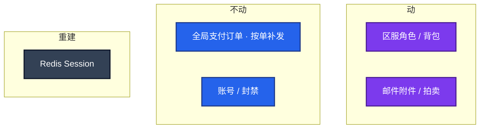
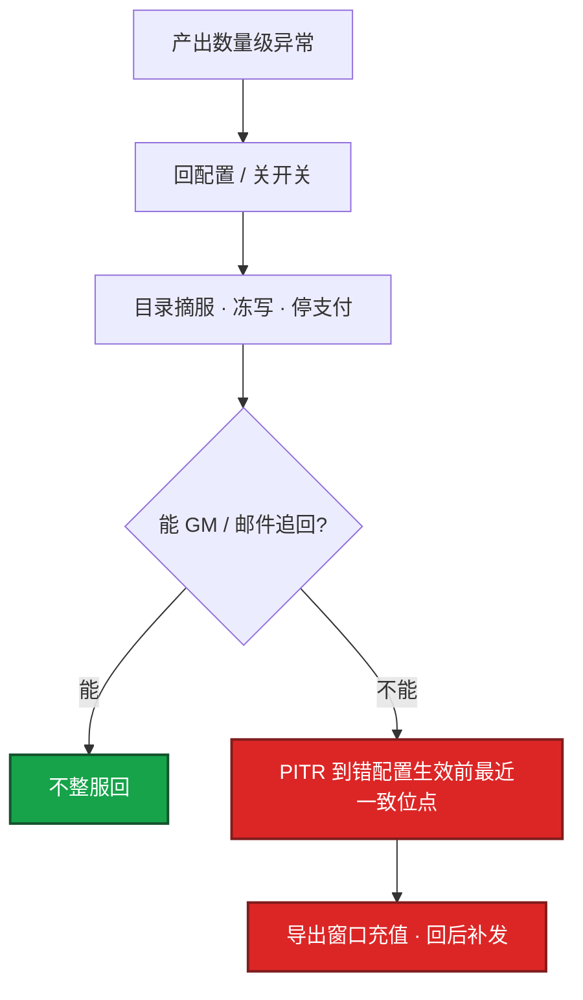
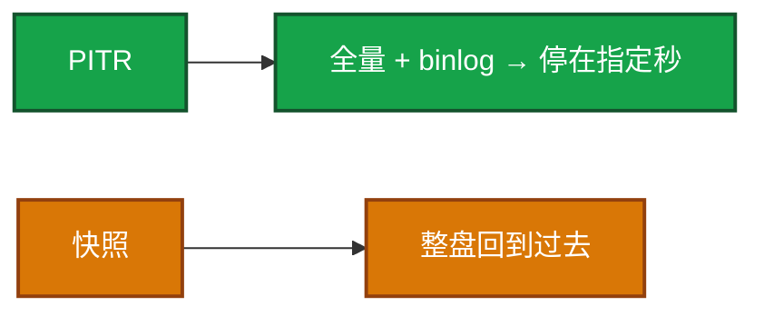

# 07｜玩家数据备份与回档 · 练习题

先对照 [知识点](知识点.md) **本章主线** 自己口述，再对答案。每题标了覆盖范围。MySQL 备份命令细节在 03-01，这里考的是游戏回档怎么圈范围。

| 标记 | 含义 |
|------|------|
| **核心** | 不懂整章就没建立起来 |
| **必会** | 值班和面试都要能讲 |
| **常用** | 线上会反复碰到 |
| **常考** | 白板和追问的高频口径 |

## 本题目录

- [Q1 RPO 分层 / Redis 不是权威](#q1)
- [Q2 圈范围 / 二次伤害](#q2)
- [Q3 禁止裸改库](#q3)
- [Q4 合服映射](#q4)
- [Q5 整服爆炸 / 位点](#q5)
- [Q6 审批与校验失败](#q6)
- [Q7 备份等于没有 / 快照 vs PITR](#q7)
- [Q8 按角色还是按服](#q8)
- [Q9 binlog 断裂](#q9)
- [Q10 聊天 / 外挂](#q10)
- [合上书](#合上书)

---

## Q1

**★★★★★｜游戏的 RPO / RTO 为什么不能套一个数？Redis 有 AOF 能不能当角色备份？**

**覆盖**：核心 · 必会 · 常考
**对应**：知识点 §3.1

### 场景

有人用「全库每日 dump、RPO 24h」套所有表。支付投诉丢单，聊天备份却把角色恢复拖到四个小时。另一边有人说 Redis 开了 AOF，角色库可以少备。

### 完整解答

**一句话**：RPO/RTO 按支付/角色/聊天分层，Redis 不是权威，只回 Redis 或只回 MySQL 都脏。

按数据类拆，不要一套 99.9% 打天下：

| 数据 | RPO | RTO | 玩家看见 |
|------|-----|-----|----------|
| 账号 / 支付 | 接近 0 | 分钟级切 | 丢单 = 资损 |
| 角色 / 背包 / 货币 | 5～15 分钟 | 单服小时级 | 进度回到过去 |
| 聊天 | 可丢 | 不挡角色 | 记录没了 |

权威在 DB。备份必须定期 restore 演练，记下真实 RTO。云盘整机回滚不是玩家级工具——会把订单、配置、不相关服务一起回。跨服发奖要有流水，才能和本服回档对齐。支付对账库和角色库策略分开，回角色时误回订单库可能重复发货。只回 MySQL、不处理窗口内已成功支付单，就是二次伤害。只回 Redis、不回 MySQL，是假恢复。

### 再追问

Redis 有 AOF 能不能当角色备份？——不能当权威。热状态允许丢，回档以库和 binlog 为准。只回 Redis、不回 MySQL，或反过来，都会脏。

---

## Q2

**★★★★★｜误操作回档怎么圈范围？怎么防二次伤害？玩家打开游戏会少什么？**

**覆盖**：核心 · 必会 · 常考
**对应**：知识点 §3.3

### 场景

14:00 GM 给错装备，14:30 该玩家充了 648，14:40 把一件装备邮给好友。有人要把角色回到 13:59。另有人准备只改道具字段。

### 完整解答

**一句话**：回档先写工单圈范围，窗口内充值必须按单补发，P2P 要产品规则防二次伤害。

写进工单再动手：`server_id + uid`、时间点 / binlog 位点、窗口内充值和交易怎么处理。能单号不整服。整服必须停写。

角色回到 13:59，玩家看见：进度回到过去；648 道具没了（钱可能已扣）→ 必须按订单补发；好友仍持有装备 → P2P 要产品规则。

回档前导出窗口内支付成功单，回后补发。留「回档前现场」备份，校验失败回到现场，不叠打更早位点。P2P 无法完美还原，要产品规则。

「只改道具字段」没有流水和脚本就是裸改。关联任务、战力会对不上。走 GM 或正式回档作业。

### 再追问

窗口内还有拍卖行成交怎么办？——回档方状态回得去，对方持有的钱或货回不来。方案里必须有产品规则，不能靠运维猜。

---

## Q3

**★★★★★｜为什么禁止生产裸改库？今晚没有 GM 系统、必须修呢？**

**覆盖**：核心 · 必会
**对应**：知识点 §4

### 场景

「背包多了一件，我 SQL 比较熟，直接 UPDATE 掉。」另一边今晚必须修，GM 系统还在发版。

### 完整解答

**一句话**：生产裸改库无审批无流水，替代是 GM 工单/补偿邮件/正式回档脚本。

裸改 = 无审批、无回放、无流水、对账链断，出事无法证明改前状态。无论改对改错，都按不合格打。

替代：GM 工单（动作编码、双人复核、写流水、可回滚补偿）；补偿邮件（加道具，不直接改余额）；变更系统里的回档脚本 + 位点 + 校验 SQL；堡垒机个人账号、会话录像。

没有 GM、今晚必须修：写脚本、双人看 diff、先镜像演练、工单后执行、留现场备份。仍然不是 `mysql` 客户端手敲 UPDATE。

### 再追问

紧急情况能不能「先改再补工单」？——不能。口头先改拒绝。整服或涉支付必须产品会签。单号低风险补偿也要值班 + 复核，不能一个人既批又执行。

---

## Q4

**★★★★★｜合服后玩家说找不到号，你怎么修？能不能按角色名撞？**

**覆盖**：必会 · 常用 · 常考
**对应**：知识点 §3.4

### 场景

合服次日客服工单仍是旧区服 + 角色名。有人按角色名在新库 LIKE 查询，准备把搜到的行「修回去」。映射表昨天没单独校验。

### 完整解答

**一句话**：合服后旧身份只认映射表，禁止按角色名 LIKE 猜，映射丢失停修。

旧身份必须走映射表到新 ID，再查库、再回档。客服、封禁、补偿同一条链路。映射丢失就停修，从合服备份找回映射。禁止角色名碰撞猜——角色名会重名，撞上就是写成别人。

合服前备份和合服后备份主键不同，用错会写成另一批人。合服当日不做无关回档。映射表单独落盘并进备份，权限高于普通业务表；和角色库一起备份，恢复流程独立校验。

### 再追问

只恢复被合入的一方，目标服上新产生的好友 / 公会怎么办？——要单独产品规则。目标服不是空白盘，不能当「把 A 服倒进 B 服」重来一遍。

---

## Q5

**★★★★★｜整服数值爆炸，回档决策怎么走？回档点怎么选？**

**覆盖**：核心 · 必会 · 常用
**对应**：知识点 §3.2

### 场景

掉落配错两小时，单服产出相对基线高了两个数量级。有人要立刻整服回档到今天 0 点的 dump。支付窗口里有成功单。

### 完整解答

**一句话**：整服数值爆炸先停产出摘服冻写，能补偿就不整服回，位点对故障开始不是 0 点 dump。

先回配置停产出、摘服冻写，再评估影响面。能补偿就补偿，不能就定点回档。有窗口充值必须进方案。产品 + 数据双签。

这不是发版问题（第 03 章先回配置），是数据问题。监控应有产出数量级告警。回档点不是「随便一个今晚的 dump」，要能 restore 验证的一致位点。

### 再追问

为什么不直接回今天 0 点？——0 点到出错前的合法进度、合法充值会被一起抹掉，二次伤害面比定点回档大。位点要对着故障开始，不是对着「好取的备份文件」。

---

## Q6

**★★★★☆｜回档作业的审批和校验步骤说一遍。校验失败怎么办？**

**覆盖**：必会 · 常用
**对应**：知识点 §6

### 场景

整服回档做到一半，抽样高 V 背包对不上。有人说再往前两个小时的 binlog 试试。值班一个人既批又跑脚本。

### 完整解答

**一句话**：回档锁范围→停写→现场→镜像演练→校验，失败回现场不叠打更早位点。

锁范围 → 停写 → 留现场 → 工单（范围 / 时间 / 支付清单 / 双人）→ 镜像演练（记下耗时 = 真 RTO）→ 生产执行 → 人数、金额、抽样高 V、支付补发、跨服流水 → 开放 → 盯经济。

校验失败：回到「回档前现场」备份，不叠打更早位点。叠打会把现场也弄脏，最后连「回到动手前」都做不到。

整服或涉支付必须产品会签。口头先改拒绝。整服回档不能一个人；权限上就不该一个人同时有审批和执行。

### 再追问

oncall 能不能把整库 dump 下到自己笔记本修？——不能。备份桶与生产账号分离，最小读权限，下载审计。作业在受控环境跑。

---

## Q7

**★★★★☆｜备份文件在，为什么还说「等于没有」？快照和 PITR 差在哪？**

**覆盖**：必会 · 常用 · 常考
**对应**：知识点 §4

### 场景

事故里第一次跑 restore，文件权限错、MySQL 版本不兼容，四个小时还没起来。有人建议直接把云盘快照滚回去。

### 完整解答

**一句话**：没 restore 演练=没有备份；玩家级用 PITR 不用整盘快照。

没做过 restore：文件坏、权限错、版本不兼容、恢复耗时超窗口，都会在事故里第一次发现。演练要记下 RTO 真值、哪份备份、谁执行、缺口。

玩家级回档用 binlog 位点或逻辑备份的时间点（PITR），不是整盘快照倒回去。快照适合机器坏了拉起实例。粒度差一个数量级：快照会把不该回的库、账号、配置一起回。

### 再追问

从库算不算备份？——普通从库会立刻复制误操作。延迟从库才能扛「几小时后才发现」。从库可以当备份源，仍要独立归档和 restore 演练。细节在 03-01。

---

## Q8

**★★★★☆｜按角色 PITR 和按服 PITR 怎么选？单号脚本什么时候升级？**

**覆盖**：核心 · 必会 · 常考
**对应**：知识点 §3.2

### 场景

GM 给错一件装备，该玩家还没把装备发出去。有人已经在准备整服 PITR。另一边掉落配错已经刷了两小时，有人还在对单个高 V 跑按角色恢复。

### 完整解答

**一句话**：单号未扩散按角色 PITR，经济全服扩散按服 PITR，做不到就升级别手改。

能补偿就不改历史。单 uid、未扩散到拍卖 / 全服经济 → **按角色**：锁号、导出该 uid 窗口流水、镜像恢复该行。经济已经全服扩散、掉落配错、库级写坏 → **按服**：摘服冻写，位点 = 错配置生效前最近一致点。

按角色的前提：能按 `server_id + uid` 抽出一致快照或行；该号一直锁写。做不到就升级，不要用 `WHERE uid=` 在主库手改当 PITR。

定期演练两种姿势：只恢复一个 `server_id`，以及抽出一个高 V。证明备份不是只有全实例。

### 再追问

外挂刷货是回档还是封禁？——先冻号、取证，和法律 / 安全 / 玩法对齐。常见是追回 + 封禁，不是整服回档。运维不手改货币、不在网关私刑。名单混了误伤 uid：先抽样核对流水再跑。

---

## Q9

**★★★☆☆｜binlog 断了一段怎么办？这还是玩家级回档吗？**

**覆盖**：必会 · 常用
**对应**：知识点 §3.2

### 场景

磁盘故障，binlog 缺了 20 分钟。有人要用单玩家回档脚本把这 20 分钟「补上」。

### 完整解答

**一句话**：binlog 断裂是存储事故，从全量+可用 binlog 恢复，玩家级脚本修不了。

按灾备：从最近全量 + 可用 binlog 恢复到断点，断点后数据视为丢失，对支付单独对账。这是存储事故，不是单玩家回档脚本能修的。玩家级脚本假定位点连续。位点断了还硬跑，会写出和谁都对不上的状态。

### 再追问

`expire_logs_days` 太短会怎样？——发现误删时 binlog 已经过期，PITR 做不了，只能退回最近全量，RPO 从分钟变成一天。保留期必须覆盖「发现到开始恢复」的窗口。见 03-01。

---

## Q10

**★★★☆☆｜聊天要不要进和角色一样的备份等级？合规留存呢？**

**覆盖**：常用 · 常考
**对应**：知识点 §3.1

### 场景

法务说聊天要留存。有人把聊天和角色库打进同一个备份桶、同一套 RTO。

### 完整解答

**一句话**：聊天和角色备份分级，合规留存和游戏回档是两套目标别混桶。

不要同一等级。聊天进角色备份链会拖慢角色 RTO、胀备份。聊天可丢或低等级。合规留存和游戏回档是两套目标：一套为了恢复可玩，一套为了审计。别混成一个桶、一次 restore。

角色回档时不要顺手把聊天 PITR 到同一秒——耗时和失败面都变大，玩家也不是为了聊天记录才等开服。

### 再追问

邮件算聊天还是算角色？——带附件、带道具的邮件算经济，跟角色走。纯聊天消息跟聊天走。回档方案里要写清邮件库在不在范围内，否则回完背包、邮件附件还在，经济仍脏。

---

## 合上书

- [ ] 能画出哪些库动、哪些不动；RPO 按支付 / 角色 / 聊天分层
- [ ] 能说回档三问，以及窗口内 648 必须按单补发
- [ ] 能区分按角色 PITR vs 按服 PITR，位点对着故障开始而不是 0 点 dump
- [ ] 能默写锁 → 现场 → 支付清单 → 镜像演练 → 校验；失败回现场不叠打
- [ ] 能说明合服只认映射表、裸改不合格、没演练 = 没有备份
- [ ] 能把快照 vs PITR、binlog 断裂 vs 玩家级脚本、聊天 vs 角色备份分开
