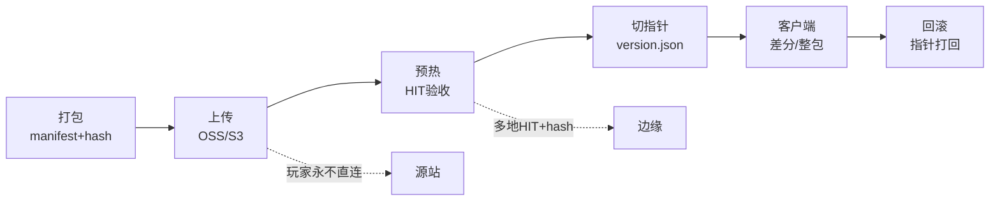
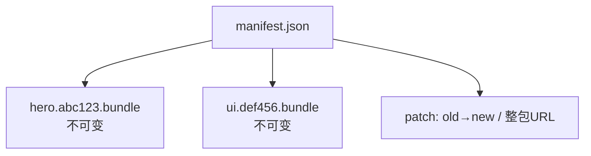
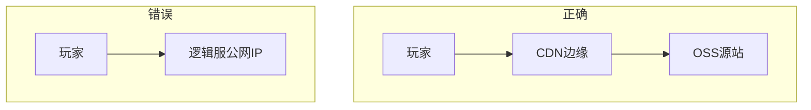
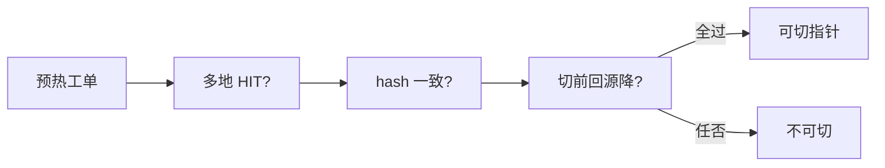
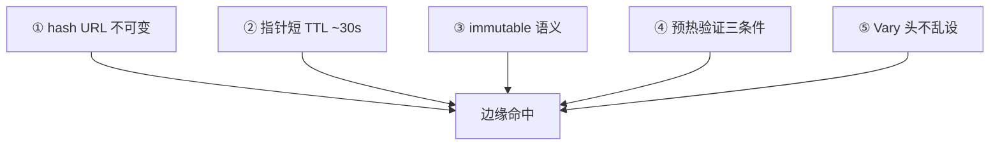
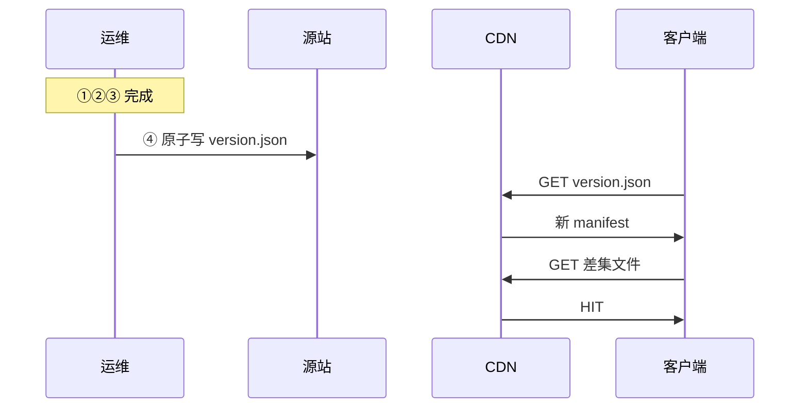
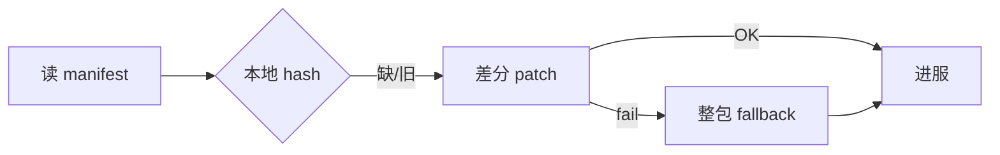
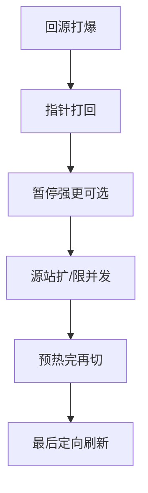
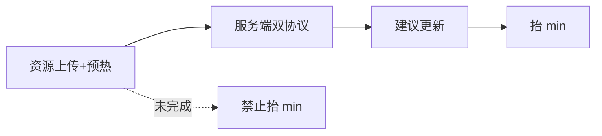
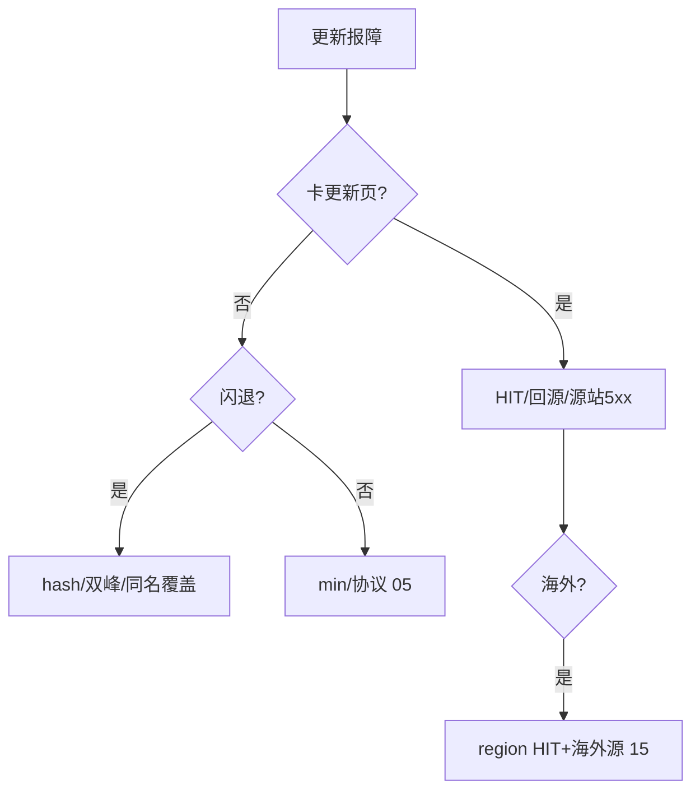

# CDN 与资源更新

> 大家好，欢迎来到这次分享。开讲之前，先带大家回到一个现场：
> 版本日玩家卡在「更新中」，源站带宽打满；登录监控全绿，下载成功率掉到 60%。群里有人要全网 purge，另有人把包挂到逻辑服 Nginx「顶一下」。
> 这一章讲完，你会知道当时「全网 purge」和「包挂逻辑服 Nginx」各自错在哪，以及资源包一生该怎么验 HIT、怎么切指针。
> **本章回答的问题**：一个资源包从打包贴 hash、上传源站、预热铺货、切指针换清单、客户端差分取页到回滚打回，每个阶段怎么验、炸了怎么止血。
> **本章不讲**：HTTP 缓存语义与 CNAME 基础 → [01-15 DNS与CDN](../../01-基础底座/15-DNS与CDN/)；热更协议与 min_client_version → [05](../05-热更新与版本发布/)；登录排队 → [02](../02-登录排队与选服/)；加速器与 CC 对抗 → [12](../12-游戏网络与对抗/)；海外多 region → [15](../15-出海与多区域/)。

**标记**：🎯重点 · 🔥难点 · ⭐常考 · 🔧实操

**怎么听这场分享**：先把第一节「资源包的一生」看熟——打包→上传→预热→切指针→客户端→回滚；第二到第七节顺着这条线走，第八到第十节补多 CDN、强更协同与下载线监控；第十一节专门讲开头那个版本日现场怎么定责。每一节讲完会提示对应练习题，趁热打铁。

---

## 一、一张图：资源包的一生

> 🎯 **一句话**：资源包的一生 = 打包贴 hash → 上传源站 → 预热铺货 → 切指针 → 客户端差分取页 → 回滚打回。



**读图**：下载和登录是两条路——人卡在更新页，扩逻辑服没用；登录绿、下载红 = CDN 事故。没有箭头从玩家指向源站；逻辑服 Nginx 顶大包 = 把源站暴露给全球。监控分阶段：上传看源站同步，预热看 HIT/回源带宽，切指针后看下载成功率与版本分布，回滚先看指针是否打回。


好，主图装进脑子了。接下来咱们从「打包」开始——manifest 与 content hash。

本节对应练习题 Q1。

---

## 二、打包：manifest 与 content hash ⭐

> 🎯 **一句话**：每个资源文件 URL **带 content hash**（如 `hero.abc123.bundle`），内容变 = 新 URL，不是同名覆盖。

**manifest**（资源清单）列出逻辑路径 → 物理 URL → sha256 → 大小。客户端对比本地缓存 hash，只拉**差集**。**指针** `version.json` 很小，告诉客户端当前 manifest 版本号。

打包产出检查：

- 所有文件 hash 与 manifest 一致（CI 校验）。
- 差分包基于上一版 manifest 生成，失败 fallback 指向整包 URL。
- 四元组与 [05](../05-热更新与版本发布/) 对齐：资源指针 version 与 `min_client_version`、服务端协议兼容同一变更单。



**读图**：manifest 是「目录」；每个文件是不可变对象（immutable）。差分 patch 校验失败必须能改走整包——关整包入口 = 差分失败的人永远进不了服。

> ⚠️ **别混**：**manifest version**（指针里的版本号）≠ **单个文件 hash**——切指针改的是 version，文件层靠 hash URL immutable。

> 📝 **面试**：「资源 URL 带 content hash，同名覆盖是边缘分裂和闪退的根源。差分必须有整包兜底。」


打包讲完。hash 贴好了，上传到哪？玩家永不直连源站。

本节对应练习题 Q2、Q6。

---

## 三、上传：源站与 OSS

> 🎯 **一句话**：源站（OSS/S3）只给 CDN 回源——上传完成且 hash 校验通过后才进入预热；**先切指针再传包 = 全球回源**。

上传检查：

- 全量文件齐、manifest 中每条 URL 可 HEAD 200。
- 源站 **Cache-Control** 正确：文件 `public, max-age=31536000, immutable`；指针短 TTL（第五节）。
- 源站鉴权：预热和玩家拉包用**相同鉴权方式**抽检——鉴权过严 → miss 时 403 → 客户端当损坏重下。

下载域名独立：`res.example.com` → CDN → OSS。**禁止**包体挂逻辑服公网 IP——版本日临时 Nginx 顶一下，第二天高防和带宽账单爆炸。



**读图**：逻辑入口应在高防后且不提供大文件。源站隐藏 behind CDN，运维调试走内网或带鉴权管理入口，不进客户端配置。

> 🔍 **现场**：上传完成验收。

```bash
# manifest 与源站一致
curl -s "https://oss-internal/manifest-2.5.json" | jq '.files[0]'
curl -sI "https://res.example.com/bundles/hero.abc123.bundle" | grep -iE 'HTTP/|ETag'
sha256sum /tmp/hero.abc123.bundle
```

```text
{"path":"bundles/hero.bundle","url":".../hero.abc123.bundle","sha256":"e3b0..."}
HTTP/2 200
ETag: "abc123"
# ← 200 且 ETag/hash 与 manifest 一致才可预热
```


上传讲完。大家想想：文件在 OSS 上了，能不能立刻切 version.json？很多人会答「能」——⭐ 这是高频错答。下一节预热 HIT 验收。

本节对应练习题 Q3。

---

## 四、预热：HIT 验收 ⭐🔥

大家想想：OSS 上传成功 = 可以切指针吗？很多人会答「可以，CDN 会回源」——错了。🔥 回源打爆 = 全渠道卡在「更新中」，登录监控还能全绿。

> 🎯 **一句话**：预热成功 = **多地 HIT + hash 一致 + 切指针前源站回源带宽已降**——厂商工单绿勾不够。

预热范围至少：指针、manifest 索引、体积最大的 N 个包、各渠道主包。**URL 必须和客户端完全一致**（scheme、大小写、path；query 部分 CDN 忽略 → 缓存键分裂）。

验收三步：

1. 多 region `curl -sI` 见 `X-Cache: HIT`。
2. `curl | sha256sum` 与 manifest 一致。
3. 源站回源带宽在**切指针前**已下降——切完才降 = 玩家在帮你预热。



**读图**：预热 URL 和客户端真实 URL 差一个 query = 白预热。大版本提前**数小时**预热，盯厂商配额排队。海外 region 要**独立预热**——国内 HIT ≠ 全球可切（[15](../15-出海与多区域/)）。

> 💡 **打个比方**：预热像把货铺到各城市门店——工单说「已发货」但货架空着，开门营业（切指针）后顾客（客户端）全会涌向总仓（源站）。

> 🔍 **现场**：

```bash
URL="https://res.example.com/bundles/hero.abc123.bundle"
curl -sI "$URL" | grep -iE 'HTTP/|X-Cache|Age|Cache-Control'
curl -s "$URL" | sha256sum
```

```text
HTTP/2 200
X-Cache: HIT
Age: 842
Cache-Control: public, max-age=31536000, immutable
# ← 文件层正确

e3b0c44298fc1c149afbf4c8996fb92427ae41e4649b934ca495991b7852b855  -
# ← 与 manifest sha256 一致
```

> ⚠️ **别混**：**预热工单成功** ≠ **可以切指针**——必须对客户端真实 URL 抽检。

> 📝 **面试**：「预热验收三地：HIT、hash、切前回源降。海外独立预热，国内完不等于全球可切。」

### 收束：CDN 凭什么命中 🔥

预热只是把货铺好；真正让命中率稳的是**五件套**配合——缺一件就漏：



**读图**（分组记忆）：**文件层**管不变——① hash URL 换内容换 URL，边缘不会新旧并存；③ immutable 让 CDN/浏览器放心长缓存，不用回源验证。**指针层**管可变——② 短 TTL 让切指针分钟级全球生效。**操作层**管可靠——④ 预热保证切指针即 HIT；⑤ Vary 头不乱设，否则缓存键爆炸。

**immutable 语义**：CDN 和浏览器可假设对象永不变——换内容必须换 URL。勿对 hash URL 做 purge「刷新」——换 hash 即可。

**Vary 头**：若错误设置 `Vary: User-Agent` 而客户端 UA 分散，缓存键爆炸 → 命中率崩。游戏静态资源通常不需要 Vary。

**HTTP/2 / HTTP/3**：多路复用减少连接数，但不减少回源**字节数**——大版本日仍靠预热，不是协议升级替代。

> ⚠️ **别混**：**Vary 头**不是越多越安全——`Vary: User-Agent` 在游戏场景会分裂缓存键，命中率暴跌；静态资源不设 Vary。

> 📝 **面试**：「CDN 命中靠五件套：hash 不可变、指针短 TTL、immutable、预热验证、Vary 不乱设。记忆分组：文件层（hash+immutable）管不变，指针层（短TTL）管可变，操作层（预热+Vary）管可靠。」


预热讲完。记住口诀：**多地 HIT + hash 对上才切指针**。下一节原子切换。

本节对应练习题 Q4、Q5。

---

## 五、切指针：原子切换 ⭐🔥

⭐ 这是面试必考。🔥 大白话：**指针（version.json）短 TTL，文件长 TTL + 内容 hash**——回滚打指针，不要靠 purge 全世界。

> 🎯 **一句话**：**指针短 TTL、文件长 TTL**——`version.json` 常见 max-age **30s**；文件带 hash 常见 **31536000 + immutable**；发布六步最后才切指针。

发布六步：

1. 文件全部上传，hash 与 manifest 一致
2. 预热并抽检 HIT + hash
3. 服务端已兼容该资源协议（[05](../05-热更新与版本发布/)）
4. **原子切换**小指针
5. 观察下载成功率、回源、崩溃、**端资源版本分布**
6. 失败：指针打回，**不删**源站新文件



**读图**：指针被边缘长 TTL 缓存 → 你以为切了，部分边缘仍吐旧清单 → 版本分布**双峰**、闪退。灰度指针用**独立文件名**（`version-canary.json`），勿与全量共用长 TTL URL。

> 💡 **打个比方**：指针短 TTL = 餐厅门口的「今日菜单」每天换；文件长 TTL = 菜单上每道菜的做法永远不变。改菜换菜单（指针），不改做法（hash URL）。

> ⚠️ **别混**：**指针 TTL 长**（以为切了边缘还旧清单）≠ **文件 TTL 长**（hash URL 正确做法）——两者必须相反策略。

运维与研发对齐的 HTTP 头契约（写进发布 runbook）：

```text
/bundles/*.@hash@.bundle  → Cache-Control: public, max-age=31536000, immutable
/version.json             → Cache-Control: public, max-age=30
/version-canary.json      → Cache-Control: public, max-age=30（独立 URL）
/manifest-*.json          → Cache-Control: public, max-age=300（可选中 TTL）
```

错配 `no-cache` on 文件层 → 每次 miss 回源。错配 pointer 长 TTL → 切了边缘不更新。

Origin 响应 **Content-Length** 与 **Accept-Ranges** 要与客户端下载器一致——Range 异常会导致差分 patch 合成失败率上升。

> 📝 **面试**：「指针短（~30s）快失效，文件长（31536000）+immutable。发布六步最后才切指针，失败打回不删文件。」


切指针讲完。客户端怎么取差分、失败怎么 fallback？

本节对应练习题 Q7。

---

## 六、客户端：差分与 fallback 🔥

> 🎯 **一句话**：差分失败率上升时，容量按**最坏整包 × 峰值启动**留应急——失败 30% 在容量上就是整包洪峰。

客户端流程：拉指针 → 比 hash → 尝试 patch → 校验 → 失败则**整包 URL**。必须：

- patch 校验失败自动 fallback 整包
- 404 on manifest 条目 → **停重试**（防死循环）
- 超时 **指数退避**
- 源站对单 URL QPS 设顶（防重试第二放大器）



**读图**：运营关整包入口「省带宽」→ 差分失败玩家永远卡在更新页。灰度时盯**兜底比例**，不只报平均下载体积。

> 💡 **打个比方**：差分像只买新出的几页贴进旧画册；整包 fallback = 贴不上就整本重买。关掉整包入口 = 画册缺页的人永远看不完。

建议客户端策略（与运维容量对齐）：

```text
manifest 404     → 停重试，提示「维护中」
hash 失败        → 最多 3 次后 fallback 整包
超时             → 指数退避 1s/2s/4s/8s，上限 60s
TLS 错误         → 停重试，提示检查系统时间/网络
```

源站侧：单 URL QPS 上限、总出带宽告警、回源连接数上限——重试是**第二放大器**，与 [12](../12-游戏网络与对抗/) CC 下载区分。

> 📝 **面试**：「差分失败不能关整包。容量按最坏整包算。404 停重试，超时退避。」


客户端讲完。炸了怎么打回？下一节指针回滚。

本节对应练习题 Q7、Q10。

---

## 七、回滚：指针打回 ⭐🔥

大家想想：资源坏了第一刀是全网 purge 吗？很多人会答「是，清掉就好」——⭐ 这是高频错答。正确是**指针打回上一版**，旧 hash 文件还在边缘。

> 🎯 **一句话**：资源更新失败**先回指针**到上一份已预热 manifest——不删源站新文件；CDN 炸时**不叠抬 min**、不加投放、不扩逻辑服。

回源打爆四条件（同时满足才炸）：

1. 新对象大或文件多
2. 边缘无缓存（未预热 / 先切指针）
3. 同时启动客户端多（版本日/商店推送）
4. 源站扛不住

止血顺序：

1. 指针打回上一份**已预热** manifest
2. 或暂停强制更新（旧资源协议兼容则允许进服）
3. 源站扩/限下载并发
4. 预热完、多地 HIT，再切回新指针
5. **最后**才定向刷新确认脏的少量 URL——**不要全网 purge**（主动制造全球 miss）



**读图**：purge 会更糟——全员 miss 再打源站。CDN 炸时抬 `min_client_version` = 客诉不可分，无法判断 CDN 还是强更问题。排队人数假性偏低（人还没登录），不要加买量。

> ⚠️ **别混**：**回源打爆**（源站带宽/5xx 先响）≠ **TLS 失败**（证书到期，回源带宽往往不高）——看板要分开。

切备 CDN：不只改 CNAME——同一批 hash URL 在备上预热、证书覆盖下载域名、防盗链在备上回源也要通。

> 📝 **面试**：「回滚先回指针不删文件。回源四条件同时满足才炸。止血五步，全网 purge 是最差选项。」


回滚讲完。现在再看群里「全网 purge / 挂逻辑服 Nginx」，你知道错在哪了。下一节多 CDN 与防盗链。

本节对应练习题 Q12。

---

## 八、多 CDN、防盗链与 Range 🔧

> 🎯 **一句话**：**切备 CDN 不只改 CNAME**——证书、防盗链、缓存键、预热接口各家不同；主备同一批 hash URL 都要 HIT 验收。

多 CDN 切换清单：

1. 备 CDN 上预热**同一批** hash URL（不是只预热指针）
2. 证书覆盖 `res.example.com`（TLS 失败像更新失败，易与回源打爆混）
3. 防盗链 / 时间戳鉴权在备上回源配置一致
4. 切完盯下载成功率 + HIT，不盯「CNAME 已改」
5. 主备都 miss 时切 CNAME **没用**——先回指针

源站 **403/401** 在 miss 时触发：客户端表现为「损坏重下」→ 重试放大。预热和抽检必须带与客户端相同的 Referer / 签名 query / Cookie。

**Range 请求**：客户端分片下载若 Range 无限制，回源连接数可能翻倍——源站或 CDN 侧设合理 Range 策略，与差分 patch 策略对齐。

**回源盾**（Origin Shield）：全球 miss 收成少数节点回源——盾 miss 时源站仍吃一波，不能替代预热。

> 🔍 **现场**：备 CDN 抽检。

```bash
# 换域名或 Host 抽检备 CDN
curl -sI "https://res-backup.example.com/bundles/hero.abc123.bundle" \
  | grep -iE 'HTTP/|X-Cache'
```

```text
HTTP/2 200
X-Cache: HIT
# ← 备 CDN 也要 HIT 再切流
```

```bash
# 对比边缘 vs 源站 ETag
curl -sI "$URL" | grep -iE 'ETag|X-Cache'
curl -sI "$OSS_INTERNAL_URL" | grep -iE 'ETag'
```

```text
ETag: "abc123"
X-Cache: HIT
# ← 边缘与源 ETag 一致；不一致可能是中间层改写或同名覆盖
```


多 CDN 讲完。和强更、灰度怎么协同？

本节对应练习题 Q9。

---

## 九、与强更、灰度的协同 ⭐

> 🎯 **一句话**：资源 CDN 就绪是**强更两段抬闸**的前置（[05](../05-热更新与版本发布/)）——CDN 炸时不要叠抬 `min`；资源灰度用独立指针，观察崩溃相对基线 ×2 停。



**读图**：`min` 抬起后大量老端被挡在登录——若 CDN 同时 miss，新端也下不完包，客诉不可分。投放（买量）在下载成功率恢复前**不加**——排队人数假性偏低。

**灰度资源指针**示例：

```json
{
  "version": "2.5.0-canary",
  "manifest_url": "https://res.example.com/manifest-2.5.0-canary.json",
  "min_patch": "2.4.0"
}
```

全量指针仍为 `version.json`（短 TTL）；canary 用户拉 canary manifest——两套 URL 不可共用同一长 TTL 缓存键。混 URL 是版本双峰常见根因。

渠道包（iOS/Android 各渠道）manifest 可能不同——预热清单按**渠道维度**各验一遍 HIT。

客户端 **Store 渠道包**与 **CDN 热更资源**是两条更新路径：Store 包走商店；进游戏后走 CDN 指针——版本日两个看板都要看。


协同讲完。下载线要独立看板——别和登录绿混为一谈。

本节对应练习题 Q8、Q13。

---

## 十、监控与看板：下载线独立 ⭐

> 🎯 **一句话**：版本日指挥台必须**下载线**和**登录线**并排——登录成功率、下载成功率、回源带宽、端资源版本分布、崩溃率（分 canary）。

| 指标 | 说明 | 告警 |
|------|------|------|
| `download_success_rate` | 更新流程成功 / 尝试 | 小于 99% P1 |
| `cdn_origin_bandwidth` | 源站出带宽 | 接近上限 P0 |
| `cdn_hit_ratio` | 边缘命中率 | 切指针后骤降 |
| `client_resource_version` | 端 manifest 版本分布 | 双峰 |
| `patch_fallback_ratio` | 差分失败走整包比例 | 突增 |

> 🔍 **现场**：

```bash
curl -s 'http://prom:9090/api/v1/query?query=sum(rate(download_success_total[5m]))/sum(rate(download_attempt_total[5m]))'
curl -s 'http://prom:9090/api/v1/query?query=sum(rate(patch_fallback_total[5m]))/sum(rate(patch_attempt_total[5m]))'
```

```text
0.612
# ← 下载成功率 61% → CDN 线 P0，与登录无关

0.28
# ← 28% 走整包兜底 → 容量按整包峰值检
```

版本分布双峰：优先查指针 TTL 过长、灰度 URL 与全量混用、海外未预热——不是先怪客户端。

**CC 下载攻击**（[12](../12-游戏网络与对抗/)）：更新页 QPS 异常高但带宽正常 → 可能是恶意拉小 manifest；源站限 QPS + WAF，不是无限 CDN 带宽。

**带宽计费 vs 请求数计费**：游戏大包体关注**字节出账**；小 manifest 高频关注**请求数**——两个预算都要版本日前检查。


监控齐了。下一节把版本日卡更新现场收成定责。

本节对应练习题 Q13。

---

## 十一、作战：资源更新定责 🔧

> 🎯 **一句话**：「卡在更新页」先查 CDN HIT/回源，不是登录；「部分地区闪退」查 hash 与同名覆盖；「更新完进不去服」查 min/协议（[05](../05-热更新与版本发布/)），不是叠抬 min 修 CDN。

### 定责决策树



### 失败码分流

| 失败码 | 含义 | 先做 |
|--------|------|------|
| manifest 404 | 指针切了文件未到 | 回指针，补文件 |
| hash 失败 | 内容不一致 | 查同名覆盖、源未同步 |
| 超时 | miss 或源慢 | 回指针/限回源 |
| TLS/403 | 证书或防盗链 | 修鉴权，别当回源打爆 |

### 边缘异常模式速查

| 现象 | 常见根因 | 第一刀 |
|------|----------|--------|
| 全球同时慢 | 先切指针未预热 | 指针打回 |
| 仅海外慢 | 海外无源/未预热 | region 预热 |
| 随机 hash 失败 | 同名覆盖/源不同步 | 查 ETag 一致性 |
| manifest 404 循环 | 指针切了文件缺 | 回指针补文件 |
| TLS 全失败 | 证书到期 | 修证书，非扩源站 |
| 差分失败飙升 | patch 错/Range 问题 | 盯 fallback 比例 |

### 60 秒剧本 🔧

```text
① 0–10s  登录绿吗？绿→CDN线；下载成功率/回源带宽
② 10–30s  curl HIT/hash；源站5xx；版本分布是否双峰
③ 30–45s  回源四条件齐？→ 指针打回
④ 45–60s  禁止 purge/抬min/扩逻辑服；备CDN先预热
```

> 🔍 **现场**：

```bash
curl -sI "https://res.example.com/version.json" | grep -iE 'X-Cache|HTTP/|Cache-Control'
curl -sI "https://res.example.com/bundles/hero.abc123.bundle" | grep -iE 'X-Cache|Age'
# 源站回源带宽（云监控或 Prometheus）
```

```text
HTTP/2 200
X-Cache: MISS
Cache-Control: public, max-age=30
# ← 指针 MISS = 刚切或未预热；文件层 MISS = 回源打爆前兆
```


定责剧本齐了。收口把命令、面试口径和数字墙收齐。

本节对应练习题 Q11、Q14。

---

## 十二、收口

### 命令速查 🔧

```bash
URL="https://res.example.com/bundles/hero.abc123.bundle"
curl -sI "$URL" | grep -iE 'HTTP/|X-Cache|Age|Cache-Control'
curl -s "$URL" | sha256sum
curl -sI "https://res.example.com/version.json" | grep -iE 'X-Cache|Cache-Control'
```

### 面试锚点

遮住右列自问自答，卡壳的行回去重读对应小节——能讲出来才算会，看着答案点头不算。

| 问 | 30 秒答 |
|----|---------|
| 资源更新一生？ | 打包hash→上传→预热→切指针→客户端差分→回滚。 |
| 指针 vs 文件 TTL？ | 指针短(~30s)；文件hash长+immutable。 |
| 发布顺序？ | 上传→预热→服务端兼容→切指针。 |
| 回源打爆四条件？ | 大/无缓存/同时启动/源站扛不住。 |
| 止血先做什么？ | 回已预热指针；不全网purge。 |
| 预热怎么验？ | 多地HIT+hash+切前回源降。 |
| hash URL vs 覆盖？ | 新内容新URL；覆盖导致边缘分裂。 |
| 差分失败？ | 必须整包fallback；容量按最坏算。 |
| 下载 vs 登录？ | 两条路；更新页不扩逻辑服。 |
| CDN炸能抬min吗？ | 不能；不叠强更。 |
| CDN命中五件套？ | hash不可变+指针短TTL+immutable+预热验证+Vary不乱设。 |

### 易错一句话对照

- 更新页扩逻辑服 → 查CDN
- 回源打爆先purge → 先回指针
- 预热工单绿=可切 → 还要HIT+hash
- 文件指针同TTL → 指针短文件长
- 同名覆盖+purge → 用hash URL
- 关整包省带宽 → 差分失败永远进不了
- CDN炸抬min → 客诉不可分
- 失败删源站新文件 → 回指针即可
- 切备只改CNAME → 备上先预热
- 国内预热完切全球 → 海外独立预热

### 带宽与成本预案

版本日前检查：

- CDN **出带宽峰值**预算 vs 预估（整包 fallback 比例 × DAU × 包大小）
- 源站 **回源带宽**上限与自动扩容策略
- 请求数计费 CDN 的 **manifest QPS** 上限（小文件高频）

成本优化不能牺牲 fallback——关整包省带宽是假省钱。

### 数字墙

> 指针 TTL **30s** · 文件 max-age **31536000** + **immutable** · 差分失败 **30%** 按整包容量 · 预热提前**数小时** · 回源四条件**同时满足**才炸 · 客户端退避 1s/2s/4s/8s 上限 60s · 源站单 URL QPS 上限

**与 [01-15 DNS与CDN](../../01-基础底座/15-DNS与CDN/) 的边界**：缓存语义、CNAME、DNS 解析在那章。本章只讲**游戏资源发布生命周期**与值班止血。游戏特有约束三条：**指针/文件分层 TTL**、**hash 不可变 URL**、**差分+整包 fallback 容量**——通用 CDN 文档往往不写这三条。

---

## 合上书

学到这里，先别急着翻下一章。合上书，试试下面这几件事能不能做到——能做到，这章才算真的听懂了。卡住的那一条，就回到对应的小节再听一遍：

- [ ] **默画主图**：打包→上传→预热→切指针→客户端→回滚；标源站不露脸。
- [ ] **口述指针短、文件长**的原因与典型 TTL 数字。
- [ ] **口述发布六步**顺序；失败为何打回指针不删文件。
- [ ] **口述回源四条件**与止血五步；为何不全网 purge。
- [ ] **口述预热验收三条件**；工单绿为何不够。
- [ ] **口述 hash URL vs 同名覆盖**后果。
- [ ] **口述差分与整包 fallback**；关整包为何错。
- [ ] **区分回源打爆 vs TLS**；国内 HIT vs 出海 miss。
- [ ] **CDN 炸时**为何不抬 min、不加投放、不扩逻辑服。
- [ ] **口述 CDN 命中五件套**与记忆分组。
- [ ] **切备 CDN**要验什么；canary 指针 URL 为何不能与全量共用长 TTL 缓存键。
- [ ] **版本日指挥台**为何必须下载线+登录线并排。

全部打勾之后，给自己出一个终极测试：找一位同事，十分钟讲清本章开头那个现场——错在哪、正确第一刀是什么。讲得下来，这章才算过关。

下一章：[玩家数据备份与回档](../09-玩家数据备份与回档/)。上一章：[停服维护](../07-停服维护与不停机更新/)。
