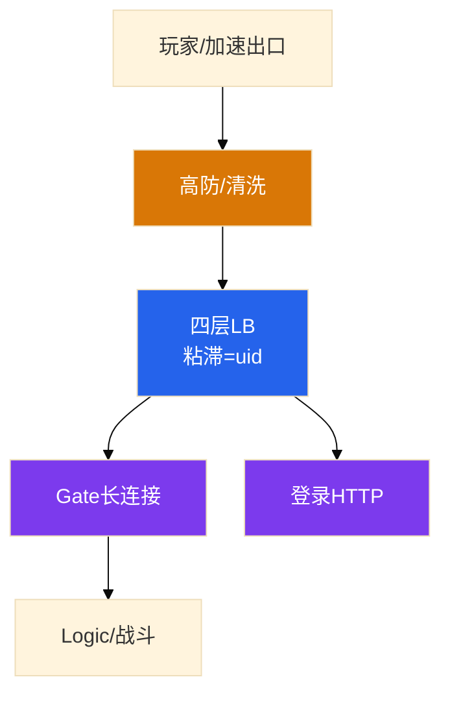

# 游戏网络与对抗


开服只有一台 Gate 冒烟，其余空转。带宽才 20%，新玩家进不去——有人要加网卡，另有人要把该出口 IP 当爬虫封掉。**容量报稳态连接+CPS，粘滞跟 uid，UDP 超时先看防护。**

**本章主线（入口事故就按这三步想）：**

1. **容量**：fd → 内存 → Tick → 队列 → PPS → 下游；带宽剩余≠还能加连接。
2. **粘滞**：跟 uid/token，不跟源 IP；加速器万人一出口会打满单台 Gate。
3. **对抗**：先分 DDoS（带宽/SYN）和 CC（登录/下载）；弱网重连走快通道，不进登录队。

**读完你能：** 画高防→LB→Gate；判断加速器汇聚还是 fd 满；TCP 通 UDP 不通先看高防/SG。

## 本章目录

- [1. 基本概念](#1-基本概念)
- [2. 架构图](#2-架构图)
- [3. 原理](#3-原理)
- [4. 落地](#4-落地)
- [5. 核心配置](#5-核心配置)
- [6. 命令与操作](#6-命令与操作)
- [7. 生产排障](#7-生产排障)
- [8. 必会 · 常考](#8-必会--常考)
- [合上书](#合上书问自己)

**本章不讲：** TCP/UDP 内核参数 → [01-13](../../01-基础底座/13-TCP与UDP/)；抓包 → [01-16](../../01-基础底座/16-网络排障与抓包/)；登录排队 → [04](../04-登录排队与选服/)；下载 CC → [06](../06-CDN与资源更新/)；出海延迟 → [10](../10-出海与多区域/)。

---

## 1. 基本概念

登录多是 HTTPS，战斗常是 TCP，部分实时玩法是 UDP/KCP。高防、LB、Gate 每一跳都能把「网络问题」变成不同事故。

**值班里什么时候碰到：**

| 现象 | 技术含义 | 你的第一刀 |
|------|----------|------------|
| 带宽 20%、新玩家进不去 | fd/CPS 满，不是带宽 | `ss` + fd limit |
| 一台 Gate 冒烟 | 加速器汇聚 | 粘滞改 uid |
| TCP 登录通、UDP 战斗不通 | 高防/SG 丢 UDP | 边界抓包（02-11） |
| 创角≈0、无投放 | CC 登录 | 排队+验证码（04） |

| 角色 | 干什么 |
|------|--------|
| **高防** | 挡带宽、SYN、UDP flood |
| **LB** | 分连接；粘滞必须跟 uid/token |
| **Gate** | epoll 长连接；有状态第一跳 |

外挂也走同一条路。运维：识别、限流、隔离、留证据。**不在 Gate 上随手 drop。**

> **记住：** 容量报两个数：稳态连接 + CPS。带宽剩余不表示还能加连接。

**面试怎么说**：「开服入口我先报稳态连接和 CPS。粘滞跟 uid 不跟源 IP——加速器万人一出口会打满单台 Gate。」

---

## 2. 架构图



**读图三句话：**

1. 粘滞跟 uid——加速器把万人汇成几个出口 IP；从 LB 配置进。
2. TCP 登录通 ≠ UDP 战斗通；防护升级常默丢 UDP。
3. GM/DB/K8s API 零公网；游戏公网只留玩家入口和 CDN。

---

## 3. 原理

### 3.1 稳态连接 + CPS

**一句话：** 开服 CPS 比存量 CCU 更容易先炸；fd 满是新连接失败，Tick 满是连着无回包。

**打个比方**：Gate 像酒店——**房间钥匙（fd）有限，带宽空着不代表还能接客；开服像开业一刻涌进的人（CPS）比在场人数（CCU）更先打满前台**。

**现场走一遍**（开服 5 分钟，带宽 20%，新玩家进不去）：

1. 跳板机：

```bash
ls /proc/<gate_pid>/fd | wc -l
cat /proc/<gate_pid>/limits | grep 'open files'
ss -lnt | grep ':9000'
nstat -az | grep -iE 'ListenOverflows|ListenDrops'
```

2. 屏幕：

```text
48102
Max open files            65535                65535                files
48102
ListenOverflows: 12847
```

3. fd 48000+/65535，`ListenOverflows` 涨 → **新 SYN 排队或丢弃**。
4. 带宽 20% 空闲 → 带宽剩余 ≠ 还能加连接。
5. 止血：扩 Gate、改粘滞 uid、开排队（04），不是加网卡。

卡点顺序：fd → 每连接内存 → Tick → somaxconn/SYN → PPS → 下游慢。

**面试怎么说**：「fd 满是新连接失败；Tick 满是连着但无回包——两种现象止血完全不同。心跳 1 秒更稳是错的，会打爆 CPU。」

### 3.2 加速器与粘滞

**一句话：** 四层 hash 源 IP → 单 Gate 冒烟；修复在应用层 uid 绑定。

**打个比方**：加速器像把万人装进同一辆大巴——**LB 若按车牌（源 IP）分配酒店，整辆车的人都去同一家，其他酒店空转**。

**现场走一遍**（开服三台 Gate，只有 gate-02 连接 4.8 万，其余 2000）：

1. LB 配置：`sessionAffinity: ClientIP`。
2. 加速器出口 IP 段集中 → 99% 新连接 hash 到 gate-02。
3. gate-02 fd 打满；gate-01/03 空闲。
4. 有人要封该出口 IP → 误杀真玩家。
5. 修复：粘滞改 uid/token；和加速厂商要出口段，高防单独阈值。

**面试怎么说**：「粘滞按源 IP 最稳是错的。开服 3 万 CCU 可能被 2000 CPS 打穿——CPS 和 CCU 都要报。」

### 3.3 UDP / KCP

**一句话：** KCP 在用户态可靠，防火墙上仍是 UDP；TCP 通 UDP 不通先看边界。

**打个比方**：KCP 像给明信片加重试机制——**邮局仍按明信片（UDP）投递，不会 magically 变成挂号信（TCP）**。

**现场走一遍**（玩家：登录正常，进房间全超时）：

1. 客户端：登录 HTTPS 200；战斗 UDP 9001 全超时。
2. 内网 `nc -u battle.internal 9001` 通；公网超时。
3. 边界抓包（02-11）：SYN 出了，UDP 9001 无回包。
4. 查高防/SG：策略升级后 UDP 未显式放行 → 默丢。
5. 不要先杀战斗进程——有状态 = 随机判负。

| 词 | 运维做什么 |
|----|------------|
| nodelay/窗口 | **不调**；窗口过大=突发 UDP 打满清洗 |
| 握手/conv | LB 能拿会话 ID 更好；拿不到就 uid |

**面试怎么说**：「KCP 可靠所以按 TCP 配防火墙是错的。UDP 超时先查高防/SG，不先重启战斗。」

### 3.4 DDoS vs CC

**一句话：** DDoS 打入口带宽/SYN；CC 打业务登录/下载——都切高防是错的。

**打个比方**：DDoS 像洪水灌门；CC 像真人排队狂点——**关大门（drop）真玩家和攻击一起埋；CC 要验票（排队/验证码）**。

**现场走一遍**（高防绿勾，创角成功率≈0，无投放）：

1. 带宽正常，高防面板「攻击已清洗」。
2. 登录 QPS 正常，创角 QPS 为 0；验证码服务 503。
3. 这是 **CC 登录/创角**，不是 DDoS。
4. 止血：排队（04）、验证码只拦创角、按账号限流。
5. 清洗误伤：看**清洗后登录成功率**，不看厂商绿勾。

| 类型 | 打什么 | 动作 |
|------|--------|------|
| 带宽/SYN/UDP flood | 入口、高防 | 切高防、清洗 |
| 连接耗尽 | Gate fd、LB | 限 CPS、扩 Gate |
| CC 登录 | 账号、验证码 | 排队、按账号限（04） |
| CC 下载 | CDN 源站 | 回指针（06） |

限流三层：边缘挡洪水 → 排队器挡过量进服 → 应用挡单账号异常。

**面试怎么说**：「DDoS 和 CC 都切高防是错的。运维不在 Gate drop 外挂——无法审计错杀。弱网重连走快通道，不进登录队。」

---

## 4. 落地

| 项 | 选 | 不选 |
|----|----|------|
| 粘滞 | uid/token | 源 IP 哈希 |
| 容量 | 稳态+CPS 都报 | 只报带宽% |
| UDP | 高防/SG 按协议放行并抽检 | 假设 TCP 通 UDP 通 |
| 公网面 | 玩家入口+CDN | GM/DB/K8s API 公网 |

新高防 VIP：HTTPS、TCP 长连接、UDP **三条分别探**。

---

## 5. 核心配置

| 参数 | 改错会怎样 |
|------|------------|
| LB 粘滞=源 IP | 单 Gate 冒烟 |
| 心跳 1s | 打爆 CPU |
| LB 空闲超时<心跳 | 集体断线、重连风暴 |
| UDP 未显式放行 | 策略升级默丢 |
| conntrack 不足 | 新连接失败像 DDoS |

---

## 6. 命令与操作

```bash
ls /proc/<gate_pid>/fd | wc -l
cat /proc/<gate_pid>/limits | grep 'open files'
ss -lnt | grep ':port'
nstat -az | grep -iE 'ListenOverflows|ListenDrops'
ethtool -S eth0 | grep -iE 'drop|discard|error'
```

典型输出（fd 接近上限）：

```text
48231
Max open files            65535                65535                files
ListenOverflows: 8934
```

| 字段 | 说明 |
|------|------|
| fd count | 接近 limit → 新连接失败 |
| `ListenOverflows` | 涨 → 全连接队列满（见 02-06） |
| 单 Gate 连接数 | 若其它 Gate 空 → 查粘滞/加速器 |

| 目的 | 看什么 |
|------|--------|
| fd 满？ | 接近 limit → 新连接失败 |
| Tick 满？ | 无回包、CPU 单核 100% |
| UDP 进机房？ | 边界抓包（02-11） |
| 加速器？ | 单 Gate 冒烟+单出口海量连接 |

### 切高防

当变更；切换后盯 CPS 和登录成功率；重连走快通道；按协议分别验 TCP/UDP。

### 外挂隔离

可做：限流、验证码、排队、隔离熔断服、日志留存交安全。
不可做：Gate 随意 drop；改战斗数值「制裁」。

---

## 7. 生产排障

| 现象 | 先做 | 别做 |
|------|------|------|
| 带宽 20%、新玩家进不去 | fd/CPS/队列 | 加网卡 |
| 一台 Gate 冒烟 | 加速器、改粘滞 uid | 按单 IP 封死 |
| TCP 通、UDP 全超时 | 高防/SG UDP；抓包 | 先杀战斗进程 |
| 创角≈0、无投放 | CC：排队+验证码 | 关验证码当开服正常 |
| 高防无告警、新连接失败 | conntrack | 只加清洗带宽 |
| GM 公网被刷、登录仍绿 | 收管理面 | 用登录成功率判后台 |

现场顺序：**fd/CPS → 每 Gate 分布 → TCP vs UDP → 高防/CC/conntrack**。

---

## 8. 必会 · 常考

| 说法 | 对错 | 口径 |
|------|:----:|------|
| 带宽有余量就能加连接 | 错 | 报稳态+CPS |
| 粘滞按源 IP 最稳 | 错 | 加速器万人一出口 |
| KCP 可靠所以按 TCP 配防火墙 | 错 | 底层仍是 UDP |
| TCP 通了 UDP 就通 | 错 | 高防常默丢 UDP |
| UDP 超时先重启战斗 | 错 | 有状态=随机判负 |
| DDoS 和 CC 都切高防 | 错 | CC 走业务限流 |
| 运维在 Gate drop 外挂 | 错 | 无法审计错杀 |
| 心跳 1 秒更稳 | 错 | 打爆 CPU |

数字：Gate 舒适区 **2～5 万**连接；心跳短于 NAT **30～60s**；3 万 CCU 可能被 **2000 CPS** 打穿。

---

## 合上书，问自己

1. 容量报哪两个数？fd 满和 Tick 满怎么分？
2. 加速器怎样把开服打到一台 Gate？
3. KCP 在防火墙上是什么？
4. DDoS、CC、开服洪峰、conntrack 怎么分？
5. 弱网重连为什么不进登录队？
6. 外挂运维做什么、不做什么？

六题能口述，这一章就过了。下一章：[游戏 SRE 稳定性](../09-游戏SRE稳定性/)。
